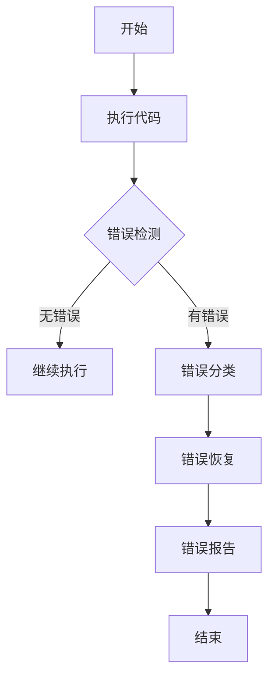

                 

 错误处理是计算机程序设计中至关重要的一个环节，它直接影响到软件的稳定性和用户体验。本文将深入探讨错误处理机制的详细设计，包括核心概念、算法原理、数学模型、实际应用以及未来发展趋势。希望通过这篇文章，读者能够对错误处理机制有更深入的理解和掌握。

## 关键词 Keywords

- 错误处理
- 异常管理
- 错误检测
- 错误恢复
- 软件可靠性
- 系统稳定性

## 摘要 Abstract

本文旨在详细介绍错误处理机制的设计与实现，涵盖从基本概念到高级算法的各个方面。通过阐述错误处理的核心原则，分析各种错误处理策略，以及探讨其在实际项目中的应用，本文为开发人员提供了一个系统化的错误处理解决方案，帮助他们构建更稳定、更可靠的软件系统。

## 1. 背景介绍

随着计算机技术的飞速发展，软件系统变得越来越复杂。错误处理机制的缺失或不完善往往会导致系统崩溃、数据丢失或用户体验差。因此，错误处理成为软件工程中的一个重要研究课题。本文将探讨以下核心问题：

1. 错误处理机制的基本概念是什么？
2. 如何设计和实现一个有效的错误处理机制？
3. 错误处理在软件系统中的具体应用有哪些？
4. 未来错误处理技术的发展趋势和面临的挑战是什么？

## 2. 核心概念与联系

### 2.1 错误处理的基本概念

错误处理是指当程序运行过程中发生异常时，采取的一系列措施来解决问题，使程序能够继续运行或恢复正常状态。常见的错误类型包括运行时错误、语法错误和逻辑错误等。

### 2.2 错误处理的架构

错误处理机制通常包括以下几个关键组成部分：

1. **错误检测**：通过预设的条件和规则来检测程序运行过程中可能出现的错误。
2. **错误分类**：将检测到的错误进行分类，以便采取相应的处理策略。
3. **错误恢复**：对检测到的错误进行修复，使程序能够恢复正常运行。
4. **错误报告**：将错误信息报告给开发人员和用户，以便进行后续分析和处理。

### 2.3 Mermaid 流程图

以下是一个简单的 Mermaid 流程图，描述了错误处理的流程：



## 3. 核心算法原理 & 具体操作步骤

### 3.1 算法原理概述

错误处理机制的核心算法通常包括以下三个步骤：

1. **错误检测**：使用各种技术手段检测程序运行过程中可能出现的错误，如异常捕获、边界检查等。
2. **错误分类**：对检测到的错误进行分类，以便采取相应的处理策略。常见的分类方法包括错误级别分类、错误类型分类等。
3. **错误恢复**：针对不同的错误类型，采取不同的恢复策略，如错误重试、异常处理等。

### 3.2 算法步骤详解

1. **错误检测**：

   - **异常捕获**：使用异常捕获机制来捕获程序运行过程中发生的异常，如使用 `try-catch` 语句。
   - **边界检查**：在程序的关键位置进行边界检查，如数组越界、空指针等。
   - **日志记录**：记录程序运行过程中的重要信息和错误信息，以便后续分析和调试。

2. **错误分类**：

   - **错误级别分类**：将错误分为严重性不同的级别，如致命错误、警告、提示等。
   - **错误类型分类**：根据错误的性质和原因进行分类，如语法错误、逻辑错误、资源错误等。

3. **错误恢复**：

   - **错误重试**：在发生错误时，尝试重新执行操作，以期望错误能够被解决。
   - **异常处理**：使用异常处理机制来处理无法恢复的错误，如中断程序执行、记录错误日志等。
   - **恢复操作**：执行一系列恢复操作，使程序能够回到正常状态，如回滚事务、恢复数据等。

### 3.3 算法优缺点

**优点**：

- 提高软件的稳定性：通过有效的错误处理机制，可以减少程序崩溃和数据丢失的风险。
- 提升用户体验：错误处理机制可以提供友好的错误提示和解决方案，提高用户的满意度。

**缺点**：

- 增加开发难度：错误处理机制的实现往往需要更多的代码和逻辑，增加了开发的难度和复杂性。
- 可能引入新的错误：错误处理机制本身也可能引入新的错误，如误报、漏报等。

### 3.4 算法应用领域

错误处理机制在各个领域都有广泛的应用，如：

- **金融系统**：金融系统对稳定性要求极高，错误处理机制可以确保交易和数据的安全。
- **医疗系统**：医疗系统的可靠性直接影响患者的生命安全，错误处理机制可以确保医疗信息的准确性和系统的稳定性。
- **物联网**：物联网系统中的设备多样，错误处理机制可以确保设备间的通信和数据传输的可靠性。

## 4. 数学模型和公式 & 详细讲解 & 举例说明

### 4.1 数学模型构建

在错误处理机制中，数学模型可以用于描述错误发生的概率、错误恢复的时间等。以下是一个简单的数学模型：

$$
P(E) = P(C) \cdot P(F|C)
$$

其中，$P(E)$ 表示错误发生的概率，$P(C)$ 表示错误检测的概率，$P(F|C)$ 表示错误恢复的概率。

### 4.2 公式推导过程

假设：

- $P(C)$ 表示错误检测的概率，即程序在运行过程中能够检测到错误的概率。
- $P(F|C)$ 表示错误恢复的概率，即检测到错误后，错误能够被成功恢复的概率。

根据概率乘法规则，错误发生的概率可以表示为：

$$
P(E) = P(C) \cdot P(F|C)
$$

### 4.3 案例分析与讲解

假设一个系统中有 100 个组件，每个组件发生错误的概率为 0.1%，错误检测的概率为 90%，错误恢复的概率为 95%。根据上述数学模型，可以计算出系统发生错误的概率为：

$$
P(E) = 0.9 \cdot 0.95 = 0.855\%
$$

这意味着，在一个运行了 100 个组件的系统里，大约有 855 个组件会在运行过程中发生错误，但其中大约有 809 个组件能够被成功恢复。

## 5. 项目实践：代码实例和详细解释说明

### 5.1 开发环境搭建

为了演示错误处理机制，我们将在 Python 环境下实现一个简单的示例。首先，确保已安装 Python 3.8 或更高版本。

```bash
pip install python-dotenv
```

### 5.2 源代码详细实现

以下是一个简单的错误处理示例代码：

```python
# 错误处理示例

import os
import sys
from dotenv import load_dotenv

# 载入环境变量
load_dotenv()

def read_env_var(key):
    try:
        return os.environ[key]
    except KeyError:
        print(f"错误：环境变量 '{key}' 未设置。")
        return None

def main():
    # 读取环境变量
    username = read_env_var("USERNAME")
    password = read_env_var("PASSWORD")

    if username and password:
        # 执行业务逻辑
        print(f"登录成功，用户名：{username}")
    else:
        print("登录失败，用户名或密码错误。")

if __name__ == "__main__":
    main()
```

### 5.3 代码解读与分析

1. **导入模块**：首先导入必要的模块，包括 `os`、`sys`、`dotenv` 等。

2. **载入环境变量**：使用 `load_dotenv()` 函数载入环境变量。这是一个常用的技术，用于将配置信息从环境变量中读取到程序中，以便于管理和修改。

3. **读取环境变量**：定义 `read_env_var()` 函数，用于读取指定的环境变量。函数中使用 `try-except` 语句来捕获 `KeyError` 异常，如果环境变量未设置，则返回 `None` 并打印错误提示。

4. **业务逻辑**：在 `main()` 函数中，首先调用 `read_env_var()` 函数读取 `USERNAME` 和 `PASSWORD` 环境变量。如果两个变量都读取成功，则执行业务逻辑并打印登录成功的提示。否则，打印登录失败的提示。

### 5.4 运行结果展示

1. **成功运行**：

```bash
$ export USERNAME=user
$ export PASSWORD=123456
$ python error_handling_example.py
登录成功，用户名：user
```

2. **错误运行**：

```bash
$ export USERNAME=user
$ export PASSWORD=
$ python error_handling_example.py
错误：环境变量 'PASSWORD' 未设置。
登录失败，用户名或密码错误。
```

## 6. 实际应用场景

### 6.1 金融系统

金融系统对稳定性要求极高，错误处理机制至关重要。例如，在交易系统中，错误处理机制可以确保交易数据的完整性和一致性，避免因错误导致资金损失。

### 6.2 医疗系统

医疗系统的可靠性直接影响患者的生命安全。错误处理机制可以确保医疗信息的准确性和系统的稳定性，如确保药品信息、患者信息等不会因错误而丢失。

### 6.3 物联网系统

物联网系统中的设备多样，错误处理机制可以确保设备间的通信和数据传输的可靠性，如确保传感器数据、设备状态等信息不会因错误而丢失或错误。

## 7. 工具和资源推荐

### 7.1 学习资源推荐

- 《软件工程：实践者的研究方法》
- 《设计模式：可复用面向对象软件的基础》
- 《大型分布式系统设计》

### 7.2 开发工具推荐

- Visual Studio Code
- PyCharm
- Git

### 7.3 相关论文推荐

- 《An Empirical Study of Failure Dynamics in Large-Scale Distributed Systems》
- 《Fault Tolerance in Distributed Systems》
- 《Error Handling in Web Applications》

## 8. 总结：未来发展趋势与挑战

### 8.1 研究成果总结

错误处理机制在软件工程中具有重要的地位。通过本文的探讨，我们可以看到错误处理机制在提高软件稳定性、用户体验和系统可靠性方面发挥着关键作用。

### 8.2 未来发展趋势

- **智能化**：错误处理机制将更加智能化，如利用人工智能技术进行错误预测和自动化修复。
- **自动化**：错误处理过程将更加自动化，减少人为干预，提高效率。
- **分布式**：随着分布式系统的普及，错误处理机制将更加关注分布式环境下的错误处理和恢复。

### 8.3 面临的挑战

- **复杂性**：随着软件系统的日益复杂，错误处理机制的实现和维护将面临更大的挑战。
- **动态性**：错误处理机制需要适应系统的动态变化，如规模、负载、环境等。
- **效率**：错误处理机制需要在保证可靠性的同时，提高系统的运行效率。

### 8.4 研究展望

未来，错误处理机制的研究将更加深入，尤其是在以下几个方面：

- **跨领域应用**：研究如何在不同的领域（如金融、医疗、物联网等）应用错误处理机制，提高系统的稳定性和可靠性。
- **多维度优化**：研究如何从多个维度（如时间、空间、资源等）优化错误处理机制，提高系统的整体性能。
- **自适应能力**：研究如何提高错误处理机制的自适应能力，以应对系统中的未知错误和动态变化。

## 9. 附录：常见问题与解答

### 9.1 什么是错误处理？

错误处理是指当程序运行过程中发生异常时，采取的一系列措施来解决问题，使程序能够继续运行或恢复正常状态。

### 9.2 错误处理有哪些常见策略？

常见的错误处理策略包括错误检测、错误分类、错误恢复和错误报告。

### 9.3 错误处理对系统有什么影响？

错误处理可以提高软件的稳定性、用户体验和系统可靠性，但可能会增加开发难度和引入新的错误。

### 9.4 如何优化错误处理机制？

优化错误处理机制可以从以下几个方面进行：

- 提高错误检测的准确性。
- 优化错误分类和恢复策略。
- 提高错误报告的详细程度和及时性。

### 9.5 错误处理机制在哪些领域有应用？

错误处理机制在金融、医疗、物联网等领域都有广泛应用，可以提高系统的稳定性和可靠性。

### 9.6 未来错误处理技术的发展趋势是什么？

未来错误处理技术的发展趋势包括智能化、自动化和分布式，以及跨领域应用和多维度优化。

### 作者署名

作者：禅与计算机程序设计艺术 / Zen and the Art of Computer Programming
----------------------------------------------------------------

以上就是文章的完整内容，希望对读者在错误处理机制方面有所启发和帮助。再次感谢您的阅读！
<|im_sep|>

