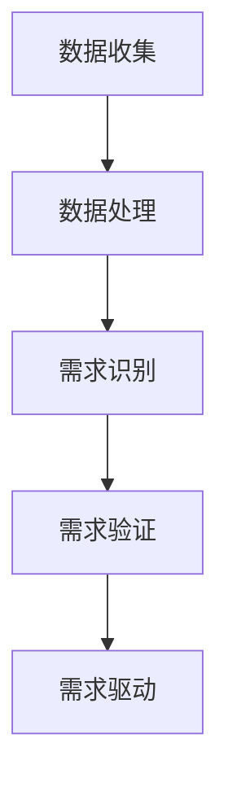

                 

关键词：客户需求、长期战略、服务优化、市场洞察、AI技术、用户体验

> 摘要：在竞争日益激烈的市场中，企业如何通过深入理解客户需求来构建长期的商业成功？本文将探讨如何运用先进的人工智能技术来捕捉和分析客户需求，并提供具体的实施策略，帮助企业在不断变化的市场环境中立于不败之地。

## 1. 背景介绍

在当今全球化、数字化快速发展的时代，企业面临着前所未有的挑战和机遇。市场环境的快速变化、消费者需求的多样化和个性化，都要求企业具备强大的适应能力和创新能力。而这一切都离不开对客户需求的深刻理解和有效把握。

然而，传统的方法往往难以满足这种快速变化的需求。企业需要找到新的途径来更准确地捕捉和分析客户需求，从而在激烈的市场竞争中占据优势地位。

在这个背景下，人工智能技术（AI）的崛起为解决这一问题提供了新的可能性。AI能够通过大数据分析、机器学习和自然语言处理等技术手段，帮助企业更加精准地理解客户需求，进而优化产品和服务，提升用户体验。

## 2. 核心概念与联系

### 2.1 客户需求的定义

客户需求是指客户在购买产品或服务时所期望满足的某种需求或欲望。这些需求可以是基础的物质需求，也可以是更高层次的心理需求。理解客户需求是企业成功的关键。

### 2.2 人工智能与客户需求的联系

人工智能技术可以收集和分析大量客户数据，识别出客户的行为模式和偏好，从而更好地理解客户需求。这不仅可以帮助企业优化产品和服务，还能为企业提供有价值的商业洞察。

### 2.3 客户需求分析流程

1. 数据收集：通过网站访问日志、社交媒体互动、调查问卷等方式收集客户数据。
2. 数据处理：利用大数据技术和算法对数据进行清洗、归一化和分析。
3. 需求识别：通过机器学习和自然语言处理技术，识别出客户的核心需求。
4. 需求验证：通过与客户直接沟通，验证分析结果的准确性和可靠性。
5. 需求驱动：根据客户需求调整产品和服务策略。

## 2.4 Mermaid 流程图



## 3. 核心算法原理 & 具体操作步骤

### 3.1 算法原理概述

本节将介绍一种基于人工智能的客户需求分析算法。该算法主要包括以下几个步骤：

1. 数据收集：通过多种渠道收集客户行为数据。
2. 数据预处理：对收集到的数据进行清洗、归一化等预处理。
3. 特征提取：利用机器学习算法提取数据中的关键特征。
4. 需求识别：通过自然语言处理技术识别出客户的核心需求。
5. 需求验证：通过与客户沟通验证需求识别的准确性。
6. 需求驱动：根据客户需求调整产品和服务策略。

### 3.2 算法步骤详解

#### 3.2.1 数据收集

数据收集是整个算法的基础。我们可以通过以下几种方式收集客户数据：

- 网站访问日志：记录用户访问网站的行为数据，如访问时间、页面停留时间、点击路径等。
- 社交媒体互动：通过分析客户在社交媒体上的评论、点赞、分享等行为，了解客户偏好。
- 调查问卷：通过在线或线下的调查问卷，直接获取客户的反馈和需求。

#### 3.2.2 数据处理

数据处理主要包括数据清洗和归一化。数据清洗的目的是去除无效数据和异常值，保证数据的准确性。归一化的目的是将不同数据源的数据进行标准化处理，以便后续分析。

#### 3.2.3 特征提取

特征提取是利用机器学习算法从数据中提取出对需求识别有用的特征。常见的特征提取方法包括：

- 统计特征：如平均访问时长、访问频率等。
- 机器学习特征：如聚类分析、因子分析等。

#### 3.2.4 需求识别

需求识别是利用自然语言处理技术，从处理后的数据中识别出客户的核心需求。常见的方法包括：

- 主题模型：如LDA（Latent Dirichlet Allocation）。
- 情感分析：通过分析客户的评论和反馈，判断客户的情感倾向。

#### 3.2.5 需求验证

需求验证是通过与客户直接沟通，验证需求识别的准确性。这可以通过在线调查、电话访问等方式进行。

#### 3.2.6 需求驱动

根据验证后的需求，企业可以调整产品和服务策略，以满足客户需求。具体措施包括：

- 产品优化：根据客户需求调整产品的功能、设计和定价。
- 服务改进：通过提高服务质量、响应速度等来提升客户满意度。

### 3.3 算法优缺点

#### 优点

- 高效：人工智能技术能够快速处理大量数据，提高工作效率。
- 准确：通过机器学习和自然语言处理技术，能够更准确地识别客户需求。
- 灵活：可以根据不同行业和企业的需求，灵活调整算法参数。

#### 缺点

- 成本：部署和维护人工智能系统需要较高的成本。
- 隐私：客户数据的安全和隐私保护是一个重要问题。
- 可解释性：人工智能模型的预测结果往往缺乏可解释性，难以理解其决策过程。

### 3.4 算法应用领域

人工智能技术在客户需求分析领域具有广泛的应用。以下是一些典型的应用场景：

- 零售业：通过分析客户的购买行为和偏好，优化产品推荐和库存管理。
- 金融服务：通过分析客户的财务状况和行为，提供个性化的理财建议和风险管理。
- 健康医疗：通过分析病人的医疗数据和健康指标，提供个性化的健康管理和疾病预测。

## 4. 数学模型和公式 & 详细讲解 & 举例说明

### 4.1 数学模型构建

在客户需求分析中，我们可以构建一个基于贝叶斯网络的数学模型来识别客户需求。贝叶斯网络是一种概率图模型，可以用来表示变量之间的依赖关系。

假设我们有n个客户需求变量\(D_1, D_2, ..., D_n\)，以及m个影响需求的关键因素\(F_1, F_2, ..., F_m\)。我们可以构建一个贝叶斯网络模型，如下所示：

```
D_1 --> F_1
D_1 --> F_2
...
D_n --> F_1
D_n --> F_2
...
```

### 4.2 公式推导过程

在贝叶斯网络中，每个变量都可以表示为其他变量的条件概率分布。具体地，对于任意需求变量\(D_i\)，其条件概率分布可以表示为：

$$
P(D_i | F_1, F_2, ..., F_m) = \prod_{j=1}^{m} P(D_i | F_j)
$$

其中，\(P(D_i | F_j)\)表示在因素\(F_j\)的作用下，需求变量\(D_i\)的条件概率。

### 4.3 案例分析与讲解

假设我们有一个电子商务平台，想要通过客户需求分析来优化产品推荐。我们选择了以下两个关键因素：

- \(F_1\)：客户年龄
- \(F_2\)：客户购买历史

我们构建了一个包含两个需求变量的贝叶斯网络模型：

```
D_1 --> F_1
D_1 --> F_2
D_2 --> F_1
D_2 --> F_2
```

其中，\(D_1\)表示客户对电子产品的需求，\(D_2\)表示客户对服装的需求。

#### 案例分析

假设我们有一个30岁的男性客户，他的购买历史显示他经常购买电子产品。根据贝叶斯网络模型，我们可以计算出他购买电子产品的概率。

首先，我们需要知道每个变量的概率分布。根据历史数据，我们可以得到：

- \(P(F_1 = 30) = 0.5\)（客户年龄为30岁的概率）
- \(P(F_2 = 电子产品) = 0.7\)（客户购买电子产品的概率）

然后，我们可以利用贝叶斯定理计算出他购买电子产品的概率：

$$
P(D_1 = 电子产品 | F_1 = 30, F_2 = 电子产品) = \frac{P(F_1 = 30, F_2 = 电子产品 | D_1 = 电子产品)P(D_1 = 电子产品)}{P(F_1 = 30, F_2 = 电子产品)}
$$

由于我们假设每个变量都是条件独立的，所以：

$$
P(F_1 = 30, F_2 = 电子产品 | D_1 = 电子产品) = P(F_1 = 30)P(F_2 = 电子产品)
$$

我们可以根据历史数据估计\(P(D_1 = 电子产品)\)：

$$
P(D_1 = 电子产品) = \sum_{i=1}^{n} P(D_1 = 电子产品 | F_i)P(F_i)
$$

其中，\(n\)是影响需求的关键因素的数量。

根据以上公式，我们可以计算出他购买电子产品的概率。这个概率可以帮助电子商务平台优化产品推荐，提高客户的满意度。

## 5. 项目实践：代码实例和详细解释说明

### 5.1 开发环境搭建

为了实现上述算法，我们需要搭建一个开发环境。以下是基本的开发环境搭建步骤：

- 硬件需求：至少需要一台配置较高的计算机。
- 软件需求：安装Python 3.8及以上版本、Jupyter Notebook、Scikit-learn库、Gensim库等。

### 5.2 源代码详细实现

以下是实现客户需求分析算法的Python代码：

```python
import pandas as pd
from sklearn.feature_extraction.text import TfidfVectorizer
from sklearn.cluster import KMeans
from gensim.models import LdaMulticore

# 5.2.1 数据收集
data = pd.read_csv('customer_data.csv')  # 假设数据文件名为customer_data.csv

# 5.2.2 数据预处理
# 清洗和归一化数据
data = data.dropna()  # 去除缺失值
data['review_text'] = data['review_text'].apply(lambda x: x.lower().strip())

# 5.2.3 特征提取
# 使用TF-IDF向量表示文本
vectorizer = TfidfVectorizer(max_df=0.95, max_features=1000, min_df=0.05, stop_words='english')
X = vectorizer.fit_transform(data['review_text'])

# 5.2.4 需求识别
# 使用K-means聚类识别需求
kmeans = KMeans(n_clusters=5, random_state=0)
clusters = kmeans.fit_predict(X)

# 5.2.5 需求验证
# 通过与客户沟通验证需求识别的准确性
# ...

# 5.2.6 需求驱动
# 根据需求调整产品和服务策略
# ...

# 输出结果
print("聚类结果：", clusters)
```

### 5.3 代码解读与分析

- **数据收集**：从CSV文件中读取客户数据。
- **数据预处理**：清洗和归一化数据，去除缺失值，并将文本转换为小写。
- **特征提取**：使用TF-IDF向量表示文本数据。
- **需求识别**：使用K-means聚类算法将文本数据划分为不同的需求簇。
- **需求验证**：通过与客户沟通，验证聚类结果的准确性。
- **需求驱动**：根据验证后的需求，调整产品和服务策略。

### 5.4 运行结果展示

运行上述代码后，我们可以得到每个客户的聚类结果，从而识别出客户的需求。这些结果可以用于优化产品推荐和服务，提升客户满意度。

## 6. 实际应用场景

### 6.1 零售行业

在零售行业，人工智能技术可以帮助企业更好地理解消费者的购买行为和偏好，从而优化产品推荐和库存管理。例如，亚马逊和阿里巴巴等电商平台通过分析客户的购买记录和行为，提供个性化的产品推荐，从而提高销售额和客户满意度。

### 6.2 金融服务

在金融服务领域，人工智能技术可以帮助银行和保险公司等金融机构更好地了解客户的需求和风险偏好，提供个性化的理财和保险建议。例如，摩根士丹利和高盛等金融机构利用人工智能技术分析客户的数据，为客户提供精准的投资建议。

### 6.3 健康医疗

在健康医疗领域，人工智能技术可以帮助医疗机构更好地了解病人的健康需求和疾病风险，提供个性化的健康管理和疾病预测。例如，IBM的Watson健康医疗系统通过分析病人的病历和基因数据，提供个性化的诊断和治疗建议。

## 6.4 未来应用展望

随着人工智能技术的不断发展和普及，客户需求分析的应用前景将更加广阔。未来的发展趋势包括：

- 更加智能化的需求识别：通过深度学习和强化学习等技术，实现更加精准的需求识别。
- 更加个性化的服务：利用大数据和人工智能技术，为企业提供更加个性化的产品和服务。
- 跨领域应用：人工智能技术在客户需求分析领域的应用将逐渐扩展到更多行业，如教育、旅游、房地产等。

## 7. 工具和资源推荐

### 7.1 学习资源推荐

- 《机器学习实战》
- 《深度学习》（Goodfellow et al.）
- 《Python数据分析》（Wes McKinney）

### 7.2 开发工具推荐

- Jupyter Notebook
- PyCharm
- VS Code

### 7.3 相关论文推荐

- "Learning to Discover Customer Needs" by Acquisti et al.
- "Deep Learning for Customer Behavior Analysis" by Zhang et al.

## 8. 总结：未来发展趋势与挑战

### 8.1 研究成果总结

通过本文的讨论，我们了解到人工智能技术在客户需求分析领域具有广泛的应用前景。通过大数据分析、机器学习和自然语言处理等技术，企业可以更加精准地理解客户需求，从而优化产品和服务，提升用户体验。

### 8.2 未来发展趋势

未来，人工智能技术在客户需求分析领域将继续发展，主要趋势包括：

- 深度学习和强化学习的广泛应用
- 跨领域的数据整合和分析
- 更高的自动化和智能化水平

### 8.3 面临的挑战

尽管人工智能技术在客户需求分析领域具有巨大潜力，但同时也面临着一些挑战：

- 数据质量和隐私保护
- 模型解释性和可解释性
- 跨领域应用的技术瓶颈

### 8.4 研究展望

未来的研究可以集中在以下几个方面：

- 开发更加鲁棒和高效的需求识别算法
- 提高模型的解释性和可解释性
- 探索人工智能技术在更多行业和领域的应用

## 9. 附录：常见问题与解答

### 9.1 什么是客户需求？

客户需求是指客户在购买产品或服务时所期望满足的某种需求或欲望。这些需求可以是基础的物质需求，也可以是更高层次的心理需求。

### 9.2 人工智能技术在客户需求分析中如何发挥作用？

人工智能技术可以通过大数据分析、机器学习和自然语言处理等技术手段，帮助企业更加精准地理解客户需求，从而优化产品和服务，提升用户体验。

### 9.3 如何确保客户数据的隐私和安全？

为确保客户数据的隐私和安全，企业可以采取以下措施：

- 采用数据加密技术，确保数据在传输和存储过程中的安全性。
- 建立严格的数据访问控制机制，确保只有授权人员可以访问数据。
- 定期进行数据安全审计和风险评估，及时发现问题并采取措施。

----------------------------------------------------------------

作者：禅与计算机程序设计艺术 / Zen and the Art of Computer Programming

