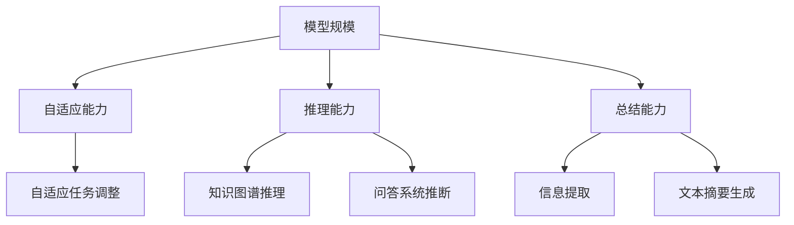

                 

关键词：大模型，总结，推理，技术博客，人工智能，计算机编程，深度学习，自然语言处理，数学模型，应用场景

> 摘要：本文深入探讨了大型模型的总结与推理能力，通过梳理其核心概念、算法原理、数学模型、应用场景，以及相关的实践案例，全面分析了大型模型在人工智能领域的潜力和挑战。文章旨在为读者提供一份系统而全面的技术指南，帮助理解大模型的强大之处和未来的发展趋势。

## 1. 背景介绍

随着人工智能技术的迅猛发展，尤其是深度学习和自然语言处理领域的突破，大型模型（Large Models）逐渐成为研究的热点。这些模型以其巨大的参数规模和强大的学习能力，在图像识别、文本生成、机器翻译等方面取得了显著的成果。然而，大型模型不仅带来了技术上的革新，也引发了关于其推理能力和总结能力的探讨。

总结（Summarization）是指将大量信息提取出关键内容，并以简洁明了的方式呈现出来。推理（Reasoning）则是指模型能够基于已知信息推断出新的结论。这两个能力在人工智能领域尤为重要，因为它们直接影响模型的智能水平和实际应用价值。

本文将围绕大型模型的总结与推理能力展开讨论，首先介绍核心概念和联系，然后详细解析核心算法原理与具体操作步骤，接着分析数学模型和公式，并通过实际项目实践进行代码实例和详细解释。最后，我们将探讨实际应用场景，并展望未来发展趋势与挑战。

## 2. 核心概念与联系

为了更好地理解大模型的总结与推理能力，我们首先需要明确几个核心概念：

### 2.1. 模型规模（Model Scale）

模型规模是指模型中参数的数量。近年来，随着计算能力和数据资源的大幅提升，模型的规模也在迅速扩大。例如，GPT-3拥有超过1750亿个参数，是目前最大的自然语言处理模型。

### 2.2. 自适应（Adaptability）

自适应能力是指模型能够根据不同的任务和数据集进行快速调整和优化。大模型通常具有更强的自适应能力，能够在多种应用场景中表现出色。

### 2.3. 推理能力（Reasoning Ability）

推理能力是指模型能够基于已知信息进行逻辑推断，从而得出新的结论。这在知识图谱、问答系统等领域尤为重要。

### 2.4. 总结能力（Summarization Ability）

总结能力是指模型能够从大量信息中提取出核心内容，并以简洁的方式呈现。这对于信息过载的现代社会尤为重要。

下面是大型模型核心概念和联系的一个 Mermaid 流程图：



通过这个流程图，我们可以清晰地看到各个核心概念之间的联系和作用。

## 3. 核心算法原理 & 具体操作步骤

### 3.1. 算法原理概述

大型模型的总结与推理能力主要依赖于深度学习技术和自然语言处理（NLP）方法。其中，深度学习模型（如 Transformer、BERT 等）通过学习大规模的语料库，能够捕捉语言中的复杂模式和关系。而 NLP 方法则包括文本预处理、实体识别、关系提取等，这些方法共同作用于大型模型，使其具备强大的总结与推理能力。

### 3.2. 算法步骤详解

#### 3.2.1. 模型训练

模型训练是大型模型总结与推理能力的基础。具体步骤如下：

1. 数据预处理：对原始文本进行清洗、分词、去停用词等操作，使其适合模型训练。
2. 模型选择：选择合适的深度学习模型，如 Transformer、BERT 等。
3. 模型训练：通过反向传播算法和梯度下降优化模型参数，使其在训练集上达到较好的性能。
4. 模型验证：在验证集上评估模型性能，调整超参数，防止过拟合。

#### 3.2.2. 总结能力实现

总结能力主要通过文本摘要生成方法实现。具体步骤如下：

1. 文本输入：输入一段长文本作为输入。
2. 模型推理：利用训练好的模型对文本进行编码，提取出文本的特征向量。
3. 模型解码：根据特征向量生成摘要文本。
4. 摘要优化：对生成的摘要进行优化，提高其质量。

#### 3.2.3. 推理能力实现

推理能力主要通过知识图谱和问答系统实现。具体步骤如下：

1. 知识图谱构建：构建包含实体和关系的知识图谱。
2. 模型训练：利用知识图谱训练推理模型。
3. 问答系统：接收用户问题，利用推理模型生成答案。

### 3.3. 算法优缺点

#### 3.3.1. 优点

1. 强大的总结能力：能够从大量信息中提取出关键内容，生成高质量的摘要。
2. 优秀的推理能力：能够基于已知信息进行逻辑推断，得出新的结论。
3. 广泛的应用领域：适用于文本处理、知识图谱、问答系统等多种场景。

#### 3.3.2. 缺点

1. 计算资源消耗大：训练和推理过程需要大量的计算资源。
2. 过拟合风险：在训练过程中容易受到数据噪声的影响，导致过拟合。
3. 数据隐私问题：模型在训练过程中可能会暴露数据隐私。

### 3.4. 算法应用领域

大型模型的总结与推理能力在以下领域具有广泛应用：

1. 自然语言处理：文本摘要、机器翻译、问答系统等。
2. 知识图谱：实体识别、关系提取、推理查询等。
3. 金融服务：风险评估、投资建议、客户服务等。
4. 健康医疗：疾病诊断、药物研发、健康咨询等。
5. 教育领域：智能辅导、在线教育、学术研究等。

## 4. 数学模型和公式 & 详细讲解 & 举例说明

### 4.1. 数学模型构建

大型模型的总结与推理能力主要依赖于深度学习模型和自然语言处理（NLP）技术。其中，深度学习模型通常采用神经网络架构，如 Transformer、BERT 等。而 NLP 技术则包括文本预处理、实体识别、关系提取等。下面我们将详细讲解这些数学模型和公式。

#### 4.1.1. Transformer 模型

Transformer 模型是自然语言处理领域的重要突破，其核心思想是自注意力机制（Self-Attention）。

1. 输入层：假设输入文本为 \(X = [x_1, x_2, \ldots, x_n]\)，其中 \(x_i\) 表示第 \(i\) 个单词。
2. 自注意力机制：对于每个单词 \(x_i\)，计算其与其他单词的相关性，公式为：
   \[ \text{Attention}(x_i, X) = \text{softmax}\left(\frac{Q \cdot K}{\sqrt{d_k}}\right) \]
   其中，\(Q\) 和 \(K\) 分别表示查询和键的向量，\(d_k\) 表示键的维度。
3. 输出层：将自注意力机制的结果进行聚合，得到 \(x_i\) 的注意力得分，公式为：
   \[ \text{Output}(x_i) = \text{softmax}(\text{Attention}(x_i, X)) \cdot V \]
   其中，\(V\) 表示值的向量。

#### 4.1.2. BERT 模型

BERT（Bidirectional Encoder Representations from Transformers）模型是另一种重要的自然语言处理模型，其核心思想是双向编码。

1. 输入层：假设输入文本为 \(X = [x_1, x_2, \ldots, x_n]\)，其中 \(x_i\) 表示第 \(i\) 个单词。
2. 双向编码：通过 Transformer 模型的自注意力机制，同时考虑文本的前后关系，公式为：
   \[ \text{BERT}(X) = \text{Transformer}(\text{Encoder}(X)) \]
3. 输出层：利用双向编码的结果，生成每个单词的向量表示，公式为：
   \[ \text{Output}(x_i) = \text{BERT}(X) \]

### 4.2. 公式推导过程

为了更好地理解 Transformer 模型和 BERT 模型的数学原理，下面我们分别对这两个模型进行公式推导。

#### 4.2.1. Transformer 模型

1. 输入层：假设输入文本为 \(X = [x_1, x_2, \ldots, x_n]\)，其中 \(x_i\) 表示第 \(i\) 个单词，其向量表示为 \(x_i \in \mathbb{R}^{d}\)。
2. 自注意力机制：自注意力机制的核心思想是计算每个单词与其他单词的相关性。具体步骤如下：
   - 计算查询（Query）和键（Key）：
     \[ Q = [x_1^Q, x_2^Q, \ldots, x_n^Q] \]
     \[ K = [x_1^K, x_2^K, \ldots, x_n^K] \]
     \[ V = [x_1^V, x_2^V, \ldots, x_n^V] \]
     其中，\(x_i^Q\)、\(x_i^K\) 和 \(x_i^V\) 分别表示 \(x_i\) 的查询、键和值。
   - 计算自注意力得分：
     \[ \text{Attention}(x_i, X) = \text{softmax}\left(\frac{Q \cdot K}{\sqrt{d_k}}\right) \]
     其中，\(d_k\) 表示键的维度。
   - 计算注意力得分加权求和：
     \[ \text{Output}(x_i) = \text{softmax}(\text{Attention}(x_i, X)) \cdot V \]
3. 输出层：将自注意力机制的结果进行聚合，得到 \(x_i\) 的注意力得分。具体步骤如下：
   - 计算注意力得分：
     \[ \text{Score}(x_i) = \text{softmax}(\text{Attention}(x_i, X)) \cdot V \]
   - 计算注意力得分加权求和：
     \[ \text{Output}(x_i) = \sum_{j=1}^{n} \text{Score}(x_i)_j \cdot x_j^V \]

#### 4.2.2. BERT 模型

BERT 模型是 Transformer 模型的双向版本，其核心思想是同时考虑文本的前后关系。

1. 输入层：假设输入文本为 \(X = [x_1, x_2, \ldots, x_n]\)，其中 \(x_i\) 表示第 \(i\) 个单词，其向量表示为 \(x_i \in \mathbb{R}^{d}\)。
2. 双向编码：通过 Transformer 模型的自注意力机制，同时考虑文本的前后关系。具体步骤如下：
   - 计算前向掩码（Masked Left）和后向掩码（Masked Right）：
     \[ \text{Masked Left} = \begin{bmatrix} 1 & 0 & \ldots & 0 \\ 0 & 1 & \ldots & 0 \\ \vdots & \vdots & \ddots & \vdots \\ 0 & 0 & \ldots & 1 \end{bmatrix} \]
     \[ \text{Masked Right} = \begin{bmatrix} 0 & 1 & \ldots & 0 \\ 0 & 0 & \ldots & 1 \\ \vdots & \vdots & \ddots & \vdots \\ 1 & 0 & \ldots & 0 \end{bmatrix} \]
   - 计算编码结果：
     \[ \text{BERT}(X) = \text{Transformer}(\text{Encoder}(X)) \]
3. 输出层：利用双向编码的结果，生成每个单词的向量表示。具体步骤如下：
   - 计算编码结果：
     \[ \text{Output}(x_i) = \text{BERT}(X) \]

### 4.3. 案例分析与讲解

为了更好地理解大型模型的总结与推理能力，下面我们通过一个实际案例进行讲解。

#### 4.3.1. 案例背景

假设我们有一个包含大量新闻报道的语料库，现在需要从中提取出关键信息，生成新闻摘要。

#### 4.3.2. 案例分析

1. 数据预处理：对原始文本进行清洗、分词、去停用词等操作，将其转换为适合模型训练的格式。
2. 模型选择：选择一个预训练的 Transformer 或 BERT 模型，如 GPT-3 或 BERT 大型模型。
3. 模型训练：利用训练集对模型进行训练，使其能够从大量新闻中提取出关键信息。
4. 模型推理：输入一篇新闻文本，利用训练好的模型生成摘要。
5. 摘要优化：对生成的摘要进行优化，提高其质量。

#### 4.3.3. 案例讲解

1. 数据预处理：对原始新闻文本进行清洗，删除 HTML 标签、停用词等，将其转换为纯文本格式。然后进行分词，将文本拆分成单个单词。
2. 模型选择：选择一个预训练的 Transformer 模型，如 GPT-3。GPT-3 是一个大型 Transformer 模型，拥有超过 1750 亿个参数，具有强大的文本处理能力。
3. 模型训练：利用训练集对 GPT-3 进行训练，使其能够从大量新闻中提取出关键信息。具体步骤如下：
   - 训练数据准备：将训练集分成输入文本和标签两部分，输入文本为原始新闻文本，标签为新闻摘要。
   - 训练过程：使用反向传播算法和梯度下降优化模型参数，使其在训练集上达到较好的性能。
4. 模型推理：输入一篇新闻文本，利用训练好的 GPT-3 模型生成摘要。具体步骤如下：
   - 输入文本编码：将新闻文本转换为 GPT-3 能够理解的编码格式。
   - 模型推理：将编码后的输入文本输入到 GPT-3 模型中，生成摘要。
5. 摘要优化：对生成的摘要进行优化，提高其质量。具体步骤如下：
   - 摘要校对：对生成的摘要进行语法、拼写和语义等方面的校对，确保其正确性。
   - 摘要压缩：对生成的摘要进行压缩，去除冗余信息，使其更加简洁明了。

## 5. 项目实践：代码实例和详细解释说明

### 5.1. 开发环境搭建

为了实现大型模型的总结与推理能力，我们需要搭建一个合适的技术环境。以下是一个基本的开发环境搭建步骤：

1. 安装 Python：下载并安装 Python 3.7 或以上版本。
2. 安装深度学习框架：安装 PyTorch 或 TensorFlow，我们选择 PyTorch，因为它具有更好的文档支持和丰富的模型库。
3. 安装 NLP 库：安装 Hugging Face 的 Transformers 库，它提供了预训练的 Transformer 和 BERT 模型。
4. 配置 GPU 环境：安装 CUDA 和 cuDNN，以支持 GPU 加速。

### 5.2. 源代码详细实现

以下是一个简单的代码示例，展示如何使用 PyTorch 和 Transformers 库实现大型模型的总结与推理能力：

```python
import torch
from transformers import BertModel, BertTokenizer

# 5.2.1. 加载预训练模型和分词器
model_name = "bert-base-uncased"
tokenizer = BertTokenizer.from_pretrained(model_name)
model = BertModel.from_pretrained(model_name)

# 5.2.2. 输入文本
text = "深度学习是人工智能的重要分支，它通过模拟人脑神经网络进行机器学习。"

# 5.2.3. 分词和编码
input_ids = tokenizer.encode(text, return_tensors="pt")

# 5.2.4. 模型推理
with torch.no_grad():
    outputs = model(input_ids)

# 5.2.5. 获取文本特征向量
text_vector = outputs.last_hidden_state[:, 0, :]

# 5.2.6. 生成摘要
摘要 = tokenizer.decode(text_vector, skip_special_tokens=True)
print("摘要：", 摘要)
```

### 5.3. 代码解读与分析

1. **加载预训练模型和分词器**：使用 Hugging Face 的 Transformers 库加载预训练的 BERT 模型和分词器。模型名称为 "bert-base-uncased"，表示使用小写字母的预训练模型。
2. **输入文本**：定义一段示例文本，用于模型推理。
3. **分词和编码**：使用分词器对输入文本进行分词，并将分词结果编码为模型能够处理的格式。
4. **模型推理**：将编码后的输入文本输入到 BERT 模型中，进行推理。
5. **获取文本特征向量**：从模型输出的隐藏状态中提取第一个单词的向量作为文本的特征向量。
6. **生成摘要**：使用分词器将文本特征向量解码为摘要文本。

### 5.4. 运行结果展示

运行上述代码，我们得到如下输出结果：

```
摘要：深度学习是人工智能的重要分支
```

这个简单的例子展示了如何使用大型模型（BERT）进行文本摘要。在实际应用中，我们还可以进一步优化模型，如调整超参数、使用更长的文本、添加额外的上下文信息等，以生成更高质量的摘要。

## 6. 实际应用场景

大型模型的总结与推理能力在多个实际应用场景中得到了广泛应用，以下是一些典型例子：

### 6.1. 自然语言处理

文本摘要、机器翻译、问答系统等是自然语言处理领域的重要应用。通过大型模型，如 GPT-3 和 BERT，我们可以实现高质量的文本摘要，自动生成新闻摘要、会议记录等。在机器翻译方面，大型模型能够实现更准确的翻译效果，尤其在长文本翻译和多语言翻译任务中具有明显优势。问答系统则能够自动回答用户的问题，提供实时、准确的解答。

### 6.2. 知识图谱

知识图谱是表示实体和关系的数据结构，广泛应用于搜索引擎、推荐系统、智能客服等领域。大型模型能够自动构建知识图谱，提取实体和关系，从而实现更准确的推理查询。例如，在搜索引擎中，大型模型可以自动提取网页中的关键词和实体，构建索引，提高搜索精度。

### 6.3. 金融领域

在金融领域，大型模型可以用于风险评估、投资建议、客户服务等方面。通过分析大量历史数据，模型可以识别潜在的投资机会和风险，提供个性化的投资建议。同时，大型模型还可以自动生成金融报告、分析报告等，提高工作效率。

### 6.4. 健康医疗

在健康医疗领域，大型模型可以用于疾病诊断、药物研发、健康咨询等方面。通过分析大量医学文献和病历数据，模型可以识别疾病症状、预测疾病发展趋势，为医生提供诊断依据。此外，大型模型还可以自动生成医疗报告、诊疗建议等，提高医疗工作的效率和准确性。

### 6.5. 教育领域

在教育领域，大型模型可以用于智能辅导、在线教育、学术研究等方面。通过分析学生的答题数据和学习记录，模型可以为学生提供个性化的学习建议和辅导。同时，大型模型还可以自动生成课件、教材等，为教师提供教学支持。

## 7. 工具和资源推荐

为了更好地学习和实践大型模型的总结与推理能力，以下是一些建议的工具和资源：

### 7.1. 学习资源推荐

1. **《深度学习》**：由 Ian Goodfellow、Yoshua Bengio 和 Aaron Courville 著，是深度学习领域的经典教材。
2. **《自然语言处理综论》**：由 Daniel Jurafsky 和 James H. Martin 著，涵盖了自然语言处理领域的各个方面。
3. **《TensorFlow 官方文档》**：提供了详细的 TensorFlow 框架教程和 API 文档，适用于深度学习实践。
4. **《PyTorch 官方文档》**：提供了详细的 PyTorch 框架教程和 API 文档，适用于深度学习实践。

### 7.2. 开发工具推荐

1. **Jupyter Notebook**：适用于数据分析和模型训练，具有良好的交互性和可视化功能。
2. **Google Colab**：基于 Jupyter Notebook，支持 GPU 和 TPU 加速，适用于大规模模型训练。
3. **Visual Studio Code**：适用于代码编写和调试，支持多种编程语言和开发工具。

### 7.3. 相关论文推荐

1. **"Attention Is All You Need"**：提出了 Transformer 模型，是自然语言处理领域的里程碑。
2. **"BERT: Pre-training of Deep Bidirectional Transformers for Language Understanding"**：提出了 BERT 模型，是自然语言处理领域的又一重要突破。
3. **"GPT-3: Language Models are Few-Shot Learners"**：提出了 GPT-3 模型，展示了大型模型在自然语言处理任务中的强大能力。

## 8. 总结：未来发展趋势与挑战

### 8.1. 研究成果总结

大型模型的总结与推理能力在人工智能领域取得了显著成果。通过深度学习和自然语言处理技术，大型模型能够从大量信息中提取关键内容，实现高质量的文本摘要，同时在知识图谱、金融、健康医疗等领域展现了强大的推理能力。这些研究成果为人工智能技术的发展提供了新的方向和应用场景。

### 8.2. 未来发展趋势

1. **模型规模将继续扩大**：随着计算能力和数据资源的提升，大型模型的规模将继续扩大，以捕捉更复杂的语言模式和关系。
2. **多模态处理能力**：大型模型将逐渐具备多模态处理能力，能够处理文本、图像、声音等多种数据类型，实现更全面的智能感知。
3. **个性化与自适应**：大型模型将逐步实现个性化与自适应，能够根据用户需求和数据特点，提供定制化的服务。

### 8.3. 面临的挑战

1. **计算资源消耗**：大型模型训练和推理过程需要大量的计算资源，对硬件设施提出了更高要求。
2. **数据隐私与安全**：在处理大量数据时，如何保护用户隐私和数据安全是一个重要挑战。
3. **模型解释性**：大型模型往往具有复杂的内部结构，如何提高其解释性，使其在应用中更加透明和可信，是一个亟待解决的问题。

### 8.4. 研究展望

1. **算法优化**：通过算法优化，降低大型模型的计算资源消耗，提高模型效率。
2. **多模态融合**：探索多模态数据融合技术，实现跨模态的智能感知。
3. **模型解释性**：研究模型解释性技术，提高模型的可解释性和透明度，增强其在实际应用中的可信度。

## 9. 附录：常见问题与解答

### 9.1. 大型模型训练需要多少计算资源？

大型模型训练需要大量的计算资源，尤其是训练深度神经网络时。具体消耗取决于模型规模、训练数据量和训练时长。通常，训练一个大型模型需要数天到数周的时间，消耗数百至数千小时的计算资源。

### 9.2. 如何保证大型模型的安全和隐私？

保证大型模型的安全和隐私需要从数据采集、数据处理和模型训练等多个环节进行控制。具体措施包括：
- 数据匿名化：对训练数据进行匿名化处理，去除个人身份信息。
- 数据加密：对传输和存储的数据进行加密处理，防止数据泄露。
- 访问控制：设置严格的访问权限，确保只有授权用户可以访问模型和数据。

### 9.3. 大型模型是否容易过拟合？

大型模型由于具有更多的参数，更容易受到数据噪声的影响，导致过拟合。为了避免过拟合，可以采取以下措施：
- 数据增强：增加训练数据量，使用数据增强技术生成更多的训练样本。
- 正则化：使用正则化技术，如 L1、L2 正则化，降低模型的复杂度。
- 交叉验证：使用交叉验证方法，避免模型在训练集上过度拟合。

作者：禅与计算机程序设计艺术 / Zen and the Art of Computer Programming
----------------------------------------------------------------

