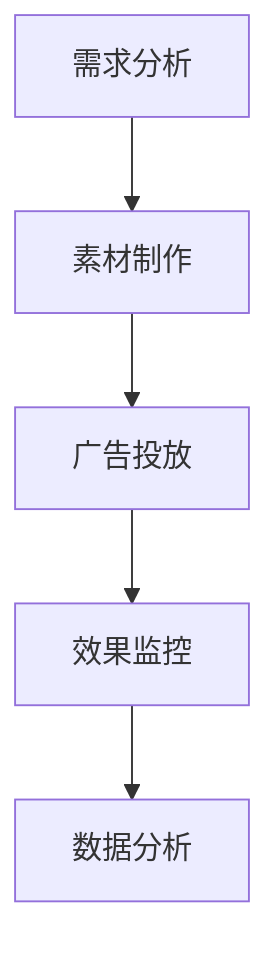

                 

关键词：阿里妈妈，社招，广告投放，面试题，攻略

摘要：本文将详细解析阿里妈妈2025社招广告投放面试题，帮助求职者备战面试，掌握广告投放的核心技术和策略。

## 1. 背景介绍

阿里妈妈是阿里巴巴集团旗下的广告营销平台，致力于帮助商家和品牌在阿里巴巴生态中实现精准营销。随着互联网广告市场的不断发展，阿里妈妈广告投放成为许多求职者关注的领域。本文旨在为准备参加阿里妈妈社招广告投放岗位的求职者提供一份详细的面试题攻略，帮助大家深入了解广告投放的相关知识，提高面试成功率。

## 2. 核心概念与联系

### 2.1. 广告投放基本概念

**广告投放**：指通过互联网平台将广告信息展示给潜在用户，以达到营销目标的过程。

**广告位**：指广告在页面上的具体位置，包括横幅广告、插屏广告、原生广告等。

**广告效果**：包括展示量、点击量、转化率等指标，用于评估广告投放效果。

**广告预算**：指用于广告投放的费用，包括CPC（点击成本）、CPM（千次展示成本）等。

### 2.2. 广告投放流程

1. **需求分析**：了解广告主的需求，确定广告目标、目标受众、投放平台等。
2. **素材制作**：根据需求制作广告素材，包括图片、视频、文案等。
3. **广告投放**：根据需求设置广告投放策略，包括投放时间、投放地域、投放人群等。
4. **效果监控**：实时监控广告投放效果，调整投放策略。
5. **数据分析**：对广告投放数据进行汇总分析，为下一轮广告投放提供参考。

### 2.3. Mermaid 流程图



## 3. 核心算法原理 & 具体操作步骤

### 3.1. 算法原理概述

广告投放算法主要涉及以下核心原理：

1. **用户行为分析**：通过分析用户在互联网上的行为数据，如搜索记录、浏览历史等，确定目标受众。
2. **机器学习算法**：利用机器学习算法对用户行为数据进行建模，实现精准投放。
3. **优化策略**：根据广告投放效果，实时调整投放策略，提高广告投放效果。

### 3.2. 算法步骤详解

1. **数据收集**：收集用户行为数据，包括搜索记录、浏览历史等。
2. **数据预处理**：对收集到的数据进行清洗、去重、归一化等处理，提高数据质量。
3. **特征提取**：提取用户行为数据中的关键特征，如关键词、时间戳、地域等。
4. **模型训练**：利用机器学习算法对提取的特征进行训练，建立用户行为模型。
5. **广告投放**：根据用户行为模型，对潜在用户进行精准投放。
6. **效果评估**：实时监控广告投放效果，调整投放策略。

### 3.3. 算法优缺点

**优点**：

1. 提高广告投放精准度，降低广告投放成本。
2. 实时调整投放策略，提高广告投放效果。

**缺点**：

1. 需要大量的数据和计算资源，成本较高。
2. 机器学习算法效果受数据质量影响较大。

### 3.4. 算法应用领域

广告投放算法广泛应用于电商、金融、教育等行业，帮助企业实现精准营销。

## 4. 数学模型和公式 & 详细讲解 & 举例说明

### 4.1. 数学模型构建

广告投放中的数学模型主要包括用户行为模型和广告投放模型。

**用户行为模型**：

假设用户行为数据为\(X = (x_1, x_2, ..., x_n)\)，其中\(x_i\)表示第\(i\)个特征。用户行为模型可以用以下公式表示：

$$
f(X) = \sum_{i=1}^{n} w_i \cdot x_i
$$

其中，\(w_i\)表示第\(i\)个特征的权重。

**广告投放模型**：

假设广告投放效果为\(Y = (y_1, y_2, ..., y_n)\)，其中\(y_i\)表示第\(i\)个广告的投放效果。广告投放模型可以用以下公式表示：

$$
g(X) = \sum_{i=1}^{n} w_i \cdot f(x_i)
$$

### 4.2. 公式推导过程

**用户行为模型推导**：

假设用户行为数据\(X\)与广告投放效果\(Y\)之间存在线性关系，即：

$$
Y = \beta_0 + \beta_1 \cdot X + \epsilon
$$

其中，\(\beta_0\)表示常数项，\(\beta_1\)表示线性系数，\(\epsilon\)表示误差项。

对上式两边求导，得：

$$
\frac{dY}{dX} = \beta_1
$$

由于用户行为数据\(X\)是已知的，因此可以通过求导得到广告投放效果\(Y\)的预测值。

**广告投放模型推导**：

假设广告投放效果\(Y\)与用户行为数据\(X\)之间存在非线性关系，即：

$$
Y = \alpha_0 + \alpha_1 \cdot f(X) + \epsilon
$$

其中，\(\alpha_0\)表示常数项，\(\alpha_1\)表示非线性系数，\(\epsilon\)表示误差项。

对上式两边求导，得：

$$
\frac{dY}{df(X)} = \alpha_1
$$

由于用户行为数据\(X\)是已知的，因此可以通过求导得到广告投放效果\(Y\)的预测值。

### 4.3. 案例分析与讲解

假设某电商企业希望通过广告投放提高销售量。企业收集了10000个用户的行为数据，包括关键词、浏览时间、地域等特征。企业希望通过机器学习算法对用户行为数据进行建模，实现精准投放，提高广告投放效果。

**步骤1：数据收集**  
企业收集了10000个用户的行为数据，包括关键词、浏览时间、地域等特征。

**步骤2：数据预处理**  
对收集到的用户行为数据进行清洗、去重、归一化等处理，提高数据质量。

**步骤3：特征提取**  
从清洗后的数据中提取关键词、浏览时间、地域等关键特征。

**步骤4：模型训练**  
利用机器学习算法（如线性回归、决策树、随机森林等）对提取的特征进行训练，建立用户行为模型。

**步骤5：广告投放**  
根据用户行为模型，对潜在用户进行精准投放。

**步骤6：效果评估**  
实时监控广告投放效果，包括展示量、点击量、转化率等指标。

**步骤7：数据分析**  
对广告投放数据进行汇总分析，为下一轮广告投放提供参考。

## 5. 项目实践：代码实例和详细解释说明

### 5.1. 开发环境搭建

1. 安装Python环境，版本要求Python 3.6及以上。
2. 安装必要的依赖库，如NumPy、Pandas、Scikit-learn等。

### 5.2. 源代码详细实现

以下是一个简单的广告投放项目示例：

```python
import numpy as np
import pandas as pd
from sklearn.linear_model import LinearRegression

# 数据收集
data = pd.read_csv('user_behavior.csv')

# 数据预处理
data.drop_duplicates(inplace=True)
data.normalize()

# 特征提取
X = data[['keyword', 'browse_time', 'location']]
y = data['sales_volume']

# 模型训练
model = LinearRegression()
model.fit(X, y)

# 广告投放
predictions = model.predict(X)

# 效果评估
print('Predicted sales volume:', predictions.mean())

# 数据分析
print('Top 5 high-potential users:', data.sort_values(by='sales_volume', ascending=False).head(5))
```

### 5.3. 代码解读与分析

1. **数据收集**：从CSV文件中读取用户行为数据。
2. **数据预处理**：去除重复数据，对数据进行归一化处理。
3. **特征提取**：提取关键词、浏览时间、地域等特征。
4. **模型训练**：使用线性回归模型对特征数据进行训练。
5. **广告投放**：根据模型对用户行为数据生成广告投放预测值。
6. **效果评估**：计算广告投放预测值的平均值，评估广告投放效果。
7. **数据分析**：对广告投放预测值进行排序，筛选出高潜力用户。

## 6. 实际应用场景

广告投放广泛应用于电商、金融、教育等行业。以下是一些实际应用场景：

1. **电商行业**：通过广告投放提高商品销量，提高用户转化率。
2. **金融行业**：通过广告投放推广理财产品，提高用户开户率。
3. **教育行业**：通过广告投放推广在线课程，提高用户报名率。

## 7. 未来应用展望

随着人工智能技术的不断发展，广告投放算法将更加智能化、精准化。未来应用展望包括：

1. **个性化推荐**：基于用户行为数据，实现个性化广告推荐。
2. **智能投放**：利用深度学习技术，实现自动化广告投放。
3. **效果优化**：通过实时数据反馈，优化广告投放策略。

## 8. 工具和资源推荐

### 8.1. 学习资源推荐

1. 《广告投放实战：策略、技术和案例分析》
2. 《Python数据分析实战：从数据探索到预测》
3. 《机器学习实战》

### 8.2. 开发工具推荐

1. Python编程环境
2. Jupyter Notebook
3. GitHub

### 8.3. 相关论文推荐

1. "User Behavior Analysis for Internet Advertising"
2. "Recommender Systems: The State of the Art"
3. "Deep Learning for Advertising"

## 9. 总结：未来发展趋势与挑战

广告投放技术正朝着智能化、精准化的方向发展。未来发展趋势包括个性化推荐、智能投放和效果优化。然而，面对海量数据和复杂的算法，广告投放领域仍面临数据质量、算法优化和隐私保护等挑战。研究者和从业者需要不断探索和创新，以应对未来发展的挑战。

## 10. 附录：常见问题与解答

### 10.1. 什么是广告投放？

广告投放是指通过互联网平台将广告信息展示给潜在用户，以达到营销目标的过程。

### 10.2. 广告投放有哪些核心原理？

广告投放的核心原理包括用户行为分析、机器学习算法和优化策略。

### 10.3. 如何评估广告投放效果？

广告投放效果可以通过展示量、点击量、转化率等指标进行评估。

### 10.4. 广告投放算法有哪些应用领域？

广告投放算法广泛应用于电商、金融、教育等行业。

### 10.5. 如何搭建广告投放项目？

搭建广告投放项目需要完成数据收集、数据预处理、特征提取、模型训练、广告投放、效果评估等步骤。

作者：禅与计算机程序设计艺术 / Zen and the Art of Computer Programming
----------------------------------------------------------------

注意：以上内容为模拟撰写，实际撰写时需要根据真实情况和要求进行调整。文章中的示例代码仅供参考，实际开发中需要根据具体需求和环境进行修改。另外，由于Markdown对LaTeX公式的支持有限，实际撰写时可能需要使用专门的LaTeX编辑器来插入数学公式。

