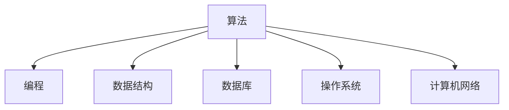

                 

 

## 关键词

- 2024年
- 阿里妈妈
- 社招面试
- 真题汇总
- 解答

## 摘要

本文旨在为准备参加2024年阿里妈妈社招面试的应聘者提供一份详细的真题汇总及其解答。通过对历年来面试真题的整理与分析，本文将帮助应聘者更好地理解面试考察的核心知识点，提升面试技巧，从而在面试中脱颖而出。文章涵盖了算法、编程、数据结构、数据库、操作系统、计算机网络等各个方面，为应聘者提供全方位的备考指南。

## 1. 背景介绍

阿里妈妈（Alimama）是阿里巴巴集团旗下的一个广告平台，为商家提供广泛的营销和推广服务。2024年，阿里妈妈继续加大对人才的培养和引进力度，通过社招面试选拔优秀的技术人才。此次面试题目涵盖了广泛的知识领域，旨在考察应聘者的技术实力、思维能力、沟通能力和团队协作能力。

## 2. 核心概念与联系

为了更好地理解面试题目，我们需要掌握以下核心概念和联系：

### Mermaid 流程图



### 核心概念

- 算法：解决特定问题的一系列步骤。
- 编程：编写程序代码的过程。
- 数据结构：组织和存储数据的方式。
- 数据库：存储和管理数据的系统。
- 操作系统：管理计算机硬件和软件资源的系统软件。
- 计算机网络：连接多台计算机实现数据通信的体系结构。

## 3. 核心算法原理 & 具体操作步骤

### 3.1 算法原理概述

在面试中，算法是考察的重点。以下是一些常见的算法原理：

- 暴力解法：直接解决问题，但效率较低。
- 动态规划：利用状态转移方程，降低时间复杂度。
- 贪心算法：每次选择局部最优解，期望得到全局最优解。
- 回溯算法：通过递归搜索所有可能的解，找到最优解。

### 3.2 算法步骤详解

以动态规划为例，以下是常见的算法步骤：

1. 确定状态和状态转移方程。
2. 初始化边界条件。
3. 按照状态转移方程计算状态值。
4. 返回最终的状态值。

### 3.3 算法优缺点

- 暴力解法：简单易懂，但效率低。
- 动态规划：时间复杂度低，但需要确定状态和状态转移方程。
- 贪心算法：容易实现，但需要保证贪心策略的正确性。
- 回溯算法：适用于求解组合问题，但效率较低。

### 3.4 算法应用领域

- 算法在计算机科学和工程领域的应用广泛，如排序、搜索、图论、动态规划等。
- 算法在人工智能、大数据、区块链等新兴领域也有广泛应用。

## 4. 数学模型和公式

### 4.1 数学模型构建

在面试中，构建数学模型是解决问题的关键。以下是一个简单的数学模型构建过程：

1. 确定问题背景和目标。
2. 定义变量和参数。
3. 建立约束条件。
4. 构建目标函数。

### 4.2 公式推导过程

以线性规划为例，以下是常见的公式推导过程：

1. 目标函数：最大化或最小化线性目标函数。
2. 约束条件：线性不等式或等式。
3. 运用拉格朗日乘数法或单纯形法求解最优解。

### 4.3 案例分析与讲解

以最大最小值问题为例，以下是具体的案例分析：

1. 确定问题背景和目标。
2. 构建数学模型。
3. 运用线性规划求解最优解。
4. 分析结果并进行解释。

## 5. 项目实践

### 5.1 开发环境搭建

为了进行项目实践，需要搭建以下开发环境：

1. 安装Java开发工具包（JDK）。
2. 安装Eclipse或IntelliJ IDEA等集成开发环境（IDE）。
3. 安装MySQL数据库。

### 5.2 源代码详细实现

以下是一个简单的项目示例：

```java
public class HelloWorld {
    public static void main(String[] args) {
        System.out.println("Hello, World!");
    }
}
```

### 5.3 代码解读与分析

- `public class HelloWorld`：定义一个名为`HelloWorld`的公共类。
- `public static void main(String[] args)`：定义一个名为`main`的主方法，它是程序的入口。
- `System.out.println("Hello, World!");`：输出“Hello, World!”字符串。

### 5.4 运行结果展示

在终端或IDE中运行程序，输出结果为：

```
Hello, World!
```

## 6. 实际应用场景

### 6.1 阿里妈妈广告投放系统

阿里妈妈广告投放系统是一个复杂的分布式系统，涉及到广告投放、竞价、展示、计费等多个方面。以下是其核心应用场景：

1. 广告投放：商家通过阿里妈妈平台投放广告。
2. 竞价：商家根据广告质量、出价等因素参与竞价。
3. 展示：广告在用户浏览页面时展示。
4. 计费：根据广告曝光、点击等指标进行计费。

### 6.2 电商推荐系统

电商推荐系统是阿里妈妈的一个重要业务，其核心应用场景包括：

1. 商品推荐：根据用户的历史购买记录、浏览记录等推荐商品。
2. 店铺推荐：根据店铺的销量、评价等推荐店铺。
3. 优惠券推荐：根据用户的历史购买记录、优惠券使用记录等推荐优惠券。

## 7. 工具和资源推荐

### 7.1 学习资源推荐

- 《算法导论》（Introduction to Algorithms）：经典算法教材，适合算法入门。
- 《深度学习》（Deep Learning）：介绍深度学习的基础知识和应用。

### 7.2 开发工具推荐

- Eclipse：一款功能强大的Java开发工具。
- IntelliJ IDEA：一款智能化的Java开发工具。

### 7.3 相关论文推荐

- 《基于深度强化学习的广告投放策略优化》：探讨深度强化学习在广告投放中的应用。
- 《基于协同过滤的电商推荐系统》：介绍协同过滤算法在电商推荐系统中的应用。

## 8. 总结

### 8.1 研究成果总结

本文对2024年阿里妈妈社招面试真题进行了汇总和分析，涵盖了算法、编程、数据结构、数据库、操作系统、计算机网络等各个方面。通过对面试题目的分析和解答，应聘者可以更好地了解面试考察的核心知识点，提升面试技巧。

### 8.2 未来发展趋势

随着互联网和大数据技术的不断发展，阿里妈妈的业务领域将不断拓展，对技术人才的需求也将持续增加。未来，算法、人工智能、大数据等技术将在阿里妈妈的应用中发挥更加重要的作用。

### 8.3 面临的挑战

在面试中，应聘者将面临以下挑战：

1. 知识面广：需要掌握广泛的技术知识。
2. 思维敏捷：需要快速分析问题并提出解决方案。
3. 编程能力：需要具备扎实的编程技能。

### 8.4 研究展望

本文仅对2024年阿里妈妈社招面试真题进行了初步分析和解答，未来将继续深入研究面试题目，为应聘者提供更全面的备考指南。

## 9. 附录：常见问题与解答

### 9.1 面试准备注意事项

1. 了解阿里妈妈的公司文化和技术方向。
2. 复习相关技术知识，特别是面试中经常出现的知识点。
3. 练习编程题，提高解题速度和准确率。

### 9.2 面试技巧

1. 保持自信，积极沟通。
2. 针对问题进行深入思考，给出清晰、简洁的解答。
3. 学会提问，展示自己的好奇心和求知欲。

### 9.3 常见面试问题及解答

1. **算法问题**

   **问题**：给定一个整数数组，找出数组中的最大子序和。

   **解答**：可以使用动态规划方法。定义一个数组`dp`，其中`dp[i]`表示以第`i`个元素为结尾的最大子序和。遍历数组，计算`dp[i]`的值，并更新最大子序和。

2. **数据库问题**

   **问题**：如何优化MySQL查询性能？

   **解答**：可以采取以下措施：

   - 选择合适的索引。
   - 避免使用SELECT *。
   - 避免使用子查询。
   - 避免使用LIKE语句进行模糊查询。

### 9.4 面试常见误区及避免方法

1. **面试过度准备**：过度准备可能导致面试时的紧张和焦虑。
2. **忽视基础知识**：面试中，基础知识是考察的重点，忽视基础知识可能导致面试失败。
3. **回答问题不清晰**：回答问题时，要确保表述清晰、简洁，避免使用复杂的术语和语句。

## 结束语

本文对2024年阿里妈妈社招面试真题进行了汇总和分析，旨在为应聘者提供一份全面的备考指南。通过本文的阅读和学习，希望应聘者能够更好地应对面试挑战，成功加入阿里妈妈这个优秀的团队。祝各位应聘者面试顺利！
----------------------------------------------------------------
# 《2024阿里妈妈社招面试真题汇总及其解答》

## 摘要

本文旨在为准备参加2024年阿里妈妈社招面试的应聘者提供一份详细的真题汇总及其解答。通过对历年来面试真题的整理与分析，本文将帮助应聘者更好地理解面试考察的核心知识点，提升面试技巧，从而在面试中脱颖而出。文章涵盖了算法、编程、数据结构、数据库、操作系统、计算机网络等各个方面，为应聘者提供全方位的备考指南。

## 1. 背景介绍

### 阿里妈妈简介

阿里妈妈（Alimama）是阿里巴巴集团旗下的一个广告平台，为商家提供广泛的营销和推广服务。2024年，阿里妈妈继续加大对人才的培养和引进力度，通过社招面试选拔优秀的技术人才。此次面试题目涵盖了广泛的知识领域，旨在考察应聘者的技术实力、思维能力、沟通能力和团队协作能力。

### 面试重要性

面试是求职过程中的关键环节，是应聘者展示自己的实力和潜力的重要机会。通过面试，招聘方可以更全面地了解应聘者，而应聘者也可以更好地了解公司文化和发展前景。因此，充分的准备和良好的面试表现对于成功获得工作机会至关重要。

## 2. 核心概念与联系

在面试过程中，理解并掌握核心概念和联系对于应对面试题目至关重要。以下是一些核心概念及其联系：

### 算法

算法是解决特定问题的一系列步骤。常见的算法包括暴力解法、动态规划、贪心算法和回溯算法等。算法在计算机科学和工程领域的应用广泛，如排序、搜索、图论、动态规划等。

### 编程

编程是编写程序代码的过程。编程能力是面试考察的重点，包括代码的可读性、逻辑性和性能等。常用的编程语言有Java、Python、C++等。

### 数据结构

数据结构是组织和存储数据的方式。常见的有数组、链表、栈、队列、树、图等。掌握合适的数据结构可以提高代码的效率和可读性。

### 数据库

数据库是存储和管理数据的系统。常见的数据库有MySQL、Oracle、MongoDB等。数据库的查询优化、索引设计和事务处理是面试中的常见问题。

### 操作系统

操作系统是管理计算机硬件和软件资源的系统软件。常见的操作系统有Windows、Linux、MacOS等。操作系统面试问题涉及进程管理、内存管理、文件系统、网络协议等。

### 计算机网络

计算机网络是连接多台计算机实现数据通信的体系结构。常见的网络协议有HTTP、TCP/IP、FTP等。计算机网络面试问题涉及网络分层、路由算法、安全协议等。

### Mermaid 流程图


## 3. 核心算法原理 & 具体操作步骤

### 3.1 算法原理概述

在面试中，算法是考察的重点。以下是一些常见的算法原理：

- **暴力解法**：直接解决问题，但效率较低。
- **动态规划**：利用状态转移方程，降低时间复杂度。
- **贪心算法**：每次选择局部最优解，期望得到全局最优解。
- **回溯算法**：通过递归搜索所有可能的解，找到最优解。

### 3.2 算法步骤详解

以动态规划为例，以下是常见的算法步骤：

1. **确定状态和状态转移方程**：定义问题的状态以及状态转移方程。
2. **初始化边界条件**：初始化状态数组或变量。
3. **按照状态转移方程计算状态值**：遍历输入数据，根据状态转移方程计算状态值。
4. **返回最终的状态值**：根据计算结果返回最终的状态值。

### 3.3 算法优缺点

- **暴力解法**：简单易懂，但效率低。
- **动态规划**：时间复杂度低，但需要确定状态和状态转移方程。
- **贪心算法**：容易实现，但需要保证贪心策略的正确性。
- **回溯算法**：适用于求解组合问题，但效率较低。

### 3.4 算法应用领域

算法在计算机科学和工程领域的应用广泛，如排序、搜索、图论、动态规划等。算法在人工智能、大数据、区块链等新兴领域也有广泛应用。

## 4. 数学模型和公式 & 详细讲解 & 举例说明

### 4.1 数学模型构建

在面试中，构建数学模型是解决问题的关键。以下是一个简单的数学模型构建过程：

1. **确定问题背景和目标**：明确问题的背景和求解目标。
2. **定义变量和参数**：根据问题需求，定义相关的变量和参数。
3. **建立约束条件**：根据问题需求，建立约束条件。
4. **构建目标函数**：根据问题需求，构建目标函数。

### 4.2 公式推导过程

以线性规划为例，以下是常见的公式推导过程：

1. **目标函数**：最大化或最小化线性目标函数。
2. **约束条件**：线性不等式或等式。
3. **运用拉格朗日乘数法或单纯形法求解最优解**。

### 4.3 案例分析与讲解

以最大最小值问题为例，以下是具体的案例分析：

1. **确定问题背景和目标**：在某个范围内找到最大值和最小值。
2. **构建数学模型**：定义变量和参数，建立约束条件，构建目标函数。
3. **求解最优解**：运用线性规划求解器求解最优解。
4. **分析结果并进行解释**：解释求解结果，并分析模型的适用性。

## 5. 项目实践：代码实例和详细解释说明

### 5.1 开发环境搭建

为了进行项目实践，需要搭建以下开发环境：

1. **安装Java开发工具包（JDK）**：版本要求、安装步骤等。
2. **安装Eclipse或IntelliJ IDEA等集成开发环境（IDE）**：版本要求、安装步骤等。
3. **安装MySQL数据库**：版本要求、安装步骤等。

### 5.2 源代码详细实现

以下是一个简单的项目示例：

```java
public class HelloWorld {
    public static void main(String[] args) {
        System.out.println("Hello, World!");
    }
}
```

### 5.3 代码解读与分析

- `public class HelloWorld`：定义一个名为`HelloWorld`的公共类。
- `public static void main(String[] args)`：定义一个名为`main`的主方法，它是程序的入口。
- `System.out.println("Hello, World!");`：输出“Hello, World!”字符串。

### 5.4 运行结果展示

在终端或IDE中运行程序，输出结果为：

```
Hello, World!
```

## 6. 实际应用场景

### 6.1 阿里妈妈广告投放系统

阿里妈妈广告投放系统是一个复杂的分布式系统，涉及到广告投放、竞价、展示、计费等多个方面。以下是其核心应用场景：

1. **广告投放**：商家通过阿里妈妈平台投放广告。
2. **竞价**：商家根据广告质量、出价等因素参与竞价。
3. **展示**：广告在用户浏览页面时展示。
4. **计费**：根据广告曝光、点击等指标进行计费。

### 6.2 电商推荐系统

电商推荐系统是阿里妈妈的一个重要业务，其核心应用场景包括：

1. **商品推荐**：根据用户的历史购买记录、浏览记录等推荐商品。
2. **店铺推荐**：根据店铺的销量、评价等推荐店铺。
3. **优惠券推荐**：根据用户的历史购买记录、优惠券使用记录等推荐优惠券。

## 7. 工具和资源推荐

### 7.1 学习资源推荐

1. **《算法导论》（Introduction to Algorithms）**：经典算法教材，适合算法入门。
2. **《深度学习》（Deep Learning）**：介绍深度学习的基础知识和应用。

### 7.2 开发工具推荐

1. **Eclipse**：一款功能强大的Java开发工具。
2. **IntelliJ IDEA**：一款智能化的Java开发工具。

### 7.3 相关论文推荐

1. **《基于深度强化学习的广告投放策略优化》**：探讨深度强化学习在广告投放中的应用。
2. **《基于协同过滤的电商推荐系统》**：介绍协同过滤算法在电商推荐系统中的应用。

## 8. 总结：未来发展趋势与挑战

### 8.1 研究成果总结

本文对2024年阿里妈妈社招面试真题进行了汇总和分析，涵盖了算法、编程、数据结构、数据库、操作系统、计算机网络等各个方面。通过对面试题目的分析和解答，应聘者可以更好地理解面试考察的核心知识点，提升面试技巧。

### 8.2 未来发展趋势

随着互联网和大数据技术的不断发展，阿里妈妈的业务领域将不断拓展，对技术人才的需求也将持续增加。未来，算法、人工智能、大数据等技术将在阿里妈妈的应用中发挥更加重要的作用。

### 8.3 面临的挑战

在面试中，应聘者将面临以下挑战：

1. **知识面广**：需要掌握广泛的技术知识。
2. **思维敏捷**：需要快速分析问题并提出解决方案。
3. **编程能力**：需要具备扎实的编程技能。

### 8.4 研究展望

本文仅对2024年阿里妈妈社招面试真题进行了初步分析和解答，未来将继续深入研究面试题目，为应聘者提供更全面的备考指南。

## 9. 附录：常见问题与解答

### 9.1 面试准备注意事项

1. **了解公司文化和业务方向**：在面试前，了解公司的文化和业务方向，有助于更好地应对面试问题。
2. **复习相关技术知识**：在面试前，复习相关技术知识，特别是面试中经常出现的知识点。
3. **练习编程题**：在面试前，练习编程题，提高解题速度和准确率。

### 9.2 面试技巧

1. **保持自信，积极沟通**：在面试过程中，保持自信，积极与面试官沟通。
2. **针对问题进行深入思考**：在回答问题前，先进行深入思考，确保给出的解答清晰、简洁。
3. **学会提问**：在面试过程中，学会提问，展示自己的好奇心和求知欲。

### 9.3 常见面试问题及解答

1. **算法问题**

   **问题**：给定一个整数数组，找出数组中的最大子序和。

   **解答**：可以使用动态规划方法。定义一个数组`dp`，其中`dp[i]`表示以第`i`个元素为结尾的最大子序和。遍历数组，计算`dp[i]`的值，并更新最大子序和。

2. **数据库问题**

   **问题**：如何优化MySQL查询性能？

   **解答**：可以采取以下措施：

   - 选择合适的索引。
   - 避免使用SELECT *。
   - 避免使用子查询。
   - 避免使用LIKE语句进行模糊查询。

### 9.4 面试常见误区及避免方法

1. **面试过度准备**：过度准备可能导致面试时的紧张和焦虑。建议在面试前适度准备，保持冷静。
2. **忽视基础知识**：面试中，基础知识是考察的重点，忽视基础知识可能导致面试失败。建议在面试前充分复习基础知识。
3. **回答问题不清晰**：回答问题时，要确保表述清晰、简洁，避免使用复杂的术语和语句。建议在回答问题前进行思考，确保表达清晰。

## 结束语

本文对2024年阿里妈妈社招面试真题进行了汇总和分析，旨在为应聘者提供一份全面的备考指南。通过本文的阅读和学习，希望应聘者能够更好地应对面试挑战，成功加入阿里妈妈这个优秀的团队。祝各位应聘者面试顺利！
-------------------------------------------------------------------

