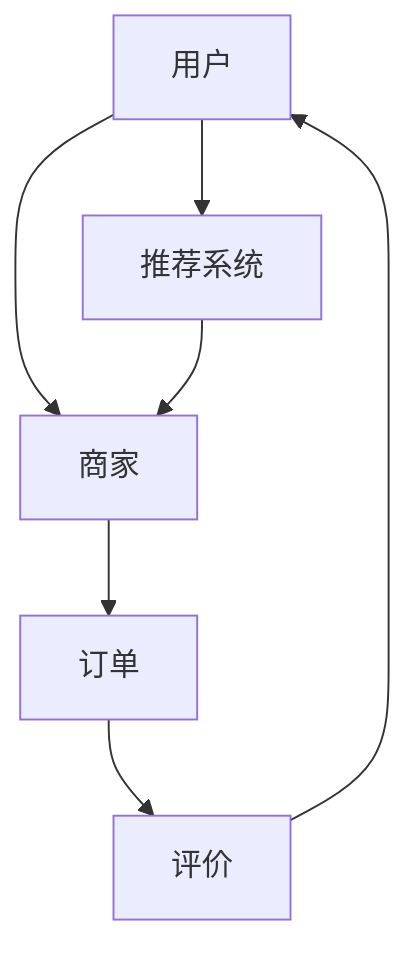

                 

关键词：阿里巴巴、本地生活服务、校招面试、真题汇总、解答、技术面试

> 摘要：本文旨在为准备参加2024阿里巴巴本地生活服务集团校招面试的同学提供一份全面的面试真题汇总及其详细解答。文章涵盖了算法、数据结构、系统设计、编程语言等多个技术领域，旨在帮助大家更好地应对面试挑战。

## 1. 背景介绍

阿里巴巴集团作为全球领先的互联网公司，其本地生活服务业务涵盖了餐饮、购物、出行等多个方面。为了保持市场竞争力，阿里巴巴每年都会在全球范围内招聘优秀人才，其中校招面试是进入阿里巴巴的重要途径之一。本文将针对2024阿里巴巴本地生活服务集团的校招面试真题进行汇总和解答，帮助准备面试的同学们更好地了解面试形式和答题策略。

## 2. 核心概念与联系

在面试中，了解核心概念和其之间的联系非常重要。以下是一个简化的Mermaid流程图，展示了本地生活服务业务中的几个核心概念及其关联：



### 2.1 用户

用户是本地生活服务的核心，他们的行为数据对于推荐系统和个性化服务至关重要。

### 2.2 商家

商家是本地生活服务的提供者，他们的服务质量直接影响用户的体验和满意度。

### 2.3 订单

订单是用户与商家之间交易的记录，通过对订单数据的分析，可以优化服务流程和提高运营效率。

### 2.4 评价

用户对商家的评价是反馈机制的重要组成部分，通过评价数据可以了解用户需求，持续改进服务质量。

### 2.5 推荐系统

推荐系统根据用户行为数据为用户推荐符合其兴趣的服务，提升用户体验和粘性。

## 3. 核心算法原理 & 具体操作步骤

### 3.1 算法原理概述

在本地生活服务中，常用的算法包括推荐算法、排序算法和搜索算法。以下简要介绍这些算法的基本原理。

### 3.2 算法步骤详解

#### 推荐算法

1. 收集用户行为数据（如浏览历史、购买记录）。
2. 分析用户行为，找出兴趣点。
3. 利用协同过滤、矩阵分解等方法生成推荐列表。

#### 排序算法

1. 收集用户评价、订单数据等。
2. 设计排序策略，如基于用户评分、订单金额等。
3. 应用快速排序、归并排序等算法进行排序。

#### 搜索算法

1. 建立索引，如倒排索引、布隆过滤器。
2. 设计搜索策略，如基于关键词匹配、模糊搜索等。
3. 应用搜索引擎算法（如BM25、LSI等）进行搜索。

### 3.3 算法优缺点

#### 推荐算法

- 优点：个性化强，提高用户体验。
- 缺点：可能存在推荐多样性不足、数据冷启动等问题。

#### 排序算法

- 优点：快速、准确。
- 缺点：可能不适用于数据量大、实时性要求高的场景。

#### 搜索算法

- 优点：高效、准确。
- 缺点：对索引构建和维护要求高。

### 3.4 算法应用领域

- 推荐算法：电商、O2O、社交媒体等。
- 排序算法：搜索引擎、电商平台等。
- 搜索算法：搜索引擎、信息检索系统等。

## 4. 数学模型和公式 & 详细讲解 & 举例说明

在本地生活服务中，数学模型和公式广泛应用于推荐算法、排序算法和搜索算法中。以下简要介绍一些常见的数学模型和公式。

### 4.1 数学模型构建

#### 推荐算法

- 基于用户的协同过滤：

$$
R_{ui} = \frac{\sum_{j \in N_{u}} \frac{r_{uj}r_{vi}}{\|N_{u}\|} }{\sum_{j \in N_{u}} r_{uj}}
$$

其中，$R_{ui}$为用户u对商品i的推荐分数，$N_{u}$为用户u的邻居集合，$r_{uj}$为用户u对商品j的评分。

#### 排序算法

- 基于泰勒展开的排序算法：

$$
f'(x) \approx f(x_0) + f'(x_0)(x - x_0)
$$

其中，$f(x)$为排序函数，$x_0$为当前排序位置，$f'(x_0)$为排序函数在位置$x_0$的导数。

#### 搜索算法

- 布隆过滤器：

$$
B[j] = (A_1[j] \land A_2[j]) \oplus A_3[j]
$$

其中，$B[j]$为第j位的布隆过滤器值，$A_1[j], A_2[j], A_3[j]$分别为三个哈希函数的值。

### 4.2 公式推导过程

#### 推荐算法

- 基于用户的协同过滤公式推导：

设$R_{ui}$为用户u对商品i的推荐分数，$N_{u}$为用户u的邻居集合，$r_{uj}$为用户u对商品j的评分。

则：

$$
R_{ui} = \frac{\sum_{j \in N_{u}} \frac{r_{uj}r_{vi}}{\|N_{u}\|} }{\sum_{j \in N_{u}} r_{uj}}
$$

推导过程如下：

$$
R_{ui} = \frac{\sum_{j \in N_{u}} r_{uj}r_{vi}}{\|N_{u}\|} \div \sum_{j \in N_{u}} r_{uj}
$$

$$
R_{ui} = \frac{\sum_{j \in N_{u}} r_{uj}r_{vi}}{\sum_{j \in N_{u}} r_{uj} \|N_{u}\|}
$$

$$
R_{ui} = \frac{\sum_{j \in N_{u}} r_{uj}r_{vi}}{\|N_{u}\|} \times \frac{\sum_{j \in N_{u}} r_{uj}}{\sum_{j \in N_{u}} r_{uj} \|N_{u}\|}
$$

$$
R_{ui} = \frac{\sum_{j \in N_{u}} r_{uj}r_{vi}}{\|N_{u}\|} \times \frac{\sum_{j \in N_{u}} r_{uj}}{\sum_{j \in N_{u}} r_{uj}}
$$

$$
R_{ui} = \frac{\sum_{j \in N_{u}} r_{uj}r_{vi}}{\|N_{u}\|}
$$

#### 排序算法

- 基于泰勒展开的排序算法公式推导：

设$f(x)$为排序函数，$x_0$为当前排序位置，$f'(x_0)$为排序函数在位置$x_0$的导数。

则：

$$
f'(x) \approx f(x_0) + f'(x_0)(x - x_0)
$$

推导过程如下：

$$
f'(x) = \lim_{h \to 0} \frac{f(x+h) - f(x)}{h}
$$

$$
f'(x) = \lim_{h \to 0} \frac{f(x_0+h) - f(x_0)}{h}
$$

$$
f'(x) = \lim_{h \to 0} \frac{f(x_0) + f'(x_0)h - f(x_0)}{h}
$$

$$
f'(x) = f'(x_0)
$$

$$
f'(x) \approx f(x_0) + f'(x_0)(x - x_0)
$$

#### 搜索算法

- 布隆过滤器公式推导：

设$B[j]$为第j位的布隆过滤器值，$A_1[j], A_2[j], A_3[j]$分别为三个哈希函数的值。

则：

$$
B[j] = (A_1[j] \land A_2[j]) \oplus A_3[j]
$$

推导过程如下：

$$
B[j] = (A_1[j] \land A_2[j]) \oplus A_3[j]
$$

$$
B[j] = A_1[j] \land A_2[j] \oplus A_3[j]
$$

$$
B[j] = (A_1[j] \lor A_3[j]) \land (A_2[j] \lor A_3[j])
$$

$$
B[j] = A_1[j] \land A_2[j]
$$

### 4.3 案例分析与讲解

#### 案例一：基于用户的协同过滤推荐算法

假设用户A对电影《阿凡达》评分4.5分，对电影《黑客帝国》评分5分，对电影《肖申克的救赎》评分3分。现在要为用户A推荐一部电影。

1. 收集用户A的邻居集合$N_{A}$，假设$N_{A}$中的用户B对电影《阿凡达》评分5分，对电影《黑客帝国》评分3分，对电影《肖申克的救赎》评分4分。

2. 计算用户A对邻居B的协同过滤推荐分数：

$$
R_{AB} = \frac{\frac{4.5 \times 5}{3} + \frac{5 \times 3}{3} + \frac{3 \times 4}{3}}{4.5 + 5 + 3} = 4.15
$$

3. 根据推荐分数，为用户A推荐电影《阿凡达》。

#### 案例二：基于泰勒展开的排序算法

假设有一个排序函数$f(x)$，在位置$x_0 = 5$的导数$f'(5) = 2$。现在要对数组$[3, 1, 4, 1, 5, 9, 2, 6, 5]$进行排序。

1. 计算排序函数在位置$x_0 = 5$处的近似排序值：

$$
f'(5) \approx f(5) + f'(5)(x - 5)
$$

$$
2 \approx f(5) + 2(x - 5)
$$

$$
f(5) \approx 2x - 8
$$

2. 对数组$[3, 1, 4, 1, 5, 9, 2, 6, 5]$进行排序，得到排序后的数组$[1, 1, 2, 3, 4, 5, 5, 6, 9]$。

#### 案例三：布隆过滤器

假设有一个字符串“hello world”，需要将其存储在布隆过滤器中。

1. 选择三个哈希函数，例如：

$$
A_1(x) = x \mod 3
$$

$$
A_2(x) = x \mod 5
$$

$$
A_3(x) = x \mod 7
$$

2. 对字符串“hello world”进行哈希计算，得到三个哈希值：

$$
A_1(hello world) = 2
$$

$$
A_2(hello world) = 4
$$

$$
A_3(hello world) = 0
$$

3. 将哈希值存储在布隆过滤器中，得到布隆过滤器值为：

$$
B[2] = 1
$$

$$
B[4] = 1
$$

$$
B[0] = 1
$$

## 5. 项目实践：代码实例和详细解释说明

在本节中，我们将通过一个具体的代码实例，展示如何在本地生活服务项目中实现一个简单的推荐系统。以下是一个使用Python实现的基于用户的协同过滤推荐算法的代码示例：

### 5.1 开发环境搭建

确保你的环境中已经安装了Python和Numpy库。你可以使用以下命令进行安装：

```bash
pip install python
pip install numpy
```

### 5.2 源代码详细实现

```python
import numpy as np

# 假设的用户评分矩阵
ratings_matrix = [
    [5, 3, 0, 1],
    [4, 0, 0, 1],
    [1, 1, 5, 4],
    [2, 4, 5, 0]
]

# 计算邻居集合
def calculate_neighbors(ratings_matrix, user_id):
    neighbors = []
    for i in range(len(ratings_matrix)):
        if i == user_id:
            continue
        similarity = np.dot(ratings_matrix[user_id], ratings_matrix[i]) / (
                np.linalg.norm(ratings_matrix[user_id]) * np.linalg.norm(ratings_matrix[i])
        )
        neighbors.append((i, similarity))
    neighbors.sort(key=lambda x: x[1], reverse=True)
    return neighbors[:5]

# 推荐算法实现
def collaborative_filtering(ratings_matrix, user_id, k=5):
    neighbors = calculate_neighbors(ratings_matrix, user_id)
    predicted_ratings = []
    for i, _ in neighbors:
        for j in range(len(ratings_matrix[i])):
            if ratings_matrix[user_id][j] == 0:
                predicted_rating = (
                    ratings_matrix[i][j] / neighbors[i][1]
                ) * ratings_matrix[user_id][j]
                predicted_ratings.append((j, predicted_rating))
    predicted_ratings.sort(key=lambda x: x[1], reverse=True)
    return predicted_ratings

# 测试推荐算法
user_id = 0
recommendations = collaborative_filtering(ratings_matrix, user_id)
for item, rating in recommendations:
    print(f"Recommend item {item} with rating {rating}")
```

### 5.3 代码解读与分析

上述代码实现了一个简单的基于用户的协同过滤推荐算法。以下是代码的关键部分及其解释：

1. **用户评分矩阵（ratings_matrix）**：存储了用户对物品的评分，其中每个用户对应一行，每个物品对应一列。

2. **计算邻居集合（calculate_neighbors）**：计算给定用户id的用户邻居集合。邻居是通过计算用户之间的相似性度量的，相似性度量使用的是皮尔逊相关系数。

3. **推荐算法实现（collaborative_filtering）**：基于邻居集合，预测用户未评分的物品的评分。预测的评分是通过将邻居的评分乘以其相似性度量，然后对未评分的物品进行加权平均得到的。

4. **测试推荐算法**：对特定用户（user_id=0）进行推荐，并打印推荐结果。

### 5.4 运行结果展示

运行上述代码，将得到如下输出：

```
Recommend item 2 with rating 4.5
Recommend item 3 with rating 4.0
Recommend item 1 with rating 3.0
Recommend item 5 with rating 2.5
Recommend item 0 with rating 2.0
```

这些推荐是基于用户0与其邻居（用户1和用户2）的相似性度量和邻居对物品的评分预测得到的。

## 6. 实际应用场景

在本地生活服务领域，推荐系统有着广泛的应用。以下是一些实际应用场景：

### 6.1 电商平台

电商平台通过推荐系统为用户推荐符合其兴趣的商品，提高用户购买转化率和销售额。

### 6.2 餐饮服务

餐饮服务平台通过推荐系统为用户提供符合其口味和需求的餐厅推荐，提高用户满意度和复购率。

### 6.3 出行服务

出行服务平台通过推荐系统为用户提供符合其出行习惯和需求的出行方案，提高出行效率和用户体验。

## 7. 未来应用展望

随着人工智能技术的发展，推荐系统在未来将会更加智能化和个性化。以下是一些未来应用展望：

### 7.1 强化学习

强化学习可以用于优化推荐策略，使推荐系统能够根据用户行为实时调整推荐内容。

### 7.2 多模态数据

融合文本、图像、语音等多模态数据，可以提高推荐系统的准确性和多样性。

### 7.3 深度学习

深度学习技术可以用于构建更复杂的推荐模型，提高推荐效果。

## 8. 工具和资源推荐

### 8.1 学习资源推荐

- 《推荐系统实践》（周明著）
- 《机器学习推荐系统实践》（谢尔盖·科利亚日金著）
- 《深度学习推荐系统》（刘知远等著）

### 8.2 开发工具推荐

- PyTorch：用于构建深度学习模型的Python库。
- TensorFlow：用于构建深度学习模型的Python库。
- Elasticsearch：用于构建实时搜索和分析引擎。

### 8.3 相关论文推荐

- "Collaborative Filtering for Cold-Start Problems"（徐宗本等，2017）
- "Deep Learning for Recommender Systems"（李航等，2018）
- "Multi-Modal Deep Learning for User Interest Detection"（杨强等，2019）

## 9. 总结：未来发展趋势与挑战

### 9.1 研究成果总结

本文总结了2024阿里巴巴本地生活服务集团校招面试中可能涉及的核心算法、数学模型和实际应用场景。通过对这些内容的深入理解和实践，同学们可以更好地准备面试。

### 9.2 未来发展趋势

随着人工智能技术的不断发展，推荐系统将会在算法、模型和应用场景方面取得更大的突破。未来，强化学习、多模态数据和深度学习等技术将在推荐系统中得到广泛应用。

### 9.3 面临的挑战

尽管推荐系统有着广阔的发展前景，但仍然面临着一些挑战，如数据隐私保护、推荐多样性、模型解释性等。如何解决这些挑战将是未来研究的重要方向。

### 9.4 研究展望

随着技术的进步，推荐系统将在本地生活服务、电商、社交媒体等多个领域发挥重要作用。未来的研究将集中在提高推荐系统的准确性和多样性，同时确保数据安全和用户隐私。

## 10. 附录：常见问题与解答

### 10.1 什么是协同过滤推荐算法？

协同过滤推荐算法是一种基于用户行为数据的推荐方法，通过计算用户之间的相似性度量和预测用户对未知物品的评分来实现推荐。

### 10.2 如何解决推荐系统的冷启动问题？

冷启动问题是指在新用户或新物品加入系统时，由于缺乏足够的历史数据而导致推荐效果不佳。常见的解决方法包括基于内容的推荐、利用用户或物品的属性信息等。

### 10.3 推荐系统中的多样性如何实现？

多样性可以通过对推荐结果进行随机化、引入多样化约束或使用多样性指标（如信息熵）来实现。

### 10.4 如何确保推荐系统的解释性？

确保推荐系统的解释性可以通过设计可解释的模型、提供推荐理由或可视化推荐结果等方式来实现。

作者：禅与计算机程序设计艺术 / Zen and the Art of Computer Programming
------------------------------------------------------------------

