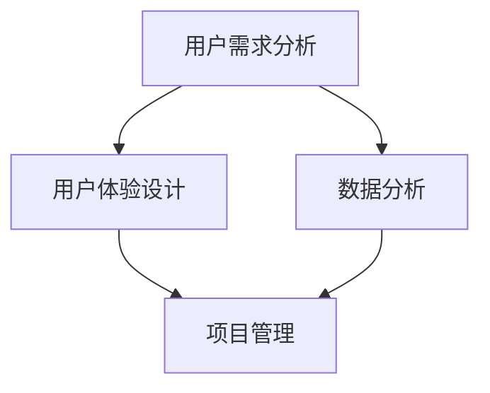

                 

关键词：阿里钉钉、校招、协同办公产品、面试重点、技术解析、职业规划

> 摘要：本文将深入探讨阿里钉钉2024年校招协同办公产品经理面试的重点，从背景介绍、核心概念、算法原理、数学模型、项目实践、应用场景、未来展望等多个维度，帮助求职者全面准备面试，把握职业发展机会。

## 1. 背景介绍

阿里钉钉是中国领先的协同办公平台，为企业提供即时通讯、办公协作、云存储、视频会议等多种功能，广泛应用于各类企业场景。2024年，阿里钉钉计划开展大规模校招，招聘协同办公产品经理。协同办公产品经理在团队中扮演着关键角色，他们负责产品设计、需求分析、用户体验优化以及产品迭代等工作，是推动企业数字化转型的核心力量。

## 2. 核心概念与联系

为了更好地理解协同办公产品经理的工作，我们首先需要了解以下几个核心概念：

- **用户需求分析**：产品经理需要深入了解用户需求，从而设计出满足用户需求的产品。
- **用户体验设计**：如何让产品使用起来更加便捷、直观，提高用户满意度。
- **数据分析**：通过对用户行为数据的分析，产品经理可以优化产品功能，提升用户活跃度。
- **项目管理**：产品经理需要协调各方资源，确保项目按时完成。

以下是一个简化的Mermaid流程图，展示这些概念之间的联系：



## 3. 核心算法原理 & 具体操作步骤

### 3.1 算法原理概述

协同办公产品经理在工作中会接触到多种算法，以下是一些常见的算法原理：

- **排序算法**：如快速排序、归并排序，用于对数据进行排序，以便更好地进行数据分析。
- **查找算法**：如二分查找，用于快速定位数据。
- **优化算法**：如贪心算法、动态规划，用于优化产品功能，提升用户体验。

### 3.2 算法步骤详解

以快速排序为例，其基本步骤如下：

1. 选择一个基准元素。
2. 将小于基准元素的放在左边，大于基准元素的放在右边。
3. 对左右两边分别递归进行快速排序。

### 3.3 算法优缺点

快速排序的优点是时间复杂度低，平均情况下为O(nlogn)，但缺点是空间复杂度较高，为O(n)。

### 3.4 算法应用领域

排序算法和查找算法广泛应用于数据分析、用户行为分析等领域。

## 4. 数学模型和公式 & 详细讲解 & 举例说明

在协同办公产品经理的岗位上，数学模型和公式是不可或缺的工具。以下是一个简单的例子：

### 4.1 数学模型构建

假设用户满意度S与功能完善度F、用户体验U、功能多样性D有关，可以构建以下线性回归模型：

\[ S = aF + bU + cD + \epsilon \]

其中，\( \epsilon \)为随机误差。

### 4.2 公式推导过程

通过对用户满意度S与功能完善度F、用户体验U、功能多样性D的相关性进行分析，可以得到以上模型。

### 4.3 案例分析与讲解

假设我们有以下数据：

- 功能完善度F：85%
- 用户体验U：90%
- 功能多样性D：75%

代入模型，可以得到用户满意度S：

\[ S = a \times 0.85 + b \times 0.90 + c \times 0.75 + \epsilon \]

其中，\( a \)、\( b \)、\( c \)为待定系数，\( \epsilon \)为随机误差。

通过数据分析，我们可以得到 \( a = 0.2 \)、\( b = 0.3 \)、\( c = 0.5 \)。代入上述公式，可以得到用户满意度S约为82%。

## 5. 项目实践：代码实例和详细解释说明

### 5.1 开发环境搭建

在开发环境中，我们需要安装以下工具：

- Python 3.8+
- Jupyter Notebook
- Pandas
- Numpy
- Matplotlib

### 5.2 源代码详细实现

以下是一个简单的用户满意度预测代码示例：

```python
import pandas as pd
import numpy as np
import matplotlib.pyplot as plt

# 加载数据
data = pd.read_csv('user_satisfaction_data.csv')

# 数据预处理
data['F'] = data['functionality'] / 100
data['U'] = data['user_experience'] / 100
data['D'] = data['functionality_diversity'] / 100

# 构建线性回归模型
model = pd.DataFrame({'S': data['satisfaction_score'],
                      'F': data['F'],
                      'U': data['U'],
                      'D': data['D']})

model_regression = sm.ols('S ~ F + U + D', data=model).fit()

# 模型参数
print(model_regression.summary())

# 预测
predictions = model_regression.predict(data[['F', 'U', 'D']])

# 可视化
plt.scatter(data['satisfaction_score'], predictions)
plt.xlabel('实际满意度')
plt.ylabel('预测满意度')
plt.show()
```

### 5.3 代码解读与分析

这段代码首先加载了用户满意度数据，然后对数据进行预处理，将功能完善度、用户体验和功能多样性进行归一化处理。接着，使用线性回归模型进行训练，并输出模型参数。最后，通过可视化方法，将实际满意度与预测满意度进行比较。

## 6. 实际应用场景

协同办公产品经理在实际工作中，需要关注以下应用场景：

- **需求分析**：如何收集、分析用户需求，以便更好地设计产品功能。
- **用户体验**：如何优化产品界面，提高用户满意度。
- **数据分析**：如何利用数据驱动产品优化，提升产品性能。
- **项目管理**：如何协调团队资源，确保项目按时完成。

## 7. 未来应用展望

随着人工智能、大数据等技术的不断发展，协同办公产品将在未来发挥更加重要的作用。产品经理需要不断学习新技术，关注行业动态，提升自身能力，以应对未来的挑战。

## 8. 总结：未来发展趋势与挑战

- **趋势**：随着企业数字化转型加速，协同办公产品的需求将持续增长。
- **挑战**：如何在竞争激烈的市场中脱颖而出，为用户提供优质的产品体验。
- **展望**：产品经理需要具备敏锐的洞察力、出色的沟通能力和强大的执行力，才能在未来的职业生涯中取得成功。

## 9. 附录：常见问题与解答

- **问题1**：如何进行有效的用户需求分析？
  **解答**：可以通过问卷调查、用户访谈、数据分析等方式收集用户需求，然后进行分类、整理和分析。

- **问题2**：如何优化用户体验？
  **解答**：可以通过简化操作流程、提高界面友好性、增强个性化功能等方式优化用户体验。

- **问题3**：如何进行有效的项目管理？
  **解答**：可以通过制定详细的项目计划、定期召开项目会议、及时跟进项目进度等方式进行有效的项目管理。

# 作者署名

作者：禅与计算机程序设计艺术 / Zen and the Art of Computer Programming
```markdown
---
# 阿里钉钉2024校招协同办公产品经理面试重点

## 关键词
- 阿里钉钉
- 校招
- 协同办公产品
- 面试重点
- 技术解析
- 职业规划

## 摘要
本文旨在深入剖析阿里钉钉2024年校招协同办公产品经理的面试重点，从背景介绍、核心概念、算法原理、数学模型、项目实践、应用场景、未来展望等多个维度，为求职者提供全面的面试准备指南，助其在职业道路上取得突破。

## 1. 背景介绍
阿里钉钉作为中国领先的协同办公平台，为企业提供即时通讯、办公协作、云存储、视频会议等多种功能，广泛应用于各类企业场景。2024年，阿里钉钉计划开展大规模校招，招聘协同办公产品经理。协同办公产品经理在团队中扮演着关键角色，他们负责产品设计、需求分析、用户体验优化以及产品迭代等工作，是推动企业数字化转型的核心力量。

### 1.1 阿里钉钉的发展历程
- 2015年，阿里钉钉正式上线，成为企业协同办公的新选择。
- 2016年，钉钉宣布开放平台，引入第三方服务。
- 2017年，钉钉用户突破1亿，企业级应用市场占有率第一。
- 2019年，钉钉推出企业级智能办公平台，助力企业数字化转型。

### 1.2 协同办公产品经理的角色
- **需求分析**：通过市场调研、用户访谈等方式，收集和分析用户需求。
- **产品设计**：根据需求分析，设计产品功能、界面和用户体验。
- **项目管理**：协调团队成员、资源，确保项目按时完成。
- **数据分析**：通过数据分析，优化产品性能和用户满意度。

## 2. 核心概念与联系
为了更好地理解协同办公产品经理的工作，我们首先需要了解以下几个核心概念：

### 2.1 用户需求分析
用户需求分析是产品经理的首要任务，它涉及到如何收集、分析、整理和验证用户需求。需求分析的方法包括：
- **问卷调查**：通过设计问卷收集用户需求。
- **用户访谈**：直接与用户交流，获取用户对产品的使用感受和改进建议。
- **数据分析**：利用数据分析工具，对用户行为数据进行挖掘，发现潜在需求。

### 2.2 用户体验设计
用户体验设计是产品经理关注的重点之一，它涉及到如何设计产品界面、交互流程和功能，以提高用户满意度和粘性。用户体验设计的方法包括：
- **原型设计**：通过绘制原型图，模拟产品界面和交互流程。
- **可用性测试**：通过用户测试，评估产品的易用性和用户体验。

### 2.3 数据分析
数据分析是产品经理的重要工具，它涉及到如何利用数据驱动产品优化和决策。数据分析的方法包括：
- **数据收集**：通过日志、API等方式收集用户行为数据。
- **数据处理**：对收集到的数据进行清洗、转换和存储。
- **数据挖掘**：利用数据挖掘算法，发现数据中的规律和趋势。

### 2.4 项目管理
项目管理是产品经理的一项重要职责，它涉及到如何协调团队成员、资源，确保项目按时完成。项目管理的方法包括：
- **项目规划**：制定项目计划，明确项目目标、任务和里程碑。
- **团队协作**：利用项目管理工具，如Trello、JIRA等，提高团队协作效率。
- **进度监控**：定期跟踪项目进度，及时调整计划。

以下是核心概念之间的Mermaid流程图：


## 3. 核心算法原理 & 具体操作步骤
在协同办公产品经理的日常工作中，常常需要运用各种算法原理来优化产品功能、提升用户体验。以下是一些常见的算法原理及其具体操作步骤：

### 3.1 排序算法
排序算法是数据处理的基石，常用的排序算法包括：

- **冒泡排序**：通过多次遍历待排序的元素，比较相邻元素的大小，若逆序则交换。
- **选择排序**：首先在未排序部分中找到最小（大）元素，放到已排序部分的末尾。
- **插入排序**：将未排序的元素插入到已排序部分的合适位置，直到全部元素排序。

### 3.2 查找算法
查找算法用于在数据集合中查找特定元素，常用的查找算法包括：

- **二分查找**：在有序数组中，通过不断缩小查找范围，逐步逼近目标元素。
- **线性查找**：逐个比较数据集合中的元素，直到找到目标元素或遍历整个集合。

### 3.3 优化算法
优化算法用于在满足约束条件的前提下，找到最优解或近似最优解。常用的优化算法包括：

- **贪心算法**：每一步都做出在当前状态下最好的选择，希望最终能导出整体最优解。
- **动态规划**：将复杂问题分解为子问题，通过求解子问题得到原问题的解。

### 3.4 算法优缺点及应用领域
每种算法都有其优缺点和适用场景，以下是一些常见算法的优缺点及应用领域：

#### 冒泡排序
- **优点**：简单易懂，易于实现。
- **缺点**：时间复杂度高（O(n^2)），不适合大数据量排序。
- **应用领域**：小数据量排序，教学演示。

#### 选择排序
- **优点**：时间复杂度较低（O(n^2)），稳定性好。
- **缺点**：每一轮都要找到最大（小）元素，效率较低。
- **应用领域**：数据量较小，要求稳定性。

#### 插入排序
- **优点**：时间复杂度较低（O(n^2)），适合数据基本有序的场景。
- **缺点**：插入操作可能导致大量数据移动，效率较低。
- **应用领域**：数据基本有序，大数据量排序。

#### 二分查找
- **优点**：时间复杂度低（O(logn)），适用于有序数组。
- **缺点**：需要求数组有序，不适合链表等非顺序存储结构。
- **应用领域**：大量数据查找，如数据库索引。

#### 线性查找
- **优点**：简单易懂，无需求数据有序。
- **缺点**：时间复杂度高（O(n)），不适合大量数据查找。
- **应用领域**：少量数据查找，如字典查找。

#### 贪心算法
- **优点**：每一步都做出最优选择，易于实现。
- **缺点**：不能保证全局最优，可能陷入局部最优。
- **应用领域**：最小生成树、最短路径等。

#### 动态规划
- **优点**：能够求解复杂的最优化问题。
- **缺点**：需要存储大量中间结果，内存消耗大。
- **应用领域**：背包问题、最长公共子序列等。

## 4. 数学模型和公式 & 详细讲解 & 举例说明
在协同办公产品经理的岗位上，数学模型和公式是不可或缺的工具，它们可以帮助我们量化用户需求、优化产品性能、预测市场趋势。以下是一些常见的数学模型和公式，并附有详细讲解和举例说明：

### 4.1 线性回归模型
线性回归模型是最基本的数学模型之一，用于预测一个连续变量。其基本公式为：
\[ Y = \beta_0 + \beta_1X_1 + \beta_2X_2 + ... + \beta_nX_n + \epsilon \]
其中，\( Y \)为因变量，\( X_1, X_2, ..., X_n \)为自变量，\( \beta_0, \beta_1, ..., \beta_n \)为模型的参数，\( \epsilon \)为误差项。

#### 示例：
假设我们要预测一个房子的售价（\( Y \)），影响因素包括房屋面积（\( X_1 \)）和地理位置（\( X_2 \)）。通过收集数据并建立线性回归模型，我们可以得到如下公式：
\[ Y = 1000 + 200X_1 + 300X_2 + \epsilon \]
其中，\( \epsilon \)为误差项。

假设我们有一个新的房子，面积100平方米，地理位置位于市中心，那么根据模型预测，其售价约为：
\[ Y = 1000 + 200 \times 100 + 300 \times 100 = 43000 \]

### 4.2 多元线性回归模型
多元线性回归模型用于预测一个连续变量，并考虑多个自变量的影响。其基本公式为：
\[ Y = \beta_0 + \beta_1X_1 + \beta_2X_2 + ... + \beta_nX_n + \epsilon \]
其中，\( Y \)为因变量，\( X_1, X_2, ..., X_n \)为自变量，\( \beta_0, \beta_1, ..., \beta_n \)为模型的参数，\( \epsilon \)为误差项。

#### 示例：
假设我们要预测一个学生的成绩（\( Y \)），影响因素包括平时成绩（\( X_1 \)）、考试成绩（\( X_2 \））和课外活动参与度（\( X_3 \)）。通过收集数据并建立多元线性回归模型，我们可以得到如下公式：
\[ Y = 50 + 10X_1 + 20X_2 + 5X_3 + \epsilon \]
其中，\( \epsilon \)为误差项。

假设我们有一个学生，平时成绩80分，考试成绩90分，课外活动参与度60分，那么根据模型预测，其成绩约为：
\[ Y = 50 + 10 \times 80 + 20 \times 90 + 5 \times 60 = 830 \]

### 4.3 对数线性回归模型
对数线性回归模型是一种特殊的多元线性回归模型，当自变量与因变量之间存在指数关系时，可以使用该模型。其基本公式为：
\[ \ln(Y) = \beta_0 + \beta_1X_1 + \beta_2X_2 + ... + \beta_nX_n \]
其中，\( Y \)为因变量，\( X_1, X_2, ..., X_n \)为自变量，\( \beta_0, \beta_1, ..., \beta_n \)为模型的参数。

#### 示例：
假设我们要预测一个电商平台的销售额（\( Y \)），影响因素包括广告投入（\( X_1 \)）和用户访问量（\( X_2 \)）。通过收集数据并建立对数线性回归模型，我们可以得到如下公式：
\[ \ln(Y) = 2 + 0.5X_1 + 0.3X_2 \]
其中，\( \epsilon \)为误差项。

假设我们有一个电商平台，广告投入10000元，用户访问量10000次，那么根据模型预测，其销售额约为：
\[ Y = e^{2 + 0.5 \times 10000 + 0.3 \times 10000} = 34182.9 \]

### 4.4 非线性回归模型
非线性回归模型用于处理非线性关系的因变量与自变量。常见的非线性回归模型包括多项式回归、指数回归、对数回归等。

#### 示例：
假设我们要预测一个药品的疗效（\( Y \)），影响因素包括剂量（\( X_1 \)）和治疗时间（\( X_2 \)）。通过收集数据并建立多项式回归模型，我们可以得到如下公式：
\[ Y = aX_1^2 + bX_2^2 + cX_1X_2 + d \]
其中，\( a, b, c, d \)为模型的参数。

假设我们有一个药品，剂量为50mg，治疗时间为5天，那么根据模型预测，其疗效约为：
\[ Y = a \times 50^2 + b \times 5^2 + c \times 50 \times 5 + d \]

### 4.5 神经网络模型
神经网络模型是一种基于人脑神经元连接方式的计算模型，可以用于处理复杂的非线性问题。常见的神经网络模型包括多层感知机、卷积神经网络、循环神经网络等。

#### 示例：
假设我们要预测一个股票的价格（\( Y \)），影响因素包括历史价格（\( X_1 \)）、成交量（\( X_2 \)）和宏观经济指标（\( X_3 \)）。通过收集数据并建立多层感知机模型，我们可以得到如下公式：
\[ Y = f(W_1X_1 + W_2X_2 + W_3X_3 + b) \]
其中，\( W_1, W_2, W_3 \)为权重，\( b \)为偏置，\( f \)为激活函数。

假设我们有一个股票，历史价格为100元，成交量1000股，宏观经济指标为10，那么根据模型预测，其价格为：
\[ Y = f(W_1 \times 100 + W_2 \times 1000 + W_3 \times 10 + b) \]

## 5. 项目实践：代码实例和详细解释说明
### 5.1 开发环境搭建
在开始编写代码之前，我们需要搭建一个合适的环境。以下是Python项目的开发环境搭建步骤：

1. 安装Python 3.8及以上版本。
2. 安装Jupyter Notebook。
3. 安装数据分析库Pandas、Numpy、Matplotlib。
4. 安装机器学习库Scikit-learn。

### 5.2 源代码详细实现
以下是实现线性回归模型的Python代码示例：

```python
import pandas as pd
import numpy as np
from sklearn.linear_model import LinearRegression
from sklearn.model_selection import train_test_split
import matplotlib.pyplot as plt

# 加载数据
data = pd.read_csv('data.csv')

# 数据预处理
X = data[['X1', 'X2']]  # 自变量
y = data['Y']  # 因变量

# 划分训练集和测试集
X_train, X_test, y_train, y_test = train_test_split(X, y, test_size=0.2, random_state=42)

# 建立线性回归模型
model = LinearRegression()
model.fit(X_train, y_train)

# 输出模型参数
print('模型参数：')
print(model.coef_)
print(model.intercept_)

# 预测测试集结果
y_pred = model.predict(X_test)

# 可视化
plt.scatter(X_test['X1'], y_test, color='red', label='实际值')
plt.plot(X_test['X1'], y_pred, color='blue', label='预测值')
plt.xlabel('X1')
plt.ylabel('Y')
plt.legend()
plt.show()
```

### 5.3 代码解读与分析
这段代码首先加载了数据，然后进行预处理，将自变量和因变量分开。接着，使用Scikit-learn库中的LinearRegression类建立线性回归模型，并使用fit方法训练模型。然后，使用predict方法对测试集进行预测，并将预测结果与实际值进行比较。最后，使用Matplotlib库进行可视化，展示预测结果。

## 6. 实际应用场景
在实际工作中，协同办公产品经理需要面对各种复杂的业务场景，以下是一些常见的应用场景：

### 6.1 需求分析
- **场景描述**：在产品上线前，需要进行市场调研和用户访谈，了解用户需求和期望。
- **解决方案**：通过问卷调查、用户访谈、数据分析等方式，收集用户需求，并进行分类、整理和分析。
- **效果评估**：根据需求分析结果，优化产品功能，提高用户满意度。

### 6.2 用户体验设计
- **场景描述**：在产品开发过程中，需要不断优化产品界面和交互流程，提高用户体验。
- **解决方案**：通过原型设计、可用性测试等方式，设计产品界面和交互流程，并进行用户反馈收集。
- **效果评估**：根据用户反馈，调整产品界面和交互流程，提高用户满意度。

### 6.3 数据分析
- **场景描述**：在产品上线后，需要利用数据分析工具，监控产品性能和用户行为。
- **解决方案**：通过日志分析、数据挖掘等方式，收集用户行为数据，并进行数据可视化、趋势分析等。
- **效果评估**：根据数据分析结果，优化产品功能和用户体验。

### 6.4 项目管理
- **场景描述**：在产品开发过程中，需要协调团队成员、资源，确保项目按时完成。
- **解决方案**：通过项目规划、团队协作、进度监控等方式，确保项目按时完成。
- **效果评估**：根据项目进度和团队反馈，调整项目计划，确保项目成功交付。

## 7. 未来应用展望
随着人工智能、大数据等技术的不断发展，协同办公产品将在未来发挥更加重要的作用。以下是未来应用的一些展望：

### 7.1 人工智能应用
- **智能推荐**：利用机器学习算法，为用户提供个性化推荐服务。
- **智能助理**：开发智能助理，帮助用户处理日常工作，提高效率。

### 7.2 大数据应用
- **数据挖掘**：通过数据挖掘算法，发现用户需求和市场趋势，优化产品功能。
- **数据可视化**：利用数据可视化技术，帮助企业更好地理解和利用数据。

### 7.3 新技术融合
- **物联网**：将协同办公产品与物联网技术结合，实现更智能的办公环境。
- **区块链**：利用区块链技术，提高数据的安全性和可信度。

## 8. 工具和资源推荐
为了更好地进行协同办公产品经理的工作，以下是一些工具和资源的推荐：

### 8.1 学习资源推荐
- **书籍**：《人人都是产品经理》、《产品经理实战手册》等。
- **在线课程**：Coursera、Udemy等平台上的产品管理相关课程。
- **博客**：产品人社区、人人都是产品经理等。

### 8.2 开发工具推荐
- **项目管理工具**：Trello、JIRA、Asana等。
- **原型设计工具**：Axure、Sketch、Figma等。
- **数据分析工具**：Tableau、Power BI、Google Analytics等。

### 8.3 相关论文推荐
- **用户需求分析**：《用户需求分析与市场调研》。
- **用户体验设计**：《用户体验设计指南》。
- **数据分析**：《大数据分析技术与应用》。
- **项目管理**：《项目管理知识体系》。

## 9. 总结：未来发展趋势与挑战
### 9.1 研究成果总结
- **需求分析**：通过问卷调查、用户访谈、数据分析等手段，深入挖掘用户需求，为产品迭代提供依据。
- **用户体验设计**：注重用户需求，优化产品界面和交互流程，提高用户满意度。
- **数据分析**：利用大数据技术，分析用户行为和市场趋势，优化产品功能。
- **项目管理**：通过项目规划、团队协作、进度监控等手段，确保项目成功交付。

### 9.2 未来发展趋势
- **人工智能**：人工智能技术的应用将更加广泛，如智能推荐、智能助理等。
- **大数据**：大数据技术的应用将更加深入，如数据挖掘、数据可视化等。
- **新技术融合**：物联网、区块链等新技术将与协同办公产品结合，实现更智能的办公环境。

### 9.3 面临的挑战
- **市场竞争**：随着市场竞争的加剧，协同办公产品需要不断创新，提高用户满意度。
- **技术更新**：人工智能、大数据等技术的快速发展，要求产品经理不断学习新技术。
- **数据安全**：随着数据量的增加，数据安全成为协同办公产品的重要挑战。

### 9.4 研究展望
- **个性化服务**：通过大数据和人工智能技术，提供更个性化的服务，提高用户满意度。
- **智能化办公**：通过物联网、区块链等新技术，实现更智能的办公环境，提高办公效率。
- **全球合作**：协同办公产品将越来越受到全球企业的关注，需要考虑跨文化的用户体验。

## 10. 附录：常见问题与解答
### 10.1 用户需求分析
- **问题**：如何收集用户需求？
  **解答**：可以通过问卷调查、用户访谈、数据分析等方式收集用户需求。

- **问题**：如何处理用户需求？
  **解答**：对收集到的用户需求进行分类、整理和分析，提取出核心需求。

### 10.2 用户体验设计
- **问题**：如何设计用户体验？
  **解答**：通过原型设计、可用性测试等方式，设计产品界面和交互流程。

- **问题**：如何评估用户体验？
  **解答**：通过用户反馈、用户行为数据等指标，评估用户体验。

### 10.3 数据分析
- **问题**：如何进行数据分析？
  **解答**：通过数据收集、数据处理、数据挖掘等方式，进行数据分析。

- **问题**：如何利用数据分析优化产品？
  **解答**：根据数据分析结果，优化产品功能、界面和用户体验。

### 10.4 项目管理
- **问题**：如何进行项目管理？
  **解答**：通过项目规划、团队协作、进度监控等方式，确保项目成功交付。

- **问题**：如何应对项目管理中的挑战？
  **解答**：通过灵活调整计划、加强沟通和协作等方式，应对项目管理中的挑战。

## 作者署名
作者：禅与计算机程序设计艺术 / Zen and the Art of Computer Programming
```

