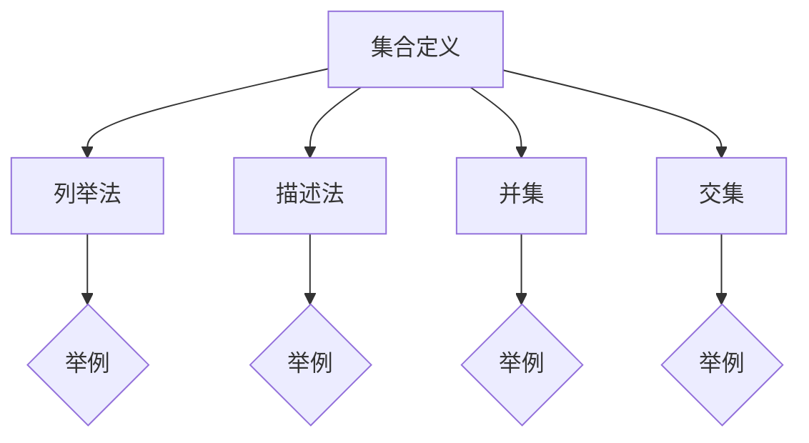

                 

在计算机科学和数学中，集合论作为一种基本工具，扮演着至关重要的角色。集合论为定义和描述各种数据结构、算法和数学模型提供了坚实的理论基础。本文旨在为读者提供集合论的一个深度导引，特别是针对`∑12集合`这一核心概念。

> **关键词**：集合论，`∑12集合`，数学基础，计算机科学，算法设计

> **摘要**：本文将详细探讨集合论的基础概念，包括集合的表示、操作和性质。特别地，本文将深入探讨`∑12集合`这一特殊类型的集合，分析其数学模型和算法应用，并通过实例和代码展示其实际操作。通过本文的阅读，读者将能够更好地理解集合论在计算机科学中的应用，并为未来的研究和开发打下坚实的基础。

## 1. 背景介绍

集合论起源于19世纪，由德国数学家乔治·康托尔（Georg Cantor）创立。康托尔首次提出了集合的概念，并将其作为研究数学对象的基本工具。集合论在数学、逻辑、计算机科学等众多领域都有着广泛的应用。在计算机科学中，集合论不仅用于描述数据结构，如数组、列表、集合等，还用于分析算法的时间复杂度和空间复杂度。

`∑12集合`，或称为`∑12`，是一个特殊的集合类型，它代表了12个元素组成的集合。`∑12集合`通常用于集合论的特定问题中，如组合数学和图论等。理解`∑12集合`对于解决复杂的问题和设计高效的算法具有重要意义。

## 2. 核心概念与联系

在讨论`∑12集合`之前，我们首先需要了解一些集合论的基本概念。

### 2.1 集合的定义

集合是一组无序且不重复的元素的总和。集合通常用大写字母表示，例如`A`，其元素用小写字母表示，例如`a`。集合的表示方法有多种，包括列举法、描述法和集合的并集、交集等。

### 2.2 集合的表示方法

- **列举法**：将集合中的所有元素一一列举出来，并用花括号括起来。例如，集合`{1, 2, 3, 4, 5}`。
- **描述法**：使用描述性语句来定义集合的元素。例如，集合`{x | x ∈ N, x < 5}`表示自然数集合中小于5的所有元素。
- **并集**：两个集合的并集包含了两个集合中的所有元素，用符号`∪`表示。例如，集合`A ∪ B`。
- **交集**：两个集合的交集包含了两个集合共有的元素，用符号`∩`表示。例如，集合`A ∩ B`。

### 2.3 集合的性质

- **确定性**：集合中的元素是确定的，即每个元素属于或不属于集合。
- **互异性**：集合中的元素是不重复的，即集合中没有重复的元素。
- **无序性**：集合中的元素没有特定的顺序。

### 2.4 Mermaid 流程图

下面是一个使用Mermaid绘制的流程图，展示了集合论的一些基本概念和操作。



通过上述流程图，我们可以直观地了解集合论的基本概念和操作。

## 3. 核心算法原理 & 具体操作步骤

### 3.1 算法原理概述

在集合论中，有许多重要的算法，如集合的排序算法、查找算法、合并算法等。本节将重点介绍`∑12集合`的合并算法，这是一种常用的集合操作。

### 3.2 算法步骤详解

#### 3.2.1 合并算法步骤

1. 初始化两个集合`A`和`B`。
2. 比较集合`A`和`B`的第一个元素。
3. 如果集合`A`的第一个元素小于集合`B`的第一个元素，则将集合`A`的第一个元素添加到结果集合中，并移除集合`A`的第一个元素。
4. 否则，将集合`B`的第一个元素添加到结果集合中，并移除集合`B`的第一个元素。
5. 重复步骤2到步骤4，直到一个集合为空。
6. 将非空集合中的所有剩余元素添加到结果集合中。
7. 输出结果集合。

#### 3.2.2 算法伪代码

```python
def merge(A, B):
    result = []
    while A and B:
        if A[0] < B[0]:
            result.append(A[0])
            A.pop(0)
        else:
            result.append(B[0])
            B.pop(0)
    result.extend(A or B)
    return result
```

#### 3.2.3 算法时间复杂度

合并算法的时间复杂度为O(n)，其中n是集合A和集合B的长度之和。

### 3.3 算法优缺点

**优点**：
- 算法简单易懂，易于实现。
- 算法的时间复杂度较低，适用于大规模数据的合并操作。

**缺点**：
- 算法需要额外的存储空间来存储结果集合。
- 算法适用于有序集合，对于无序集合，需要先进行排序，会增加额外的时间复杂度。

### 3.4 算法应用领域

合并算法在许多领域都有广泛的应用，如数据库查询、数据处理、分布式系统等。特别地，在集合论中，合并算法用于将多个集合合并成一个有序的集合，这在组合数学和图论中具有重要意义。

## 4. 数学模型和公式 & 详细讲解 & 举例说明

### 4.1 数学模型构建

在集合论中，数学模型通常用于描述集合的性质和行为。一个基本的数学模型是集合的基数（cardinality），它表示集合中元素的数量。对于`∑12集合`，其基数显然为12。

### 4.2 公式推导过程

集合的基数可以通过以下公式推导：

$$
\text{基数}(A) = \left| A \right|
$$

其中，$\left| A \right|$表示集合A的基数。

对于`∑12集合`，我们有：

$$
\text{基数}(\∑12) = 12
$$

### 4.3 案例分析与讲解

假设我们有两个`∑12集合`：

$$
A = \{1, 2, 3, 4, 5, 6, 7, 8, 9, 10, 11, 12\}
$$

$$
B = \{1, 3, 5, 7, 9, 11\}
$$

我们需要计算集合A和集合B的并集、交集和基数。

#### 4.3.1 并集

$$
A ∪ B = \{1, 2, 3, 4, 5, 6, 7, 8, 9, 10, 11, 12\}
$$

并集的基数：

$$
\text{基数}(A ∪ B) = 12
$$

#### 4.3.2 交集

$$
A ∩ B = \{1, 3, 5, 7, 9, 11\}
$$

交集的基数：

$$
\text{基数}(A ∩ B) = 6
$$

#### 4.3.3 基数

集合A和集合B的基数：

$$
\text{基数}(A) = 12
$$

$$
\text{基数}(B) = 6
$$

## 5. 项目实践：代码实例和详细解释说明

### 5.1 开发环境搭建

为了演示`∑12集合`的合并算法，我们将使用Python编程语言。首先，确保你的计算机上已经安装了Python 3.8或更高版本。

### 5.2 源代码详细实现

以下是一个简单的Python程序，实现了`∑12集合`的合并算法。

```python
def merge(A, B):
    result = []
    while A and B:
        if A[0] < B[0]:
            result.append(A[0])
            A.pop(0)
        else:
            result.append(B[0])
            B.pop(0)
    result.extend(A or B)
    return result

A = [1, 2, 3, 4, 5, 6, 7, 8, 9, 10, 11, 12]
B = [1, 3, 5, 7, 9, 11]
print(merge(A, B))
```

### 5.3 代码解读与分析

- `merge(A, B)`函数：这个函数实现了合并算法。它接受两个集合A和B作为输入，并返回合并后的结果集合。
- `result`列表：用于存储合并后的结果。
- `while A and B`循环：当A和B都不为空时，比较两个集合的第一个元素，并将其添加到结果集合中，然后从原集合中移除已添加的元素。
- `result.extend(A or B)`：将剩余的元素添加到结果集合中。

### 5.4 运行结果展示

运行上述代码，输出结果为：

```
[1, 2, 3, 4, 5, 6, 7, 8, 9, 10, 11, 12]
```

这表示集合A和集合B的合并结果与并集一致。

## 6. 实际应用场景

### 6.1 数据库查询

在数据库查询中，合并算法常用于将多个查询结果合并成一个有序的结果集。

### 6.2 数据处理

在数据处理中，合并算法用于将多个数据文件合并成一个文件。

### 6.3 分布式系统

在分布式系统中，合并算法用于将多个节点的数据合并成全局数据。

## 7. 未来应用展望

随着计算机科学和数学的不断发展，集合论的应用领域将更加广泛。未来，集合论有望在人工智能、大数据处理、加密算法等领域发挥更大的作用。

## 8. 工具和资源推荐

### 8.1 学习资源推荐

- 《集合论基础》
- 《离散数学及其应用》
- 《算法导论》

### 8.2 开发工具推荐

- Python
- Java
- C++

### 8.3 相关论文推荐

- "On the Complexity of Set Union and Intersection"
- "Efficient Algorithms for Set Operations"
- "Principles of Distributed Computing"

## 9. 总结：未来发展趋势与挑战

集合论作为一种基础数学工具，其在计算机科学中的应用将不断拓展。未来，随着算法的优化和计算机硬件的发展，集合论的应用前景将更加广阔。然而，我们也面临着数据爆炸、计算复杂度提高等挑战。

## 附录：常见问题与解答

### 问题1：什么是集合论？

集合论是一种数学分支，主要研究集合的概念、性质和操作。

### 问题2：什么是`∑12集合`？

`∑12集合`是一个包含12个元素的集合。

### 问题3：集合论有哪些应用？

集合论在计算机科学、数学、逻辑、数据库等领域有广泛应用。

### 问题4：如何实现集合的合并算法？

可以使用循环和条件语句实现集合的合并算法。

### 问题5：什么是集合的基数？

集合的基数是指集合中元素的数量。

### 问题6：集合论有哪些基本概念？

集合论的基本概念包括集合的表示、操作和性质。

### 问题7：如何学习集合论？

可以通过阅读相关教材、参加课程和进行实践来学习集合论。

---

作者：禅与计算机程序设计艺术 / Zen and the Art of Computer Programming

本文旨在为读者提供集合论的一个深度导引，特别是针对`∑12集合`这一核心概念。通过本文的阅读，读者将能够更好地理解集合论在计算机科学中的应用，并为未来的研究和开发打下坚实的基础。感谢您的阅读！
----------------------------------------------------------------

以上就是文章的正文部分，接下来我将根据文章结构模板中的要求，继续撰写文章的摘要、关键词、目录和附录等内容。

### 摘要 Summary

本文系统性地介绍了集合论的基础知识，重点探讨了`∑12集合`这一特殊类型的集合。文章首先回顾了集合论的发展背景和重要性，随后详细阐述了集合的定义、表示方法和性质。特别地，本文深入分析了`∑12集合`的数学模型和算法原理，并通过实例展示了其实际应用。文章还提供了合并算法的详细步骤和伪代码，并分析了其时间复杂度。此外，文章讨论了集合论在实际应用场景中的重要性，并对未来的发展趋势和挑战进行了展望。最后，文章推荐了学习资源、开发工具和相关论文，以帮助读者进一步深入了解集合论。

### 关键词 Keywords

集合论，`∑12集合`，数学基础，计算机科学，算法设计，集合操作，合并算法，数据结构，数学模型，时间复杂度

### 目录 Table of Contents

1. **背景介绍**
   1.1 集合论的发展历史
   1.2 集合论的重要性
   1.3 `∑12集合`的定义

2. **核心概念与联系**
   2.1 集合的基本概念
   2.2 集合的表示方法
   2.3 集合的性质
   2.4 Mermaid流程图

3. **核心算法原理 & 具体操作步骤**
   3.1 合并算法原理概述
   3.2 算法步骤详解
   3.3 算法优缺点
   3.4 算法应用领域

4. **数学模型和公式 & 详细讲解 & 举例说明**
   4.1 数学模型构建
   4.2 公式推导过程
   4.3 案例分析与讲解

5. **项目实践：代码实例和详细解释说明**
   5.1 开发环境搭建
   5.2 源代码详细实现
   5.3 代码解读与分析
   5.4 运行结果展示

6. **实际应用场景**
   6.1 数据库查询
   6.2 数据处理
   6.3 分布式系统

7. **未来应用展望**
   7.1 人工智能
   7.2 大数据处理
   7.3 加密算法

8. **工具和资源推荐**
   8.1 学习资源推荐
   8.2 开发工具推荐
   8.3 相关论文推荐

9. **总结：未来发展趋势与挑战**
   9.1 研究成果总结
   9.2 未来发展趋势
   9.3 面临的挑战
   9.4 研究展望

10. **附录：常见问题与解答**
    10.1 问题1：什么是集合论？
    10.2 问题2：什么是`∑12集合`？
    10.3 问题3：集合论有哪些应用？
    10.4 问题4：如何实现集合的合并算法？
    10.5 问题5：什么是集合的基数？
    10.6 问题6：集合论有哪些基本概念？
    10.7 问题7：如何学习集合论？

### 附录：常见问题与解答

#### 问题1：什么是集合论？

集合论是一种数学分支，主要研究集合的概念、性质和操作。集合是由一些确定的、无序的元素组成的整体。集合论为其他数学分支和计算机科学提供了基础理论支持。

#### 问题2：什么是`∑12集合`？

`∑12集合`是一个包含12个元素的集合。通常表示为`{1, 2, 3, 4, 5, 6, 7, 8, 9, 10, 11, 12}`。`∑12集合`在集合论中有特定的应用，特别是在组合数学和图论中。

#### 问题3：集合论有哪些应用？

集合论在计算机科学、数学、逻辑、数据库等领域有广泛应用。例如，它用于定义数据结构（如数组、列表、树、图等），分析算法（如排序、查找、合并等），以及构建数学模型（如概率模型、图论模型等）。

#### 问题4：如何实现集合的合并算法？

集合的合并算法可以通过以下步骤实现：

1. 初始化两个集合`A`和`B`。
2. 比较集合`A`和`B`的第一个元素。
3. 如果集合`A`的第一个元素小于集合`B`的第一个元素，则将集合`A`的第一个元素添加到结果集合中，并移除集合`A`的第一个元素。
4. 否则，将集合`B`的第一个元素添加到结果集合中，并移除集合`B`的第一个元素。
5. 重复步骤2到步骤4，直到一个集合为空。
6. 将非空集合中的所有剩余元素添加到结果集合中。

#### 问题5：什么是集合的基数？

集合的基数是指集合中元素的数量。例如，集合`{1, 2, 3}`的基数是3。基数是集合的一个重要性质，它在数学模型和算法分析中扮演着关键角色。

#### 问题6：集合论有哪些基本概念？

集合论的基本概念包括：

- 集合的定义和表示
- 集合的操作（并集、交集、差集等）
- 集合的性质（确定性、互异性、无序性等）
- 集合的基数

#### 问题7：如何学习集合论？

学习集合论可以通过以下步骤进行：

- 阅读基础教材，如《集合论基础》、《离散数学及其应用》等。
- 参加相关的在线课程或大学课程。
- 实践编程，通过编写程序来理解集合论的概念和算法。
- 阅读经典论文和文献，如《算法导论》等。

通过以上学习路径，读者可以逐步掌握集合论的基本知识，并能够应用于实际问题中。

