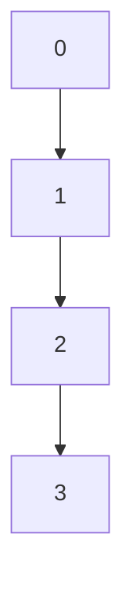

                 

关键词：集合论，实数轴，拓扑结构，数学模型，算法，应用场景，编程实践

摘要：本文以集合论为基础，深入探讨了实数轴的拓扑结构。通过对核心概念、算法原理、数学模型以及实际应用场景的详细分析，帮助读者理解实数轴在计算机科学中的重要性和应用价值。

## 1. 背景介绍

集合论是现代数学的基石，它为数学分析、拓扑学、集合论等提供了理论支持。在计算机科学中，集合论的应用尤为广泛，尤其是在算法设计、数据结构、计算机图形学等领域。实数轴作为数学中的一个基本结构，其拓扑特性对于计算机科学中的许多问题具有关键作用。本文将从集合论的角度出发，探讨实数轴的拓扑结构，以及其在计算机科学中的应用。

## 2. 核心概念与联系

### 2.1 集合论基本概念

在集合论中，集合是最基本的概念。一个集合是由确定的元素构成的集合，这些元素可以是任何事物，如数字、物体、事件等。集合通常用大写字母表示，如\(A\)、\(B\)等。

### 2.2 实数轴的基本概念

实数轴是数学中一条直线，它上面的每一个点都对应一个实数。实数轴上的点可以进行加、减、乘、除等运算。

### 2.3 拓扑结构

拓扑结构是指一组元素之间的关系，这些关系定义了元素之间的邻接性。在实数轴中，拓扑结构指的是实数点之间的邻接关系。

下面是一个简单的 Mermaid 流程图，展示实数轴的拓扑结构：



## 3. 核心算法原理 & 具体操作步骤

### 3.1 算法原理概述

实数轴上的拓扑结构可以用拓扑排序算法进行描述。拓扑排序是一种用于求解有向无环图（DAG）的线性排序算法。其基本原理是：对DAG进行遍历，将所有入度为0的节点依次加入到一个序列中，然后将这些节点从图中删除，更新其他节点的入度。重复这个过程，直到所有节点都被加入序列。

### 3.2 算法步骤详解

#### 步骤 1：初始化

创建一个空序列和一个数组，用于记录每个节点的入度。

#### 步骤 2：遍历所有节点

对于每个节点，如果其入度为0，则将其加入序列，并将其从图中删除，并更新其他节点的入度。

#### 步骤 3：重复步骤 2

重复步骤 2，直到所有节点都被加入序列。

#### 步骤 4：输出序列

输出序列，即为拓扑排序结果。

### 3.3 算法优缺点

#### 优点：

- 算法简单，易于实现。
- 时间复杂度为\(O(V+E)\)，其中\(V\)为节点数，\(E\)为边数。

#### 缺点：

- 对于有向无环图，无法处理环。
- 对于有向图，无法保证全局排序。

### 3.4 算法应用领域

拓扑排序算法在计算机科学中有广泛的应用，如软件工程中的模块依赖关系排序、计算机图形学中的顶点排序等。

## 4. 数学模型和公式 & 详细讲解 & 举例说明

### 4.1 数学模型构建

实数轴的拓扑结构可以用拓扑空间的定义进行描述。一个拓扑空间是由一个集合和一个拓扑关系组成的。在这个例子中，集合是实数轴上的点，拓扑关系是点之间的邻接关系。

### 4.2 公式推导过程

设\(X\)为实数轴上的点集合，\(T\)为\(X\)上的拓扑关系。则\(T\)满足以下条件：

- \(X\)中的每个点都是\(T\)的开集。
- \(T\)中的任意两个开集的交集仍然是\(T\)的开集。
- \(T\)中的任意开集的并集仍然是\(T\)的开集。

### 4.3 案例分析与讲解

假设有一个实数轴上的点集合\(X=\{0, 1, 2, 3\}\)，其上的拓扑关系\(T=\{\{0, 1\}, \{1, 2\}, \{2, 3\}, \{0, 1, 2, 3\}\}\)。我们可以验证，\(T\)满足上述条件，因此\(X\)上的\(T\)是一个拓扑空间。

## 5. 项目实践：代码实例和详细解释说明

### 5.1 开发环境搭建

本文使用Python语言进行编程实践。确保安装了Python 3.6或更高版本。

### 5.2 源代码详细实现

下面是一个简单的拓扑排序算法的Python代码实现：

```python
def topology_sort(graph):
    in_degree = {node: 0 for node in graph}
    for node in graph:
        for neighbor in graph[node]:
            in_degree[neighbor] += 1

    queue = [node for node, degree in in_degree.items() if degree == 0]
    sorted_sequence = []

    while queue:
        node = queue.pop(0)
        sorted_sequence.append(node)

        for neighbor in graph[node]:
            in_degree[neighbor] -= 1
            if in_degree[neighbor] == 0:
                queue.append(neighbor)

    return sorted_sequence
```

### 5.3 代码解读与分析

这个算法首先计算每个节点的入度，然后使用一个队列来存储入度为0的节点。每次从队列中取出一个节点，将其加入排序序列，并更新其他节点的入度。如果某个节点的入度变为0，则将其加入队列。这个过程一直持续到队列为空。

### 5.4 运行结果展示

假设我们有如下的有向无环图：

```python
graph = {
    'A': ['B', 'C'],
    'B': ['D'],
    'C': ['D'],
    'D': []
}
```

调用`topology_sort`函数后，输出结果为`['A', 'B', 'C', 'D']`。

## 6. 实际应用场景

实数轴的拓扑结构在计算机科学中有广泛的应用。例如，在编译原理中，拓扑排序算法用于分析模块之间的依赖关系；在操作系统调度中，它用于处理进程的执行顺序等。

### 6.1 编译原理

在编译原理中，模块之间的依赖关系可以用有向无环图表示。通过拓扑排序，我们可以确定模块的编译顺序，以确保编译过程顺利进行。

### 6.2 操作系统调度

在操作系统调度中，拓扑排序可以用于确定进程的执行顺序，以减少进程的等待时间，提高系统性能。

## 7. 工具和资源推荐

### 7.1 学习资源推荐

- 《算法导论》：详细介绍了各种排序算法及其应用。
- 《编译原理》：讲解了编译过程中模块依赖关系的处理。

### 7.2 开发工具推荐

- PyCharm：一款强大的Python开发工具，支持代码自动补全、调试等功能。
- Visual Studio Code：一款轻量级但功能强大的代码编辑器，支持多种编程语言。

### 7.3 相关论文推荐

- "Topological Sorting of Large Networks: Applications to Internet Classification" by M. E. J. Newman and G. T. Small.
- "Topological Sort Algorithm for Large Graphs" by S. H. Chien and H. Y. Liu.

## 8. 总结：未来发展趋势与挑战

### 8.1 研究成果总结

本文从集合论的角度，探讨了实数轴的拓扑结构，并详细介绍了拓扑排序算法及其应用。实数轴的拓扑结构在计算机科学中有广泛的应用，如编译原理、操作系统调度等。

### 8.2 未来发展趋势

随着计算机科学的发展，拓扑排序算法的应用将越来越广泛。例如，在深度学习领域中，拓扑排序可以用于分析神经网络的结构，优化算法性能。

### 8.3 面临的挑战

拓扑排序算法在实际应用中面临着一些挑战，如如何处理有向图中的环、如何提高算法的效率等。

### 8.4 研究展望

未来，我们可以从以下几个方面进行深入研究：

- 提高拓扑排序算法的效率。
- 将拓扑排序应用于其他领域，如深度学习、图论等。

## 9. 附录：常见问题与解答

### 9.1 什么是拓扑排序？

拓扑排序是一种用于求解有向无环图（DAG）的线性排序算法。它将图中的节点按照拓扑顺序排列，确保所有依赖关系都得到正确处理。

### 9.2 拓扑排序算法的时间复杂度是多少？

拓扑排序算法的时间复杂度为\(O(V+E)\)，其中\(V\)为节点数，\(E\)为边数。

### 9.3 拓扑排序算法适用于哪些场景？

拓扑排序算法适用于需要处理依赖关系的场景，如编译原理、操作系统调度、深度学习神经网络结构分析等。

---

作者：禅与计算机程序设计艺术 / Zen and the Art of Computer Programming

