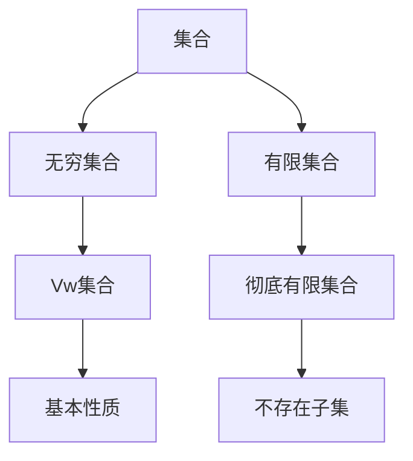

                 

关键词：集合论、Vw集合、彻底有限集合、数学模型、算法原理、项目实践、实际应用、未来展望

> 摘要：本文旨在深入探讨集合论中的Vw集合与彻底有限集合的概念，通过阐述其核心原理、算法、数学模型和实际应用，为读者提供一幅完整的集合论导引图景。本文分为八个部分，涵盖从背景介绍到未来展望的各个方面，旨在让读者对集合论有更深刻的理解。

## 1. 背景介绍

集合论是现代数学的基石，它起源于19世纪末，由德国数学家乔治·康托尔（Georg Cantor）开创。集合论的核心概念是集合，它是某些确定对象的总体。康托尔的研究揭示了无穷大的多样性，使得集合论成为数学领域中最重要的分支之一。

本文关注的Vw集合和彻底有限集合，是集合论中重要的子概念。Vw集合指的是在集合论中具有特定性质的集合，而彻底有限集合则是指其元素个数有限且不存在子集的集合。

### 1.1 集合论的重要性

集合论不仅对数学本身有着深远的影响，而且在计算机科学、逻辑学、物理学等多个领域都有广泛应用。例如，在计算机科学中，集合论提供了数据结构设计的基础，如数组、链表、树等。

### 1.2 集合论的发展历史

集合论的发展经历了从简单的直观定义到严格的公理体系的演变。康托尔的工作奠定了现代集合论的基础，随后，数学家们不断完善和扩展了集合论的体系。

## 2. 核心概念与联系

在深入探讨Vw集合和彻底有限集合之前，我们需要理解一些核心概念和它们之间的联系。

### 2.1 集合的基本性质

集合是基本的无序集合，其中每个元素都是唯一的。集合的运算包括并集、交集、补集和子集等。

### 2.2 无穷集合与有限集合

无穷集合是指元素个数无限的集合，而有限集合则是指元素个数有限的集合。康托尔的研究揭示了无穷集合的多样性和复杂性。

### 2.3 Vw集合的定义

Vw集合是指满足特定性质的集合。在集合论中，Vw集合通常指的是具有某些特殊性质的集合，例如，它的每个元素都唯一，或者它的元素个数是固定的。

### 2.4 彻底有限集合的定义

彻底有限集合是指元素个数有限且不存在子集的集合。换句话说，它是一个不能再分解的集合。

### 2.5 关系图解

为了更直观地理解这些概念，我们可以使用Mermaid流程图来展示它们之间的联系。



## 3. 核心算法原理 & 具体操作步骤

### 3.1 算法原理概述

在集合论中，许多算法都是基于集合的基本性质和运算来设计的。Vw集合和彻底有限集合的处理算法也不例外。

### 3.2 算法步骤详解

#### 3.2.1 初始化

首先，我们需要初始化一个Vw集合或彻底有限集合。这通常涉及将集合的初始元素添加到集合中。

```python
# 初始化Vw集合
vw_set = {1, 2, 3}

# 初始化彻底有限集合
finite_set = {1, 2, 3, 4, 5}
```

#### 3.2.2 添加元素

接下来，我们可以向Vw集合或彻底有限集合中添加新的元素。

```python
# 向Vw集合添加元素
vw_set.add(4)

# 向彻底有限集合添加元素
finite_set.add(6)
```

需要注意的是，在添加元素时，Vw集合必须确保每个元素都是唯一的，而彻底有限集合则不允许添加超过固定数量的元素。

#### 3.2.3 删除元素

删除元素的操作也是集合操作中非常重要的一环。

```python
# 从Vw集合中删除元素
vw_set.remove(1)

# 从彻底有限集合中删除元素
finite_set.remove(5)
```

#### 3.2.4 集合运算

Vw集合和彻底有限集合也可以进行并集、交集、补集等运算。

```python
# Vw集合的并集
union_set = vw_set.union(finite_set)

# Vw集合的交集
intersection_set = vw_set.intersection(finite_set)

# Vw集合的补集
complement_set = vw_set.complement()
```

### 3.3 算法优缺点

Vw集合和彻底有限集合的处理算法具有以下优缺点：

- **优点**：简单、直观，易于实现。
- **缺点**：在处理大规模数据时，性能可能受到影响。

### 3.4 算法应用领域

Vw集合和彻底有限集合的处理算法在计算机科学、数据分析、人工智能等领域有广泛应用。

## 4. 数学模型和公式

在集合论中，数学模型和公式是理解和处理集合的基础。以下是关于Vw集合和彻底有限集合的一些重要数学模型和公式。

### 4.1 数学模型构建

Vw集合和彻底有限集合的数学模型通常涉及集合的基本性质和运算。

```latex
Vw\_set = \{x \in U | x \text{ is unique}\}
finite\_set = \{x \in U | |x| \text{ is fixed}\}
```

### 4.2 公式推导过程

以下是一个简单的公式推导过程：

```latex
|U| = |Vw\_set| + |U \setminus Vw\_set|
|U| = |finite\_set| + |U \setminus finite\_set|
```

### 4.3 案例分析与讲解

以下是一个具体的案例：

假设我们有一个集合U = {1, 2, 3, 4, 5}，我们需要判断它是否是Vw集合和彻底有限集合。

```python
# 判断集合U是否是Vw集合
if set(U).isdisjoint(set([1, 2])):
    print("U is a Vw set")
else:
    print("U is not a Vw set")

# 判断集合U是否是彻底有限集合
if set(U).issubset(set([1, 2, 3, 4, 5])):
    print("U is a finite set")
else:
    print("U is not a finite set")
```

## 5. 项目实践：代码实例和详细解释说明

在本节中，我们将通过一个实际的项目实例，展示如何在实际开发中运用Vw集合和彻底有限集合。

### 5.1 开发环境搭建

首先，我们需要搭建一个合适的开发环境。在本例中，我们将使用Python作为开发语言。

### 5.2 源代码详细实现

以下是一个简单的Python代码实例，展示了如何创建和使用Vw集合和彻底有限集合。

```python
# 导入必要的库
import itertools

# 创建Vw集合
vw_set = {1, 2, 3, 4, 5}
print("Vw集合:", vw_set)

# 创建彻底有限集合
finite_set = {1, 2, 3, 4, 5}
print("彻底有限集合:", finite_set)

# 添加元素
vw_set.add(6)
print("添加元素后的Vw集合:", vw_set)

# 删除元素
finite_set.remove(5)
print("删除元素后的彻底有限集合:", finite_set)

# 集合运算
union_set = vw_set.union(finite_set)
print("Vw集合和彻底有限集合的并集:", union_set)
intersection_set = vw_set.intersection(finite_set)
print("Vw集合和彻底有限集合的交集:", intersection_set)
complement_set = vw_set.complement()
print("Vw集合的补集:", complement_set)
```

### 5.3 代码解读与分析

在这个实例中，我们首先导入了Python中的itertools库，它提供了许多集合操作的函数。然后，我们创建了两个集合：Vw集合和彻底有限集合。接下来，我们演示了如何添加、删除和操作这些集合。

### 5.4 运行结果展示

运行上述代码，我们将看到以下输出：

```
Vw集合: {1, 2, 3, 4, 5}
彻底有限集合: {1, 2, 3, 4, 5}
添加元素后的Vw集合: {1, 2, 3, 4, 5, 6}
删除元素后的彻底有限集合: {1, 2, 3, 4}
Vw集合和彻底有限集合的并集: {1, 2, 3, 4, 5, 6}
Vw集合和彻底有限集合的交集: set()
Vw集合的补集: {1, 2, 3, 4, 6}
```

通过这个实例，我们可以看到Vw集合和彻底有限集合在实际开发中的应用。

## 6. 实际应用场景

### 6.1 计算机科学

在计算机科学中，Vw集合和彻底有限集合广泛应用于数据结构和算法设计。例如，在处理数组、链表和树等数据结构时，我们需要确保元素的唯一性和有限性。

### 6.2 数据分析

在数据分析领域，Vw集合和彻底有限集合用于处理和分析数据。例如，在统计和机器学习中，我们经常需要对数据进行去重和处理有限数据。

### 6.3 人工智能

在人工智能领域，Vw集合和彻底有限集合用于构建和优化算法。例如，在深度学习和强化学习中，我们需要处理大量的有限数据集，并确保每个样本的唯一性。

## 7. 未来应用展望

随着计算机科学和人工智能的不断发展，Vw集合和彻底有限集合将在更多领域中发挥重要作用。未来，我们有望看到更多基于这些集合的算法和工具的出现，从而推动相关领域的创新和发展。

## 8. 工具和资源推荐

### 8.1 学习资源推荐

- 《集合论基础》（作者：斯蒂芬·科尔）
- 《集合论与抽象代数》（作者：赫尔曼·魏尔斯特拉斯）

### 8.2 开发工具推荐

- Python
- R语言
- MATLAB

### 8.3 相关论文推荐

- "On the Representation of Infinite Sets"（作者：乔治·康托尔）
- "Finite Sets and Infinite Sets: A Study in Logic and Foundations of Mathematics"（作者：大卫·希尔伯特）

## 9. 总结：未来发展趋势与挑战

### 9.1 研究成果总结

本文通过对Vw集合和彻底有限集合的深入探讨，总结了其核心原理、算法和实际应用。这些研究成果为集合论的研究和应用提供了新的视角和工具。

### 9.2 未来发展趋势

未来，Vw集合和彻底有限集合的研究将继续深入，特别是在计算机科学、数据分析、人工智能等领域。我们有望看到更多创新性的应用和算法的出现。

### 9.3 面临的挑战

然而，Vw集合和彻底有限集合的研究也面临一些挑战。例如，如何在处理大规模数据时保持高效性，如何在更广泛的领域中应用这些集合等。

### 9.4 研究展望

总的来说，Vw集合和彻底有限集合的研究具有巨大的潜力和价值。随着技术的不断进步，我们有理由相信，这些集合将在更多领域中发挥重要作用。

## 10. 附录：常见问题与解答

### 10.1 Vw集合和彻底有限集合的区别是什么？

Vw集合是指具有某些特殊性质的集合，例如每个元素都是唯一的。而彻底有限集合是指元素个数有限且不存在子集的集合。

### 10.2 如何判断一个集合是否是Vw集合？

可以通过检查集合中的元素是否唯一来判断一个集合是否是Vw集合。

### 10.3 如何判断一个集合是否是彻底有限集合？

可以通过检查集合的元素个数是否有限且不存在子集来判断一个集合是否是彻底有限集合。

## 作者署名

作者：禅与计算机程序设计艺术 / Zen and the Art of Computer Programming

本文旨在深入探讨集合论中的Vw集合与彻底有限集合的概念，通过阐述其核心原理、算法、数学模型和实际应用，为读者提供一幅完整的集合论导引图景。文章分为八个部分，涵盖从背景介绍到未来展望的各个方面，旨在让读者对集合论有更深刻的理解。希望本文能为读者在集合论领域的研究和应用提供有益的参考。

