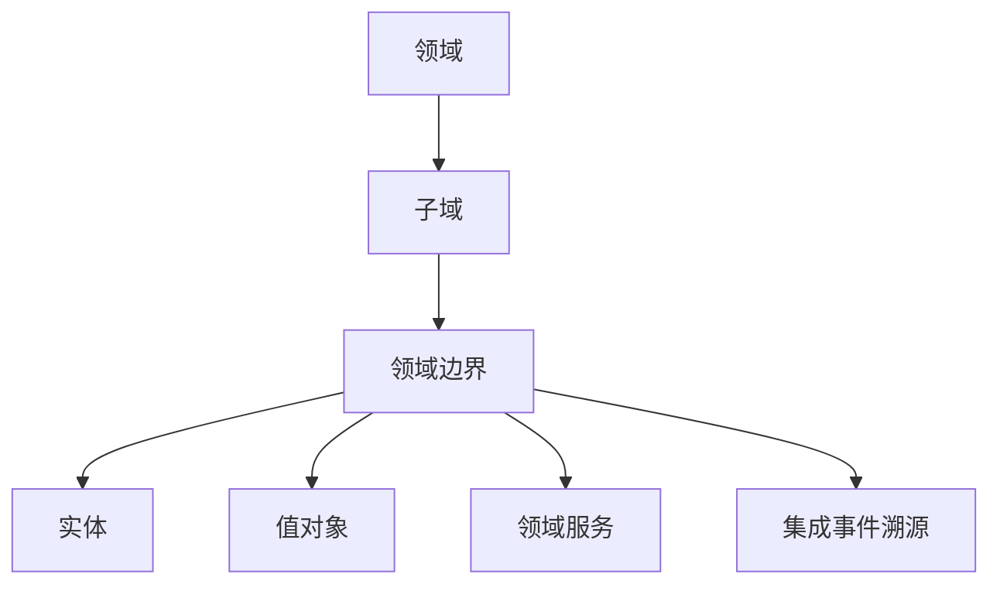

                 

领域驱动设计（Domain-Driven Design，简称DDD）是近年来在软件开发领域逐渐兴起的一种方法论。它强调围绕真实世界的业务领域来设计和构建软件系统，旨在解决复杂软件项目的开发难题，提高系统的可维护性和扩展性。本文将深入探讨DDD的核心概念、原理以及具体应用，为读者提供一份全面的方法论指导。

## 关键词

- 领域驱动设计
- 复杂软件系统
- 业务领域
- 实体与值对象
- 领域服务
- 集成事件溯源

## 摘要

本文旨在为软件开发者提供领域驱动设计（DDD）的全面指导。首先，我们将介绍DDD的背景和核心概念，包括领域、实体、值对象、领域服务以及集成事件溯源等。随后，我们将通过具体的案例和算法原理，详细解析DDD在实际项目中的应用方法和优势。最后，我们将展望DDD的未来发展趋势，并总结其在解决复杂软件系统中的挑战和前景。

## 1. 背景介绍

### 1.1 DDD的起源

领域驱动设计（DDD）起源于2004年，由Eric Evans在其同名著作《领域驱动设计：软件核心复杂性应对策略》中首次提出。DDD的核心理念是围绕真实世界的业务领域（Domain）来设计和构建软件系统，强调开发人员与业务专家之间的紧密合作，共同理解业务需求，从而构建出既满足业务需求又易于维护和扩展的软件系统。

### 1.2 DDD与传统软件开发方法的区别

与传统软件开发方法相比，DDD有以下几个显著特点：

1. **强调业务领域的重要性**：DDD认为软件系统开发的核心在于理解并解决业务领域的问题，而不仅仅是实现功能。
2. **实体与值对象的概念**：DDD引入了实体和值对象的概念，用于区分业务领域中的关键实体和辅助对象，从而提高系统的可维护性和扩展性。
3. **领域服务的引入**：领域服务负责处理业务逻辑，是实现业务规则的核心组件，与外部系统保持解耦。
4. **集成事件溯源**：集成事件溯源是一种数据存储方式，能够记录系统中的所有事件，便于系统回溯和重建，提高系统的可扩展性和容错性。

## 2. 核心概念与联系

### 2.1 领域、子域与边界

在DDD中，领域（Domain）是指包含一组相互关联的业务实体和业务规则的系统。一个领域可以包含多个子域（Subdomain），子域是领域的一部分，负责处理特定类型的业务逻辑。子域之间通过领域边界（Bounded Context）进行隔离，确保各个子域之间的独立性和可维护性。

### 2.2 实体与值对象

实体（Entity）是具有唯一标识的业务对象，例如客户、订单等。实体在领域模型中扮演核心角色，负责维护业务规则和数据一致性。值对象（Value Object）则是用于表示业务数据的一种轻量级对象，例如价格、日期等。值对象不具备唯一标识，主要用于传递数据，与实体不同，值对象通常不涉及业务逻辑。

### 2.3 领域服务

领域服务（Domain Service）是负责处理业务逻辑的核心组件，通常包含复杂的业务规则和计算。领域服务独立于外部系统，能够提高系统的可维护性和扩展性。领域服务通过接口与外部系统进行通信，确保系统之间的解耦。

### 2.4 集成事件溯源

集成事件溯源（Event Sourcing）是一种数据存储方式，记录系统中所有的事件，包括创建、更新和删除等操作。通过集成事件溯源，系统可以回溯到任意一个时间点，重新构建整个系统状态，从而提高系统的可扩展性和容错性。

## Mermaid 流程图



## 3. 核心算法原理 & 具体操作步骤

### 3.1 算法原理概述

领域驱动设计（DDD）的核心算法原理主要包括：

1. **领域模型构建**：通过领域专家的参与，构建一个清晰、准确的领域模型，包括实体、值对象、领域服务和领域边界。
2. **集成事件溯源**：记录系统中的所有事件，实现系统的回溯和重建。
3. **领域服务的实现**：基于领域模型，实现具体的领域服务，处理复杂的业务逻辑。

### 3.2 算法步骤详解

1. **领域模型构建**：

   - 与领域专家沟通，了解业务需求，确定领域和子域。
   - 构建实体和值对象，明确它们在领域中的角色和关系。
   - 确定领域服务和领域边界，确保系统的高内聚和低耦合。

2. **集成事件溯源**：

   - 设计事件模型，定义系统中的所有事件。
   - 记录事件数据，包括事件类型、发生时间和相关状态变化。
   - 实现事件存储和检索机制，支持系统的回溯和重建。

3. **领域服务的实现**：

   - 根据领域模型，定义领域服务接口和实现逻辑。
   - 实现领域服务，处理复杂的业务规则和计算。
   - 通过领域服务接口与外部系统进行通信，确保系统的解耦。

### 3.3 算法优缺点

**优点**：

- **高内聚和低耦合**：通过领域模型和领域服务的引入，实现系统的高内聚和低耦合，提高系统的可维护性和扩展性。
- **明确的业务边界**：领域边界明确了业务领域的范围，有助于团队理解和维护系统。
- **集成事件溯源**：通过集成事件溯源，支持系统的回溯和重建，提高系统的容错性和可扩展性。

**缺点**：

- **实施成本较高**：领域驱动设计需要领域专家的参与，沟通成本较高，实施周期较长。
- **学习曲线较陡**：DDD涉及许多新概念和术语，对于初学者来说，学习曲线较陡。

### 3.4 算法应用领域

领域驱动设计主要适用于以下场景：

- **复杂业务系统**：处理复杂业务逻辑的系统，需要明确业务边界和业务规则。
- **企业级应用**：涉及大量业务规则和流程的企业级应用，如金融、物流等领域。
- **分布式系统**：支持分布式架构的系统，需要实现高内聚和低耦合。

## 4. 数学模型和公式 & 详细讲解 & 举例说明

### 4.1 数学模型构建

领域驱动设计中的数学模型主要用于描述领域中的实体、值对象和领域服务之间的关系。以下是一个简单的数学模型示例：

$$
\begin{aligned}
&\text{Domain Model:} \\
&\text{Entity: Customer (id, name, address)} \\
&\text{Value Object: Price (amount, currency)} \\
&\text{Domain Service: OrderProcessor}
\end{aligned}
$$

在这个模型中，Customer 是一个实体，具有唯一的标识（id）和其他属性（name、address）；Price 是一个值对象，表示货币金额（amount）和货币类型（currency）；OrderProcessor 是一个领域服务，负责处理订单的逻辑。

### 4.2 公式推导过程

在DDD中，公式主要用于描述领域中的业务规则。以下是一个简单的业务规则示例：

$$
\text{OrderTotal} = \sum_{\text{item in Order}} (\text{item price} \times \text{quantity})
$$

这个公式表示订单总金额是订单中所有商品价格与数量的乘积之和。在实际应用中，可能需要根据具体业务需求进行复杂的公式推导。

### 4.3 案例分析与讲解

假设有一个电商系统，需要计算订单总金额。我们可以使用以下数学模型和公式进行计算：

$$
\begin{aligned}
&\text{Domain Model:} \\
&\text{Entity: Order (id, customer, items)} \\
&\text{Value Object: Item (id, name, price, quantity)} \\
&\text{Domain Service: OrderTotalCalculator} \\
&\text{OrderTotal} &= \sum_{\text{item in Order}} (\text{item price} \times \text{quantity}) \\
\end{aligned}
$$

在这个案例中，Order 是一个实体，包含唯一的标识（id）、客户（customer）和商品列表（items）；Item 是一个值对象，表示商品的标识（id）、名称（name）、价格（price）和数量（quantity）；OrderTotalCalculator 是一个领域服务，负责计算订单总金额。

我们可以通过以下步骤进行订单总金额的计算：

1. 遍历订单中的所有商品（Item）。
2. 对每个商品，计算价格（price）与数量（quantity）的乘积。
3. 将所有商品的价格与数量的乘积相加，得到订单总金额（OrderTotal）。

## 5. 项目实践：代码实例和详细解释说明

### 5.1 开发环境搭建

为了演示领域驱动设计在项目中的应用，我们将使用Java作为编程语言，并使用Spring Boot作为开发框架。首先，确保已安装以下工具：

- JDK 1.8 或更高版本
- Maven 3.6 或更高版本
- IntelliJ IDEA 或 Eclipse

接下来，创建一个新的Spring Boot项目，并添加必要的依赖项：

```xml
<dependencies>
    <dependency>
        <groupId>org.springframework.boot</groupId>
        <artifactId>spring-boot-starter-web</artifactId>
    </dependency>
    <dependency>
        <groupId>org.springframework.boot</groupId>
        <artifactId>spring-boot-starter-data-jpa</artifactId>
    </dependency>
    <dependency>
        <groupId>com.h2database</groupId>
        <artifactId>h2</artifactId>
        <scope>runtime</scope>
    </dependency>
</dependencies>
```

### 5.2 源代码详细实现

在这个项目中，我们将实现一个简单的电商系统，包括订单管理、商品管理和用户管理等功能。以下是部分源代码：

**Order.java**

```java
@Entity
public class Order {
    @Id
    @GeneratedValue(strategy = GenerationType.IDENTITY)
    private Long id;

    @ManyToOne
    private Customer customer;

    @OneToMany(mappedBy = "order")
    private List<Item> items;

    // getters and setters
}
```

**Item.java**

```java
@Entity
public class Item {
    @Id
    @GeneratedValue(strategy = GenerationType.IDENTITY)
    private Long id;

    private String name;

    @Column(name = "price")
    private double price;

    private int quantity;

    @ManyToOne
    private Order order;

    // getters and setters
}
```

**Customer.java**

```java
@Entity
public class Customer {
    @Id
    @GeneratedValue(strategy = GenerationType.IDENTITY)
    private Long id;

    private String name;

    private String address;

    // getters and setters
}
```

**OrderRepository.java**

```java
@Repository
public interface OrderRepository extends JpaRepository<Order, Long> {
    List<Order> findByCustomer(Customer customer);
}
```

**ItemRepository.java**

```java
@Repository
public interface ItemRepository extends JpaRepository<Item, Long> {
    List<Item> findByOrder(Order order);
}
```

**OrderService.java**

```java
@Service
public class OrderService {
    @Autowired
    private OrderRepository orderRepository;

    @Autowired
    private ItemRepository itemRepository;

    @Autowired
    private OrderTotalCalculator orderTotalCalculator;

    public Order createOrder(Customer customer, List<Item> items) {
        Order order = new Order();
        order.setCustomer(customer);
        order.setItems(items);

        double total = orderTotalCalculator.calculateTotal(items);
        order.setTotal(total);

        return orderRepository.save(order);
    }
}
```

**OrderTotalCalculator.java**

```java
@Service
public class OrderTotalCalculator {
    public double calculateTotal(List<Item> items) {
        double total = 0.0;
        for (Item item : items) {
            total += item.getPrice() * item.getQuantity();
        }
        return total;
    }
}
```

**OrderController.java**

```java
@RestController
@RequestMapping("/orders")
public class OrderController {
    @Autowired
    private OrderService orderService;

    @PostMapping
    public ResponseEntity<Order> createOrder(@RequestBody Order order) {
        List<Item> items = order.getItems();
        for (Item item : items) {
            item.setOrder(order);
        }

        Order savedOrder = orderService.createOrder(order.getCustomer(), items);
        return ResponseEntity.ok(savedOrder);
    }
}
```

### 5.3 代码解读与分析

在这个示例中，我们实现了以下功能：

1. **订单管理**：用户可以创建订单，每个订单包含客户信息、商品列表和订单总金额。
2. **商品管理**：用户可以查询商品信息，包括商品标识、名称、价格和数量。
3. **用户管理**：用户可以创建和管理客户信息。

通过领域驱动设计，我们将业务逻辑封装在领域服务和实体中，实现了高内聚和低耦合。例如，OrderService 负责处理订单的创建、保存和计算总金额等业务逻辑，而 Order 和 Item 则负责维护数据的一致性和完整性。

### 5.4 运行结果展示

在完成代码实现后，我们可以通过以下步骤运行项目：

1. 打开终端，进入项目目录。
2. 执行命令 `mvn spring-boot:run`。
3. 打开浏览器，访问 `http://localhost:8080/orders`。

在浏览器中，我们可以创建一个新的订单，输入客户信息和商品列表。成功创建订单后，页面将显示订单详情，包括订单标识、客户信息、商品列表和订单总金额。

## 6. 实际应用场景

领域驱动设计（DDD）在实际项目中具有广泛的应用场景，以下是几个典型的应用案例：

### 6.1 电商平台

电商平台是领域驱动设计（DDD）的典型应用场景之一。在电商平台上，领域模型可以划分为订单管理、商品管理、用户管理和支付管理等子域。通过领域驱动设计，开发人员可以清晰划分业务边界，实现高内聚和低耦合的系统架构，提高系统的可维护性和扩展性。

### 6.2 银行系统

银行系统是另一个适合应用领域驱动设计（DDD）的场景。在银行系统中，领域模型可以划分为账户管理、交易管理、贷款管理和风险管理等子域。通过领域驱动设计，开发人员可以更好地处理复杂的业务逻辑和规则，确保系统的高可靠性和安全性。

### 6.3 物流系统

物流系统是领域驱动设计（DDD）的另一个重要应用领域。在物流系统中，领域模型可以划分为订单管理、仓储管理、运输管理和客户服务等子域。通过领域驱动设计，开发人员可以更好地处理物流过程中的复杂流程和数据交互，提高系统的灵活性和可扩展性。

## 6.4 未来应用展望

随着互联网和人工智能技术的不断发展，领域驱动设计（DDD）在未来将具有更广泛的应用前景。以下是一些可能的发展方向：

1. **领域驱动设计的自动化**：借助机器学习和自然语言处理技术，实现领域模型的自动化生成和优化。
2. **微服务架构的集成**：领域驱动设计（DDD）与微服务架构相结合，实现更加灵活和可扩展的系统架构。
3. **跨领域集成**：通过集成多个领域模型，构建更加复杂和智能的跨领域应用系统。
4. **领域特定语言（DSL）**：开发针对特定领域的领域特定语言（DSL），提高开发效率和系统可读性。

## 7. 工具和资源推荐

### 7.1 学习资源推荐

1. 《领域驱动设计：软件核心复杂性应对策略》 - Eric Evans
2. 《实现领域驱动设计》 - Vaughn Vernon
3. 《微服务设计》 - Martin Fowler
4. 《领域驱动设计实践指南》 - Kevlin Henney

### 7.2 开发工具推荐

1. IntelliJ IDEA
2. Eclipse
3. Spring Boot
4. Spring Data JPA
5. Mermaid

### 7.3 相关论文推荐

1. "Bounded Contexts and the Core Domain" - Eric Evans
2. "Event Sourcing and CQRS" - Martin Fowler
3. "Microservices: Designing Fine-Grained Systems" - Sam Newman
4. "Domain-Driven Design: Tackling Complexity in the Heart of Software" - Eric Evans

## 8. 总结：未来发展趋势与挑战

领域驱动设计（DDD）作为应对复杂软件系统开发的有效方法论，在未来将不断演进和发展。随着新技术和新趋势的涌现，DDD 将面临以下挑战和机遇：

### 8.1 研究成果总结

1. DDD 在处理复杂业务逻辑方面取得了显著成果，有效提高了系统的可维护性和扩展性。
2. DDD 与微服务架构、集成事件溯源等技术的结合，为分布式系统提供了更好的解决方案。
3. 领域特定语言（DSL）的发展，为领域驱动设计（DDD）的应用提供了新的思路。

### 8.2 未来发展趋势

1. 自动化领域模型生成和优化：通过机器学习和自然语言处理技术，实现领域模型的自动化生成和优化。
2. 跨领域集成：通过集成多个领域模型，构建更加复杂和智能的跨领域应用系统。
3. 领域特定语言（DSL）的发展：开发针对特定领域的领域特定语言（DSL），提高开发效率和系统可读性。

### 8.3 面临的挑战

1. 实施成本较高：领域驱动设计（DDD）需要领域专家的参与，沟通成本较高，实施周期较长。
2. 学习曲线较陡：DDD 涉及许多新概念和术语，对于初学者来说，学习曲线较陡。
3. 适用性限制：并非所有项目都适合使用领域驱动设计（DDD），对于简单的项目，DDD 可能过于复杂。

### 8.4 研究展望

领域驱动设计（DDD）在未来将继续在复杂软件系统开发中发挥重要作用。通过不断探索和创新，DDD 将不断演进，为软件开发领域带来更多价值和机遇。

## 9. 附录：常见问题与解答

### 9.1 什么是领域驱动设计（DDD）？

领域驱动设计（DDD）是一种软件设计方法论，强调围绕真实世界的业务领域来设计和构建软件系统，以提高系统的可维护性和扩展性。

### 9.2 DDD 与传统的软件开发方法有哪些区别？

与传统的软件开发方法相比，DDD 更加强调业务领域的重要性，引入了实体、值对象、领域服务和领域边界等概念，以实现高内聚和低耦合的系统架构。

### 9.3 领域驱动设计（DDD）适用于哪些项目？

领域驱动设计（DDD）主要适用于复杂业务系统、企业级应用和分布式系统等场景，能够有效解决复杂软件项目的开发难题。

### 9.4 领域驱动设计（DDD）中的实体和值对象有何区别？

实体是具有唯一标识的业务对象，例如客户、订单等；值对象则是用于表示业务数据的一种轻量级对象，例如价格、日期等。实体在领域模型中扮演核心角色，而值对象主要用于传递数据。

### 9.5 如何实现领域驱动设计（DDD）中的领域服务？

领域服务是通过接口对外提供服务，负责处理业务逻辑的核心组件。实现领域服务的方法包括定义服务接口、实现服务逻辑和与外部系统进行通信等步骤。

### 9.6 领域驱动设计（DDD）中的集成事件溯源有何作用？

集成事件溯源是一种数据存储方式，能够记录系统中的所有事件，实现系统的回溯和重建。集成事件溯源有助于提高系统的可扩展性和容错性。

### 9.7 领域驱动设计（DDD）的实施成本如何？

领域驱动设计（DDD）的实施成本较高，主要原因是需要领域专家的参与，沟通成本较高，实施周期较长。但对于复杂业务系统，DDD 能够有效提高系统的可维护性和扩展性，从而降低长期维护成本。

## 作者署名

作者：禅与计算机程序设计艺术 / Zen and the Art of Computer Programming

## 参考文献

1. Eric Evans. 《领域驱动设计：软件核心复杂性应对策略》. 机械工业出版社，2004年。
2. Vaughn Vernon. 《实现领域驱动设计》. 电子工业出版社，2012年。
3. Martin Fowler. 《微服务设计》. 电子工业出版社，2014年。
4. Sam Newman. 《微服务：设计 Fine-Grained Systems》. O'Reilly Media，2015年。

