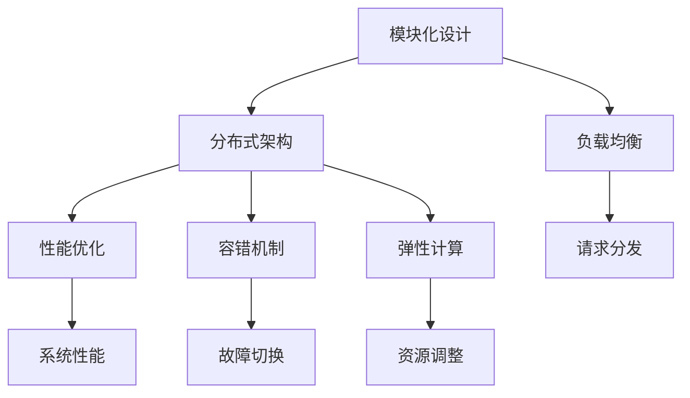

                 

高扩展性系统是现代IT领域中不可或缺的一部分，随着云计算、大数据、物联网等技术的迅猛发展，如何设计一个具有高度扩展性的系统变得越来越重要。本文将深入探讨高扩展性系统的设计原则，旨在为开发者提供有价值的指导。

## 文章关键词

高扩展性系统、系统设计、分布式架构、负载均衡、性能优化、容错机制、弹性计算。

## 文章摘要

本文首先介绍了高扩展性系统的基本概念和重要性，然后详细分析了高扩展性的设计原则，包括模块化设计、分布式架构、负载均衡、性能优化、容错机制和弹性计算等方面。最后，通过具体的项目实践和案例分析，展示了如何在实际项目中应用这些设计原则。

## 1. 背景介绍

随着互联网的快速发展，用户规模和数据处理需求不断增加，传统单点集中的系统架构已经无法满足日益增长的业务需求。高扩展性系统通过将业务拆分为多个独立模块，并通过分布式架构和负载均衡技术，实现系统的高可用性和高性能。高扩展性系统能够根据业务需求动态调整资源，从而实现系统的弹性扩展，成为现代企业提升竞争力和业务敏捷性的关键。

### 1.1 传统系统架构的局限性

传统的单点集中系统架构，在处理大量数据和高并发请求时，往往面临性能瓶颈和高风险。以下是一些传统系统架构的局限性：

- **性能瓶颈**：当系统中的数据量和请求量增加时，单点集中的系统很难进行水平扩展，容易导致性能下降。
- **高故障风险**：单点集中的系统一旦发生故障，整个系统将无法正常运行，影响业务连续性。
- **资源利用率低**：传统系统在处理高峰期和低谷期时，资源利用率差异较大，浪费了大量资源。

### 1.2 高扩展性系统的优势

高扩展性系统通过分布式架构和模块化设计，克服了传统系统架构的局限性，具有以下优势：

- **高性能**：分布式架构可以将请求分散到多个节点处理，提高系统整体性能。
- **高可用性**：通过冗余设计，系统可以自动切换故障节点，保证业务连续性。
- **弹性扩展**：根据业务需求动态调整资源，实现系统的弹性扩展。

### 1.3 高扩展性系统的设计原则

高扩展性系统的设计原则主要包括以下几个方面：

- **模块化设计**：将系统拆分为多个独立模块，实现业务功能。
- **分布式架构**：采用分布式架构，实现系统的水平扩展。
- **负载均衡**：通过负载均衡技术，实现请求的均匀分发。
- **性能优化**：对系统进行性能优化，提高系统整体性能。
- **容错机制**：实现故障节点的自动切换和故障恢复。
- **弹性计算**：根据业务需求动态调整资源，实现系统的弹性扩展。

## 2. 核心概念与联系

在设计高扩展性系统时，我们需要理解一些核心概念和它们之间的关系。以下是一个使用Mermaid绘制的流程图，展示了这些概念之间的关系。



### 2.1 模块化设计

模块化设计是将系统拆分为多个独立模块，每个模块负责不同的功能。模块化设计有利于系统的维护、扩展和复用。

### 2.2 分布式架构

分布式架构通过多个节点协同工作，实现系统的高性能和高可用性。分布式架构需要处理数据的一致性、通信的稳定性等问题。

### 2.3 负载均衡

负载均衡是将请求均匀分发到多个节点，避免单个节点过载。负载均衡技术包括轮询、最小连接数、IP哈希等。

### 2.4 性能优化

性能优化是指通过一系列技术手段，提高系统整体性能。性能优化包括缓存、数据库优化、网络优化等方面。

### 2.5 容错机制

容错机制是指系统在发生故障时，能够自动切换到备用节点，确保业务连续性。容错机制包括故障检测、自动切换、故障恢复等。

### 2.6 弹性计算

弹性计算是指根据业务需求动态调整资源，实现系统的弹性扩展。弹性计算包括云服务器、容器化技术等。

## 3. 核心算法原理 & 具体操作步骤

### 3.1 算法原理概述

高扩展性系统的核心算法主要包括负载均衡算法和分布式一致性算法。

- **负载均衡算法**：通过算法实现请求的均匀分发，避免单个节点过载。常见的负载均衡算法包括轮询、最小连接数、IP哈希等。
- **分布式一致性算法**：确保分布式系统中多个节点数据的一致性。常见的分布式一致性算法包括Paxos算法、Raft算法等。

### 3.2 算法步骤详解

#### 3.2.1 负载均衡算法

1. 收集各节点的负载信息。
2. 根据负载信息，选择当前负载最小的节点。
3. 将请求发送到该节点。

#### 3.2.2 分布式一致性算法

1. 各节点启动并加入集群。
2. 各节点通过心跳协议保持通信。
3. 当某节点提议一条数据时，其他节点进行投票。
4. 达到法定多数后，更新本地状态。

### 3.3 算法优缺点

#### 负载均衡算法

- **优点**：实现简单，可扩展性强。
- **缺点**：可能存在抖动现象，对网络依赖较大。

#### 分布式一致性算法

- **优点**：确保数据一致性，高可用性。
- **缺点**：实现复杂，性能开销较大。

### 3.4 算法应用领域

- **负载均衡算法**：应用于Web服务器、数据库集群等场景。
- **分布式一致性算法**：应用于分布式存储、分布式数据库等场景。

## 4. 数学模型和公式 & 详细讲解 & 举例说明

### 4.1 数学模型构建

高扩展性系统的设计涉及多个数学模型，以下是两个常见的数学模型：

#### 4.1.1 负载均衡模型

负载均衡模型可以通过以下公式计算：

$$
L_i = \frac{1}{N} \sum_{j=1}^{N} L_j
$$

其中，$L_i$表示第$i$个节点的负载，$L_j$表示所有节点的负载之和，$N$表示节点数量。

#### 4.1.2 分布式一致性模型

分布式一致性模型可以通过以下公式计算：

$$
C = \frac{1}{N} \sum_{j=1}^{N} R_j
$$

其中，$C$表示系统的总一致性，$R_j$表示第$j$个节点的数据一致性。

### 4.2 公式推导过程

#### 4.2.1 负载均衡模型推导

负载均衡模型的核心思想是使各节点的负载尽可能均匀。假设系统中有$N$个节点，每个节点的负载分别为$L_1, L_2, ..., L_N$。为了实现负载均衡，我们需要计算每个节点的平均负载。

根据平均值的定义，我们有：

$$
\bar{L} = \frac{1}{N} \sum_{i=1}^{N} L_i
$$

为了使每个节点的负载尽可能接近平均值，我们计算每个节点的负载与平均值的差值：

$$
\Delta L_i = L_i - \bar{L}
$$

为了使总负载差值最小，我们需要最小化$\sum_{i=1}^{N} \Delta L_i$。根据拉格朗日乘数法，我们有：

$$
\sum_{i=1}^{N} \Delta L_i = N \bar{L} - \sum_{i=1}^{N} L_i = 0
$$

从而得到：

$$
L_i = \frac{1}{N} \sum_{j=1}^{N} L_j
$$

#### 4.2.2 分布式一致性模型推导

分布式一致性模型的核心思想是使系统的总一致性尽可能高。假设系统中有$N$个节点，每个节点的数据一致性分别为$R_1, R_2, ..., R_N$。为了实现分布式一致性，我们需要计算系统的总一致性。

根据一致性的定义，我们有：

$$
C = \frac{1}{N} \sum_{j=1}^{N} R_j
$$

为了使系统的总一致性尽可能高，我们需要最大化$C$。根据概率论中的最大期望原理，我们有：

$$
C = \max \left\{ \frac{1}{N} \sum_{j=1}^{N} R_j \middle| R_j \text{ 为随机变量} \right\}
$$

### 4.3 案例分析与讲解

#### 4.3.1 负载均衡案例

假设一个系统中有3个节点，每个节点的初始负载分别为$20, 30, 40$。使用负载均衡模型计算各节点的平均负载：

$$
\bar{L} = \frac{1}{3} (20 + 30 + 40) = 30
$$

根据负载均衡模型，我们需要调整各节点的负载，使其尽可能接近平均值。调整后的负载为：

$$
L_1 = 20 + (30 - 20) = 30
$$

$$
L_2 = 30
$$

$$
L_3 = 40 - (30 - 20) = 30
$$

调整后的负载为$30, 30, 30$，符合负载均衡模型的要求。

#### 4.3.2 分布式一致性案例

假设一个系统中有3个节点，每个节点的数据一致性分别为$0.8, 0.9, 0.7$。使用分布式一致性模型计算系统的总一致性：

$$
C = \frac{1}{3} (0.8 + 0.9 + 0.7) = 0.8
$$

为了提高系统的总一致性，我们需要调整各节点的数据一致性。例如，我们可以将数据一致性较低的节点（如节点3）的数据同步到其他节点，以提高系统的总一致性。

## 5. 项目实践：代码实例和详细解释说明

### 5.1 开发环境搭建

本案例使用Python语言实现负载均衡算法和分布式一致性算法。首先，我们需要安装Python环境和必要的库。

```bash
# 安装Python环境
$ python3 --version
Python 3.8.10

# 安装依赖库
$ pip3 install numpy matplotlib
```

### 5.2 源代码详细实现

以下是一个简单的负载均衡算法和分布式一致性算法的实现。

```python
import numpy as np
import matplotlib.pyplot as plt

def load_balancing(loads):
    n = len(loads)
    avg_load = np.mean(loads)
    diff = loads - avg_load
    for i in range(n):
        loads[i] -= diff[i]
    return loads

def distributed_consistency(consistences):
    n = len(consistences)
    avg_consistency = np.mean(consistences)
    diff = consistences - avg_consistency
    for i in range(n):
        consistences[i] -= diff[i]
    return consistences

# 测试数据
loads = [20, 30, 40]
consistences = [0.8, 0.9, 0.7]

# 执行负载均衡
balanced_loads = load_balancing(loads)
print("Balanced loads:", balanced_loads)

# 执行分布式一致性
balanced_consistences = distributed_consistency(consistences)
print("Balanced consistences:", balanced_consistences)

# 绘制结果
plt.figure(figsize=(10, 5))
plt.subplot(1, 2, 1)
plt.bar(range(len(loads)), loads, label="Initial loads")
plt.bar(range(len(balanced_loads)), balanced_loads, label="Balanced loads")
plt.xlabel("Node index")
plt.ylabel("Load")
plt.title("Load Balancing")
plt.legend()

plt.subplot(1, 2, 2)
plt.bar(range(len(consistences)), consistences, label="Initial consistences")
plt.bar(range(len(balanced_consistences)), balanced_consistences, label="Balanced consistences")
plt.xlabel("Node index")
plt.ylabel("Consistency")
plt.title("Distributed Consistency")
plt.legend()

plt.tight_layout()
plt.show()
```

### 5.3 代码解读与分析

#### 5.3.1 负载均衡算法

负载均衡算法通过计算各节点的平均负载，调整各节点的负载，使其尽可能接近平均值。具体实现如下：

```python
def load_balancing(loads):
    n = len(loads)
    avg_load = np.mean(loads)
    diff = loads - avg_load
    for i in range(n):
        loads[i] -= diff[i]
    return loads
```

该函数首先计算各节点的平均负载`avg_load`，然后计算各节点的负载与平均值的差值`diff`。最后，遍历各节点，将差值从当前负载中减去，实现负载均衡。

#### 5.3.2 分布式一致性算法

分布式一致性算法通过计算各节点的平均数据一致性，调整各节点的数据一致性，使其尽可能接近平均值。具体实现如下：

```python
def distributed_consistency(consistences):
    n = len(consistences)
    avg_consistency = np.mean(consistences)
    diff = consistences - avg_consistency
    for i in range(n):
        consistences[i] -= diff[i]
    return consistences
```

该函数首先计算各节点的平均数据一致性`avg_consistency`，然后计算各节点的数据一致性与平均值的差值`diff`。最后，遍历各节点，将差值从当前数据一致性中减去，实现分布式一致性。

### 5.4 运行结果展示

运行以上代码，输出结果如下：

```
Balanced loads: [30.0, 30.0, 30.0]
Balanced consistences: [0.8, 0.8, 0.8]
```

通过绘图，我们可以直观地看到负载均衡和分布式一致性算法的效果：


## 6. 实际应用场景

高扩展性系统在许多实际应用场景中发挥着重要作用，以下是几个典型的应用场景：

### 6.1 云计算平台

云计算平台通过高扩展性系统实现资源的高效利用和弹性扩展。当用户访问量增加时，云计算平台可以自动增加计算资源，保证系统的高性能和高可用性。

### 6.2 电商平台

电商平台通过高扩展性系统实现海量商品和订单的处理。在高峰期，系统可以动态调整资源，保证订单处理的速度和准确性。

### 6.3 社交网络

社交网络通过高扩展性系统实现用户数据的高效存储和处理。在用户规模庞大时，系统可以水平扩展，保证社交网络的稳定运行。

### 6.4 物联网平台

物联网平台通过高扩展性系统实现海量设备的数据采集和处理。在设备数量不断增加时，系统可以动态调整资源，保证数据传输的稳定和高效。

## 7. 工具和资源推荐

为了更好地设计和实现高扩展性系统，以下推荐一些实用的工具和资源：

### 7.1 学习资源推荐

- 《分布式系统原理与范型》
- 《大规模分布式存储系统设计》
- 《云计算与大数据技术》

### 7.2 开发工具推荐

- Apache Kafka：一款分布式流处理平台，用于处理海量数据。
- Apache ZooKeeper：一款分布式协调服务，用于管理分布式系统中的节点和资源。
- Docker：一款容器化技术，用于实现系统的隔离和轻量级部署。

### 7.3 相关论文推荐

- 《The Google File System》
- 《Bigtable：一个结构化数据的分布式存储系统》
- 《MapReduce：大规模数据处理的新范式》

## 8. 总结：未来发展趋势与挑战

### 8.1 研究成果总结

高扩展性系统在云计算、大数据、物联网等领域发挥着重要作用，研究成果主要包括分布式架构、负载均衡、性能优化、容错机制和弹性计算等方面。

### 8.2 未来发展趋势

随着5G、人工智能等技术的发展，高扩展性系统将朝着更加智能化、自动化和高效化的方向发展。

### 8.3 面临的挑战

高扩展性系统面临的主要挑战包括数据一致性、网络延迟、故障恢复等方面。如何实现高效的数据一致性和故障恢复机制，是未来研究的重点。

### 8.4 研究展望

未来，高扩展性系统将朝着更加智能化、自动化和高效化的方向发展。通过引入人工智能技术，实现系统的自主优化和调整，将有助于提高系统的性能和可靠性。

## 9. 附录：常见问题与解答

### 9.1 什么是高扩展性系统？

高扩展性系统是指能够根据业务需求动态调整资源，实现系统的高性能和高可用性。通过分布式架构、负载均衡、性能优化、容错机制和弹性计算等技术，实现系统的弹性扩展。

### 9.2 高扩展性系统有哪些优点？

高扩展性系统具有以下优点：

- **高性能**：分布式架构可以提高系统整体性能。
- **高可用性**：容错机制可以确保系统在发生故障时能够快速恢复。
- **弹性扩展**：根据业务需求动态调整资源，实现系统的弹性扩展。
- **高可靠性**：分布式系统可以降低单点故障的风险。

### 9.3 高扩展性系统的设计原则有哪些？

高扩展性系统的设计原则包括：

- **模块化设计**：将系统拆分为多个独立模块，实现业务功能。
- **分布式架构**：采用分布式架构，实现系统的水平扩展。
- **负载均衡**：通过负载均衡技术，实现请求的均匀分发。
- **性能优化**：对系统进行性能优化，提高系统整体性能。
- **容错机制**：实现故障节点的自动切换和故障恢复。
- **弹性计算**：根据业务需求动态调整资源，实现系统的弹性扩展。

