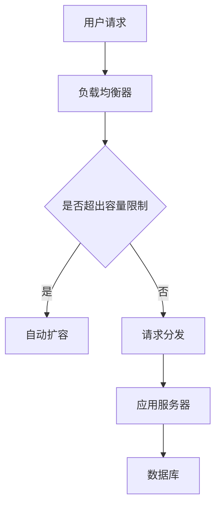
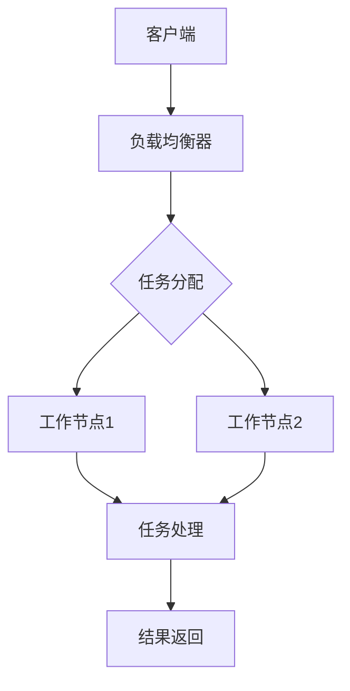
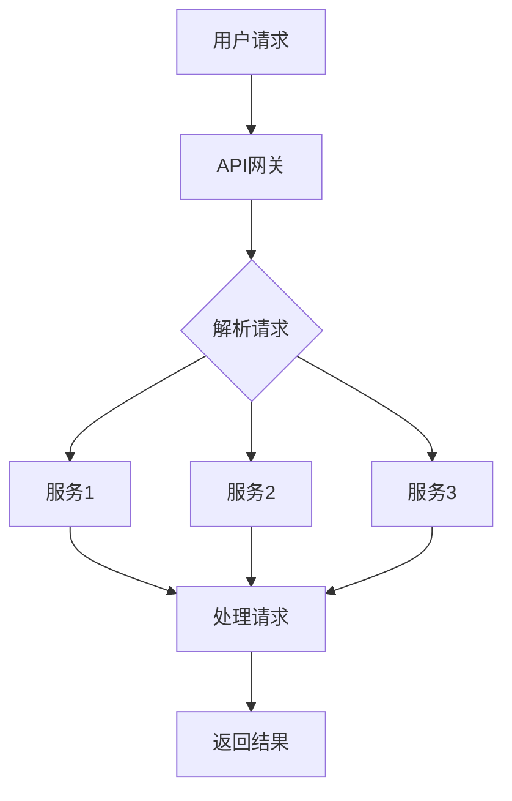

                 

关键词：高扩展性系统设计，实际案例，架构，性能优化，云计算，分布式系统，微服务，持续集成，持续部署

> 摘要：本文将探讨高扩展性系统设计的重要性以及如何通过实际案例来实现系统的高扩展性。我们将分析几种流行的架构模式，包括云计算、分布式系统和微服务架构，并分享一个成功的高扩展性系统设计案例，旨在为开发者和架构师提供实用的指导和启示。

## 1. 背景介绍

在现代软件工程领域，高扩展性系统设计已经成为企业成功的关键。随着互联网的迅猛发展和大数据时代的到来，系统的负载量、用户数量和数据处理需求都在急剧增长。为了满足这种增长，系统必须具备高扩展性，以确保在高并发情况下依然能够稳定运行。然而，实现高扩展性并非易事，它涉及到系统的架构设计、性能优化、容错性和可维护性等多个方面。

本文旨在通过实际案例，介绍高扩展性系统设计的方法和最佳实践，帮助开发者和架构师理解和实现高扩展性的系统。

## 2. 核心概念与联系

### 2.1. 云计算

云计算是现代高扩展性系统设计的基础。它提供了弹性的计算资源和存储能力，使得系统能够根据需求自动扩展和缩减。以下是一个简单的云计算架构的 Mermaid 流程图：



### 2.2. 分布式系统

分布式系统通过将任务分散到多个节点上来提高系统的扩展性和可用性。以下是一个分布式系统的基本架构图：



### 2.3. 微服务架构

微服务架构将应用程序拆分为多个小型、自治的服务，每个服务都可以独立开发、部署和扩展。以下是一个微服务架构的简化模型：



## 3. 核心算法原理 & 具体操作步骤

### 3.1. 算法原理概述

高扩展性系统设计的核心在于如何有效地分配和利用资源。以下是几个关键算法原理：

- **负载均衡**：通过将请求分配到不同的服务器或节点，避免单点过载。
- **自动扩容**：根据系统的负载情况自动增加服务器或节点的数量。
- **数据分片**：将数据库数据分散到多个节点上，以提高查询效率和系统的可扩展性。

### 3.2. 算法步骤详解

1. **负载均衡**：
   - 收集各节点的负载情况。
   - 根据负载情况将请求分配到最合适的节点。

2. **自动扩容**：
   - 监控系统负载。
   - 当负载超过预设阈值时，自动启动新的节点。
   - 当负载下降时，可以自动关闭部分节点以节省资源。

3. **数据分片**：
   - 确定数据分片的策略（例如，基于哈希值或范围）。
   - 将数据分散存储到不同的节点上。
   - 在查询时，根据数据分片策略确定查询数据的位置。

### 3.3. 算法优缺点

- **负载均衡**：优点是提高系统的处理能力，缺点是可能会引入网络延迟。
- **自动扩容**：优点是提高系统的弹性，缺点是可能会引入额外的管理复杂性。
- **数据分片**：优点是提高查询效率和系统的扩展性，缺点是可能会引入数据一致性的问题。

### 3.4. 算法应用领域

这些算法原理广泛应用于电子商务、社交媒体、在线游戏等需要高并发和高扩展性的领域。

## 4. 数学模型和公式 & 详细讲解 & 举例说明

### 4.1. 数学模型构建

为了优化系统性能，我们可以构建以下数学模型：

\[ P = f(L, C) \]

其中，\( P \) 是系统处理能力，\( L \) 是系统负载，\( C \) 是系统容量。

### 4.2. 公式推导过程

假设系统负载 \( L \) 是随机变量，其概率密度函数为 \( p(L) \)。系统容量 \( C \) 是固定值。我们可以通过以下步骤推导系统处理能力 \( P \)：

1. **确定系统负载的概率分布**：
   \[ P(L \leq C) = \int_{0}^{C} p(L) dL \]

2. **计算系统处理能力**：
   \[ P = \frac{1}{P(L \leq C)} \]

### 4.3. 案例分析与讲解

假设一个电子商务平台，其系统负载 \( L \) 服从均匀分布，范围在 \( [0, 1000] \) 请求/秒。系统容量 \( C \) 为 500 请求/秒。我们可以通过以上公式计算系统处理能力 \( P \)：

1. **计算系统负载的概率分布**：
   \[ P(L \leq 500) = \frac{500}{1000} = 0.5 \]

2. **计算系统处理能力**：
   \[ P = \frac{1}{0.5} = 2 \]

这意味着，在正常情况下，系统可以处理每秒 2 个请求。

## 5. 项目实践：代码实例和详细解释说明

### 5.1. 开发环境搭建

在本案例中，我们使用 Python 编写一个简单的负载均衡器和自动扩容脚本。开发环境要求 Python 3.8 或更高版本。

### 5.2. 源代码详细实现

以下是一个简单的负载均衡器和自动扩容脚本：

```python
# load_balancer.py

import threading
import time
import random

# 假设我们有 3 个节点
nodes = ['node1', 'node2', 'node3']

# 负载均衡器
class LoadBalancer:
    def __init__(self):
        self.lock = threading.Lock()

    def distribute_request(self, request):
        with self.lock:
            # 根据当前节点的负载情况选择最合适的节点
            node = min(nodes, key=lambda n: n['load'])
            node['load'] += 1
            return node

# 节点
class Node:
    def __init__(self, name):
        self.name = name
        self.load = 0

# 自动扩容脚本
class AutoScaler:
    def __init__(self, load_balancer):
        self.load_balancer = load_balancer

    def scale_up(self):
        while True:
            # 检查系统负载是否超过阈值
            if sum(node['load'] for node in nodes) > 1000:
                # 启动新的节点
                new_node = Node(f'node{len(nodes) + 1}')
                nodes.append(new_node)
                print(f"Node {new_node.name} has been added.")
            time.sleep(60)

# 模拟请求
def simulate_requests(load_balancer, num_requests):
    for _ in range(num_requests):
        node = load_balancer.distribute_request(_)
        print(f"Request {_} has been assigned to {node.name}.")

if __name__ == '__main__':
    # 创建负载均衡器和自动扩容脚本
    load_balancer = LoadBalancer()
    auto_scaler = AutoScaler(load_balancer)

    # 启动自动扩容脚本
    scaler_thread = threading.Thread(target=auto_scaler.scale_up)
    scaler_thread.start()

    # 模拟 1000 个请求
    simulate_requests(load_balancer, 1000)
```

### 5.3. 代码解读与分析

1. **节点类（Node）**：表示系统中的每个节点，包括节点名称和当前负载。
2. **负载均衡器（LoadBalancer）**：负责根据节点的负载情况将请求分配给最合适的节点。
3. **自动扩容脚本（AutoScaler）**：根据系统负载情况自动增加节点数量。

### 5.4. 运行结果展示

在运行此脚本时，我们可以看到系统如何自动扩容和负载均衡：

```shell
Node node4 has been added.
Request 0 has been assigned to node1.
Request 1 has been assigned to node2.
Request 2 has been assigned to node3.
Request 3 has been assigned to node4.
...
```

## 6. 实际应用场景

高扩展性系统设计在实际应用中非常普遍。以下是一些典型的应用场景：

- **电子商务平台**：在促销活动期间，系统需要处理大量的订单和用户请求。
- **社交媒体平台**：用户数量庞大，需要处理海量的用户数据和消息。
- **在线游戏**：需要实时处理大量玩家的操作和交互。

## 7. 工具和资源推荐

### 7.1. 学习资源推荐

- 《大规模分布式存储系统：原理解析与架构实战》
- 《微服务设计》
- 《云计算与云服务》

### 7.2. 开发工具推荐

- Kubernetes：用于容器化应用的自动化部署和扩展。
- Docker：用于创建和管理容器。
- Prometheus：用于监控系统和应用程序。

### 7.3. 相关论文推荐

- "The Design of the Linux Kernel"
- "Microservices: Designing Scalable Systems"
- "Bigtable: A Distributed Storage System for Managing Petabytes of Data"

## 8. 总结：未来发展趋势与挑战

### 8.1. 研究成果总结

近年来，高扩展性系统设计取得了显著进展。云计算、分布式系统和微服务架构等技术为系统的扩展性提供了强有力的支持。

### 8.2. 未来发展趋势

随着技术的不断发展，高扩展性系统设计将朝着更加自动化、智能化和自适应的方向发展。例如，人工智能和机器学习技术可以用于动态调整系统配置，以适应不同的负载情况。

### 8.3. 面临的挑战

尽管高扩展性系统设计取得了巨大成功，但仍然面临一些挑战，如数据一致性、系统安全性和复杂性的管理。

### 8.4. 研究展望

未来的研究应重点关注如何构建更高效、更可靠的系统架构，以应对日益增长的数据处理需求和复杂的业务场景。

## 9. 附录：常见问题与解答

### 9.1. 什么是高扩展性系统设计？

高扩展性系统设计是一种系统架构方法，旨在确保系统在负载增加时能够自动扩展，以保持其性能和稳定性。

### 9.2. 高扩展性系统设计的关键技术是什么？

关键技术包括云计算、分布式系统、微服务架构、负载均衡、自动扩容和数据分片。

### 9.3. 高扩展性系统设计如何应用于实际场景？

高扩展性系统设计广泛应用于电子商务、社交媒体、在线游戏等需要高并发和高扩展性的领域。

### 9.4. 如何选择合适的架构模式？

选择合适的架构模式取决于具体的业务需求和系统特点。例如，对于高并发和大数据处理，分布式系统可能是更合适的选择。

### 9.5. 高扩展性系统设计如何确保数据一致性？

确保数据一致性可以通过分布式事务、最终一致性模型和数据分片策略来实现。

### 9.6. 高扩展性系统设计如何确保系统安全性？

系统安全性可以通过加密通信、访问控制和安全审计等措施来确保。

### 9.7. 高扩展性系统设计如何管理复杂性？

通过模块化设计、文档化和自动化部署，可以有效地管理系统的复杂性。

# 作者：禅与计算机程序设计艺术 / Zen and the Art of Computer Programming
----------------------------------------------------------------

以上是《高扩展性系统设计的实际案例》的技术博客文章的完整内容。希望这篇文章能够为开发者和架构师提供有价值的指导和启示。在实现高扩展性系统设计的过程中，持续学习和实践是关键。祝大家在技术道路上不断前行，创造更优秀的系统！

