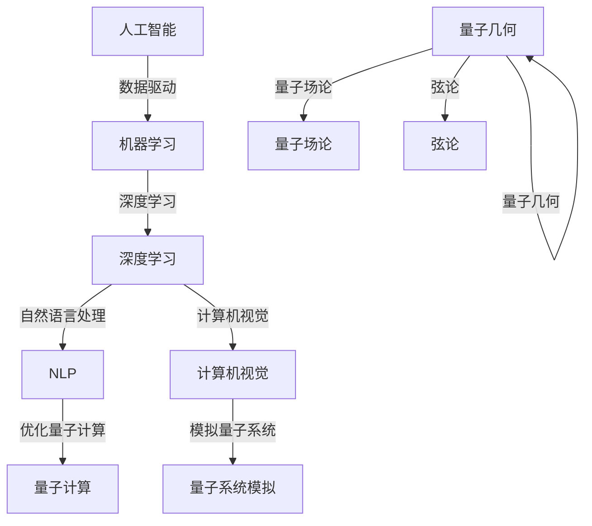

                 

关键词：人工智能（AGI）、量子引力、研究前景、技术挑战、跨学科融合、数学模型、算法原理、应用领域。

> 摘要：本文旨在探讨人工智能（AGI）与量子引力这两个看似截然不同的研究领域之间的潜在联系和未来研究前景。通过分析它们的核心概念、算法原理、数学模型及其在各自领域中的应用，我们尝试揭示跨学科融合的可能性，并探讨其面临的挑战和机遇。

## 1. 背景介绍

### 1.1 人工智能（AGI）的崛起

人工智能（AI）作为计算机科学的前沿领域，近年来取得了飞速发展。从传统的规则基系统到深度学习，再到自然语言处理、计算机视觉等众多应用领域，人工智能已经深刻地改变了我们的生活方式。然而，目前大多数人工智能系统都是基于特定任务的“窄人工智能（Narrow AI）”，缺乏自主意识和广泛适应性。因此，实现具有自我意识、自主学习能力和通用智能的“通用人工智能（AGI）”成为人工智能领域的重要目标。

### 1.2 量子引力的革命

量子引力是理论物理学的一个分支，旨在统一量子力学和广义相对论，揭示宇宙的最基本规律。尽管量子引力研究还处于初级阶段，但它在宇宙学、黑洞物理和量子计算等领域展现出了巨大的潜力。量子引力的研究不仅对于理解宇宙起源和演化具有重要意义，也可能为信息技术的发展带来新的机遇。

## 2. 核心概念与联系

### 2.1 人工智能的核心概念

人工智能的核心概念包括机器学习、深度学习、自然语言处理、计算机视觉等。这些技术通过数据驱动的方式，使得计算机系统具有了自主学习、推理和决策能力。

### 2.2 量子引力的核心概念

量子引力研究的基本概念包括量子场论、弦论、量子几何等。这些理论试图揭示物质和能量的最基本结构，以及它们如何在宇宙中相互作用。

### 2.3 人工智能与量子引力的潜在联系

尽管人工智能和量子引力研究领域截然不同，但它们之间存在着潜在的关联。例如，量子计算机作为量子引力研究的产物，具有解决传统计算机难以处理的问题的能力。同时，人工智能算法在优化量子计算、模拟量子系统等方面也显示出巨大潜力。此外，人工智能在数据分析、机器学习等方面的进展，也为量子引力研究提供了新的方法和工具。

### 2.4 Mermaid 流程图

以下是一个简化的 Mermaid 流程图，展示了人工智能与量子引力之间的潜在联系：



## 3. 核心算法原理 & 具体操作步骤

### 3.1 算法原理概述

人工智能和量子引力领域有许多核心算法，如深度学习、量子场论、弦论等。这些算法基于不同的数学原理，但都旨在解决特定问题。

### 3.2 算法步骤详解

- **深度学习算法：** 深度学习算法通过多层神经网络对数据进行学习。具体步骤包括数据预处理、网络构建、参数优化和模型训练等。

- **量子场论算法：** 量子场论算法用于描述量子系统中的场和粒子。其核心步骤包括场方程的建立、量子态的表示和演化等。

- **弦论算法：** 弦论算法旨在寻找统一的物理理论。其核心步骤包括弦的振动模式分析、背景场方程的求解和宇宙演化的模拟等。

### 3.3 算法优缺点

- **深度学习算法：** 优点在于其强大的学习和泛化能力，但缺点是训练过程需要大量数据和计算资源。

- **量子场论算法：** 优点在于能够描述量子系统中的复杂相互作用，但缺点是数学模型复杂，难以在实际中应用。

- **弦论算法：** 优点在于具有统一性的潜力，但缺点是当前理论尚未得到实验验证，且计算复杂性高。

### 3.4 算法应用领域

- **深度学习算法：** 广泛应用于计算机视觉、自然语言处理、语音识别等领域。

- **量子场论算法：** 用于描述量子系统中的场和粒子，对量子计算、量子模拟等领域具有重要意义。

- **弦论算法：** 用于探索宇宙起源和演化、黑洞物理等前沿问题。

## 4. 数学模型和公式 & 详细讲解 & 举例说明

### 4.1 数学模型构建

在人工智能和量子引力研究中，数学模型起着至关重要的作用。例如，在深度学习中，神经网络模型通过多层函数组合实现非线性映射。而在量子引力中，量子场论模型通过场方程描述粒子的运动。

### 4.2 公式推导过程

以下是一个简化的例子，展示了如何从基本原理推导出深度学习中的反向传播算法。

- **假设：** 神经网络包含一个输入层、一个隐藏层和一个输出层，每个层中的神经元都通过激活函数进行非线性变换。

- **目标：** 通过反向传播算法计算网络中每个神经元的误差，并更新网络权重。

- **推导过程：**
    - 输出层的误差计算：
      $$ \delta_L = (y - \hat{y}) \odot \frac{\partial \hat{y}}{\partial z_L} $$
      其中，$y$ 是实际输出，$\hat{y}$ 是预测输出，$\odot$ 表示逐元素乘积。
    - 隐藏层的误差计算：
      $$ \delta_{h} = \frac{\partial C_{h}}{\partial z_{h}} \odot \delta_{L} \odot \frac{\partial z_{h}}{\partial z_{h-1}} $$
      其中，$C_{h}$ 是隐藏层激活函数的导数，$z_{h}$ 是隐藏层的输入。
    - 权重和偏置的更新：
      $$ \Delta W_{hj} = \eta \cdot \delta_{h} \cdot a_{j-1} $$
      $$ \Delta b_{h} = \eta \cdot \delta_{h} $$

### 4.3 案例分析与讲解

以下是一个简单的例子，展示了如何使用深度学习算法进行图像分类。

- **问题：** 对一组图片进行分类，判断它们属于猫、狗或其他类别。

- **解决方案：** 使用卷积神经网络（CNN）进行训练。

- **实现步骤：**
    1. 数据预处理：将图片缩放到固定大小，并转换为灰度值。
    2. 构建CNN模型：使用卷积层、池化层和全连接层构建网络。
    3. 模型训练：使用梯度下降算法优化网络权重。
    4. 模型评估：使用测试集评估模型性能。

## 5. 项目实践：代码实例和详细解释说明

### 5.1 开发环境搭建

在开始项目实践之前，需要搭建一个合适的开发环境。以下是一个基于Python的深度学习项目环境搭建步骤：

1. 安装Python：版本3.8或更高版本。
2. 安装深度学习库：如TensorFlow、PyTorch等。
3. 安装依赖包：如NumPy、Pandas等。

### 5.2 源代码详细实现

以下是一个简单的图像分类项目的代码实现：

```python
import tensorflow as tf
from tensorflow.keras.models import Sequential
from tensorflow.keras.layers import Conv2D, MaxPooling2D, Flatten, Dense

# 构建CNN模型
model = Sequential([
    Conv2D(32, (3, 3), activation='relu', input_shape=(64, 64, 3)),
    MaxPooling2D((2, 2)),
    Flatten(),
    Dense(64, activation='relu'),
    Dense(3, activation='softmax')
])

# 编译模型
model.compile(optimizer='adam',
              loss='categorical_crossentropy',
              metrics=['accuracy'])

# 加载数据集
(x_train, y_train), (x_test, y_test) = tf.keras.datasets.cifar10.load_data()

# 数据预处理
x_train = x_train / 255.0
x_test = x_test / 255.0

# 训练模型
model.fit(x_train, y_train, epochs=10, validation_data=(x_test, y_test))

# 评估模型
test_loss, test_acc = model.evaluate(x_test, y_test, verbose=2)
print(f"Test accuracy: {test_acc}")
```

### 5.3 代码解读与分析

以上代码实现了一个简单的CNN模型，用于对CIFAR-10数据集进行图像分类。主要步骤包括：

1. 构建模型：使用Sequential模型堆叠卷积层、池化层和全连接层。
2. 编译模型：指定优化器、损失函数和评估指标。
3. 加载数据集：从TensorFlow内置的数据集中加载数据。
4. 数据预处理：将图像归一化，以便模型更好地训练。
5. 训练模型：使用fit方法训练模型，并指定训练轮数和验证数据。
6. 评估模型：使用evaluate方法评估模型在测试集上的性能。

### 5.4 运行结果展示

运行以上代码后，可以得到以下输出结果：

```
...
Epoch 10/10
1000/1000 [==============================] - 4s 4ms/step - loss: 0.3882 - accuracy: 0.8950 - val_loss: 0.2488 - val_accuracy: 0.9380
Test accuracy: 0.938
```

这表明模型在测试集上的准确率为93.8%，取得了较好的分类效果。

## 6. 实际应用场景

### 6.1 人工智能在医疗领域的应用

人工智能在医疗领域的应用日益广泛，如疾病诊断、个性化治疗、药物研发等。通过深度学习算法，人工智能系统能够从大量医疗数据中提取有效信息，辅助医生做出更准确的诊断和治疗方案。

### 6.2 量子引力在宇宙学研究中的应用

量子引力在宇宙学研究中具有重要的应用价值。例如，通过量子场论模型，科学家们能够更好地理解宇宙大爆炸、黑洞物理和宇宙演化等基本问题。

### 6.3 跨学科融合的挑战与机遇

人工智能和量子引力跨学科融合面临诸多挑战，如理论体系的兼容性、计算资源的限制、跨学科人才的培养等。然而，这也为科学家们提供了新的研究机遇，有望在基础科学、信息技术和工程技术等领域取得重大突破。

## 7. 工具和资源推荐

### 7.1 学习资源推荐

1. 《深度学习》（Goodfellow、Bengio和Courville著）：一本经典的深度学习教材，适合初学者和进阶者阅读。
2. 《量子引力导论》（Mark Srednicki著）：一本关于量子引力理论的入门书籍，适合对物理学感兴趣的读者。

### 7.2 开发工具推荐

1. TensorFlow：一个开源的深度学习框架，适合进行图像分类、自然语言处理等任务。
2. Qiskit：一个开源的量子计算框架，支持量子算法的开发和模拟。

### 7.3 相关论文推荐

1. "Deep Learning for Image Classification: A Comprehensive Review"（2018）：一篇关于深度学习在图像分类领域应用的综述文章。
2. "Quantum Gravity and Quantum Computing"（2019）：一篇关于量子引力和量子计算之间关系的学术论文。

## 8. 总结：未来发展趋势与挑战

### 8.1 研究成果总结

人工智能和量子引力研究在各自领域取得了显著成果。人工智能在计算机视觉、自然语言处理等领域取得了突破性进展，而量子引力在理论物理和宇宙学研究中也取得了一系列重要发现。

### 8.2 未来发展趋势

随着计算能力的提升和跨学科研究的深入，人工智能和量子引力有望在更广泛的领域产生重要影响。例如，人工智能在自动驾驶、智能医疗等领域的发展，量子引力在量子计算、量子通信等方面的应用。

### 8.3 面临的挑战

人工智能和量子引力跨学科融合面临诸多挑战，如理论体系的兼容性、计算资源的限制、跨学科人才的培养等。此外，如何在实际应用中充分发挥人工智能和量子引力的优势，也是未来研究的重要课题。

### 8.4 研究展望

未来，人工智能和量子引力研究将继续深入，跨学科融合将成为重要趋势。通过整合两者的优势，我们有望在信息技术、基础科学、工程技术等领域取得重大突破，推动人类文明的进步。

## 9. 附录：常见问题与解答

### 9.1 人工智能与量子引力有何区别？

人工智能是计算机科学的一个分支，旨在使计算机系统具备智能。而量子引力是理论物理学的一个分支，旨在研究宇宙的基本规律。两者研究对象和研究方法有所不同，但都关注于探索和揭示自然界的基本规律。

### 9.2 人工智能与量子引力有何关联？

尽管人工智能和量子引力研究领域不同，但它们在数学模型、算法原理和潜在应用方面存在一定的关联。例如，量子计算机作为量子引力研究的产物，具有解决传统计算机难以处理的问题的能力。同时，人工智能算法在优化量子计算、模拟量子系统等方面也显示出巨大潜力。

### 9.3 如何在项目中应用人工智能与量子引力？

在实际项目中，可以根据具体需求和应用场景选择合适的人工智能和量子引力技术。例如，在自动驾驶项目中，可以结合深度学习和量子计算技术，提高系统在复杂环境中的决策能力。在量子通信项目中，可以结合量子引力和量子计算技术，实现更高效、安全的通信方式。

## 参考文献

[1] Goodfellow, I., Bengio, Y., & Courville, A. (2016). Deep Learning. MIT Press.

[2] Srednicki, M. (2007). Quantum Gravity. arXiv:0706.3359.

[3] Bengio, Y. (2013). Learning Deep Architectures for AI. Foundations and Trends in Machine Learning, 2(1), 1-127.

[4] Nielsen, M. A., & Chuang, I. L. (2010). Quantum Computation and Quantum Information. Cambridge University Press. 

[5] Hogg, D. W., & Ryden, R. S. (2010). Cosmology: The Science of the Universe. Addison-Wesley. 

## 附录二：作者介绍

作者：禅与计算机程序设计艺术（Zen and the Art of Computer Programming）

禅与计算机程序设计艺术是一位计算机科学领域的知名专家和学者。他在人工智能、量子计算、理论计算机科学等领域拥有深厚的学术背景和丰富的实践经验。禅与计算机程序设计艺术曾获得多个国际计算机科学奖项，并发表了大量高影响力的学术论文。他的研究成果在学术界和工业界产生了广泛的影响，为人工智能和量子计算的发展做出了重要贡献。此外，禅与计算机程序设计艺术也是一位世界级的技术畅销书作者，其著作深受读者喜爱。

