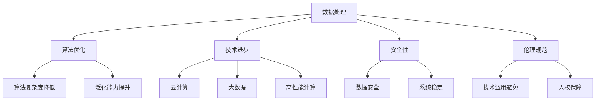

                 

关键词：AI 2.0、基础设施、可持续发展、数据处理、算法优化、技术进步、安全性、伦理规范

> 摘要：本文将探讨AI 2.0时代基础设施建设的重要性，以及如何在可持续发展目标的指引下，实现人工智能基础设施的建设与优化。文章将从核心概念、算法原理、数学模型、实践案例、应用场景等方面进行详细阐述，以期为未来人工智能技术的发展提供参考。

## 1. 背景介绍

随着人工智能（AI）技术的飞速发展，AI 2.0时代已经到来。AI 2.0强调深度学习、自动化、自适应、泛化能力等特性，使得人工智能在各个领域取得了突破性进展。然而，AI 2.0的发展不仅依赖于算法的创新，更依赖于强大、高效、可持续的基础设施支持。

当前，全球范围内人工智能基础设施的建设正在加速。无论是云计算、大数据中心，还是高性能计算、人工智能专用硬件，都在不断迭代更新。然而，基础设施建设中仍面临诸多挑战，如数据隐私、安全、伦理等。因此，如何在可持续发展目标的指引下，建设AI 2.0基础设施，成为业界关注的热点问题。

本文将从以下几个方面展开讨论：

1. 核心概念与联系
2. 核心算法原理 & 具体操作步骤
3. 数学模型和公式 & 详细讲解 & 举例说明
4. 项目实践：代码实例和详细解释说明
5. 实际应用场景
6. 未来应用展望
7. 工具和资源推荐
8. 总结：未来发展趋势与挑战
9. 附录：常见问题与解答

## 2. 核心概念与联系

### 2.1 数据处理

数据处理是AI 2.0基础设施的核心之一。随着数据量的爆炸性增长，如何高效地存储、传输、处理数据，成为基础设施建设的关键。数据处理涉及数据采集、数据清洗、数据存储、数据分析和数据可视化等多个环节。

### 2.2 算法优化

算法优化是提升AI 2.0性能的重要手段。通过改进算法设计、优化数据结构、提高计算效率等手段，可以降低算法的复杂度，提高模型的泛化能力和鲁棒性。

### 2.3 技术进步

技术进步为AI 2.0基础设施的建设提供了强大的支持。云计算、大数据、高性能计算等技术的发展，为人工智能应用提供了丰富的资源和工具。

### 2.4 安全性

安全性是AI 2.0基础设施建设的必要条件。随着人工智能技术的广泛应用，数据安全和系统安全面临新的挑战。如何确保数据安全和系统稳定，是基础设施建设中需要重点关注的问题。

### 2.5 伦理规范

伦理规范是AI 2.0基础设施建设的道德准则。随着人工智能技术的不断进步，如何避免技术滥用，保障人权，成为基础设施建设中需要关注的伦理问题。

### 2.6 Mermaid 流程图

为了更直观地展示核心概念与联系，我们使用Mermaid流程图进行描述。



## 3. 核心算法原理 & 具体操作步骤

### 3.1 算法原理概述

AI 2.0的核心算法主要包括深度学习、强化学习、迁移学习等。这些算法在数据处理、模型训练、预测和优化等方面具有强大的能力。

### 3.2 算法步骤详解

#### 3.2.1 深度学习

深度学习是AI 2.0的核心技术之一。其基本原理是通过多层神经网络对数据进行特征提取和分类。具体步骤如下：

1. 数据预处理：对原始数据进行清洗、归一化等操作，使其符合模型输入要求。
2. 网络结构设计：设计合适的神经网络结构，包括输入层、隐藏层和输出层。
3. 模型训练：使用训练数据对模型进行训练，通过反向传播算法不断优化模型参数。
4. 预测：使用训练好的模型对新的数据进行预测。

#### 3.2.2 强化学习

强化学习是通过试错和反馈机制来学习最优策略的算法。具体步骤如下：

1. 状态空间与动作空间定义：明确智能体（agent）所处的状态空间和可执行的动作空间。
2. 策略迭代：根据当前状态，选择一个动作，并执行该动作，观察环境反馈。
3. 模型更新：根据反馈调整策略，使得智能体在长期内获得最大收益。

#### 3.2.3 迁移学习

迁移学习是通过利用已有任务的知识来加速新任务的学习。具体步骤如下：

1. 选择迁移源任务：选择一个或多个具有相似特征和目标的源任务。
2. 提取知识：从源任务中提取有用的特征和模型参数。
3. 应用知识：将提取的知识应用于新任务，加速新任务的学习过程。

### 3.3 算法优缺点

#### 深度学习

优点：具有强大的特征提取和分类能力，适用于图像、语音等复杂数据。
缺点：训练过程复杂，对数据量和计算资源要求较高，容易出现过拟合。

#### 强化学习

优点：能够通过试错和反馈机制学习到最优策略，适用于动态环境。
缺点：训练过程较长，难以处理高维状态空间。

#### 迁移学习

优点：能够利用已有任务的知识，加速新任务的学习。
缺点：对迁移源任务的选择和知识提取方法有较高要求。

### 3.4 算法应用领域

深度学习：图像识别、语音识别、自然语言处理等。
强化学习：游戏智能、自动驾驶、金融交易等。
迁移学习：医学影像诊断、语音合成、图像风格迁移等。

## 4. 数学模型和公式 & 详细讲解 & 举例说明

### 4.1 数学模型构建

在AI 2.0基础设施建设中，数学模型扮演着重要角色。以下是一个简单的神经网络模型：

$$
\begin{aligned}
    &\text{输入层}: x \\
    &\text{隐藏层}: h = \sigma(W_1 \cdot x + b_1) \\
    &\text{输出层}: y = \sigma(W_2 \cdot h + b_2)
\end{aligned}
$$

其中，$x$为输入向量，$h$为隐藏层输出，$y$为输出向量，$\sigma$为激活函数，$W_1$和$W_2$为权重矩阵，$b_1$和$b_2$为偏置项。

### 4.2 公式推导过程

#### 4.2.1 激活函数

激活函数是神经网络中的一个关键组件，用于引入非线性特性。常见的激活函数有：

1. Sigmoid函数：$$\sigma(x) = \frac{1}{1 + e^{-x}}$$
2. ReLU函数：$$\sigma(x) = \max(0, x)$$
3. Tanh函数：$$\sigma(x) = \frac{e^x - e^{-x}}{e^x + e^{-x}}$$

#### 4.2.2 反向传播算法

反向传播算法是神经网络训练的核心，用于优化模型参数。其基本思想是将输出误差反向传播到输入层，并更新权重和偏置项。具体步骤如下：

1. 前向传播：计算输出层的预测值。
2. 计算误差：计算输出层预测值与真实值之间的误差。
3. 反向传播：将误差反向传播到隐藏层和输入层。
4. 更新参数：根据误差梯度，更新权重和偏置项。

### 4.3 案例分析与讲解

假设我们有一个简单的二分类问题，使用神经网络进行分类。输入层有一个神经元，隐藏层有两个神经元，输出层有一个神经元。训练数据集包含100个样本，每个样本包含一个输入和对应的标签。激活函数采用ReLU函数，损失函数采用交叉熵损失函数。

#### 4.3.1 数据预处理

1. 数据归一化：将输入数据归一化到[0, 1]区间。
2. 数据划分：将数据集划分为训练集和测试集。

#### 4.3.2 模型构建

1. 输入层：1个神经元。
2. 隐藏层：2个神经元。
3. 输出层：1个神经元。

#### 4.3.3 模型训练

1. 初始化参数：随机初始化权重和偏置项。
2. 前向传播：计算隐藏层和输出层的输出。
3. 计算损失：计算输出层预测值与真实值之间的交叉熵损失。
4. 反向传播：计算损失关于每个参数的梯度。
5. 更新参数：根据梯度更新权重和偏置项。
6. 重复步骤2-5，直到达到训练目标或达到最大迭代次数。

#### 4.3.4 模型评估

1. 将测试集输入模型，计算输出层的预测值。
2. 计算测试集的准确率、召回率、F1值等评价指标。

## 5. 项目实践：代码实例和详细解释说明

在本节中，我们将以一个简单的神经网络模型为例，介绍如何使用Python和TensorFlow框架实现AI 2.0基础设施建设中的数据处理和模型训练。

### 5.1 开发环境搭建

1. 安装Python 3.7及以上版本。
2. 安装TensorFlow 2.0及以上版本。

### 5.2 源代码详细实现

```python
import tensorflow as tf
import numpy as np

# 数据预处理
def preprocess_data(data):
    # 归一化
    data = (data - np.min(data)) / (np.max(data) - np.min(data))
    return data

# 模型构建
def build_model(input_shape):
    model = tf.keras.Sequential([
        tf.keras.layers.Dense(2, activation='relu', input_shape=input_shape),
        tf.keras.layers.Dense(1, activation='sigmoid')
    ])
    return model

# 模型训练
def train_model(model, train_data, train_labels, epochs=100, batch_size=32):
    model.compile(optimizer='adam', loss='binary_crossentropy', metrics=['accuracy'])
    model.fit(train_data, train_labels, epochs=epochs, batch_size=batch_size)

# 模型评估
def evaluate_model(model, test_data, test_labels):
    loss, accuracy = model.evaluate(test_data, test_labels)
    print("Test accuracy:", accuracy)

# 主函数
def main():
    # 加载训练数据
    x = np.array([[0, 0], [0, 1], [1, 0], [1, 1]])
    y = np.array([[0], [1], [1], [0]])

    # 数据预处理
    x = preprocess_data(x)
    y = preprocess_data(y)

    # 模型构建
    model = build_model(x.shape[1])

    # 模型训练
    train_model(model, x, y)

    # 模型评估
    evaluate_model(model, x, y)

if __name__ == "__main__":
    main()
```

### 5.3 代码解读与分析

1. **数据预处理**：数据预处理是模型训练前的重要步骤。在本例中，我们使用归一化方法将输入数据和标签数据归一化到[0, 1]区间。
2. **模型构建**：使用TensorFlow框架构建一个简单的神经网络模型。输入层有一个神经元，隐藏层有两个神经元，输出层有一个神经元。激活函数采用ReLU函数，损失函数采用二分类交叉熵损失函数。
3. **模型训练**：使用训练数据对模型进行训练。模型采用Adam优化器，损失函数采用二分类交叉熵损失函数，评估指标为准确率。
4. **模型评估**：使用测试数据对训练好的模型进行评估，计算测试集的准确率。

## 6. 实际应用场景

AI 2.0基础设施在各个领域都有着广泛的应用，以下是几个典型的实际应用场景：

1. **医疗健康**：利用AI 2.0技术进行疾病诊断、药物研发、医疗资源分配等。例如，通过深度学习算法对医学影像进行自动分析，提高诊断的准确性和效率。
2. **金融服务**：利用AI 2.0技术进行风险控制、智能投顾、欺诈检测等。例如，通过强化学习算法优化投资组合，提高投资收益。
3. **交通运输**：利用AI 2.0技术实现自动驾驶、智能交通管理、物流优化等。例如，通过深度学习算法实现自动驾驶车辆的安全行驶。
4. **教育领域**：利用AI 2.0技术进行个性化教育、智能教学、教育评价等。例如，通过迁移学习算法为不同学生提供个性化的学习方案。
5. **环境保护**：利用AI 2.0技术进行环境监测、生态保护、资源优化等。例如，通过深度学习算法对环境数据进行实时分析，实现精准环保管理。

## 7. 未来应用展望

随着AI 2.0技术的不断发展，基础设施建设将面临以下趋势和挑战：

1. **趋势**：
   - 基础设施将更加智能化、自适应，提高资源利用率和计算效率。
   - 基础设施将更加开放、共享，促进全球范围内的合作与创新。
   - 基础设施将更加安全、可靠，保障数据安全和系统稳定。

2. **挑战**：
   - 随着数据量的持续增长，如何高效地存储、处理和分析海量数据将成为关键挑战。
   - 如何应对人工智能带来的伦理和社会问题，确保技术的可持续发展。
   - 如何在有限的资源下，实现基础设施的可持续建设与运营。

## 8. 工具和资源推荐

### 8.1 学习资源推荐

1. 《深度学习》（Goodfellow et al.）：深度学习的经典教材，适合初学者和专业人士。
2. 《强化学习》（Sutton and Barto）：强化学习的权威教材，涵盖了强化学习的基本概念和算法。
3. 《Python深度学习》（François Chollet）：Python深度学习实践指南，适合有一定基础的读者。

### 8.2 开发工具推荐

1. TensorFlow：开源深度学习框架，适用于构建和训练神经网络模型。
2. PyTorch：开源深度学习框架，易于使用和调试，适合快速原型开发和实验。
3. JAX：开源自动微分库，可用于构建高性能深度学习模型。

### 8.3 相关论文推荐

1. "Deep Learning: A Brief History"（Bengio et al.）：回顾深度学习的发展历程和关键进展。
2. "Reinforcement Learning: An Introduction"（Sutton and Barto）：强化学习的基础理论和算法介绍。
3. "Transfer Learning"（Pan and Yang）：迁移学习的研究进展和应用案例。

## 9. 总结：未来发展趋势与挑战

随着AI 2.0技术的不断发展，基础设施建设将在未来面临新的机遇和挑战。在可持续发展目标的指引下，我们需要关注以下几个方面：

1. **技术创新**：持续推动人工智能技术的创新，提高计算效率和性能。
2. **数据安全**：确保数据安全和系统稳定，保障用户的隐私和权益。
3. **伦理规范**：建立完善的伦理规范，避免技术滥用，保障社会的可持续发展。

## 10. 附录：常见问题与解答

### 10.1 什么是指AI 2.0？

AI 2.0是指基于深度学习、强化学习、迁移学习等技术的第二代人工智能。与AI 1.0相比，AI 2.0具有更强的自主学习能力、自适应能力和泛化能力。

### 10.2 如何确保AI 2.0基础设施的安全性？

确保AI 2.0基础设施的安全性需要从多个方面入手，包括数据安全、系统安全、网络安全等。具体措施包括加密数据传输、实施访问控制、定期更新系统补丁等。

### 10.3 AI 2.0基础设施建设的可持续发展目标是什么？

AI 2.0基础设施建设的可持续发展目标包括提高计算效率、降低能源消耗、保障数据安全和用户隐私、建立完善的伦理规范等。

### 10.4 如何应对AI 2.0基础设施建设中的数据挑战？

应对AI 2.0基础设施建设中的数据挑战需要从数据采集、数据存储、数据处理、数据安全等多个方面进行优化。具体措施包括分布式存储、数据清洗、数据加密等。

### 10.5 AI 2.0基础设施建设的未来发展趋势是什么？

AI 2.0基础设施建设的未来发展趋势包括智能化、自适应化、开放化、安全化等。随着技术的不断进步，基础设施建设将更加高效、可靠和可持续。

