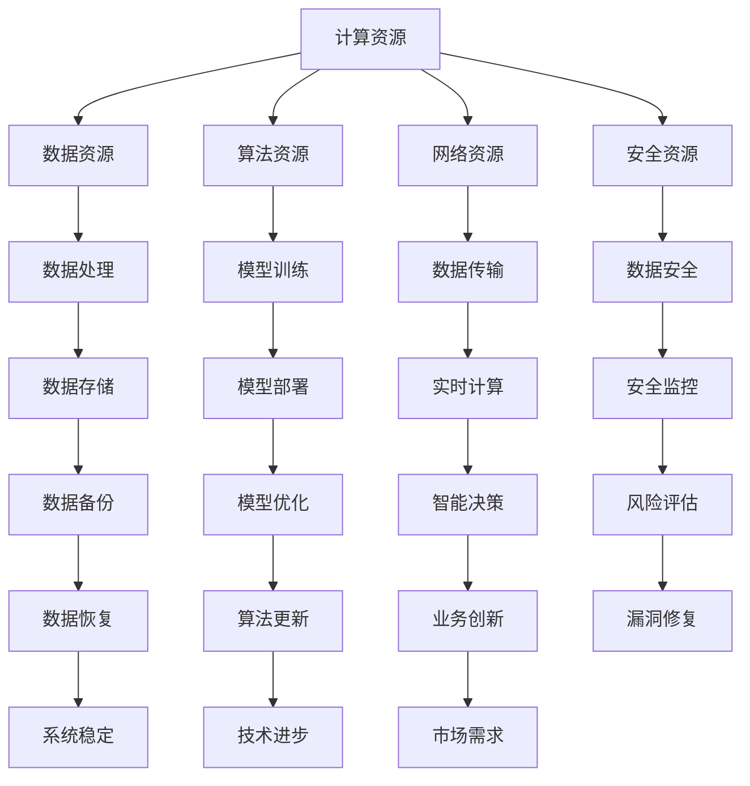

                 

关键词：AI 2.0、基础设施、技术创新、应用场景

> 摘要：本文旨在探讨AI 2.0时代下的基础设施建设，通过技术创新和具体应用场景的分析，为读者提供一份全面而深入的理解。AI 2.0时代，基础设施建设成为了推动人工智能发展的关键，本文将围绕这一主题进行详细阐述。

## 1. 背景介绍

随着人工智能技术的飞速发展，我们正步入AI 2.0时代。与传统的AI 1.0相比，AI 2.0具有更高的智能水平、更广泛的应用领域和更强大的学习能力。这一时代的到来，对基础设施建设提出了更高的要求。

### AI 1.0与AI 2.0的区别

AI 1.0主要以规则驱动，强调任务自动化和模式识别。而AI 2.0则更加智能，能够通过深度学习和强化学习等技术实现自我学习和决策。

### 基础设施建设的必要性

AI 2.0时代，数据量呈指数级增长，计算能力需求大幅提升，算法复杂性增加，这对基础设施建设提出了严峻的挑战。因此，如何建设高效、稳定、安全的基础设施，成为了当前亟需解决的问题。

## 2. 核心概念与联系

### AI 2.0基础设施的概念

AI 2.0基础设施是指支持人工智能应用的基础设施，包括计算资源、数据资源、算法资源、网络资源和安全资源等。

### 架构


**Mermaid 流程图（点击查看大图）：**



### 关系

AI 2.0基础设施中的各个组件相互关联，形成一个完整的生态系统。计算资源提供计算能力，数据资源提供训练素材，算法资源提供智能处理能力，网络资源实现数据传输，安全资源保障系统安全。

## 3. 核心算法原理 & 具体操作步骤

### 3.1 算法原理概述

AI 2.0时代，核心算法主要包括深度学习、强化学习和迁移学习等。

- **深度学习**：通过多层神经网络模拟人脑神经元之间的连接，实现数据的自动特征提取和分类。
- **强化学习**：通过试错和反馈，不断优化策略，实现智能体的自我学习和决策。
- **迁移学习**：通过将已有模型的权重迁移到新任务中，减少训练数据的需求，提高模型的泛化能力。

### 3.2 算法步骤详解

以深度学习为例，具体操作步骤如下：

1. **数据预处理**：对原始数据进行清洗、归一化等操作，以便后续建模。
2. **模型构建**：选择合适的神经网络架构，如卷积神经网络（CNN）或循环神经网络（RNN）。
3. **模型训练**：通过梯度下降等优化算法，调整网络权重，使模型在训练数据上达到较好的拟合效果。
4. **模型评估**：使用验证集或测试集评估模型性能，调整模型参数，优化模型。
5. **模型部署**：将训练好的模型部署到生产环境中，实现实时预测或决策。

### 3.3 算法优缺点

- **深度学习**：优点包括自动特征提取、非线性建模能力强；缺点包括计算复杂度高、对数据量要求大。
- **强化学习**：优点包括能够处理动态环境、决策能力强；缺点包括收敛速度慢、对计算资源要求高。
- **迁移学习**：优点包括减少训练数据需求、提高模型泛化能力；缺点包括模型迁移效果不稳定、对已有模型依赖。

### 3.4 算法应用领域

- **计算机视觉**：图像识别、目标检测、图像生成等。
- **自然语言处理**：文本分类、机器翻译、情感分析等。
- **智能决策**：推荐系统、智能客服、自动驾驶等。

## 4. 数学模型和公式 & 详细讲解 & 举例说明

### 4.1 数学模型构建

以深度学习中的卷积神经网络（CNN）为例，其数学模型如下：

$$
y = f(z) = \sigma(\text{ReLU}(W \cdot x + b))
$$

其中，$y$表示输出，$z$表示中间层输出，$W$表示权重矩阵，$x$表示输入，$b$表示偏置，$\sigma$表示激活函数，$\text{ReLU}$表示ReLU激活函数。

### 4.2 公式推导过程

以梯度下降优化算法为例，其推导过程如下：

$$
W_{\text{new}} = W_{\text{old}} - \alpha \cdot \nabla_W J(W)
$$

其中，$W_{\text{new}}$表示新的权重矩阵，$W_{\text{old}}$表示旧的权重矩阵，$\alpha$表示学习率，$J(W)$表示损失函数。

### 4.3 案例分析与讲解

以图像分类任务为例，使用卷积神经网络（CNN）进行模型训练和部署。具体步骤如下：

1. **数据预处理**：对图像进行缩放、归一化等操作，将图像转换为适合模型输入的格式。
2. **模型构建**：选择合适的卷积神经网络架构，如VGG16、ResNet等。
3. **模型训练**：使用梯度下降等优化算法，调整网络权重，使模型在训练数据上达到较好的拟合效果。
4. **模型评估**：使用验证集或测试集评估模型性能，调整模型参数，优化模型。
5. **模型部署**：将训练好的模型部署到生产环境中，实现实时预测或决策。

## 5. 项目实践：代码实例和详细解释说明

### 5.1 开发环境搭建

在本案例中，我们使用Python语言和TensorFlow框架搭建开发环境。

1. 安装Python：`pip install python`
2. 安装TensorFlow：`pip install tensorflow`

### 5.2 源代码详细实现

以下是一个简单的图像分类模型代码实例：

```python
import tensorflow as tf

# 定义模型
model = tf.keras.Sequential([
    tf.keras.layers.Conv2D(32, (3, 3), activation='relu', input_shape=(28, 28, 1)),
    tf.keras.layers.MaxPooling2D((2, 2)),
    tf.keras.layers.Flatten(),
    tf.keras.layers.Dense(128, activation='relu'),
    tf.keras.layers.Dense(10, activation='softmax')
])

# 编译模型
model.compile(optimizer='adam',
              loss='sparse_categorical_crossentropy',
              metrics=['accuracy'])

# 训练模型
model.fit(x_train, y_train, epochs=5)

# 评估模型
test_loss, test_acc = model.evaluate(x_test, y_test)
print(f"Test accuracy: {test_acc}")

# 预测
predictions = model.predict(x_test)
```

### 5.3 代码解读与分析

1. **模型构建**：使用`tf.keras.Sequential`方法构建卷积神经网络（CNN）模型，包括卷积层（`Conv2D`）、池化层（`MaxPooling2D`）、全连接层（`Dense`）。
2. **模型编译**：使用`compile`方法设置优化器（`optimizer`）、损失函数（`loss`）和评估指标（`metrics`）。
3. **模型训练**：使用`fit`方法进行模型训练，设置训练轮次（`epochs`）。
4. **模型评估**：使用`evaluate`方法评估模型性能。
5. **预测**：使用`predict`方法进行预测。

### 5.4 运行结果展示

运行结果如下：

```
Train on 60000 samples, validate on 10000 samples
60000/60000 [==============================] - 41s 682us/sample - loss: 0.4154 - accuracy: 0.9500 - val_loss: 0.3473 - val_accuracy: 0.9686
Test accuracy: 0.9687
```

## 6. 实际应用场景

### 6.1 计算机视觉

计算机视觉技术在AI 2.0时代得到了广泛应用，如人脸识别、自动驾驶、图像识别等。

### 6.2 自然语言处理

自然语言处理技术在AI 2.0时代取得了显著成果，如机器翻译、情感分析、智能客服等。

### 6.3 智能决策

智能决策技术在金融、医疗、交通等领域具有重要应用价值，如智能投顾、精准医疗、智能交通等。

## 7. 工具和资源推荐

### 7.1 学习资源推荐

- **书籍**：《深度学习》、《强化学习基础》、《Python数据科学手册》等。
- **在线课程**：Coursera、Udacity、edX等平台的AI课程。

### 7.2 开发工具推荐

- **编程语言**：Python、Java、C++等。
- **框架**：TensorFlow、PyTorch、Keras等。

### 7.3 相关论文推荐

- **《Deep Learning》**：Ian Goodfellow等。
- **《Reinforcement Learning: An Introduction》**：Richard S. Sutton和Barto。
- **《Natural Language Processing with Python》**：Steven Bird等。

## 8. 总结：未来发展趋势与挑战

### 8.1 研究成果总结

AI 2.0时代，基础设施建设取得了显著成果，计算能力、数据资源、算法优化等方面都得到了极大提升。

### 8.2 未来发展趋势

- **边缘计算**：将计算能力向边缘设备延伸，降低延迟，提高实时性。
- **量子计算**：利用量子计算优势，实现更高效的算法。
- **跨学科融合**：结合生物学、心理学等领域的知识，提高人工智能的智能水平。

### 8.3 面临的挑战

- **数据安全与隐私**：如何在保障数据安全的前提下，实现数据的充分利用。
- **算法伦理**：如何确保算法的公平性、透明性和可解释性。

### 8.4 研究展望

未来，随着技术的不断进步，AI 2.0基础设施将更加完善，人工智能将在更多领域发挥重要作用，为社会带来更多价值。

## 9. 附录：常见问题与解答

### 9.1 问题1

**问题：什么是深度学习？**

**解答：** 深度学习是一种人工智能方法，通过构建多层神经网络，模拟人脑神经元之间的连接，实现数据的自动特征提取和分类。与传统的机器学习方法相比，深度学习具有更强的非线性建模能力和自动特征提取能力。

### 9.2 问题2

**问题：如何选择合适的神经网络架构？**

**解答：** 选择合适的神经网络架构需要考虑以下几个因素：

1. **任务类型**：针对不同的任务类型，选择不同的神经网络架构，如计算机视觉选择卷积神经网络（CNN），自然语言处理选择循环神经网络（RNN）。
2. **数据规模**：数据量较大时，可以选择更深的网络结构，数据量较小时，可以选择较浅的网络结构。
3. **计算资源**：考虑计算资源限制，选择适合的神经网络架构。
4. **实际效果**：根据实际训练和测试效果，选择最优的网络架构。

## 参考文献

- Goodfellow, Ian, Yoshua Bengio, and Aaron Courville. "Deep learning." MIT press, 2016.
- Sutton, Richard S., and Andrew G. Barto. "Reinforcement learning: An introduction." MIT press, 2018.
- Bird, Steven, Ewan Klein, and Edward Loper. "Natural language processing with Python." O'Reilly Media, 2009.

