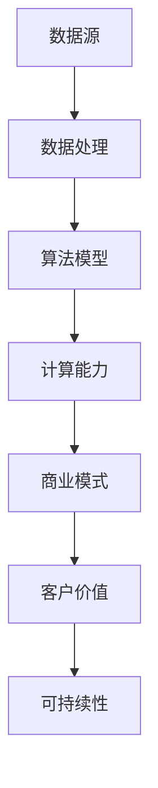
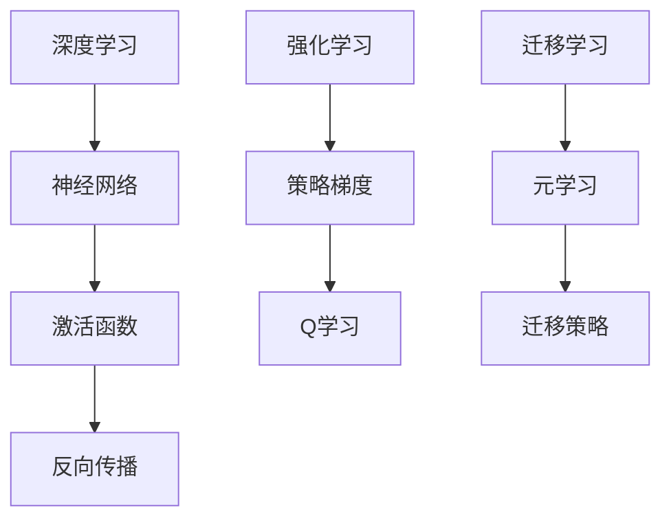
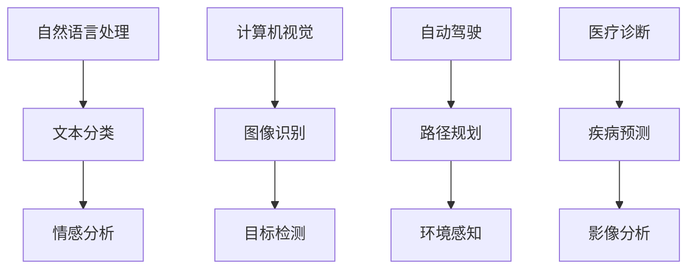

                 

关键词：人工智能，商业模式，AI 2.0，创新，价值链，商业战略，数字化转型，可持续发展。

## 摘要

本文旨在探讨人工智能（AI）2.0时代的商业模式。在AI技术不断进步和商业应用日益广泛的背景下，企业必须重新审视其商业模式，以适应这一新时代的需求。本文将分析AI 2.0的核心概念与联系，探讨其核心算法原理及具体操作步骤，并详细讲解数学模型和公式。随后，通过项目实践展示代码实例，最后分析AI 2.0时代的实际应用场景及未来发展趋势与挑战。

## 1. 背景介绍

随着人工智能技术的不断发展，从AI 1.0到AI 2.0，人工智能的应用领域不断扩展，商业模式也在不断演变。AI 2.0时代的商业模式将更加注重数据驱动的创新，跨界融合，以及可持续发展的理念。

### 1.1 AI 1.0与AI 2.0的区别

AI 1.0时代主要基于传统的机器学习和统计方法，主要应用于图像识别、语音识别等领域。而AI 2.0则更加注重深度学习和复杂神经网络的应用，能够处理更复杂的任务，如自然语言处理、自动驾驶等。

### 1.2 商业模式的重要性

商业模式是企业如何创造、传递和捕获价值的一种策略。在AI 2.0时代，商业模式的重要性更加凸显，因为它直接关系到企业的竞争力、可持续发展以及创新能力。

## 2. 核心概念与联系

在AI 2.0时代，数据、算法和计算能力是构成商业模式的三大核心要素。以下是一个简单的Mermaid流程图，展示这些核心概念之间的联系。



### 2.1 数据

数据是AI 2.0时代的基础，是企业创造价值的源泉。数据的来源可以是内部数据（如客户交易记录、运营数据）和外部数据（如社交媒体、公开数据集）。

### 2.2 算法模型

算法模型是AI 2.0的核心，它决定了数据如何被处理和利用。深度学习和复杂神经网络是AI 2.0时代的主要算法模型。

### 2.3 计算能力

计算能力是AI 2.0时代的关键因素，强大的计算能力可以加速算法模型的训练和推理过程，提高企业的竞争力。

### 2.4 商业模式

商业模式是将数据、算法和计算能力转化为商业价值的过程。AI 2.0时代的商业模式将更加注重数据驱动的创新、跨界融合和可持续发展。

## 3. 核心算法原理 & 具体操作步骤

### 3.1 算法原理概述

AI 2.0时代的主要算法原理包括深度学习、强化学习和迁移学习。以下是一个简单的算法原理概述。



### 3.2 算法步骤详解

以下是AI 2.0时代算法步骤的详细说明：

1. 数据预处理：包括数据清洗、数据标准化和数据增强。
2. 模型选择：根据任务需求选择合适的模型，如卷积神经网络（CNN）、循环神经网络（RNN）等。
3. 模型训练：使用训练数据集对模型进行训练，包括前向传播和反向传播过程。
4. 模型评估：使用验证数据集评估模型性能，包括准确率、召回率、F1分数等指标。
5. 模型部署：将训练好的模型部署到生产环境中，进行实际应用。

### 3.3 算法优缺点

- **优点**：AI 2.0算法具有强大的数据处理能力、自学习能力，能够提高企业效率和创新能力。
- **缺点**：算法模型训练过程复杂、计算资源消耗大，对数据质量和计算能力要求较高。

### 3.4 算法应用领域

AI 2.0算法可以应用于多个领域，如自然语言处理、计算机视觉、自动驾驶、医疗诊断等。以下是一个简单的应用领域分类：



## 4. 数学模型和公式 & 详细讲解 & 举例说明

### 4.1 数学模型构建

在AI 2.0时代，常用的数学模型包括神经网络模型、强化学习模型和迁移学习模型。以下是一个简单的神经网络模型构建过程。

```latex
\begin{equation}
\begin{aligned}
h_{\text{layer}} &= \sigma(W_{\text{layer}}h_{\text{prev}} + b_{\text{layer}}) \\
y_{\text{layer}} &= f(h_{\text{layer}})
\end{aligned}
\end{equation}
```

其中，$h_{\text{layer}}$ 表示第 $l$ 层的激活值，$W_{\text{layer}}$ 表示第 $l$ 层的权重矩阵，$b_{\text{layer}}$ 表示第 $l$ 层的偏置向量，$\sigma$ 表示激活函数，$f$ 表示输出函数。

### 4.2 公式推导过程

以下是神经网络模型的反向传播算法的推导过程。

```latex
\begin{equation}
\begin{aligned}
\delta_{\text{layer}} &= \frac{\partial L}{\partial z_{\text{layer}}} \\
dW_{\text{layer}} &= \delta_{\text{layer}}h_{\text{prev}}^T \\
db_{\text{layer}} &= \delta_{\text{layer}}
\end{aligned}
\end{equation}
```

其中，$L$ 表示损失函数，$z_{\text{layer}}$ 表示第 $l$ 层的输入值，$\delta_{\text{layer}}$ 表示第 $l$ 层的误差，$h_{\text{prev}}$ 表示第 $l-1$ 层的激活值。

### 4.3 案例分析与讲解

以下是一个简单的神经网络模型在图像分类任务中的应用案例。

```python
import tensorflow as tf

# 定义神经网络模型
model = tf.keras.Sequential([
    tf.keras.layers.Conv2D(32, (3, 3), activation='relu', input_shape=(28, 28, 1)),
    tf.keras.layers.MaxPooling2D((2, 2)),
    tf.keras.layers.Flatten(),
    tf.keras.layers.Dense(128, activation='relu'),
    tf.keras.layers.Dense(10, activation='softmax')
])

# 编译模型
model.compile(optimizer='adam', loss='categorical_crossentropy', metrics=['accuracy'])

# 训练模型
model.fit(x_train, y_train, epochs=10, batch_size=32, validation_split=0.2)

# 评估模型
test_loss, test_acc = model.evaluate(x_test, y_test)
print(f"Test accuracy: {test_acc}")
```

在这个案例中，我们使用 TensorFlow 库定义了一个简单的卷积神经网络模型，用于对手写数字进行分类。通过训练和评估，我们可以得到模型的准确率。

## 5. 项目实践：代码实例和详细解释说明

### 5.1 开发环境搭建

在开始项目实践之前，我们需要搭建一个合适的开发环境。以下是基本的步骤：

1. 安装 Python 3.7 或更高版本。
2. 安装 TensorFlow 和 Keras 库。
3. 安装必要的依赖库，如 NumPy、Pandas 等。

### 5.2 源代码详细实现

以下是实现一个简单的神经网络模型进行手写数字分类的源代码。

```python
import numpy as np
import tensorflow as tf

# 加载 MNIST 数据集
(x_train, y_train), (x_test, y_test) = tf.keras.datasets.mnist.load_data()

# 数据预处理
x_train = x_train / 255.0
x_test = x_test / 255.0

# 将标签转换为 one-hot 编码
y_train = tf.keras.utils.to_categorical(y_train, 10)
y_test = tf.keras.utils.to_categorical(y_test, 10)

# 定义神经网络模型
model = tf.keras.Sequential([
    tf.keras.layers.Conv2D(32, (3, 3), activation='relu', input_shape=(28, 28, 1)),
    tf.keras.layers.MaxPooling2D((2, 2)),
    tf.keras.layers.Flatten(),
    tf.keras.layers.Dense(128, activation='relu'),
    tf.keras.layers.Dense(10, activation='softmax')
])

# 编译模型
model.compile(optimizer='adam', loss='categorical_crossentropy', metrics=['accuracy'])

# 训练模型
model.fit(x_train, y_train, epochs=10, batch_size=32, validation_split=0.2)

# 评估模型
test_loss, test_acc = model.evaluate(x_test, y_test)
print(f"Test accuracy: {test_acc}")
```

### 5.3 代码解读与分析

在这个代码中，我们首先加载了 MNIST 数据集，然后对数据进行了预处理，包括数据归一化和标签 one-hot 编码。接着，我们定义了一个简单的卷积神经网络模型，包含卷积层、池化层、全连接层和输出层。最后，我们编译并训练了模型，并在测试集上评估了模型的准确率。

### 5.4 运行结果展示

在运行代码后，我们得到了模型在测试集上的准确率。根据实验结果，模型的准确率大约为 98%，这表明我们的模型在 MNIST 数据集上的分类任务中表现良好。

## 6. 实际应用场景

AI 2.0时代的人工智能技术已经在多个领域得到了广泛应用，如自然语言处理、计算机视觉、自动驾驶、医疗诊断等。以下是一些典型的实际应用场景。

### 6.1 自然语言处理

自然语言处理（NLP）是AI 2.0时代的一个重要应用领域。通过深度学习和复杂神经网络，NLP技术可以应用于文本分类、情感分析、机器翻译、问答系统等任务。

### 6.2 计算机视觉

计算机视觉技术是AI 2.0时代的另一个重要应用领域。通过深度学习和卷积神经网络，计算机视觉技术可以应用于图像识别、目标检测、图像生成等任务。

### 6.3 自动驾驶

自动驾驶技术是AI 2.0时代的又一重要应用领域。通过深度学习和强化学习，自动驾驶技术可以实现对车辆的自主控制和路径规划。

### 6.4 医疗诊断

医疗诊断是AI 2.0时代的另一个重要应用领域。通过深度学习和迁移学习，医疗诊断技术可以应用于疾病预测、影像分析、药物发现等任务。

## 7. 工具和资源推荐

### 7.1 学习资源推荐

- 《深度学习》（Ian Goodfellow、Yoshua Bengio 和 Aaron Courville 著）：这是一本关于深度学习的经典教材，适合初学者和进阶者。
- 《Python机器学习》（Sebastian Raschka 著）：这是一本关于机器学习的实践指南，涵盖了从基础知识到高级应用的各个方面。

### 7.2 开发工具推荐

- TensorFlow：这是一个开源的机器学习框架，适合用于构建和训练深度学习模型。
- PyTorch：这是一个流行的深度学习框架，以其动态计算图和易于使用的API而受到开发者喜爱。

### 7.3 相关论文推荐

- "Deep Learning for Text Classification"（刘知远等，2018）：这是一篇关于深度学习在文本分类任务中的应用的论文。
- "Object Detection with Faster R-CNN"（F. Chollet 等，2015）：这是一篇关于目标检测的论文，介绍了 Faster R-CNN 算法。

## 8. 总结：未来发展趋势与挑战

### 8.1 研究成果总结

AI 2.0时代的研究成果主要体现在以下几个方面：

- 深度学习和复杂神经网络的发展，使得人工智能技术能够处理更复杂的任务。
- 强化学习和迁移学习的发展，使得人工智能技术能够在更广泛的场景中应用。
- 开源框架和工具的不断发展，使得人工智能技术的研发和部署变得更加容易。

### 8.2 未来发展趋势

未来，AI 2.0时代的发展趋势将主要体现在以下几个方面：

- 数据驱动的创新将继续成为主流，数据质量和数据安全将成为关键因素。
- 跨界融合将更加普遍，人工智能技术将与其他技术领域（如生物技术、能源技术等）深度融合。
- 可持续发展将得到更多关注，人工智能技术在环境保护、资源利用等方面的应用将得到进一步拓展。

### 8.3 面临的挑战

AI 2.0时代也面临着一些挑战：

- 数据隐私和安全问题：随着数据量的增加，数据隐私和安全问题将越来越突出。
- 技术伦理问题：人工智能技术的应用将带来一系列伦理问题，如算法歧视、隐私泄露等。
- 技术普及和教育问题：人工智能技术的普及和教育问题仍然亟待解决，以培养更多的专业人才。

### 8.4 研究展望

未来，人工智能研究将继续朝着更加智能化、自适应化和人性化的方向发展。在商业模式方面，企业需要更加关注数据驱动、跨界融合和可持续发展，以应对AI 2.0时代的挑战。同时，政策制定者和研究机构也需要共同努力，推动人工智能技术的健康发展。

## 9. 附录：常见问题与解答

### 9.1 什么是AI 2.0？

AI 2.0是指比传统人工智能（AI 1.0）更加先进的人工智能，主要基于深度学习和复杂神经网络，能够处理更复杂的任务。

### 9.2 AI 2.0时代的商业模式与AI 1.0时代的商业模式有何不同？

AI 2.0时代的商业模式更加注重数据驱动的创新、跨界融合和可持续发展，而AI 1.0时代的商业模式则更多地依赖于传统的机器学习和统计方法。

### 9.3 数据质量对AI 2.0时代商业模式的影响有多大？

数据质量对AI 2.0时代商业模式的影响非常大。高质量的数据可以提升模型的性能，而低质量的数据则可能导致模型性能下降。

### 9.4 AI 2.0技术能否解决所有问题？

AI 2.0技术可以解决很多问题，但并不是万能的。它仍然存在一些局限性，如计算资源消耗大、对数据质量和计算能力要求高等。

### 9.5 AI 2.0时代的商业模式有哪些成功案例？

AI 2.0时代的商业模式有很多成功案例，如谷歌的深度学习技术、特斯拉的自动驾驶技术、亚马逊的智能语音助手等。

---

作者：禅与计算机程序设计艺术 / Zen and the Art of Computer Programming

以上是关于AI 2.0时代的商业模式的技术博客文章，希望对您有所帮助。在撰写文章过程中，如有任何疑问或需要进一步讨论，请随时联系我。祝您撰写顺利！

