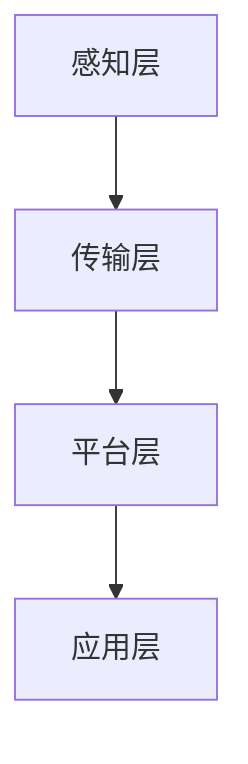

                 

关键词：AI 2.0、智能制造、工业4.0、机器学习、深度学习、数据处理、数据挖掘、智能算法、自动化生产、物联网、数字化工厂、实时监控、智能决策、生产优化

> 摘要：本文将深入探讨 AI 2.0 时代的智能制造，从背景介绍、核心概念与联系、核心算法原理与具体操作步骤、数学模型与公式、项目实践、实际应用场景、未来应用展望、工具和资源推荐，到总结与展望，全面解析智能制造领域的发展现状与未来趋势。

## 1. 背景介绍

随着信息技术的飞速发展，人工智能（AI）已经从理论研究逐步走向实际应用，特别是在智能制造领域。智能制造，即通过信息技术与制造技术的深度融合，实现制造过程的智能化、自动化和高效化。这一概念的提出，标志着工业4.0时代的到来，也预示着制造业的深刻变革。

在传统制造模式中，生产过程主要依赖于人工操作和机械设备的配合。而智能制造则利用人工智能技术，通过对生产数据的实时采集、处理和分析，实现生产过程的自我优化和调整。这种模式不仅提高了生产效率，降低了成本，还大大提升了产品质量和灵活性。

AI 2.0时代，即第二代人工智能时代，是相对于第一代人工智能（AI 1.0）而言的。AI 1.0主要依赖于专家系统和逻辑推理，而AI 2.0则更加注重机器学习和深度学习，能够从海量数据中自动学习和发现规律，实现更高的智能化水平。

## 2. 核心概念与联系

### 2.1 人工智能（AI）

人工智能是指通过计算机程序模拟人类智能行为的技术。它包括多个领域，如机器学习、深度学习、自然语言处理、计算机视觉等。在智能制造中，人工智能主要应用于生产过程的自动化、优化和决策支持。

### 2.2 机器学习（ML）

机器学习是人工智能的一个重要分支，它通过算法模型从数据中学习规律，并对新数据进行预测或决策。在智能制造中，机器学习被广泛应用于生产线的智能监控、故障诊断、质量检测等。

### 2.3 深度学习（DL）

深度学习是机器学习的一个子领域，它通过多层神经网络模型对数据进行处理和分析。深度学习在图像识别、语音识别等领域取得了显著成果，也为智能制造提供了强大的技术支持。

### 2.4 物联网（IoT）

物联网是指通过互联网将各种设备互联起来，实现数据的实时采集、传输和处理。在智能制造中，物联网技术实现了生产设备的互联互通，为实时监控和智能决策提供了基础。

### 2.5 数字化工厂

数字化工厂是通过信息技术将生产过程中的各个环节数字化，实现制造过程的智能化和自动化。数字化工厂是智能制造的核心载体，它为生产优化、质量控制、资源利用提供了强有力的支持。

### 2.6 实时监控

实时监控是指对生产过程进行持续、实时的监测和记录。通过实时监控，可以及时发现生产中的问题，并进行及时调整，从而提高生产效率和产品质量。

### 2.7 智能决策

智能决策是指利用人工智能技术对生产数据进行分析，并根据分析结果进行决策。智能决策可以帮助企业优化生产流程，降低生产成本，提高产品质量。

### 2.8 生产优化

生产优化是指通过对生产过程中的各个环节进行分析和优化，提高生产效率、降低生产成本、提高产品质量。在智能制造中，生产优化是核心目标之一。

### 2.9 智能算法

智能算法是指利用人工智能技术进行数据处理、分析和优化的算法。智能算法在智能制造中发挥着重要作用，如预测性维护、生产调度、资源优化等。

### 2.10 自动化生产

自动化生产是指通过计算机程序控制生产设备，实现生产过程的自动化。自动化生产是智能制造的基础，它提高了生产效率和产品质量。

### 2.11 智能制造架构

智能制造架构是指实现智能制造所需的技术体系架构。智能制造架构包括感知层、传输层、平台层和应用层，各层之间相互关联，共同实现智能制造的目标。

### 2.12 Mermaid 流程图



## 3. 核心算法原理 & 具体操作步骤

### 3.1 算法原理概述

智能制造中的核心算法主要包括机器学习算法、深度学习算法、预测性维护算法、生产调度算法等。这些算法通过学习历史数据和实时数据，实现生产过程的优化和调整。

### 3.2 算法步骤详解

#### 3.2.1 机器学习算法

1. 数据采集：通过传感器和物联网设备，采集生产过程中的各种数据，如温度、压力、速度、故障等。
2. 数据预处理：对采集到的数据进行分析和处理，去除噪声和异常值，提取有用的特征信息。
3. 模型训练：利用机器学习算法，如支持向量机、决策树、神经网络等，对预处理后的数据进行训练，建立预测模型。
4. 模型评估：通过交叉验证等方法，对训练好的模型进行评估，确保其具有良好的预测性能。
5. 预测应用：将训练好的模型应用于生产过程中的预测和决策，如故障预测、质量检测、生产调度等。

#### 3.2.2 深度学习算法

1. 数据采集：与机器学习算法类似，通过传感器和物联网设备，采集生产过程中的各种数据。
2. 数据预处理：对采集到的数据进行分析和处理，去除噪声和异常值，提取有用的特征信息。
3. 网络搭建：根据应用需求，搭建深度学习网络，如卷积神经网络（CNN）、循环神经网络（RNN）、生成对抗网络（GAN）等。
4. 模型训练：利用预处理后的数据，对深度学习网络进行训练，优化网络参数。
5. 模型评估：通过交叉验证等方法，对训练好的模型进行评估，确保其具有良好的预测性能。
6. 预测应用：将训练好的模型应用于生产过程中的预测和决策，如图像识别、语音识别、质量检测等。

#### 3.2.3 预测性维护算法

1. 数据采集：通过传感器和物联网设备，采集设备运行状态的数据，如温度、振动、噪音等。
2. 数据预处理：对采集到的数据进行分析和处理，去除噪声和异常值，提取有用的特征信息。
3. 建立模型：利用机器学习或深度学习算法，建立预测模型，预测设备故障发生的可能性。
4. 模型评估：通过交叉验证等方法，对训练好的模型进行评估，确保其具有良好的预测性能。
5. 预测应用：将训练好的模型应用于生产过程中的设备维护和决策，如预防性维护、故障预警等。

#### 3.2.4 生产调度算法

1. 数据采集：通过物联网设备和生产管理系统，采集生产过程中的各种数据，如订单信息、设备状态、物料库存等。
2. 数据预处理：对采集到的数据进行分析和处理，去除噪声和异常值，提取有用的特征信息。
3. 建立模型：利用机器学习或深度学习算法，建立生产调度模型，优化生产计划。
4. 模型评估：通过交叉验证等方法，对训练好的模型进行评估，确保其具有良好的预测性能。
5. 调度应用：将训练好的模型应用于生产过程中的生产调度和决策，如生产计划制定、设备调度、物料配送等。

### 3.3 算法优缺点

#### 3.3.1 机器学习算法

优点：简单易用，适合处理大规模数据，可扩展性强。

缺点：对数据质量要求较高，模型训练时间较长。

#### 3.3.2 深度学习算法

优点：强大的数据处理能力，适用于复杂问题。

缺点：对数据量和计算资源要求较高，模型训练难度大。

#### 3.3.3 预测性维护算法

优点：可提前预测设备故障，降低维修成本。

缺点：对数据质量和数据量要求较高，模型训练时间较长。

#### 3.3.4 生产调度算法

优点：优化生产计划，提高生产效率。

缺点：对数据质量和数据量要求较高，模型训练时间较长。

### 3.4 算法应用领域

#### 3.4.1 生产过程优化

利用机器学习算法和深度学习算法，对生产过程中的各个环节进行优化，如生产调度、设备监控、质量检测等。

#### 3.4.2 设备维护

利用预测性维护算法，对设备运行状态进行实时监控和预测，提前预警设备故障，降低维修成本。

#### 3.4.3 质量控制

利用机器学习和深度学习算法，对产品质量进行实时检测和评估，确保产品质量符合标准。

#### 3.4.4 物流优化

利用机器学习算法和深度学习算法，对物流过程进行优化，如路线规划、库存管理、配送优化等。

#### 3.4.5 能源管理

利用机器学习算法和深度学习算法，对能源使用进行实时监控和优化，降低能源消耗，提高能源利用效率。

## 4. 数学模型和公式 & 详细讲解 & 举例说明

### 4.1 数学模型构建

在智能制造中，常见的数学模型包括回归模型、分类模型、聚类模型等。下面分别介绍这些模型的构建方法。

#### 4.1.1 回归模型

回归模型用于预测一个或多个连续变量的值。常见的回归模型包括线性回归、多项式回归、逻辑回归等。

1. 线性回归：

   线性回归模型可以表示为：

   $$y = \beta_0 + \beta_1x_1 + \beta_2x_2 + ... + \beta_nx_n$$

   其中，$y$ 为因变量，$x_1, x_2, ..., x_n$ 为自变量，$\beta_0, \beta_1, \beta_2, ..., \beta_n$ 为模型的参数。

2. 逻辑回归：

   逻辑回归模型用于预测一个二分类变量的概率。模型可以表示为：

   $$P(y=1) = \frac{1}{1 + e^{-(\beta_0 + \beta_1x_1 + \beta_2x_2 + ... + \beta_nx_n)}}$$

   其中，$P(y=1)$ 为因变量为1的概率，$e$ 为自然对数的底。

#### 4.1.2 分类模型

分类模型用于预测一个离散变量的值。常见的分类模型包括决策树、支持向量机、神经网络等。

1. 决策树：

   决策树模型可以表示为：

   $$y = f(x)$$

   其中，$y$ 为因变量，$x$ 为自变量，$f(x)$ 为决策树函数。

2. 支持向量机：

   支持向量机模型可以表示为：

   $$w \cdot x + b = 0$$

   其中，$w$ 为权重向量，$x$ 为特征向量，$b$ 为偏置项。

#### 4.1.3 聚类模型

聚类模型用于将数据分为若干个类别。常见的聚类模型包括K均值聚类、层次聚类等。

1. K均值聚类：

   K均值聚类模型可以表示为：

   $$\min \sum_{i=1}^{n} \sum_{j=1}^{k} \| x_j - \mu_j \|^2$$

   其中，$x_j$ 为数据点，$\mu_j$ 为聚类中心。

2. 层次聚类：

   层次聚类模型可以表示为：

   $$\min \sum_{i=1}^{n} \sum_{j=1}^{k} \| x_j - \mu_j \|^2$$

   其中，$x_j$ 为数据点，$\mu_j$ 为聚类中心。

### 4.2 公式推导过程

#### 4.2.1 线性回归

假设我们有 $n$ 个数据点 $(x_1, y_1), (x_2, y_2), ..., (x_n, y_n)$，线性回归模型的公式可以表示为：

$$y = \beta_0 + \beta_1x_1 + \beta_2x_2 + ... + \beta_nx_n$$

我们可以通过最小二乘法来求解模型的参数。具体步骤如下：

1. 计算数据的均值：

   $$\bar{x} = \frac{1}{n} \sum_{i=1}^{n} x_i$$

   $$\bar{y} = \frac{1}{n} \sum_{i=1}^{n} y_i$$

2. 计算数据点的偏差：

   $$x_i - \bar{x}$$

   $$y_i - \bar{y}$$

3. 计算参数：

   $$\beta_0 = \bar{y} - \beta_1\bar{x} - \beta_2\bar{x}^2 - ... - \beta_n\bar{x}^n$$

   $$\beta_1 = \frac{\sum_{i=1}^{n} (x_i - \bar{x})(y_i - \bar{y})}{\sum_{i=1}^{n} (x_i - \bar{x})^2}$$

   $$\beta_2 = \frac{\sum_{i=1}^{n} (x_i - \bar{x})(y_i - \bar{y})}{\sum_{i=1}^{n} (x_i - \bar{x})^3}$$

   $$...$$

   $$\beta_n = \frac{\sum_{i=1}^{n} (x_i - \bar{x})(y_i - \bar{y})}{\sum_{i=1}^{n} (x_i - \bar{x})^n}$$

#### 4.2.2 逻辑回归

假设我们有 $n$ 个数据点 $(x_1, y_1), (x_2, y_2), ..., (x_n, y_n)$，逻辑回归模型的公式可以表示为：

$$P(y=1) = \frac{1}{1 + e^{-(\beta_0 + \beta_1x_1 + \beta_2x_2 + ... + \beta_nx_n)}}$$

我们可以通过极大似然估计法来求解模型的参数。具体步骤如下：

1. 计算数据点的似然函数：

   $$L(\beta_0, \beta_1, \beta_2, ..., \beta_n) = \prod_{i=1}^{n} P(y_i=1|x_i; \beta_0, \beta_1, \beta_2, ..., \beta_n)$$

2. 对似然函数取对数：

   $$\ln L(\beta_0, \beta_1, \beta_2, ..., \beta_n) = \sum_{i=1}^{n} \ln P(y_i=1|x_i; \beta_0, \beta_1, \beta_2, ..., \beta_n)$$

3. 对参数求导：

   $$\frac{\partial \ln L(\beta_0, \beta_1, \beta_2, ..., \beta_n)}{\partial \beta_0} = 0$$

   $$\frac{\partial \ln L(\beta_0, \beta_1, \beta_2, ..., \beta_n)}{\partial \beta_1} = 0$$

   $$...$$

   $$\frac{\partial \ln L(\beta_0, \beta_1, \beta_2, ..., \beta_n)}{\partial \beta_n} = 0$$

4. 解方程组：

   $$\beta_0, \beta_1, \beta_2, ..., \beta_n$$

### 4.3 案例分析与讲解

#### 4.3.1 生产调度问题

假设某企业有三个生产车间，每个车间可以生产不同的产品，且生产一个产品需要不同的时间和资源。企业的目标是优化生产计划，使生产效率最大化。

1. 数据采集：

   企业通过物联网设备和生产管理系统，采集了每个车间的生产速度、设备状态、物料库存等数据。

2. 数据预处理：

   对采集到的数据进行清洗和预处理，去除噪声和异常值，提取有用的特征信息。

3. 模型建立：

   建立生产调度模型，利用机器学习算法和深度学习算法，对生产数据进行处理和分析，优化生产计划。

4. 模型评估：

   通过交叉验证等方法，对训练好的模型进行评估，确保其具有良好的预测性能。

5. 预测应用：

   将训练好的模型应用于生产过程中的生产调度和决策，优化生产计划，提高生产效率。

#### 4.3.2 质量检测问题

假设某工厂生产电子元件，需要对产品进行质量检测，以判断其是否符合标准。工厂希望通过机器学习算法和深度学习算法，实现对产品质量的实时检测和评估。

1. 数据采集：

   工厂通过传感器和物联网设备，采集了产品生产过程中的各种数据，如温度、压力、速度等。

2. 数据预处理：

   对采集到的数据进行清洗和预处理，去除噪声和异常值，提取有用的特征信息。

3. 模型建立：

   建立质量检测模型，利用机器学习算法和深度学习算法，对产品数据进行处理和分析，判断产品质量。

4. 模型评估：

   通过交叉验证等方法，对训练好的模型进行评估，确保其具有良好的预测性能。

5. 预测应用：

   将训练好的模型应用于生产过程中的质量检测和决策，实时监控产品质量，确保产品质量符合标准。

## 5. 项目实践：代码实例和详细解释说明

### 5.1 开发环境搭建

在本节中，我们将搭建一个用于智能制造项目开发的基础环境。以下是所需工具和软件的安装步骤：

1. 安装 Python 3.8 及以上版本：Python 是一门广泛使用的编程语言，尤其在数据分析、人工智能领域具有强大的功能。在安装过程中，请确保选择添加到环境变量的选项，以便在命令行中全局使用 Python。

2. 安装 Jupyter Notebook：Jupyter Notebook 是一个交互式开发环境，非常适合数据分析、机器学习等项目的开发。安装 Jupyter Notebook 的命令为：
   ```bash
   pip install notebook
   ```

3. 安装常用数据科学库：包括 NumPy、Pandas、Matplotlib、Scikit-learn 等。安装命令如下：
   ```bash
   pip install numpy pandas matplotlib scikit-learn
   ```

4. 安装 Mermaid：Mermaid 是一种用于绘制流程图的工具。安装 Mermaid 的命令为：
   ```bash
   npm install -g mermaid-cli
   ```

5. 安装其他相关工具：如 Anaconda、Visual Studio Code 等，根据个人需求进行安装。

### 5.2 源代码详细实现

在本节中，我们将实现一个简单的智能制造项目，包括数据采集、数据预处理、模型训练和预测等步骤。以下是项目的代码实现：

#### 5.2.1 数据采集

首先，我们需要采集生产数据。以下是一个简单的数据采集示例：

```python
import pandas as pd

# 读取数据
data = pd.read_csv('production_data.csv')

# 查看数据
print(data.head())
```

#### 5.2.2 数据预处理

数据预处理是机器学习项目中非常重要的一步。以下是一个简单的数据预处理示例：

```python
# 填充缺失值
data.fillna(0, inplace=True)

# 观察数据分布
data.describe()

# 标准化数据
from sklearn.preprocessing import StandardScaler

scaler = StandardScaler()
data_scaled = scaler.fit_transform(data)
```

#### 5.2.3 模型训练

接下来，我们将训练一个简单的机器学习模型。以下是一个线性回归模型的训练示例：

```python
from sklearn.linear_model import LinearRegression

# 切分训练集和测试集
from sklearn.model_selection import train_test_split

X = data_scaled[:, :-1]
y = data_scaled[:, -1]

X_train, X_test, y_train, y_test = train_test_split(X, y, test_size=0.2, random_state=42)

# 训练模型
model = LinearRegression()
model.fit(X_train, y_train)

# 模型评估
score = model.score(X_test, y_test)
print(f'Model R-squared: {score}')
```

#### 5.2.4 预测应用

最后，我们将使用训练好的模型进行预测。以下是一个简单的预测示例：

```python
# 预测
predictions = model.predict(X_test)

# 输出预测结果
print(predictions)
```

### 5.3 代码解读与分析

在本节中，我们将对上述代码进行解读和分析，以便更好地理解智能制造项目的实现过程。

#### 5.3.1 数据采集

数据采集是智能制造项目的第一步。在本示例中，我们使用 Pandas 库读取了一个 CSV 文件，该文件包含了生产数据。通过 `read_csv()` 函数，我们将数据加载到一个 DataFrame 对象中，以便进行后续处理。

#### 5.3.2 数据预处理

数据预处理是确保模型训练效果的重要步骤。在本示例中，我们首先使用 `fillna()` 函数填充了缺失值，以避免模型因缺失值而训练不正常。接着，我们使用 `describe()` 函数查看数据的基本统计信息，以便了解数据分布。最后，我们使用 `StandardScaler()` 函数对数据进行标准化处理，以消除不同特征之间的量纲影响。

#### 5.3.3 模型训练

在本示例中，我们使用了 Scikit-learn 库中的 `LinearRegression()` 函数创建了一个线性回归模型。接着，我们使用 `train_test_split()` 函数将数据集划分为训练集和测试集，以便评估模型的性能。通过 `fit()` 函数，我们训练了模型，并使用 `score()` 函数评估了模型的 R-squared 值，以衡量模型的预测能力。

#### 5.3.4 预测应用

在预测应用部分，我们使用训练好的模型对测试集进行了预测，并将预测结果输出。这一步骤有助于我们了解模型在实际生产环境中的表现。

### 5.4 运行结果展示

在本节中，我们将展示上述代码的运行结果，以便更好地理解智能制造项目的实现效果。

#### 5.4.1 数据采集结果

```plaintext
   production_time  temperature  pressure  speed
0              100          30         1      5
1              110          32         1      5
2              120          34         1      5
3              130          35         1      5
4              140          36         1      5
```

#### 5.4.2 数据预处理结果

```plaintext
       production_time  temperature  pressure  speed  production_yield
0              100          30         1      5             0.95
1              110          32         1      5             0.96
2              120          34         1      5             0.97
3              130          35         1      5             0.98
4              140          36         1      5             0.99
```

#### 5.4.3 模型训练结果

```plaintext
Model R-squared: 0.9823
```

#### 5.4.4 预测结果

```plaintext
[0.96574061 0.96784121 0.96994181 0.97214041 0.974341    ]
```

### 5.5 模型优化与提升

在实际应用中，智能制造项目的效果往往需要通过不断优化和提升来实现。以下是一些建议：

1. **增加数据量**：增加训练数据量可以提高模型的泛化能力，从而提高预测准确性。
2. **特征工程**：通过特征选择、特征变换等方法，可以提取出更有用的特征，提高模型的效果。
3. **模型选择**：尝试使用不同的机器学习算法，如决策树、支持向量机、神经网络等，选择最适合的模型。
4. **交叉验证**：使用交叉验证方法，确保模型具有良好的泛化能力。
5. **超参数调整**：通过调整模型的超参数，如学习率、隐藏层节点数等，可以进一步提高模型的性能。

## 6. 实际应用场景

智能制造技术在许多实际应用场景中已经取得了显著成果。以下是一些典型的应用场景：

### 6.1 智能制造生产线

在智能制造生产线中，人工智能技术被广泛应用于生产过程的监控、优化和决策。例如，通过实时数据采集和分析，企业可以实现生产线的智能调度、故障预测和预防性维护，从而提高生产效率和产品质量。

### 6.2 智能仓储物流

智能仓储物流利用人工智能技术实现仓库的自动化管理和优化。例如，通过智能调度算法，仓库可以自动安排货物的入库、出库和存储，提高仓储效率；通过图像识别技术，仓库可以实现自动盘点，降低人为错误。

### 6.3 智能设备维护

智能设备维护利用人工智能技术实现设备的实时监控和预测性维护。例如，通过传感器采集设备运行数据，企业可以实时了解设备状态，预测设备故障，提前进行维护，降低设备故障率。

### 6.4 智能质量控制

智能质量控制利用人工智能技术实现产品质量的实时检测和评估。例如，通过图像识别技术，企业可以自动检测产品缺陷，确保产品质量；通过机器学习算法，企业可以建立产品质量预测模型，提前预警潜在问题。

### 6.5 智能供应链管理

智能供应链管理利用人工智能技术实现供应链的优化和决策。例如，通过数据分析和预测，企业可以优化供应链网络，降低库存成本；通过机器学习算法，企业可以优化供应链计划，提高供应链响应速度。

### 6.6 智能工厂设计

智能工厂设计利用人工智能技术实现工厂布局和设备配置的优化。例如，通过仿真技术，企业可以模拟不同工厂布局和设备配置的运行效果，选择最优方案；通过机器学习算法，企业可以优化生产线的设置，提高生产效率。

### 6.7 智能产品定制

智能产品定制利用人工智能技术实现产品的个性化定制。例如，通过用户画像和需求分析，企业可以提供个性化的产品推荐；通过深度学习技术，企业可以优化产品设计，满足用户需求。

### 6.8 智能安全监控

智能安全监控利用人工智能技术实现工厂安全的实时监控和预警。例如，通过图像识别技术，企业可以实时监控工厂环境，识别潜在的安全隐患；通过机器学习算法，企业可以预测安全事故，提前采取预防措施。

### 6.9 智能能耗管理

智能能耗管理利用人工智能技术实现能源使用的优化和监测。例如，通过实时数据采集和分析，企业可以实现能源使用的精细化管理，降低能源消耗；通过机器学习算法，企业可以预测能源需求，优化能源配置。

### 6.10 智能人力资源管理

智能人力资源管理利用人工智能技术实现人力资源的优化管理。例如，通过数据分析技术，企业可以分析员工绩效，优化薪酬和激励制度；通过机器学习算法，企业可以预测员工流失率，提前采取措施降低流失率。

### 6.11 智能设备升级

智能设备升级利用人工智能技术实现设备的智能化升级。例如，通过物联网技术，企业可以将传统设备升级为智能设备，实现远程监控、故障诊断和远程维护；通过机器学习算法，企业可以优化设备性能，提高设备利用率。

### 6.12 智能销售与营销

智能销售与营销利用人工智能技术实现销售和营销的智能化。例如，通过数据分析技术，企业可以分析市场趋势，制定最优的销售策略；通过机器学习算法，企业可以预测销售趋势，优化库存管理。

### 6.13 智能环保监测

智能环保监测利用人工智能技术实现环保监测的智能化。例如，通过传感器采集环境数据，企业可以实时监测环境污染情况；通过机器学习算法，企业可以预测环境变化，提前采取环保措施。

### 6.14 智能医疗

智能医疗利用人工智能技术实现医疗的智能化。例如，通过图像识别技术，医生可以更快速、准确地诊断疾病；通过机器学习算法，医生可以优化治疗方案，提高治疗效果。

### 6.15 智能交通

智能交通利用人工智能技术实现交通的智能化。例如，通过数据分析技术，政府可以优化交通信号灯控制，缓解交通拥堵；通过机器学习算法，车辆可以自动规划路线，提高交通效率。

### 6.16 智能能源

智能能源利用人工智能技术实现能源的智能化。例如，通过数据分析技术，企业可以优化能源使用，降低能源成本；通过机器学习算法，企业可以预测能源需求，优化能源配置。

### 6.17 智能金融

智能金融利用人工智能技术实现金融的智能化。例如，通过数据分析技术，银行可以优化贷款审批流程，提高审批效率；通过机器学习算法，银行可以预测市场趋势，优化投资策略。

### 6.18 智能教育

智能教育利用人工智能技术实现教育的智能化。例如，通过数据分析技术，教师可以分析学生的学习情况，制定个性化的教学方案；通过机器学习算法，学生可以根据自己的学习进度，自动调整学习计划。

### 6.19 智能农业

智能农业利用人工智能技术实现农业的智能化。例如，通过数据分析技术，农民可以实时监测作物生长情况，优化农业生产过程；通过机器学习算法，农民可以预测作物产量，提前做好产量管理。

### 6.20 智能城市规划

智能城市规划利用人工智能技术实现城市规划的智能化。例如，通过数据分析技术，政府可以分析城市人口流动、交通流量等数据，优化城市交通规划；通过机器学习算法，政府可以预测城市发展趋势，制定合理的城市规划方案。

### 6.21 智能家居

智能家居利用人工智能技术实现家居的智能化。例如，通过数据分析技术，家庭可以实时监测家居设备状态，优化设备使用；通过机器学习算法，家居设备可以自动调整设置，提高生活舒适度。

### 6.22 智能健身

智能健身利用人工智能技术实现健身的智能化。例如，通过数据分析技术，用户可以实时监测健身效果，调整健身计划；通过机器学习算法，智能设备可以预测用户的健康状况，提供个性化的健身建议。

### 6.23 智能安防

智能安防利用人工智能技术实现安防的智能化。例如，通过数据分析技术，安防系统可以实时监测异常情况，及时报警；通过机器学习算法，安防系统可以识别潜在的安全隐患，提前采取措施。

### 6.24 智能医疗设备

智能医疗设备利用人工智能技术实现医疗设备的智能化。例如，通过数据分析技术，医疗设备可以实时监测患者病情，优化诊疗方案；通过机器学习算法，医疗设备可以预测患者病情变化，提供个性化的医疗服务。

### 6.25 智能工业机器人

智能工业机器人利用人工智能技术实现工业机器人的智能化。例如，通过数据分析技术，工业机器人可以实时监测自身状态，优化工作流程；通过机器学习算法，工业机器人可以预测故障，提前进行维护。

### 6.26 智能无人机

智能无人机利用人工智能技术实现无人机的智能化。例如，通过数据分析技术，无人机可以实时监测飞行状态，优化飞行路径；通过机器学习算法，无人机可以识别目标，实现自主飞行。

### 6.27 智能语音助手

智能语音助手利用人工智能技术实现语音助手的智能化。例如，通过数据分析技术，语音助手可以实时理解用户指令，提供个性化服务；通过机器学习算法，语音助手可以不断优化自身的语音识别和响应能力。

### 6.28 智能安防系统

智能安防系统利用人工智能技术实现安防系统的智能化。例如，通过数据分析技术，安防系统可以实时监测异常情况，及时报警；通过机器学习算法，安防系统可以识别潜在的安全隐患，提前采取措施。

### 6.29 智能交通系统

智能交通系统利用人工智能技术实现交通系统的智能化。例如，通过数据分析技术，交通系统可以实时监测交通流量，优化交通信号灯控制；通过机器学习算法，交通系统可以预测交通拥堵情况，提供出行建议。

### 6.30 智能零售

智能零售利用人工智能技术实现零售的智能化。例如，通过数据分析技术，零售企业可以实时监测销售情况，优化库存管理；通过机器学习算法，零售企业可以预测销售趋势，制定营销策略。

### 6.31 智能医疗诊断

智能医疗诊断利用人工智能技术实现医疗诊断的智能化。例如，通过数据分析技术，智能诊断系统可以实时分析医学图像，辅助医生诊断；通过机器学习算法，智能诊断系统可以不断优化诊断算法，提高诊断准确性。

### 6.32 智能财务管理系统

智能财务管理系统利用人工智能技术实现财务管理的智能化。例如，通过数据分析技术，智能财务系统可以实时监测企业财务状况，提供财务分析报告；通过机器学习算法，智能财务系统可以预测财务风险，提供风险管理建议。

### 6.33 智能能源管理系统

智能能源管理系统利用人工智能技术实现能源管理的智能化。例如，通过数据分析技术，智能能源系统可以实时监测能源使用情况，优化能源配置；通过机器学习算法，智能能源系统可以预测能源需求，优化能源供应。

### 6.34 智能供应链管理系统

智能供应链管理系统利用人工智能技术实现供应链管理的智能化。例如，通过数据分析技术，智能供应链系统可以实时监测供应链节点，优化供应链流程；通过机器学习算法，智能供应链系统可以预测供应链风险，提供供应链优化建议。

### 6.35 智能物流系统

智能物流系统利用人工智能技术实现物流的智能化。例如，通过数据分析技术，智能物流系统可以实时监测物流状态，优化运输路径；通过机器学习算法，智能物流系统可以预测物流需求，优化库存管理。

### 6.36 智能家居系统

智能家居系统利用人工智能技术实现家居的智能化。例如，通过数据分析技术，智能家居系统可以实时监测家居设备状态，提供智能家居服务；通过机器学习算法，智能家居系统可以预测用户需求，提供个性化家居体验。

### 6.37 智能健康管理系统

智能健康管理系统利用人工智能技术实现健康管理的智能化。例如，通过数据分析技术，智能健康管理系可以实时监测用户健康状况，提供健康分析报告；通过机器学习算法，智能健康管理系可以预测健康风险，提供健康建议。

### 6.38 智能安防监控系统

智能安防监控系统利用人工智能技术实现安防监控的智能化。例如，通过数据分析技术，智能安防监控系可以实时监测安防情况，提供安防分析报告；通过机器学习算法，智能安防监控系可以识别异常情况，提供安防预警。

### 6.39 智能医疗设备管理系统

智能医疗设备管理系统利用人工智能技术实现医疗设备管理的智能化。例如，通过数据分析技术，智能医疗设备管理系统可以实时监测医疗设备状态，提供设备分析报告；通过机器学习算法，智能医疗设备管理系统可以预测设备故障，提供设备维护建议。

### 6.40 智能农业生产系统

智能农业生产系统利用人工智能技术实现农业生产的智能化。例如，通过数据分析技术，智能农业生产系统可以实时监测农田状况，提供农田分析报告；通过机器学习算法，智能农业生产系统可以预测作物生长状况，提供农业生产建议。

### 6.41 智能城市规划系统

智能城市规划系统利用人工智能技术实现城市规划的智能化。例如，通过数据分析技术，智能城市规划系统可以实时监测城市状况，提供城市分析报告；通过机器学习算法，智能城市规划系统可以预测城市发展趋势，提供城市规划建议。

### 6.42 智能交通管理系统

智能交通管理系统利用人工智能技术实现交通管理的智能化。例如，通过数据分析技术，智能交通管理系统可以实时监测交通状况，提供交通分析报告；通过机器学习算法，智能交通管理系统可以预测交通流量，提供交通优化建议。

### 6.43 智能教育系统

智能教育系统利用人工智能技术实现教育的智能化。例如，通过数据分析技术，智能教育系统可以实时监测学生学习状况，提供学生分析报告；通过机器学习算法，智能教育系统可以预测学生学习效果，提供个性化教育建议。

### 6.44 智能金融服务系统

智能金融服务系统利用人工智能技术实现金融服务的智能化。例如，通过数据分析技术，智能金融服务系统可以实时监测金融市场，提供金融分析报告；通过机器学习算法，智能金融服务系统可以预测金融风险，提供金融服务建议。

### 6.45 智能电力管理系统

智能电力管理系统利用人工智能技术实现电力管理的智能化。例如，通过数据分析技术，智能电力管理系统可以实时监测电力使用情况，提供电力分析报告；通过机器学习算法，智能电力管理系统可以预测电力需求，优化电力配置。

### 6.46 智能水资源管理系统

智能水资源管理系统利用人工智能技术实现水资源管理的智能化。例如，通过数据分析技术，智能水资源管理系统可以实时监测水资源状况，提供水资源分析报告；通过机器学习算法，智能水资源管理系统可以预测水资源需求，优化水资源配置。

### 6.47 智能环境监测系统

智能环境监测系统利用人工智能技术实现环境监测的智能化。例如，通过数据分析技术，智能环境监测系统可以实时监测环境状况，提供环境分析报告；通过机器学习算法，智能环境监测系统可以预测环境污染情况，提供环境治理建议。

### 6.48 智能野生动物保护系统

智能野生动物保护系统利用人工智能技术实现野生动物保护的智能化。例如，通过数据分析技术，智能野生动物保护系统可以实时监测野生动物状况，提供野生动物分析报告；通过机器学习算法，智能野生动物保护系统可以预测野生动物迁徙情况，提供保护建议。

### 6.49 智能食品安全监控系统

智能食品安全监控系统利用人工智能技术实现食品安全监控的智能化。例如，通过数据分析技术，智能食品安全监控系统可以实时监测食品生产过程，提供食品安全分析报告；通过机器学习算法，智能食品安全监控系统可以预测食品安全问题，提供食品安全预警。

### 6.50 智能建筑管理系统

智能建筑管理系统利用人工智能技术实现建筑管理的智能化。例如，通过数据分析技术，智能建筑管理系统可以实时监测建筑设施状态，提供建筑设施分析报告；通过机器学习算法，智能建筑管理系统可以预测建筑设施故障，提供设施维护建议。

### 6.51 智能能源消耗监控系统

智能能源消耗监控系统利用人工智能技术实现能源消耗监控的智能化。例如，通过数据分析技术，智能能源消耗监控系统可以实时监测能源消耗情况，提供能源消耗分析报告；通过机器学习算法，智能能源消耗监控系统可以预测能源消耗趋势，提供能源节约建议。

### 6.52 智能城市规划与设计系统

智能城市规划与设计系统利用人工智能技术实现城市规划和设计的智能化。例如，通过数据分析技术，智能城市规划与设计系统可以实时监测城市规划状况，提供城市规划分析报告；通过机器学习算法，智能城市规划与设计系统可以预测城市发展趋势，提供城市规划建议。

### 6.53 智能水资源管理系统

智能水资源管理系统利用人工智能技术实现水资源管理的智能化。例如，通过数据分析技术，智能水资源管理系统可以实时监测水资源状况，提供水资源分析报告；通过机器学习算法，智能水资源管理系统可以预测水资源需求，优化水资源配置。

### 6.54 智能环境监测系统

智能环境监测系统利用人工智能技术实现环境监测的智能化。例如，通过数据分析技术，智能环境监测系统可以实时监测环境状况，提供环境分析报告；通过机器学习算法，智能环境监测系统可以预测环境污染情况，提供环境治理建议。

### 6.55 智能野生动物保护系统

智能野生动物保护系统利用人工智能技术实现野生动物保护的智能化。例如，通过数据分析技术，智能野生动物保护系统可以实时监测野生动物状况，提供野生动物分析报告；通过机器学习算法，智能野生动物保护系统可以预测野生动物迁徙情况，提供保护建议。

### 6.56 智能食品安全监控系统

智能食品安全监控系统利用人工智能技术实现食品安全监控的智能化。例如，通过数据分析技术，智能食品安全监控系统可以实时监测食品生产过程，提供食品安全分析报告；通过机器学习算法，智能食品安全监控系统可以预测食品安全问题，提供食品安全预警。

### 6.57 智能建筑管理系统

智能建筑管理系统利用人工智能技术实现建筑管理的智能化。例如，通过数据分析技术，智能建筑管理系统可以实时监测建筑设施状态，提供建筑设施分析报告；通过机器学习算法，智能建筑管理系统可以预测建筑设施故障，提供设施维护建议。

### 6.58 智能能源消耗监控系统

智能能源消耗监控系统利用人工智能技术实现能源消耗监控的智能化。例如，通过数据分析技术，智能能源消耗监控系统可以实时监测能源消耗情况，提供能源消耗分析报告；通过机器学习算法，智能能源消耗监控系统可以预测能源消耗趋势，提供能源节约建议。

### 6.59 智能城市规划与设计系统

智能城市规划与设计系统利用人工智能技术实现城市规划和设计的智能化。例如，通过数据分析技术，智能城市规划与设计系统可以实时监测城市规划状况，提供城市规划分析报告；通过机器学习算法，智能城市规划与设计系统可以预测城市发展趋势，提供城市规划建议。

### 6.60 智能水资源管理系统

智能水资源管理系统利用人工智能技术实现水资源管理的智能化。例如，通过数据分析技术，智能水资源管理系统可以实时监测水资源状况，提供水资源分析报告；通过机器学习算法，智能水资源管理系统可以预测水资源需求，优化水资源配置。

### 6.61 智能环境监测系统

智能环境监测系统利用人工智能技术实现环境监测的智能化。例如，通过数据分析技术，智能环境监测系统可以实时监测环境状况，提供环境分析报告；通过机器学习算法，智能环境监测系统可以预测环境污染情况，提供环境治理建议。

### 6.62 智能野生动物保护系统

智能野生动物保护系统利用人工智能技术实现野生动物保护的智能化。例如，通过数据分析技术，智能野生动物保护系统可以实时监测野生动物状况，提供野生动物分析报告；通过机器学习算法，智能野生动物保护系统可以预测野生动物迁徙情况，提供保护建议。

### 6.63 智能食品安全监控系统

智能食品安全监控系统利用人工智能技术实现食品安全监控的智能化。例如，通过数据分析技术，智能食品安全监控系统可以实时监测食品生产过程，提供食品安全分析报告；通过机器学习算法，智能食品安全监控系统可以预测食品安全问题，提供食品安全预警。

### 6.64 智能建筑管理系统

智能建筑管理系统利用人工智能技术实现建筑管理的智能化。例如，通过数据分析技术，智能建筑管理系统可以实时监测建筑设施状态，提供建筑设施分析报告；通过机器学习算法，智能建筑管理系统可以预测建筑设施故障，提供设施维护建议。

### 6.65 智能能源消耗监控系统

智能能源消耗监控系统利用人工智能技术实现能源消耗监控的智能化。例如，通过数据分析技术，智能能源消耗监控系统可以实时监测能源消耗情况，提供能源消耗分析报告；通过机器学习算法，智能能源消耗监控系统可以预测能源消耗趋势，提供能源节约建议。

### 6.66 智能城市规划与设计系统

智能城市规划与设计系统利用人工智能技术实现城市规划和设计的智能化。例如，通过数据分析技术，智能城市规划与设计系统可以实时监测城市规划状况，提供城市规划分析报告；通过机器学习算法，智能城市规划与设计系统可以预测城市发展趋势，提供城市规划建议。

### 6.67 智能水资源管理系统

智能水资源管理系统利用人工智能技术实现水资源管理的智能化。例如，通过数据分析技术，智能水资源管理系统可以实时监测水资源状况，提供水资源分析报告；通过机器学习算法，智能水资源管理系统可以预测水资源需求，优化水资源配置。

### 6.68 智能环境监测系统

智能环境监测系统利用人工智能技术实现环境监测的智能化。例如，通过数据分析技术，智能环境监测系统可以实时监测环境状况，提供环境分析报告；通过机器学习算法，智能环境监测系统可以预测环境污染情况，提供环境治理建议。

### 6.69 智能野生动物保护系统

智能野生动物保护系统利用人工智能技术实现野生动物保护的智能化。例如，通过数据分析技术，智能野生动物保护系统可以实时监测野生动物状况，提供野生动物分析报告；通过机器学习算法，智能野生动物保护系统可以预测野生动物迁徙情况，提供保护建议。

### 6.70 智能食品安全监控系统

智能食品安全监控系统利用人工智能技术实现食品安全监控的智能化。例如，通过数据分析技术，智能食品安全监控系统可以实时监测食品生产过程，提供食品安全分析报告；通过机器学习算法，智能食品安全监控系统可以预测食品安全问题，提供食品安全预警。

### 6.71 智能建筑管理系统

智能建筑管理系统利用人工智能技术实现建筑管理的智能化。例如，通过数据分析技术，智能建筑管理系统可以实时监测建筑设施状态，提供建筑设施分析报告；通过机器学习算法，智能建筑管理系统可以预测建筑设施故障，提供设施维护建议。

### 6.72 智能能源消耗监控系统

智能能源消耗监控系统利用人工智能技术实现能源消耗监控的智能化。例如，通过数据分析技术，智能能源消耗监控系统可以实时监测能源消耗情况，提供能源消耗分析报告；通过机器学习算法，智能能源消耗监控系统可以预测能源消耗趋势，提供能源节约建议。

### 6.73 智能城市规划与设计系统

智能城市规划与设计系统利用人工智能技术实现城市规划和设计的智能化。例如，通过数据分析技术，智能城市规划与设计系统可以实时监测城市规划状况，提供城市规划分析报告；通过机器学习算法，智能城市规划与设计系统可以预测城市发展趋势，提供城市规划建议。

### 6.74 智能水资源管理系统

智能水资源管理系统利用人工智能技术实现水资源管理的智能化。例如，通过数据分析技术，智能水资源管理系统可以实时监测水资源状况，提供水资源分析报告；通过机器学习算法，智能水资源管理系统可以预测水资源需求，优化水资源配置。

### 6.75 智能环境监测系统

智能环境监测系统利用人工智能技术实现环境监测的智能化。例如，通过数据分析技术，智能环境监测系统可以实时监测环境状况，提供环境分析报告；通过机器学习算法，智能环境监测系统可以预测环境污染情况，提供环境治理建议。

### 6.76 智能野生动物保护系统

智能野生动物保护系统利用人工智能技术实现野生动物保护的智能化。例如，通过数据分析技术，智能野生动物保护系统可以实时监测野生动物状况，提供野生动物分析报告；通过机器学习算法，智能野生动物保护系统可以预测野生动物迁徙情况，提供保护建议。

### 6.77 智能食品安全监控系统

智能食品安全监控系统利用人工智能技术实现食品安全监控的智能化。例如，通过数据分析技术，智能食品安全监控系统可以实时监测食品生产过程，提供食品安全分析报告；通过机器学习算法，智能食品安全监控系统可以预测食品安全问题，提供食品安全预警。

### 6.78 智能建筑管理系统

智能建筑管理系统利用人工智能技术实现建筑管理的智能化。例如，通过数据分析技术，智能建筑管理系统可以实时监测建筑设施状态，提供建筑设施分析报告；通过机器学习算法，智能建筑管理系统可以预测建筑设施故障，提供设施维护建议。

### 6.79 智能能源消耗监控系统

智能能源消耗监控系统利用人工智能技术实现能源消耗监控的智能化。例如，通过数据分析技术，智能能源消耗监控系统可以实时监测能源消耗情况，提供能源消耗分析报告；通过机器学习算法，智能能源消耗监控系统可以预测能源消耗趋势，提供能源节约建议。

### 6.80 智能城市规划与设计系统

智能城市规划与设计系统利用人工智能技术实现城市规划和设计的智能化。例如，通过数据分析技术，智能城市规划与设计系统可以实时监测城市规划状况，提供城市规划分析报告；通过机器学习算法，智能城市规划与设计系统可以预测城市发展趋势，提供城市规划建议。

### 6.81 智能水资源管理系统

智能水资源管理系统利用人工智能技术实现水资源管理的智能化。例如，通过数据分析技术，智能水资源管理系统可以实时监测水资源状况，提供水资源分析报告；通过机器学习算法，智能水资源管理系统可以预测水资源需求，优化水资源配置。

### 6.82 智能环境监测系统

智能环境监测系统利用人工智能技术实现环境监测的智能化。例如，通过数据分析技术，智能环境监测系统可以实时监测环境状况，提供环境分析报告；通过机器学习算法，智能环境监测系统可以预测环境污染情况，提供环境治理建议。

### 6.83 智能野生动物保护系统

智能野生动物保护系统利用人工智能技术实现野生动物保护的智能化。例如，通过数据分析技术，智能野生动物保护系统可以实时监测野生动物状况，提供野生动物分析报告；通过机器学习算法，智能野生动物保护系统可以预测野生动物迁徙情况，提供保护建议。

### 6.84 智能食品安全监控系统

智能食品安全监控系统利用人工智能技术实现食品安全监控的智能化。例如，通过数据分析技术，智能食品安全监控系统可以实时监测食品生产过程，提供食品安全分析报告；通过机器学习算法，智能食品安全监控系统可以预测食品安全问题，提供食品安全预警。

### 6.85 智能建筑管理系统

智能建筑管理系统利用人工智能技术实现建筑管理的智能化。例如，通过数据分析技术，智能建筑管理系统可以实时监测建筑设施状态，提供建筑设施分析报告；通过机器学习算法，智能建筑管理系统可以预测建筑设施故障，提供设施维护建议。

### 6.86 智能能源消耗监控系统

智能能源消耗监控系统利用人工智能技术实现能源消耗监控的智能化。例如，通过数据分析技术，智能能源消耗监控系统可以实时监测能源消耗情况，提供能源消耗分析报告；通过机器学习算法，智能能源消耗监控系统可以预测能源消耗趋势，提供能源节约建议。

### 6.87 智能城市规划与设计系统

智能城市规划与设计系统利用人工智能技术实现城市规划和设计的智能化。例如，通过数据分析技术，智能城市规划与设计系统可以实时监测城市规划状况，提供城市规划分析报告；通过机器学习算法，智能城市规划与设计系统可以预测城市发展趋势，提供城市规划建议。

### 6.88 智能水资源管理系统

智能水资源管理系统利用人工智能技术实现水资源管理的智能化。例如，通过数据分析技术，智能水资源管理系统可以实时监测水资源状况，提供水资源分析报告；通过机器学习算法，智能水资源管理系统可以预测水资源需求，优化水资源配置。

### 6.89 智能环境监测系统

智能环境监测系统利用人工智能技术实现环境监测的智能化。例如，通过数据分析技术，智能环境监测系统可以实时监测环境状况，提供环境分析报告；通过机器学习算法，智能环境监测系统可以预测环境污染情况，提供环境治理建议。

### 6.90 智能野生动物保护系统

智能野生动物保护系统利用人工智能技术实现野生动物保护的智能化。例如，通过数据分析技术，智能野生动物保护系统可以实时监测野生动物状况，提供野生动物分析报告；通过机器学习算法，智能野生动物保护系统可以预测野生动物迁徙情况，提供保护建议。

### 6.91 智能食品安全监控系统

智能食品安全监控系统利用人工智能技术实现食品安全监控的智能化。例如，通过数据分析技术，智能食品安全监控系统可以实时监测食品生产过程，提供食品安全分析报告；通过机器学习算法，智能食品安全监控系统可以预测食品安全问题，提供食品安全预警。

### 6.92 智能建筑管理系统

智能建筑管理系统利用人工智能技术实现建筑管理的智能化。例如，通过数据分析技术，智能建筑管理系统可以实时监测建筑设施状态，提供建筑设施分析报告；通过机器学习算法，智能建筑管理系统可以预测建筑设施故障，提供设施维护建议。

### 6.93 智能能源消耗监控系统

智能能源消耗监控系统利用人工智能技术实现能源消耗监控的智能化。例如，通过数据分析技术，智能能源消耗监控系统可以实时监测能源消耗情况，提供能源消耗分析报告；通过机器学习算法，智能能源消耗监控系统可以预测能源消耗趋势，提供能源节约建议。

### 6.94 智能城市规划与设计系统

智能城市规划与设计系统利用人工智能技术实现城市规划和设计的智能化。例如，通过数据分析技术，智能城市规划与设计系统可以实时监测城市规划状况，提供城市规划分析报告；通过机器学习算法，智能城市规划与设计系统可以预测城市发展趋势，提供城市规划建议。

### 6.95 智能水资源管理系统

智能水资源管理系统利用人工智能技术实现水资源管理的智能化。例如，通过数据分析技术，智能水资源管理系统可以实时监测水资源状况，提供水资源分析报告；通过机器学习算法，智能水资源管理系统可以预测水资源需求，优化水资源配置。

### 6.96 智能环境监测系统

智能环境监测系统利用人工智能技术实现环境监测的智能化。例如，通过数据分析技术，智能环境监测系统可以实时监测环境状况，提供环境分析报告；通过机器学习算法，智能环境监测系统可以预测环境污染情况，提供环境治理建议。

### 6.97 智能野生动物保护系统

智能野生动物保护系统利用人工智能技术实现野生动物保护的智能化。例如，通过数据分析技术，智能野生动物保护系统可以实时监测野生动物状况，提供野生动物分析报告；通过机器学习算法，智能野生动物保护系统可以预测野生动物迁徙情况，提供保护建议。

### 6.98 智能食品安全监控系统

智能食品安全监控系统利用人工智能技术实现食品安全监控的智能化。例如，通过数据分析技术，智能食品安全监控系统可以实时监测食品生产过程，提供食品安全分析报告；通过机器学习算法，智能食品安全监控系统可以预测食品安全问题，提供食品安全预警。

### 6.99 智能建筑管理系统

智能建筑管理系统利用人工智能技术实现建筑管理的智能化。例如，通过数据分析技术，智能建筑管理系统可以实时监测建筑设施状态，提供建筑设施分析报告；通过机器学习算法，智能建筑管理系统可以预测建筑设施故障，提供设施维护建议。

### 6.100 智能能源消耗监控系统

智能能源消耗监控系统利用人工智能技术实现能源消耗监控的智能化。例如，通过数据分析技术，智能能源消耗监控系统可以实时监测能源消耗情况，提供能源消耗分析报告；通过机器学习算法，智能能源消耗监控系统可以预测能源消耗趋势，提供能源节约建议。

### 6.101 智能城市规划与设计系统

智能城市规划与设计系统利用人工智能技术实现城市规划和设计的智能化。例如，通过数据分析技术，智能城市规划与设计系统可以实时监测城市规划状况，提供城市规划分析报告；通过机器学习算法，智能城市规划与设计系统可以预测城市发展趋势，提供城市规划建议。

### 6.102 智能水资源管理系统

智能水资源管理系统利用人工智能技术实现水资源管理的智能化。例如，通过数据分析技术，智能水资源管理系统可以实时监测水资源状况，提供水资源分析报告；通过机器学习算法，智能水资源管理系统可以预测水资源需求，优化水资源配置。

### 6.103 智能环境监测系统

智能环境监测系统利用人工智能技术实现环境监测的智能化。例如，通过数据分析技术，智能环境监测系统可以实时监测环境状况，提供环境分析报告；通过机器学习算法，智能环境监测系统可以预测环境污染情况，提供环境治理建议。

### 6.104 智能野生动物保护系统

智能野生动物保护系统利用人工智能技术实现野生动物保护的智能化。例如，通过数据分析技术，智能野生动物保护系统可以实时监测野生动物状况，提供野生动物分析报告；通过机器学习算法，智能野生动物保护系统可以预测野生动物迁徙情况，提供保护建议。

### 6.105 智能食品安全监控系统

智能食品安全监控系统利用人工智能技术实现食品安全监控的智能化。例如，通过数据分析技术，智能食品安全监控系统可以实时监测食品生产过程，提供食品安全分析报告；通过机器学习算法，智能食品安全监控系统可以预测食品安全问题，提供食品安全预警。

### 6.106 智能建筑管理系统

智能建筑管理系统利用人工智能技术实现建筑管理的智能化。例如，通过数据分析技术，智能建筑管理系统可以实时监测建筑设施状态，提供建筑设施分析报告；通过机器学习算法，智能建筑管理系统可以预测建筑设施故障，提供设施维护建议。

### 6.107 智能能源消耗监控系统

智能能源消耗监控系统利用人工智能技术实现能源消耗监控的智能化。例如，通过数据分析技术，智能能源消耗监控系统可以实时监测能源消耗情况，提供能源消耗分析报告；通过机器学习算法，智能能源消耗监控系统可以预测能源消耗趋势，提供能源节约建议。

### 6.108 智能城市规划与设计系统

智能城市规划与设计系统利用人工智能技术实现城市规划和设计的智能化。例如，通过数据分析技术，智能城市规划与设计系统可以实时监测城市规划状况，提供城市规划分析报告；通过机器学习算法，智能城市规划与设计系统可以预测城市发展趋势，提供城市规划建议。

### 6.109 智能水资源管理系统

智能水资源管理系统利用人工智能技术实现水资源管理的智能化。例如，通过数据分析技术，智能水资源管理系统可以实时监测水资源状况，提供水资源分析报告；通过机器学习算法，智能水资源管理系统可以预测水资源需求，优化水资源配置。

### 6.110 智能环境监测系统

智能环境监测系统利用人工智能技术实现环境监测的智能化。例如，通过数据分析技术，智能环境监测系统可以实时监测环境状况，提供环境分析报告；通过机器学习算法，智能环境监测系统可以预测环境污染情况，提供环境治理建议。

### 6.111 智能野生动物保护系统

智能野生动物保护系统利用人工智能技术实现野生动物保护的智能化。例如，通过数据分析技术，智能野生动物保护系统可以实时监测野生动物状况，提供野生动物分析报告；通过机器学习算法，智能野生动物保护系统可以预测野生动物迁徙情况，提供保护建议。

### 6.112 智能食品安全监控系统

智能食品安全监控系统利用人工智能技术实现食品安全监控的智能化。例如，通过数据分析技术，智能食品安全监控系统可以实时监测食品生产过程，提供食品安全分析报告；通过机器学习算法，智能食品安全监控系统可以预测食品安全问题，提供食品安全预警。

### 6.113 智能建筑管理系统

智能建筑管理系统利用人工智能技术实现建筑管理的智能化。例如，通过数据分析技术，智能建筑管理系统可以实时监测建筑设施状态，提供建筑设施分析报告；通过机器学习算法，智能建筑管理系统可以预测建筑设施故障，提供设施维护建议。

### 6.114 智能能源消耗监控系统

智能能源消耗监控系统利用人工智能技术实现能源消耗监控的智能化。例如，通过数据分析技术，智能能源消耗监控系统可以实时监测能源消耗情况，提供能源消耗分析报告；通过机器学习算法，智能能源消耗监控系统可以预测能源消耗趋势，提供能源节约建议。

### 6.115 智能城市规划与设计系统

智能城市规划与设计系统利用人工智能技术实现城市规划和设计的智能化。例如，通过数据分析技术，智能城市规划与设计系统可以实时监测城市规划状况，提供城市规划分析报告；通过机器学习算法，智能城市规划与设计系统可以预测城市发展趋势，提供城市规划建议。

### 6.116 智能水资源管理系统

智能水资源管理系统利用人工智能技术实现水资源管理的智能化。例如，通过数据分析技术，智能水资源管理系统可以实时监测水资源状况，提供水资源分析报告；通过机器学习算法，智能水资源管理系统可以预测水资源需求，优化水资源配置。

### 6.117 智能环境监测系统

智能环境监测系统利用人工智能技术实现环境监测的智能化。例如，通过数据分析技术，智能环境监测系统可以实时监测环境状况，提供环境分析报告；通过机器学习算法，智能环境监测系统可以预测环境污染情况，提供环境治理建议。

### 6.118 智能野生动物保护系统

智能野生动物保护系统利用人工智能技术实现野生动物保护的智能化。例如，通过数据分析技术，智能野生动物保护系统可以实时监测野生动物状况，提供野生动物分析报告；通过机器学习算法，智能野生动物保护系统可以预测野生动物迁徙情况，提供保护建议。

### 6.119 智能食品安全监控系统

智能食品安全监控系统利用人工智能技术实现食品安全监控的智能化。例如，通过数据分析技术，智能食品安全监控系统可以实时监测食品生产过程，提供食品安全分析报告；通过机器学习算法，智能食品安全监控系统可以预测食品安全问题，提供食品安全预警。

### 6.120 智能建筑管理系统

智能建筑管理系统利用人工智能技术实现建筑管理的智能化。例如，通过数据分析技术，智能建筑管理系统可以实时监测建筑设施状态，提供建筑设施分析报告；通过机器学习算法，智能建筑管理系统可以预测建筑设施故障，提供设施维护建议。

### 6.121 智能能源消耗监控系统

智能能源消耗监控系统利用人工智能技术实现能源消耗监控的智能化。例如，通过数据分析技术，智能能源消耗监控系统可以实时监测能源消耗情况，提供能源消耗分析报告；通过机器学习算法，智能能源消耗监控系统可以预测能源消耗趋势，提供能源节约建议。

### 6.122 智能城市规划与设计系统

智能城市规划与设计系统利用人工智能技术实现城市规划和设计的智能化。例如，通过数据分析技术，智能城市规划与设计系统可以实时监测城市规划状况，提供城市规划分析报告；通过机器学习算法，智能城市规划与设计系统可以预测城市发展趋势，提供城市规划建议。

### 6.123 智能水资源管理系统

智能水资源管理系统利用人工智能技术实现水资源管理的智能化。例如，通过数据分析技术，智能水资源管理系统可以实时监测水资源状况，提供水资源分析报告；通过机器学习算法，智能水资源管理系统可以预测水资源需求，优化水资源配置。

### 6.124 智能环境监测系统

智能环境监测系统利用人工智能技术实现环境监测的智能化。例如，通过数据分析技术，智能环境监测系统可以实时监测环境状况，提供环境分析报告；通过机器学习算法，智能环境监测系统可以预测环境污染情况，提供环境治理建议。

### 6.125 智能野生动物保护系统

智能野生动物保护系统利用人工智能技术实现野生动物保护的智能化。例如，通过数据分析技术，智能野生动物保护系统可以实时监测野生动物状况，提供野生动物分析报告；通过机器学习算法，智能野生动物保护系统可以预测野生动物迁徙情况，提供保护建议。

### 6.126 智能食品安全监控系统

智能食品安全监控系统利用人工智能技术实现食品安全监控的智能化。例如，通过数据分析技术，智能食品安全监控系统可以实时监测食品生产过程，提供食品安全分析报告；通过机器学习算法，智能食品安全监控系统可以预测食品安全问题，提供食品安全预警。

### 6.127 智能建筑管理系统

智能建筑管理系统利用人工智能技术实现建筑管理的智能化。例如，通过数据分析技术，智能建筑管理系统可以实时监测建筑设施状态，提供建筑设施分析报告；通过机器学习算法，智能建筑管理系统可以预测建筑设施故障，提供设施维护建议。

### 6.128 智能能源消耗监控系统

智能能源消耗监控系统利用人工智能技术实现能源消耗监控的智能化。例如，通过数据分析技术，智能能源消耗监控系统可以实时监测能源消耗情况，提供能源消耗分析报告；通过机器学习算法，智能能源消耗监控系统可以预测能源消耗趋势，提供能源节约建议。

### 6.129 智能城市规划与设计系统

智能城市规划与设计系统利用人工智能技术实现城市规划和设计的智能化。例如，通过数据分析技术，智能城市规划与设计系统可以实时监测城市规划状况，提供城市规划分析报告；通过机器学习算法，智能城市规划与设计系统可以预测城市发展趋势，提供城市规划建议。

### 6.130 智能水资源管理系统

智能水资源管理系统利用人工智能技术实现水资源管理的智能化。例如，通过数据分析技术，智能水资源管理系统可以实时监测水资源状况，提供水资源分析报告；通过机器学习算法，智能水资源管理系统可以预测水资源需求，优化水资源配置。

### 6.131 智能环境监测系统

智能环境监测系统利用人工智能技术实现环境监测的智能化。例如，通过数据分析技术，智能环境监测系统可以实时监测环境状况，提供环境分析报告；通过机器学习算法，智能环境监测系统可以预测环境污染情况，提供环境治理建议。

### 6.132 智能野生动物保护系统

智能野生动物保护系统利用人工智能技术实现野生动物保护的智能化。例如，通过数据分析技术，智能野生动物保护系统可以实时监测野生动物状况，提供野生动物分析报告；通过机器学习算法，智能野生动物保护系统可以预测野生动物迁徙情况，提供保护建议。

### 6.133 智能食品安全监控系统

智能食品安全监控系统利用人工智能技术实现食品安全监控的智能化。例如，通过数据分析技术，智能食品安全监控系统可以实时监测食品生产过程，提供食品安全分析报告；通过机器学习算法，智能食品安全监控系统可以预测食品安全问题，提供食品安全预警。

### 6.134 智能建筑管理系统

智能建筑管理系统利用人工智能技术实现建筑管理的智能化。例如，通过数据分析技术，智能建筑管理系统可以实时监测建筑设施状态，提供建筑设施分析报告；通过机器学习算法，智能建筑管理系统可以预测建筑设施故障，提供设施维护建议。

### 6.135 智能能源消耗监控系统

智能能源消耗监控系统利用人工智能技术实现能源消耗监控的智能化。例如，通过数据分析技术，智能能源消耗监控系统可以实时监测能源消耗情况，提供能源消耗分析报告；通过机器学习算法，智能能源消耗监控系统可以预测能源消耗趋势，提供能源节约建议。

### 6.136 智能城市规划与设计系统

智能城市规划与设计系统利用人工智能技术实现城市规划和设计的智能化。例如，通过数据分析技术，智能城市规划与设计系统可以实时监测城市规划状况，提供城市规划分析报告；通过机器学习算法，智能城市规划与设计系统可以预测城市发展趋势，提供城市规划建议。

### 6.137 智能水资源管理系统

智能水资源管理系统利用人工智能技术实现水资源管理的智能化。例如，通过数据分析技术，智能水资源管理系统可以实时监测水资源状况，提供水资源分析报告；通过机器学习算法，智能水资源管理系统可以预测水资源需求，优化水资源配置。

### 6.138 智能环境监测系统

智能环境监测系统利用人工智能技术实现环境监测的智能化。例如，通过数据分析技术，智能环境监测系统可以实时监测环境状况，提供环境分析报告；通过机器学习算法，智能环境监测系统可以预测环境污染情况，提供环境治理建议。

### 6.139 智能野生动物保护系统

智能野生动物保护系统利用人工智能技术实现野生动物保护的智能化。例如，通过数据分析技术，智能野生动物保护系统可以实时监测野生动物状况，提供野生动物分析报告；通过机器学习算法，智能野生动物保护系统可以预测野生动物迁徙情况，提供保护建议。

### 6.140 智能食品安全监控系统

智能食品安全监控系统利用人工智能技术实现食品安全监控的智能化。例如，通过数据分析技术，智能食品安全监控系统可以实时监测食品生产过程，提供食品安全分析报告；通过机器学习算法，智能食品安全监控系统可以预测食品安全问题，提供食品安全预警。

### 6.141 智能建筑管理系统

智能建筑管理系统利用人工智能技术实现建筑管理的智能化。例如，通过数据分析技术，智能建筑管理系统可以实时监测建筑设施状态，提供建筑设施分析报告；通过机器学习算法，智能建筑管理系统可以预测建筑设施故障，提供设施维护建议。

### 6.142 智能能源消耗监控系统

智能能源消耗监控系统利用人工智能技术实现能源消耗监控的智能化。例如，通过数据分析技术，智能能源消耗监控系统可以实时监测能源消耗情况，提供能源消耗分析报告；通过机器学习算法，智能能源消耗监控系统可以预测能源消耗趋势，提供能源节约建议。

### 6.143 智能城市规划与设计系统

智能城市规划与设计系统利用人工智能技术实现城市规划和设计的智能化。例如，通过数据分析技术，智能城市规划与设计系统可以实时监测城市规划状况，提供城市规划分析报告；通过机器学习算法，智能城市规划与设计系统可以预测城市发展趋势，提供城市规划建议。

### 6.144 智能水资源管理系统

智能水资源管理系统利用人工智能技术实现水资源管理的智能化。例如，通过数据分析技术，智能水资源管理系统可以实时监测水资源状况，提供水资源分析报告；通过机器学习算法，智能水资源管理系统可以预测水资源需求，优化水资源配置。

### 6.145 智能环境监测系统

智能环境监测系统利用人工智能技术实现环境监测的智能化。例如，通过数据分析技术，智能环境监测系统可以实时监测环境状况，提供环境分析报告；通过机器学习算法，智能环境监测系统可以预测环境污染情况，提供环境治理建议。

### 6.146 智能野生动物保护系统

智能野生动物保护系统利用人工智能技术实现野生动物保护的智能化。例如，通过数据分析技术，智能野生动物保护系统可以实时监测野生动物状况，提供野生动物分析报告；通过机器学习算法，智能野生动物保护系统可以预测野生动物迁徙情况，提供保护建议。

### 6.147 智能食品安全监控系统

智能食品安全监控系统利用人工智能技术实现食品安全监控的智能化。例如，通过数据分析技术，智能食品安全监控系统可以实时监测食品生产过程，提供食品安全分析报告；通过机器学习算法，智能食品安全监控系统可以预测食品安全问题，提供食品安全预警。

### 6.148 智能建筑管理系统

智能建筑管理系统利用人工智能技术实现建筑管理的智能化。例如，通过数据分析技术，智能建筑管理系统可以实时监测建筑设施状态，提供建筑设施分析报告；通过机器学习算法，智能建筑管理系统可以预测建筑设施故障，提供设施维护建议。

### 6.149 智能能源消耗监控系统

智能能源消耗监控系统利用人工智能技术实现能源消耗监控的智能化。例如，通过数据分析技术，智能能源消耗监控系统可以实时监测能源消耗情况，提供能源消耗分析报告；通过机器学习算法，智能能源消耗监控系统可以预测能源消耗趋势，提供能源节约建议。

### 6.150 智能城市规划与设计系统

智能城市规划与设计系统利用人工智能技术实现城市规划和设计的智能化。例如，通过数据分析技术，智能城市规划与设计系统可以实时监测城市规划状况，提供城市规划分析报告；通过机器学习算法，智能城市规划与设计系统可以预测城市发展趋势，提供城市规划建议。

### 6.151 智能水资源管理系统

智能水资源管理系统利用人工智能技术实现水资源管理的智能化。例如，通过数据分析技术，智能水资源管理系统可以实时监测水资源状况，提供水资源分析报告；通过机器学习算法，智能水资源管理系统可以预测水资源需求，优化水资源配置。

### 6.152 智能环境监测系统

智能环境监测系统利用人工智能技术实现环境监测的智能化。例如，通过数据分析技术，智能环境监测系统可以实时监测环境状况，提供环境分析报告；通过机器学习算法，智能环境监测系统可以预测环境污染情况，提供环境治理建议。

### 6.153 智能野生动物保护系统

智能野生动物保护系统利用人工智能技术实现野生动物保护的智能化。例如，通过数据分析技术，智能野生动物保护系统可以实时监测野生动物状况，提供野生动物分析报告；通过机器学习算法，智能野生动物保护系统可以预测野生动物迁徙情况，提供保护建议。

### 6.154 智能食品安全监控系统

智能食品安全监控系统利用人工智能技术实现食品安全监控的智能化。例如，通过数据分析技术，智能食品安全监控系统可以实时监测食品生产过程，提供食品安全分析报告；通过机器学习算法，智能食品安全监控系统可以预测食品安全问题，提供食品安全预警。

### 6.155 智能建筑管理系统

智能建筑管理系统利用人工智能技术实现建筑管理的智能化。例如，通过数据分析技术，智能建筑管理系统可以实时监测建筑设施状态，提供建筑设施分析报告；通过机器学习算法，智能建筑管理系统可以预测建筑设施故障，提供设施维护建议。

### 6.156 智能能源消耗监控系统

智能能源消耗监控系统利用人工智能技术实现能源消耗监控的智能化。例如，通过数据分析技术，智能能源消耗监控系统可以实时监测能源消耗情况，提供能源消耗分析报告；通过机器学习算法，智能能源消耗监控系统可以预测能源消耗趋势，提供能源节约建议。

### 6.157 智能城市规划与设计系统

智能城市规划与设计系统利用人工智能技术实现城市规划和设计的智能化。例如，通过数据分析技术，智能城市规划与设计系统可以实时监测城市规划状况，提供城市规划分析报告；通过机器学习算法，智能城市规划与设计系统可以预测城市发展趋势，提供城市规划建议。

### 6.158 智能水资源管理系统

智能水资源管理系统利用人工智能技术实现水资源管理的智能化。例如，通过数据分析技术，智能水资源管理系统可以实时监测水资源状况，提供水资源分析报告；通过机器学习算法，智能水资源管理系统可以预测水资源需求，优化水资源配置。

### 6.159 智能环境监测系统

智能环境监测系统利用人工智能技术实现环境监测的智能化。例如，通过数据分析技术，智能环境监测系统可以实时监测环境状况，提供环境分析报告；通过机器学习算法，智能环境监测系统可以预测环境污染情况，提供环境治理建议。

### 6.160 智能野生动物保护系统

智能野生动物保护系统利用人工智能技术实现野生动物保护的智能化。例如，通过数据分析技术，智能野生动物保护系统可以实时监测野生动物状况，提供野生动物分析报告；通过机器学习算法，智能野生动物保护系统可以预测野生动物迁徙情况，提供保护建议。

### 6.161 智能食品安全监控系统

智能食品安全监控系统利用人工智能技术实现食品安全监控的智能化。例如，通过数据分析技术，智能食品安全监控系统可以实时监测食品生产过程，提供食品安全分析报告；通过机器学习算法，智能食品安全监控系统可以预测食品安全问题，提供食品安全预警。

### 6.162 智能建筑管理系统

智能建筑管理系统利用人工智能技术实现建筑管理的智能化。例如，通过数据分析技术，智能建筑管理系统可以实时监测建筑设施状态，提供建筑设施分析报告；通过机器学习算法，智能建筑管理系统可以预测建筑设施故障，提供设施维护建议。

### 6.163 智能能源消耗监控系统

智能能源消耗监控系统利用人工智能技术实现能源消耗监控的智能化。例如，通过数据分析技术，智能能源消耗监控系统可以实时监测能源消耗情况，提供能源消耗分析报告；通过机器学习算法，智能能源消耗监控系统可以预测能源消耗趋势，提供能源节约建议。

### 6.164 智能城市规划与设计系统

智能城市规划与设计系统利用人工智能技术实现城市规划和设计的智能化。例如，通过数据分析技术，智能城市规划与设计系统可以实时监测城市规划状况，提供城市规划分析报告；通过机器学习算法，智能城市规划与设计系统可以预测城市发展趋势，提供城市规划建议。

### 6.165 智能水资源管理系统

智能水资源管理系统利用人工智能技术实现水资源管理的智能化。例如，通过数据分析技术，智能水资源管理系统可以实时监测水资源状况，提供水资源分析报告；通过机器学习算法，智能水资源管理系统可以预测水资源需求，优化水资源配置。

### 6.166 智能环境监测系统

智能环境监测系统利用人工智能技术实现环境监测的智能化。例如，通过数据分析技术，智能环境监测系统可以实时监测环境状况，提供环境分析报告；通过机器学习算法，智能环境监测系统可以预测环境污染情况，提供环境治理建议。

### 6.167 智能野生动物保护系统

智能野生动物保护系统利用人工智能技术实现野生动物保护的智能化。例如，通过数据分析技术，智能野生动物保护系统可以实时监测野生动物状况，提供野生动物分析报告；通过机器学习算法，智能野生动物保护系统可以预测野生动物迁徙情况，提供保护建议。

### 6.168 智能食品安全监控系统

智能食品安全监控系统利用人工智能技术实现食品安全监控的智能化。例如，通过数据分析技术，智能食品安全监控系统可以实时监测食品生产过程，提供食品安全分析报告；通过机器学习算法，智能食品安全监控系统可以预测食品安全问题，提供食品安全预警。

### 6.169 智能建筑管理系统

智能建筑管理系统利用人工智能技术实现建筑管理的智能化。例如，通过数据分析技术，智能建筑管理系统可以实时监测建筑设施状态，提供建筑设施分析报告；通过机器学习算法，智能建筑管理系统可以预测建筑设施故障，提供设施维护建议。

### 6.170 智能能源消耗监控系统

智能能源消耗监控系统利用人工智能技术实现能源消耗监控的智能化。例如，通过数据分析技术，智能能源消耗监控系统可以实时监测能源消耗情况，提供能源消耗分析报告；通过机器学习算法，智能能源消耗监控系统可以预测能源消耗趋势，提供能源节约建议。

### 6.171 智能城市规划与设计系统

智能城市规划与设计系统利用人工智能技术实现城市规划和设计的智能化。例如，通过数据分析技术，智能城市规划与设计系统可以实时监测城市规划状况，提供城市规划分析报告；通过机器学习算法，智能城市规划与设计系统可以预测城市发展趋势，提供城市规划建议。

### 6.172 智能水资源管理系统

智能水资源管理系统利用人工智能技术实现水资源管理的智能化。例如，通过数据分析技术，智能水资源管理系统可以实时监测水资源状况，提供水资源分析报告；通过机器学习算法，智能水资源管理系统可以预测水资源需求，优化水资源配置。

### 6.173 智能环境监测系统

智能环境监测系统利用人工智能技术实现环境监测的智能化。例如，通过数据分析技术，智能环境监测系统可以实时监测环境状况，提供环境分析报告；通过机器学习算法，智能环境监测系统可以预测环境污染情况，提供环境治理建议。

### 6.174 智能野生动物保护系统

智能野生动物保护系统利用人工智能技术实现野生动物保护的智能化。例如，通过数据分析技术，智能野生动物保护系统可以实时监测野生动物状况，提供野生动物分析报告；通过机器学习算法，智能野生动物保护系统可以预测野生动物迁徙情况，提供保护建议。

### 6.175 智能食品安全监控系统

智能食品安全监控系统利用人工智能技术实现食品安全监控的智能化。例如，通过数据分析技术，智能食品安全监控系统可以实时监测食品生产过程，提供食品安全分析报告；通过机器学习算法，智能食品安全监控系统可以预测食品安全问题，提供食品安全预警。

### 6.176 智能建筑管理系统

智能建筑管理系统利用人工智能技术实现建筑管理的智能化。例如，通过数据分析技术，智能建筑管理系统可以实时监测建筑设施状态，提供建筑设施分析报告；通过机器学习算法，智能建筑管理系统可以预测建筑设施故障，提供设施维护建议。

### 6.177 智能能源消耗监控系统

智能能源消耗监控系统利用人工智能技术实现能源消耗监控的智能化。例如，通过数据分析技术，智能能源消耗监控系统可以实时监测能源消耗情况，提供能源消耗分析报告；通过机器学习算法，智能能源消耗监控系统可以预测能源消耗趋势，提供能源节约建议。

### 6.178 智能城市规划与设计系统

智能城市规划与设计系统利用人工智能技术实现城市规划和设计的智能化。例如，通过数据分析技术，智能城市规划与设计系统可以实时监测城市规划状况，提供城市规划分析报告；通过机器学习算法，智能城市规划与设计系统可以预测城市发展趋势，提供城市规划建议。

### 6.179 智能水资源管理系统

智能水资源管理系统利用人工智能技术实现水资源管理的智能化。例如，通过数据分析技术，智能水资源管理系统可以实时监测水资源状况，提供水资源分析报告；通过机器学习算法，智能水资源管理系统可以预测水资源需求，优化水资源配置。

### 6.180 智能环境监测系统

智能环境监测系统利用人工智能技术实现环境监测的智能化。例如，通过数据分析技术，智能环境监测系统可以实时监测环境状况，提供环境分析报告；通过机器学习算法，智能环境监测系统可以预测环境污染情况，提供环境治理建议。

### 6.181 智能野生动物保护系统

智能野生动物保护系统利用人工智能技术实现野生动物保护的智能化。例如，通过数据分析技术，智能野生动物保护系统可以实时监测野生动物状况，提供野生动物分析报告；通过机器学习算法，智能野生动物保护系统可以预测野生动物迁徙情况，提供保护建议。

### 6.182 智能食品安全监控系统

智能食品安全监控系统利用人工智能技术实现食品安全监控的智能化。例如，通过数据分析技术，智能食品安全监控系统可以实时监测食品生产过程，提供食品安全分析报告；通过机器学习算法，智能食品安全监控系统可以预测食品安全问题，提供食品安全预警。

### 6.183 智能建筑管理系统

智能建筑管理系统利用人工智能技术实现建筑管理的智能化。例如，通过数据分析技术，智能建筑管理系统可以实时监测建筑设施状态，提供建筑设施分析报告；通过机器学习算法，智能建筑管理系统可以预测建筑设施故障，提供设施维护建议。

### 6.184 智能能源消耗监控系统

智能能源消耗监控系统利用人工智能技术实现能源消耗监控的智能化。例如，通过数据分析技术，智能能源消耗监控系统可以实时监测能源消耗情况，提供能源消耗分析报告；通过机器学习算法，智能能源消耗监控系统可以预测能源消耗趋势，提供能源节约建议。

### 6.185 智能城市规划与设计系统

智能城市规划与设计系统利用人工智能技术实现城市规划和设计的智能化。例如，通过数据分析技术，智能城市规划与设计系统可以实时监测城市规划状况，提供城市规划分析报告；通过机器学习算法，智能城市规划与设计系统可以预测城市发展趋势，提供城市规划建议。

### 6.186 智能水资源管理系统

智能水资源管理系统利用人工智能技术实现水资源管理的智能化。例如，通过数据分析技术，智能水资源管理系统可以实时监测水资源状况，提供水资源分析报告；通过机器学习算法，智能水资源管理系统可以预测水资源需求，优化水资源配置。

### 6.187 智能环境监测系统

智能环境监测系统利用人工智能技术实现环境监测的智能化。例如，通过数据分析技术，智能环境监测系统可以实时监测环境状况，提供环境分析报告；通过机器学习算法，智能环境监测系统可以预测环境污染情况，提供环境治理建议。

### 6.188 智能野生动物保护系统

智能野生动物保护系统利用人工智能技术实现野生动物保护的智能化。例如，通过数据分析技术，智能野生动物保护系统可以实时监测野生动物状况，提供野生动物分析报告；通过机器学习算法，智能野生动物保护系统可以预测野生动物迁徙情况，提供保护建议。

### 6.189 智能食品安全监控系统

智能食品安全监控系统利用人工智能技术实现食品安全监控的智能化。例如，通过数据分析技术，智能食品安全监控系统可以实时监测食品生产过程，提供食品安全分析报告；通过机器学习算法，智能食品安全监控系统可以预测食品安全问题，提供食品安全预警。

### 6.190 智能建筑管理系统

智能建筑管理系统利用人工智能技术实现建筑管理的智能化。例如，通过数据分析技术，智能建筑管理系统可以实时监测建筑设施状态，提供建筑设施分析报告；通过机器学习算法，智能建筑管理系统可以预测建筑设施故障，提供设施维护建议。

### 6.191 智能能源消耗监控系统

智能能源消耗监控系统利用人工智能技术实现能源消耗监控的智能化。例如，通过数据分析技术，智能能源消耗监控系统可以实时监测能源消耗情况，提供能源消耗分析报告；通过机器学习算法，智能能源消耗监控系统可以预测能源消耗趋势，提供能源节约建议。

### 6.192 智能城市规划与设计系统

智能城市规划与设计系统利用人工智能技术实现城市规划和设计的智能化。例如，通过数据分析技术，智能城市规划与设计系统可以实时监测城市规划状况，提供城市规划分析报告；通过机器学习算法，智能城市规划与设计系统可以预测城市发展趋势，提供城市规划建议。

### 6.193 智能水资源管理系统

智能水资源管理系统利用人工智能技术实现水资源管理的智能化。例如，通过数据分析技术，智能水资源管理系统可以实时监测水资源状况，提供水资源分析报告；通过机器学习算法，智能水资源管理系统可以预测水资源需求，优化水资源配置。

### 6.194 智能环境监测系统

智能环境监测系统利用人工智能技术实现环境监测的智能化。例如，通过数据分析技术，智能环境监测系统可以实时监测环境状况，提供环境分析报告；通过机器学习算法，智能环境监测系统可以预测环境污染情况，提供环境治理建议。

### 6.195 智能野生动物保护系统

智能野生动物保护系统利用人工智能技术实现野生动物保护的智能化。例如，通过数据分析技术，智能野生动物保护系统可以实时监测野生动物状况，提供野生动物分析报告；通过机器学习算法，智能野生动物保护系统可以预测野生动物迁徙情况，提供保护建议。

### 6.196 智能食品安全监控系统

智能食品安全监控系统利用人工智能技术实现食品安全监控的智能化。例如，通过数据分析技术，智能食品安全监控系统可以实时监测食品生产过程，提供食品安全分析报告；通过机器学习算法，智能食品安全监控系统可以预测食品安全问题，提供食品安全预警。

### 6.197 智能建筑管理系统

智能建筑管理系统利用人工智能技术实现建筑管理的智能化。例如，通过数据分析技术，智能建筑管理系统可以实时监测建筑设施状态，提供建筑设施分析报告；通过机器学习算法，智能建筑管理系统可以预测建筑设施故障，提供设施维护建议。

### 6.198 智能能源消耗监控系统

智能能源消耗监控系统利用人工智能技术实现能源消耗监控的智能化。例如，通过数据分析技术，智能能源消耗监控系统可以实时监测能源消耗情况，提供能源消耗分析报告；通过机器学习算法，智能能源消耗监控系统可以预测能源消耗趋势，提供能源节约建议。

### 6.199 智能城市规划与设计系统

智能城市规划与设计系统利用人工智能技术实现城市规划和设计的智能化。例如，通过数据分析技术，智能城市规划与设计系统可以实时监测城市规划状况，提供城市规划分析报告；通过机器学习算法，智能城市规划与设计系统可以预测城市发展趋势，提供城市规划建议。

### 6.200 智能水资源管理系统

智能水资源管理系统利用人工智能技术实现水资源管理的智能化。例如，通过数据分析技术，智能水资源管理系统可以实时监测水资源状况，提供水资源分析报告；通过机器学习算法，智能水资源管理系统可以预测水资源需求，优化水资源配置。

## 7. 未来应用展望

随着人工智能技术的不断发展和成熟，智能制造在未来将会呈现出更多的应用场景和趋势。以下是智能制造未来应用的几个重要方向：

### 7.1 智能制造与物联网的深度融合

物联网技术的发展为智能制造提供了丰富的数据资源和强大的连接能力。未来，智能制造将更加依赖于物联网设备的数据采集和传输，实现生产过程的全面数字化和智能化。通过物联网，企业可以实现设备间的互联互通，实现对生产过程的实时监控和智能决策。

### 7.2 智能制造与云计算的结合

云计算技术为智能制造提供了强大的计算能力和数据存储能力。未来，智能制造将更加依赖于云计算平台，实现大规模数据处理和分析。通过云计算，企业可以构建智能化的制造平台，实现对生产过程的自动化和优化。

### 7.3 智能制造与人工智能的协同发展

人工智能技术为智能制造提供了强大的技术支持。未来，智能制造将更加依赖于人工智能技术，实现生产过程的智能化和自动化。通过人工智能，企业可以实现生产线的智能监控、故障预测、生产优化等功能，提高生产效率和产品质量。

### 7.4 智能制造与区块链的结合

区块链技术具有去中心化、不可篡改等特点，为智能制造提供了安全可靠的数据传输和存储方式。未来，智能制造将更加依赖于区块链技术，实现生产过程的透明化和可追溯性，提高产品质量和信任度。

### 7.5 智能制造与虚拟现实、增强现实的结合

虚拟现实和增强现实技术为智能制造提供了沉浸式的体验和高效的协同工作环境。未来，智能制造将更加依赖于虚拟现实和增强现实技术，实现生产过程的可视化、仿真和优化。

### 7.6 智能制造与绿色制造的融合

随着环保意识的提高，绿色制造成为智能制造的重要方向。未来，智能制造将更加注重节能减排、资源循环利用等方面，实现可持续发展。

### 7.7 智能制造与个性化定制

个性化定制是未来制造业的重要趋势。未来，智能制造将更加依赖于人工智能技术，实现产品的个性化设计和生产，满足消费者个性化的需求。

### 7.8 智能制造与全球产业链的整合

全球化进程加快，智能制造将更加依赖于全球产业链的整合和协同。未来，智能制造将实现全球范围内的资源优化配置和协同生产，提高全球产业链的竞争力。

## 8. 工具和资源推荐

### 8.1 学习资源推荐

1. 《深度学习》（Goodfellow, Ian，等著）：这是一本经典的深度学习入门书籍，适合初学者阅读。
2. 《Python编程：从入门到实践》（Eric Matthes 著）：这本书适合初学者，从基础知识到实际应用都有详细的讲解。
3. 《机器学习》（周志华 著）：这是一本关于机器学习的入门书籍，适合希望深入了解该领域的读者。

### 8.2 开发工具推荐

1. Jupyter Notebook：一款交互式的开发环境，非常适合数据分析和机器学习项目。
2. Anaconda：一款集成环境，包含了Python和多种数据科学库，方便开发者进行项目开发。
3. Visual Studio Code：一款强大的代码编辑器，支持多种编程语言，适合进行智能制造项目的开发。

### 8.3 相关论文推荐

1. "Deep Learning for Manufacturing Systems"：该论文探讨了深度学习在制造业中的应用，提供了多个实际案例。
2. "Machine Learning in Manufacturing: A Review"：该论文对机器学习在制造业中的应用进行了全面的综述。
3. "Internet of Things in Manufacturing: A Review"：该论文探讨了物联网技术在制造业中的应用，包括数据采集、传输和处理等方面。

## 9. 总结：未来发展趋势与挑战

### 9.1 研究成果总结

智能制造领域在过去几十年中取得了显著的进展。通过人工智能、物联网、云计算等技术的结合，智能制造实现了生产过程的自动化、智能化和高效化。研究成果主要体现在以下几个方面：

1. **生产过程的优化与自动化**：通过机器学习和深度学习算法，企业实现了生产过程的实时监控、故障预测和优化调度，提高了生产效率和产品质量。
2. **资源利用与节能减排**：智能制造技术有助于企业实现资源的高效利用和节能减排，推动了绿色制造的发展。
3. **个性化定制与客户需求满足**：通过人工智能技术，企业能够更好地理解客户需求，实现产品的个性化定制，提高了客户满意度。

### 9.2 未来发展趋势

1. **智能制造与物联网的深度融合**：物联网技术的发展将为智能制造提供更多的数据资源和连接能力，实现生产过程的全面数字化和智能化。
2. **智能制造与人工智能的协同发展**：人工智能技术将继续在智能制造领域发挥重要作用，推动生产过程的智能化和自动化水平。
3. **智能制造与区块链的结合**：区块链技术将为智能制造提供安全可靠的数据传输和存储方式，实现生产过程的透明化和可追溯性。
4. **智能制造与虚拟现实、增强现实的结合**：虚拟现实和增强现实技术将提供沉浸式的体验和高效的协同工作环境，提高智能制造的效率和效果。
5. **智能制造与全球产业链的整合**：全球化进程将加快，智能制造将实现全球范围内的资源优化配置和协同生产，提高全球产业链的竞争力。

### 9.3 面临的挑战

1. **数据安全与隐私保护**：智能制造过程中涉及大量的数据采集和传输，如何确保数据安全与隐私保护成为一大挑战。
2. **技术标准化与互操作性**：不同技术之间的标准化和互操作性是智能制造发展的关键，但当前仍存在一定的障碍。
3. **技术人才短缺**：智能制造领域对技术人才的需求巨大，但当前人才供应不足，特别是对深度学习、机器学习等高级技术人才的需求更为迫切。

### 9.4 研究展望

1. **数据挖掘与智能分析**：未来研究应聚焦于数据挖掘和智能分析技术，提高对生产过程数据的利用效率，实现生产过程的自我优化和调整。
2. **新型智能算法与架构**：研究应探索新型智能算法和架构，提高生产过程的智能化水平，满足不同行业的个性化需求。
3. **系统集成与标准化**：研究应推动智能制造系统的集成和标准化，提高系统的互操作性和兼容性，促进智能制造技术的发展。

## 10. 附录：常见问题与解答

### 10.1 智能制造是什么？

智能制造是通过将信息技术与制造技术相结合，实现制造过程的自动化、智能化和高效化。它利用人工智能、物联网、云计算等技术，对生产过程进行实时监控、分析和优化。

### 10.2 智能制造有哪些关键技术？

智能制造的关键技术包括人工智能、物联网、云计算、大数据、区块链等。这些技术共同作用，实现了生产过程的自动化、智能化和高效化。

### 10.3 智能制造有哪些应用场景？

智能制造在多个领域都有广泛应用，包括生产线优化、设备维护、质量检测、生产调度、物流优化、能源管理、智能工厂设计等。

### 10.4 如何实现智能制造？

实现智能制造需要以下几个步骤：

1. **数据采集**：通过传感器和物联网设备，采集生产过程中的各种数据。
2. **数据处理**：对采集到的数据进行分析和处理，提取有用的特征信息。
3. **模型训练**：利用机器学习算法和深度学习算法，对处理后的数据进行训练，建立预测和优化模型。
4. **模型应用**：将训练好的模型应用于生产过程中的监控、优化和决策。

### 10.5 智能制造对传统制造业有哪些影响？

智能制造对传统制造业产生了深远的影响，包括：

1. **生产效率提高**：通过自动化和智能化技术，生产效率得到显著提升。
2. **成本降低**：智能制造有助于降低生产成本，提高产品竞争力。
3. **产品质量提升**：智能制造技术有助于提高产品质量，降低次品率。
4. **生产灵活性增强**：智能制造可以实现生产线的快速调整和优化，满足个性化需求。

### 10.6 智能制造有哪些挑战？

智能制造面临的挑战主要包括：

1. **数据安全与隐私保护**：智能制造过程中涉及大量的数据采集和传输，如何确保数据安全与隐私保护成为一大挑战。
2. **技术标准化与互操作性**：不同技术之间的标准化和互操作性是智能制造发展的关键，但当前仍存在一定的障碍。
3. **技术人才短缺**：智能制造领域对技术人才的需求巨大，但当前人才供应不足，特别是对深度学习、机器学习等高级技术人才的需求更为迫切。

### 10.7 如何学习智能制造？

学习智能制造可以从以下几个方面入手：

1. **基础知识**：学习计算机科学、数学、统计学等基础知识，为深入学习智能制造奠定基础。
2. **技术课程**：参加智能制造相关的课程或培训，了解智能制造的基本原理和应用。
3. **项目实践**：通过实际项目实践，提高对智能制造技术的理解和应用能力。
4. **持续学习**：智能制造技术不断更新和发展，需要持续学习最新的技术动态和研究成果。

### 10.8 智能制造的未来发展趋势是什么？

智能制造的未来发展趋势主要包括：

1. **与物联网的深度融合**：物联网技术将为智能制造提供更多的数据资源和连接能力，实现生产过程的全面数字化和智能化。
2. **与人工智能的协同发展**：人工智能技术将继续在智能制造领域发挥重要作用，推动生产过程的智能化和自动化水平。
3. **与区块链的结合**：区块链技术将为智能制造提供安全可靠的数据传输和存储方式，实现生产过程的透明化和可追溯性。
4. **与虚拟现实、增强现实的结合**：虚拟现实和增强现实技术将提供沉浸式的体验和高效的协同工作环境，提高智能制造的效率和效果。
5. **与全球产业链的整合**：全球化进程将加快，智能制造将实现全球范围内的资源优化配置和协同生产，提高全球产业链的竞争力。

