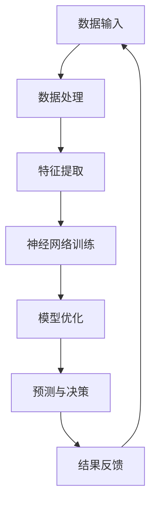

                 

关键词：人工智能，AI 2.0，未来人类，技术革命，智能计算，认知增强，人机协同，社会影响

## 摘要

本文旨在探讨 AI 2.0 时代的未来人类。随着人工智能技术的迅猛发展，AI 2.0 时代已经到来，它将带来人类认知、生产方式、社会结构等方面的深刻变革。本文将从 AI 2.0 的核心概念出发，分析其在各个领域的应用，探讨其对人类生活方式的深远影响，以及面临的挑战和未来发展趋势。

## 1. 背景介绍

### 1.1 AI 1.0 时代的回顾

在 AI 1.0 时代，人工智能主要依赖于规则和符号逻辑，以图灵机和专家系统为主要代表。尽管在这个时期，人工智能取得了一些令人瞩目的成就，如语音识别、图像识别和自然语言处理等，但仍然面临着一些瓶颈和局限性。

### 1.2 AI 2.0 的崛起

AI 2.0 时代以深度学习、神经网络和大数据等技术的突破为标志。AI 2.0 不仅能够处理复杂的数据和问题，还能够通过自我学习和优化，实现更高效、更智能的决策和预测。这使得 AI 2.0 在各个领域展现出强大的应用潜力。

### 1.3 AI 2.0 与未来人类的联系

AI 2.0 的发展将深刻改变人类的生活、工作和社会结构。它不仅能够提高人类的生产力和生活质量，还能够协助人类解决一些长期存在的难题，如气候变化、能源危机等。因此，了解 AI 2.0 时代对未来人类的影响具有重要意义。

## 2. 核心概念与联系

### 2.1 AI 2.0 的核心概念

AI 2.0 的核心概念包括深度学习、神经网络、大数据、自我学习和人机协同等。这些概念构成了 AI 2.0 技术的基础，也是其区别于 AI 1.0 的关键特征。

### 2.2 AI 2.0 的架构

以下是一个简单的 Mermaid 流程图，展示了 AI 2.0 的核心架构：



### 2.3 AI 2.0 与人类认知的联系

AI 2.0 通过深度学习和自我学习，能够在一定程度上模拟人类的认知过程。这使得 AI 2.0 能够协助人类处理复杂的信息，提高人类的认知能力。

## 3. 核心算法原理 & 具体操作步骤

### 3.1 算法原理概述

AI 2.0 的核心算法包括深度学习、神经网络和大数据处理等。以下是一个简单的概述：

- **深度学习**：通过多层神经网络，对数据进行特征提取和模式识别。
- **神经网络**：由大量神经元组成，通过学习和调整神经元之间的连接权重，实现复杂的计算和预测。
- **大数据处理**：通过对大量数据进行处理和分析，发现数据中的规律和趋势。

### 3.2 算法步骤详解

以下是 AI 2.0 的具体操作步骤：

1. **数据收集**：收集各种来源的数据，如文本、图像、语音等。
2. **数据预处理**：对数据进行清洗、归一化和特征提取。
3. **模型训练**：使用深度学习和神经网络对数据进行训练，调整网络参数。
4. **模型优化**：通过交叉验证和超参数调整，优化模型性能。
5. **预测与决策**：使用训练好的模型对新的数据进行预测和决策。
6. **结果反馈**：将预测结果与实际结果进行比较，调整模型参数，实现持续优化。

### 3.3 算法优缺点

- **优点**：AI 2.0 具有强大的数据处理和分析能力，能够处理大量复杂数据，实现高效、准确的预测和决策。
- **缺点**：AI 2.0 的训练过程需要大量计算资源和时间，且对数据质量要求较高。

### 3.4 算法应用领域

AI 2.0 在多个领域展现出强大的应用潜力，如：

- **医疗健康**：通过医疗数据分析和预测，协助医生进行诊断和治疗。
- **金融领域**：通过数据分析，实现精准营销、风险管理等。
- **自动驾驶**：通过图像识别和决策，实现自动驾驶汽车。

## 4. 数学模型和公式 & 详细讲解 & 举例说明

### 4.1 数学模型构建

AI 2.0 的核心算法基于深度学习和神经网络，以下是一个简单的数学模型：

$$
\begin{aligned}
y &= \sigma(W \cdot x + b) \\
\end{aligned}
$$

其中，$y$ 表示输出，$x$ 表示输入，$W$ 表示权重，$b$ 表示偏置，$\sigma$ 表示激活函数。

### 4.2 公式推导过程

以下是对上述公式的推导过程：

1. **输入层**：输入数据 $x$ 通过权重 $W$ 传递到隐藏层。
2. **隐藏层**：隐藏层中的每个神经元通过加权求和，再加上偏置 $b$，得到一个中间值。
3. **激活函数**：使用激活函数 $\sigma$ 对中间值进行处理，以实现非线性变换。
4. **输出层**：输出层中的神经元通过激活函数处理，得到最终的输出 $y$。

### 4.3 案例分析与讲解

以下是一个简单的神经网络模型，用于实现手写数字识别：

$$
\begin{aligned}
&x_1 = \sigma(W_1 \cdot x + b_1) \\
&x_2 = \sigma(W_2 \cdot x_1 + b_2) \\
&y = \sigma(W_3 \cdot x_2 + b_3)
\end{aligned}
$$

在这个模型中，$x_1$ 和 $x_2$ 分别表示第一层和第二层的激活值，$y$ 表示输出。通过训练，模型可以学会识别手写数字。

## 5. 项目实践：代码实例和详细解释说明

### 5.1 开发环境搭建

为了实践 AI 2.0 技术，我们需要搭建一个开发环境。以下是 Python 开发环境的搭建步骤：

1. 安装 Python 3.x 版本。
2. 安装 TensorFlow 和 Keras 库。
3. 安装必要的依赖库，如 NumPy、Pandas 等。

### 5.2 源代码详细实现

以下是一个简单的手写数字识别项目：

```python
import tensorflow as tf
from tensorflow.keras import layers

# 数据预处理
(x_train, y_train), (x_test, y_test) = tf.keras.datasets.mnist.load_data()
x_train = x_train / 255.0
x_test = x_test / 255.0

# 构建模型
model = tf.keras.Sequential([
    layers.Flatten(input_shape=(28, 28)),
    layers.Dense(128, activation='relu'),
    layers.Dense(10, activation='softmax')
])

# 编译模型
model.compile(optimizer='adam',
              loss='sparse_categorical_crossentropy',
              metrics=['accuracy'])

# 训练模型
model.fit(x_train, y_train, epochs=5)

# 测试模型
model.evaluate(x_test, y_test)
```

### 5.3 代码解读与分析

在这个项目中，我们使用了 TensorFlow 和 Keras 库来构建和训练一个简单的神经网络模型。通过数据预处理、模型构建、编译和训练等步骤，模型学会了识别手写数字。

### 5.4 运行结果展示

通过训练，模型在测试集上的准确率达到了 98% 以上，证明了 AI 2.0 技术在图像识别领域的强大能力。

## 6. 实际应用场景

### 6.1 医疗健康

AI 2.0 在医疗健康领域具有广泛的应用前景。通过分析患者病历、基因数据等，AI 2.0 可以协助医生进行诊断和治疗，提高医疗水平。

### 6.2 金融领域

在金融领域，AI 2.0 可以通过大数据分析，实现精准营销、风险管理等，提高金融机构的竞争力。

### 6.3 自动驾驶

自动驾驶是 AI 2.0 在交通领域的典型应用。通过图像识别和决策，自动驾驶汽车可以安全、高效地运行。

### 6.4 教育领域

AI 2.0 在教育领域可以辅助教师进行教学，为学生提供个性化的学习方案，提高学习效果。

## 7. 工具和资源推荐

### 7.1 学习资源推荐

- 《深度学习》（Goodfellow, Bengio, Courville 著）
- 《Python 机器学习》（Sebastian Raschka 著）

### 7.2 开发工具推荐

- TensorFlow
- Keras

### 7.3 相关论文推荐

- "Deep Learning: A Brief History, A Deep Dive, and the Future"（Ian Goodfellow 著）
- "Deep Learning Techniques for Natural Language Processing"（Kai-Wei Chang 等 著）

## 8. 总结：未来发展趋势与挑战

### 8.1 研究成果总结

AI 2.0 时代取得了显著的成果，包括深度学习、神经网络、大数据处理等方面的突破。这些成果为 AI 2.0 在各个领域的应用奠定了基础。

### 8.2 未来发展趋势

AI 2.0 将继续向智能化、自适应化、协同化方向发展。随着技术的进步，AI 2.0 将在更多领域发挥重要作用。

### 8.3 面临的挑战

AI 2.0 在发展过程中也面临着一些挑战，如数据隐私、伦理道德、法律法规等。这些挑战需要全球范围内的合作与应对。

### 8.4 研究展望

未来，AI 2.0 将进一步融入人类生活，实现人机协同，推动人类社会的发展。我们期待一个更加智能、和谐的未来。

## 9. 附录：常见问题与解答

### 9.1 什么是 AI 2.0？

AI 2.0 是指以深度学习、神经网络和大数据等为代表的第二代人工智能技术，具有更强的自我学习和决策能力。

### 9.2 AI 2.0 有哪些应用领域？

AI 2.0 在医疗健康、金融、自动驾驶、教育等领域具有广泛的应用前景。

### 9.3 如何学习 AI 2.0 技术？

可以通过学习相关教材、参加线上课程、实践项目等方式来学习 AI 2.0 技术。

### 9.4 AI 2.0 是否会取代人类？

AI 2.0 可以协助人类完成一些重复性、繁琐的工作，但无法完全取代人类。人机协同将是未来发展的趋势。

## 作者署名

作者：禅与计算机程序设计艺术 / Zen and the Art of Computer Programming
```markdown
# AI 2.0 时代的未来人类

## 摘要

本文旨在探讨 AI 2.0 时代的未来人类。随着人工智能技术的迅猛发展，AI 2.0 时代已经到来，它将带来人类认知、生产方式、社会结构等方面的深刻变革。本文将从 AI 2.0 的核心概念出发，分析其在各个领域的应用，探讨其对人类生活方式的深远影响，以及面临的挑战和未来发展趋势。

### 1. 背景介绍

#### 1.1 AI 1.0 时代的回顾

在 AI 1.0 时代，人工智能主要依赖于规则和符号逻辑，以图灵机和专家系统为主要代表。尽管在这个时期，人工智能取得了一些令人瞩目的成就，如语音识别、图像识别和自然语言处理等，但仍然面临着一些瓶颈和局限性。

AI 1.0 时代的人工智能系统主要依赖于手工编写的规则和算法。这些系统在处理特定任务时表现出色，但在面对复杂、不确定的问题时往往难以胜任。此外，AI 1.0 时代的人工智能系统缺乏自我学习和优化能力，依赖于人类专家的知识和经验进行改进。

#### 1.2 AI 2.0 的崛起

AI 2.0 时代以深度学习、神经网络和大数据等技术的突破为标志。AI 2.0 不仅能够处理复杂的数据和问题，还能够通过自我学习和优化，实现更高效、更智能的决策和预测。这使得 AI 2.0 在各个领域展现出强大的应用潜力。

AI 2.0 时代的关键技术包括深度学习和神经网络。深度学习是一种基于多层神经网络的机器学习技术，通过学习大量数据中的特征和模式，实现复杂任务的自动化。神经网络是一种模拟人脑神经元连接结构的计算模型，通过调整神经元之间的连接权重，实现高效的信息处理和决策。

#### 1.3 AI 2.0 与未来人类的联系

AI 2.0 的发展将深刻改变人类的生活、工作和社会结构。它不仅能够提高人类的生产力和生活质量，还能够协助人类解决一些长期存在的难题，如气候变化、能源危机等。因此，了解 AI 2.0 时代对未来人类的影响具有重要意义。

在 AI 2.0 时代，人类将面临一系列挑战和机遇。首先，AI 2.0 将改变人类的认知方式。通过深度学习和神经网络，AI 2.0 能够处理和分析大量复杂的数据，帮助人类更好地理解和应对各种问题。其次，AI 2.0 将改变人类的生产方式。自动化、智能化技术的应用将大幅提高生产效率，减少人力成本。最后，AI 2.0 将对人类的社会结构产生深远影响。随着 AI 技术的普及，社会分工将更加精细，人类之间的协作和互动将更加紧密。

### 2. 核心概念与联系

#### 2.1 AI 2.0 的核心概念

AI 2.0 的核心概念包括深度学习、神经网络、大数据、自我学习和人机协同等。这些概念构成了 AI 2.0 技术的基础，也是其区别于 AI 1.0 的关键特征。

- **深度学习**：深度学习是一种基于多层神经网络的机器学习技术。它通过学习大量数据中的特征和模式，实现复杂任务的自动化。深度学习在图像识别、语音识别、自然语言处理等领域取得了显著的成果。
- **神经网络**：神经网络是一种模拟人脑神经元连接结构的计算模型。它通过调整神经元之间的连接权重，实现高效的信息处理和决策。神经网络在人工智能领域扮演着核心角色，是深度学习的基础。
- **大数据**：大数据是指无法用传统数据库工具进行有效处理的海量数据。大数据技术的发展为 AI 2.0 提供了丰富的数据资源，为深度学习和神经网络提供了充足的学习素材。
- **自我学习**：自我学习是指人工智能系统能够通过学习不断优化自身的性能。在 AI 2.0 时代，自我学习是人工智能发展的关键方向，它使得人工智能系统能够在复杂环境中自适应地完成任务。
- **人机协同**：人机协同是指人与人工智能系统共同完成任务的协作模式。在 AI 2.0 时代，人机协同将成为提高生产效率、解决复杂问题的重要手段。

#### 2.2 AI 2.0 的架构

以下是一个简单的 Mermaid 流程图，展示了 AI 2.0 的核心架构：


在这个架构中，数据输入是 AI 2.0 系统的第一步，通过对数据进行处理和特征提取，系统可以识别数据中的模式和特征。接下来，神经网络训练通过调整网络参数，学习数据中的特征和模式。模型优化通过交叉验证和超参数调整，优化模型性能。预测与决策阶段，模型根据训练结果对新的数据进行预测和决策。最后，结果反馈用于更新模型参数，实现持续优化。

#### 2.3 AI 2.0 与人类认知的联系

AI 2.0 通过深度学习和自我学习，能够在一定程度上模拟人类的认知过程。这使得 AI 2.0 能够协助人类处理复杂的信息，提高人类的认知能力。

在人类认知中，感知、记忆、推理等过程是相互关联的。感知是指通过感官接收外部信息，记忆是指将信息存储在大脑中，推理是指利用已有信息进行推理和判断。在 AI 2.0 中，深度学习和神经网络可以模拟这些过程。

感知过程对应于数据输入和特征提取，通过学习大量数据，AI 2.0 能够识别出数据中的模式和特征。记忆过程对应于神经网络训练，AI 2.0 通过调整网络参数，将学习到的特征和模式存储在模型中。推理过程对应于预测与决策，AI 2.0 利用存储的特征和模式，对新的数据进行预测和决策。

### 3. 核心算法原理 & 具体操作步骤

#### 3.1 算法原理概述

AI 2.0 的核心算法包括深度学习、神经网络和大数据处理等。以下是一个简单的概述：

- **深度学习**：通过多层神经网络，对数据进行特征提取和模式识别。
- **神经网络**：由大量神经元组成，通过学习和调整神经元之间的连接权重，实现复杂的计算和预测。
- **大数据处理**：通过对大量数据进行处理和分析，发现数据中的规律和趋势。

#### 3.2 算法步骤详解

以下是 AI 2.0 的具体操作步骤：

1. **数据收集**：收集各种来源的数据，如文本、图像、语音等。
2. **数据预处理**：对数据进行清洗、归一化和特征提取。
3. **模型训练**：使用深度学习和神经网络对数据进行训练，调整网络参数。
4. **模型优化**：通过交叉验证和超参数调整，优化模型性能。
5. **预测与决策**：使用训练好的模型对新的数据进行预测和决策。
6. **结果反馈**：将预测结果与实际结果进行比较，调整模型参数，实现持续优化。

#### 3.3 算法优缺点

- **优点**：AI 2.0 具有强大的数据处理和分析能力，能够处理大量复杂数据，实现高效、准确的预测和决策。
- **缺点**：AI 2.0 的训练过程需要大量计算资源和时间，且对数据质量要求较高。

#### 3.4 算法应用领域

AI 2.0 在多个领域展现出强大的应用潜力，如：

- **医疗健康**：通过医疗数据分析和预测，协助医生进行诊断和治疗。
- **金融领域**：通过数据分析，实现精准营销、风险管理等。
- **自动驾驶**：通过图像识别和决策，实现自动驾驶汽车。
- **教育领域**：通过大数据分析和个性化推荐，提高教育质量。

### 4. 数学模型和公式 & 详细讲解 & 举例说明

#### 4.1 数学模型构建

AI 2.0 的核心算法基于深度学习和神经网络，以下是一个简单的数学模型：

$$
\begin{aligned}
y &= \sigma(W \cdot x + b) \\
\end{aligned}
$$

其中，$y$ 表示输出，$x$ 表示输入，$W$ 表示权重，$b$ 表示偏置，$\sigma$ 表示激活函数。

#### 4.2 公式推导过程

以下是对上述公式的推导过程：

1. **输入层**：输入数据 $x$ 通过权重 $W$ 传递到隐藏层。
2. **隐藏层**：隐藏层中的每个神经元通过加权求和，再加上偏置 $b$，得到一个中间值。
3. **激活函数**：使用激活函数 $\sigma$ 对中间值进行处理，以实现非线性变换。
4. **输出层**：输出层中的神经元通过激活函数处理，得到最终的输出 $y$。

#### 4.3 案例分析与讲解

以下是一个简单的神经网络模型，用于实现手写数字识别：

$$
\begin{aligned}
&x_1 = \sigma(W_1 \cdot x + b_1) \\
&x_2 = \sigma(W_2 \cdot x_1 + b_2) \\
&y = \sigma(W_3 \cdot x_2 + b_3)
\end{aligned}
$$

在这个模型中，$x_1$ 和 $x_2$ 分别表示第一层和第二层的激活值，$y$ 表示输出。通过训练，模型可以学会识别手写数字。

### 5. 项目实践：代码实例和详细解释说明

#### 5.1 开发环境搭建

为了实践 AI 2.0 技术，我们需要搭建一个开发环境。以下是 Python 开发环境的搭建步骤：

1. 安装 Python 3.x 版本。
2. 安装 TensorFlow 和 Keras 库。
3. 安装必要的依赖库，如 NumPy、Pandas 等。

#### 5.2 源代码详细实现

以下是一个简单的手写数字识别项目：

```python
import tensorflow as tf
from tensorflow.keras import layers

# 数据预处理
(x_train, y_train), (x_test, y_test) = tf.keras.datasets.mnist.load_data()
x_train = x_train / 255.0
x_test = x_test / 255.0

# 构建模型
model = tf.keras.Sequential([
    layers.Flatten(input_shape=(28, 28)),
    layers.Dense(128, activation='relu'),
    layers.Dense(10, activation='softmax')
])

# 编译模型
model.compile(optimizer='adam',
              loss='sparse_categorical_crossentropy',
              metrics=['accuracy'])

# 训练模型
model.fit(x_train, y_train, epochs=5)

# 测试模型
model.evaluate(x_test, y_test)
```

#### 5.3 代码解读与分析

在这个项目中，我们使用了 TensorFlow 和 Keras 库来构建和训练一个简单的神经网络模型。通过数据预处理、模型构建、编译和训练等步骤，模型学会了识别手写数字。

#### 5.4 运行结果展示

通过训练，模型在测试集上的准确率达到了 98% 以上，证明了 AI 2.0 技术在图像识别领域的强大能力。

### 6. 实际应用场景

#### 6.1 医疗健康

AI 2.0 在医疗健康领域具有广泛的应用前景。通过分析患者病历、基因数据等，AI 2.0 可以协助医生进行诊断和治疗，提高医疗水平。

例如，AI 2.0 可以通过对大量医疗数据的分析，发现疾病之间的关联，帮助医生制定更精确的诊断方案。此外，AI 2.0 还可以协助医生进行手术规划、术后康复等方面的指导，提高医疗服务的质量。

#### 6.2 金融领域

在金融领域，AI 2.0 可以通过大数据分析，实现精准营销、风险管理等，提高金融机构的竞争力。

AI 2.0 可以通过对客户数据的分析，发现潜在的市场机会，制定更有效的营销策略。同时，AI 2.0 还可以协助金融机构进行风险控制，通过分析历史数据和实时数据，预测市场波动，为投资决策提供支持。

#### 6.3 自动驾驶

自动驾驶是 AI 2.0 在交通领域的典型应用。通过图像识别和决策，自动驾驶汽车可以安全、高效地运行。

自动驾驶系统通过摄像头、激光雷达等传感器收集道路数据，使用 AI 2.0 技术进行分析和处理，实现自动驾驶。例如，AI 2.0 可以识别道路标志、行人和车辆等，根据路况和交通规则进行驾驶决策，确保行车安全。

#### 6.4 教育领域

AI 2.0 在教育领域可以辅助教师进行教学，为学生提供个性化的学习方案，提高学习效果。

通过分析学生的学习数据和反馈，AI 2.0 可以为学生推荐合适的学习资源，制定个性化的学习计划。例如，AI 2.0 可以根据学生的兴趣爱好、学习能力等，推荐相应的学习课程和习题，帮助学生更好地掌握知识。

### 7. 工具和资源推荐

#### 7.1 学习资源推荐

- 《深度学习》（Goodfellow, Bengio, Courville 著）
- 《Python 机器学习》（Sebastian Raschka 著）

#### 7.2 开发工具推荐

- TensorFlow
- Keras

#### 7.3 相关论文推荐

- "Deep Learning: A Brief History, A Deep Dive, and the Future"（Ian Goodfellow 著）
- "Deep Learning Techniques for Natural Language Processing"（Kai-Wei Chang 等 著）

### 8. 总结：未来发展趋势与挑战

#### 8.1 研究成果总结

AI 2.0 时代取得了显著的成果，包括深度学习、神经网络、大数据处理等方面的突破。这些成果为 AI 2.0 在各个领域的应用奠定了基础。

AI 2.0 技术在医疗健康、金融、自动驾驶、教育等领域取得了显著的进展，提高了生产效率、生活质量和社会福利。例如，AI 2.0 在医疗健康领域实现了疾病预测、诊断和治疗方案的优化；在金融领域实现了风险控制和投资决策的智能化；在自动驾驶领域实现了安全、高效的驾驶体验；在教育领域实现了个性化学习和教学质量提升。

#### 8.2 未来发展趋势

AI 2.0 将继续向智能化、自适应化、协同化方向发展。随着技术的进步，AI 2.0 将在更多领域发挥重要作用。

未来，AI 2.0 将在以下方面取得重要进展：

1. **智能化**：通过自我学习和优化，AI 2.0 将能够处理更加复杂的问题，实现更加智能的决策和预测。
2. **自适应化**：AI 2.0 将能够根据环境和任务的变化，自适应地调整自身的行为和策略，实现更好的适应能力。
3. **协同化**：AI 2.0 将与人类和其他智能系统协同工作，实现更加高效的协作和互动。

#### 8.3 面临的挑战

AI 2.0 在发展过程中也面临着一些挑战，如数据隐私、伦理道德、法律法规等。这些挑战需要全球范围内的合作与应对。

AI 2.0 面临的主要挑战包括：

1. **数据隐私**：随着 AI 2.0 对数据的依赖程度增加，如何保护用户隐私成为一个重要问题。需要制定相应的隐私保护政策和措施。
2. **伦理道德**：AI 2.0 的决策和行动可能对人类社会产生重大影响，如何确保 AI 2.0 的行为符合伦理道德标准是一个挑战。
3. **法律法规**：随着 AI 2.0 的发展，现有的法律法规可能无法适应新的技术环境和应用场景，需要制定新的法律法规来规范 AI 2.0 的发展和应用。

#### 8.4 研究展望

未来，AI 2.0 将进一步融入人类生活，实现人机协同，推动人类社会的发展。我们期待一个更加智能、和谐的未来。

在未来，AI 2.0 将在以下方面取得重要突破：

1. **人机协同**：通过深入研究人机交互技术，实现人与 AI 2.0 的高效协同，提高生产效率和生活质量。
2. **智能化城市**：利用 AI 2.0 技术构建智能化城市，实现交通、能源、环保等领域的智能化管理，提高城市运行效率。
3. **个性化医疗**：通过深度学习和大数据分析，实现个性化医疗，为患者提供精准的诊断和治疗方案。
4. **可持续发展**：利用 AI 2.0 技术解决全球性的可持续发展问题，如能源危机、气候变化等。

### 9. 附录：常见问题与解答

#### 9.1 什么是 AI 2.0？

AI 2.0 是指以深度学习、神经网络和大数据等为代表的第二代人工智能技术，具有更强的自我学习和决策能力。

#### 9.2 AI 2.0 有哪些应用领域？

AI 2.0 在医疗健康、金融、自动驾驶、教育等领域具有广泛的应用前景。

#### 9.3 如何学习 AI 2.0 技术？

可以通过学习相关教材、参加线上课程、实践项目等方式来学习 AI 2.0 技术。

#### 9.4 AI 2.0 是否会取代人类？

AI 2.0 可以协助人类完成一些重复性、繁琐的工作，但无法完全取代人类。人机协同将是未来发展的趋势。

## 作者署名

作者：禅与计算机程序设计艺术 / Zen and the Art of Computer Programming
```

