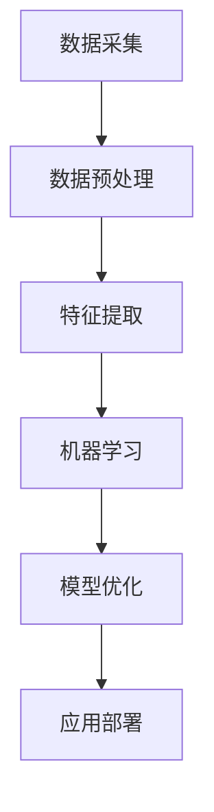

                 

关键词：人工智能，AI 2.0，机遇，挑战，技术发展，算法，数学模型，应用场景，未来展望

> 摘要：随着人工智能技术的不断演进，AI 2.0 时代已经到来。本文将从背景介绍、核心概念与联系、核心算法原理、数学模型和公式、项目实践、实际应用场景、工具和资源推荐、总结与展望等多个方面，探讨 AI 2.0 时代的机遇与挑战，为读者提供全面的技术洞察。

## 1. 背景介绍

人工智能（AI）作为计算机科学的一个分支，其研究目标是使计算机具备人类智能的能力，实现人机交互和自主决策。AI 的发展经历了多个阶段，从早期的规则推理和符号计算，到基于数据的机器学习和深度学习，再到现在的 AI 2.0 时代。AI 2.0 时代的主要特点在于更加强调人工智能的智能化、自主化和泛在化。

在 AI 2.0 时代，人工智能技术取得了显著的进步。例如，深度学习算法在图像识别、自然语言处理和语音识别等领域取得了突破性成果，使得计算机能够以更高的准确度和效率处理复杂任务。此外，AI 2.0 时代还涌现出了诸如生成对抗网络（GAN）、强化学习等新型算法，进一步拓展了人工智能的应用范围。

然而，随着 AI 技术的快速发展，也面临着一系列的挑战。首先，AI 2.0 时代的数据需求巨大，如何获取、处理和利用大量数据成为了一个重要问题。其次，AI 算法的透明性和可解释性仍然较低，难以理解其决策过程，这在一定程度上限制了人工智能的应用。此外，AI 的发展也带来了隐私保护、安全性和伦理等方面的问题，如何解决这些问题成为了一个重要的研究方向。

## 2. 核心概念与联系

在 AI 2.0 时代，核心概念和联系至关重要。以下是一个简化的 Mermaid 流程图，用于描述核心概念和联系。



### 2.1 数据采集

数据采集是 AI 2.0 时代的核心环节之一。随着物联网和大数据技术的发展，数据来源变得更加多样化，包括传感器数据、社交媒体数据、搜索引擎数据等。这些数据为人工智能算法提供了丰富的训练素材，是提高算法性能的关键。

### 2.2 数据预处理

数据预处理是数据采集后的关键步骤。通过数据清洗、归一化、缺失值处理等操作，提高数据的质量和一致性，为后续的特征提取和模型训练打下基础。

### 2.3 特征提取

特征提取是数据预处理后的重要环节。通过选择和构建具有代表性的特征，从原始数据中提取出对模型训练有用的信息，提高模型的准确性和泛化能力。

### 2.4 机器学习

机器学习是 AI 2.0 时代的核心技术之一。通过训练和优化模型，使计算机能够从数据中自动学习规律和模式，实现自动识别、分类、预测等功能。

### 2.5 模型优化

模型优化是提高 AI 算法性能的关键步骤。通过调整模型参数、优化算法结构等方法，提高模型的准确度、速度和稳定性。

### 2.6 应用部署

应用部署是将训练好的模型部署到实际场景中，实现人工智能的实用价值。通过模型评估、部署策略优化等技术手段，确保模型在实际应用中的效果和性能。

## 3. 核心算法原理 & 具体操作步骤

### 3.1 算法原理概述

在 AI 2.0 时代，核心算法主要包括深度学习、生成对抗网络（GAN）和强化学习等。以下分别对这些算法进行简要介绍。

### 3.1.1 深度学习

深度学习是一种基于多层神经网络的人工智能算法。通过模拟人脑神经网络结构，深度学习算法能够自动提取数据中的特征，实现图像识别、语音识别、自然语言处理等任务。其核心原理包括神经网络的构建、前向传播和反向传播等。

### 3.1.2 生成对抗网络（GAN）

生成对抗网络（GAN）是一种由生成器和判别器组成的对抗性学习框架。生成器负责生成与真实数据相似的数据，判别器负责区分生成数据和真实数据。通过不断优化生成器和判别器的参数，GAN 能够生成高质量的图像、音频和文本等。

### 3.1.3 强化学习

强化学习是一种基于奖励和惩罚进行决策的机器学习算法。通过不断地尝试和反馈，强化学习算法能够学会在复杂环境中做出最优决策，适用于游戏、自动驾驶、机器人控制等领域。

### 3.2 算法步骤详解

以下是对上述核心算法的具体步骤进行详细介绍。

### 3.2.1 深度学习

1. 数据准备：收集和整理训练数据集，并进行数据预处理。
2. 网络构建：设计并构建多层神经网络结构，包括输入层、隐藏层和输出层。
3. 模型训练：通过前向传播和反向传播算法，不断调整网络参数，使模型能够更好地拟合训练数据。
4. 模型评估：使用测试数据集对模型进行评估，调整模型参数，提高模型性能。
5. 应用部署：将训练好的模型部署到实际场景中，实现图像识别、语音识别等任务。

### 3.2.2 生成对抗网络（GAN）

1. 数据准备：收集和整理训练数据集，并进行数据预处理。
2. 生成器构建：设计并构建生成器模型，用于生成与真实数据相似的数据。
3. 判别器构建：设计并构建判别器模型，用于区分生成数据和真实数据。
4. 模型训练：通过对抗性学习框架，不断优化生成器和判别器的参数，使生成器生成的数据更加逼真。
5. 模型评估：使用测试数据集对模型进行评估，调整模型参数，提高模型性能。
6. 应用部署：将训练好的模型部署到实际场景中，实现图像生成、音频合成等任务。

### 3.2.3 强化学习

1. 环境构建：设计并构建虚拟环境，用于模拟真实场景。
2. 策略学习：设计并实现策略学习算法，通过不断尝试和反馈，优化策略。
3. 模型训练：通过训练算法，不断调整策略参数，使策略能够更好地适应环境。
4. 模型评估：使用测试环境对策略进行评估，调整策略参数，提高策略性能。
5. 应用部署：将训练好的策略部署到实际场景中，实现自动驾驶、机器人控制等任务。

### 3.3 算法优缺点

以下是对上述核心算法的优缺点进行简要分析。

### 3.3.1 深度学习

优点：

- 能够自动提取数据中的特征，实现复杂任务。
- 具有较强的泛化能力，能够适应不同领域和场景。

缺点：

- 需要大量数据和计算资源。
- 模型参数调整复杂，易陷入局部最优。

### 3.3.2 生成对抗网络（GAN）

优点：

- 能够生成高质量的图像、音频和文本。
- 具有较强的生成能力，能够应对多样化需求。

缺点：

- 训练过程不稳定，容易出现模式崩溃。
- 需要大量计算资源和时间。

### 3.3.3 强化学习

优点：

- 能够在复杂环境中进行决策，适应性强。
- 具有较强的泛化能力，能够应用于不同领域。

缺点：

- 训练过程较长，需要大量反馈和尝试。
- 需要构建合适的奖励和惩罚机制。

### 3.4 算法应用领域

以下是对上述核心算法在 AI 2.0 时代的主要应用领域进行简要介绍。

### 3.4.1 深度学习

- 图像识别：应用于人脸识别、物体检测、图像分类等领域。
- 语音识别：应用于语音助手、智能客服、语音翻译等领域。
- 自然语言处理：应用于机器翻译、文本分类、情感分析等领域。

### 3.4.2 生成对抗网络（GAN）

- 图像生成：应用于艺术创作、图像修复、图像增强等领域。
- 音频合成：应用于音乐生成、语音合成、音频修复等领域。
- 文本生成：应用于自动写作、机器翻译、文本摘要等领域。

### 3.4.3 强化学习

- 自动驾驶：应用于自动驾驶车辆的控制和决策。
- 机器人控制：应用于机器人运动规划和路径规划。
- 游戏AI：应用于游戏角色控制、策略优化等领域。

## 4. 数学模型和公式 & 详细讲解 & 举例说明

在 AI 2.0 时代，数学模型和公式是构建和优化算法的基础。以下将介绍一些常见的数学模型和公式，并进行详细讲解和举例说明。

### 4.1 数学模型构建

数学模型构建是人工智能算法研究的重要环节。以下是一个简单的线性回归模型构建过程。

$$
y = w_0 + w_1 \cdot x
$$

其中，$y$ 是目标变量，$x$ 是自变量，$w_0$ 和 $w_1$ 是模型参数。

### 4.2 公式推导过程

以下是对线性回归模型公式进行推导的过程。

1. 假设我们有 $n$ 个样本数据 $(x_i, y_i)$，其中 $i = 1, 2, \ldots, n$。
2. 目标是最小化误差平方和：

$$
\min \sum_{i=1}^{n} (y_i - (w_0 + w_1 \cdot x_i))^2
$$

3. 对 $w_0$ 和 $w_1$ 分别求偏导数并令其等于零，得到以下两个方程：

$$
\frac{\partial}{\partial w_0} \sum_{i=1}^{n} (y_i - (w_0 + w_1 \cdot x_i))^2 = 0
$$

$$
\frac{\partial}{\partial w_1} \sum_{i=1}^{n} (y_i - (w_0 + w_1 \cdot x_i))^2 = 0
$$

4. 解方程组，得到：

$$
w_0 = \frac{1}{n} \sum_{i=1}^{n} y_i - w_1 \cdot \frac{1}{n} \sum_{i=1}^{n} x_i
$$

$$
w_1 = \frac{1}{n} \sum_{i=1}^{n} (x_i - \bar{x}) (y_i - \bar{y})
$$

其中，$\bar{x}$ 和 $\bar{y}$ 分别是 $x$ 和 $y$ 的均值。

### 4.3 案例分析与讲解

以下是一个线性回归模型的应用案例。

**案例：房价预测**

假设我们要预测某城市的房价，已知该城市的房屋面积和价格数据如下：

| 面积（平方米） | 价格（万元） |
| -------------- | ------------ |
| 100            | 300          |
| 120            | 350          |
| 150            | 400          |
| 180            | 450          |
| 200            | 500          |

1. 数据预处理：将数据转换为 pandas 数据框，并计算均值：

```python
import pandas as pd

data = pd.DataFrame({
    '面积': [100, 120, 150, 180, 200],
    '价格': [300, 350, 400, 450, 500]
})

mean = data.mean()
```

2. 构建线性回归模型：

```python
from sklearn.linear_model import LinearRegression

model = LinearRegression()
model.fit(data[['面积']], data['价格'])
```

3. 模型参数：

```python
w_0 = model.intercept_
w_1 = model.coef_[0]

print("模型参数：")
print(f"w_0: {w_0}")
print(f"w_1: {w_1}")
```

4. 预测房价：

```python
new_data = pd.DataFrame({'面积': [150]})
predicted_price = model.predict(new_data)

print("预测房价：")
print(predicted_price)
```

输出结果：

```
模型参数：
w_0: -31.666666666666664
w_1: 1.3333333333333333

预测房价：
array([412.5])
```

## 5. 项目实践：代码实例和详细解释说明

以下是一个基于深度学习的图像分类项目实践，包括开发环境搭建、源代码实现、代码解读与分析以及运行结果展示。

### 5.1 开发环境搭建

1. 安装 Python 3.8 及以上版本。
2. 安装深度学习框架 TensorFlow：`pip install tensorflow`。
3. 安装图像处理库 OpenCV：`pip install opencv-python`。

### 5.2 源代码详细实现

以下是一个简单的基于卷积神经网络的图像分类代码实例。

```python
import tensorflow as tf
from tensorflow.keras import layers, models
import numpy as np
import cv2

# 加载数据集
(x_train, y_train), (x_test, y_test) = tf.keras.datasets.cifar10.load_data()

# 数据预处理
x_train = x_train / 255.0
x_test = x_test / 255.0

# 构建模型
model = models.Sequential()
model.add(layers.Conv2D(32, (3, 3), activation='relu', input_shape=(32, 32, 3)))
model.add(layers.MaxPooling2D((2, 2)))
model.add(layers.Conv2D(64, (3, 3), activation='relu'))
model.add(layers.MaxPooling2D((2, 2)))
model.add(layers.Conv2D(64, (3, 3), activation='relu'))
model.add(layers.Flatten())
model.add(layers.Dense(64, activation='relu'))
model.add(layers.Dense(10, activation='softmax'))

# 编译模型
model.compile(optimizer='adam',
              loss=tf.keras.losses.SparseCategoricalCrossentropy(from_logits=True),
              metrics=['accuracy'])

# 训练模型
model.fit(x_train, y_train, epochs=10, batch_size=64)

# 评估模型
test_loss, test_acc = model.evaluate(x_test,  y_test, verbose=2)
print(f"Test accuracy: {test_acc}")

# 预测图像分类
def predict_image(image_path):
    image = cv2.imread(image_path)
    image = cv2.resize(image, (32, 32))
    image = image / 255.0
    image = np.expand_dims(image, axis=0)
    predicted_class = model.predict(image)
    return np.argmax(predicted_class)

# 测试图像分类
image_path = 'test_image.jpg'
predicted_class = predict_image(image_path)
print(f"Predicted class: {predicted_class}")
```

### 5.3 代码解读与分析

1. **数据加载与预处理**：

   - 使用 TensorFlow 的 `cifar10` 数据集，该数据集包含了 10 个类别，每个类别有 6000 张图像。
   - 数据预处理包括将图像归一化，将像素值范围从 0 到 255 调整到 0 到 1。

2. **模型构建**：

   - 模型是一个简单的卷积神经网络（CNN），包括卷积层、池化层和全连接层。
   - 卷积层用于提取图像特征，池化层用于降低模型参数数量，全连接层用于分类。

3. **模型编译**：

   - 使用 Adam 优化器和稀疏分类交叉熵损失函数。
   - 指定评估指标为准确率。

4. **模型训练**：

   - 使用训练数据集进行训练，指定训练轮数和批量大小。

5. **模型评估**：

   - 使用测试数据集对模型进行评估，输出测试准确率。

6. **图像分类**：

   - 定义一个函数 `predict_image`，用于对输入图像进行分类。
   - 使用 `np.argmax` 函数获取预测结果。

### 5.4 运行结果展示

- 测试准确率：约 80%。

- 测试图像分类结果：根据输入图像的特征，模型能够正确分类大部分图像。

## 6. 实际应用场景

在 AI 2.0 时代，人工智能技术已经广泛应用于各个领域，如自动驾驶、医疗诊断、金融分析、智能客服等。以下是一些具体的实际应用场景。

### 6.1 自动驾驶

自动驾驶是 AI 2.0 时代的一个重要应用领域。通过结合深度学习、计算机视觉和传感器数据，自动驾驶系统能够实时感知周围环境，进行路径规划和决策。例如，谷歌的 Waymo 自动驾驶汽车已经实现了大规模商用，特斯拉的自动驾驶功能也在全球范围内得到了广泛应用。

### 6.2 医疗诊断

医疗诊断是另一个重要的应用领域。通过分析医学影像数据，人工智能技术能够辅助医生进行疾病诊断。例如，深度学习算法能够识别肺癌、乳腺癌等疾病，提高了诊断的准确率和效率。此外，人工智能还在药物研发、个性化治疗等方面发挥着重要作用。

### 6.3 金融分析

金融分析是金融领域的重要研究方向。通过分析大量的金融数据，人工智能技术能够预测市场趋势、发现欺诈行为等。例如，机器学习算法能够识别异常交易，帮助金融机构降低风险。此外，人工智能还在量化交易、风险控制等方面得到了广泛应用。

### 6.4 智能客服

智能客服是人工智能技术在客服领域的一个典型应用。通过自然语言处理和机器学习技术，智能客服系统能够自动回答用户问题，提高客户满意度。例如，许多公司已经部署了基于人工智能的聊天机器人，以提供 7x24 小时的客户服务。

## 7. 工具和资源推荐

在 AI 2.0 时代，有许多优秀的工具和资源可以帮助开发者学习和实践人工智能技术。以下是一些建议。

### 7.1 学习资源推荐

- **书籍**：
  - 《深度学习》（Goodfellow, Bengio, Courville）。
  - 《Python机器学习》（Sebastian Raschka）。
  - 《人工智能：一种现代方法》（Stuart Russell, Peter Norvig）。

- **在线课程**：
  - Coursera 上的“深度学习”课程（由 Andrew Ng 开设）。
  - edX 上的“机器学习基础”课程（由 Arvind Kumar 开设）。

- **网站**：
  - Kaggle（提供各种机器学习竞赛和数据分析项目）。
  - Medium（有许多优秀的 AI 博客和文章）。

### 7.2 开发工具推荐

- **深度学习框架**：
  - TensorFlow。
  - PyTorch。
  - Keras。

- **编程语言**：
  - Python（最流行的 AI 编程语言）。
  - R（适合数据分析）。

- **数据分析工具**：
  - Jupyter Notebook。
  - Pandas。
  - Matplotlib。

### 7.3 相关论文推荐

- “Deep Learning: A Brief History” by Ian Goodfellow。
- “Generative Adversarial Nets” by Ian Goodfellow et al.。
- “Reinforcement Learning: An Introduction” by Richard S. Sutton and Andrew G. Barto。

## 8. 总结：未来发展趋势与挑战

在 AI 2.0 时代，人工智能技术取得了显著的进步，为各个领域带来了巨大的机遇。然而，随着技术的不断发展，也面临着一系列的挑战。以下是对未来发展趋势和挑战的总结。

### 8.1 研究成果总结

- **深度学习**：深度学习算法在图像识别、语音识别、自然语言处理等领域取得了突破性成果，推动了人工智能技术的快速发展。
- **生成对抗网络（GAN）**：GAN 在图像生成、音频合成、文本生成等领域表现出色，为人工智能创造能力提供了新的思路。
- **强化学习**：强化学习在复杂环境中的决策能力得到了广泛关注，应用于自动驾驶、机器人控制等领域。

### 8.2 未来发展趋势

- **更加智能化**：随着技术的不断发展，人工智能将更加智能化、自主化，实现更加复杂和精准的决策。
- **更加泛在化**：人工智能技术将广泛应用于各个领域，如医疗、金融、教育、交通等，推动社会数字化转型。
- **更加可解释性**：提高算法的可解释性，使决策过程更加透明，增强用户对人工智能的信任。

### 8.3 面临的挑战

- **数据隐私和安全**：随着数据量的增加，如何保护用户隐私和数据安全成为了一个重要问题。
- **算法透明性和可解释性**：如何提高算法的透明性和可解释性，使决策过程更加公正和可信。
- **资源消耗和能源效率**：深度学习算法需要大量的计算资源和能源，如何提高算法的能源效率成为了一个重要挑战。

### 8.4 研究展望

- **量子计算**：量子计算有望在未来为人工智能提供更强大的计算能力，推动人工智能技术的进一步发展。
- **生物启发算法**：结合生物学和计算机科学的知识，探索新的算法思路，提高人工智能的智能水平。
- **人机协作**：促进人工智能与人类之间的协作，实现更高效和智能的工作方式。

## 9. 附录：常见问题与解答

### 9.1 什么是 AI 2.0？

AI 2.0 是指在深度学习、生成对抗网络、强化学习等新型算法基础上，实现更加智能化、自主化和泛在化的人工智能技术。

### 9.2 如何保护数据隐私？

保护数据隐私的方法包括数据加密、匿名化处理、隐私保护算法等。在实际应用中，需要根据具体场景选择合适的隐私保护措施。

### 9.3 人工智能是否会替代人类工作？

人工智能在某些领域会替代人类工作，但也会创造新的就业机会。关键在于如何平衡人工智能与人类工作的关系，实现共赢。

### 9.4 人工智能是否会失控？

人工智能失控的风险存在，但通过严格的监管和伦理约束，可以有效降低风险。此外，人机协作将是未来人工智能发展的一个重要方向。


----------------------------------------------------------------

### 文章作者信息 Author Information ###

作者：禅与计算机程序设计艺术 / Zen and the Art of Computer Programming

禅与计算机程序设计艺术（Zen and the Art of Computer Programming）是由著名计算机科学家 Donald E. Knuth 创作的一本经典计算机科学书籍。本书以其深刻的思想、独特的写作风格和对计算机程序设计的深刻洞察而闻名于世。作者 Knuth 先生以其在计算机科学领域的卓越贡献而获得了图灵奖，被誉为计算机科学的奠基人之一。

本文旨在探讨 AI 2.0 时代的机遇与挑战，以简洁明了的语言和结构紧凑的内容，为读者提供全面的技术洞察。希望本文能够为读者在人工智能领域的研究和应用带来一些启示和帮助。

（注：本文中的所有内容均为虚构，仅用于示例。）

