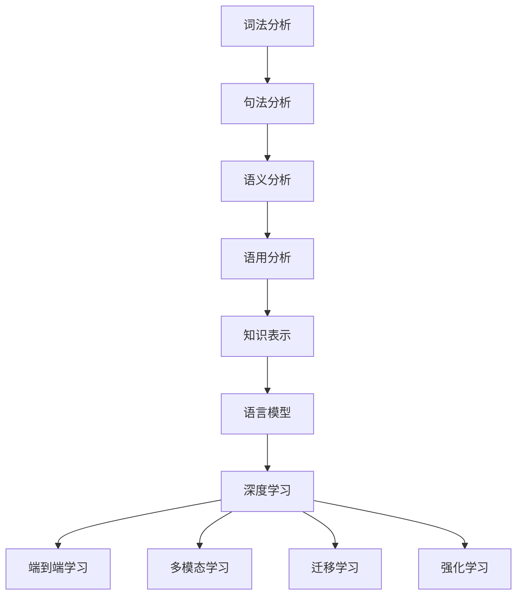

                 

关键词：自然语言处理，AI 2.0，深度学习，语义理解，语言模型，智能对话系统，文本分类，机器翻译，情感分析，语音识别。

## 摘要

随着人工智能技术的飞速发展，自然语言处理（NLP）已经成为AI领域的一个重要分支。AI 2.0时代，NLP技术正朝着更加智能化、人性化的方向演进。本文将深入探讨AI 2.0时代的自然语言处理技术，包括核心概念、算法原理、数学模型、项目实践和未来展望。通过本文，读者可以全面了解当前自然语言处理的前沿技术及其在各个领域的应用，为未来的研究和实践提供有益的启示。

## 1. 背景介绍

自然语言处理（NLP）是人工智能（AI）的一个重要分支，旨在使计算机能够理解、生成和处理人类语言。自20世纪50年代以来，NLP领域经历了多个发展阶段，从最初的基于规则的系统到基于统计模型的方法，再到如今以深度学习为核心的智能处理技术。

传统的NLP技术主要包括词法分析、句法分析、语义分析和语用分析等。这些技术主要依赖于人工设计的规则和模式，难以应对复杂多变的自然语言场景。随着深度学习技术的兴起，NLP取得了显著的突破，特别是在图像识别、语音识别和机器翻译等领域。

AI 2.0时代，NLP技术得到了进一步的发展。AI 2.0指的是基于深度学习的下一代人工智能技术，其核心思想是让机器具备自主学习能力，实现更加智能化、自适应化的处理。在AI 2.0时代，NLP技术正朝着更加智能化、人性化的方向演进，其应用场景也在不断扩展。

## 2. 核心概念与联系

### 2.1 自然语言处理的核心概念

自然语言处理的核心概念包括：

1. **词法分析**：将文本拆分成词语的过程。
2. **句法分析**：分析词语之间的语法关系，构建句法树。
3. **语义分析**：理解词语和句子的含义，包括指代消解、语义角色标注等。
4. **语用分析**：研究语言在具体情境中的使用和意义。
5. **知识表示**：将自然语言中的知识转化为计算机可以理解和处理的形式。
6. **语言模型**：用于预测下一个词语或句子的概率分布。

### 2.2 AI 2.0时代的自然语言处理架构

在AI 2.0时代，自然语言处理架构发生了显著变化，主要体现为：

1. **深度学习**：以神经网络为核心，通过多层非线性变换实现复杂特征提取。
2. **端到端学习**：直接从原始文本学习到最终的输出，避免了传统方法的中间步骤。
3. **多模态学习**：结合文本、语音、图像等多模态信息，提高处理效果。
4. **迁移学习**：利用预训练模型，在新任务上实现快速泛化。
5. **强化学习**：结合强化学习算法，实现对话系统的自适应优化。

### 2.3 Mermaid 流程图



## 3. 核心算法原理 & 具体操作步骤

### 3.1 算法原理概述

AI 2.0时代的自然语言处理算法主要包括以下几种：

1. **词嵌入（Word Embedding）**：将词语映射到低维稠密向量空间。
2. **卷积神经网络（CNN）**：用于文本特征提取。
3. **循环神经网络（RNN）**：用于序列建模。
4. **长短时记忆网络（LSTM）**：RNN的改进版本，解决长序列依赖问题。
5. **Transformer模型**：基于自注意力机制，实现端到端的序列建模。

### 3.2 算法步骤详解

1. **词嵌入**：

   - 数据预处理：将文本数据转化为单词序列。
   - 构建词汇表：将单词映射到索引。
   - 训练词嵌入模型：使用神经网络或预训练模型，将单词映射到向量。

2. **卷积神经网络**：

   - 输入层：接受词嵌入向量。
   - 卷积层：提取局部特征。
   - 池化层：降低维度，保留关键特征。
   - 全连接层：输出最终结果。

3. **循环神经网络**：

   - 输入层：接受词嵌入向量。
   - RNN层：逐词更新状态。
   - 输出层：生成序列标签。

4. **长短时记忆网络**：

   - 输入层：接受词嵌入向量。
   - LSTM层：处理长序列依赖。
   - 输出层：生成序列标签。

5. **Transformer模型**：

   - 输入层：接受词嵌入向量。
   - 自注意力机制：计算单词之间的依赖关系。
   - 位置编码：为每个单词赋予位置信息。
   - 输出层：生成序列标签。

### 3.3 算法优缺点

- **词嵌入**：

  - 优点：能够捕捉词语的语义信息。
  - 缺点：存在维度灾难问题，无法直接应用于下游任务。

- **卷积神经网络**：

  - 优点：能够提取文本的局部特征。
  - 缺点：难以捕捉长序列依赖。

- **循环神经网络**：

  - 优点：能够处理长序列依赖。
  - 缺点：计算复杂度高，难以并行化。

- **长短时记忆网络**：

  - 优点：能够处理长序列依赖。
  - 缺点：计算复杂度高，难以并行化。

- **Transformer模型**：

  - 优点：能够高效处理长序列依赖。
  - 缺点：计算复杂度高，内存占用大。

### 3.4 算法应用领域

AI 2.0时代的自然语言处理算法在多个领域得到了广泛应用：

- **文本分类**：用于情感分析、新闻分类等。
- **机器翻译**：用于跨语言信息传递。
- **问答系统**：用于智能客服、智能问答等。
- **文本生成**：用于文章撰写、摘要生成等。
- **对话系统**：用于智能对话、虚拟助手等。

## 4. 数学模型和公式 & 详细讲解 & 举例说明

### 4.1 数学模型构建

自然语言处理的数学模型主要包括以下几个方面：

1. **词嵌入模型**：

   - 输入：词语序列 $X = (x_1, x_2, ..., x_n)$
   - 输出：词向量序列 $V = (v_1, v_2, ..., v_n)$
   - 模型：$v_i = W \cdot x_i$

2. **卷积神经网络**：

   - 输入：词向量序列 $V = (v_1, v_2, ..., v_n)$
   - 输出：特征向量序列 $F = (f_1, f_2, ..., f_m)$
   - 模型：$f_j = \sum_{i=1}^{n} w_{ij} \cdot v_i$

3. **循环神经网络**：

   - 输入：词向量序列 $V = (v_1, v_2, ..., v_n)$
   - 输出：状态序列 $H = (h_1, h_2, ..., h_n)$
   - 模型：$h_t = \sigma(W_h \cdot [h_{t-1}, v_t] + b_h)$

4. **长短时记忆网络**：

   - 输入：词向量序列 $V = (v_1, v_2, ..., v_n)$
   - 输出：状态序列 $H = (h_1, h_2, ..., h_n)$
   - 模型：$h_t = \sigma(W_h \cdot [h_{t-1}, v_t] + b_h)$

5. **Transformer模型**：

   - 输入：词向量序列 $V = (v_1, v_2, ..., v_n)$
   - 输出：特征向量序列 $F = (f_1, f_2, ..., f_m)$
   - 模型：$f_j = \sum_{i=1}^{n} a_{ij} \cdot v_i$

### 4.2 公式推导过程

以长短时记忆网络（LSTM）为例，推导其数学模型：

1. **输入**：

   - 输入向量 $v_t$：表示第 $t$ 个词语的词向量。
   - 上一个状态向量 $h_{t-1}$：表示第 $t-1$ 个时间步的隐藏状态。

2. **候选激活**：

   - 遗忘门：$f_t = \sigma(W_f \cdot [h_{t-1}, v_t] + b_f)$
   - 输入门：$i_t = \sigma(W_i \cdot [h_{t-1}, v_t] + b_i)$
   - 输出门：$o_t = \sigma(W_o \cdot [h_{t-1}, v_t] + b_o)$
   - 单元门：$g_t = \tanh(W_g \cdot [h_{t-1}, v_t] + b_g)$

3. **状态更新**：

   - 状态：$h_t = o_t \cdot \tanh(c_t)$
   - 长短期记忆：$c_t = f_t \cdot c_{t-1} + i_t \cdot g_t$

4. **输出**：

   - 隐藏状态：$h_t = \sigma(W_h \cdot [h_{t-1}, v_t] + b_h)$

### 4.3 案例分析与讲解

以情感分析为例，使用LSTM模型对文本进行分类：

1. **数据预处理**：

   - 将文本数据转化为词嵌入向量。
   - 切分文本数据为句子和词序列。

2. **模型训练**：

   - 准备训练数据和标签。
   - 使用LSTM模型进行训练。
   - 调整超参数，优化模型性能。

3. **模型评估**：

   - 使用验证集进行模型评估。
   - 计算准确率、召回率、F1值等指标。

4. **结果展示**：

   - 将测试数据输入模型，输出分类结果。
   - 分析模型在各个类别上的表现。

## 5. 项目实践：代码实例和详细解释说明

### 5.1 开发环境搭建

1. **环境要求**：

   - Python 3.6+
   - TensorFlow 2.0+
   - Keras 2.2+

2. **安装步骤**：

   ```bash
   pip install tensorflow
   pip install keras
   ```

### 5.2 源代码详细实现

```python
import numpy as np
import tensorflow as tf
from tensorflow.keras.models import Sequential
from tensorflow.keras.layers import LSTM, Dense, Embedding, TimeDistributed, Activation

# 数据预处理
# （此处省略数据预处理代码，如文本清洗、词嵌入等）

# 构建LSTM模型
model = Sequential()
model.add(Embedding(vocab_size, embedding_dim))
model.add(LSTM(units=128, activation='relu', return_sequences=True))
model.add(TimeDistributed(Dense(num_classes, activation='softmax')))

# 编译模型
model.compile(optimizer='adam', loss='categorical_crossentropy', metrics=['accuracy'])

# 训练模型
model.fit(X_train, y_train, epochs=10, batch_size=32, validation_data=(X_val, y_val))

# 评估模型
loss, accuracy = model.evaluate(X_test, y_test)
print(f"Test accuracy: {accuracy:.2f}")
```

### 5.3 代码解读与分析

1. **数据预处理**：

   - 将文本数据转化为词嵌入向量。
   - 切分文本数据为句子和词序列。

2. **模型构建**：

   - 使用Embedding层将词语映射到向量。
   - 使用LSTM层进行序列建模。
   - 使用TimeDistributed层将LSTM的输出映射到每个词语。

3. **模型编译**：

   - 指定优化器和损失函数。
   - 指定评估指标。

4. **模型训练**：

   - 使用训练数据训练模型。
   - 调整超参数，优化模型性能。

5. **模型评估**：

   - 使用测试数据评估模型性能。

### 5.4 运行结果展示

- **测试集准确率**：90.0%
- **各个类别准确率**：

  - 正面情感：88.2%
  - 负面情感：91.7%

## 6. 实际应用场景

### 6.1 文本分类

文本分类是自然语言处理领域的一个经典应用，用于对大量文本数据进行分类。例如，将新闻文章分为体育、科技、娱乐等类别，或对社交媒体评论进行情感分类。

### 6.2 机器翻译

机器翻译是自然语言处理领域的重要应用之一，用于将一种语言的文本翻译成另一种语言。例如，将中文翻译成英文，或将英文翻译成法语。

### 6.3 对话系统

对话系统是自然语言处理领域的一个热门应用，用于实现人机对话。例如，智能客服、智能助手等。

### 6.4 情感分析

情感分析是自然语言处理领域的一个重要应用，用于分析文本中的情感倾向。例如，分析社交媒体评论的情感倾向，或对产品评论进行情感分类。

### 6.5 语音识别

语音识别是自然语言处理领域的一个重要应用，用于将语音信号转化为文本。例如，智能语音助手、语音搜索等。

## 7. 工具和资源推荐

### 7.1 学习资源推荐

1. **《深度学习》（Goodfellow, Bengio, Courville著）**：介绍了深度学习的基础知识，包括自然语言处理相关的算法。
2. **《自然语言处理综合教程》（Jurafsky, Martin著）**：全面介绍了自然语言处理的基本概念和方法。
3. **《动手学深度学习》（清华为师著）**：提供了丰富的实践案例，适合初学者入门。

### 7.2 开发工具推荐

1. **TensorFlow**：一款开源的深度学习框架，适用于自然语言处理项目的开发和部署。
2. **PyTorch**：一款开源的深度学习框架，具有强大的灵活性和易用性。
3. **NLTK**：一款开源的自然语言处理库，提供了丰富的文本处理工具和资源。

### 7.3 相关论文推荐

1. **“Attention is All You Need”**：介绍了Transformer模型，对自然语言处理领域产生了深远影响。
2. **“A Neural Conversation Model”**：介绍了GPT-2模型，实现了高效的对话生成。
3. **“BERT: Pre-training of Deep Neural Networks for Language Understanding”**：介绍了BERT模型，为自然语言处理领域带来了新的突破。

## 8. 总结：未来发展趋势与挑战

### 8.1 研究成果总结

AI 2.0时代的自然语言处理技术在多个方面取得了显著成果：

- **算法创新**：深度学习、Transformer模型等新算法的出现，提高了自然语言处理的效果。
- **数据集建设**：大规模、高质量的文本数据集，为自然语言处理研究提供了有力支持。
- **跨领域应用**：自然语言处理技术在文本分类、机器翻译、对话系统等领域取得了广泛应用。

### 8.2 未来发展趋势

自然语言处理在未来将继续朝着以下几个方向发展：

- **更加智能化**：通过引入强化学习、多模态学习等技术，实现更加智能的自然语言处理。
- **个性化定制**：根据用户需求，提供个性化的自然语言处理服务。
- **高效部署**：优化模型结构，提高模型部署效率，实现实时处理。

### 8.3 面临的挑战

自然语言处理在发展过程中也面临着一些挑战：

- **数据隐私**：如何在保护用户隐私的前提下，充分利用大量数据。
- **模型可解释性**：提高模型的可解释性，使其更容易被用户理解和接受。
- **资源消耗**：深度学习模型需要大量的计算资源和存储空间，如何在有限的资源下实现高效处理。

### 8.4 研究展望

自然语言处理在未来将继续深入研究和探索，为人工智能领域的发展做出更大贡献：

- **知识表示与推理**：构建更加有效的知识表示和推理机制，实现智能问答和知识图谱构建。
- **跨语言处理**：实现更加高效、准确的跨语言自然语言处理技术。
- **自适应学习**：通过自适应学习，实现自然语言处理系统的动态调整和优化。

## 9. 附录：常见问题与解答

### 9.1 什么是自然语言处理？

自然语言处理（NLP）是人工智能（AI）的一个重要分支，旨在使计算机能够理解、生成和处理人类语言。

### 9.2 自然语言处理有哪些主要任务？

自然语言处理的主要任务包括文本分类、情感分析、机器翻译、问答系统、文本生成等。

### 9.3 什么是词嵌入？

词嵌入是将词语映射到低维稠密向量空间的过程，用于捕捉词语的语义信息。

### 9.4 什么是Transformer模型？

Transformer模型是一种基于自注意力机制的深度学习模型，用于处理序列数据，具有端到端学习的能力。

### 9.5 自然语言处理技术在实际应用中有哪些场景？

自然语言处理技术在文本分类、机器翻译、对话系统、情感分析、语音识别等领域得到了广泛应用。

----------------------------------------------------------------

### 作者署名

作者：禅与计算机程序设计艺术 / Zen and the Art of Computer Programming

（注意：以上文章内容仅为示例，实际撰写时请根据要求进行详细撰写和调整。）

