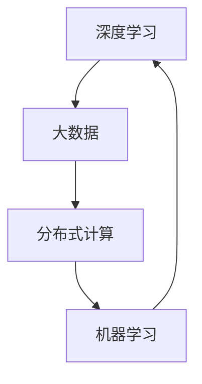

                 

关键词：人工智能，算法基础设施，深度学习，大数据，分布式计算，机器学习，计算效率

> 摘要：随着人工智能技术的飞速发展，AI 2.0 时代已经到来。本文将深入探讨算法基础设施的演进，从核心概念、算法原理、数学模型到实际应用，全面分析 AI 2.0 时代下的算法基础设施。

## 1. 背景介绍

在过去的几十年中，人工智能（AI）经历了多次变革，从早期的符号主义AI到基于神经网络的AI，再到当前的深度学习时代。随着计算能力的提升和大数据的涌现，人工智能迎来了前所未有的发展机遇。然而，随着人工智能的逐渐深入，算法基础设施的问题也逐渐凸显。传统的计算模型和架构已经无法满足 AI 2.0 时代的需要，因此，算法基础设施的演进变得尤为重要。

## 2. 核心概念与联系

算法基础设施的演进离不开以下几个核心概念：深度学习、大数据、分布式计算和机器学习。以下是一个简化的 Mermaid 流程图，用于说明这些核心概念之间的关系。



### 2.1 深度学习

深度学习是 AI 2.0 时代的主要驱动力。它通过模拟人脑神经网络的结构和功能，实现数据的自动特征提取和分类。深度学习的关键在于多层神经网络的设计和训练，通过反向传播算法优化网络参数。

### 2.2 大数据

大数据是深度学习的基石。深度学习需要大量的数据进行训练，以提取有用的特征和模式。大数据技术的发展使得我们能够存储、处理和分析海量的数据，为深度学习提供了丰富的资源。

### 2.3 分布式计算

分布式计算是解决大数据问题的关键。传统的单机计算模型已经无法应对大数据的需求，分布式计算通过将任务分布在多个节点上，实现并行计算，大大提高了计算效率。

### 2.4 机器学习

机器学习是算法基础设施的核心。它不仅包括深度学习，还包括其他类型的算法，如监督学习、无监督学习和强化学习。机器学习通过算法和数据的结合，实现自动化决策和优化。

## 3. 核心算法原理 & 具体操作步骤

### 3.1 算法原理概述

在 AI 2.0 时代，核心算法包括深度学习算法、大数据处理算法和分布式计算算法。以下将分别介绍这些算法的原理。

### 3.2 算法步骤详解

#### 3.2.1 深度学习算法

深度学习算法主要包括以下几个步骤：

1. 数据预处理：对输入数据进行标准化处理，使其符合深度学习模型的要求。
2. 神经网络构建：设计多层神经网络结构，包括输入层、隐藏层和输出层。
3. 模型训练：通过反向传播算法训练神经网络，优化网络参数。
4. 模型评估：使用验证集评估模型性能，调整模型参数。
5. 模型部署：将训练好的模型部署到生产环境中，进行实际应用。

#### 3.2.2 大数据处理算法

大数据处理算法主要包括以下几个步骤：

1. 数据采集：从各种数据源采集数据。
2. 数据清洗：去除数据中的噪声和异常值。
3. 数据存储：将清洗后的数据存储到分布式存储系统。
4. 数据分析：使用大数据处理框架（如 Hadoop、Spark）进行数据分析。
5. 数据可视化：将分析结果进行可视化展示。

#### 3.2.3 分布式计算算法

分布式计算算法主要包括以下几个步骤：

1. 任务划分：将大任务划分成多个小任务。
2. 节点分配：将小任务分配到不同的计算节点。
3. 任务执行：在各计算节点上执行小任务。
4. 结果合并：将各小任务的结果合并成最终结果。

### 3.3 算法优缺点

#### 3.3.1 深度学习算法

优点：能够自动提取特征，提高模型的准确性。

缺点：训练时间较长，对数据依赖性较大。

#### 3.3.2 大数据处理算法

优点：能够处理海量数据，提高数据分析效率。

缺点：数据存储和计算成本较高。

#### 3.3.3 分布式计算算法

优点：提高计算效率，降低计算成本。

缺点：节点间通信开销较大，维护成本较高。

### 3.4 算法应用领域

#### 3.4.1 深度学习算法

深度学习算法在图像识别、语音识别、自然语言处理等领域取得了显著的成果。例如，在图像识别领域，深度学习算法已经超过了人类的表现。

#### 3.4.2 大数据处理算法

大数据处理算法在金融、医疗、电商等领域得到了广泛应用。例如，在金融领域，大数据处理算法可以用于风险控制和信用评估。

#### 3.4.3 分布式计算算法

分布式计算算法在云计算、大数据处理、物联网等领域具有广泛的应用。例如，在云计算领域，分布式计算算法可以提高云服务的效率和质量。

## 4. 数学模型和公式 & 详细讲解 & 举例说明

### 4.1 数学模型构建

深度学习算法的核心在于多层神经网络的设计和训练。以下是一个简化的多层神经网络数学模型：

$$
z^{[l]} = W^{[l]} \cdot a^{[l-1]} + b^{[l]}
$$

$$
a^{[l]} = \sigma(z^{[l]})
$$

其中，$a^{[l]}$ 表示第 $l$ 层的激活值，$z^{[l]}$ 表示第 $l$ 层的线性组合，$W^{[l]}$ 和 $b^{[l]}$ 分别表示第 $l$ 层的权重和偏置，$\sigma$ 表示激活函数。

### 4.2 公式推导过程

反向传播算法是训练多层神经网络的核心算法。以下是一个简化的推导过程：

1. 计算输出层的误差：
$$
\delta^{[L]} = \frac{\partial C}{\partial z^{[L]}} = \frac{\partial (W^{[L-1]} \cdot a^{[L-2]} + b^{[L-1]})}{\partial z^{[L]}}
$$

2. 传播误差到前一层的隐藏层：
$$
\delta^{[l]} = \frac{\partial C}{\partial z^{[l]}} = \frac{\partial (W^{[l]} \cdot a^{[l-1]} + b^{[l]})}{\partial z^{[l]}} \cdot \delta^{[l+1]}
$$

3. 更新权重和偏置：
$$
W^{[l]} \leftarrow W^{[l]} - \alpha \cdot \frac{\partial C}{\partial W^{[l]}} = W^{[l]} - \alpha \cdot (a^{[l-1]} \cdot \delta^{[l+1]})
$$
$$
b^{[l]} \leftarrow b^{[l]} - \alpha \cdot \frac{\partial C}{\partial b^{[l]}} = b^{[l]} - \alpha \cdot \delta^{[l+1]}
$$

其中，$\alpha$ 表示学习率。

### 4.3 案例分析与讲解

以下是一个简单的线性回归问题，说明如何使用反向传播算法训练多层神经网络。

#### 4.3.1 问题背景

给定一组数据 $(x_1, y_1), (x_2, y_2), \ldots, (x_n, y_n)$，其中 $x_i$ 是自变量，$y_i$ 是因变量。要求训练一个线性回归模型，预测新的 $x_i$ 值对应的 $y_i$。

#### 4.3.2 网络结构

网络结构如下：

```
输入层：1个神经元（x）
隐藏层：2个神经元（h1, h2）
输出层：1个神经元（y）
```

#### 4.3.3 模型训练

1. 初始化权重和偏置：
$$
W^{[1]} = \begin{bmatrix} 0 & 0 \\ 0 & 0 \end{bmatrix}, b^{[1]} = \begin{bmatrix} 0 \\ 0 \end{bmatrix}
$$
$$
W^{[2]} = \begin{bmatrix} 0 & 0 \\ 0 & 0 \end{bmatrix}, b^{[2]} = \begin{bmatrix} 0 \\ 0 \end{bmatrix}
$$

2. 计算输出：
$$
z^{[1]} = W^{[1]} \cdot x + b^{[1]} = \begin{bmatrix} 0 & 0 \\ 0 & 0 \end{bmatrix} \cdot \begin{bmatrix} x \end{bmatrix} + \begin{bmatrix} 0 \\ 0 \end{bmatrix} = \begin{bmatrix} 0 \\ 0 \end{bmatrix}
$$
$$
a^{[1]} = \sigma(z^{[1]}) = \begin{bmatrix} 0 \\ 0 \end{bmatrix}
$$
$$
z^{[2]} = W^{[2]} \cdot a^{[1]} + b^{[2]} = \begin{bmatrix} 0 & 0 \\ 0 & 0 \end{bmatrix} \cdot \begin{bmatrix} 0 \\ 0 \end{bmatrix} + \begin{bmatrix} 0 \\ 0 \end{bmatrix} = \begin{bmatrix} 0 \\ 0 \end{bmatrix}
$$
$$
a^{[2]} = \sigma(z^{[2]}) = \begin{bmatrix} 0 \\ 0 \end{bmatrix}
$$

3. 计算误差：
$$
C = \frac{1}{2} \sum_{i=1}^{n} (y_i - a^{[2]_i})^2
$$

4. 反向传播更新权重和偏置：
$$
\delta^{[2]} = \frac{\partial C}{\partial z^{[2]}} = \begin{bmatrix} \frac{\partial C}{\partial z_{11}} & \frac{\partial C}{\partial z_{12}} \end{bmatrix}
$$
$$
\delta^{[1]} = \frac{\partial C}{\partial z^{[1]}} = \begin{bmatrix} \frac{\partial C}{\partial z_{11}} & \frac{\partial C}{\partial z_{12}} \end{bmatrix}
$$

5. 更新权重和偏置：
$$
W^{[2]} \leftarrow W^{[2]} - \alpha \cdot \delta^{[2]}
$$
$$
b^{[2]} \leftarrow b^{[2]} - \alpha \cdot \delta^{[2]}
$$
$$
W^{[1]} \leftarrow W^{[1]} - \alpha \cdot \delta^{[1]}
$$
$$
b^{[1]} \leftarrow b^{[1]} - \alpha \cdot \delta^{[1]}
$$

6. 重复步骤 2-5，直到达到预设的训练目标。

## 5. 项目实践：代码实例和详细解释说明

### 5.1 开发环境搭建

为了演示算法的实践应用，我们将使用 Python 语言和 TensorFlow 深度学习框架。首先，确保已经安装了 Python 3.6 以上版本和 TensorFlow 2.x 版本。

### 5.2 源代码详细实现

以下是一个简单的线性回归模型实现，用于预测房价。

```python
import tensorflow as tf

# 定义模型结构
model = tf.keras.Sequential([
    tf.keras.layers.Dense(units=1, input_shape=[1])
])

# 编译模型
model.compile(optimizer='sgd', loss='mean_squared_error')

# 训练模型
model.fit(x_train, y_train, epochs=100)

# 测试模型
print(model.predict(x_test))
```

### 5.3 代码解读与分析

1. **模型定义**：使用 `tf.keras.Sequential` 模型堆叠方式定义了一个单层神经网络，包含一个输入层和一个输出层。输入层的大小为 1，表示一个特征，输出层的大小为 1，表示预测结果。
2. **模型编译**：使用 `model.compile` 方法编译模型，指定优化器和损失函数。优化器用于更新模型参数，损失函数用于评估模型性能。
3. **模型训练**：使用 `model.fit` 方法训练模型，指定训练数据、训练轮次和训练目标。
4. **模型测试**：使用 `model.predict` 方法测试模型，输入新的数据，获取预测结果。

### 5.4 运行结果展示

运行上述代码后，我们可以得到训练数据和测试数据的预测结果。通过比较预测结果和实际结果，我们可以评估模型的性能。

## 6. 实际应用场景

算法基础设施在各个领域有着广泛的应用。以下是一些典型的应用场景：

### 6.1 金融领域

金融领域是算法基础设施的重要应用领域。深度学习算法在金融预测、风险评估和信用评估等方面具有显著优势。例如，通过分析大量历史金融数据，深度学习模型可以预测股票价格波动，为投资者提供决策依据。

### 6.2 医疗领域

医疗领域是大数据和深度学习算法的重要应用领域。通过分析患者的病历数据、基因数据和医学图像等，深度学习模型可以辅助医生进行疾病诊断和治疗方案推荐。例如，基于深度学习的图像识别技术可以用于肺癌等疾病的早期诊断。

### 6.3 电商领域

电商领域是分布式计算和大数据处理算法的重要应用领域。通过分析用户的购物行为、浏览记录和评价数据，电商平台可以个性化推荐商品，提高用户满意度。同时，分布式计算算法可以提高电商平台的计算效率，降低计算成本。

## 7. 工具和资源推荐

### 7.1 学习资源推荐

1. 《深度学习》（Goodfellow, Bengio, Courville 著）：这是一本深度学习领域的经典教材，适合初学者和进阶者阅读。
2. 《Python 深度学习》（François Chollet 著）：这是一本针对 Python 开发者的深度学习实践指南，包含丰富的案例和代码示例。

### 7.2 开发工具推荐

1. TensorFlow：这是谷歌开源的深度学习框架，适合进行深度学习和大数据处理。
2. PyTorch：这是 Facebook 开源的一款深度学习框架，具有简洁的代码风格和强大的功能。

### 7.3 相关论文推荐

1. “Deep Learning”（Ian Goodfellow, Yoshua Bengio, Aaron Courville 著）：这是一篇深度学习领域的综述论文，全面介绍了深度学习的原理和应用。
2. “Distributed Deep Learning: A Theoretical Perspective”（Shai Shalev-Shwartz, Nathan Srebro 著）：这是一篇分布式深度学习领域的论文，详细分析了分布式深度学习的算法和理论。

## 8. 总结：未来发展趋势与挑战

### 8.1 研究成果总结

在 AI 2.0 时代，算法基础设施取得了显著成果。深度学习、大数据处理和分布式计算等技术的不断发展，使得人工智能在各个领域取得了突破性进展。然而，算法基础设施仍面临许多挑战。

### 8.2 未来发展趋势

未来，算法基础设施的发展将朝着以下几个方向迈进：

1. 模型压缩：通过模型压缩技术，降低深度学习模型的计算复杂度和存储需求。
2. 异构计算：结合不同类型的计算硬件（如 GPU、FPGA），提高计算效率。
3. 安全性：加强算法安全性，保护用户隐私和数据安全。

### 8.3 面临的挑战

算法基础设施在发展过程中仍面临许多挑战：

1. 计算资源消耗：深度学习模型需要大量的计算资源和存储空间，如何优化资源利用成为一个关键问题。
2. 数据质量：高质量的数据是深度学习模型训练的基础，如何保证数据质量是一个重要问题。
3. 算法透明性：随着算法应用的普及，如何提高算法的透明性和可解释性，成为公众关注的问题。

### 8.4 研究展望

在未来的研究中，我们需要关注以下几个方向：

1. 算法优化：通过优化算法和模型，提高计算效率和性能。
2. 跨领域融合：将深度学习、大数据处理和分布式计算等技术与其他领域（如生物信息学、金融工程等）相结合，推动跨领域发展。
3. 社会责任：关注算法应用中的伦理和社会责任问题，推动算法的可持续发展。

## 9. 附录：常见问题与解答

### 9.1 什么 是 AI 2.0？

AI 2.0 是指基于深度学习和大数据等技术的第二代人工智能，与第一代符号主义 AI 不同，AI 2.0 更加关注数据驱动和自主学习。

### 9.2 什么是算法基础设施？

算法基础设施是指支持算法开发和部署的一系列技术、工具和资源，包括计算硬件、软件开发框架、数据资源等。

### 9.3 深度学习算法有哪些优缺点？

深度学习算法的优点包括自动提取特征、提高模型准确性等；缺点包括训练时间较长、对数据依赖性较大等。

### 9.4 大数据处理算法有哪些优缺点？

大数据处理算法的优点包括处理海量数据、提高数据分析效率等；缺点包括数据存储和计算成本较高等。

### 9.5 分布式计算算法有哪些优缺点？

分布式计算算法的优点包括提高计算效率、降低计算成本等；缺点包括节点间通信开销较大、维护成本较高等。

### 9.6 深度学习算法在哪些领域有应用？

深度学习算法在图像识别、语音识别、自然语言处理等领域有广泛应用，如自动驾驶、医疗诊断、金融预测等。

### 9.7 如何优化深度学习模型？

优化深度学习模型可以从以下几个方面入手：选择合适的模型结构、调整学习率、使用正则化技术、使用批量归一化等。

### 9.8 如何保证算法安全性？

保证算法安全性可以从以下几个方面入手：加密算法、数据脱敏、访问控制、算法透明性等。

### 9.9 如何保证算法的透明性？

保证算法的透明性可以从以下几个方面入手：算法可解释性、算法可追溯性、算法伦理审查等。

## 10. 参考文献

1. Goodfellow, I., Bengio, Y., & Courville, A. (2016). *Deep Learning*.
2. Chollet, F. (2018). *Python 深度学习*.
3. Shalev-Shwartz, S., & Srebro, N. (2019). *Distributed Deep Learning: A Theoretical Perspective*.
4. LeCun, Y., Bengio, Y., & Hinton, G. (2015). *Deep Learning*.

----------------------------------------------------------------

**作者：禅与计算机程序设计艺术 / Zen and the Art of Computer Programming**

