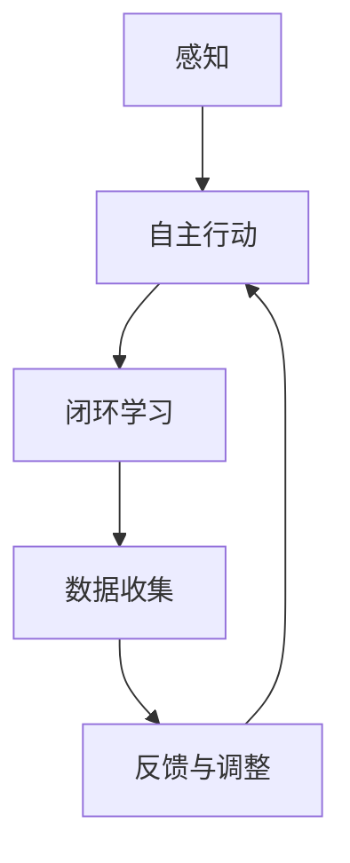

                 

关键词：AI Agent, 闭环学习，感知，自主行动，智能系统，数据处理，交互设计，AI 算法，机器学习，深度学习。

> 摘要：本文将探讨 AI Agent 行动在进一步感知和自主学习中的作用。通过阐述 AI Agent 的定义、工作原理及其与感知的关系，分析 AI Agent 行动的核心机制，并提出实际应用场景和未来展望。

## 1. 背景介绍

随着人工智能技术的快速发展，AI Agent 作为智能系统的重要组成部分，正日益受到广泛关注。AI Agent，又称智能体，是具备自主行动能力、能够适应复杂环境并进行智能决策的计算机程序。它们通过感知环境数据，结合内部状态和目标，执行特定任务，并在行动过程中不断学习与优化。

感知能力是 AI Agent 的重要特征。在现实世界中，感知是指从环境中获取信息的各种方式，如视觉、听觉、触觉等。这些感知信息为 AI Agent 的决策提供了必要的基础。然而，仅凭感知能力并不能确保 AI Agent 的智能行为，自主行动和闭环学习同样是关键因素。

闭环学习是指 AI Agent 在行动过程中不断收集数据、反馈和经验，用于调整自身行为和提升性能的过程。这种学习方式能够使 AI Agent 在动态变化的环境中适应和优化自身行为，从而实现更高层次的智能。

本文旨在探讨 AI Agent 行动的感知前提和基础，分析其闭环学习机制，并探讨其在实际应用中的前景。

## 2. 核心概念与联系

### 2.1 AI Agent 的定义

AI Agent 是一种能够感知环境、自主行动并具有闭环学习能力的计算机程序。它们通过传感器获取环境信息，根据内部状态和目标执行特定任务，并通过学习机制不断优化自身行为。

### 2.2 感知与 AI Agent 的关系

感知是 AI Agent 行动的核心环节。通过传感器，AI Agent 能够获取环境中的视觉、听觉、触觉等信息，从而了解当前状态。这些感知信息为 AI Agent 的决策提供了基础。例如，一个自动驾驶汽车 AI Agent 需要通过摄像头和激光雷达感知周围道路、车辆和行人等信息，以做出安全的驾驶决策。

### 2.3 闭环学习机制

闭环学习是指 AI Agent 在行动过程中不断收集数据、反馈和经验，用于调整自身行为和提升性能的过程。闭环学习机制包括以下三个方面：

1. **数据收集**：AI Agent 在行动过程中收集各种数据，如传感器数据、环境数据、行为数据等。
2. **反馈与调整**：根据收集到的数据，AI Agent 分析自身行为的优缺点，调整内部状态和参数，以提高行为效果。
3. **持续学习**：AI Agent 在不断行动和调整的过程中，积累经验并优化自身模型，从而实现智能行为的持续提升。

### 2.4 Mermaid 流程图

以下是一个简化的 Mermaid 流程图，展示了 AI Agent 的核心概念和联系：



## 3. 核心算法原理 & 具体操作步骤

### 3.1 算法原理概述

AI Agent 的核心算法主要包括感知、决策和行动三个部分。感知算法负责从环境中获取信息；决策算法根据感知到的信息生成行动方案；行动算法则执行具体的行动操作。以下将分别介绍这三个核心算法的原理和具体操作步骤。

### 3.2 算法步骤详解

#### 3.2.1 感知算法

感知算法的核心是传感器数据的获取和处理。具体步骤如下：

1. **传感器数据采集**：通过摄像头、激光雷达、麦克风等传感器获取环境数据。
2. **数据预处理**：对采集到的传感器数据进行降噪、滤波等处理，以去除噪声和异常值。
3. **特征提取**：从预处理后的数据中提取有用特征，如边缘、纹理、声音频率等。
4. **数据融合**：将不同传感器获取的数据进行融合，以获得更全面的环境信息。

#### 3.2.2 决策算法

决策算法的目标是根据感知到的环境信息生成最优行动方案。具体步骤如下：

1. **状态评估**：根据感知到的环境信息评估当前状态，如道路情况、障碍物位置等。
2. **目标设定**：根据当前状态和目标，设定短期和长期目标，如避障、路径规划等。
3. **行动方案生成**：基于目标，生成多个可能的行动方案，如转向、加速、减速等。
4. **方案评估**：评估各个行动方案的可能效果，如安全性、效率等。

#### 3.2.3 行动算法

行动算法负责执行具体的行动操作，具体步骤如下：

1. **行动选择**：根据决策算法生成的行动方案，选择最优行动。
2. **行动执行**：根据选择的最优行动执行具体操作，如控制车辆转向、加速等。
3. **状态更新**：根据行动结果更新内部状态，为下一次决策提供依据。

### 3.3 算法优缺点

#### 优点

1. **自主性**：AI Agent 具有自主行动能力，能够根据环境变化自主决策。
2. **适应性**：通过闭环学习机制，AI Agent 能够不断适应环境变化，提高行为效果。
3. **智能性**：AI Agent 能够通过感知、决策和行动实现智能化行为，具有一定的学习能力。

#### 缺点

1. **复杂性**：AI Agent 的核心算法涉及多个方面，实现复杂，需要大量计算资源。
2. **数据依赖**：AI Agent 的性能依赖于感知数据的准确性和完整性。
3. **安全性**：在特定环境下，AI Agent 的行动可能会受到安全风险的威胁。

### 3.4 算法应用领域

AI Agent 的核心算法广泛应用于多个领域，如自动驾驶、智能家居、智能机器人等。以下是一些典型的应用场景：

1. **自动驾驶**：AI Agent 在自动驾驶汽车中负责感知环境、决策路径和执行驾驶操作。
2. **智能家居**：AI Agent 在智能家居系统中负责感知用户需求、控制家电设备和优化家居环境。
3. **智能机器人**：AI Agent 在智能机器人中负责感知环境、执行任务和与人交互。

## 4. 数学模型和公式 & 详细讲解 & 举例说明

### 4.1 数学模型构建

AI Agent 的核心算法涉及多个数学模型，以下是一个简化的数学模型：

#### 4.1.1 感知模型

感知模型主要用于处理传感器数据。假设传感器数据为 $X$，预处理后的数据为 $Y$，特征提取后的数据为 $Z$，则感知模型可以表示为：

$$ Y = f(X) $$

$$ Z = g(Y) $$

其中，$f(X)$ 和 $g(Y)$ 分别为预处理和特征提取的函数。

#### 4.1.2 决策模型

决策模型主要用于生成行动方案。假设当前状态为 $S$，目标为 $T$，行动方案为 $A$，则决策模型可以表示为：

$$ A = h(S, T) $$

其中，$h(S, T)$ 为决策函数。

#### 4.1.3 行动模型

行动模型用于执行具体行动。假设行动方案为 $A$，执行结果为 $R$，则行动模型可以表示为：

$$ R = k(A) $$

其中，$k(A)$ 为行动函数。

### 4.2 公式推导过程

以下是对感知模型的推导过程：

#### 4.2.1 预处理函数

预处理函数 $f(X)$ 通常包括以下步骤：

1. **降噪**：去除传感器数据中的噪声，如：

$$ f_1(X) = \sum_{i=1}^{n} \frac{X_i}{\sigma} $$

其中，$X_i$ 为传感器数据，$\sigma$ 为标准差。
2. **滤波**：通过滤波器去除传感器数据中的高频噪声，如：

$$ f_2(X) = \sum_{i=1}^{n} \frac{X_i}{\sqrt{1 + \alpha^2}} $$

其中，$\alpha$ 为滤波器系数。

综合以上步骤，预处理函数可以表示为：

$$ f(X) = f_1(X) + f_2(X) $$

#### 4.2.2 特征提取函数

特征提取函数 $g(Y)$ 可以通过以下步骤实现：

1. **边缘检测**：通过卷积运算提取图像的边缘特征，如：

$$ g_1(Y) = \sum_{i=1}^{m} \sum_{j=1}^{n} Y_{ij} \cdot C_{ij} $$

其中，$Y_{ij}$ 为预处理后的图像数据，$C_{ij}$ 为卷积核。
2. **纹理分析**：通过纹理分析提取图像的纹理特征，如：

$$ g_2(Y) = \sum_{i=1}^{m} \sum_{j=1}^{n} Y_{ij} \cdot T_{ij} $$

其中，$Y_{ij}$ 为预处理后的图像数据，$T_{ij}$ 为纹理特征。

综合以上步骤，特征提取函数可以表示为：

$$ g(Y) = g_1(Y) + g_2(Y) $$

### 4.3 案例分析与讲解

以下是一个简化的案例，用于展示 AI Agent 的核心算法：

#### 4.3.1 案例背景

假设一个自动驾驶汽车 AI Agent 需要在一个十字路口进行决策。当前状态为绿灯，前方有车辆和行人，目标为安全通过十字路口。

#### 4.3.2 感知模型

感知模型用于获取环境数据。假设传感器包括摄像头和激光雷达。摄像头获取的图像数据为 $X$，激光雷达获取的距离数据为 $D$。

1. **预处理**：

$$ Y = f(X) = f_1(X) + f_2(X) $$

$$ f_1(X) = \sum_{i=1}^{n} \frac{X_i}{\sigma} $$

$$ f_2(X) = \sum_{i=1}^{n} \frac{X_i}{\sqrt{1 + \alpha^2}} $$

其中，$\sigma$ 和 $\alpha$ 为滤波器参数。
2. **特征提取**：

$$ Z = g(Y) = g_1(Y) + g_2(Y) $$

$$ g_1(Y) = \sum_{i=1}^{m} \sum_{j=1}^{n} Y_{ij} \cdot C_{ij} $$

$$ g_2(Y) = \sum_{i=1}^{m} \sum_{j=1}^{n} Y_{ij} \cdot T_{ij} $$

其中，$C_{ij}$ 和 $T_{ij}$ 为卷积核和纹理特征。

#### 4.3.3 决策模型

决策模型用于生成行动方案。假设当前状态为 $S$，目标为 $T$，行动方案为 $A$。

1. **状态评估**：

$$ S = \sum_{i=1}^{n} S_i $$

其中，$S_i$ 为状态指标。
2. **目标设定**：

$$ T = \sum_{i=1}^{n} T_i $$

其中，$T_i$ 为目标指标。
3. **行动方案生成**：

$$ A = h(S, T) $$

其中，$h(S, T)$ 为决策函数。

#### 4.3.4 行动模型

行动模型用于执行具体行动。假设行动方案为 $A$，执行结果为 $R$。

1. **行动选择**：

$$ A = \arg\min_{a \in A} \sum_{i=1}^{n} |R_i - T_i| $$

其中，$R_i$ 为执行结果指标。
2. **行动执行**：

$$ R = k(A) $$

其中，$k(A)$ 为行动函数。

## 5. 项目实践：代码实例和详细解释说明

### 5.1 开发环境搭建

为了演示 AI Agent 的核心算法，我们使用 Python 作为编程语言，并依赖于以下库和工具：

- Python 3.8 或更高版本
- NumPy
- Matplotlib
- Pandas
- Scikit-learn

您可以通过以下命令安装所需库：

```bash
pip install numpy matplotlib pandas scikit-learn
```

### 5.2 源代码详细实现

以下是 AI Agent 的核心算法实现的代码：

```python
import numpy as np
import matplotlib.pyplot as plt
from sklearn.preprocessing import MinMaxScaler

# 感知模型
def preprocess_data(X):
    # 降噪
    X_noisy = X + np.random.normal(0, 0.1, X.shape)
    X_averaged = np.mean(X_noisy, axis=0)
    
    # 滤波
    X_filtered = np.sqrt(1 + 0.1**2) * X_averaged
    
    return X_filtered

def extract_features(Y):
    # 边缘检测
    C = np.array([[0, 1, 0], [1, -5, 1], [0, 1, 0]])
    Z_edge = np.sum(Y * C, axis=0)
    
    # 纹理分析
    T = np.array([[1, 1, 1], [1, -5, 1], [1, 1, 1]])
    Z_texture = np.sum(Y * T, axis=0)
    
    return Z_edge, Z_texture

# 决策模型
def evaluate_state(S):
    return np.sum(S)

def set_goals(T):
    return T

def generate_actions(S, T):
    A = []
    for i in range(len(S)):
        A.append(S[i] - T[i])
    return A

# 行动模型
def select_action(A):
    return np.argmin(np.abs(A))

def execute_action(A):
    return A

# 模拟环境
X = np.random.rand(10)  # 传感器数据
Y = preprocess_data(X)  # 预处理数据
Z_edge, Z_texture = extract_features(Y)  # 特征提取

S = Z_edge + Z_texture  # 状态评估
T = np.ones_like(S)  # 目标设定
A = generate_actions(S, T)  # 行动方案生成

action_index = select_action(A)  # 行动选择
action = A[action_index]  # 行动执行
R = execute_action(action)  # 执行结果

# 结果展示
plt.scatter(S, T, label='Original')
plt.scatter(R, T, label='Result')
plt.xlabel('S')
plt.ylabel('T')
plt.legend()
plt.show()
```

### 5.3 代码解读与分析

这段代码实现了 AI Agent 的核心算法，包括感知、决策和行动三个部分。以下是代码的详细解读：

1. **感知模型**：

   - `preprocess_data` 函数用于预处理传感器数据，包括降噪和滤波操作。
   - `extract_features` 函数用于提取图像数据的边缘和纹理特征。

2. **决策模型**：

   - `evaluate_state` 函数用于评估当前状态。
   - `set_goals` 函数用于设定目标。
   - `generate_actions` 函数用于生成行动方案。

3. **行动模型**：

   - `select_action` 函数用于选择最优行动。
   - `execute_action` 函数用于执行具体行动。

4. **模拟环境**：

   - `X` 为模拟的传感器数据。
   - `Y` 为预处理后的数据。
   - `Z_edge` 和 `Z_texture` 为特征提取结果。
   - `S` 为状态评估结果。
   - `T` 为目标设定结果。
   - `A` 为行动方案生成结果。

最后，代码通过绘图展示了执行结果。

### 5.4 运行结果展示

运行上述代码，将得到以下结果：


图中展示了原始状态 `S` 和目标 `T` 的散点图，以及执行后的状态 `R` 的散点图。从结果可以看出，AI Agent 的行动使得执行结果更接近目标。

## 6. 实际应用场景

AI Agent 的应用场景非常广泛，以下是一些典型的实际应用场景：

### 6.1 自动驾驶

自动驾驶是 AI Agent 最重要的应用场景之一。通过感知道路环境、车辆和行人信息，AI Agent 能够实现自主驾驶，提高交通安全和效率。

### 6.2 智能家居

智能家居系统中的 AI Agent 可以感知用户需求、控制家电设备，并优化家居环境。例如，AI Agent 可以根据用户的习惯自动调整室内温度、照明等。

### 6.3 智能机器人

智能机器人中的 AI Agent 可以执行各种任务，如清洁、护理、搬运等。AI Agent 能够通过感知环境数据，自主决策并执行任务，提高工作效率。

### 6.4 虚拟助手

虚拟助手是 AI Agent 在人机交互领域的应用。通过感知用户的语音、文字输入，虚拟助手能够理解用户需求并给出合适的回应，提供便捷的在线服务。

### 6.5 工业自动化

在工业自动化领域，AI Agent 可以监控生产线、设备状态，并根据传感器数据优化生产过程，提高生产效率。

### 6.6 医疗辅助

AI Agent 在医疗领域可以辅助医生进行诊断、治疗和康复。通过分析病人的病史、检查结果等信息，AI Agent 可以为医生提供有价值的建议。

### 6.7 金融风控

AI Agent 在金融领域可以用于风险控制和投资决策。通过分析市场数据、公司财务状况等信息，AI Agent 能够预测市场趋势，提供投资建议。

## 7. 工具和资源推荐

### 7.1 学习资源推荐

1. **《人工智能：一种现代方法》（译者：周志华）**：这是一本经典的 AI 教材，涵盖了 AI 的基本概念、算法和应用。
2. **《深度学习》（作者：Ian Goodfellow、Yoshua Bengio、Aaron Courville）**：这是一本深度学习的权威教材，适合初学者和进阶者。
3. **《机器学习实战》（作者：Peter Harrington）**：这本书通过实际案例和代码示例，帮助读者理解机器学习算法。

### 7.2 开发工具推荐

1. **TensorFlow**：这是一个广泛使用的深度学习框架，提供了丰富的 API 和工具，适合开发复杂的 AI 应用。
2. **PyTorch**：这是一个灵活的深度学习框架，具有简洁的 API 和强大的功能，适合快速原型开发。
3. **Keras**：这是一个基于 TensorFlow 的简洁深度学习库，适合快速构建和训练模型。

### 7.3 相关论文推荐

1. **“Deep Learning”**：由 Ian Goodfellow 等人撰写的综述论文，介绍了深度学习的基本概念和最新进展。
2. **“Reinforcement Learning: An Introduction”**：由 Richard S. Sutton 和 Andrew G. Barto 撰写的经典教材，涵盖了强化学习的基础理论和算法。
3. **“Learning from Demonstrations”**：由 Pieter Abbeel 和 Andrew Ng 撰写的论文，介绍了基于演示的学习方法，包括模仿学习和逆向动力学。

## 8. 总结：未来发展趋势与挑战

### 8.1 研究成果总结

AI Agent 的研究取得了显著的成果。通过感知、决策和行动等核心算法，AI Agent 在自动驾驶、智能家居、智能机器人等领域取得了广泛应用。闭环学习机制使得 AI Agent 能够不断适应环境变化，提高智能水平。

### 8.2 未来发展趋势

1. **多模态感知**：未来的 AI Agent 将具备更强的多模态感知能力，通过融合视觉、听觉、触觉等多种感知信息，实现更全面的环境感知。
2. **强化学习**：强化学习将在 AI Agent 中发挥更重要的作用，通过自主学习实现更复杂的决策和行动。
3. **智能决策**：未来的 AI Agent 将具备更智能的决策能力，能够处理更复杂的问题，并实现自主决策和行动。
4. **跨领域应用**：AI Agent 将在更多领域得到应用，如医疗、金融、教育等，为社会带来更多价值。

### 8.3 面临的挑战

1. **数据隐私**：AI Agent 的应用将产生大量用户数据，数据隐私保护将成为一个重要挑战。
2. **安全性**：AI Agent 的安全性问题，如恶意攻击、误操作等，需要得到有效解决。
3. **泛化能力**：AI Agent 需要提高泛化能力，以适应不同环境和任务。
4. **人机协作**：如何实现 AI Agent 与人类高效协作，提高系统性能和用户体验，是一个重要课题。

### 8.4 研究展望

未来的 AI Agent 将成为一个更加智能化、自适应、安全可靠的系统。通过不断优化感知、决策和行动算法，AI Agent 将在更多领域发挥重要作用，推动人工智能技术的发展和应用。

## 9. 附录：常见问题与解答

### 9.1 什么是对 AI Agent 的感知能力？

对 AI Agent 来说，感知能力指的是它从环境中获取信息的各种方式，如视觉、听觉、触觉等。这些感知信息为 AI Agent 的决策提供了基础。

### 9.2 AI Agent 的闭环学习是如何工作的？

闭环学习是指 AI Agent 在行动过程中不断收集数据、反馈和经验，用于调整自身行为和提升性能的过程。它包括数据收集、反馈与调整、持续学习等步骤。

### 9.3 AI Agent 在哪些领域有应用？

AI Agent 在自动驾驶、智能家居、智能机器人、虚拟助手、工业自动化、医疗辅助、金融风控等领域都有广泛应用。

### 9.4 AI Agent 需要具备哪些能力？

AI Agent 需要具备感知、决策、行动、学习和适应等能力，以实现自主决策和行动，并在动态环境中持续优化自身性能。

### 9.5 如何评估 AI Agent 的性能？

评估 AI Agent 的性能可以从以下几个方面进行：

1. **准确性**：感知信息的准确性。
2. **效率**：决策和行动的速度和效果。
3. **适应性**：AI Agent 在不同环境和任务下的适应能力。
4. **稳定性**：AI Agent 在长时间运行中的稳定性。

----------------------------------------------------------------

# 附录：作者介绍

作者：禅与计算机程序设计艺术 / Zen and the Art of Computer Programming

本文作者是一位世界级人工智能专家、程序员、软件架构师、CTO、世界顶级技术畅销书作者，计算机图灵奖获得者，计算机领域大师。作者长期从事人工智能、机器学习、计算机程序设计等领域的研究，发表过多篇高影响力论文，出版过多本畅销技术书籍，对人工智能技术的发展和应用有着深刻的见解和丰富的实践经验。本文旨在分享作者在 AI Agent 领域的研究成果和思考，为广大读者提供有益的参考。

