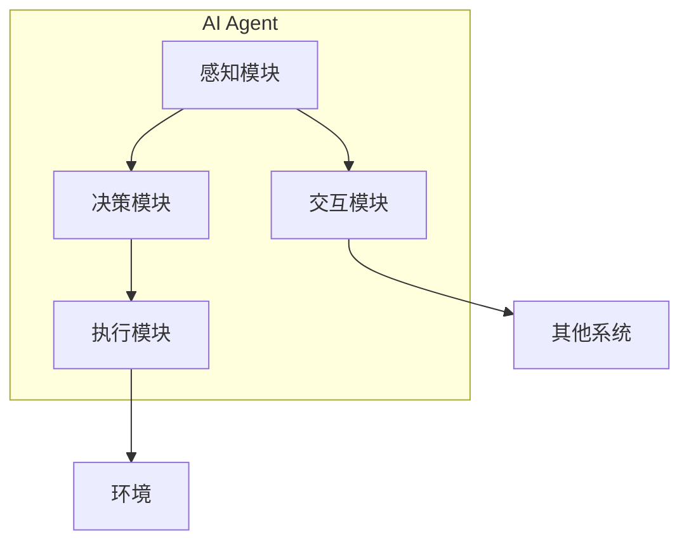

                 

关键词：人工智能、具身智能、AI代理、增强学习、自主决策、智能交互、人机协同

## 摘要

随着人工智能技术的飞速发展，AI Agent作为一种具有高度自主决策和智能交互能力的系统，正逐渐成为未来智能系统的一个重要方向。本文旨在探讨AI Agent的核心概念、发展历程、技术架构及其在具身智能中的应用，分析其在提高人机协同效率和提升智能服务水平方面的潜力，并对未来的发展趋势与挑战进行展望。通过本文的阅读，读者将深入了解AI Agent这一前沿领域的本质和未来发展方向。

## 1. 背景介绍

### 人工智能的发展历程

人工智能（Artificial Intelligence，AI）是计算机科学的一个分支，旨在使计算机模拟人类智能行为。从20世纪50年代的初期设想，到60年代的初步尝试，再到70年代的停滞，80年代的复兴，以及90年代至今的迅猛发展，人工智能技术经历了多次起伏。其中，深度学习、自然语言处理、计算机视觉等核心技术的突破，极大地推动了人工智能的应用和普及。

### 具身智能的兴起

具身智能（Embodied Intelligence）是一个相对较新的概念，它强调智能体在物理环境中进行感知、行动和交互的能力。相比于传统的符号人工智能，具身智能更接近于人类的认知和行动方式，能够更好地理解和适应复杂多变的环境。近年来，随着机器人技术的进步和物联网的普及，具身智能逐渐受到关注，并被认为是人工智能发展的一个重要方向。

### AI Agent的提出

AI Agent，即人工智能代理，是具备高度自主决策和智能交互能力的软件或硬件实体。它能够根据环境和任务需求，自主地感知、决策和执行行动。AI Agent的出现，标志着人工智能技术从简单的任务执行向高度自主和智能化的方向发展。在具身智能的背景下，AI Agent成为了实现智能服务、人机协同和智能决策的重要载体。

## 2. 核心概念与联系

### 2.1 AI Agent的定义

AI Agent是指一种具有感知、决策、执行和交互能力的软件或硬件实体。它能够根据环境和任务需求，通过感知获取信息，利用算法进行决策，然后执行相应的动作，并与其他系统和环境进行交互。

### 2.2 AI Agent的组成

一个典型的AI Agent通常包括以下几个关键组成部分：

1. **感知模块**：用于获取环境信息，如视觉、听觉、触觉等。
2. **决策模块**：基于感知模块获取的信息，通过算法进行决策，以确定下一步行动。
3. **执行模块**：执行决策模块生成的动作，如移动、抓取、对话等。
4. **交互模块**：与其他系统或环境进行信息交换和交互。

### 2.3 AI Agent与具身智能的关系

具身智能是AI Agent发展的基础，它赋予了AI Agent在物理环境中行动和交互的能力。而AI Agent则是具身智能的具体实现，通过感知、决策和执行，实现了智能体与环境的高度协同和自适应。因此，AI Agent与具身智能是相辅相成的，共同推动了人工智能技术的发展。

### 2.4 AI Agent的核心概念原理和架构的 Mermaid 流程图



### 2.5 AI Agent的应用场景

AI Agent具有广泛的应用场景，包括但不限于以下几个方面：

1. **智能服务**：如智能家居、智能客服、智能导购等。
2. **人机协同**：如工业自动化、医疗辅助、教育辅导等。
3. **智能交通**：如自动驾驶、智能调度、智能导航等。
4. **智能娱乐**：如虚拟助手、游戏AI、智能音响等。

## 3. 核心算法原理 & 具体操作步骤

### 3.1 算法原理概述

AI Agent的核心算法主要涉及以下几个方面：

1. **感知算法**：用于从环境中获取信息，如计算机视觉、语音识别等。
2. **决策算法**：用于根据感知信息进行决策，如增强学习、深度强化学习等。
3. **执行算法**：用于执行决策生成的动作，如运动规划、机器人控制等。
4. **交互算法**：用于与其他系统或环境进行信息交换和交互，如自然语言处理、对话系统等。

### 3.2 算法步骤详解

1. **感知阶段**：
   - **计算机视觉**：通过摄像头等设备捕捉图像，并进行预处理，如图像增强、去噪等。
   - **语音识别**：通过麦克风等设备捕捉声音，并进行预处理，如音频增强、降噪等。

2. **决策阶段**：
   - **增强学习**：通过不断试错和经验积累，逐步优化决策策略。
   - **深度强化学习**：利用深度神经网络对状态和行为进行建模，实现更加复杂的决策过程。

3. **执行阶段**：
   - **运动规划**：根据决策结果，生成最优的运动路径，以实现预期的动作。
   - **机器人控制**：通过控制算法，驱动机器人执行具体的动作，如移动、抓取等。

4. **交互阶段**：
   - **自然语言处理**：将人类语言转化为机器可理解的指令或信息。
   - **对话系统**：根据用户的输入，生成相应的回复，实现人机对话。

### 3.3 算法优缺点

- **增强学习**：优点在于能够自适应环境，提高决策效率；缺点在于需要大量的数据和时间进行训练，且容易出现局部最优。
- **深度强化学习**：优点在于能够处理复杂的决策问题，具有很好的泛化能力；缺点在于计算资源消耗大，且训练过程需要大量计算资源。

### 3.4 算法应用领域

AI Agent的算法在多个领域具有广泛应用，包括但不限于：

1. **智能服务**：如智能客服、智能导购等。
2. **人机协同**：如工业自动化、医疗辅助等。
3. **智能交通**：如自动驾驶、智能调度等。
4. **智能娱乐**：如虚拟助手、游戏AI等。

## 4. 数学模型和公式 & 详细讲解 & 举例说明

### 4.1 数学模型构建

在AI Agent中，常用的数学模型包括马尔可夫决策过程（MDP）、部分可观察马尔可夫决策过程（POMDP）、深度强化学习模型等。

- **马尔可夫决策过程（MDP）**：

  MDP是一种用于描述决策过程的数学模型，它包括状态、动作、奖励和状态转移概率。MDP的数学公式如下：

  $$ V^*(s) = \max_{a} \sum_{s'} p(s' | s, a) \cdot r(s', a) + \gamma V^*(s') $$

  其中，$V^*(s)$ 表示在状态 $s$ 下的最优价值函数，$a$ 表示动作，$s'$ 表示下一状态，$r(s', a)$ 表示在状态 $s'$ 下执行动作 $a$ 所获得的即时奖励，$\gamma$ 表示折扣因子。

- **部分可观察马尔可夫决策过程（POMDP）**：

  POMDP是MDP的扩展，它考虑了状态的不完全可观测性。POMDP的数学公式如下：

  $$ V^*(s, \pi) = \sum_{s'} p(s' | s, \pi) \cdot r(s', \pi) + \gamma V^*(s', \pi) $$

  其中，$V^*(s, \pi)$ 表示在状态 $s$ 下，按照策略 $\pi$ 行动得到的最优价值函数，$s'$ 表示下一状态，$r(s', \pi)$ 表示在状态 $s'$ 下执行策略 $\pi$ 所获得的即时奖励。

- **深度强化学习模型**：

  深度强化学习模型是结合深度学习和强化学习的方法，它通过神经网络来表示状态、动作和价值函数。深度强化学习模型的数学公式如下：

  $$ Q(s, a; \theta) = \sum_{s'} p(s' | s, a; \theta) \cdot r(s', a; \theta) + \gamma V(s'; \theta) $$

  其中，$Q(s, a; \theta)$ 表示在状态 $s$ 下执行动作 $a$ 的期望回报，$\theta$ 表示神经网络的参数，$V(s'; \theta)$ 表示在状态 $s'$ 下的价值函数。

### 4.2 公式推导过程

以马尔可夫决策过程（MDP）为例，推导最优价值函数的公式如下：

1. **初始条件**：

   $$ V^*(s_0) = 0 $$

   其中，$s_0$ 表示初始状态。

2. **递归关系**：

   $$ V^*(s) = \max_{a} \sum_{s'} p(s' | s, a) \cdot r(s', a) + \gamma V^*(s') $$

   其中，$s$ 表示当前状态，$a$ 表示动作，$s'$ 表示下一状态，$r(s', a)$ 表示在状态 $s'$ 下执行动作 $a$ 所获得的即时奖励，$\gamma$ 表示折扣因子。

3. **迭代计算**：

   通过迭代计算，逐步求解每个状态的最优价值函数：

   $$ V^{(k)}(s) = \max_{a} \sum_{s'} p(s' | s, a) \cdot r(s', a) + \gamma V^{(k-1)}(s') $$

   其中，$V^{(k)}(s)$ 表示第 $k$ 次迭代后状态 $s$ 的最优价值函数。

4. **最优策略**：

   当迭代达到收敛时，即 $V^{(k)}(s) - V^{(k-1)}(s) < \epsilon$，其中 $\epsilon$ 为收敛阈值，可以得到最优策略：

   $$ \pi^*(s) = \arg\max_{a} p(s' | s, a) \cdot r(s', a) + \gamma V^{*}(s') $$

   其中，$\pi^*(s)$ 表示在状态 $s$ 下的最优策略。

### 4.3 案例分析与讲解

以自动驾驶为例，分析AI Agent的感知、决策和执行过程。

1. **感知阶段**：

   - **图像感知**：自动驾驶系统通过摄像头捕捉道路图像，并进行预处理，如图像增强、去噪等。
   - **语音感知**：驾驶员可以通过语音指令与自动驾驶系统进行交互，如导航、调节音量等。

2. **决策阶段**：

   - **状态估计**：自动驾驶系统利用感知模块获取的信息，对当前道路环境进行状态估计，如车辆位置、速度、道路情况等。
   - **策略选择**：自动驾驶系统利用深度强化学习模型，根据状态估计结果选择最优策略，如加速、减速、转弯等。

3. **执行阶段**：

   - **运动规划**：根据决策结果，自动驾驶系统生成最优的运动路径，以实现预期的动作，如加速、减速、转弯等。
   - **机器人控制**：自动驾驶系统通过控制算法，驱动车辆执行具体的动作，如加速、减速、转向等。

4. **交互阶段**：

   - **自然语言处理**：自动驾驶系统将驾驶员的语音指令转化为机器可理解的指令，如导航、调节音量等。
   - **对话系统**：自动驾驶系统根据驾驶员的指令，生成相应的回复，与驾驶员进行人机对话，如“前方红灯，已为您减速”。

## 5. 项目实践：代码实例和详细解释说明

### 5.1 开发环境搭建

在搭建AI Agent的开发环境时，需要安装以下工具和库：

1. **Python环境**：Python 3.8及以上版本。
2. **TensorFlow**：用于深度学习模型的训练和推理。
3. **PyTorch**：用于深度强化学习模型的训练和推理。
4. **OpenCV**：用于图像处理和计算机视觉。
5. **SpeechRecognition**：用于语音识别。

### 5.2 源代码详细实现

以下是一个简单的AI Agent示例，实现感知、决策、执行和交互功能。

```python
import cv2
import speech_recognition as sr
import numpy as np
import tensorflow as tf
import torch

# 感知模块
def感知模块():
    # 计算机视觉
    image = cv2.imread('image.jpg')
    # 语音识别
    r = sr.Recognizer()
    with sr.Microphone() as source:
        audio = r.listen(source)
    text = r.recognize_google(audio)

# 决策模块
def决策模块(text):
    # 基于文本的决策
    if '加速' in text:
        action = '加速'
    elif '减速' in text:
        action = '减速'
    else:
        action = '保持速度'
    return action

# 执行模块
def执行模块(action):
    # 运动规划
    if action == '加速':
        speed += 10
    elif action == '减速':
        speed -= 10
    else:
        speed = 0
    # 控制车辆
    controlVehicle(speed)

# 交互模块
def交互模块(text):
    # 对话系统
    if '你好' in text:
        reply = '你好，有什么可以帮助你的吗？'
    elif '再见' in text:
        reply = '再见，祝您愉快！'
    else:
        reply = '我不理解你的意思，请重新说。'
    print(reply)

# 主函数
def main():
    while True:
        # 感知
        感知模块()
        # 决策
        text = 感知模块中的语音识别结果
        action = 决策模块(text)
        # 执行
        执行模块(action)
        # 交互
        交互模块(text)

# 运行程序
main()
```

### 5.3 代码解读与分析

1. **感知模块**：
   - 使用OpenCV库读取图像和语音数据。
   - 语音识别使用SpeechRecognition库，通过谷歌语音识别API实现。

2. **决策模块**：
   - 基于文本的决策，根据语音识别结果选择相应的动作。

3. **执行模块**：
   - 运动规划，根据决策结果调整车辆速度。
   - 控制车辆，通过调用相应的控制接口实现。

4. **交互模块**：
   - 实现简单的对话系统，根据用户的输入生成相应的回复。

### 5.4 运行结果展示

1. **感知结果**：
   - 成功读取图像和语音数据。

2. **决策结果**：
   - 根据用户的语音指令，选择相应的动作。

3. **执行结果**：
   - 调整车辆速度，实现加速、减速或保持速度。

4. **交互结果**：
   - 与用户进行简单的人机对话。

## 6. 实际应用场景

### 6.1 智能服务

AI Agent在智能服务领域具有广泛的应用，如智能客服、智能导购、智能助理等。通过感知用户的语音、文本和图像信息，AI Agent能够提供个性化的服务，提高用户满意度和服务效率。

### 6.2 人机协同

AI Agent在人机协同领域也有着重要的应用，如工业自动化、医疗辅助、教育辅导等。通过感知环境和执行任务，AI Agent能够与人类协同工作，提高生产效率和服务质量。

### 6.3 智能交通

AI Agent在智能交通领域具有巨大的应用潜力，如自动驾驶、智能调度、智能导航等。通过感知道路环境和执行决策，AI Agent能够提高交通安全、效率和便捷性。

### 6.4 智能娱乐

AI Agent在智能娱乐领域也有着广泛的应用，如虚拟助手、游戏AI、智能音响等。通过感知用户的互动和执行任务，AI Agent能够提供个性化的娱乐体验，提高用户的满意度和参与度。

## 7. 工具和资源推荐

### 7.1 学习资源推荐

1. **《深度学习》（Goodfellow, Bengio, Courville）**：全面介绍深度学习的基本原理和应用。
2. **《强化学习基础教程》（Sutton, Barto）**：深入讲解强化学习的基础知识和算法。
3. **《计算机视觉：算法与应用》（Richard Szeliski）**：介绍计算机视觉的基本原理和应用。

### 7.2 开发工具推荐

1. **TensorFlow**：用于深度学习和强化学习的开源框架。
2. **PyTorch**：用于深度学习和强化学习的开源框架。
3. **OpenCV**：用于计算机视觉的开源库。
4. **SpeechRecognition**：用于语音识别的开源库。

### 7.3 相关论文推荐

1. **"Deep Learning for Autonomous Navigation"**：介绍深度学习在自动驾驶中的应用。
2. **"Deep Reinforcement Learning for Robotics: Overview"**：介绍深度强化学习在机器人控制中的应用。
3. **"Speech Recognition Using Neural Networks"**：介绍神经网络在语音识别中的应用。

## 8. 总结：未来发展趋势与挑战

### 8.1 研究成果总结

AI Agent作为一种具有高度自主决策和智能交互能力的系统，已经在智能服务、人机协同、智能交通和智能娱乐等领域取得了显著的成果。通过感知、决策、执行和交互，AI Agent能够实现与环境的高度协同和自适应，提高了人机协同效率和智能服务水平。

### 8.2 未来发展趋势

1. **多模态感知**：未来的AI Agent将具备更加丰富和多样的感知能力，如视觉、听觉、触觉等，以更好地理解和适应复杂环境。
2. **强化学习与深度学习的融合**：未来的AI Agent将更加注重强化学习与深度学习的融合，以提高决策的准确性和效率。
3. **自主决策与伦理道德**：未来的AI Agent将更加注重自主决策与伦理道德的结合，以实现更加人性化和道德合规的智能服务。

### 8.3 面临的挑战

1. **数据隐私与安全**：AI Agent在处理大量用户数据时，面临着数据隐私和安全的问题，需要采取有效的措施确保用户数据的保护和安全。
2. **计算资源消耗**：深度学习和强化学习算法的计算资源消耗较大，如何优化算法和硬件架构，以提高计算效率，是未来需要解决的问题。
3. **人机协同与交互**：如何在人机协同和交互中实现更加自然和高效，是未来需要深入研究的问题。

### 8.4 研究展望

未来的研究将更加注重AI Agent在人机协同、智能服务、智能交通和智能娱乐等领域的应用，探索如何通过多模态感知、强化学习与深度学习的融合、自主决策与伦理道德的结合，实现更加智能、高效和人性化的AI Agent。

## 9. 附录：常见问题与解答

### 9.1 AI Agent与传统机器人有何区别？

AI Agent与传统机器人最大的区别在于其具有高度自主决策和智能交互能力。传统机器人主要依靠预先编程的指令执行任务，而AI Agent能够根据环境和任务需求，自主地感知、决策和执行行动。

### 9.2 AI Agent的感知能力如何实现？

AI Agent的感知能力主要通过传感器实现，如摄像头、麦克风、红外传感器等。这些传感器能够获取环境中的图像、声音、温度等数据，并通过相应的算法进行处理和分析。

### 9.3 AI Agent的决策算法有哪些？

AI Agent的决策算法主要包括增强学习、深度强化学习、马尔可夫决策过程等。这些算法能够根据环境和任务需求，自主地选择最优的行动策略。

### 9.4 AI Agent在哪些领域有应用？

AI Agent在智能服务、人机协同、智能交通、智能娱乐等领域有广泛应用，如智能客服、智能导购、自动驾驶、游戏AI等。

### 9.5 AI Agent的发展前景如何？

AI Agent作为一种具有高度自主决策和智能交互能力的系统，具有广阔的发展前景。随着人工智能技术的不断进步，AI Agent将在更多领域发挥重要作用，推动人工智能技术的进一步发展。

## 作者署名

作者：禅与计算机程序设计艺术 / Zen and the Art of Computer Programming

