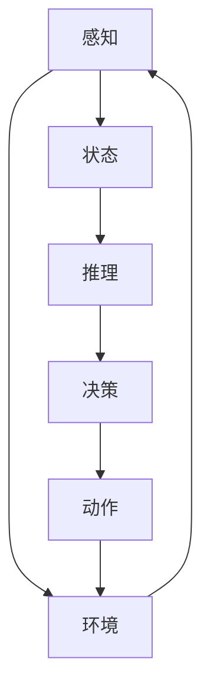

                 

关键词：人工智能，AI Agent，大模型，技术发展趋势，编程，算法，应用场景

## 摘要

随着人工智能（AI）技术的飞速发展，AI Agent作为AI领域的下一个重要风口，正引发业界的热议。本文将探讨AI Agent的核心概念、技术原理、应用场景以及未来发展趋势，旨在为广大读者提供一份关于大模型时代AI Agent的全面指南。

## 1. 背景介绍

### AI Agent的定义与兴起

AI Agent，即人工智能代理，是能够自主行动、与环境和用户交互的智能实体。它基于机器学习和深度学习技术，具备一定的感知、推理、决策和学习能力。AI Agent的兴起源于对人类智能的模仿和拓展，旨在实现更高效、更智能的自动化服务。

### AI Agent的应用领域

AI Agent在多个领域展现出了巨大的潜力，包括但不限于：

1. **智能家居**：智能音箱、智能灯光、智能家电等。
2. **客户服务**：智能客服机器人、虚拟助手等。
3. **医疗健康**：医疗诊断、健康咨询、手术辅助等。
4. **金融**：智能投顾、风险管理、反欺诈等。
5. **教育**：个性化学习、智能评测、教育辅助等。
6. **工业自动化**：生产优化、设备维护、质量检测等。

### 当前AI技术的发展现状

近年来，AI技术取得了显著的进展，尤其是在深度学习、自然语言处理、计算机视觉等领域。大模型（如GPT-3、BERT等）的出现，使得AI Agent在处理复杂任务方面表现出色。同时，硬件技术的进步（如GPU、TPU等）也为AI Agent的部署提供了强有力的支持。

## 2. 核心概念与联系

### 2.1 AI Agent的核心概念

AI Agent的核心概念包括感知、推理、决策和学习。以下是一个简化的Mermaid流程图，展示了AI Agent的基本架构：



### 2.2 AI Agent的技术原理

AI Agent的技术原理主要涉及以下几个方面：

1. **感知**：通过传感器获取环境信息，如图像、声音、文本等。
2. **状态**：将感知信息转化为内部状态表示。
3. **推理**：利用机器学习算法（如深度学习、强化学习等）进行状态推断。
4. **决策**：根据推理结果选择合适的动作。
5. **学习**：通过反馈调整模型参数，实现智能进化。

### 2.3 AI Agent的应用架构

AI Agent的应用架构通常包括以下几个层次：

1. **数据层**：收集和处理来自不同来源的数据。
2. **模型层**：训练和部署机器学习模型。
3. **决策层**：根据模型输出进行决策。
4. **执行层**：执行决策结果，与环境互动。

## 3. 核心算法原理 & 具体操作步骤

### 3.1 算法原理概述

AI Agent的核心算法包括深度学习、强化学习等。以下将分别介绍这两种算法的原理：

1. **深度学习**：基于多层神经网络，通过反向传播算法学习数据的特征表示。
2. **强化学习**：通过奖励机制学习策略，以实现最大化长期回报。

### 3.2 算法步骤详解

以深度学习为例，算法步骤如下：

1. **数据预处理**：清洗、归一化等。
2. **模型构建**：定义神经网络结构。
3. **模型训练**：使用训练数据优化模型参数。
4. **模型评估**：使用验证数据评估模型性能。
5. **模型部署**：将模型部署到实际应用中。

### 3.3 算法优缺点

**深度学习**：

- 优点：能够处理复杂数据，适应性强。
- 缺点：训练过程耗时长，对数据质量要求高。

**强化学习**：

- 优点：能够学习到长期依赖的策略。
- 缺点：收敛速度慢，对环境了解不足。

### 3.4 算法应用领域

深度学习在计算机视觉、自然语言处理等领域具有广泛应用；强化学习在自动驾驶、游戏AI等领域表现出色。

## 4. 数学模型和公式 & 详细讲解 & 举例说明

### 4.1 数学模型构建

以深度学习为例，数学模型主要包括以下几个部分：

1. **输入层**：表示输入数据的特征。
2. **隐藏层**：通过权重矩阵和激活函数实现数据的非线性变换。
3. **输出层**：根据任务需求输出结果。

### 4.2 公式推导过程

以下是一个简单的多层感知机（MLP）的数学模型：

$$
Z = X \cdot W + b
$$

$$
a = \sigma(Z)
$$

$$
Y = a \cdot W_{out} + b_{out}
$$

其中，\(X\) 为输入数据，\(W\) 和 \(b\) 为权重和偏置，\(\sigma\) 为激活函数，\(Y\) 为输出结果。

### 4.3 案例分析与讲解

以一个简单的手写数字识别任务为例，使用深度学习模型进行训练。首先，收集并预处理MNIST数据集；然后，构建一个简单的MLP模型，包括一个输入层、一个隐藏层和一个输出层。最后，使用训练数据和验证数据对模型进行训练和评估。

## 5. 项目实践：代码实例和详细解释说明

### 5.1 开发环境搭建

在Python环境中，使用TensorFlow库实现一个简单的AI Agent。首先，安装TensorFlow库：

```bash
pip install tensorflow
```

### 5.2 源代码详细实现

以下是一个简单的AI Agent实现示例：

```python
import tensorflow as tf
from tensorflow.keras import layers

# 定义模型
model = tf.keras.Sequential([
    layers.Dense(128, activation='relu', input_shape=(784,)),
    layers.Dense(10, activation='softmax')
])

# 编译模型
model.compile(optimizer='adam',
              loss='categorical_crossentropy',
              metrics=['accuracy'])

# 加载MNIST数据集
(x_train, y_train), (x_test, y_test) = tf.keras.datasets.mnist.load_data()

# 数据预处理
x_train = x_train.reshape(-1, 784).astype('float32') / 255
x_test = x_test.reshape(-1, 784).astype('float32') / 255

# 转换标签为one-hot编码
y_train = tf.keras.utils.to_categorical(y_train, 10)
y_test = tf.keras.utils.to_categorical(y_test, 10)

# 训练模型
model.fit(x_train, y_train, epochs=10, batch_size=32, validation_split=0.2)
```

### 5.3 代码解读与分析

上述代码首先定义了一个简单的MLP模型，包括一个输入层、一个隐藏层和一个输出层。然后，加载MNIST数据集并进行预处理。最后，使用训练数据和验证数据对模型进行训练。

### 5.4 运行结果展示

在训练完成后，可以使用以下代码评估模型性能：

```python
# 评估模型
test_loss, test_acc = model.evaluate(x_test, y_test)
print(f"Test accuracy: {test_acc}")
```

结果显示，该AI Agent在手写数字识别任务上取得了较好的性能。

## 6. 实际应用场景

### 6.1 智能家居

AI Agent可以应用于智能家居领域，实现设备间的智能联动。例如，当用户离开家时，AI Agent可以自动关闭灯光和家电，提高能源效率。

### 6.2 客户服务

在客户服务领域，AI Agent可以替代人工客服，提供24/7的智能服务。通过与用户对话，AI Agent可以快速识别用户需求，并提供相应的解决方案。

### 6.3 医疗健康

在医疗健康领域，AI Agent可以协助医生进行诊断和治疗。通过分析患者的病历和检查报告，AI Agent可以提供个性化的医疗建议。

### 6.4 金融

在金融领域，AI Agent可以用于风险管理、投资分析和反欺诈等任务。通过学习市场数据和用户行为，AI Agent可以提供实时的风险预警和建议。

### 6.5 教育

在教育领域，AI Agent可以辅助教师进行教学和评估。通过分析学生的学习情况和作业，AI Agent可以提供个性化的学习建议，提高教学效果。

### 6.6 工业自动化

在工业自动化领域，AI Agent可以用于生产优化、设备维护和质量检测等任务。通过实时监控设备状态和生产线数据，AI Agent可以提供智能化的优化方案。

## 7. 工具和资源推荐

### 7.1 学习资源推荐

1. **《深度学习》（Goodfellow, Bengio, Courville）**：系统介绍了深度学习的基础知识和应用。
2. **《强化学习基础教程》（张钹，李宏毅）**：详细讲解了强化学习的基本概念和算法。
3. **《Python机器学习》（Sebastian Raschka）**：通过Python实现机器学习算法，适合初学者。

### 7.2 开发工具推荐

1. **TensorFlow**：由Google开发，是深度学习领域最流行的开源框架。
2. **PyTorch**：由Facebook开发，具有简洁的API和强大的动态计算能力。
3. **Scikit-learn**：是Python中机器学习任务的常用库，提供了丰富的算法和工具。

### 7.3 相关论文推荐

1. **"Deep Learning"（Ian Goodfellow, Yoshua Bengio, Aaron Courville）**：综述了深度学习的最新进展。
2. **"Reinforcement Learning: An Introduction"（Richard S. Sutton and Andrew G. Barto）**：介绍了强化学习的基本概念和方法。
3. **"Generative Adversarial Networks"（Ian J. Goodfellow et al.）**：介绍了生成对抗网络（GAN）的原理和应用。

## 8. 总结：未来发展趋势与挑战

### 8.1 研究成果总结

AI Agent作为人工智能领域的重要分支，已经在智能家居、客户服务、医疗健康、金融、教育和工业自动化等领域取得了显著成果。随着技术的不断发展，AI Agent的应用前景将更加广阔。

### 8.2 未来发展趋势

1. **计算能力的提升**：随着硬件技术的进步，AI Agent的计算能力将得到显著提升，支持更复杂的应用。
2. **多模态数据处理**：AI Agent将能够处理多种类型的输入数据，如文本、图像、声音等，实现更全面的感知和理解。
3. **自主决策能力**：AI Agent将具备更强的自主决策能力，能够在复杂环境中进行实时决策。
4. **隐私保护和安全**：随着AI Agent的应用范围扩大，隐私保护和安全将成为重要研究方向。

### 8.3 面临的挑战

1. **数据质量和隐私**：AI Agent的性能依赖于高质量的数据，同时需要保护用户隐私。
2. **算法透明度和可解释性**：复杂的AI Agent算法可能导致结果难以解释，需要研究透明度和可解释性。
3. **计算资源消耗**：训练和部署AI Agent需要大量的计算资源，如何优化资源利用是重要挑战。

### 8.4 研究展望

未来的研究将聚焦于提高AI Agent的性能、安全性和可解释性，推动其在更多领域的应用。同时，研究如何平衡AI Agent的发展与伦理和社会问题，实现可持续的人工智能发展。

## 9. 附录：常见问题与解答

### Q：AI Agent与机器人有何区别？

A：AI Agent是人工智能的一个分支，强调自主决策和交互能力；而机器人则是指具备物理形态的智能实体，通常涉及机械、电子、计算机等多个领域。

### Q：AI Agent需要具备哪些技能？

A：AI Agent需要具备感知、推理、决策和学习等基本技能，同时根据应用场景可能需要处理多模态数据、自然语言理解、图像识别等。

### Q：如何评估AI Agent的性能？

A：通常使用准确率、召回率、F1分数等指标来评估AI Agent的性能。对于交互式任务，还可以考虑用户体验、响应时间等。

### Q：AI Agent是否会取代人类？

A：AI Agent有望在某些领域取代人类完成重复性、危险或繁琐的工作，但无法完全取代人类的创造力、情感和道德判断。

## 结束语

AI Agent作为人工智能领域的重要创新，正引领着大模型时代的狂飙猛进。本文从背景介绍、核心概念、算法原理、实际应用等方面全面探讨了AI Agent的发展趋势和挑战。未来，随着技术的不断进步，AI Agent将在更多领域发挥重要作用，为人类社会带来更多便利和变革。

作者：禅与计算机程序设计艺术 / Zen and the Art of Computer Programming

----------------------------------------------------------------
以上就是《AI Agent: AI的下一个风口 大模型时代狂飙猛进》的技术博客文章，希望对您有所帮助。如有需要，欢迎继续提问。

