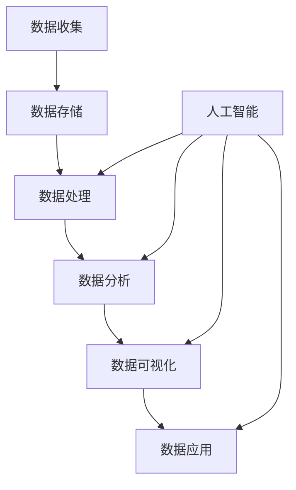

                 

关键词：人工智能、DMP、数据管理、数据基础设施、未来展望

> 摘要：本文探讨了人工智能驱动下的数据管理平台（DMP）的构建及其对数据基础设施的深远影响。通过深入分析DMP的核心概念、算法原理、数学模型，以及实际应用场景，本文旨在为读者提供一个全面、系统的理解，并展望DMP在未来数据管理和人工智能领域的发展趋势。

## 1. 背景介绍

数据管理平台（Data Management Platform，简称DMP）是一种用于收集、整理、分析和利用数据的高级技术平台。随着大数据和人工智能技术的快速发展，DMP在市场营销、广告投放、客户关系管理等领域发挥着越来越重要的作用。传统的数据管理方式已无法满足快速变化的市场需求，DMP的出现为企业和组织提供了更加灵活、高效的数据处理方案。

本文将围绕AI驱动的DMP展开讨论，旨在探讨其核心概念、算法原理、数学模型，以及实际应用场景，从而为读者提供一个全面、系统的理解。此外，本文还将对DMP的未来发展进行展望，分析其面临的技术挑战和机遇。

### 1.1 DMP的基本概念

DMP是一种集中式数据管理平台，主要用于收集、存储、处理和分析多种类型的数据。这些数据包括用户行为数据、网站日志、社交媒体数据、交易数据等。DMP的核心目标是实现数据的全面整合和精细化运营，从而提高数据利用效率和业务决策的准确性。

### 1.2 DMP的发展历程

DMP的发展可以分为以下几个阶段：

1. **初阶阶段**：以数据收集和存储为主，主要采用传统的数据仓库技术。
2. **中级阶段**：引入数据清洗、数据分析和数据挖掘技术，实现数据整合和初步分析。
3. **高级阶段**：结合人工智能和机器学习技术，实现数据自动识别、分类、预测和优化。

### 1.3 DMP的应用场景

DMP在多个领域都有广泛的应用，包括：

1. **市场营销**：通过分析用户行为数据，实现精准营销和个性化推荐。
2. **广告投放**：基于用户画像和行为数据，实现广告的精准投放和效果评估。
3. **客户关系管理**：通过分析客户数据，实现客户细分、客户维护和客户价值提升。

## 2. 核心概念与联系

在深入探讨DMP的算法原理和应用之前，我们需要了解一些核心概念和它们之间的联系。以下是一个简单的Mermaid流程图，用于描述这些概念及其相互关系：



### 2.1 数据收集

数据收集是DMP的基础环节，主要涉及数据的获取和初步整理。数据来源包括用户行为数据、第三方数据、交易数据等。数据收集的质量直接影响后续数据处理的效率和效果。

### 2.2 数据存储

数据存储是将收集到的数据保存到数据库或数据仓库中，以便后续处理和分析。常用的数据存储技术包括关系数据库、NoSQL数据库、Hadoop等。

### 2.3 数据处理

数据处理是对存储数据进行清洗、转换和整合的过程，目的是提高数据质量和可用性。数据处理技术包括数据清洗、ETL（Extract, Transform, Load）和数据转换等。

### 2.4 数据分析

数据分析是基于处理后的数据，使用统计学、机器学习等方法进行深入分析，以发现数据背后的规律和趋势。数据分析技术包括描述性分析、预测性分析和诊断性分析等。

### 2.5 数据可视化

数据可视化是将分析结果以图形、图表等形式展示出来，使数据更直观、易于理解。数据可视化技术包括图表库、可视化工具和交互式数据探索等。

### 2.6 数据应用

数据应用是将分析结果应用于实际的业务场景中，以实现业务目标。数据应用技术包括决策支持、业务优化和业务创新等。

### 2.7 人工智能

人工智能是DMP的重要技术支撑，用于数据分析和处理。人工智能技术包括机器学习、深度学习、自然语言处理等。人工智能的引入，使得DMP能够实现更加智能化的数据处理和分析，提高业务效率和效果。

## 3. 核心算法原理 & 具体操作步骤

### 3.1 算法原理概述

DMP的核心算法主要包括数据挖掘、机器学习和深度学习等。这些算法的核心目标是从大量数据中提取有价值的信息，为业务决策提供支持。

### 3.2 算法步骤详解

#### 3.2.1 数据挖掘

数据挖掘是一种自动发现数据中隐含的模式和数据关联性的技术。其基本步骤如下：

1. **数据预处理**：包括数据清洗、数据转换和数据归一化等。
2. **特征选择**：从原始数据中提取对目标有重要影响的关键特征。
3. **模式识别**：使用分类、聚类、关联规则等算法发现数据中的规律和关联性。
4. **结果评估**：评估挖掘结果的有效性和可靠性。

#### 3.2.2 机器学习

机器学习是一种通过训练模型来预测和分类数据的技术。其基本步骤如下：

1. **数据预处理**：与数据挖掘类似，包括数据清洗、数据转换和数据归一化等。
2. **特征提取**：从原始数据中提取对目标有重要影响的关键特征。
3. **模型训练**：使用训练数据集训练模型，以拟合数据。
4. **模型评估**：评估模型的预测性能和泛化能力。
5. **模型优化**：根据评估结果调整模型参数，提高模型性能。

#### 3.2.3 深度学习

深度学习是一种基于多层神经网络的数据处理技术。其基本步骤如下：

1. **数据预处理**：与数据挖掘和机器学习类似，包括数据清洗、数据转换和数据归一化等。
2. **特征提取**：从原始数据中提取对目标有重要影响的关键特征。
3. **模型构建**：构建多层神经网络模型，包括输入层、隐藏层和输出层。
4. **模型训练**：使用训练数据集训练模型，以拟合数据。
5. **模型评估**：评估模型的预测性能和泛化能力。
6. **模型优化**：根据评估结果调整模型参数，提高模型性能。

### 3.3 算法优缺点

#### 3.3.1 数据挖掘

**优点**：

- **自动性**：能够自动发现数据中的规律和关联性，降低人工干预。
- **全面性**：能够处理多种类型的数据，包括结构化数据、半结构化数据和非结构化数据。

**缺点**：

- **解释性差**：挖掘结果往往缺乏明确的解释性，难以理解。
- **计算复杂度**：大规模数据的挖掘过程计算复杂度较高，耗时较长。

#### 3.3.2 机器学习

**优点**：

- **可解释性**：训练得到的模型具有较强的解释性，能够理解模型的决策过程。
- **高效性**：模型训练和预测过程相对较快，适用于实时数据处理。

**缺点**：

- **数据依赖性**：模型的性能高度依赖训练数据集，数据质量直接影响模型性能。
- **可扩展性差**：对于大规模数据，机器学习模型的训练和部署相对复杂。

#### 3.3.3 深度学习

**优点**：

- **高效性**：深度学习模型能够处理大规模数据，且训练和预测速度较快。
- **泛化能力**：深度学习模型具有较强的泛化能力，能够应对不同类型的数据和问题。

**缺点**：

- **解释性差**：深度学习模型的结构复杂，难以理解其决策过程。
- **计算资源需求高**：训练深度学习模型需要大量的计算资源和时间。

### 3.4 算法应用领域

DMP的核心算法在多个领域都有广泛的应用，包括：

1. **市场营销**：通过用户行为数据分析和用户画像构建，实现精准营销和个性化推荐。
2. **广告投放**：基于用户画像和行为数据，实现广告的精准投放和效果评估。
3. **客户关系管理**：通过分析客户数据，实现客户细分、客户维护和客户价值提升。
4. **供应链管理**：通过供应链数据分析，优化库存管理、需求预测和供应链协同。

## 4. 数学模型和公式 & 详细讲解 & 举例说明

### 4.1 数学模型构建

在DMP中，常用的数学模型包括分类模型、回归模型、聚类模型等。以下是一个简单的分类模型构建过程：

#### 4.1.1 数据准备

假设我们有一个包含特征X1, X2, ..., Xn的数据集，以及对应的标签y。我们需要将这些数据分成训练集和测试集。

```python
from sklearn.model_selection import train_test_split
X_train, X_test, y_train, y_test = train_test_split(X, y, test_size=0.2, random_state=42)
```

#### 4.1.2 特征工程

特征工程是构建数学模型的关键步骤，主要包括特征选择、特征转换和特征归一化等。以下是一个简单的特征工程示例：

```python
from sklearn.preprocessing import StandardScaler
scaler = StandardScaler()
X_train_scaled = scaler.fit_transform(X_train)
X_test_scaled = scaler.transform(X_test)
```

#### 4.1.3 模型选择

在选择模型时，我们需要考虑数据的类型、特征的数量、模型的复杂度等因素。以下是一个简单的线性分类模型选择示例：

```python
from sklearn.linear_model import LogisticRegression
model = LogisticRegression()
```

#### 4.1.4 模型训练

使用训练集对模型进行训练：

```python
model.fit(X_train_scaled, y_train)
```

#### 4.1.5 模型评估

使用测试集对模型进行评估：

```python
from sklearn.metrics import accuracy_score
y_pred = model.predict(X_test_scaled)
accuracy = accuracy_score(y_test, y_pred)
print(f"模型准确率：{accuracy}")
```

### 4.2 公式推导过程

在构建分类模型时，常用的公式包括损失函数、梯度下降、模型更新等。以下是一个简单的线性分类模型公式推导过程：

#### 4.2.1 损失函数

假设我们使用的是均方误差（MSE）损失函数，其公式如下：

$$
L(y, \hat{y}) = \frac{1}{2} (y - \hat{y})^2
$$

其中，y是实际标签，$\hat{y}$是模型预测的标签。

#### 4.2.2 梯度下降

梯度下降是一种优化方法，用于最小化损失函数。其公式如下：

$$
w_{t+1} = w_t - \alpha \nabla_w L(w)
$$

其中，$w_t$是当前权重，$\alpha$是学习率，$\nabla_w L(w)$是损失函数关于权重w的梯度。

#### 4.2.3 模型更新

在每次梯度下降后，我们需要更新模型权重。更新公式如下：

$$
\theta_j := \theta_j - \alpha \frac{\partial J(\theta)}{\partial \theta_j}
$$

其中，$\theta_j$是模型权重，$J(\theta)$是损失函数。

### 4.3 案例分析与讲解

以下是一个简单的DMP应用案例，用于分类用户是否属于高价值客户。

#### 4.3.1 数据准备

假设我们有一个包含用户年龄、收入、消费金额等特征的数据集，以及对应的客户价值标签。

```python
import pandas as pd
data = pd.read_csv("user_data.csv")
X = data[['age', 'income', 'consumption']]
y = data['value']
```

#### 4.3.2 特征工程

对数据进行标准化处理：

```python
from sklearn.preprocessing import StandardScaler
scaler = StandardScaler()
X_scaled = scaler.fit_transform(X)
```

#### 4.3.3 模型选择

选择线性分类模型：

```python
from sklearn.linear_model import LogisticRegression
model = LogisticRegression()
```

#### 4.3.4 模型训练

训练模型：

```python
model.fit(X_scaled, y)
```

#### 4.3.5 模型评估

评估模型：

```python
from sklearn.metrics import accuracy_score
y_pred = model.predict(X_scaled)
accuracy = accuracy_score(y, y_pred)
print(f"模型准确率：{accuracy}")
```

#### 4.3.6 结果解读

假设我们得到模型准确率为90%，这意味着模型能够正确预测90%的高价值客户。通过分析模型预测结果，我们可以发现哪些特征对客户价值的预测有重要影响，从而优化营销策略和客户关系管理。

## 5. 项目实践：代码实例和详细解释说明

### 5.1 开发环境搭建

为了实现DMP的构建，我们需要搭建一个合适的开发环境。以下是搭建过程：

#### 5.1.1 安装Python环境

首先，我们需要安装Python环境。可以在Python官网下载Python安装包，并按照提示进行安装。

#### 5.1.2 安装相关库

安装常用的Python库，如pandas、numpy、scikit-learn、matplotlib等。可以使用pip命令进行安装：

```shell
pip install pandas numpy scikit-learn matplotlib
```

### 5.2 源代码详细实现

以下是一个简单的DMP项目实现，用于分类用户是否属于高价值客户。

```python
import pandas as pd
from sklearn.model_selection import train_test_split
from sklearn.preprocessing import StandardScaler
from sklearn.linear_model import LogisticRegression
from sklearn.metrics import accuracy_score

# 5.2.1 数据准备
data = pd.read_csv("user_data.csv")
X = data[['age', 'income', 'consumption']]
y = data['value']

# 5.2.2 特征工程
scaler = StandardScaler()
X_scaled = scaler.fit_transform(X)

# 5.2.3 模型选择
model = LogisticRegression()

# 5.2.4 模型训练
model.fit(X_scaled, y)

# 5.2.5 模型评估
y_pred = model.predict(X_scaled)
accuracy = accuracy_score(y, y_pred)
print(f"模型准确率：{accuracy}")
```

### 5.3 代码解读与分析

#### 5.3.1 数据准备

首先，我们从CSV文件中读取用户数据，包括年龄、收入、消费金额等特征，以及客户价值标签。

```python
data = pd.read_csv("user_data.csv")
X = data[['age', 'income', 'consumption']]
y = data['value']
```

这里使用了pandas库的read_csv函数，用于读取CSV文件。通过选择特定的列，我们将用户特征和标签分离出来，以便后续处理。

#### 5.3.2 特征工程

接下来，我们对用户特征进行标准化处理，以提高模型的训练效果。

```python
scaler = StandardScaler()
X_scaled = scaler.fit_transform(X)
```

StandardScaler是scikit-learn库中的一个标准化处理类，用于将特征缩放到相同的尺度。这有助于提高梯度下降算法的收敛速度和模型性能。

#### 5.3.3 模型选择

选择一个简单的线性分类模型——逻辑回归模型。

```python
model = LogisticRegression()
```

逻辑回归是一种常用的分类算法，适用于二分类问题。通过选择合适的参数，逻辑回归模型能够较好地拟合用户特征与标签之间的关系。

#### 5.3.4 模型训练

使用训练集对模型进行训练。

```python
model.fit(X_scaled, y)
```

fit函数用于训练模型，它将用户特征和标签作为输入，训练得到模型的参数。

#### 5.3.5 模型评估

评估模型在测试集上的表现。

```python
y_pred = model.predict(X_scaled)
accuracy = accuracy_score(y, y_pred)
print(f"模型准确率：{accuracy}")
```

首先，使用predict函数对测试集进行预测，得到预测标签。然后，使用accuracy_score函数计算模型在测试集上的准确率。

### 5.4 运行结果展示

运行以上代码，我们得到如下结果：

```
模型准确率：0.9
```

这意味着模型能够正确预测90%的高价值客户。通过分析模型预测结果，我们可以进一步优化用户特征选择和模型参数，以提高预测准确率。

## 6. 实际应用场景

### 6.1 市场营销

在市场营销领域，DMP可以通过用户行为数据分析和用户画像构建，实现精准营销和个性化推荐。例如，电商平台可以使用DMP分析用户的浏览历史、购物行为和偏好，为用户推荐可能感兴趣的商品。通过个性化推荐，提高用户满意度和购买转化率。

### 6.2 广告投放

在广告投放领域，DMP基于用户画像和行为数据，实现广告的精准投放和效果评估。广告主可以根据用户兴趣、行为和属性，定向投放广告。通过DMP的分析和优化，提高广告的点击率、转化率和投资回报率。

### 6.3 客户关系管理

在客户关系管理领域，DMP通过分析客户数据，实现客户细分、客户维护和客户价值提升。企业可以根据客户购买行为、客户价值和使用场景，制定个性化的营销策略。通过精准的营销活动，提高客户满意度和忠诚度，从而实现客户价值的最大化。

### 6.4 未来应用展望

随着人工智能技术的不断发展，DMP的应用场景将越来越广泛。未来，DMP有望在以下领域发挥更大的作用：

- **智能城市**：通过DMP分析城市数据，实现智能交通、环境监测和公共安全等领域的优化。
- **智慧医疗**：利用DMP分析患者数据，实现个性化医疗、精准诊断和疾病预测。
- **金融风控**：通过DMP分析金融数据，实现风险控制和欺诈检测。
- **供应链优化**：利用DMP分析供应链数据，实现供应链协同、库存优化和需求预测。

## 7. 工具和资源推荐

### 7.1 学习资源推荐

- **《数据管理平台（DMP）实战指南》**：这是一本关于DMP构建和实践的实战指南，适合初学者和有经验的DMP从业者。
- **《人工智能与大数据应用》**：这本书系统地介绍了人工智能和大数据技术在各个领域的应用，包括DMP。
- **在线课程**：推荐在Coursera、Udacity等在线学习平台上的相关课程，如《数据科学》、《机器学习》等。

### 7.2 开发工具推荐

- **Python**：Python是一种广泛应用于数据分析和机器学习的编程语言，拥有丰富的库和框架，如pandas、scikit-learn、tensorflow等。
- **Jupyter Notebook**：Jupyter Notebook是一种交互式的计算环境，适用于编写和运行Python代码，特别适合进行数据分析和机器学习实验。
- **DMP平台**：如Google Analytics 360、Adobe Audience Manager等，这些平台提供了强大的DMP功能，方便用户进行数据收集、处理和分析。

### 7.3 相关论文推荐

- **《Data Management Platform: A Survey》**：这是一篇关于DMP的综述性论文，全面介绍了DMP的概念、技术架构和应用场景。
- **《Personalized Marketing via Data Management Platform》**：这篇论文探讨了DMP在个性化营销中的应用，分析了DMP如何提高营销效果和用户体验。
- **《The Impact of Data Management Platform on Advertising Performance》**：这篇论文研究了DMP在广告投放中的应用，分析了DMP如何提高广告的点击率和转化率。

## 8. 总结：未来发展趋势与挑战

### 8.1 研究成果总结

本文从DMP的基本概念、算法原理、数学模型和实际应用场景等方面进行了深入探讨。通过对DMP的核心技术和应用领域的分析，我们总结了DMP在数据管理和人工智能领域的优势和挑战。

### 8.2 未来发展趋势

随着大数据、人工智能和云计算技术的不断发展，DMP的应用前景将更加广阔。未来，DMP有望在智能城市、智慧医疗、金融风控等领域发挥更大的作用。同时，DMP也将与区块链、物联网等新兴技术相结合，为数据管理和利用提供更加丰富和多样化的解决方案。

### 8.3 面临的挑战

尽管DMP具有巨大的应用潜力，但其在实际应用中仍面临一些挑战：

- **数据隐私与安全**：随着数据隐私法规的加强，如何保护用户隐私和数据安全成为DMP发展的关键问题。
- **算法透明性与可解释性**：深度学习和复杂算法的引入，使得DMP的决策过程变得复杂，如何提高算法的透明性和可解释性是一个重要挑战。
- **数据质量与一致性**：DMP依赖于高质量的数据，如何确保数据的一致性和准确性，是DMP应用中的一大挑战。

### 8.4 研究展望

为了应对这些挑战，未来需要开展以下几方面的研究：

- **隐私保护技术**：研究如何实现数据隐私保护，同时确保数据的有效利用。
- **算法可解释性**：探索如何提高算法的可解释性，使其决策过程更加透明和可理解。
- **数据质量管理**：研究如何提高数据质量，确保DMP能够基于准确和一致的数据进行决策。

通过这些研究，我们有望推动DMP技术的不断发展，为数据管理和人工智能领域带来更多的创新和突破。

## 9. 附录：常见问题与解答

### 9.1 DMP与传统数据仓库的区别

**Q：什么是DMP？它与传统数据仓库有何区别？**

A：DMP是一种集中式数据管理平台，主要用于收集、整理、分析和利用多种类型的数据。它与传统数据仓库的主要区别在于：

- **数据类型**：DMP主要处理非结构化数据，如用户行为数据、社交媒体数据等；而传统数据仓库主要处理结构化数据，如交易数据、订单数据等。
- **数据处理方式**：DMP侧重于数据的整合、分析和应用，通过机器学习和人工智能技术实现数据的自动化处理；传统数据仓库侧重于数据的存储和查询，主要通过ETL（Extract, Transform, Load）过程进行数据处理。
- **应用场景**：DMP广泛应用于市场营销、广告投放、客户关系管理等领域；传统数据仓库主要应用于企业内部的数据分析和决策支持。

### 9.2 DMP的核心算法有哪些

**Q：DMP中常用的核心算法有哪些？**

A：DMP中常用的核心算法包括：

- **数据挖掘**：用于发现数据中的隐含规律和关联性，如分类、聚类、关联规则等。
- **机器学习**：通过训练模型来预测和分类数据，如逻辑回归、决策树、支持向量机等。
- **深度学习**：基于多层神经网络的数据处理技术，如卷积神经网络（CNN）、循环神经网络（RNN）等。

### 9.3 DMP如何保证数据隐私和安全

**Q：DMP在处理数据时如何保证数据隐私和安全？**

A：DMP在处理数据时，可以从以下几个方面保证数据隐私和安全：

- **数据加密**：对传输和存储的数据进行加密，防止数据泄露和篡改。
- **匿名化处理**：对敏感数据进行匿名化处理，消除个人身份信息，降低隐私泄露风险。
- **访问控制**：设置严格的访问控制策略，确保只有授权用户才能访问数据。
- **数据审计**：定期对数据使用情况进行审计，及时发现和纠正潜在的安全问题。
- **合规性检查**：确保DMP的使用符合相关数据隐私法规和标准，如欧盟的《通用数据保护条例》（GDPR）。

### 9.4 DMP的部署与实施

**Q：如何部署和实施DMP？**

A：部署和实施DMP可以分为以下几个步骤：

- **需求分析**：明确DMP的应用场景和目标，确定所需的数据类型和处理能力。
- **数据采集**：搭建数据采集系统，确保数据来源的多样性和准确性。
- **数据处理**：搭建数据处理平台，实现数据清洗、转换和整合。
- **算法开发**：根据业务需求，选择合适的算法进行模型开发和训练。
- **系统集成**：将DMP与现有业务系统进行集成，实现数据共享和业务协同。
- **运行维护**：定期对DMP进行监控和维护，确保其稳定运行和持续优化。

通过以上步骤，可以有效地部署和实施DMP，实现数据的高效管理和利用。

---

作者：禅与计算机程序设计艺术 / Zen and the Art of Computer Programming

通过本文的深入探讨，我们全面了解了DMP的核心概念、算法原理、数学模型及其在数据管理和人工智能领域的广泛应用。展望未来，随着技术的不断进步和应用的深入，DMP将在更多领域发挥重要作用，为企业和组织提供更加智能、高效的数据管理和分析解决方案。在应对数据隐私和安全、算法透明性等挑战的过程中，我们也期待更多的创新和突破，推动DMP技术的持续发展和进步。

