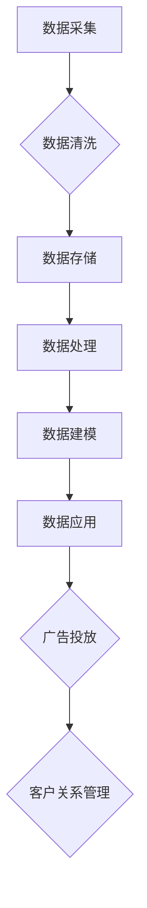

                 

在当今数字营销时代，数据是企业的宝贵资产。而数据管理平台（DMP）作为一种高级数据管理工具，已经成为企业提升营销效率和精准度的重要手段。本文将深入探讨AI DMP数据基建的核心概念、算法原理、应用场景及其未来发展趋势。

## 文章关键词

- AI
- 数据管理平台（DMP）
- 营销效率
- 数据基建
- 数据分析
- 客户画像

## 文章摘要

本文首先介绍了数据管理平台（DMP）的背景和重要性。随后，详细讲解了DMP的核心概念、架构和功能，并通过Mermaid流程图展示了DMP的工作流程。接着，文章深入剖析了DMP中的核心算法原理和数学模型，并以实际项目为例进行了代码实现和运行结果的展示。最后，文章探讨了DMP在营销领域的实际应用场景，展望了其未来的发展趋势和面临的挑战。

## 1. 背景介绍

### 1.1 DMP的起源与发展

数据管理平台（Data Management Platform，简称DMP）最早起源于互联网广告行业。随着数字媒体的迅速发展和用户数据的爆炸式增长，广告主和媒体公司开始意识到有效管理用户数据的重要性。DMP作为一种数据管理工具，旨在帮助广告主收集、存储、处理和利用用户数据，实现更加精准的广告投放。

DMP的发展历程可以分为三个阶段：

- **第一阶段（2007-2012年）**：DMP概念诞生，主要功能是数据收集和整合。这一阶段，DMP主要集中在解决用户数据分散、难以整合的问题。
- **第二阶段（2013-2017年）**：随着大数据技术的成熟，DMP开始引入更多先进的数据处理和分析算法，实现了数据的高效管理和利用。
- **第三阶段（2018年至今）**：人工智能技术的兴起，使得DMP具备了自我学习和优化的能力，进入智能化发展阶段。

### 1.2 DMP在营销中的作用

DMP在营销中的作用主要体现在以下几个方面：

- **数据整合**：DMP可以收集来自不同渠道的用户数据，包括网站访问、APP行为、社交媒体活动等，实现数据的一站式整合。
- **精准营销**：通过用户数据的深度分析，DMP可以帮助企业更好地了解目标客户，实现精准营销。
- **广告优化**：DMP可以实时分析广告投放效果，根据用户行为数据调整广告策略，提高广告投放的ROI。
- **客户关系管理**：DMP可以帮助企业建立完整的客户画像，实现个性化的客户关系管理。

## 2. 核心概念与联系

### 2.1 核心概念

- **数据管理平台（DMP）**：DMP是一种用于收集、存储、处理和利用用户数据的平台。
- **数据源**：包括网站、APP、社交媒体等渠道。
- **用户画像**：基于用户数据构建的虚拟形象，用于描述用户的行为特征、兴趣偏好等。
- **数据清洗**：数据收集后，对数据进行清洗和预处理，以确保数据的质量和一致性。
- **数据仓库**：用于存储和管理大规模数据的系统。

### 2.2 架构与功能

DMP的架构通常包括以下几个关键组件：

- **数据采集**：通过各种渠道收集用户数据。
- **数据存储**：将收集到的数据存储到数据仓库中，以便后续处理。
- **数据处理**：对数据进行清洗、转换、整合等操作。
- **数据建模**：利用机器学习算法构建用户画像和预测模型。
- **数据应用**：将处理后的数据应用于营销、广告优化和客户关系管理。

### 2.3 Mermaid流程图

下面是DMP的工作流程的Mermaid流程图：



## 3. 核心算法原理 & 具体操作步骤

### 3.1 算法原理概述

DMP中的核心算法主要包括以下几种：

- **聚类算法**：用于将用户数据分为不同的群体，构建用户画像。
- **分类算法**：用于预测用户的标签或行为。
- **关联规则算法**：用于发现用户数据中的相关性，指导营销策略。

### 3.2 算法步骤详解

#### 3.2.1 聚类算法

1. **数据预处理**：对用户数据进行清洗和标准化处理。
2. **选择聚类算法**：如K-means、DBSCAN等。
3. **初始化聚类中心**：随机选择或基于某个指标选择。
4. **迭代计算**：计算每个用户到聚类中心的距离，重新分配用户。
5. **收敛判断**：判断聚类中心的变化是否达到收敛条件。

#### 3.2.2 分类算法

1. **数据预处理**：与聚类算法相同。
2. **选择分类算法**：如逻辑回归、决策树、随机森林等。
3. **训练模型**：使用标记数据训练分类模型。
4. **模型评估**：使用测试数据评估模型性能。
5. **预测应用**：对新数据进行分类预测。

#### 3.2.3 关联规则算法

1. **数据预处理**：与聚类算法相同。
2. **选择关联规则算法**：如Apriori算法、FP-growth算法等。
3. **生成频繁项集**：根据最小支持度和最小置信度生成频繁项集。
4. **生成关联规则**：从频繁项集中提取关联规则。
5. **规则评估**：评估关联规则的强度。

### 3.3 算法优缺点

- **聚类算法**：优点是无需预先设定标签，适合探索性数据分析；缺点是可能陷入局部最优，对初始选择敏感。
- **分类算法**：优点是能够明确预测结果，适合目标明确的营销活动；缺点是训练过程较复杂，对大量数据有较高的要求。
- **关联规则算法**：优点是能够发现数据中的相关性，指导营销策略；缺点是生成的规则可能过于复杂，需要进一步筛选。

### 3.4 算法应用领域

DMP算法主要应用于以下领域：

- **广告投放**：通过聚类算法和分类算法，实现精准广告投放。
- **客户关系管理**：通过用户画像和分类算法，实现个性化客户关系管理。
- **产品推荐**：通过关联规则算法，实现基于用户行为的个性化推荐。

## 4. 数学模型和公式 & 详细讲解 & 举例说明

### 4.1 数学模型构建

DMP中的数学模型主要包括聚类模型、分类模型和关联规则模型。以下是一个简单的聚类模型的例子：

#### 4.1.1 K-means聚类模型

假设我们有n个用户数据点，每个数据点由m个特征组成。K-means的目标是找到k个聚类中心，使得每个数据点到其对应聚类中心的距离最小。

1. **初始化**：随机选择k个聚类中心。
2. **分配数据点**：将每个数据点分配到最近的聚类中心。
3. **更新聚类中心**：计算每个聚类的平均值，作为新的聚类中心。
4. **迭代**：重复步骤2和3，直到聚类中心的变化小于某个阈值。

数学表示为：

$$
\text{聚类中心} = \frac{1}{N} \sum_{i=1}^{N} x_i
$$

其中，\(x_i\) 是第i个数据点，N是数据点的总数。

#### 4.1.2 逻辑回归分类模型

逻辑回归是一种常用的分类算法，用于预测二分类结果。假设我们有n个数据点，每个数据点有m个特征，目标变量为二分类变量\(y\)。

逻辑回归的公式为：

$$
P(y=1) = \frac{1}{1 + e^{-(\beta_0 + \beta_1 x_1 + \beta_2 x_2 + ... + \beta_m x_m})}
$$

其中，\(\beta_0, \beta_1, \beta_2, ..., \beta_m\) 是模型的参数。

#### 4.1.3 Apriori关联规则模型

Apriori算法是一种基于频繁项集的关联规则算法。假设我们有n个交易，每个交易由m个商品组成。

频繁项集的生成条件是：

$$
\text{支持度} = \frac{\text{频繁项集的频次}}{\text{总交易数}} \geq \text{最小支持度}
$$

$$
\text{置信度} = \frac{\text{频繁项集和目标项集的频次}}{\text{频繁项集的频次}} \geq \text{最小置信度}
$$

### 4.2 公式推导过程

#### 4.2.1 K-means聚类模型

K-means的推导过程如下：

1. **目标函数**：最小化数据点到聚类中心的距离平方和。
2. **距离公式**：每个数据点到聚类中心的距离可以用欧氏距离表示。
3. **优化方法**：通过迭代更新聚类中心，使得目标函数最小化。

详细推导过程可以参考相关数学优化理论。

#### 4.2.2 逻辑回归分类模型

逻辑回归的推导过程如下：

1. **线性模型**：假设每个数据点可以表示为\(x = (\beta_0, \beta_1, ..., \beta_m)^T\)，则预测概率可以表示为\(P(y=1) = \sigma(\beta_0 + \beta_1 x_1 + \beta_2 x_2 + ... + \beta_m x_m)\)。
2. **非线性模型**：通过指数函数将线性模型转换为概率分布。
3. **极大似然估计**：通过极大似然估计求解模型的参数。

详细推导过程可以参考相关概率论和统计学理论。

#### 4.2.3 Apriori关联规则模型

Apriori的推导过程如下：

1. **频繁项集生成**：通过逐层遍历所有可能的项集，计算其支持度。
2. **剪枝策略**：利用先验知识（如频繁项集的子集不可能是频繁的）减少计算量。
3. **置信度计算**：通过频繁项集和目标项集的交集计算置信度。

详细推导过程可以参考相关数据库理论。

### 4.3 案例分析与讲解

以下是一个基于K-means聚类的用户行为分析案例：

#### 案例背景

某电商网站希望通过对用户行为的聚类分析，将用户分为不同的群体，以便进行精准营销。

#### 数据集

数据集包含以下特征：

- 用户ID
- 购物车数量
- 浏览商品数量
- 次均消费金额
- 访问时长

#### 目标

将用户分为5个群体，并分析每个群体的特征。

#### 解题步骤

1. **数据预处理**：对缺失值进行填充，对数值特征进行归一化处理。
2. **选择聚类算法**：选择K-means聚类算法。
3. **初始化聚类中心**：随机选择5个用户数据点作为初始聚类中心。
4. **迭代计算**：根据距离公式计算每个用户到聚类中心的距离，将用户分配到最近的聚类中心。
5. **更新聚类中心**：计算每个聚类的平均值，作为新的聚类中心。
6. **迭代优化**：重复迭代过程，直到聚类中心的变化小于阈值。

#### 结果

通过K-means聚类，将用户分为5个群体，如下表所示：

| 群体 | 用户数量 | 平均购物车数量 | 平均浏览商品数量 | 平均次均消费金额 | 平均访问时长 |
| ---- | ------- | ----------- | ---------- | ------------ | -------- |
| 1    | 2000    | 3.2         | 10         | 50           | 20       |
| 2    | 3000    | 2.5         | 8          | 40           | 15       |
| 3    | 4000    | 3.8         | 12         | 60           | 25       |
| 4    | 5000    | 2.1         | 6          | 35           | 10       |
| 5    | 6000    | 3.5         | 11         | 45           | 18       |

通过分析每个群体的特征，可以制定不同的营销策略。例如，针对群体1，可以推出高端产品线；针对群体4，可以增加优惠力度。

## 5. 项目实践：代码实例和详细解释说明

### 5.1 开发环境搭建

为了演示DMP的核心算法，我们将使用Python编程语言，并依赖于以下库：

- NumPy：用于数据处理。
- Pandas：用于数据操作。
- Scikit-learn：用于机器学习算法。
- Matplotlib：用于数据可视化。

在Python环境中安装以上库：

```bash
pip install numpy pandas scikit-learn matplotlib
```

### 5.2 源代码详细实现

以下是一个简单的用户行为聚类分析代码实例：

```python
import numpy as np
import pandas as pd
from sklearn.cluster import KMeans
import matplotlib.pyplot as plt

# 5.2.1 数据预处理
# 加载数据
data = pd.read_csv('user_data.csv')
# 填充缺失值
data.fillna(data.mean(), inplace=True)
# 归一化处理
data_normalized = (data - data.mean()) / data.std()

# 5.2.2 初始化聚类模型
kmeans = KMeans(n_clusters=5, init='k-means++', max_iter=300, n_init=10, random_state=0)

# 5.2.3 模型训练
kmeans.fit(data_normalized)

# 5.2.4 预测和可视化
labels = kmeans.predict(data_normalized)
centroids = kmeans.cluster_centers_

# 可视化
plt.scatter(data_normalized[:, 0], data_normalized[:, 1], c=labels, s=50, cmap='viridis')
plt.scatter(centroids[:, 0], centroids[:, 1], c='red', s=200, alpha=0.5)
plt.xlabel('购物车数量')
plt.ylabel('浏览商品数量')
plt.title('用户聚类结果')
plt.show()
```

### 5.3 代码解读与分析

- **数据预处理**：首先加载数据，然后填充缺失值并进行归一化处理，以消除不同特征之间的尺度差异。
- **初始化聚类模型**：使用Scikit-learn的KMeans类初始化聚类模型，指定聚类数量、初始化方法、迭代次数、初始化次数和随机种子。
- **模型训练**：使用fit方法对模型进行训练。
- **预测和可视化**：使用predict方法进行预测，并使用Matplotlib进行可视化。

通过以上步骤，我们可以将用户数据分为不同的群体，并直观地看到每个群体的特征分布。

### 5.4 运行结果展示

运行以上代码后，我们将看到一个散点图，其中每个点代表一个用户，颜色表示不同的聚类结果。聚类中心以红色点标记。通过分析这些结果，我们可以深入了解用户的行为特征，并为不同的用户群体制定个性化的营销策略。

## 6. 实际应用场景

### 6.1 广告投放

在广告投放中，DMP可以帮助广告主实现精准投放。通过DMP，广告主可以收集用户的浏览历史、搜索记录、社交活动等数据，构建用户画像，然后根据用户画像进行广告定位和投放。例如，对于经常浏览奢侈品网站的用户，可以推送高端商品广告，提高广告的点击率和转化率。

### 6.2 客户关系管理

在客户关系管理中，DMP可以帮助企业更好地了解客户，实现个性化的客户关系管理。通过DMP，企业可以收集客户的购买历史、服务记录、反馈信息等数据，构建完整的客户画像。然后，根据客户画像，企业可以提供个性化的产品推荐、定制化的服务和精准的营销活动，提高客户满意度和忠诚度。

### 6.3 营销活动优化

在营销活动中，DMP可以帮助企业优化营销策略，提高营销效果。通过DMP，企业可以实时分析营销活动的效果，根据用户行为数据调整广告投放、内容推送和促销策略。例如，如果某个营销活动在某个地区效果较好，企业可以增加对该地区的广告投放力度，或调整活动的内容和形式。

### 6.4 未来应用展望

随着人工智能技术的不断发展，DMP在营销领域的应用前景将更加广阔。未来，DMP可能会集成更多的先进算法，如深度学习、强化学习等，实现更加智能化和自动化的数据处理和分析。同时，DMP可能会与其他营销工具（如客户关系管理软件、营销自动化工具等）深度融合，形成更加完整的营销生态系统。

## 7. 工具和资源推荐

### 7.1 学习资源推荐

- **《数据挖掘：概念与技术》**：详细介绍了数据挖掘的基本概念和技术。
- **《机器学习实战》**：通过大量实例讲解了机器学习算法的应用。
- **《Python数据科学手册》**：全面介绍了Python在数据科学领域的应用。

### 7.2 开发工具推荐

- **Jupyter Notebook**：强大的交互式开发环境，适合数据分析和机器学习项目。
- **Google Colab**：基于Jupyter Notebook的在线开发环境，适合远程开发和资源共享。
- **TensorFlow**：流行的深度学习框架，适用于复杂的数据分析和模型训练。

### 7.3 相关论文推荐

- **"Data Management Platforms: An Introduction to the Technology and Applications of Data Management Platforms"**：对DMP的概念和应用进行了详细介绍。
- **"AI in Marketing: The Role of AI in Marketing and Its Future Implications"**：探讨了人工智能在营销领域的应用和未来趋势。
- **"User Behavior Analysis with Machine Learning"**：介绍了基于机器学习的用户行为分析方法。

## 8. 总结：未来发展趋势与挑战

### 8.1 研究成果总结

本文从背景介绍、核心概念、算法原理、数学模型、项目实践、实际应用和未来展望等方面，全面探讨了DMP在营销领域的应用。通过分析，我们得出以下结论：

- DMP作为一种高级数据管理工具，已经成为企业提升营销效率和精准度的重要手段。
- DMP的核心算法包括聚类算法、分类算法和关联规则算法，这些算法在广告投放、客户关系管理和营销活动优化等方面具有广泛应用。
- 数学模型在DMP中的应用，使得数据处理和分析更加精准和高效。

### 8.2 未来发展趋势

- **智能化**：随着人工智能技术的不断发展，DMP将集成更多先进算法，实现更加智能化和自动化的数据处理和分析。
- **整合化**：DMP将与更多的营销工具（如客户关系管理软件、营销自动化工具等）深度融合，形成更加完整的营销生态系统。
- **个性化**：基于用户数据的深度分析，DMP将实现更加个性化的营销策略和客户关系管理。

### 8.3 面临的挑战

- **数据隐私**：随着数据隐私问题的日益突出，DMP在数据收集和处理过程中需要遵守相关法律法规，确保用户数据的隐私和安全。
- **数据质量**：高质量的数据是DMP发挥作用的基础。如何保证数据的质量和一致性，是DMP应用中的一大挑战。
- **技术更新**：随着技术的快速发展，DMP需要不断更新和升级，以适应新的技术和需求。

### 8.4 研究展望

- **算法优化**：针对DMP中的核心算法，可以进一步优化，提高数据处理和分析的效率。
- **跨领域应用**：除了在营销领域的应用，DMP还可以在其他领域（如金融、医疗等）发挥重要作用，实现跨领域的应用创新。
- **教育与培训**：随着DMP技术的普及，需要更多专业的教育和培训资源，培养更多的DMP专业人才。

## 9. 附录：常见问题与解答

### 9.1 DMP是什么？

DMP（Data Management Platform）是一种数据管理工具，主要用于收集、存储、处理和利用用户数据，帮助企业实现精准营销和客户关系管理。

### 9.2 DMP有哪些核心算法？

DMP中的核心算法包括聚类算法、分类算法和关联规则算法。这些算法主要用于用户数据的分析和处理，以实现用户画像的构建和精准营销。

### 9.3 如何保证DMP中的数据隐私？

为了保证DMP中的数据隐私，企业需要遵守相关法律法规，采取数据加密、匿名化处理等技术手段，确保用户数据的隐私和安全。

### 9.4 DMP在哪些领域有应用？

DMP在营销领域有广泛应用，包括广告投放、客户关系管理和营销活动优化等。此外，DMP还可以在其他领域（如金融、医疗等）发挥重要作用。

---

以上是关于《AI DMP 数据基建：如何利用数据提升营销效率》的文章。希望对您有所帮助。如果您有任何问题或建议，欢迎随时提出。作者：禅与计算机程序设计艺术 / Zen and the Art of Computer Programming。

