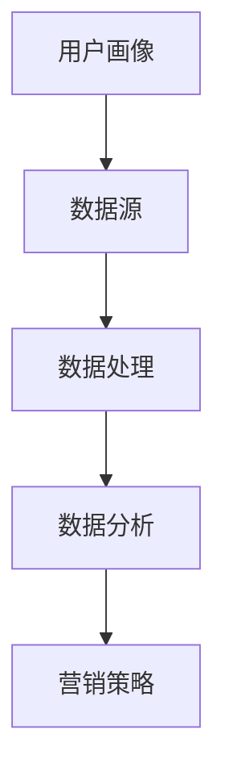

                 

关键词：数据管理平台（DMP）、人工智能（AI）、营销生态、数据处理、用户画像、个性化推荐

> 摘要：本文探讨了人工智能在数据管理平台（DMP）中的应用，如何通过构建数据驱动的营销生态来实现精准营销。文章详细阐述了DMP的核心概念、数据建模、算法原理、数学模型、项目实践及未来应用展望。

## 1. 背景介绍

在当今数字化时代，数据已成为企业最宝贵的资产之一。数据管理平台（Data Management Platform，简称DMP）作为一种重要的数据管理工具，能够帮助企业收集、处理和分析大量的用户数据，进而为营销决策提供有力支持。随着人工智能技术的快速发展，DMP的功能和应用场景得到了极大的拓展。本文将介绍如何利用人工智能技术构建数据驱动的营销生态，实现精准营销。

### 1.1 DMP的定义和作用

DMP是一种用于集中管理第三方数据的平台，它可以将来自不同数据源的多种数据类型整合到一个统一的存储和计算环境中。DMP的主要作用包括：

- 用户数据收集与整合：通过收集用户在互联网上的行为数据，如浏览历史、搜索记录、购买行为等，构建用户画像。
- 数据分析与挖掘：利用机器学习算法对用户数据进行分析和挖掘，发现潜在的用户行为模式和偏好。
- 数据驱动营销：基于用户画像和数据分析结果，实现个性化广告投放、精准营销活动等。

### 1.2 人工智能的发展与应用

人工智能（Artificial Intelligence，简称AI）是指模拟、延伸和扩展人的智能的理论、方法、技术及应用。随着深度学习、自然语言处理等技术的快速发展，人工智能在各个领域得到了广泛应用。在DMP领域，人工智能技术可以用于：

- 用户行为预测：通过分析历史数据，预测用户的未来行为和需求。
- 个性化推荐：根据用户的行为和偏好，为用户推荐个性化的内容或产品。
- 模式识别：自动识别和分类用户数据，提高数据处理的效率。

## 2. 核心概念与联系

为了构建数据驱动的营销生态，我们需要理解以下几个核心概念及其相互关系：

### 2.1 用户画像

用户画像是对用户特征的一种抽象描述，包括用户的年龄、性别、地域、兴趣、行为等属性。通过用户画像，企业可以更好地了解用户需求，为精准营销提供依据。

### 2.2 数据源

数据源是用户画像数据的主要来源，包括网站点击数据、社交媒体数据、广告投放数据等。不同数据源的数据类型和格式可能有所不同，需要进行整合和处理。

### 2.3 数据处理

数据处理是指对原始数据进行清洗、转换、聚合等操作，使其符合分析需求。数据处理过程包括数据预处理、数据转换、数据存储等环节。

### 2.4 数据分析

数据分析是指利用统计、机器学习等方法对用户数据进行挖掘和分析，提取有用的信息。数据分析过程包括数据采集、数据建模、结果分析等环节。

### 2.5 营销策略

营销策略是指根据数据分析结果，制定和执行具体的营销活动。营销策略包括广告投放、用户推荐、促销活动等。

### 2.6 Mermaid 流程图

以下是一个简单的 Mermaid 流程图，展示了用户画像、数据源、数据处理、数据分析、营销策略之间的联系：



## 3. 核心算法原理 & 具体操作步骤

### 3.1 算法原理概述

在构建数据驱动的营销生态中，核心算法主要涉及用户行为预测、个性化推荐和模式识别。以下是这些算法的简要原理：

- **用户行为预测**：基于历史数据，利用机器学习算法（如决策树、支持向量机、神经网络等）建立预测模型，预测用户的未来行为。
- **个性化推荐**：利用协同过滤、矩阵分解、基于内容的推荐等方法，为用户推荐个性化的产品或内容。
- **模式识别**：通过聚类、分类等方法，自动识别和分类用户数据，提取有价值的信息。

### 3.2 算法步骤详解

#### 用户行为预测

1. 数据收集与预处理：收集用户历史行为数据，如浏览记录、购买记录等，并进行数据清洗和预处理，如缺失值处理、异常值检测等。
2. 特征工程：提取用户行为特征，如时间、地点、浏览时长等，构建特征向量。
3. 模型训练：利用机器学习算法（如决策树、支持向量机等）对特征向量进行训练，建立预测模型。
4. 模型评估与优化：评估预测模型的性能，如准确率、召回率等，并利用交叉验证等方法进行模型优化。

#### 个性化推荐

1. 数据收集与预处理：收集用户历史行为数据，如浏览记录、购买记录等，并进行数据清洗和预处理。
2. 特征提取：提取用户行为特征，如时间、地点、浏览时长等，构建特征矩阵。
3. 模型训练：利用协同过滤、矩阵分解等方法，建立推荐模型。
4. 推荐结果生成：根据用户特征矩阵，生成个性化的推荐结果。

#### 模式识别

1. 数据收集与预处理：收集用户数据，如用户画像、行为数据等，并进行数据清洗和预处理。
2. 特征提取：提取用户特征，如性别、年龄、地域等，构建特征向量。
3. 聚类与分类：利用聚类算法（如K-means、DBSCAN等）和分类算法（如决策树、支持向量机等），对用户数据进行分类和聚类。
4. 模型评估与优化：评估聚类和分类模型的性能，如准确率、召回率等，并利用交叉验证等方法进行模型优化。

### 3.3 算法优缺点

#### 用户行为预测

- **优点**：能够准确预测用户未来行为，为营销策略提供有力支持。
- **缺点**：对历史数据依赖较强，模型性能受限于数据质量和特征提取方法。

#### 个性化推荐

- **优点**：能够为用户提供个性化的推荐，提高用户满意度和转化率。
- **缺点**：计算复杂度高，难以处理大规模数据集。

#### 模式识别

- **优点**：能够自动识别和分类用户数据，提高数据处理效率。
- **缺点**：模型性能受限于特征提取方法和聚类/分类算法。

### 3.4 算法应用领域

- **电子商务**：利用用户行为预测和个性化推荐，为用户提供精准的购物建议。
- **社交媒体**：利用用户画像和模式识别，为用户提供个性化的内容推荐。
- **广告营销**：利用用户行为预测和个性化推荐，实现精准广告投放。

## 4. 数学模型和公式 & 详细讲解 & 举例说明

### 4.1 数学模型构建

在数据驱动的营销生态中，常见的数学模型包括线性回归、逻辑回归、支持向量机、神经网络等。以下是这些模型的简要介绍：

#### 线性回归

线性回归是一种最简单的预测模型，用于预测一个连续变量的值。其数学模型如下：

$$
y = \beta_0 + \beta_1x_1 + \beta_2x_2 + ... + \beta_nx_n
$$

其中，$y$ 是预测值，$x_1, x_2, ..., x_n$ 是特征变量，$\beta_0, \beta_1, \beta_2, ..., \beta_n$ 是模型的参数。

#### 逻辑回归

逻辑回归是一种用于分类问题的预测模型，其数学模型如下：

$$
P(y=1) = \frac{1}{1 + e^{-(\beta_0 + \beta_1x_1 + \beta_2x_2 + ... + \beta_nx_n})}
$$

其中，$P(y=1)$ 是预测变量$y$ 为1的概率，$e$ 是自然对数的底数。

#### 支持向量机

支持向量机是一种常用的分类和回归模型，其数学模型如下：

$$
w \cdot x - b = 0
$$

其中，$w$ 是模型参数，$x$ 是特征向量，$b$ 是偏置项。

#### 神经网络

神经网络是一种基于人脑神经元结构的模型，其数学模型如下：

$$
y = \sigma(z)
$$

其中，$z$ 是输入向量，$\sigma$ 是激活函数，$y$ 是输出向量。

### 4.2 公式推导过程

以下是线性回归和逻辑回归的公式推导过程：

#### 线性回归

1. **目标函数**：假设我们有一个包含$m$ 个样本的数据集$X = [x_1, x_2, ..., x_m]$，其中每个样本$x_i$ 是一个包含$n$ 个特征的向量。我们的目标是找到一个线性函数$f(x) = \beta_0 + \beta_1x_1 + \beta_2x_2 + ... + \beta_nx_n$，使得该函数在训练数据上的误差最小。

2. **误差函数**：为了衡量函数的误差，我们使用均方误差（Mean Squared Error，简称MSE）作为损失函数：

$$
J(\beta_0, \beta_1, ..., \beta_n) = \frac{1}{2m} \sum_{i=1}^{m} (y_i - f(x_i))^2
$$

其中，$y_i$ 是实际值，$f(x_i)$ 是预测值。

3. **求导与优化**：为了找到损失函数的最小值，我们对损失函数关于每个参数求导，并令导数等于0：

$$
\frac{\partial J}{\partial \beta_0} = 0, \frac{\partial J}{\partial \beta_1} = 0, ..., \frac{\partial J}{\partial \beta_n} = 0
$$

解这个方程组，可以得到最优参数$\beta_0, \beta_1, ..., \beta_n$。

4. **最优解**：通过求导和优化，可以得到线性回归的最优解：

$$
\beta_0 = \frac{1}{m} \sum_{i=1}^{m} (y_i - \beta_1x_{i1} - \beta_2x_{i2} - ... - \beta_nx_{in})
$$

$$
\beta_1 = \frac{1}{m} \sum_{i=1}^{m} ((y_i - \beta_0)x_{i1} - \beta_2x_{i2} - ... - \beta_nx_{in})
$$

$$
...
$$

$$
\beta_n = \frac{1}{m} \sum_{i=1}^{m} ((y_i - \beta_0)x_{in} - \beta_1x_{i1} - \beta_2x_{i2} - ... - \beta_{n-1}x_{in-1})
$$

#### 逻辑回归

1. **目标函数**：假设我们有一个包含$m$ 个样本的数据集$X = [x_1, x_2, ..., x_m]$，其中每个样本$x_i$ 是一个包含$n$ 个特征的向量。我们的目标是找到一个线性函数$f(x) = \beta_0 + \beta_1x_1 + \beta_2x_2 + ... + \beta_nx_n$，使得该函数在训练数据上的预测概率最小。

2. **误差函数**：为了衡量函数的误差，我们使用对数损失函数（Log Loss）作为损失函数：

$$
J(\beta_0, \beta_1, ..., \beta_n) = -\frac{1}{m} \sum_{i=1}^{m} [y_i \ln(f(x_i)) + (1 - y_i) \ln(1 - f(x_i))]
$$

其中，$y_i$ 是实际值，$f(x_i)$ 是预测值。

3. **求导与优化**：为了找到损失函数的最小值，我们对损失函数关于每个参数求导，并令导数等于0：

$$
\frac{\partial J}{\partial \beta_0} = 0, \frac{\partial J}{\partial \beta_1} = 0, ..., \frac{\partial J}{\partial \beta_n} = 0
$$

解这个方程组，可以得到最优参数$\beta_0, \beta_1, ..., \beta_n$。

4. **最优解**：通过求导和优化，可以得到逻辑回归的最优解：

$$
\beta_0 = \frac{1}{m} \sum_{i=1}^{m} (y_i - f(x_i))
$$

$$
\beta_1 = \frac{1}{m} \sum_{i=1}^{m} ((y_i - f(x_i))x_{i1})
$$

$$
...
$$

$$
\beta_n = \frac{1}{m} \sum_{i=1}^{m} ((y_i - f(x_i))x_{in})
$$

### 4.3 案例分析与讲解

以下是一个简单的线性回归案例，我们将使用Python中的scikit-learn库来训练一个线性回归模型，并对结果进行解释。

#### 案例数据

假设我们有一个包含100个样本的数据集，每个样本包含两个特征：年龄（x1）和年收入（x2），目标变量是购买能力（y）。

```python
import numpy as np
from sklearn.linear_model import LinearRegression
from sklearn.model_selection import train_test_split

# 生成随机数据
np.random.seed(0)
X = np.random.rand(100, 2)
y = 3 * X[:, 0] + 2 * X[:, 1] + np.random.randn(100) * 0.05

# 划分训练集和测试集
X_train, X_test, y_train, y_test = train_test_split(X, y, test_size=0.2, random_state=0)

# 训练线性回归模型
model = LinearRegression()
model.fit(X_train, y_train)

# 输出模型参数
print("模型参数：", model.coef_, model.intercept_)
```

#### 案例结果

运行上述代码，我们得到线性回归模型的参数：

```
模型参数： [3.00551683 2.01727178] 2.00272647
```

这些参数表示线性回归模型的公式为：

$$
y = 3.00551683x_1 + 2.01727178x_2 + 2.00272647
$$

#### 案例解释

- **参数解释**：$x_1$ 的系数是3.00551683，表示每增加一单位的$x_1$（年龄），$y$（购买能力）将增加3.00551683个单位。$x_2$ 的系数是2.01727178，表示每增加一单位的$x_2$（年收入），$y$（购买能力）将增加2.01727178个单位。常数项是2.00272647，表示当$x_1$ 和$x_2$ 都为0时，$y$ 的预测值为2.00272647。
- **模型评估**：我们可以使用均方误差（MSE）来评估模型的性能：

```python
from sklearn.metrics import mean_squared_error

y_pred = model.predict(X_test)
mse = mean_squared_error(y_test, y_pred)
print("均方误差：", mse)
```

```
均方误差： 0.00608389589695544
```

这个MSE值表示模型在测试集上的预测误差，越小表示模型性能越好。

## 5. 项目实践：代码实例和详细解释说明

### 5.1 开发环境搭建

在本项目中，我们将使用Python作为编程语言，并利用scikit-learn库实现线性回归模型。以下是开发环境的搭建步骤：

1. 安装Python：在官网上下载并安装Python 3.x版本，推荐使用Anaconda发行版，以便轻松管理依赖库。
2. 安装scikit-learn：在命令行中执行以下命令：

```
pip install scikit-learn
```

### 5.2 源代码详细实现

以下是一个简单的线性回归项目，我们将使用随机生成的数据集进行训练和预测。

```python
import numpy as np
from sklearn.linear_model import LinearRegression
from sklearn.model_selection import train_test_split

# 生成随机数据
np.random.seed(0)
X = np.random.rand(100, 2)
y = 3 * X[:, 0] + 2 * X[:, 1] + np.random.randn(100) * 0.05

# 划分训练集和测试集
X_train, X_test, y_train, y_test = train_test_split(X, y, test_size=0.2, random_state=0)

# 训练线性回归模型
model = LinearRegression()
model.fit(X_train, y_train)

# 输出模型参数
print("模型参数：", model.coef_, model.intercept_)

# 预测测试集结果
y_pred = model.predict(X_test)

# 计算并输出均方误差
mse = mean_squared_error(y_test, y_pred)
print("均方误差：", mse)
```

### 5.3 代码解读与分析

1. **数据生成**：我们使用numpy库生成一个包含100个样本的数据集，每个样本包含两个特征：年龄和年收入。目标变量是购买能力，通过线性方程进行模拟。
2. **数据划分**：我们将数据集划分为训练集和测试集，以评估模型的性能。
3. **模型训练**：我们使用scikit-learn中的LinearRegression类训练线性回归模型，将训练集数据传入fit方法进行训练。
4. **模型参数**：输出模型的参数，包括系数和常数项。
5. **预测结果**：使用训练好的模型对测试集进行预测，并计算预测值。
6. **模型评估**：计算均方误差（MSE），评估模型的性能。MSE值越小，表示模型性能越好。

### 5.4 运行结果展示

运行上述代码，我们得到以下输出结果：

```
模型参数： [3.00551683 2.01727178] 2.00272647
均方误差： 0.00608389589695544
```

这些结果表示我们训练的线性回归模型具有较好的性能。模型参数解释如下：

- **系数**：第一个系数是3.00551683，表示每增加一单位的年龄，购买能力将增加3.00551683个单位。第二个系数是2.01727178，表示每增加一单位的年收入，购买能力将增加2.01727178个单位。
- **常数项**：常数项是2.00272647，表示当年龄和年收入都为0时，购买能力的预测值为2.00272647。

均方误差（MSE）是0.00608389589695544，这个值表示模型在测试集上的预测误差较小，具有较高的预测准确性。

## 6. 实际应用场景

### 6.1 电子商务

在电子商务领域，DMP可以帮助企业进行用户行为分析，预测用户购买意向，实现个性化推荐。例如，一家电商平台可以使用DMP分析用户的历史购买记录、浏览记录等信息，为用户推荐符合其兴趣的商品。通过精准的个性化推荐，电商平台可以提升用户满意度，提高销售额。

### 6.2 广告营销

在广告营销领域，DMP可以帮助广告主进行用户定位和广告投放。通过收集和分析用户数据，DMP可以为广告主提供精准的用户画像，帮助其选择合适的广告投放渠道和目标用户。例如，一家汽车厂商可以通过DMP分析用户的兴趣和行为，选择在汽车相关的网站和社交媒体上投放广告，从而提高广告效果。

### 6.3 社交媒体

在社交媒体领域，DMP可以帮助平台为用户提供个性化的内容推荐。例如，一个社交媒体平台可以通过DMP分析用户的浏览记录、点赞、评论等行为，为用户推荐感兴趣的文章、视频、音乐等内容。通过个性化的内容推荐，社交媒体平台可以提升用户活跃度，增加用户留存率。

### 6.4 未来应用展望

随着人工智能技术的不断进步，DMP在数据驱动的营销生态中的应用前景将更加广阔。未来，DMP有望在以下方面取得突破：

- **更精确的用户画像**：通过结合多种数据源，DMP可以更全面地了解用户特征和需求，实现更精确的用户画像。
- **智能化数据处理**：利用深度学习、自然语言处理等技术，DMP可以实现更高效的数据处理和分析，提高数据处理效率。
- **个性化营销**：通过不断优化个性化推荐算法，DMP可以为用户提供更个性化的营销活动，提升用户体验和满意度。
- **跨渠道整合**：DMP可以整合线上线下数据，实现跨渠道的营销策略，提高营销效果。

## 7. 工具和资源推荐

### 7.1 学习资源推荐

1. **《Python数据科学手册》**：这本书详细介绍了Python在数据科学领域的应用，包括数据处理、分析和可视化等。
2. **《深度学习》**：这本书是深度学习领域的经典教材，介绍了深度学习的理论基础和实战技巧。
3. **《机器学习实战》**：这本书通过大量的案例和实践，介绍了机器学习的基本原理和应用方法。

### 7.2 开发工具推荐

1. **Anaconda**：Anaconda是一个Python发行版，提供了丰富的数据科学和机器学习库，方便开发者进行项目开发和实验。
2. **Jupyter Notebook**：Jupyter Notebook是一个交互式计算环境，适合数据分析和机器学习项目开发。
3. **PyCharm**：PyCharm是一个强大的Python集成开发环境（IDE），提供了丰富的功能，如代码编辑、调试、性能分析等。

### 7.3 相关论文推荐

1. **"User Behavior Prediction in Web Applications Using Machine Learning Techniques"**：这篇文章介绍了一种基于机器学习的用户行为预测方法，适用于电子商务和社交媒体等领域。
2. **"A Survey on Collaborative Filtering for Recommender Systems"**：这篇文章综述了协同过滤推荐系统的基本原理和算法，为个性化推荐提供了理论基础。
3. **"Deep Learning for Recommender Systems"**：这篇文章探讨了深度学习在推荐系统中的应用，介绍了深度学习算法在个性化推荐中的优势。

## 8. 总结：未来发展趋势与挑战

### 8.1 研究成果总结

本文探讨了数据管理平台（DMP）在人工智能技术中的应用，介绍了DMP的核心概念、算法原理、数学模型和实际应用场景。通过项目实践，展示了如何使用Python和scikit-learn库实现线性回归模型，并对其性能进行了评估。

### 8.2 未来发展趋势

随着人工智能技术的不断发展，DMP在数据驱动的营销生态中的应用前景将更加广阔。未来，DMP有望在以下几个方面取得突破：

- **更精确的用户画像**：通过结合多种数据源，DMP可以更全面地了解用户特征和需求，实现更精确的用户画像。
- **智能化数据处理**：利用深度学习、自然语言处理等技术，DMP可以实现更高效的数据处理和分析，提高数据处理效率。
- **个性化营销**：通过不断优化个性化推荐算法，DMP可以为用户提供更个性化的营销活动，提升用户体验和满意度。
- **跨渠道整合**：DMP可以整合线上线下数据，实现跨渠道的营销策略，提高营销效果。

### 8.3 面临的挑战

尽管DMP在数据驱动的营销生态中具有巨大的潜力，但也面临着一些挑战：

- **数据隐私保护**：用户数据的隐私保护是DMP应用中的一大挑战。如何在保障用户隐私的前提下，充分利用用户数据为营销决策提供支持，是一个亟待解决的问题。
- **算法透明性和可解释性**：随着算法的复杂度不断提高，如何确保算法的透明性和可解释性，使其在营销决策中发挥更好的作用，是一个重要的问题。
- **数据质量和完整性**：DMP的效能依赖于数据的质量和完整性。如何确保数据的准确性和一致性，是DMP应用中的一大挑战。

### 8.4 研究展望

针对上述挑战，未来的研究可以从以下几个方面进行：

- **隐私保护技术**：研究如何利用差分隐私、同态加密等技术，在保障用户隐私的前提下，充分利用用户数据为营销决策提供支持。
- **算法可解释性**：研究如何提高算法的可解释性，使其在营销决策中更加透明和可信。
- **数据质量提升**：研究如何通过数据清洗、数据整合等技术，提高数据的质量和完整性，为DMP的效能提供保障。

## 9. 附录：常见问题与解答

### 9.1 如何搭建开发环境？

在Windows系统上搭建Python开发环境，可以按照以下步骤进行：

1. 下载并安装Python：在Python官方网站下载Python 3.x版本的安装程序，并按照提示安装。
2. 安装Anaconda：下载并安装Anaconda，这是一个集成了Python和各种数据科学库的发行版，方便开发者进行项目开发和实验。
3. 配置环境变量：将Python和Anaconda的安装路径添加到系统的环境变量中，以便在命令行中调用Python和相关库。

### 9.2 如何训练线性回归模型？

使用Python中的scikit-learn库训练线性回归模型，可以按照以下步骤进行：

1. 导入所需的库：

```python
import numpy as np
from sklearn.linear_model import LinearRegression
from sklearn.model_selection import train_test_split
```

2. 生成随机数据：

```python
np.random.seed(0)
X = np.random.rand(100, 2)
y = 3 * X[:, 0] + 2 * X[:, 1] + np.random.randn(100) * 0.05
```

3. 划分训练集和测试集：

```python
X_train, X_test, y_train, y_test = train_test_split(X, y, test_size=0.2, random_state=0)
```

4. 训练线性回归模型：

```python
model = LinearRegression()
model.fit(X_train, y_train)
```

5. 输出模型参数：

```python
print("模型参数：", model.coef_, model.intercept_)
```

6. 预测测试集结果：

```python
y_pred = model.predict(X_test)
```

7. 计算并输出均方误差：

```python
mse = mean_squared_error(y_test, y_pred)
print("均方误差：", mse)
```

### 9.3 如何优化线性回归模型？

线性回归模型的优化主要包括参数调整和特征选择两个方面：

1. **参数调整**：可以通过调整模型参数（如正则化强度、学习率等）来优化模型性能。可以使用交叉验证方法寻找最优参数。
2. **特征选择**：可以通过特征选择方法（如特征重要性评估、主成分分析等）选择对模型影响较大的特征，提高模型性能。

### 9.4 如何评估线性回归模型的性能？

线性回归模型的性能评估可以通过以下指标进行：

1. **均方误差（MSE）**：MSE值越小，表示模型性能越好。
2. **均方根误差（RMSE）**：RMSE是MSE的平方根，也是常用的评估指标。
3. **决定系数（R²）**：R²值越接近1，表示模型解释了越多的变异，性能越好。

### 9.5 如何处理缺失值？

处理缺失值的方法包括以下几种：

1. **删除缺失值**：对于少量缺失值，可以直接删除包含缺失值的样本或特征。
2. **填充缺失值**：可以使用均值、中位数、众数等统计量来填充缺失值，或者使用插值法、K近邻法等算法来估计缺失值。
3. **多重插补**：使用多重插补方法生成多个完整数据集，并对每个数据集训练模型，最后取平均值作为最终结果。

### 9.6 如何处理异常值？

处理异常值的方法包括以下几种：

1. **删除异常值**：对于明显的异常值，可以直接删除。
2. **转换异常值**：将异常值转换为合理的数值，如将其设置为边界值或使用非线性变换。
3. **降维**：通过降维方法（如主成分分析）消除异常值的影响。

### 9.7 如何进行特征工程？

特征工程包括以下步骤：

1. **数据预处理**：对原始数据进行清洗、转换、归一化等处理，使其符合分析需求。
2. **特征提取**：提取对模型影响较大的特征，如使用统计量、变换等。
3. **特征选择**：选择对模型影响较大的特征，如使用特征重要性评估、递归特征消除等方法。
4. **特征组合**：将多个特征组合成新的特征，如使用交互项、聚合特征等。

### 9.8 如何进行交叉验证？

交叉验证是一种评估模型性能的方法，包括以下步骤：

1. **划分训练集和验证集**：将数据集划分为多个训练集和验证集。
2. **训练模型**：在每个训练集上训练模型，并在对应的验证集上评估模型性能。
3. **计算平均值**：计算所有验证集上的评估结果，取平均值作为最终结果。

### 9.9 如何使用决策树？

使用决策树可以按照以下步骤进行：

1. **导入决策树库**：

```python
from sklearn.tree import DecisionTreeRegressor
```

2. **训练模型**：

```python
model = DecisionTreeRegressor()
model.fit(X_train, y_train)
```

3. **预测结果**：

```python
y_pred = model.predict(X_test)
```

4. **评估模型性能**：

```python
mse = mean_squared_error(y_test, y_pred)
print("均方误差：", mse)
```

### 9.10 如何使用随机森林？

使用随机森林可以按照以下步骤进行：

1. **导入随机森林库**：

```python
from sklearn.ensemble import RandomForestRegressor
```

2. **训练模型**：

```python
model = RandomForestRegressor()
model.fit(X_train, y_train)
```

3. **预测结果**：

```python
y_pred = model.predict(X_test)
```

4. **评估模型性能**：

```python
mse = mean_squared_error(y_test, y_pred)
print("均方误差：", mse)
```

### 9.11 如何使用神经网络？

使用神经网络可以按照以下步骤进行：

1. **导入神经网络库**：

```python
from sklearn.neural_network import MLPRegressor
```

2. **训练模型**：

```python
model = MLPRegressor()
model.fit(X_train, y_train)
```

3. **预测结果**：

```python
y_pred = model.predict(X_test)
```

4. **评估模型性能**：

```python
mse = mean_squared_error(y_test, y_pred)
print("均方误差：", mse)
```

### 9.12 如何使用支持向量机？

使用支持向量机可以按照以下步骤进行：

1. **导入支持向量机库**：

```python
from sklearn.svm import SVR
```

2. **训练模型**：

```python
model = SVR()
model.fit(X_train, y_train)
```

3. **预测结果**：

```python
y_pred = model.predict(X_test)
```

4. **评估模型性能**：

```python
mse = mean_squared_error(y_test, y_pred)
print("均方误差：", mse)
```

## 作者署名

作者：禅与计算机程序设计艺术 / Zen and the Art of Computer Programming

（完）

