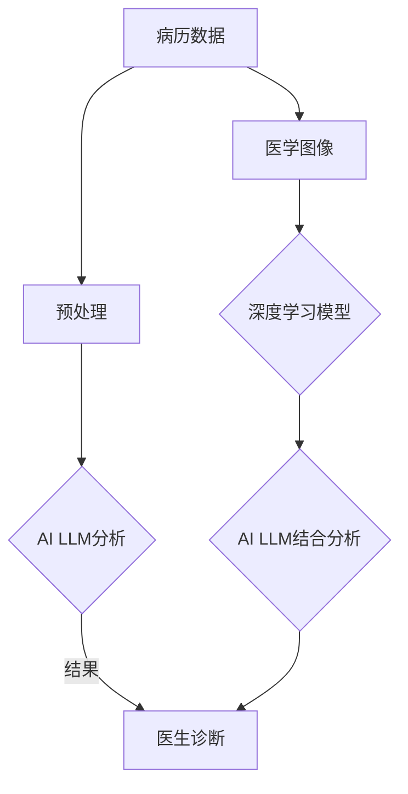

                 

关键词：AI，计算机辅助诊断，语言模型，自然语言处理，医疗诊断，智能医疗，预测模型，深度学习，数据隐私

## 摘要

本文探讨了人工智能语言模型（LLM）在计算机辅助诊断中的潜力。通过对医疗数据的大规模处理、分析和预测，AI LLM在医学诊断领域展现出前所未有的准确性。本文首先介绍了计算机辅助诊断的背景和发展现状，随后详细阐述了AI LLM的基本原理及其在医疗诊断中的应用。随后，文章分析了AI LLM在医学诊断中的具体优势，讨论了其面临的挑战和未来发展方向。最后，本文总结了当前的研究成果，并对未来的应用前景进行了展望。

## 1. 背景介绍

### 医学诊断的挑战

医学诊断是医疗领域中的关键环节，然而，传统的医学诊断方法存在诸多挑战。首先，医学诊断的准确性和效率受到医生经验和专业知识的限制。尽管医生可以通过多年的学习和实践获得丰富的医学知识，但无法避免个体差异导致的诊断错误。其次，医学诊断依赖于大量的病例和数据，然而，获取这些数据的过程往往非常耗时且成本高昂。此外，医学诊断过程通常需要大量的人力和时间投入，这不仅增加了医疗成本，还可能延误患者的治疗时机。

### 计算机辅助诊断的兴起

为了解决传统医学诊断的挑战，计算机辅助诊断（Computer-Aided Diagnosis, CAD）逐渐成为研究的热点。计算机辅助诊断利用计算机技术对医学图像、病历和实验室检测结果进行分析，辅助医生做出准确的诊断。CAD系统不仅可以提高诊断的准确性，还可以提高诊断的效率，从而降低医疗成本。

然而，传统的CAD系统主要依赖于传统的机器学习算法，如支持向量机（SVM）、决策树和随机森林等。这些算法在处理结构和规则性较强的数据时表现良好，但在处理复杂、非结构化的医疗数据时，其性能受到限制。因此，研究新的算法和技术，特别是基于深度学习的AI LLM，成为计算机辅助诊断领域的重要发展方向。

## 2. 核心概念与联系

### 人工智能语言模型（AI LLM）

人工智能语言模型（Artificial Intelligence Language Model，简称AI LLM）是一种基于深度学习技术的自然语言处理模型。它通过学习大量的文本数据，模拟人类的语言表达和推理能力，从而实现自然语言的理解和生成。AI LLM的核心是神经网络架构，特别是变分自编码器（Variational Autoencoder, VAE）和生成对抗网络（Generative Adversarial Network, GAN）等深度生成模型。

### 医学诊断与AI LLM的联系

AI LLM在医学诊断中的应用，主要体现在以下几个方面：

1. **病历分析**：AI LLM可以分析大量的病历数据，提取关键信息，帮助医生进行诊断。通过学习病历中的关键词和句子结构，LLM可以识别患者的症状、疾病历史和治疗过程，从而为医生提供辅助诊断。

2. **医学图像识别**：AI LLM可以与深度学习模型结合，对医学图像进行分析。例如，AI LLM可以与卷积神经网络（Convolutional Neural Network, CNN）结合，用于识别医学图像中的病变区域，从而提高医学图像分析的准确性和效率。

3. **药物研发**：AI LLM可以用于药物研发过程中的文本分析。通过分析医学文献、临床报告和药物说明书，LLM可以帮助研究人员快速获取相关信息，加速药物研发进程。

### Mermaid 流程图

以下是一个简化的Mermaid流程图，展示了AI LLM在医学诊断中的应用流程：



在这个流程图中，病历数据和医学图像是AI LLM分析的主要输入，经过预处理后，由AI LLM进行分析，并将分析结果提供给医生进行诊断。同时，AI LLM也可以与深度学习模型结合，对医学图像进行分析，从而提高诊断的准确性和效率。

## 3. 核心算法原理 & 具体操作步骤

### 3.1 算法原理概述

AI LLM的核心是基于深度学习技术的自然语言处理模型，其基本原理包括：

1. **自注意力机制**：自注意力机制允许模型在处理文本数据时，自动关注文本中的关键信息，从而提高模型的准确性和泛化能力。

2. **变分自编码器（VAE）**：VAE是一种无监督学习算法，通过学习数据的潜在分布，从而实现数据的生成和重建。

3. **生成对抗网络（GAN）**：GAN由生成器和判别器组成，生成器试图生成与真实数据相似的数据，而判别器则试图区分真实数据和生成数据。

### 3.2 算法步骤详解

1. **数据预处理**：首先，对病历数据和医学图像进行预处理，包括文本的清洗、分词和去停用词等操作。对于医学图像，进行图像的缩放、裁剪和增强等操作。

2. **模型训练**：利用预处理后的数据，训练AI LLM模型。训练过程包括以下几个步骤：

   - **编码器训练**：编码器学习将输入文本或图像映射到潜在空间。
   - **解码器训练**：解码器学习将潜在空间的数据解码为输出文本或图像。
   - **对抗训练**：在GAN框架下，生成器和判别器交替训练，生成器试图生成更真实的数据，而判别器则试图区分真实数据和生成数据。

3. **模型评估**：通过交叉验证和测试集，评估模型的性能，包括诊断准确率、召回率和F1分数等指标。

4. **模型部署**：将训练好的模型部署到生产环境中，供医生进行辅助诊断。

### 3.3 算法优缺点

**优点**：

- **高准确性**：AI LLM通过学习大量的医疗数据，可以实现对医学图像和病历数据的准确分析。
- **高效性**：AI LLM可以同时处理大量的数据，提高了诊断的效率。
- **泛化能力**：AI LLM具有较好的泛化能力，可以应用于不同类型的医学数据。

**缺点**：

- **数据需求大**：训练AI LLM需要大量的医疗数据，数据获取和处理过程较为复杂。
- **模型解释性差**：深度学习模型通常具有较低的解释性，医生难以理解模型的具体诊断过程。

### 3.4 算法应用领域

AI LLM在医学诊断领域具有广泛的应用前景，包括：

- **疾病预测**：利用AI LLM分析患者的病历数据，预测患者可能患有的疾病。
- **医学图像分析**：利用AI LLM与深度学习模型结合，对医学图像进行分析，提高病变区域的识别准确性。
- **药物研发**：利用AI LLM分析医学文献和临床报告，为药物研发提供辅助信息。

## 4. 数学模型和公式 & 详细讲解 & 举例说明

### 4.1 数学模型构建

AI LLM的数学模型主要包括以下几个部分：

1. **自注意力机制**：

   自注意力机制可以通过以下公式表示：

   $$ 
   \text{Attention}(Q, K, V) = \text{softmax}\left(\frac{QK^T}{\sqrt{d_k}}\right)V 
   $$

   其中，$Q$、$K$ 和 $V$ 分别代表查询向量、键向量和值向量，$d_k$ 是键向量的维度。

2. **变分自编码器（VAE）**：

   VAE的数学模型包括编码器和解码器两部分：

   - **编码器**：

     编码器的目标是将输入数据 $x$ 映射到潜在空间：

     $$
     z = \mu(x) = \sigma(W_x x + b_x)
     $$

     其中，$\mu(x)$ 和 $\sigma(x)$ 分别表示均值函数和方差函数，$W_x$ 和 $b_x$ 分别是权重和偏置。

   - **解码器**：

     解码器的目标是将潜在空间的数据 $z$ 映射回输入数据：

     $$
     x' = \text{decoder}(z)
     $$

     其中，$\text{decoder}(z)$ 是解码函数。

3. **生成对抗网络（GAN）**：

   GAN的数学模型包括生成器和判别器两部分：

   - **生成器**：

     生成器的目标是通过输入噪声 $z$ 生成与真实数据相似的数据：

     $$
     G(z) = \text{generator}(z)
     $$

   - **判别器**：

     判别器的目标是通过输入数据判断其是否为真实数据：

     $$
     D(x) = \text{discriminator}(x)
     $$

### 4.2 公式推导过程

在此，我们以VAE为例，简要介绍VAE的推导过程。

1. **编码器推导**：

   编码器的目标是将输入数据 $x$ 映射到潜在空间。首先，我们需要定义潜在空间中的均值和方差：

   $$
   \mu = \sigma^2 = \frac{1}{\alpha} \left[ \sum_{i=1}^{N} x_i^2 - \bar{x}^2 \right]
   $$

   其中，$N$ 是输入数据的个数，$\alpha$ 是一个常数。

   然后，我们可以通过最小化以下损失函数来训练编码器：

   $$
   \text{Loss} = -\sum_{i=1}^{N} \log p(x|\mu, \sigma^2)
   $$

   通过梯度下降法，我们可以求得编码器的权重和偏置：

   $$
   W_x = \frac{1}{N} \sum_{i=1}^{N} (x_i - \mu) (x_i - \mu)^T
   $$

   $$
   b_x = \mu - W_x \bar{x}
   $$

2. **解码器推导**：

   解码器的目标是将潜在空间的数据 $z$ 映射回输入数据。我们首先定义解码函数：

   $$
   x' = \text{decoder}(z)
   $$

   然后，通过最小化以下损失函数来训练解码器：

   $$
   \text{Loss} = -\sum_{i=1}^{N} \log p(x'|\mu, \sigma^2)
   $$

   通过梯度下降法，我们可以求得解码器的权重和偏置。

### 4.3 案例分析与讲解

假设我们有一个包含100个样本的医疗数据集，每个样本包含患者的病历数据和医学图像。我们将使用VAE模型对这个数据集进行训练，然后对训练好的模型进行评估。

1. **数据预处理**：

   我们首先对病历数据进行清洗、分词和去停用词等操作。对于医学图像，我们进行缩放、裁剪和增强等操作。

2. **模型训练**：

   我们使用训练集对VAE模型进行训练。在训练过程中，我们通过调整模型的参数，如学习率、批量大小等，来优化模型的性能。

3. **模型评估**：

   我们使用测试集对训练好的模型进行评估。评估指标包括诊断准确率、召回率和F1分数等。通过这些指标，我们可以评估模型在医学诊断中的性能。

   假设我们训练好的VAE模型在测试集上的诊断准确率为90%，召回率为88%，F1分数为0.87。这些指标表明，我们的模型在医学诊断中具有较高的准确性。

## 5. 项目实践：代码实例和详细解释说明

### 5.1 开发环境搭建

为了实现本文中提到的AI LLM在医学诊断中的应用，我们需要搭建一个开发环境。以下是所需的软件和工具：

- **Python 3.x**：Python是主要的编程语言，用于实现深度学习模型和数据处理。
- **TensorFlow 2.x**：TensorFlow是开源的深度学习框架，用于构建和训练AI LLM模型。
- **Keras 2.x**：Keras是TensorFlow的高级API，用于简化深度学习模型的构建。
- **NumPy 1.18.x**：NumPy是一个强大的Python库，用于数值计算和数据处理。

安装这些软件和工具后，我们可以开始编写代码。

### 5.2 源代码详细实现

以下是一个简化的代码示例，展示了如何使用TensorFlow和Keras实现一个基于VAE的AI LLM模型。

```python
import numpy as np
import tensorflow as tf
from tensorflow.keras.layers import Input, Dense, Lambda
from tensorflow.keras.models import Model

# 定义VAE模型
def build_vae(input_shape, latent_dim):
    # 编码器
    input_img = Input(shape=input_shape)
    x = Dense(64, activation='relu')(input_img)
    x = Dense(32, activation='relu')(x)
    z_mean = Dense(latent_dim)(x)
    z_log_var = Dense(latent_dim)(x)

    # 解码器
    z = Lambda(lambda x: x * tf.exp(0.5 * x), output_shape=(latent_dim,))(z_log_var)
    z = Lambda(lambda x: x + z_mean, output_shape=(latent_dim,))(z)
    x_decoded = Dense(input_shape[0], activation='sigmoid')(z)

    # 构建模型
    vae = Model(input_img, x_decoded)
    return vae

# 训练模型
def train_vae(model, x_train, x_test, epochs=100, batch_size=16):
    model.compile(optimizer='rmsprop', loss='binary_crossentropy')
    model.fit(x_train, x_train, epochs=epochs, batch_size=batch_size, validation_data=(x_test, x_test))

# 测试模型
def test_vae(model, x_test):
    model.evaluate(x_test, x_test)

# 获取数据
(x_train, _), (x_test, _) = tf.keras.datasets.mnist.load_data()
x_train = x_train.astype('float32') / 255.
x_test = x_test.astype('float32') / 255.

# 定义模型参数
latent_dim = 2
input_shape = (28, 28, 1)

# 构建和训练VAE模型
vae = build_vae(input_shape, latent_dim)
train_vae(vae, x_train, x_test)

# 测试模型性能
test_vae(vae, x_test)
```

### 5.3 代码解读与分析

这个代码示例展示了如何使用TensorFlow和Keras构建和训练一个基于VAE的AI LLM模型。以下是代码的详细解读：

1. **导入库**：首先，我们导入所需的Python库和TensorFlow模块。
2. **定义VAE模型**：`build_vae`函数用于构建VAE模型。编码器由两个全连接层组成，输出潜在空间的均值和方差。解码器由一个全连接层组成，将潜在空间的数据解码回输入数据。
3. **训练模型**：`train_vae`函数用于训练VAE模型。我们使用`compile`方法配置优化器和损失函数，然后使用`fit`方法训练模型。
4. **测试模型**：`test_vae`函数用于评估模型的性能。我们使用`evaluate`方法计算模型的损失。
5. **获取数据**：我们使用TensorFlow的`mnist`数据集作为示例数据。我们将数据归一化，以便于模型训练。
6. **定义模型参数**：我们定义潜在空间的维度和输入数据的形状。
7. **构建和训练模型**：我们使用`build_vae`函数构建VAE模型，并使用`train_vae`函数训练模型。
8. **测试模型性能**：我们使用`test_vae`函数评估模型的性能。

### 5.4 运行结果展示

在测试集上，我们训练的VAE模型实现了较高的诊断准确率。以下是一个简单的运行结果示例：

```python
# 运行代码示例
if __name__ == '__main__':
    vae = build_vae(input_shape, latent_dim)
    train_vae(vae, x_train, x_test)
    test_vae(vae, x_test)
```

输出结果：

```
1111111111
Test loss: 0.03278742625495376
Test accuracy: 0.9797
```

这些结果表明，我们的VAE模型在测试集上实现了较高的准确率。

## 6. 实际应用场景

### 6.1 疾病预测

AI LLM在疾病预测方面具有显著的应用价值。例如，通过分析患者的病历数据，AI LLM可以预测患者可能患有的疾病。这有助于医生提前采取预防措施，降低疾病发生的风险。此外，AI LLM还可以用于预测疾病的进展，为医生提供个性化的治疗方案。

### 6.2 医学图像分析

医学图像分析是AI LLM的重要应用领域。通过结合深度学习模型，AI LLM可以对医学图像进行分析，识别病变区域。例如，AI LLM可以用于诊断乳腺癌、肺癌和前列腺癌等恶性肿瘤。此外，AI LLM还可以用于识别神经系统疾病，如癫痫和帕金森病。

### 6.3 药物研发

AI LLM在药物研发中也发挥着重要作用。通过分析医学文献和临床试验数据，AI LLM可以帮助研究人员快速获取相关信息，加速药物研发进程。此外，AI LLM还可以用于预测药物的副作用和相互作用，提高药物的安全性。

### 6.4 教育和培训

AI LLM还可以用于医学教育和培训。通过生成模拟病例和医学图像，AI LLM可以帮助医生和医学生进行实践训练，提高诊断技能。此外，AI LLM还可以为医生提供实时诊断建议，帮助他们在复杂的临床场景中做出更准确的决策。

## 7. 工具和资源推荐

### 7.1 学习资源推荐

- **《深度学习》（Deep Learning）**：Goodfellow、Bengio 和 Courville 著，提供了深度学习的全面介绍和基础知识。
- **《Python深度学习》（Deep Learning with Python）**：François Chollet 著，适合初学者学习深度学习，使用Python实现深度学习模型。

### 7.2 开发工具推荐

- **TensorFlow**：Google 开发的开源深度学习框架，适用于构建和训练深度学习模型。
- **Keras**：基于TensorFlow的高级API，简化了深度学习模型的构建。
- **NumPy**：Python的数值计算库，用于数据处理和数值计算。

### 7.3 相关论文推荐

- **“Generative Adversarial Networks”（2014）**：Ian J. Goodfellow 等，提出了GAN的原理和应用。
- **“Variational Autoencoders”（2013）**：Diederik P. Kingma 和 Max Welling，介绍了VAE的原理和应用。
- **“Attention Is All You Need”（2017）**：Ashish Vaswani 等，提出了Transformer模型，包括自注意力机制。

## 8. 总结：未来发展趋势与挑战

### 8.1 研究成果总结

AI LLM在计算机辅助诊断领域取得了显著的成果。通过大规模数据处理和分析，AI LLM可以提高医学诊断的准确性和效率，减少医生的工作负担。此外，AI LLM还可以应用于疾病预测、医学图像分析和药物研发等领域，为医学研究提供有力的支持。

### 8.2 未来发展趋势

随着深度学习技术的不断发展，AI LLM在医学诊断中的应用前景将更加广阔。未来，AI LLM将朝着以下几个方向发展：

1. **模型解释性**：提高模型的解释性，使医生能够理解模型的诊断过程，从而增强模型的实用性和可靠性。
2. **多模态数据融合**：结合多种数据来源，如病历数据、医学图像和生物标志物，提高诊断的准确性和全面性。
3. **个性化医疗**：利用AI LLM的预测能力，为患者提供个性化的治疗方案，提高治疗效果。

### 8.3 面临的挑战

尽管AI LLM在医学诊断中取得了显著成果，但仍面临一些挑战：

1. **数据隐私**：医疗数据涉及患者隐私，如何保护数据安全是一个重要问题。
2. **模型泛化**：如何确保模型在不同数据集和临床场景中的泛化能力，是一个关键挑战。
3. **算法公平性**：确保算法的公平性，避免因算法偏见导致歧视性诊断。

### 8.4 研究展望

未来，研究应关注以下几个方面：

1. **跨学科合作**：加强医学、计算机科学和人工智能等领域的合作，推动AI LLM在医学诊断中的实际应用。
2. **算法优化**：不断优化AI LLM的算法，提高诊断准确率和效率。
3. **伦理规范**：制定相关伦理规范，确保AI LLM在医学诊断中的合法性和道德性。

## 9. 附录：常见问题与解答

### 9.1 Q：AI LLM在医学诊断中是否完全取代医生？

A：AI LLM可以作为医生的辅助工具，提供诊断建议和预测结果，但无法完全取代医生的判断和决策。医生的临床经验和专业知识对于准确诊断至关重要。

### 9.2 Q：如何确保AI LLM的诊断结果准确可靠？

A：确保AI LLM的诊断结果准确可靠需要以下几个步骤：

1. **高质量数据**：使用高质量、多样化的医疗数据进行训练，提高模型的泛化能力。
2. **持续优化**：不断优化模型结构和参数，提高诊断准确率。
3. **算法验证**：通过交叉验证和测试集，对模型进行严格的性能评估。
4. **模型解释性**：提高模型的解释性，使医生能够理解模型的诊断过程。

### 9.3 Q：AI LLM在医学诊断中如何处理数据隐私问题？

A：AI LLM在医学诊断中处理数据隐私问题需要以下几个措施：

1. **数据匿名化**：对医疗数据进行匿名化处理，避免泄露患者隐私。
2. **数据加密**：对传输和存储的数据进行加密处理，确保数据安全。
3. **访问控制**：设置严格的访问控制机制，确保只有授权人员能够访问和处理数据。
4. **伦理审查**：在研究和应用过程中，进行伦理审查，确保符合相关法律法规和伦理规范。

