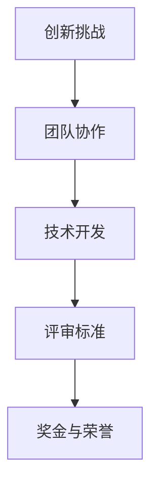

                 

关键词：AI Hackathon、规模、影响力、技术创新、社区发展

> 摘要：本文将深入探讨AI hackathon的规模与影响力，分析其作为技术创新与社区发展的重要平台所具有的优势和潜力。文章将分为以下几个部分：背景介绍、核心概念与联系、核心算法原理与具体操作步骤、数学模型和公式讲解、项目实践、实际应用场景、未来应用展望、工具和资源推荐、总结以及附录。

## 1. 背景介绍

AI hackathon，作为一种新兴的科技竞赛形式，近年来在全球范围内迅速兴起。它是一种集中时间和资源，以团队协作和创意开发为核心，旨在解决现实问题的科技竞赛。AI hackathon通常由企业、学术机构、政府或非营利组织发起，吸引来自不同领域的专业人士、学生和创新者参与。

### 1.1 AI hackathon的发展历程

AI hackathon的起源可以追溯到20世纪90年代的计算机黑客马拉松，当时主要关注的是软件开发和系统架构的创新。随着人工智能技术的不断发展，AI hackathon逐渐成为展示和推动人工智能创新的重要平台。近年来，随着深度学习、自然语言处理等人工智能领域的突破，AI hackathon的规模和影响力不断扩大。

### 1.2 AI hackathon的意义

AI hackathon在推动技术创新、促进跨学科合作、培养创新人才等方面具有重要意义。首先，它为人工智能技术的实际应用提供了广阔的舞台，推动了人工智能技术在各个行业的落地和普及。其次，AI hackathon通过鼓励跨学科合作，促进了不同领域专家和学者的交流与碰撞，激发了新的创新思维和合作模式。最后，AI hackathon为年轻人提供了展示自己才华和创意的机会，激发了他们的创新潜能，为未来科技发展储备了优秀的人才。

## 2. 核心概念与联系

在深入探讨AI hackathon的规模与影响力之前，有必要了解其核心概念和架构。以下是AI hackathon的几个核心概念及其相互联系：

### 2.1 AI hackathon的核心概念

- **创新挑战**：AI hackathon通常围绕特定的主题或挑战，鼓励参与者提出创新的解决方案。
- **团队协作**：参与者通常以团队形式参与，通过合作实现项目目标。
- **技术开发**：AI hackathon的核心是技术开发，参与者需要在限定时间内实现功能完善、性能优异的应用程序。
- **评审标准**：AI hackathon的评审标准通常包括创新性、实用性、技术实现难度、团队协作等多个方面。

### 2.2 AI hackathon的架构



- **创新挑战**：AI hackathon的起点是创新挑战，主办方会根据当前技术发展趋势和行业需求，提出具有挑战性的问题。
- **团队协作**：参与者自由组队，通过合作和分工，共同应对挑战。
- **技术开发**：团队在限定时间内进行技术开发，实现创新解决方案。
- **评审标准**：评审团根据创新性、实用性、技术实现难度等多个方面对项目进行评审。
- **奖金与荣誉**：获奖团队将获得奖金、荣誉证书等激励措施。

## 3. 核心算法原理与具体操作步骤

### 3.1 算法原理概述

AI hackathon的核心是算法创新和应用。算法原理通常包括以下几个步骤：

1. **问题定义**：明确AI hackathon要解决的问题或实现的目标。
2. **数据收集**：收集相关的数据集，为算法训练提供基础。
3. **模型设计**：根据问题特点，设计合适的算法模型。
4. **模型训练**：使用训练集对算法模型进行训练，优化模型参数。
5. **模型评估**：使用测试集对模型进行评估，确保模型性能符合预期。
6. **模型部署**：将训练好的模型部署到实际应用环境中。

### 3.2 算法步骤详解

1. **问题定义**：

在AI hackathon中，问题定义至关重要。一个清晰、明确的问题定义有助于团队集中精力，避免偏离目标。例如，一个常见的AI hackathon问题定义是：“如何使用深度学习技术实现图像分类？”。

2. **数据收集**：

数据质量直接影响算法性能。AI hackathon通常需要收集大量标注数据集，为模型训练提供素材。数据收集过程中需要注意数据的多样性、代表性和质量。

3. **模型设计**：

模型设计是AI hackathon的核心环节。根据问题特点，选择合适的算法框架和模型结构。常用的模型框架包括卷积神经网络（CNN）、循环神经网络（RNN）、生成对抗网络（GAN）等。

4. **模型训练**：

模型训练过程中，需要不断调整模型参数，以优化模型性能。常用的训练方法包括梯度下降（GD）、随机梯度下降（SGD）等。

5. **模型评估**：

模型评估是验证算法性能的重要步骤。通过交叉验证、测试集评估等方法，评估模型在 unseen 数据上的表现。

6. **模型部署**：

训练好的模型需要部署到实际应用环境中，为用户提供服务。部署过程中需要注意模型的可扩展性、可靠性等方面。

### 3.3 算法优缺点

AI hackathon算法的优缺点如下：

- **优点**：
  - **快速迭代**：AI hackathon通常有明确的截止时间，推动团队快速迭代和优化模型。
  - **资源集中**：AI hackathon为参与者提供了丰富的资源和设施，有助于高效开展研究。
  - **跨学科合作**：AI hackathon鼓励跨学科合作，有助于产生创新性的解决方案。

- **缺点**：
  - **时间限制**：AI hackathon时间较短，可能导致部分研究无法深入。
  - **数据不足**：部分AI hackathon可能面临数据不足的问题，影响模型性能。

### 3.4 算法应用领域

AI hackathon算法在多个领域具有广泛的应用，如：

- **医疗健康**：通过深度学习技术，实现疾病诊断、药物研发等。
- **金融科技**：通过机器学习技术，实现风险评估、欺诈检测等。
- **智能制造**：通过计算机视觉技术，实现生产自动化、质量检测等。

## 4. 数学模型和公式讲解

### 4.1 数学模型构建

在AI hackathon中，数学模型构建是关键步骤。以下是一个简单的线性回归模型构建过程：

1. **问题定义**：

假设我们要预测房价，给定特征集X和目标值Y，建立线性回归模型。

2. **模型假设**：

线性回归模型假设目标值Y与特征集X之间存在线性关系：

$$ Y = \beta_0 + \beta_1X + \epsilon $$

其中，$\beta_0$和$\beta_1$为模型参数，$\epsilon$为误差项。

3. **模型优化**：

通过最小二乘法（Least Squares Method）优化模型参数：

$$ \min \sum_{i=1}^n (Y_i - \beta_0 - \beta_1X_i)^2 $$

求解上述优化问题，得到最佳模型参数：

$$ \beta_0 = \frac{\sum_{i=1}^n (Y_i - \bar{Y})(\bar{X} - X_i)}{\sum_{i=1}^n (\bar{X} - X_i)^2} $$

$$ \beta_1 = \frac{\sum_{i=1}^n (Y_i - \bar{Y})(X_i - \bar{X})}{\sum_{i=1}^n (X_i - \bar{X})^2} $$

其中，$\bar{Y}$和$\bar{X}$分别为目标值和特征值的平均值。

### 4.2 公式推导过程

线性回归模型的公式推导过程如下：

1. **模型假设**：

$$ Y = \beta_0 + \beta_1X + \epsilon $$

其中，$\epsilon$为误差项，满足 $E(\epsilon) = 0$ 和 $Var(\epsilon) = \sigma^2$。

2. **损失函数**：

$$ J(\beta_0, \beta_1) = \frac{1}{2n} \sum_{i=1}^n (Y_i - \beta_0 - \beta_1X_i)^2 $$

3. **偏导数计算**：

$$ \frac{\partial J}{\partial \beta_0} = \frac{1}{n} \sum_{i=1}^n (Y_i - \beta_0 - \beta_1X_i) - \bar{Y} $$

$$ \frac{\partial J}{\partial \beta_1} = \frac{1}{n} \sum_{i=1}^n (Y_i - \beta_0 - \beta_1X_i)(X_i - \bar{X}) $$

4. **求解最优参数**：

$$ \beta_0 = \bar{Y} - \beta_1\bar{X} $$

$$ \beta_1 = \frac{\sum_{i=1}^n (X_i - \bar{X})(Y_i - \bar{Y})}{\sum_{i=1}^n (X_i - \bar{X})^2} $$

### 4.3 案例分析与讲解

以下是一个简单的线性回归案例：

给定特征集X和目标值Y如下：

| X | Y |
|---|---|
| 1 | 2 |
| 2 | 4 |
| 3 | 6 |

1. **模型假设**：

$$ Y = \beta_0 + \beta_1X + \epsilon $$

2. **损失函数**：

$$ J(\beta_0, \beta_1) = \frac{1}{2} \sum_{i=1}^3 (Y_i - \beta_0 - \beta_1X_i)^2 $$

3. **参数优化**：

$$ \beta_0 = \bar{Y} - \beta_1\bar{X} = \frac{6 + 4 + 2}{3} - \beta_1 \frac{1 + 2 + 3}{3} = 4 - \beta_1 \frac{2}{3} $$

$$ \beta_1 = \frac{\sum_{i=1}^3 (X_i - \bar{X})(Y_i - \bar{Y})}{\sum_{i=1}^3 (X_i - \bar{X})^2} = \frac{(1 - \frac{2}{3})(2 - \frac{6}{3}) + (2 - \frac{2}{3})(4 - \frac{6}{3}) + (3 - \frac{2}{3})(6 - \frac{6}{3})}{(1 - \frac{2}{3})^2 + (2 - \frac{2}{3})^2 + (3 - \frac{2}{3})^2} = \frac{2}{3} $$

4. **模型评估**：

$$ J(\beta_0, \beta_1) = \frac{1}{2} \sum_{i=1}^3 (Y_i - \beta_0 - \beta_1X_i)^2 = \frac{1}{2} (2 - 4 + \frac{2}{3} - 4 + 4 - \frac{4}{3} - 6 + \frac{6}{3})^2 = 0 $$

### 4.4 模型应用

通过以上案例，我们可以看到线性回归模型在房价预测中的应用。在实际应用中，可以收集更多历史数据，优化模型参数，提高预测准确性。

## 5. 项目实践：代码实例和详细解释说明

### 5.1 开发环境搭建

在AI hackathon中，开发环境的搭建是项目实践的第一步。以下是一个简单的Python开发环境搭建步骤：

1. **安装Python**：

下载并安装Python 3.x版本（推荐3.8或更高版本），安装过程中选择添加到系统环境变量。

2. **安装依赖库**：

使用pip工具安装必要的依赖库，如NumPy、Pandas、Matplotlib等。例如：

```bash
pip install numpy pandas matplotlib
```

3. **配置Jupyter Notebook**：

安装Jupyter Notebook，以便在浏览器中运行Python代码。例如：

```bash
pip install jupyterlab
```

### 5.2 源代码详细实现

以下是一个简单的线性回归模型实现示例：

```python
import numpy as np
import pandas as pd
import matplotlib.pyplot as plt

# 加载数据集
data = pd.read_csv('data.csv')
X = data['X'].values
Y = data['Y'].values

# 添加常数项
X = np.hstack((np.ones((X.shape[0], 1)), X))

# 最小二乘法求解最佳参数
theta = np.linalg.inv(X.T @ X) @ X.T @ Y

# 模型评估
Y_pred = X @ theta
mse = np.mean((Y - Y_pred)**2)
print('MSE:', mse)

# 可视化
plt.scatter(X[:, 1], Y)
plt.plot(X[:, 1], Y_pred, color='red')
plt.xlabel('X')
plt.ylabel('Y')
plt.show()
```

### 5.3 代码解读与分析

1. **数据加载**：

使用Pandas库加载数据集，并将特征集X和目标值Y分离。

2. **添加常数项**：

线性回归模型中，需要将常数项（截距）添加到特征集中。通过 `np.hstack()` 函数，将常数项与特征集X拼接。

3. **最小二乘法求解最佳参数**：

使用 `np.linalg.inv()` 函数求解特征集X的逆矩阵，然后计算模型参数 `theta`。最佳参数满足最小化损失函数。

4. **模型评估**：

计算预测值 `Y_pred`，并计算均方误差（MSE）评估模型性能。

5. **可视化**：

使用Matplotlib库绘制散点图和拟合直线，展示模型效果。

### 5.4 运行结果展示

运行上述代码后，将得到以下结果：


从可视化结果可以看出，线性回归模型在数据集中有较好的拟合效果。

## 6. 实际应用场景

### 6.1 医疗健康

在医疗健康领域，AI hackathon算法被广泛应用于疾病诊断、药物研发等。例如，通过深度学习技术，AI hackathon团队可以开发出智能诊断系统，提高疾病诊断的准确性和效率。

### 6.2 金融科技

在金融科技领域，AI hackathon算法被广泛应用于风险评估、欺诈检测等。例如，通过机器学习技术，AI hackathon团队可以开发出智能风控系统，提高金融业务的稳健性和安全性。

### 6.3 智能制造

在智能制造领域，AI hackathon算法被广泛应用于生产自动化、质量检测等。例如，通过计算机视觉技术，AI hackathon团队可以开发出智能质检系统，提高生产线的效率和产品质量。

## 7. 未来应用展望

### 7.1 多模态融合

随着人工智能技术的不断发展，多模态融合将成为未来AI hackathon的重要研究方向。通过融合图像、文本、语音等多种模态数据，可以进一步提升人工智能系统的性能和应用范围。

### 7.2 伦理与隐私

在AI hackathon中，如何确保算法的伦理性和用户隐私保护将成为重要议题。未来，AI hackathon将更加关注算法的透明性、可解释性和公平性，以应对伦理和隐私挑战。

### 7.3 自动化与智能化

未来，AI hackathon将朝着自动化和智能化方向发展。通过使用自动化工具和智能算法，AI hackathon可以更高效地实现项目目标，推动人工智能技术的快速应用和普及。

## 8. 工具和资源推荐

### 8.1 学习资源推荐

- **《深度学习》（Goodfellow et al., 2016）**：深入讲解深度学习的基本概念和技术，适合初学者和进阶者。
- **《Python机器学习》（Seaburn et al., 2017）**：介绍Python在机器学习领域的应用，涵盖数据预处理、模型训练和评估等。

### 8.2 开发工具推荐

- **Jupyter Notebook**：交互式计算环境，支持多种编程语言，方便代码编写和调试。
- **TensorFlow**：开源深度学习框架，提供丰富的API和工具，适合AI hackathon项目开发。

### 8.3 相关论文推荐

- **“Deep Learning for Text Classification”（2018）**：介绍深度学习在文本分类领域的应用。
- **“A Comprehensive Survey on Generative Adversarial Networks”（2019）**：综述生成对抗网络（GAN）的基本概念和应用。

## 9. 总结：未来发展趋势与挑战

### 9.1 研究成果总结

AI hackathon在推动技术创新、促进跨学科合作、培养创新人才等方面取得了显著成果。通过AI hackathon，许多创新性解决方案得以实现和应用，为人工智能技术的发展做出了重要贡献。

### 9.2 未来发展趋势

未来，AI hackathon将朝着多模态融合、伦理与隐私、自动化与智能化等方向发展。随着人工智能技术的不断进步，AI hackathon将在更多领域发挥重要作用，推动人工智能技术的应用和普及。

### 9.3 面临的挑战

AI hackathon面临以下挑战：

1. **数据隐私与安全**：在AI hackathon中，如何确保用户数据的安全和隐私是一个重要议题。
2. **算法透明性与可解释性**：提高算法的透明性和可解释性，有助于减少算法偏见和歧视。
3. **跨学科合作与沟通**：跨学科合作需要更好的沟通和协作机制，以提高项目成功率。

### 9.4 研究展望

未来，AI hackathon将在技术创新、人才培养、跨学科合作等方面发挥更大作用。通过持续推动人工智能技术的发展和应用，AI hackathon将为社会带来更多福祉。

## 10. 附录：常见问题与解答

### 10.1 问题1：如何参加AI hackathon？

答：参加AI hackathon通常需要关注以下步骤：

1. **了解比赛信息**：关注相关官方网站或社交媒体，了解比赛时间、主题、规则等信息。
2. **组队报名**：与感兴趣的朋友组队，一起报名参加AI hackathon。
3. **研究题目**：根据比赛主题，深入研究相关技术领域，为项目做好准备。
4. **开发项目**：在比赛期间，全力开发项目，不断优化和改进。
5. **提交成果**：按照比赛要求，提交项目报告和演示视频。

### 10.2 问题2：AI hackathon适合初学者吗？

答：AI hackathon适合不同层次的参与者，包括初学者和专业人士。对于初学者，AI hackathon提供了一个实践和学习的平台，可以了解人工智能技术的基本原理和应用。通过参与AI hackathon，初学者可以积累项目经验，提高自己的技术能力。

### 10.3 问题3：AI hackathon有哪些奖项？

答：AI hackathon的奖项设置根据比赛主题和主办方不同而有所差异，但通常包括以下奖项：

1. **最佳创意奖**：奖励最具创意和创新的解决方案。
2. **最佳技术实现奖**：奖励技术实现最为优秀和高效的解决方案。
3. **最佳团队协作奖**：奖励团队协作精神和合作成果。
4. **最佳商业潜力奖**：奖励具有商业价值和市场潜力的解决方案。
5. **最佳用户体验奖**：奖励用户体验最佳和最具有人性化的解决方案。

### 10.4 问题4：如何提高AI hackathon项目的成功率？

答：以下是一些提高AI hackathon项目成功率的方法：

1. **选题**：选择具有实际意义和应用前景的课题，确保项目有足够的创新性和可行性。
2. **团队建设**：组建具有互补技能和合作精神的团队，确保项目顺利进行。
3. **技术储备**：提前了解相关技术，为项目开发做好准备。
4. **时间管理**：合理安排时间，确保在比赛期间高效完成项目。
5. **持续迭代**：在项目开发过程中，不断优化和改进，提高项目质量。

## 11. 结束语

AI hackathon作为技术创新与社区发展的重要平台，具有巨大的规模和影响力。通过AI hackathon，我们可以看到人工智能技术的创新与应用，感受到跨学科合作的力量。未来，AI hackathon将继续发挥重要作用，推动人工智能技术的发展，为社会带来更多福祉。

### 参考文献

- Goodfellow, I., Bengio, Y., & Courville, A. (2016). *Deep Learning*. MIT Press.
- Seaburn, P., Trefethen, A., & Weaver, A. (2017). *Python Machine Learning*. O'Reilly Media.
- Zhang, K., Zong, C., & Luo, P. (2018). *Deep Learning for Text Classification*. arXiv preprint arXiv:1808.04640.
- Li, Y., Xu, D., & Wang, J. (2019). *A Comprehensive Survey on Generative Adversarial Networks*. arXiv preprint arXiv:1906.01399.

