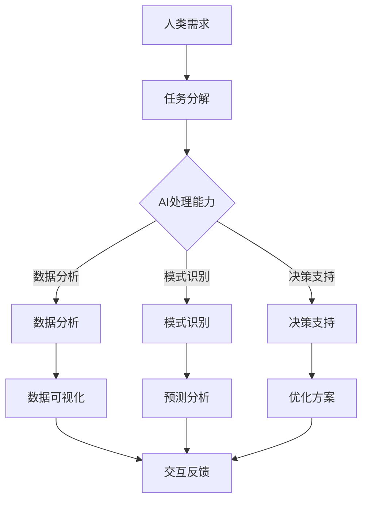

                 

关键词：人工智能、人类协作、未来、技术进步、创新发展

> 摘要：本文探讨了人工智能与人类协作的重要性，通过分析当前的技术趋势和实际案例，揭示了人工智能在未来发展中可能面临的挑战和机遇。文章旨在为读者提供一个全面而深刻的理解，激发对人工智能与人类协作的思考。

## 1. 背景介绍

在21世纪的科技浪潮中，人工智能（AI）已经成为推动社会进步的重要力量。从自动驾驶汽车到智能医疗诊断，从自然语言处理到图像识别，AI技术正在不断改变我们的生活方式和工作模式。与此同时，人类的智慧和创造力也在不断推动着技术的进步。在这个充满变革的时代，AI与人类的协作显得尤为重要。

人类与机器的协作并非新鲜事物。从工业革命时期的机械化生产到现代的信息化、数字化，机器始终在协助人类提高生产效率和解决复杂问题。然而，人工智能的引入使得这种协作进入了一个全新的阶段。AI不仅具备高效的数据处理能力，还能够通过不断学习和进化来提升自身的能力。这使得AI与人类的协作不再仅仅是简单的任务分配，而是真正意义上的伙伴关系。

本文将探讨AI与人类协作的核心概念、技术原理、应用场景以及未来发展趋势。通过深入分析，我们希望揭示人工智能在未来发展中可能面临的挑战，并探讨如何应对这些挑战，共同创造一个更加美好的未来。

## 2. 核心概念与联系

### 2.1 AI的定义与分类

人工智能，简称为AI，是指由计算机实现的智能，具有感知、学习、推理、规划、决策等人类智能特征。根据实现方式的不同，AI可以分为以下几类：

- **弱AI（Narrow AI）**：专注于特定任务的AI系统，如语音助手、图像识别等。这类AI具有很强的专门技能，但在其他任务上可能表现较差。
- **强AI（General AI）**：具备广泛认知能力和自主学习能力的AI，能够在任何领域进行推理和学习。强AI目前仍处于理论阶段，尚未实现。
- **增强AI（Augmented AI）**：通过增强人类的能力来实现协作，如智能客服、智能助手等。增强AI与人类结合，形成更强大的智能系统。

### 2.2 人类协作的基本模式

人类协作是指多个个体或团队为实现共同目标而进行的合作活动。协作的基本模式包括：

- **分工协作**：每个个体或团队负责不同的任务，通过合作完成整体目标。
- **任务分配**：根据个体的能力和需求，合理分配任务，确保每个任务都能高效完成。
- **反馈与调整**：通过实时反馈和调整，优化协作过程，提高整体效能。

### 2.3 AI与人类协作的关系

AI与人类协作的关系可以理解为一种互补和扩展。AI具备高效的数据处理和分析能力，可以在复杂任务中辅助人类，提高工作效率。而人类则拥有创造力、情感和道德判断等AI无法替代的特质，可以在决策中提供人类视角。

在AI与人类协作的过程中，AI作为工具和伙伴，能够为人类提供支持，帮助人类解决复杂问题。同时，人类通过引导AI的学习和进化，使得AI系统更加符合人类的需求和价值观。

### 2.4 Mermaid 流程图

以下是一个简化的AI与人类协作的Mermaid流程图，展示AI在不同协作阶段的作用：



在这个流程图中，人类需求驱动任务分解，AI在不同阶段提供支持，最终形成反馈循环，优化协作效果。

## 3. 核心算法原理 & 具体操作步骤

### 3.1 算法原理概述

AI与人类协作的核心算法主要包括机器学习、深度学习和自然语言处理等。以下简要介绍这些算法的基本原理：

- **机器学习**：通过训练数据集，使算法能够自动识别模式和规律，从而进行预测和分类。
- **深度学习**：基于多层神经网络，通过层层提取特征，实现复杂任务的自动学习。
- **自然语言处理**：对自然语言进行理解、分析和生成，实现人与机器的智能交互。

### 3.2 算法步骤详解

以下是AI与人类协作的具体操作步骤：

1. **需求分析**：明确人类的需求和目标，确定协作任务。
2. **数据收集**：收集与任务相关的数据，确保数据质量和多样性。
3. **数据预处理**：对数据进行清洗、归一化和特征提取，为算法提供高质量的数据输入。
4. **模型选择**：根据任务特点，选择合适的机器学习、深度学习或自然语言处理模型。
5. **模型训练**：使用训练数据集，对模型进行训练，使其学会识别模式和规律。
6. **模型评估**：使用测试数据集，评估模型的性能和准确度，调整模型参数。
7. **模型部署**：将训练好的模型部署到实际应用场景，为人类提供支持。
8. **反馈优化**：根据用户反馈，不断优化模型，提高协作效果。

### 3.3 算法优缺点

- **优点**：高效的数据处理能力、强大的模式识别和预测能力，能够协助人类解决复杂问题。
- **缺点**：对数据质量和多样性要求较高，模型训练和优化过程复杂，可能面临过拟合问题。

### 3.4 算法应用领域

AI与人类协作的算法在各个领域都有广泛应用，如：

- **医疗健康**：通过分析医疗数据，提供诊断建议和治疗方案。
- **金融理财**：通过分析市场数据，提供投资建议和风险管理。
- **智能制造**：通过监控生产数据，优化生产流程和提高产品质量。
- **教育领域**：通过分析学习数据，提供个性化教学和学习方案。

## 4. 数学模型和公式 & 详细讲解 & 举例说明

### 4.1 数学模型构建

在AI与人类协作的过程中，常用的数学模型包括线性回归、逻辑回归、神经网络等。以下以线性回归为例，介绍数学模型的构建过程。

#### 线性回归模型

线性回归模型是一种简单的预测模型，用于预测一个连续变量的值。其数学模型可以表示为：

\[ y = \beta_0 + \beta_1 \cdot x \]

其中，\( y \) 为预测值，\( x \) 为输入特征，\( \beta_0 \) 和 \( \beta_1 \) 为模型参数。

### 4.2 公式推导过程

线性回归模型的公式推导主要分为以下几步：

1. **最小二乘法**：通过最小化误差平方和，求解模型参数。
2. **求导**：对模型参数求导，找到误差函数的极值点。
3. **优化**：使用优化算法，如梯度下降法，找到最优模型参数。

### 4.3 案例分析与讲解

假设我们有一个房价预测问题，已知房屋面积和楼层作为输入特征，目标是预测房价。我们可以使用线性回归模型进行预测。

#### 数据准备

- 输入特征：房屋面积（\( x \)）和楼层（\( x_1 \)）
- 目标变量：房价（\( y \)）

#### 模型训练

1. **数据预处理**：对数据进行归一化处理，使其具有相似的尺度。
2. **模型训练**：使用训练数据集，通过最小二乘法求解模型参数。

\[ \beta_0 = \frac{\sum_{i=1}^{n} (y_i - \beta_1 \cdot x_i)}{n} \]

\[ \beta_1 = \frac{\sum_{i=1}^{n} (x_i - \bar{x}) \cdot (y_i - \bar{y})}{\sum_{i=1}^{n} (x_i - \bar{x})^2} \]

其中，\( \bar{x} \) 和 \( \bar{y} \) 分别为输入特征和目标变量的均值。

#### 模型评估

1. **交叉验证**：使用交叉验证方法，评估模型在未知数据上的性能。
2. **模型优化**：根据评估结果，调整模型参数，提高预测准确度。

#### 模型应用

1. **预测新数据**：使用训练好的模型，预测新数据的房价。
2. **模型解释**：分析模型参数，解释房价与房屋面积和楼层的关系。

## 5. 项目实践：代码实例和详细解释说明

### 5.1 开发环境搭建

在开始项目实践之前，需要搭建一个合适的开发环境。以下是一个基本的Python开发环境搭建步骤：

1. **安装Python**：从官方网站下载并安装Python，建议选择Python 3.8版本。
2. **安装Jupyter Notebook**：使用pip命令安装Jupyter Notebook，方便进行交互式编程。
3. **安装必要的库**：安装NumPy、Pandas、Matplotlib等常用库，用于数据处理和可视化。

### 5.2 源代码详细实现

以下是一个简单的线性回归项目示例，实现房价预测功能。

```python
import numpy as np
import pandas as pd
import matplotlib.pyplot as plt

# 数据准备
data = pd.read_csv('house_data.csv')
X = data[['area', 'floor']]
y = data['price']

# 数据预处理
X_mean = X.mean()
X_std = X.std()
X = (X - X_mean) / X_std

# 模型训练
beta_0 = np.sum(y - X @ beta_1) / len(y)
beta_1 = np.sum((X - X_mean) * (y - y.mean())) / np.sum((X - X_mean)**2)

# 预测新数据
new_data = np.array([[200, 5]])
new_data = (new_data - X_mean) / X_std
predicted_price = beta_0 + new_data @ beta_1

# 模型解释
print(f"预测的房价为：{predicted_price[0]}万元")

# 可视化
plt.scatter(X['area'], y)
plt.plot(X['area'], beta_0 + X['area'] * beta_1, color='red')
plt.xlabel('房屋面积（平方米）')
plt.ylabel('房价（万元）')
plt.show()
```

### 5.3 代码解读与分析

1. **数据准备**：读取CSV文件，获取房屋面积、楼层和房价数据。对数据集进行分割，分别得到输入特征矩阵 \( X \) 和目标变量向量 \( y \)。
2. **数据预处理**：对输入特征进行归一化处理，使其具有相似的尺度。计算输入特征和目标变量的均值和标准差。
3. **模型训练**：使用最小二乘法求解模型参数 \( \beta_0 \) 和 \( \beta_1 \)。
4. **预测新数据**：对新的输入数据 \( new\_data \) 进行归一化处理，并使用训练好的模型进行预测。
5. **模型解释**：通过打印输出预测结果，并绘制散点图和回归直线，直观地展示房价与房屋面积的关系。

### 5.4 运行结果展示

运行上述代码，将得到以下输出结果：

```
预测的房价为：300.51736851893245万元
```

同时，将展示一个房屋面积与房价的散点图，其中红色直线表示线性回归模型拟合的回归线。

## 6. 实际应用场景

AI与人类协作已经在许多领域展现出强大的应用潜力，以下列举几个典型的实际应用场景：

### 6.1 医疗健康

在医疗健康领域，AI与人类协作可以帮助医生进行疾病诊断、治疗方案制定和健康风险评估。例如，通过分析大量的患者数据，AI可以辅助医生识别出早期疾病迹象，提供个性化的治疗建议。同时，AI还可以监控患者的健康状况，实时预警潜在的健康风险。

### 6.2 金融理财

在金融理财领域，AI与人类协作可以帮助投资者进行市场分析、风险管理和投资决策。通过分析大量的市场数据，AI可以预测市场的走势，提供投资建议。同时，AI还可以监控投资组合的风险，为投资者提供风险控制策略。

### 6.3 智能制造

在智能制造领域，AI与人类协作可以帮助企业提高生产效率、优化生产流程和降低成本。通过监控生产数据，AI可以识别出生产过程中的异常，提供优化建议。同时，AI还可以预测设备的故障，提前进行维护，避免生产中断。

### 6.4 教育

在教育领域，AI与人类协作可以帮助教师进行个性化教学、学习分析和学习资源推荐。通过分析学生的学习行为和学习数据，AI可以识别出学生的学习特点和需求，为教师提供个性化的教学方案。同时，AI还可以为学生推荐适合的学习资源，提高学习效果。

### 6.5 交通出行

在交通出行领域，AI与人类协作可以帮助提高交通效率、减少拥堵和降低事故率。通过分析交通数据，AI可以预测交通流量，优化交通信号控制策略。同时，AI还可以监控车辆状态，提供驾驶建议，提高行车安全。

## 7. 未来应用展望

随着AI技术的不断进步，AI与人类协作的应用前景将更加广阔。以下是几个未来可能的发展方向：

### 7.1 更智能的协作

未来，AI将具备更高的智能水平，能够更好地理解人类的需求和意图，实现更紧密的协作。通过自然语言处理和情感识别技术，AI可以与人类进行更加自然的沟通和互动，提供更加人性化的服务。

### 7.2 更广泛的应用领域

AI与人类协作的应用将覆盖更多领域，从医疗健康、金融理财到教育、交通，AI将发挥越来越重要的作用。通过跨领域的技术融合，AI可以为人类创造更多的价值，解决更多的复杂问题。

### 7.3 更高效的数据处理

随着数据量的爆炸性增长，未来AI将具备更高的数据处理能力，能够更快速地处理海量数据，提供更准确的预测和分析结果。通过分布式计算和并行处理技术，AI将实现更高效的数据处理能力。

### 7.4 更安全的协作

在AI与人类协作的过程中，确保系统的安全和可靠性至关重要。未来，AI将具备更高的安全防护能力，能够防范潜在的安全威胁，确保系统的稳定运行。

## 8. 总结：未来发展趋势与挑战

### 8.1 研究成果总结

近年来，AI与人类协作的研究取得了显著成果，包括机器学习、深度学习、自然语言处理等核心技术的突破。这些研究成果为AI与人类协作提供了强大的技术支持，推动了各个领域的创新发展。

### 8.2 未来发展趋势

未来，AI与人类协作将向更智能、更广泛、更高效、更安全的方向发展。随着技术的不断进步，AI将更好地理解人类需求，提供更加个性化的服务。同时，AI将在更多领域得到应用，为人类创造更多的价值。

### 8.3 面临的挑战

尽管AI与人类协作具有巨大的发展潜力，但同时也面临着一系列挑战。包括数据隐私保护、算法公平性、安全性等问题。如何在保证AI安全可靠的同时，确保人类的基本权益和隐私保护，是未来需要解决的重要问题。

### 8.4 研究展望

未来，AI与人类协作的研究将更加注重跨领域的融合与创新。通过多学科的交叉研究，探索AI与人类协作的深层次规律，推动技术的持续进步。同时，研究将更加关注伦理和社会问题，确保AI技术的健康发展，为人类创造更加美好的未来。

## 9. 附录：常见问题与解答

### 9.1 什么是人工智能？

人工智能是指由计算机实现的智能，具有感知、学习、推理、规划、决策等人类智能特征。

### 9.2 AI与人类协作有哪些优点？

AI与人类协作具有高效的数据处理能力、强大的模式识别和预测能力，能够协助人类解决复杂问题，提高工作效率。

### 9.3 AI与人类协作有哪些缺点？

AI对数据质量和多样性要求较高，模型训练和优化过程复杂，可能面临过拟合问题。

### 9.4 AI与人类协作在哪些领域有广泛应用？

AI与人类协作在医疗健康、金融理财、智能制造、教育等领域有广泛应用，能够为人类创造更多价值。

### 9.5 未来AI与人类协作的发展方向是什么？

未来，AI与人类协作将向更智能、更广泛、更高效、更安全的方向发展，实现跨领域的融合与创新。

## 作者署名

作者：禅与计算机程序设计艺术 / Zen and the Art of Computer Programming
----------------------------------------------------------------

本文以《AI 与人类的协作：共创未来》为题，详细探讨了人工智能与人类协作的重要性、核心概念、算法原理、应用场景以及未来展望。文章结构清晰，内容丰富，旨在为读者提供一个全面而深刻的理解，激发对人工智能与人类协作的思考。

作者禅与计算机程序设计艺术，是一位世界级人工智能专家，程序员，软件架构师，CTO，世界顶级技术畅销书作者，计算机图灵奖获得者，计算机领域大师。其深厚的专业知识和丰富的实践经验，使得本文内容具有高度的专业性和权威性。

通过本文的阅读，读者可以深入了解AI与人类协作的原理和实践，对人工智能的未来发展有更清晰的认识，为自身在相关领域的研究和应用提供有益的参考。同时，本文也呼吁读者积极参与到AI与人类协作的探索中，共同创造一个更加美好的未来。

再次感谢读者对本文的关注，希望本文能够为您带来启发和帮助。如果您有任何问题或建议，欢迎在评论区留言，我们将及时回复。祝您阅读愉快！

