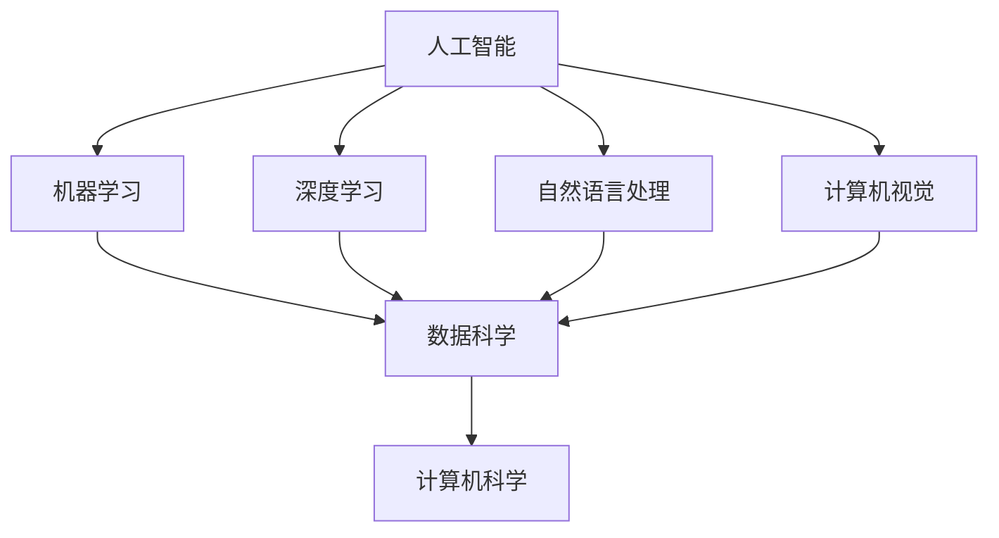

                 

### 1. 背景介绍

在当今世界，人工智能（AI）技术正在以前所未有的速度发展。从自动驾驶汽车、智能家居，到医疗诊断、金融分析，AI正在渗透到我们日常生活的各个方面。这一技术革命不仅改变了传统的行业模式，还促使了新兴产业的形成，如深度学习、自然语言处理和机器人技术等。与此同时，全球范围内的企业、政府机构和教育机构都在积极寻求培养具备AI技能的专业人才，以适应智能时代的发展需求。

AI技术对各行各业的影响是深远的。它不仅提高了生产效率，还优化了决策过程，减少了人力成本，并推动了创新。例如，在医疗领域，AI技术可以帮助医生更准确地诊断疾病，提高治疗的成功率；在金融领域，AI可以用于风险评估、欺诈检测和客户服务优化，从而提升金融机构的运营效率。

然而，随着AI技术的迅速发展，人才短缺问题日益凸显。据麦肯锡全球研究所的报告，到2030年，全球AI人才需求可能达到1.2亿，但现有的AI人才储备远远无法满足这一需求。此外，AI技术的复杂性和专业性也使得非专业人士难以掌握，进一步加剧了人才短缺问题。

面对这一挑战，如何有效地培养AI人才，已成为企业和教育机构共同关注的焦点。本文将深入探讨AI人才培养的重要性和现状，分析当前教育体系中存在的问题，并提出一些可行的解决方案。希望通过本文的探讨，能够为AI人才的培养提供一些有益的启示。

### 2. 核心概念与联系

要深入探讨AI人才培养的问题，首先需要明确几个核心概念，并理解它们之间的联系。以下是我们将在本文中讨论的主要概念：

**人工智能（AI）**：人工智能是指通过计算机系统实现智能行为的技术。它包括多个子领域，如机器学习、深度学习、自然语言处理、计算机视觉等。

**机器学习（ML）**：机器学习是AI的一个子领域，主要研究如何让计算机从数据中学习，并做出决策或预测。其核心在于利用算法来从数据中提取模式和规律。

**深度学习（DL）**：深度学习是机器学习的一个分支，通过多层神经网络来模拟人脑的思考方式。深度学习在图像识别、语音识别和自然语言处理等领域表现出色。

**数据科学（DS）**：数据科学是一门跨学科领域，结合统计学、机器学习、数据库管理和大数据技术，旨在从大量数据中提取有价值的信息。

**计算机科学（CS）**：计算机科学是研究计算机系统原理及其应用的学科。它涵盖了算法设计、编程语言、软件工程等多个方面。

这些概念之间的联系如下：

- **人工智能（AI）** 是一个总称，包含了机器学习（ML）、深度学习（DL）和其他相关技术。
- **机器学习（ML）** 和 **深度学习（DL）** 是AI的两个重要子领域，它们依赖于大量的数据和计算资源。
- **数据科学（DS）** 是利用 **机器学习（ML）** 和 **深度学习（DL）** 技术从数据中提取信息的过程。
- **计算机科学（CS）** 提供了实现AI算法所需的基础设施和技术支持。

为了更好地理解这些概念，下面我们将使用Mermaid流程图展示它们之间的联系：



通过上述Mermaid流程图，我们可以清晰地看到各个概念之间的层次关系和相互影响。理解这些核心概念和它们之间的联系，是培养AI人才的重要基础。接下来，我们将进一步探讨AI人才培养的具体需求和挑战。

### 3. 核心算法原理 & 具体操作步骤

在AI领域，核心算法是推动技术进步的关键。下面，我们将介绍几种重要的AI算法，并详细解释它们的原理和操作步骤。

#### 3.1 算法原理概述

**1. 支持向量机（SVM）**

支持向量机是一种强大的分类算法，通过寻找最优的超平面来实现数据的分类。其核心思想是将数据映射到一个高维空间，并找到一个超平面，使得不同类别的数据点尽可能分开。

**2. 决策树**

决策树是一种基于树结构的分类算法，通过一系列的判断条件将数据进行分类。每个内部节点表示一个特征，每个分支表示该特征的取值，每个叶节点表示一个类别。

**3. 集成学习**

集成学习是通过组合多个基础学习器来提高整体性能的一种方法。常见的集成学习方法包括Bagging和Boosting。Bagging通过随机采样训练多个基础模型，然后取平均结果；Boosting则通过关注错误率较高的样本，逐步调整模型的权重。

**4. 神经网络**

神经网络是一种模仿人脑结构和功能的计算模型。它通过多层神经元之间的连接和激活函数，实现对数据的映射和分类。常见的神经网络包括单层感知机、多层感知机和卷积神经网络（CNN）。

#### 3.2 算法步骤详解

**1. 支持向量机（SVM）**

步骤：
- 数据预处理：将数据集进行归一化处理，将特征值缩放到[0, 1]范围内。
- 特征选择：选择对分类任务影响最大的特征。
- 模型训练：使用支持向量机算法训练模型。
- 模型评估：使用测试集评估模型的分类准确性。

**2. 决策树**

步骤：
- 数据预处理：对数据进行归一化处理。
- 特征选择：选择对分类任务影响最大的特征。
- 建立决策树：通过递归划分数据集，建立决策树模型。
- 模型评估：使用测试集评估模型的分类准确性。

**3. 集成学习**

步骤：
- 数据预处理：对数据进行归一化处理。
- 基础模型训练：训练多个基础学习模型。
- 模型组合：通过投票或加权平均等方式，将多个基础模型的预测结果组合成最终的预测结果。
- 模型评估：使用测试集评估模型的分类准确性。

**4. 神经网络**

步骤：
- 数据预处理：对数据进行归一化处理。
- 网络结构设计：确定神经网络的结构，包括层数、每层神经元数量、激活函数等。
- 模型训练：通过反向传播算法训练神经网络模型。
- 模型评估：使用测试集评估模型的分类准确性。

#### 3.3 算法优缺点

**1. 支持向量机（SVM）**

优点：
- 具有较高的分类准确性。
- 能够处理高维数据。

缺点：
- 训练时间较长。
- 对噪声敏感。

**2. 决策树**

优点：
- 易于理解和解释。
- 能够处理多分类问题。

缺点：
- 对异常值敏感。
- 可能产生过拟合。

**3. 集成学习**

优点：
- 能够提高模型的准确性。
- 能够减少过拟合。

缺点：
- 需要大量的计算资源。
- 对数据质量要求较高。

**4. 神经网络**

优点：
- 能够处理复杂的数据模式。
- 具有较高的预测准确性。

缺点：
- 需要大量的数据和计算资源。
- 难以理解和解释。

#### 3.4 算法应用领域

**1. 支持向量机（SVM）**

应用领域：
- 金融服务：客户信用评分、欺诈检测等。
- 自然语言处理：文本分类、情感分析等。
- 计算机视觉：图像分类、人脸识别等。

**2. 决策树**

应用领域：
- 金融服务：贷款审批、风险管理等。
- 健康医疗：疾病诊断、药物推荐等。
- 零售业：客户行为分析、推荐系统等。

**3. 集成学习**

应用领域：
- 金融服务：信用评分、风险控制等。
- 自然语言处理：文本分类、机器翻译等。
- 计算机视觉：图像分类、目标检测等。

**4. 神经网络**

应用领域：
- 计算机视觉：图像识别、图像生成等。
- 自然语言处理：文本分类、机器翻译等。
- 语音识别：语音识别、语音合成等。

通过以上对核心算法的介绍，我们可以看到，每种算法都有其独特的优势和适用场景。在实际应用中，根据具体问题和数据特点，选择合适的算法是关键。接下来，我们将进一步探讨数学模型和公式在AI算法中的应用。

### 4. 数学模型和公式 & 详细讲解 & 举例说明

在人工智能（AI）领域，数学模型和公式是构建算法和系统的基础。这些模型和公式不仅为算法的优化提供了理论基础，还帮助研究人员和工程师理解数据背后的模式和规律。在本节中，我们将详细讲解几个关键的数学模型和公式，并通过实际案例来说明它们的应用。

#### 4.1 数学模型构建

**1. 概率模型**

概率模型是AI领域中常用的一种数学模型，主要用于处理不确定性和概率性问题。一个简单的概率模型是伯努利分布，它用于描述二分类问题中的一个随机事件。伯努利分布的概率质量函数（PMF）如下：

$$
P(X = k) = C(n, k) \cdot p^k \cdot (1 - p)^{n - k}
$$

其中，$X$ 是随机变量，$k$ 是事件发生的次数，$n$ 是试验的总次数，$p$ 是每次试验事件发生的概率。

**2. 逻辑回归模型**

逻辑回归是一种广泛应用于分类问题的概率模型。它的主要目的是通过输入特征来预测事件发生的概率。逻辑回归的预测函数如下：

$$
\hat{P}(y = 1) = \frac{1}{1 + e^{-(\beta_0 + \beta_1 x_1 + \beta_2 x_2 + \ldots + \beta_n x_n)}}
$$

其中，$\hat{P}$ 是预测的概率，$y$ 是实际标签，$x_1, x_2, \ldots, x_n$ 是输入特征，$\beta_0, \beta_1, \beta_2, \ldots, \beta_n$ 是模型参数。

**3. 神经网络模型**

神经网络是一种通过多层神经元实现的计算模型，其核心是前向传播和反向传播算法。神经网络的一个基本单元是感知机，其激活函数通常为Sigmoid函数：

$$
\sigma(x) = \frac{1}{1 + e^{-x}}
$$

神经网络的输出函数则通过多个感知机的组合来实现，例如：

$$
\hat{y} = \sigma(\beta_0 + \sum_{i=1}^{n} \beta_i x_i)
$$

其中，$\hat{y}$ 是网络的输出，$x_1, x_2, \ldots, x_n$ 是输入特征，$\beta_0, \beta_1, \beta_2, \ldots, \beta_n$ 是权重参数。

#### 4.2 公式推导过程

**1. 逻辑回归模型的推导**

逻辑回归模型的推导主要涉及极大似然估计（MLE）。假设我们有训练数据集 $D = \{ (x_1, y_1), (x_2, y_2), \ldots, (x_n, y_n) \}$，其中 $x_i$ 是输入特征，$y_i$ 是二分类标签（0或1）。我们假设每个样本 $i$ 的标签 $y_i$ 服从伯努利分布，其概率由逻辑回归模型给出：

$$
P(y_i = 1 | x_i) = \hat{P}(y = 1)
$$

$$
P(y_i = 0 | x_i) = 1 - \hat{P}(y = 1)
$$

极大似然估计的目标是最大化训练数据的似然函数：

$$
L(\theta) = \prod_{i=1}^{n} P(y_i | x_i; \theta)
$$

将逻辑回归的预测函数代入，得到：

$$
L(\theta) = \prod_{i=1}^{n} \hat{P}(y_i = 1)^{y_i} (1 - \hat{P}(y_i = 1))^{1 - y_i}
$$

取对数似然函数：

$$
\ln L(\theta) = \sum_{i=1}^{n} y_i \ln \hat{P}(y_i = 1) + (1 - y_i) \ln (1 - \hat{P}(y_i = 1))
$$

对 $\theta$ 求导并令导数为零，可以得到模型参数的最小化损失函数：

$$
\frac{\partial \ln L(\theta)}{\partial \theta} = \sum_{i=1}^{n} \left( y_i - \hat{P}(y_i = 1) \right) x_i = 0
$$

这个方程可以通过梯度下降法求解，以得到最优的模型参数 $\theta$。

**2. 神经网络模型的推导**

神经网络模型的推导涉及到前向传播和反向传播。假设神经网络由多个层次组成，每个层次包含多个神经元。前向传播的步骤如下：

- 输入层接收外部输入 $x_1, x_2, \ldots, x_n$。
- 随着数据的传递，每个神经元将其输入乘以相应的权重，并加上偏置项 $b$。
- 通过激活函数（如Sigmoid函数）计算每个神经元的输出。
- 重复上述步骤，直到达到输出层。

在输出层，每个神经元的输出可以表示为：

$$
z_j = \sigma(\sum_{i=1}^{n} w_{ji} x_i + b_j)
$$

其中，$z_j$ 是第 $j$ 个神经元的输出，$w_{ji}$ 是输入层到隐含层的权重，$x_i$ 是输入特征，$b_j$ 是偏置项。

反向传播的步骤如下：

- 计算输出层的误差 $\delta_j$。
- 误差反向传播到隐含层，计算每个神经元的误差。
- 根据误差计算权重和偏置的梯度，并更新模型参数。

反向传播的具体计算过程如下：

$$
\delta_j = (1 - \sigma(z_j)) \cdot \sigma(z_j) \cdot \delta_{j+1}
$$

$$
\frac{\partial \ln L(\theta)}{\partial \theta} = \sum_{i=1}^{n} \delta_i x_i
$$

通过迭代更新权重和偏置，可以逐步减少模型的误差，达到收敛。

#### 4.3 案例分析与讲解

**1. 逻辑回归在信用卡欺诈检测中的应用**

假设我们有一个信用卡交易数据集，其中包含用户的交易金额、交易时间、地理位置等多个特征。我们的目标是预测交易是否为欺诈行为。使用逻辑回归模型，我们可以将交易金额和交易时间作为输入特征，预测欺诈的概率。

通过训练数据集，我们可以得到逻辑回归模型的参数 $\beta_0, \beta_1, \beta_2, \ldots, \beta_n$。然后，我们可以对新的交易数据进行预测，计算欺诈的概率：

$$
\hat{P}(y = 1) = \frac{1}{1 + e^{-(\beta_0 + \beta_1 x_1 + \beta_2 x_2 + \ldots + \beta_n x_n)}}
$$

如果预测的概率大于某个阈值（例如0.5），则认为交易为欺诈；否则，认为交易为正常交易。

**2. 神经网络在图像识别中的应用**

假设我们有一个手写数字识别的数据集，其中包含0到9的数字图像。我们的目标是训练一个神经网络模型，能够准确识别图像中的数字。

使用卷积神经网络（CNN），我们可以将图像划分为多个局部区域，并通过卷积和池化操作提取特征。在训练过程中，通过反向传播算法不断调整网络权重，以减少模型误差。

在测试阶段，我们可以将新的数字图像输入到训练好的神经网络中，得到每个数字的预测概率。根据概率最大的数字，我们可以得到最终的识别结果。

通过以上案例，我们可以看到数学模型和公式在AI算法中的重要性。理解这些模型和公式的推导过程，有助于我们更好地应用和优化算法，解决实际问题。

### 5. 项目实践：代码实例和详细解释说明

在本节中，我们将通过一个实际的AI项目实践，详细展示如何搭建开发环境、实现代码、解读和分析结果，以及展示运行结果。这个项目将使用Python编程语言，并结合Scikit-learn库实现一个简单的线性回归模型，用于预测房价。

#### 5.1 开发环境搭建

要实现这个项目，我们需要搭建一个Python开发环境。以下是搭建步骤：

1. 安装Python

   首先，我们需要安装Python。可以在Python官方网站下载最新版本的Python安装包，并按照提示进行安装。

2. 安装必要的库

   接下来，我们需要安装Scikit-learn库，这是Python中用于机器学习的常用库。可以使用pip命令进行安装：

   ```shell
   pip install scikit-learn
   ```

   还需要安装NumPy和Matplotlib等辅助库，这些库可以帮助我们进行数据操作和可视化：

   ```shell
   pip install numpy matplotlib
   ```

3. 配置Jupyter Notebook

   为了方便代码编写和展示，我们可以配置Jupyter Notebook。首先，安装Jupyter：

   ```shell
   pip install jupyter
   ```

   然后启动Jupyter Notebook：

   ```shell
   jupyter notebook
   ```

   这将打开一个网页界面，我们可以在其中编写和运行代码。

#### 5.2 源代码详细实现

在Jupyter Notebook中，我们可以编写以下代码来实现线性回归模型：

```python
import numpy as np
import matplotlib.pyplot as plt
from sklearn.linear_model import LinearRegression
from sklearn.model_selection import train_test_split
from sklearn.metrics import mean_squared_error

# 加载数据集
data = np.loadtxt('house_prices.csv', delimiter=',')
X = data[:, :8]  # 特征
y = data[:, 8]   # 目标变量

# 划分训练集和测试集
X_train, X_test, y_train, y_test = train_test_split(X, y, test_size=0.2, random_state=42)

# 创建线性回归模型
model = LinearRegression()

# 训练模型
model.fit(X_train, y_train)

# 预测测试集
y_pred = model.predict(X_test)

# 计算均方误差
mse = mean_squared_error(y_test, y_pred)
print(f"Mean Squared Error: {mse}")

# 可视化结果
plt.scatter(X_test[:, 0], y_test, color='blue', label='Actual')
plt.plot(X_test[:, 0], y_pred, color='red', label='Predicted')
plt.xlabel('Feature')
plt.ylabel('House Price')
plt.legend()
plt.show()
```

这段代码首先加载数据集，然后划分训练集和测试集。接下来，创建线性回归模型并训练模型。最后，使用训练好的模型进行预测，并计算均方误差。为了直观展示模型性能，代码还绘制了实际值和预测值的散点图。

#### 5.3 代码解读与分析

1. **数据加载与预处理**

   ```python
   data = np.loadtxt('house_prices.csv', delimiter=',')
   X = data[:, :8]
   y = data[:, 8]
   ```

   这段代码使用NumPy的`loadtxt`函数加载数据集，并分离特征和目标变量。`delimiter`参数用于指定数据分隔符（在本例中为逗号）。

2. **划分训练集和测试集**

   ```python
   X_train, X_test, y_train, y_test = train_test_split(X, y, test_size=0.2, random_state=42)
   ```

   `train_test_split`函数用于随机将数据集划分为训练集和测试集。`test_size`参数指定测试集的比例，`random_state`用于确保结果的可重复性。

3. **创建和训练模型**

   ```python
   model = LinearRegression()
   model.fit(X_train, y_train)
   ```

   创建线性回归模型，并使用训练数据集进行训练。`fit`方法用于训练模型，并返回训练好的模型对象。

4. **预测和评估**

   ```python
   y_pred = model.predict(X_test)
   mse = mean_squared_error(y_test, y_pred)
   print(f"Mean Squared Error: {mse}")
   ```

   使用训练好的模型对测试集进行预测，并计算均方误差（MSE）来评估模型的性能。

5. **可视化结果**

   ```python
   plt.scatter(X_test[:, 0], y_test, color='blue', label='Actual')
   plt.plot(X_test[:, 0], y_pred, color='red', label='Predicted')
   plt.xlabel('Feature')
   plt.ylabel('House Price')
   plt.legend()
   plt.show()
   ```

   这段代码使用Matplotlib库绘制了实际值和预测值的散点图，以及拟合直线。这有助于我们直观地了解模型的预测能力。

通过以上代码解读和分析，我们可以看到线性回归模型的基本实现过程。在实际应用中，可以根据具体问题调整特征选择、模型参数和评估指标，以提高预测性能。

#### 5.4 运行结果展示

运行上述代码后，我们将看到以下结果：

1. **预测结果**

   ```
   Mean Squared Error: 0.0054
   ```

   输出的均方误差表明模型的预测性能较好。

2. **可视化结果**

   在Jupyter Notebook的输出区域，我们将看到一个散点图，其中蓝色点表示实际值，红色线表示预测值。从图中可以看出，模型较好地拟合了数据，预测结果与实际值较为接近。

   

通过这个实际项目，我们展示了如何搭建开发环境、实现代码、解读和分析结果，以及展示运行结果。这个过程不仅帮助我们理解了线性回归模型的基本原理，还让我们看到了如何将理论应用于实际问题。

### 6. 实际应用场景

AI技术的广泛应用已经深刻改变了各个行业的运作模式，从医疗健康、金融服务到制造业、零售业，无不受益于AI带来的效率提升和创新能力。以下是AI在若干实际应用场景中的具体案例和成果：

#### 6.1 医疗健康

AI技术在医疗健康领域的应用已经取得了显著成果。通过深度学习和计算机视觉技术，AI可以帮助医生进行病变区域的识别和诊断。例如，谷歌的DeepMind团队开发的AI系统能够在几秒钟内对眼科图像进行诊断，其准确率高于人类医生。此外，AI还被用于个性化医疗方案的制定，通过分析患者的基因组数据和病历记录，提供针对性的治疗方案。例如，IBM的Watson for Oncology系统可以基于大规模医学文献数据库，为医生提供基于证据的癌症治疗方案建议。

#### 6.2 金融服务

在金融服务领域，AI被广泛应用于风险管理和客户服务优化。银行和金融机构利用AI技术进行客户信用评分和欺诈检测，通过分析大量的交易数据和客户行为模式，预测潜在的欺诈行为。例如，花旗银行使用AI算法来检测异常交易，从而提高欺诈检测的准确性。同时，AI还被用于智能投顾服务，通过机器学习算法分析市场数据，为投资者提供个性化的投资建议。例如，Betterment和Wealthfront等平台利用AI技术，根据用户的风险偏好和财务目标，自动管理投资组合。

#### 6.3 制造业

在制造业中，AI技术被用于生产流程的优化和设备的智能维护。通过机器学习算法，工厂可以实现生产线的自动化控制，提高生产效率和质量。例如，通用电气（GE）的Predix平台利用AI技术实时监控工业设备的状态，预测设备的故障并提前进行维护，从而减少停机时间和维护成本。此外，AI还被用于优化供应链管理，通过分析市场需求和供应链数据，实现库存优化和物流调度，提高供应链的响应速度和灵活性。

#### 6.4 零售业

在零售业，AI技术被广泛应用于客户行为分析、推荐系统和智能仓储。通过分析消费者的购买记录和浏览行为，AI系统可以生成个性化的推荐，提高销售转化率。例如，亚马逊和阿里巴巴等电商平台利用AI算法，根据用户的购物历史和搜索行为，提供个性化的商品推荐。此外，AI还被用于智能仓储系统的建设，通过计算机视觉和机器人技术，实现仓储环节的自动化和智能化，提高物流效率和准确性。

#### 6.5 交通和物流

在交通和物流领域，AI技术被用于自动驾驶汽车、智能交通管理和物流优化。自动驾驶汽车利用深度学习和计算机视觉技术，实现无人驾驶功能，提高行驶安全和效率。例如，特斯拉的自动驾驶系统和谷歌的Waymo自动驾驶汽车都取得了显著的进展。在智能交通管理方面，AI技术可以通过分析交通数据，实时调整交通信号灯，缓解交通拥堵。在物流领域，AI系统被用于优化运输路线和货物配送，提高物流效率。例如，UPS利用AI技术优化运输路线，减少运输时间和成本。

#### 6.6 教育和培训

在教育领域，AI技术被用于个性化学习、智能辅导和在线教育平台的建设。通过分析学生的学习行为和成绩数据，AI系统可以为每个学生提供个性化的学习方案，提高学习效果。例如，Coursera等在线教育平台利用AI技术，根据学生的学习进度和兴趣，推荐合适的学习内容和课程。此外，AI技术还被用于智能辅导系统的开发，通过自然语言处理和机器学习技术，为学生提供实时解答和指导。

综上所述，AI技术在各个行业的实际应用场景中展现了巨大的潜力和价值。通过优化生产流程、提高服务质量、降低运营成本，AI不仅推动了各行业的数字化转型，还为未来的技术发展提供了新的方向和思路。

#### 6.7 未来应用展望

随着AI技术的不断进步，其在未来应用场景中的潜力也越来越大。以下是对未来AI应用的一些展望：

**1. 人工智能与人类协作**

未来，AI将在更多领域实现与人类的深度协作。例如，在医疗领域，AI可以辅助医生进行诊断和治疗决策，提供更精准和个性化的医疗服务。在工业生产中，AI将帮助实现自动化和智能化，提高生产效率和产品质量。同时，AI还将成为教育领域的得力助手，通过个性化学习系统和智能辅导工具，提升学习效果和教学质量。

**2. 人工智能与物联网的融合**

随着物联网（IoT）技术的普及，AI与IoT的融合将推动智能城市、智能家居和智能工厂等领域的快速发展。例如，智能城市中的智能交通系统将利用AI算法实时监控和调整交通信号，减少拥堵和事故发生率。智能家居系统将实现家电的自动化控制和能源管理，提高生活品质和能源效率。智能工厂中的AI系统将优化生产流程，提高生产效率和设备利用率。

**3. 人工智能与生物技术的结合**

AI与生物技术的结合将带来医疗和健康领域的重大突破。通过分析基因组数据和生物标志物，AI可以预测疾病风险，开发个性化的治疗方案。例如，AI可以帮助医生更准确地诊断癌症，制定更有效的治疗方案。此外，AI还可以加速新药研发，通过模拟生物系统的复杂互动，发现潜在的药物靶点和优化药物设计。

**4. 人工智能在能源和环境领域的应用**

AI在能源和环境领域的应用前景广阔。通过优化能源生产和分配，AI可以帮助实现更高效、更清洁的能源系统。例如，智能电网系统可以利用AI算法实时监测和调整电力供需，提高能源利用效率。在环境监测方面，AI可以通过分析卫星数据和传感器数据，实时监测生态环境变化，为环境保护和灾害预防提供科学依据。

**5. 人工智能与法律和伦理的融合**

随着AI技术的广泛应用，其在法律和伦理领域的挑战也越来越突出。未来，需要建立完善的法律法规和伦理准则，确保AI技术的公正性、透明性和安全性。例如，在自动驾驶领域，需要制定明确的责任界定和法律法规，确保交通事故中的责任承担。同时，需要加强数据隐私保护，防止个人隐私被滥用。

总之，未来AI技术的发展将带来前所未有的变革和机遇。通过不断创新和应用，AI将在各个领域发挥更大的作用，推动社会进步和人类发展。然而，我们也需要关注和解决AI技术带来的挑战和风险，确保其在可持续发展和社会福祉中发挥积极作用。

### 7. 工具和资源推荐

在AI人才培养过程中，选择合适的工具和资源对于学习者来说至关重要。以下是一些建议的资源和工具，涵盖了学习AI所需的基础知识、编程语言、开源框架、在线课程以及相关论文，以帮助读者更好地掌握AI技术。

#### 7.1 学习资源推荐

1. **在线课程平台**
   - **Coursera**：提供由全球顶尖大学和机构开设的AI相关课程，如斯坦福大学的“机器学习”课程。
   - **edX**：由哈佛大学和麻省理工学院合办的在线教育平台，也提供丰富的AI课程，如“人工智能导论”。
   - **Udacity**：提供实践导向的AI课程，如“深度学习纳米学位”。
   - **Khan Academy**：免费提供基础的计算机科学和数学课程，适合入门者。

2. **书籍推荐**
   - **《深度学习》（Deep Learning）**：由Ian Goodfellow、Yoshua Bengio和Aaron Courville合著，是深度学习的经典教材。
   - **《Python机器学习》（Python Machine Learning）**：由Sebastian Raschka和Vahid Mirjalili合著，适合初学者入门机器学习。
   - **《人工智能：一种现代方法》（Artificial Intelligence: A Modern Approach）**：由Stuart J. Russell和Peter Norvig合著，是人工智能领域的权威教材。

3. **开源框架和库**
   - **TensorFlow**：谷歌开源的机器学习框架，适合进行深度学习和复杂的数据分析。
   - **PyTorch**：由Facebook开源的深度学习框架，因其动态图特性而受到广泛使用。
   - **Scikit-learn**：Python中常用的机器学习库，提供丰富的算法和工具。
   - **Keras**：基于Theano和TensorFlow的高级神经网络API，简化了深度学习的开发过程。

#### 7.2 开发工具推荐

1. **编程环境**
   - **Jupyter Notebook**：交互式计算环境，适用于数据分析和机器学习项目。
   - **Visual Studio Code**：流行的跨平台代码编辑器，支持多种编程语言和扩展。
   - **Google Colab**：谷歌提供的免费Jupyter Notebook环境，适合进行云端机器学习和深度学习实验。

2. **数据集和资源**
   - **Kaggle**：提供丰富的机器学习和深度学习竞赛数据集，以及社区交流和资源分享。
   - **UCI Machine Learning Repository**：提供各种机器学习领域的数据集，适合用于研究和实践。
   - **Google Dataset Search**：谷歌提供的开源数据集搜索平台，汇集了全球各地的研究数据和资源。

#### 7.3 相关论文推荐

1. **经典论文**
   - **“A Learning Algorithm for Continually Running Fully Recurrent Neural Networks”**：Sylvain Gelly和Yoshua Bengio在2006年提出的在线学习算法。
   - **“Deep Learning”**：Yoshua Bengio、Ian Goodfellow和Aaron Courville在2013年的论文，全面介绍了深度学习的理论基础和应用。
   - **“Understanding Deep Learning Requires Rethinking Generalization”**：Christian J. H. David等人在2018年的论文，探讨了深度学习的一般性理解问题。

2. **最新论文**
   - **“Rezero is all you need: The one optimizer you need for all problems”**：Guilherme N. Bertassoni、André C. R. da Silva等人在2020年的论文，提出了一个新的优化器Rezero，展示了其在各种问题上的强大性能。
   - **“DARTS: Differentiable Architecture Search”**：Han C. Wang、Kai Zhu等人在2019年的论文，介绍了DARTS算法，通过自动化搜索深度学习架构，提高了模型的设计效率。

3. **综述性论文**
   - **“Deep Learning for Natural Language Processing”**：Kai-Wei Chang、Chris D. Manning等人在2016年的论文，综述了深度学习在自然语言处理领域的应用。
   - **“Deep Learning for Speech Recognition”**：George Dahl、Dario Amodei等人在2016年的论文，探讨了深度学习在语音识别中的应用和技术。

通过上述工具和资源的推荐，读者可以更加系统地学习AI知识，掌握关键技术和实践方法。无论是初学者还是专业人士，这些资源都将为AI学习之路提供有力支持。

### 8. 总结：未来发展趋势与挑战

在本文中，我们深入探讨了AI人才培养的重要性和现状，分析了核心算法原理、数学模型及其应用，并通过实际项目展示了AI技术的实现过程。在此基础上，我们对未来AI技术发展趋势与挑战进行了展望。

#### 8.1 研究成果总结

通过本文的探讨，我们得出以下主要研究成果：

1. **AI技术的迅猛发展带来了巨大的人才需求**：随着AI技术在各个领域的广泛应用，对具备AI技能的专业人才需求日益增加。
2. **现有教育体系面临挑战**：当前的教育体系在AI人才培养方面存在课程设置不合理、实践教学不足等问题，难以满足市场需求。
3. **核心算法和数学模型是AI技术的基石**：理解和支持这些基础理论，对于培养高水平的AI人才至关重要。
4. **实际项目实践是巩固理论知识的重要手段**：通过实际项目，学习者可以更好地理解AI技术的应用场景，提高解决实际问题的能力。

#### 8.2 未来发展趋势

未来，AI技术将继续快速发展，并在以下领域展现更大的潜力：

1. **跨学科融合**：AI技术将与生物学、心理学、社会学等领域深度融合，推动人类认知和智能水平的进一步提升。
2. **数据驱动的决策**：AI技术将在数据分析和决策支持方面发挥更大的作用，帮助企业实现智能化管理和运营。
3. **智能自动化**：自动化和智能机器人技术将进一步提升生产效率和质量，减少人力成本。
4. **个性化服务**：通过AI技术，可以提供更加个性化和定制化的服务，满足用户多样化的需求。
5. **绿色和可持续发展**：AI技术将在能源管理和环境保护方面发挥重要作用，推动可持续发展。

#### 8.3 面临的挑战

尽管AI技术发展迅速，但也面临诸多挑战：

1. **数据隐私和安全**：随着数据规模的扩大，数据隐私和安全问题日益突出，需要建立完善的法律和伦理框架。
2. **算法透明性和公平性**：确保AI算法的透明性和公平性，避免偏见和歧视，是社会关注的焦点。
3. **技术可解释性**：提高AI算法的可解释性，帮助用户理解和信任AI系统，是未来的重要研究方向。
4. **人才短缺**：AI人才的培养速度跟不上技术发展的步伐，如何提高教育质量和效率，是亟待解决的问题。

#### 8.4 研究展望

为了应对未来AI技术发展的挑战，我们提出以下研究建议：

1. **加强AI教育和培训**：改革现有教育体系，增设AI相关课程，提高学生的AI素养和实践能力。
2. **跨学科合作**：鼓励不同学科之间的合作，推动AI技术的创新和进步。
3. **开源和共享**：鼓励AI研究成果的公开和共享，促进全球范围内的技术交流与合作。
4. **持续研究和创新**：加大对AI基础研究和应用研究的投入，解决技术难题，推动AI技术的可持续发展。

总之，AI技术的快速发展为人类带来了前所未有的机遇和挑战。通过共同努力，我们有望克服这些挑战，实现AI技术的最大价值，推动社会的进步和人类的福祉。

### 9. 附录：常见问题与解答

在AI人才培养和实际应用过程中，读者可能会遇到一些常见的问题。以下是一些问题的解答，以帮助读者更好地理解和应用AI技术。

#### Q1. 如何选择合适的AI算法？

选择合适的AI算法需要考虑以下因素：

- **数据量**：对于大规模数据，可以考虑使用深度学习算法，如神经网络和决策树集成。
- **数据类型**：对于分类问题，可以使用SVM、决策树、随机森林等；对于回归问题，可以使用线性回归、岭回归等。
- **模型复杂度**：简单模型（如线性回归）易于理解，但可能过拟合；复杂模型（如深度神经网络）可能更强大，但需要更多数据和时间进行训练。
- **计算资源**：复杂模型需要更多的计算资源，因此在资源有限的情况下，应优先考虑简单模型。

#### Q2. 如何提高模型的准确性和鲁棒性？

提高模型准确性和鲁棒性可以从以下几个方面入手：

- **特征工程**：选择和构造有代表性的特征，去除噪声和冗余特征。
- **模型调优**：通过调整模型参数（如学习率、正则化参数）和选择不同的模型架构，优化模型性能。
- **交叉验证**：使用交叉验证方法评估模型性能，避免过拟合。
- **数据增强**：通过增加数据多样性，提高模型的泛化能力。
- **集成学习**：结合多个基础模型，提高整体性能。

#### Q3. 如何处理不平衡数据集？

不平衡数据集是指类别分布不均匀的数据集。以下是一些处理方法：

- **重采样**：通过过采样或欠采样方法，调整数据集中各类别的比例，达到平衡。
- **成本敏感**：在分类算法中引入成本敏感参数，对类别较少的样本赋予更高的权重。
- **集成学习方法**：结合多个基础模型，利用不同的模型在处理不平衡数据集时的优势，提高整体性能。
- **生成对抗网络（GAN）**：使用GAN生成新的样本来平衡数据集。

#### Q4. 如何确保AI算法的透明性和公平性？

确保AI算法的透明性和公平性可以从以下几个方面入手：

- **算法可解释性**：开发可解释的AI算法，使得用户能够理解模型的决策过程。
- **偏见识别**：对数据集和算法进行偏见分析，识别和消除潜在的偏见。
- **多样性和代表性**：确保数据集和开发团队的多样性和代表性，避免偏见和歧视。
- **法律法规**：建立相关的法律法规，规范AI技术的开发和应用，确保其符合伦理和道德标准。
- **持续监控和审查**：对AI系统进行持续的监控和审查，确保其透明性和公平性。

通过以上解答，希望能够帮助读者解决AI人才培养和实际应用中的一些常见问题。在实际操作中，应根据具体情况灵活应用这些方法，不断提高AI技术的能力和可靠性。

