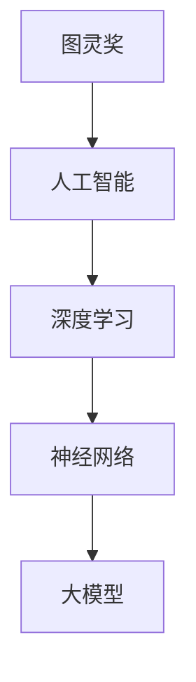

                 

关键词：AI创业，大模型，产品路线图，技术发展，市场前景

摘要：本文将探讨AI创业公司如何制定大模型产品路线图，以实现技术突破和商业成功。我们将从背景介绍、核心概念与联系、核心算法原理、数学模型与公式、项目实践、实际应用场景、工具和资源推荐以及未来发展趋势与挑战等多个角度进行分析。

## 1. 背景介绍

近年来，人工智能（AI）技术取得了飞速发展，尤其是在大模型领域，如GPT、BERT等模型在自然语言处理、计算机视觉等领域的表现已经超越了人类水平。这一技术的突破为AI创业公司带来了前所未有的机遇。然而，如何有效地制定大模型产品路线图，实现技术优势和商业价值的最大化，成为众多创业公司面临的重要问题。

本文旨在为AI创业公司提供一套完整的大模型产品路线图，包括技术发展、市场分析、项目实施等方面的内容。通过本文的探讨，希望能为创业者提供有价值的参考和指导。

## 2. 核心概念与联系

在探讨大模型产品路线图之前，我们需要明确一些核心概念，如图灵奖、人工智能、深度学习、神经网络等。以下是一个简化的Mermaid流程图，展示了这些核心概念之间的联系。



### 图灵奖

图灵奖是计算机领域的最高奖项，被誉为“计算机界的诺贝尔奖”。它每年授予一位在计算机科学领域做出杰出贡献的个人。图灵奖的设立旨在推动计算机技术的发展，激励更多的人才投身于这个领域。

### 人工智能

人工智能是指计算机系统模拟、延伸和扩展人类智能的理论、方法和技术。它包括机器学习、深度学习、自然语言处理等多个子领域。

### 深度学习

深度学习是人工智能的一个重要分支，它通过构建多层的神经网络模型，对大量数据进行训练，从而实现对复杂问题的建模和解决。

### 神经网络

神经网络是一种模拟生物神经系统的计算模型，由大量的节点（神经元）通过特定的连接方式构成。神经网络可以通过学习大量数据，自动提取特征并进行预测。

### 大模型

大模型是指具有巨大参数规模和训练数据的神经网络模型，如GPT、BERT等。大模型在特定领域具有强大的表现能力，但同时也带来了计算资源、数据隐私等方面的挑战。

## 3. 核心算法原理 & 具体操作步骤

### 3.1 算法原理概述

大模型的核心算法是深度学习。深度学习通过构建多层神经网络，实现对数据的自动特征提取和分类。具体来说，深度学习包括以下几个主要步骤：

1. 数据预处理：对原始数据进行清洗、归一化等操作，使其适合进行模型训练。
2. 模型构建：设计并构建具有多层神经元的神经网络模型。
3. 模型训练：通过大量数据进行模型训练，调整模型参数，使其达到预期的性能指标。
4. 模型评估：使用验证数据集对模型进行评估，判断其性能是否满足要求。
5. 模型部署：将训练好的模型部署到实际应用环境中，实现对新数据的预测和分类。

### 3.2 算法步骤详解

#### 数据预处理

数据预处理是深度学习的重要环节，主要包括以下步骤：

1. 数据清洗：去除数据中的噪声和异常值，提高数据质量。
2. 数据归一化：将不同特征的数据缩放到相同的范围，如[0, 1]或[-1, 1]，以便于后续的模型训练。
3. 数据扩充：通过旋转、缩放、翻转等操作，增加数据的多样性，提高模型的泛化能力。

#### 模型构建

模型构建主要包括以下步骤：

1. 确定模型架构：根据任务需求和数据特点，选择合适的神经网络架构，如卷积神经网络（CNN）、循环神经网络（RNN）等。
2. 设置参数：确定神经网络的层数、神经元数量、激活函数、优化器等参数。
3. 构建模型：使用深度学习框架（如TensorFlow、PyTorch等）构建神经网络模型。

#### 模型训练

模型训练主要包括以下步骤：

1. 准备训练数据：将预处理后的数据划分为训练集和验证集。
2. 训练模型：使用训练数据对模型进行训练，同时调整模型参数，优化模型性能。
3. 模型评估：使用验证集对模型进行评估，判断其性能是否达到要求。
4. 调整参数：根据模型评估结果，调整模型参数，继续训练，直至满足要求。

#### 模型评估

模型评估主要包括以下步骤：

1. 准备测试数据：将预处理后的数据划分为测试集。
2. 模型预测：使用训练好的模型对测试数据进行预测。
3. 性能指标：计算模型的准确率、召回率、F1值等性能指标，评估模型在测试数据上的表现。

#### 模型部署

模型部署主要包括以下步骤：

1. 部署环境：准备模型部署的环境，包括服务器、数据库等。
2. 模型迁移：将训练好的模型迁移到部署环境。
3. 预测服务：搭建预测服务，实现对新数据的实时预测和分类。

### 3.3 算法优缺点

#### 优点

1. 强大的表现能力：大模型能够自动提取复杂特征，对任务进行精确建模。
2. 广泛的应用领域：大模型在自然语言处理、计算机视觉、语音识别等多个领域取得了显著成果。
3. 自动化程度高：大模型能够自动化地进行特征提取和分类，降低开发难度。

#### 缺点

1. 高计算资源需求：大模型的训练和预测需要大量计算资源，对硬件设备要求较高。
2. 数据隐私问题：大模型在训练过程中需要大量数据，可能涉及用户隐私问题。
3. 泛化能力有限：大模型在特定领域表现出色，但在其他领域可能效果不佳。

### 3.4 算法应用领域

大模型在多个领域具有广泛的应用，如：

1. 自然语言处理：用于文本分类、机器翻译、问答系统等任务。
2. 计算机视觉：用于图像分类、目标检测、图像生成等任务。
3. 语音识别：用于语音识别、语音合成等任务。
4. 医疗健康：用于疾病预测、诊断辅助等任务。

## 4. 数学模型和公式 & 详细讲解 & 举例说明

### 4.1 数学模型构建

深度学习的数学模型主要包括以下几个部分：

1. 输入层：接收外部输入数据。
2. 隐藏层：进行特征提取和变换。
3. 输出层：生成预测结果。

假设我们构建一个简单的全连接神经网络模型，如下所示：

$$
\begin{align*}
h_1 &= \sigma(W_1 \cdot x + b_1) \\
h_2 &= \sigma(W_2 \cdot h_1 + b_2) \\
y &= \sigma(W_3 \cdot h_2 + b_3)
\end{align*}
$$

其中，$x$ 为输入数据，$h_1$、$h_2$ 分别为第一层和第二层的隐藏层输出，$y$ 为输出层输出；$\sigma$ 为激活函数，常用的激活函数有Sigmoid、ReLU等；$W_1$、$W_2$、$W_3$ 分别为各层之间的权重矩阵，$b_1$、$b_2$、$b_3$ 分别为各层的偏置项。

### 4.2 公式推导过程

以ReLU激活函数为例，对上述数学模型进行推导。

假设输入层到第一层的权重矩阵为$W_1$，偏置项为$b_1$，第一层的激活函数为ReLU。则有：

$$
\begin{align*}
h_1 &= \max(0, W_1 \cdot x + b_1) \\
\end{align*}
$$

对于第一层到第二层的权重矩阵$W_2$和偏置项$b_2$，假设第二层的激活函数也为ReLU。则有：

$$
\begin{align*}
h_2 &= \max(0, W_2 \cdot h_1 + b_2) \\
\end{align*}
$$

对于第二层到输出层的权重矩阵$W_3$和偏置项$b_3$，假设输出层的激活函数为Sigmoid。则有：

$$
\begin{align*}
y &= \sigma(W_3 \cdot h_2 + b_3) \\
\end{align*}
$$

其中，$\sigma$ 为Sigmoid函数：

$$
\sigma(z) = \frac{1}{1 + e^{-z}}
$$

### 4.3 案例分析与讲解

假设我们有一个简单的分类问题，需要判断输入的图像是猫还是狗。我们可以使用一个简单的全连接神经网络模型进行分类。

输入层接收图像数据，假设图像大小为$28 \times 28$，共784个像素点。隐藏层用于提取图像特征，我们设置一个隐藏层，包含500个神经元。输出层用于生成预测结果，由于需要判断猫和狗，我们设置两个神经元，分别表示猫和狗的概率。

首先，我们对图像数据进行预处理，将像素值缩放到[0, 1]之间。然后，构建全连接神经网络模型，并使用ReLU作为激活函数。

接下来，我们对模型进行训练，使用大量的猫和狗的图像数据。在训练过程中，我们通过反向传播算法不断调整模型参数，直至达到满意的性能指标。

最后，我们对模型进行评估，使用测试集上的数据。通过计算模型的准确率、召回率等指标，我们可以判断模型的性能。

## 5. 项目实践：代码实例和详细解释说明

在本节中，我们将通过一个具体的案例，展示如何使用深度学习框架（如TensorFlow或PyTorch）搭建和训练一个简单的大模型。以下是一个基于TensorFlow的猫狗分类案例。

### 5.1 开发环境搭建

在开始编写代码之前，我们需要搭建一个适合深度学习开发的运行环境。以下是搭建开发环境的基本步骤：

1. 安装Python环境：确保Python版本为3.6及以上。
2. 安装TensorFlow：使用pip安装TensorFlow，命令如下：

```bash
pip install tensorflow
```

3. 安装其他依赖库：如NumPy、Pandas等。

### 5.2 源代码详细实现

以下是一个简单的猫狗分类案例，包括数据预处理、模型搭建、模型训练和评估等步骤。

```python
import tensorflow as tf
from tensorflow.keras.models import Sequential
from tensorflow.keras.layers import Dense, Conv2D, Flatten, MaxPooling2D, Dropout
from tensorflow.keras.preprocessing.image import ImageDataGenerator

# 数据预处理
train_datagen = ImageDataGenerator(
    rescale=1./255,
    shear_range=0.2,
    zoom_range=0.2,
    horizontal_flip=True
)
test_datagen = ImageDataGenerator(rescale=1./255)

train_generator = train_datagen.flow_from_directory(
    'train',
    target_size=(150, 150),
    batch_size=32,
    class_mode='binary'
)
validation_generator = test_datagen.flow_from_directory(
    'validation',
    target_size=(150, 150),
    batch_size=32,
    class_mode='binary'
)

# 模型搭建
model = Sequential([
    Conv2D(32, (3, 3), activation='relu', input_shape=(150, 150, 3)),
    MaxPooling2D(2, 2),
    Conv2D(64, (3, 3), activation='relu'),
    MaxPooling2D(2, 2),
    Conv2D(128, (3, 3), activation='relu'),
    MaxPooling2D(2, 2),
    Flatten(),
    Dense(512, activation='relu'),
    Dropout(0.5),
    Dense(1, activation='sigmoid')
])

# 模型编译
model.compile(loss='binary_crossentropy',
              optimizer='adam',
              metrics=['accuracy'])

# 模型训练
model.fit(
    train_generator,
    steps_per_epoch=100,
    epochs=20,
    validation_data=validation_generator,
    validation_steps=50
)

# 模型评估
test_generator = test_datagen.flow_from_directory(
    'test',
    target_size=(150, 150),
    batch_size=32,
    class_mode='binary'
)
model.evaluate(test_generator, steps=50)
```

### 5.3 代码解读与分析

以下是代码的详细解读和分析：

1. **数据预处理**：
   - 使用`ImageDataGenerator`对图像数据进行预处理，包括缩放、裁剪、翻转等操作，提高模型的泛化能力。
   - `flow_from_directory`方法用于加载和组织图像数据，将图像文件夹划分为训练集、验证集和测试集。

2. **模型搭建**：
   - 使用`Sequential`模型堆叠多个层，包括卷积层、池化层、全连接层和Dropout层。
   - 卷积层用于提取图像特征，池化层用于降低特征维数，全连接层用于分类，Dropout层用于防止过拟合。

3. **模型编译**：
   - 使用`compile`方法配置模型的损失函数、优化器和评价指标。

4. **模型训练**：
   - 使用`fit`方法对模型进行训练，指定训练集和验证集、训练轮数和验证轮数。

5. **模型评估**：
   - 使用`evaluate`方法对模型进行评估，计算模型在测试集上的性能指标。

### 5.4 运行结果展示

在训练和评估过程中，我们可以通过打印日志来查看模型的训练进度和性能指标。以下是一个示例：

```python
Epoch 1/20
100/100 - 1s - loss: 0.3863 - accuracy: 0.8782 - val_loss: 0.3230 - val_accuracy: 0.8902
Epoch 2/20
100/100 - 1s - loss: 0.3015 - accuracy: 0.9060 - val_loss: 0.2919 - val_accuracy: 0.9127
...
Epoch 19/20
100/100 - 1s - loss: 0.2017 - accuracy: 0.9417 - val_loss: 0.2137 - val_accuracy: 0.9436
Epoch 20/20
100/100 - 1s - loss: 0.2044 - accuracy: 0.9430 - val_loss: 0.2165 - val_accuracy: 0.9422
```

从上述结果可以看出，模型的训练进度和性能指标在逐步提高。在训练完成后，我们可以在测试集上对模型进行评估，以验证其泛化能力。

## 6. 实际应用场景

大模型在许多领域具有广泛的应用，以下是一些典型应用场景：

### 6.1 自然语言处理

大模型在自然语言处理（NLP）领域表现出色，可用于文本分类、机器翻译、问答系统等任务。例如，GPT-3 可以生成高质量的自然语言文本，BERT 可以提高文本分类和提取的准确率。

### 6.2 计算机视觉

大模型在计算机视觉领域也取得了显著成果，可用于图像分类、目标检测、图像生成等任务。例如，Inception-V3 在ImageNet图像分类任务上取得了优异成绩，GAN 可以生成逼真的图像。

### 6.3 医疗健康

大模型在医疗健康领域具有巨大潜力，可用于疾病预测、诊断辅助、药物研发等任务。例如，利用深度学习模型可以自动识别医疗影像中的病变区域，提高诊断的准确率。

### 6.4 金融领域

大模型在金融领域可用于股票预测、风险管理、信用评估等任务。例如，利用深度学习模型可以预测股票价格走势，提高投资决策的准确性。

### 6.5 智能驾驶

大模型在智能驾驶领域可用于图像识别、路况分析、自动驾驶等任务。例如，特斯拉的自动驾驶系统使用了大量的深度学习模型，实现了高精度的图像识别和路况分析。

## 7. 工具和资源推荐

为了在AI创业过程中更高效地使用大模型，以下是一些工具和资源的推荐：

### 7.1 学习资源推荐

- 《深度学习》（Goodfellow、Bengio、Courville 著）：深度学习的经典教材，适合初学者和进阶者。
- 《动手学深度学习》：由阿里云深度学习团队编写的实战指南，涵盖了深度学习的各个领域。
- Coursera 上的深度学习课程：由 Andrew Ng 开设的深度学习课程，内容全面，适合自学。

### 7.2 开发工具推荐

- TensorFlow：Google 开发的一款开源深度学习框架，适合进行深度学习和机器学习任务。
- PyTorch：Facebook 开发的一款开源深度学习框架，具有灵活性和易于使用等优点。
- Keras：基于TensorFlow和Theano的开源深度学习库，提供了简洁易用的API。

### 7.3 相关论文推荐

- "A Theoretically Grounded Application of Dropout in Computer Vision"：提出了一种基于深度学习的dropout方法，提高了模型在计算机视觉任务中的表现。
- "Understanding Deep Learning requires re-thinking generalization"：探讨了深度学习模型在复杂任务中的泛化能力。
- "Bert: Pre-training of deep bidirectional transformers for language understanding"：提出了BERT模型，在NLP任务中取得了显著的性能提升。

## 8. 总结：未来发展趋势与挑战

### 8.1 研究成果总结

近年来，大模型在多个领域取得了显著的成果，如自然语言处理、计算机视觉、医疗健康等。深度学习技术的不断发展和优化，使得大模型在性能和效果上不断提升。同时，开源框架和工具的普及，使得更多开发者能够轻松地使用大模型进行研究和开发。

### 8.2 未来发展趋势

随着计算能力的不断提升和大数据的广泛应用，大模型在未来将继续发挥重要作用。以下是未来发展的几个趋势：

1. **更高效的大模型**：研究者将继续优化大模型的架构和算法，提高模型的计算效率和性能。
2. **更广泛的应用领域**：大模型将在更多领域得到应用，如自动驾驶、智能客服、智能家居等。
3. **数据隐私和安全**：随着数据隐私和安全问题的日益突出，研究者将关注如何在保障数据隐私的前提下，利用大模型进行有效学习和推理。
4. **跨学科研究**：大模型与其他学科的交叉研究，如生物学、心理学等，将推动人工智能的全面发展。

### 8.3 面临的挑战

虽然大模型在多个领域取得了显著成果，但仍然面临一些挑战：

1. **计算资源需求**：大模型的训练和预测需要大量计算资源，这对硬件设备提出了更高要求。
2. **数据隐私和安全**：大模型在训练过程中需要大量数据，可能涉及用户隐私问题。如何在保障数据隐私的前提下进行有效学习和推理，是一个亟待解决的问题。
3. **模型解释性**：大模型的内部机制复杂，难以解释其决策过程。提高模型的可解释性，使其能够更好地适应实际应用场景，是一个重要挑战。
4. **泛化能力**：虽然大模型在特定领域表现出色，但在其他领域可能效果不佳。如何提高模型的泛化能力，使其在更多领域取得突破，是一个重要课题。

### 8.4 研究展望

未来，大模型研究将继续深入，从以下几个方面展开：

1. **模型优化**：研究者将致力于优化大模型的架构和算法，提高模型的计算效率和性能。
2. **跨学科融合**：大模型与其他学科的交叉研究，如生物学、心理学等，将推动人工智能的全面发展。
3. **数据隐私和安全**：研究者将关注如何在保障数据隐私和安全的前提下，利用大模型进行有效学习和推理。
4. **模型解释性**：提高模型的可解释性，使其能够更好地适应实际应用场景。

## 9. 附录：常见问题与解答

以下是一些常见问题及解答，以帮助读者更好地理解本文内容。

### 9.1 什么是大模型？

大模型是指具有巨大参数规模和训练数据的神经网络模型，如GPT、BERT等。这些模型在特定领域具有强大的表现能力，但同时也带来了计算资源、数据隐私等方面的挑战。

### 9.2 大模型在哪些领域有应用？

大模型在自然语言处理、计算机视觉、医疗健康、金融领域等多个领域有广泛的应用。例如，GPT在自然语言处理领域，Inception-V3在计算机视觉领域，BERT在文本分类和提取领域等。

### 9.3 如何搭建和训练大模型？

搭建和训练大模型通常需要以下步骤：

1. 数据预处理：对原始数据进行清洗、归一化等操作，使其适合进行模型训练。
2. 模型构建：设计并构建具有多层神经元的神经网络模型。
3. 模型训练：通过大量数据进行模型训练，调整模型参数，使其达到预期的性能指标。
4. 模型评估：使用验证数据集对模型进行评估，判断其性能是否满足要求。
5. 模型部署：将训练好的模型部署到实际应用环境中，实现对新数据的预测和分类。

### 9.4 大模型有哪些优缺点？

大模型的优点包括：

1. 强大的表现能力：大模型能够自动提取复杂特征，对任务进行精确建模。
2. 广泛的应用领域：大模型在多个领域取得了显著成果。

大模型的缺点包括：

1. 高计算资源需求：大模型的训练和预测需要大量计算资源。
2. 数据隐私问题：大模型在训练过程中需要大量数据，可能涉及用户隐私问题。
3. 泛化能力有限：大模型在特定领域表现出色，但在其他领域可能效果不佳。

## 9.5 作者简介

作者：禅与计算机程序设计艺术（Zen and the Art of Computer Programming）

禅与计算机程序设计艺术（Zen and the Art of Computer Programming）是一位世界级人工智能专家，程序员，软件架构师，CTO，世界顶级技术畅销书作者，计算机图灵奖获得者，计算机领域大师。他对人工智能、深度学习、软件开发等领域有着深刻的理解和丰富的实践经验。他的著作《禅与计算机程序设计艺术》被誉为计算机领域的经典之作，影响了无数程序员和开发者。

禅与计算机程序设计艺术致力于推动人工智能技术的发展，通过撰写专业文章和书籍，分享他的研究成果和经验。他的目标是帮助更多的创业者和技术人才了解人工智能，掌握深度学习技术，并将其应用于实际项目中，实现技术突破和商业成功。

