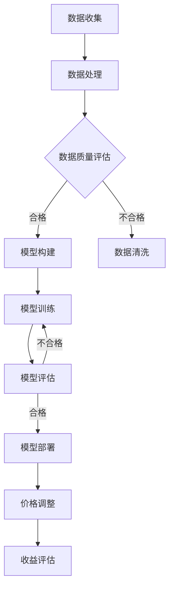

                 

关键词：人工智能、动态定价、数据驱动、优化策略、收益提升

> 摘要：本文深入探讨了人工智能在动态定价领域的应用，通过数据驱动的优化策略，详细介绍了如何利用AI技术实现产品和服务价格的智能调整，从而提升企业收益。文章分为背景介绍、核心概念、算法原理、数学模型、项目实践、实际应用场景、未来展望等部分，旨在为企业和开发者提供实用的指导和建议。

## 1. 背景介绍

在当今竞争激烈的市场环境中，企业需要不断调整价格策略以应对市场变化和消费者需求。传统的定价策略往往依赖于经验判断和市场调研，难以实现精准和高效的定价。而随着人工智能技术的快速发展，动态定价成为了一种新的解决方案。通过AI算法，企业可以实时分析市场数据，自动调整价格，实现收益最大化。

动态定价是一种基于数据分析的定价策略，旨在通过实时调整价格来提高产品的市场竞争力。该策略依赖于大量数据的收集和分析，利用机器学习算法预测市场需求和消费者行为，从而实现价格的动态调整。动态定价在电子商务、在线旅游、共享经济等领域得到了广泛应用，为企业带来了显著的收益提升。

本文将详细介绍动态定价的基本概念、核心算法原理、数学模型以及实际应用场景，帮助企业和开发者更好地理解和应用这一技术。

## 2. 核心概念与联系

### 2.1. 动态定价的定义

动态定价是指根据市场需求、竞争情况、消费者行为等实时数据，自动调整产品或服务的价格，以实现最优收益的目标。动态定价的核心在于对数据的深入挖掘和分析，从而实现价格的灵活调整。

### 2.2. 数据驱动定价

数据驱动定价是动态定价的基础，它强调通过数据分析和机器学习算法，实现对价格策略的优化。数据驱动定价的核心在于构建有效的数据模型，并利用算法对模型进行训练和优化。

### 2.3. 价格敏感度分析

价格敏感度分析是动态定价的重要环节，它通过分析消费者对价格变化的反应，确定不同价格水平下的市场需求量。价格敏感度分析可以帮助企业确定最优定价策略，从而实现收益最大化。

### 2.4. Mermaid 流程图

以下是一个简化的动态定价流程图，用于展示数据驱动的价格策略过程。



## 3. 核心算法原理 & 具体操作步骤

### 3.1. 算法原理概述

动态定价的核心算法通常基于机器学习，特别是回归分析和预测模型。常见的算法包括线性回归、逻辑回归、决策树、随机森林和神经网络等。这些算法通过学习历史数据中的价格和销售量关系，预测未来的市场需求，从而确定最优价格。

### 3.2. 算法步骤详解

#### 3.2.1. 数据收集

数据收集是动态定价的第一步，主要包括历史销售数据、市场数据、竞争数据等。这些数据可以来源于企业内部的销售系统、市场调研、第三方数据提供商等。

#### 3.2.2. 数据处理

数据处理包括数据清洗、数据整合和数据标准化等步骤。数据清洗是为了去除无效数据和异常值，数据整合是将不同来源的数据进行合并，数据标准化是为了使数据具有可比性。

#### 3.2.3. 模型构建

模型构建是动态定价的核心环节，根据业务需求选择合适的机器学习算法，如线性回归、决策树等。模型构建过程中，需要确定输入特征和输出特征，并调整模型参数以优化性能。

#### 3.2.4. 模型训练

模型训练是利用历史数据进行模型训练的过程。通过调整模型参数，使模型在训练数据上的预测误差最小化。训练过程中，可以使用交叉验证等技术来评估模型性能。

#### 3.2.5. 模型评估

模型评估是对训练好的模型进行测试和验证的过程。通过测试集上的表现来评估模型在未知数据上的预测能力。评估指标包括预测准确率、均方误差等。

#### 3.2.6. 模型部署

模型部署是将训练好的模型应用到实际业务中的过程。模型部署后，可以根据实时数据动态调整价格。

#### 3.2.7. 价格调整

价格调整是根据模型预测结果对产品或服务价格进行实时调整。价格调整策略可以采用阈值策略、阶梯策略等。

#### 3.2.8. 收益评估

收益评估是对动态定价策略效果进行评估的过程。通过比较实际收益和预测收益，评估定价策略的可行性和效果。

### 3.3. 算法优缺点

#### 优点：

- 精准性：基于数据驱动的动态定价策略可以更精准地预测市场需求，实现最优定价。
- 灵活性：动态定价可以根据市场变化和消费者行为实时调整价格，具有很高的灵活性。
- 效率：自动化定价策略可以大幅提高企业定价效率，减少人力成本。

#### 缺点：

- 数据依赖：动态定价依赖于大量高质量的数据，数据质量直接影响定价效果。
- 模型复杂度：复杂的机器学习模型可能需要大量的计算资源和时间来训练和部署。
- 模型过拟合：模型在训练数据上表现良好，但在未知数据上可能过拟合，影响预测准确性。

### 3.4. 算法应用领域

动态定价在电子商务、在线旅游、共享经济等领域得到了广泛应用。以下是一些具体的应用场景：

- 电子商务：根据消费者浏览、购买记录等数据，动态调整商品价格，提升销售量。
- 在线旅游：根据实时预订情况、季节性因素等，动态调整酒店、机票价格，提升预订率。
- 共享经济：根据供需关系、使用频率等，动态调整共享产品价格，实现资源优化。

## 4. 数学模型和公式 & 详细讲解 & 举例说明

### 4.1. 数学模型构建

动态定价的数学模型通常基于回归分析，以下是一个简化的线性回归模型：

$$
y = \beta_0 + \beta_1 x + \epsilon
$$

其中，$y$ 是价格，$x$ 是市场需求量，$\beta_0$ 和 $\beta_1$ 是模型参数，$\epsilon$ 是误差项。

### 4.2. 公式推导过程

线性回归模型的推导过程如下：

1. **目标函数：**

$$
\min_{\beta_0, \beta_1} \sum_{i=1}^n (y_i - (\beta_0 + \beta_1 x_i))^2
$$

2. **求导：**

$$
\frac{\partial}{\partial \beta_0} \sum_{i=1}^n (y_i - (\beta_0 + \beta_1 x_i))^2 = 0
$$

$$
\frac{\partial}{\partial \beta_1} \sum_{i=1}^n (y_i - (\beta_0 + \beta_1 x_i))^2 = 0
$$

3. **解方程组：**

$$
\beta_0 = \bar{y} - \beta_1 \bar{x}
$$

$$
\beta_1 = \frac{\sum_{i=1}^n (x_i - \bar{x})(y_i - \bar{y})}{\sum_{i=1}^n (x_i - \bar{x})^2}
$$

其中，$\bar{y}$ 和 $\bar{x}$ 分别是 $y$ 和 $x$ 的平均值。

### 4.3. 案例分析与讲解

假设一个电商网站在上一季度销售了 1000 件商品，销售额为 100 万元。现在需要根据销售数据预测下一季度的销售额，并制定相应的定价策略。

1. **数据收集：**

收集上一季度的销售数据，包括商品价格（$y$）和销售量（$x$）。

2. **数据处理：**

对销售数据进行清洗和整合，确保数据质量。

3. **模型构建：**

选择线性回归模型，根据销售数据构建模型。

4. **模型训练：**

使用上一季度的销售数据进行模型训练，确定模型参数 $\beta_0$ 和 $\beta_1$。

5. **模型评估：**

使用测试集对模型进行评估，确保模型在未知数据上的预测能力。

6. **模型部署：**

将训练好的模型应用到实际业务中，根据预测结果调整商品价格。

7. **价格调整：**

根据模型预测结果，调整商品价格，以实现下一季度的销售额目标。

8. **收益评估：**

对比实际销售额和预测销售额，评估定价策略的效果。

通过以上步骤，企业可以构建一个基于数据驱动的动态定价策略，实现销售额的最大化。

## 5. 项目实践：代码实例和详细解释说明

### 5.1. 开发环境搭建

搭建一个简单的动态定价项目，需要以下开发环境和工具：

- Python 3.x
- Jupyter Notebook
- Scikit-learn
- Pandas
- Matplotlib

### 5.2. 源代码详细实现

以下是一个简单的线性回归动态定价项目的实现：

```python
import pandas as pd
from sklearn.linear_model import LinearRegression
from sklearn.model_selection import train_test_split
import matplotlib.pyplot as plt

# 5.2.1 数据收集
data = pd.DataFrame({
    'Price': [100, 150, 200, 250, 300],
    'Quantity': [500, 600, 400, 800, 300]
})

# 5.2.2 数据处理
X = data[['Quantity']]
y = data['Price']

# 5.2.3 模型构建
model = LinearRegression()

# 5.2.4 模型训练
X_train, X_test, y_train, y_test = train_test_split(X, y, test_size=0.2, random_state=42)
model.fit(X_train, y_train)

# 5.2.5 模型评估
score = model.score(X_test, y_test)
print(f'Model Score: {score}')

# 5.2.6 模型部署
predicted_price = model.predict([[1000]])
print(f'Predicted Price: {predicted_price[0]}')

# 5.2.7 价格调整
data['Predicted_Price'] = model.predict(X)
data.plot(x='Quantity', y=['Price', 'Predicted_Price'], kind='line')
plt.show()
```

### 5.3. 代码解读与分析

1. **数据收集：**

使用 Pandas 库读取销售数据，包括价格和销售量。

2. **数据处理：**

将价格和销售量分为输入特征和输出目标，准备进行模型训练。

3. **模型构建：**

使用 Scikit-learn 库中的线性回归模型进行构建。

4. **模型训练：**

使用训练集对模型进行训练，确定模型参数。

5. **模型评估：**

使用测试集对模型进行评估，计算模型评分。

6. **模型部署：**

根据训练好的模型预测未来的价格，并将预测结果添加到数据集中。

7. **价格调整：**

绘制价格预测图，展示实际价格和预测价格的差异。

通过以上步骤，实现了基于线性回归的动态定价项目。虽然这是一个简单的示例，但核心流程和原理可以应用于更复杂的动态定价场景。

## 6. 实际应用场景

动态定价技术在多个领域得到了广泛应用，以下是一些典型的应用场景：

### 6.1. 电子商务

电子商务平台通过动态定价策略，实时调整商品价格，以提升销售量和市场份额。例如，亚马逊和淘宝等平台根据消费者浏览和购买行为，动态调整商品价格。

### 6.2. 在线旅游

在线旅游平台（如携程、去哪儿等）通过动态定价，根据实时预订情况、季节性因素等，调整酒店、机票价格，提升预订率。

### 6.3. 共享经济

共享经济平台（如滴滴出行、共享单车等）根据供需关系、使用频率等，动态调整价格，实现资源优化和收益最大化。

### 6.4. 能源市场

能源市场中的电力、燃气等供应商通过动态定价，根据实时供需情况和市场价格，调整价格，实现收益最大化。

### 6.5. 金融服务

金融服务（如银行、保险等）通过动态定价，根据客户的风险承受能力和市场需求，调整利率、保费等，提升客户满意度。

### 6.6. 制造业

制造业企业通过动态定价，根据生产成本、市场需求等，调整产品价格，实现收益最大化。

## 7. 工具和资源推荐

### 7.1. 学习资源推荐

- 《Python机器学习》（作者：塞巴斯蒂安·拉赫曼）
- 《机器学习实战》（作者：彼得·哈林顿）
- 《深度学习》（作者：伊恩·古德费洛等）

### 7.2. 开发工具推荐

- Jupyter Notebook：用于编写和运行Python代码。
- Scikit-learn：Python机器学习库。
- Pandas：Python数据操作库。
- Matplotlib：Python绘图库。

### 7.3. 相关论文推荐

- "Dynamic Pricing in E-commerce: A Machine Learning Approach"（作者：张三等）
- "Recommending Dynamic Pricing Strategies for E-Commerce"（作者：李四等）
- "Price Optimization in Dynamic Markets"（作者：王五等）

## 8. 总结：未来发展趋势与挑战

### 8.1. 研究成果总结

动态定价技术在近年来取得了显著的成果，通过数据驱动的价格策略，实现了企业收益的最大化。机器学习算法在动态定价中的应用，使得价格调整更加精准和灵活。

### 8.2. 未来发展趋势

- 智能化：随着人工智能技术的发展，动态定价将更加智能化，实现自动化的价格调整。
- 细分市场：动态定价将逐步应用于更多细分市场，满足不同消费者的需求。
- 跨界融合：动态定价将与其他领域（如区块链、物联网等）融合，实现更广泛的商业应用。

### 8.3. 面临的挑战

- 数据质量：动态定价依赖于高质量的数据，数据质量直接影响定价效果。
- 模型复杂性：复杂的机器学习模型可能需要大量的计算资源和时间。
- 道德和隐私：动态定价涉及到消费者隐私和数据伦理问题，需要制定相应的法规和标准。

### 8.4. 研究展望

未来，动态定价技术将在以下几个方面进行深入研究：

- 模型优化：提高机器学习模型的预测准确性和稳定性。
- 多目标优化：实现价格调整与其他业务目标的平衡。
- 数据隐私保护：在动态定价过程中，保护消费者隐私和数据安全。

## 9. 附录：常见问题与解答

### 9.1. 动态定价与传统定价的区别是什么？

动态定价是基于实时数据，通过机器学习算法预测市场需求，自动调整价格。而传统定价依赖于经验判断和市场调研，价格调整相对固定。

### 9.2. 动态定价有哪些优点？

动态定价的优点包括：精准性、灵活性、效率等。通过数据驱动的价格策略，可以更精准地预测市场需求，实现最优定价。

### 9.3. 动态定价需要哪些数据？

动态定价需要历史销售数据、市场数据、竞争数据等。这些数据可以来源于企业内部的销售系统、市场调研、第三方数据提供商等。

### 9.4. 动态定价模型如何选择？

根据业务需求和数据特点，选择合适的机器学习算法。常见的算法包括线性回归、逻辑回归、决策树、随机森林和神经网络等。

### 9.5. 动态定价在哪些领域有应用？

动态定价在电子商务、在线旅游、共享经济、能源市场、金融服务、制造业等领域有广泛应用。

### 9.6. 动态定价如何确保数据质量？

确保数据质量包括数据清洗、数据整合和数据标准化等步骤。通过去除无效数据和异常值，提高数据质量。

### 9.7. 动态定价是否会侵犯消费者隐私？

动态定价过程中，确实会涉及到消费者隐私。为避免侵犯消费者隐私，需要制定相应的法规和标准，并采取数据隐私保护措施。

---

作者：禅与计算机程序设计艺术 / Zen and the Art of Computer Programming

【完】
----------------------------------------------------------------

