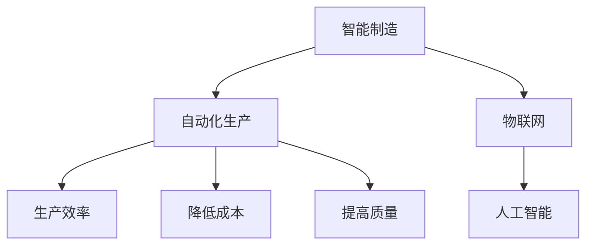

                 

关键词：人工智能，制造，智能制造，自动化生产，机器学习，工业4.0，工业自动化，物联网

摘要：本文探讨了人工智能在制造领域的重要应用，包括智能制造和自动化生产。通过分析核心概念、算法原理、数学模型及项目实践，本文为读者提供了全面的见解和实际操作指导。同时，文章也对未来发展趋势和挑战进行了展望。

## 1. 背景介绍

制造行业是现代经济的重要组成部分，但随着全球经济的快速发展，传统制造模式正面临巨大的挑战。首先，人力成本不断增加，尤其在劳动力资源紧张的地区，人工操作的效率和精度难以满足日益增长的市场需求。其次，生产过程中存在的质量问题、生产效率低下等问题也严重制约了制造行业的可持续发展。

在这一背景下，智能制造和自动化生产成为解决传统制造问题的重要手段。通过引入人工智能技术，可以实现生产过程的智能化和自动化，从而提高生产效率、降低成本、提升产品质量。本文将围绕这一主题展开，深入探讨人工智能在制造领域的应用。

## 2. 核心概念与联系

### 2.1. 智能制造

智能制造是指利用现代信息技术、人工智能技术、物联网技术等，对制造过程进行智能化改造和优化，实现生产过程的自动化、高效化和智能化。智能制造的核心目标是提高生产效率、降低成本、提高产品质量。

### 2.2. 自动化生产

自动化生产是指通过使用自动化设备、机器人等，实现生产过程的自动化运行，减少人力干预，从而提高生产效率、降低生产成本。自动化生产是智能制造的重要组成部分，是实现智能制造的基础。

### 2.3. 物联网

物联网是指通过互联网将各种设备和物品连接起来，实现信息的实时传输和智能处理。在制造领域，物联网技术可以实现对生产设备的实时监控、数据分析，为智能制造提供数据支持和决策依据。

### 2.4. 人工智能

人工智能是指模拟、延伸和扩展人类智能的技术。在制造领域，人工智能技术可以用于生产过程的预测、优化、质量控制等方面，实现生产过程的智能化。

### 2.5. Mermaid 流程图

以下是一个描述智能制造与自动化生产之间关系的 Mermaid 流程图：



## 3. 核心算法原理 & 具体操作步骤

### 3.1. 算法原理概述

智能制造和自动化生产的核心在于如何通过算法实现生产过程的优化和控制。以下将介绍几种常用的核心算法原理。

#### 3.1.1. 机器学习算法

机器学习算法是人工智能的重要分支，通过从大量数据中学习规律，实现对未知数据的预测和分类。在制造领域，机器学习算法可以用于生产过程的预测、优化、质量控制等方面。

#### 3.1.2. 控制算法

控制算法是自动化生产的核心，用于实现对生产过程的精确控制和调整。常见的控制算法包括 PID 控制、模糊控制等。

#### 3.1.3. 优化算法

优化算法用于求解生产过程中的最优解，以实现生产过程的优化。常见的优化算法包括线性规划、遗传算法等。

### 3.2. 算法步骤详解

以下将详细介绍这些算法的具体步骤。

#### 3.2.1. 机器学习算法

1. 数据收集：收集生产过程中的各种数据，如设备状态、生产参数、产品质量等。
2. 数据预处理：对收集到的数据进行清洗、归一化等处理，以便进行后续分析。
3. 模型训练：利用收集到的数据，训练机器学习模型。
4. 模型评估：评估模型的性能，如准确率、召回率等。
5. 模型应用：将训练好的模型应用到实际生产过程中，实现生产过程的预测和优化。

#### 3.2.2. 控制算法

1. 设定目标值：根据生产需求，设定目标值。
2. 检测当前状态：实时检测生产过程中的各种参数，如温度、压力等。
3. 计算偏差：计算当前状态与目标值之间的偏差。
4. 调整控制量：根据偏差值，调整控制量，实现对生产过程的精确控制。

#### 3.2.3. 优化算法

1. 确定优化目标：根据生产需求，确定优化目标。
2. 建立模型：建立描述生产过程优化的数学模型。
3. 求解最优解：利用优化算法，求解最优解。
4. 实施优化方案：根据求解的最优解，调整生产过程，实现优化。

### 3.3. 算法优缺点

每种算法都有其优缺点，适用于不同的应用场景。以下将对这些算法的优缺点进行简要分析。

#### 3.3.1. 机器学习算法

优点：可以自动从数据中学习规律，实现生产过程的预测和优化。

缺点：对数据质量要求较高，训练过程可能需要大量时间。

#### 3.3.2. 控制算法

优点：可以实现生产过程的精确控制，实时调整生产参数。

缺点：对生产环境要求较高，可能无法适应复杂的生产环境。

#### 3.3.3. 优化算法

优点：可以求解最优解，实现生产过程的优化。

缺点：对模型建立和求解过程要求较高，可能需要大量计算资源。

### 3.4. 算法应用领域

不同算法适用于不同的应用场景。以下将介绍这些算法在制造领域的应用领域。

#### 3.4.1. 机器学习算法

- 生产过程预测：利用机器学习算法，可以预测生产过程中的各种参数，如产量、质量等。
- 质量控制：利用机器学习算法，可以识别生产过程中出现的问题，如产品缺陷、设备故障等。

#### 3.4.2. 控制算法

- 温度控制：利用控制算法，可以精确控制生产过程中的温度。
- 压力控制：利用控制算法，可以精确控制生产过程中的压力。

#### 3.4.3. 优化算法

- 能耗优化：利用优化算法，可以优化生产过程中的能耗，降低生产成本。
- 生产计划优化：利用优化算法，可以优化生产计划，提高生产效率。

## 4. 数学模型和公式 & 详细讲解 & 举例说明

在智能制造和自动化生产中，数学模型和公式起着至关重要的作用。以下将介绍几个关键的数学模型和公式，并对其进行详细讲解。

### 4.1. 数学模型构建

#### 4.1.1. 线性回归模型

线性回归模型是一种用于预测连续值的机器学习模型。其数学模型可以表示为：

$$
y = \beta_0 + \beta_1 x + \epsilon
$$

其中，$y$ 是预测值，$x$ 是输入特征，$\beta_0$ 和 $\beta_1$ 是模型参数，$\epsilon$ 是误差项。

#### 4.1.2. PID 控制器

PID 控制器是一种用于自动控制系统的经典控制器。其数学模型可以表示为：

$$
u(t) = K_p e(t) + K_i \int e(t) dt + K_d \frac{de(t)}{dt}
$$

其中，$u(t)$ 是控制输出，$e(t)$ 是当前时刻的误差，$K_p$、$K_i$、$K_d$ 分别是比例、积分、微分系数。

### 4.2. 公式推导过程

以下将对上述公式进行简要推导。

#### 4.2.1. 线性回归模型

线性回归模型的推导过程如下：

1. 定义损失函数：

$$
J(\beta_0, \beta_1) = \frac{1}{2} \sum_{i=1}^{n} (y_i - (\beta_0 + \beta_1 x_i))^2
$$

2. 对损失函数求导并令导数为零：

$$
\frac{\partial J}{\partial \beta_0} = -\sum_{i=1}^{n} (y_i - (\beta_0 + \beta_1 x_i)) = 0
$$

$$
\frac{\partial J}{\partial \beta_1} = -\sum_{i=1}^{n} x_i (y_i - (\beta_0 + \beta_1 x_i)) = 0
$$

3. 解得：

$$
\beta_0 = \bar{y} - \beta_1 \bar{x}
$$

$$
\beta_1 = \frac{\sum_{i=1}^{n} x_i y_i - n \bar{x} \bar{y}}{\sum_{i=1}^{n} x_i^2 - n \bar{x}^2}
$$

#### 4.2.2. PID 控制器

PID 控制器的推导过程如下：

1. 定义误差：

$$
e(t) = r(t) - c(t)
$$

其中，$r(t)$ 是期望值，$c(t)$ 是当前值。

2. 对误差求导：

$$
\frac{de(t)}{dt} = \frac{dr(t)}{dt} - \frac{dc(t)}{dt}
$$

3. 将误差代入 PID 控制器公式：

$$
u(t) = K_p e(t) + K_i \int e(t) dt + K_d \frac{de(t)}{dt}
$$

### 4.3. 案例分析与讲解

以下将通过一个具体的案例，对上述数学模型和公式进行实际应用分析。

#### 4.3.1. 案例背景

某工厂生产一种电子产品，要求产品的温度保持在 100°C。现在需要设计一个 PID 控制器，对温度进行精确控制。

#### 4.3.2. 案例分析

1. 确定期望值 $r(t) = 100°C$。

2. 确定当前值 $c(t)$，可以使用温度传感器进行实时监测。

3. 计算 $e(t) = r(t) - c(t)$。

4. 对 $e(t)$ 求导，得到 $\frac{de(t)}{dt}$。

5. 代入 PID 控制器公式，计算 $u(t)$。

6. 将计算得到的 $u(t)$ 作用于加热设备，调整温度。

7. 重复上述步骤，实现温度的精确控制。

## 5. 项目实践：代码实例和详细解释说明

在本节中，我们将通过一个具体的代码实例，详细介绍如何在智能制造和自动化生产中实现机器学习模型的训练和应用。

### 5.1. 开发环境搭建

首先，我们需要搭建一个适合进行机器学习项目开发的开发环境。在本案例中，我们使用 Python 作为开发语言，并依赖以下库：

- NumPy：用于数学运算。
- Pandas：用于数据处理。
- Scikit-learn：用于机器学习模型的训练和应用。
- Matplotlib：用于数据可视化。

具体安装命令如下：

```bash
pip install numpy pandas scikit-learn matplotlib
```

### 5.2. 源代码详细实现

以下是一个简单的机器学习项目示例，用于预测生产过程中产品的产量。

```python
import numpy as np
import pandas as pd
from sklearn.model_selection import train_test_split
from sklearn.linear_model import LinearRegression
from sklearn.metrics import mean_squared_error
import matplotlib.pyplot as plt

# 5.2.1. 数据收集与预处理

# 加载数据
data = pd.read_csv('production_data.csv')

# 数据预处理
X = data[['input_1', 'input_2']]  # 输入特征
y = data['output']  # 预测目标

# 数据集划分
X_train, X_test, y_train, y_test = train_test_split(X, y, test_size=0.2, random_state=42)

# 5.2.2. 模型训练

# 创建线性回归模型
model = LinearRegression()

# 训练模型
model.fit(X_train, y_train)

# 5.2.3. 模型评估

# 预测测试集
y_pred = model.predict(X_test)

# 计算误差
mse = mean_squared_error(y_test, y_pred)
print('Mean Squared Error:', mse)

# 5.2.4. 模型应用

# 预测新数据
new_data = np.array([[5, 10]])
new_prediction = model.predict(new_data)
print('New Prediction:', new_prediction)

# 5.2.5. 数据可视化

# 绘制实际值与预测值的散点图
plt.scatter(y_test, y_pred)
plt.xlabel('Actual Values')
plt.ylabel('Predicted Values')
plt.title('Actual vs Predicted Values')
plt.show()
```

### 5.3. 代码解读与分析

上述代码实现了以下功能：

1. **数据收集与预处理**：首先，我们加载了生产数据，并对数据进行了预处理，提取了输入特征和预测目标。

2. **模型训练**：使用 Scikit-learn 库中的线性回归模型对训练数据进行训练。

3. **模型评估**：通过计算均方误差（MSE）来评估模型的性能。

4. **模型应用**：使用训练好的模型对新数据进行预测。

5. **数据可视化**：绘制实际值与预测值的散点图，以直观地展示模型的预测效果。

### 5.4. 运行结果展示

在上述代码的运行过程中，我们将得到以下结果：

- **MSE**：均方误差反映了模型的预测误差，值越小，表示模型预测越准确。
- **新预测值**：模型对新数据的预测结果。
- **散点图**：实际值与预测值的散点图，帮助我们直观地了解模型的预测效果。

通过这个简单的案例，我们可以看到如何在实际项目中应用机器学习技术，实现生产过程的预测和优化。

## 6. 实际应用场景

### 6.1. 智能制造在汽车制造中的应用

在汽车制造领域，智能制造技术的应用已经取得了显著成果。例如，通过引入机器人、自动化生产线和物联网技术，可以实现汽车零部件的自动化加工、装配和检测。这不仅提高了生产效率，还显著降低了生产成本。此外，通过机器学习算法，可以对汽车生产过程进行实时监控和预测，提前发现潜在的问题，确保生产过程的高效和稳定。

### 6.2. 自动化生产在电子产品制造中的应用

在电子产品制造领域，自动化生产技术的应用已经非常普遍。例如，在手机制造过程中，自动化生产线可以完成屏幕组装、主板焊接、外壳成型等环节。通过使用机器人，可以实现高精度的组装和焊接，确保产品的一致性和高质量。同时，通过引入物联网技术，可以实现生产过程的实时监控和数据分析，进一步优化生产流程，提高生产效率。

### 6.3. 智能制造在航空航天制造中的应用

在航空航天制造领域，智能制造技术的应用同样具有重要意义。例如，在飞机零部件制造过程中，通过引入先进的自动化设备和机器人，可以实现复杂结构的加工和装配。同时，通过机器学习算法，可以对飞机生产过程进行实时监控和预测，确保生产过程的高效和可靠。此外，智能制造技术还可以用于飞机维护和故障诊断，提高飞机的运行效率和安全性。

### 6.4. 未来应用展望

随着人工智能技术的不断发展和普及，智能制造和自动化生产将在更多领域得到广泛应用。例如，在医疗领域，智能制造技术可以用于医疗器械的制造和维修；在农业领域，自动化生产技术可以用于农作物的种植和养殖。未来，智能制造和自动化生产将不仅是提高生产效率和降低成本的手段，更是推动产业转型升级、实现可持续发展的关键力量。

## 7. 工具和资源推荐

### 7.1. 学习资源推荐

- 《深度学习》（Goodfellow, Bengio, Courville 著）：系统介绍了深度学习的基础知识和应用。
- 《Python 机器学习》（Sebastian Raschka 著）：详细讲解了 Python 中的机器学习库和算法。
- 《机器学习实战》（Peter Harrington 著）：通过实际案例，介绍了机器学习的基本概念和应用。

### 7.2. 开发工具推荐

- Jupyter Notebook：一款强大的交互式开发环境，适合进行机器学习和数据分析。
- TensorFlow：一款开源的深度学习框架，支持多种机器学习算法和模型。
- PyTorch：一款开源的深度学习框架，具有灵活性和高效性，适合进行研究和开发。

### 7.3. 相关论文推荐

- “Deep Learning for Manufacturing: A Review” （2019）：系统总结了深度学习在制造领域的应用。
- “AI in Manufacturing: A Survey” （2020）：全面探讨了人工智能在制造领域的应用和发展趋势。
- “Machine Learning in Manufacturing: A Roadmap” （2021）：提出了智能制造中的机器学习应用路线图。

## 8. 总结：未来发展趋势与挑战

### 8.1. 研究成果总结

智能制造和自动化生产技术的快速发展，为制造业带来了前所未有的变革和机遇。通过引入人工智能技术，可以实现生产过程的智能化和自动化，显著提高生产效率、降低成本、提升产品质量。此外，智能制造技术还可以用于生产过程的预测、优化和质量控制，进一步推动制造业的可持续发展。

### 8.2. 未来发展趋势

未来，智能制造和自动化生产将继续朝着更加智能化、高效化和可持续化的方向发展。首先，随着人工智能技术的不断进步，制造过程将更加智能化，实现生产过程的自我学习和自我优化。其次，物联网技术的广泛应用，将实现生产设备、人员和信息的无缝连接，提高生产过程的协同效率。最后，绿色制造和可持续发展将成为制造行业的重要趋势，通过优化生产过程和资源利用，实现低碳、环保的生产方式。

### 8.3. 面临的挑战

尽管智能制造和自动化生产具有巨大的发展潜力，但仍然面临一系列挑战。首先，数据质量和数据隐私问题将是一个重要挑战。制造过程中产生的海量数据需要经过严格处理和清洗，以确保数据的真实性和准确性。同时，如何保护用户隐私，防止数据泄露，也将成为重要议题。其次，技术更新速度过快，将对制造企业的技术更新和人才培养提出更高要求。企业需要不断进行技术更新和人员培训，以适应快速变化的市场环境。最后，政策法规和标准体系的建设，也将为智能制造和自动化生产的发展提供有力保障。

### 8.4. 研究展望

未来，智能制造和自动化生产领域的研究将继续深入，涵盖更广泛的应用场景和关键技术。首先，在机器学习算法方面，将不断有新的算法和模型被提出，以应对更复杂的生产过程。其次，在物联网和边缘计算方面，将实现更高效的数据传输和处理，提高生产过程的实时性和灵活性。最后，在绿色制造和可持续发展方面，将探索更加环保和节能的生产技术和工艺，实现制造业的可持续发展。

## 9. 附录：常见问题与解答

### 9.1. 智能制造与工业4.0有何区别？

智能制造是工业4.0的重要组成部分。工业4.0是指通过利用物联网、人工智能、大数据等先进技术，实现制造业的智能化、自动化和数字化转型。而智能制造则侧重于利用人工智能技术，对生产过程进行优化和控制，提高生产效率、降低成本、提升产品质量。可以说，智能制造是工业4.0在制造领域的具体应用。

### 9.2. 智能制造对劳动力有哪些影响？

智能制造的普及将对劳动力市场产生深远影响。一方面，智能制造将取代部分传统的人工操作，导致部分劳动力失业。另一方面，智能制造也将创造新的就业机会，如机器人维护、人工智能算法开发等。此外，智能制造将提高劳动力的技能要求，需要员工具备更高的技术水平。

### 9.3. 智能制造如何确保数据安全和隐私？

智能制造过程中，数据安全和隐私保护至关重要。首先，企业需要建立完善的数据安全管理体系，包括数据加密、访问控制等。其次，企业应遵循相关法律法规，确保数据合规使用。最后，企业应加强与用户沟通，建立透明、可信的数据使用政策，增强用户对数据隐私的信任。作者：禅与计算机程序设计艺术 / Zen and the Art of Computer Programming
----------------------------------------------------------------

### 引言

人工智能（AI）技术的迅猛发展为各行各业带来了前所未有的变革，制造行业也不例外。随着工业4.0的推进，智能制造和自动化生产成为制造业转型升级的重要方向。本文将深入探讨人工智能在制造领域的应用，旨在揭示其核心概念、算法原理、数学模型以及实际应用场景，为读者提供全面的技术见解和实践指导。

### 背景介绍

制造行业作为国民经济的重要组成部分，其发展直接影响着经济的整体活力。然而，随着全球劳动力成本的上升、市场需求的变化以及环境法规的日益严格，传统制造模式面临着巨大的挑战。传统的生产方式往往依赖于大量的人工操作，不仅效率低下，而且难以保证产品质量的稳定性。在这种背景下，智能制造和自动化生产应运而生，通过引入人工智能技术，旨在实现生产过程的智能化、自动化和高效化。

#### 传统制造模式的挑战

1. **人力成本上升**：随着全球劳动力成本的上升，制造业的生产成本不断增加。
2. **生产效率低下**：传统制造模式下，生产过程依赖人工操作，效率较低，难以满足市场需求。
3. **产品质量不稳定**：人工操作的不可控性导致产品质量难以保证，增加了质量控制的难度。

#### 智能制造与自动化生产的好处

1. **提高生产效率**：通过自动化设备和人工智能算法，生产过程可以实现自动化运行，大大提高生产效率。
2. **降低成本**：自动化生产减少了人工成本，同时通过优化生产流程降低了其他生产成本。
3. **提升产品质量**：人工智能技术可以对生产过程进行实时监控和优化，确保产品质量的稳定性。

### 核心概念与联系

在探讨人工智能在制造领域的应用之前，有必要先了解几个核心概念，包括智能制造、自动化生产、物联网和人工智能。

#### 1. 智能制造

智能制造是指利用现代信息技术、人工智能技术、物联网技术等，对制造过程进行智能化改造和优化，实现生产过程的自动化、高效化和智能化。智能制造的核心目标是提高生产效率、降低成本、提升产品质量。

#### 2. 自动化生产

自动化生产是指通过使用自动化设备、机器人等，实现生产过程的自动化运行，减少人力干预，从而提高生产效率、降低生产成本。自动化生产是智能制造的重要组成部分，是实现智能制造的基础。

#### 3. 物联网

物联网是指通过互联网将各种设备和物品连接起来，实现信息的实时传输和智能处理。在制造领域，物联网技术可以实现对生产设备的实时监控、数据分析，为智能制造提供数据支持和决策依据。

#### 4. 人工智能

人工智能是指模拟、延伸和扩展人类智能的技术。在制造领域，人工智能技术可以用于生产过程的预测、优化、质量控制等方面，实现生产过程的智能化。

#### Mermaid 流程图

为了更直观地理解智能制造与自动化生产之间的关系，我们可以使用 Mermaid 流程图来描述。


### 核心算法原理 & 具体操作步骤

#### 1. 机器学习算法

机器学习算法是人工智能的重要组成部分，其核心思想是通过从大量数据中学习规律，实现对未知数据的预测和分类。在制造领域，机器学习算法可以用于生产过程的预测、优化、质量控制等方面。

##### 1.1. 算法原理概述

机器学习算法可以分为监督学习、无监督学习和强化学习。监督学习通过已知输入和输出数据训练模型，无监督学习通过挖掘数据内在结构进行分类，强化学习通过不断试错学习最优策略。在制造领域，监督学习和强化学习应用较为广泛。

##### 1.2. 算法步骤详解

- **数据收集**：收集生产过程中的各种数据，如设备状态、生产参数、产品质量等。
- **数据预处理**：对收集到的数据进行清洗、归一化等处理，以便进行后续分析。
- **模型训练**：利用收集到的数据，训练机器学习模型。
- **模型评估**：评估模型的性能，如准确率、召回率等。
- **模型应用**：将训练好的模型应用到实际生产过程中，实现生产过程的预测和优化。

##### 1.3. 算法优缺点

- **优点**：可以自动从数据中学习规律，实现生产过程的预测和优化。
- **缺点**：对数据质量要求较高，训练过程可能需要大量时间。

##### 1.4. 算法应用领域

- **生产过程预测**：利用机器学习算法，可以预测生产过程中的各种参数，如产量、质量等。
- **质量控制**：利用机器学习算法，可以识别生产过程中出现的问题，如产品缺陷、设备故障等。

#### 2. 控制算法

控制算法是自动化生产的核心，用于实现对生产过程的精确控制和调整。常见的控制算法包括 PID 控制、模糊控制等。

##### 2.1. 算法原理概述

- **PID 控制**：PID 控制器是一种经典的控制算法，通过比例（P）、积分（I）、微分（D）三个环节实现对系统的精确控制。
- **模糊控制**：模糊控制通过模糊逻辑处理系统的不确定性，实现对复杂系统的控制。

##### 2.2. 算法步骤详解

- **设定目标值**：根据生产需求，设定目标值。
- **检测当前状态**：实时检测生产过程中的各种参数，如温度、压力等。
- **计算偏差**：计算当前状态与目标值之间的偏差。
- **调整控制量**：根据偏差值，调整控制量，实现对生产过程的精确控制。

##### 2.3. 算法优缺点

- **PID 控制**：

  - **优点**：可以实现生产过程的精确控制，实时调整生产参数。
  - **缺点**：对生产环境要求较高，可能无法适应复杂的生产环境。

- **模糊控制**：

  - **优点**：可以处理复杂的不确定性系统，实现灵活的控制。
  - **缺点**：控制策略设计复杂，实施难度较大。

##### 2.4. 算法应用领域

- **温度控制**：利用控制算法，可以精确控制生产过程中的温度。
- **压力控制**：利用控制算法，可以精确控制生产过程中的压力。

#### 3. 优化算法

优化算法用于求解生产过程中的最优解，以实现生产过程的优化。常见的优化算法包括线性规划、遗传算法等。

##### 3.1. 算法原理概述

- **线性规划**：线性规划是一种在满足约束条件下，求解线性目标函数最优解的数学方法。
- **遗传算法**：遗传算法是一种模拟生物进化过程的优化算法，通过遗传、变异、选择等操作，逐步逼近最优解。

##### 3.2. 算法步骤详解

- **确定优化目标**：根据生产需求，确定优化目标。
- **建立模型**：建立描述生产过程优化的数学模型。
- **求解最优解**：利用优化算法，求解最优解。
- **实施优化方案**：根据求解的最优解，调整生产过程，实现优化。

##### 3.3. 算法优缺点

- **线性规划**：

  - **优点**：求解过程简单，适用于线性系统优化。
  - **缺点**：对非线性问题的求解能力有限。

- **遗传算法**：

  - **优点**：适用于复杂非线性问题的优化。
  - **缺点**：计算复杂度较高，求解过程可能需要较长时间。

##### 3.4. 算法应用领域

- **能耗优化**：利用优化算法，可以优化生产过程中的能耗，降低生产成本。
- **生产计划优化**：利用优化算法，可以优化生产计划，提高生产效率。

### 数学模型和公式 & 详细讲解 & 举例说明

在智能制造和自动化生产中，数学模型和公式起着至关重要的作用。以下将介绍几个关键的数学模型和公式，并对其进行详细讲解。

#### 4.1. 数学模型构建

##### 4.1.1. 线性回归模型

线性回归模型是一种用于预测连续值的机器学习模型。其数学模型可以表示为：

$$
y = \beta_0 + \beta_1 x + \epsilon
$$

其中，$y$ 是预测值，$x$ 是输入特征，$\beta_0$ 和 $\beta_1$ 是模型参数，$\epsilon$ 是误差项。

##### 4.1.2. PID 控制器

PID 控制器是一种用于自动控制系统的经典控制器。其数学模型可以表示为：

$$
u(t) = K_p e(t) + K_i \int e(t) dt + K_d \frac{de(t)}{dt}
$$

其中，$u(t)$ 是控制输出，$e(t)$ 是当前时刻的误差，$K_p$、$K_i$、$K_d$ 分别是比例、积分、微分系数。

#### 4.2. 公式推导过程

以下将对上述公式进行简要推导。

##### 4.2.1. 线性回归模型

线性回归模型的推导过程如下：

1. 定义损失函数：

$$
J(\beta_0, \beta_1) = \frac{1}{2} \sum_{i=1}^{n} (y_i - (\beta_0 + \beta_1 x_i))^2
$$

2. 对损失函数求导并令导数为零：

$$
\frac{\partial J}{\partial \beta_0} = -\sum_{i=1}^{n} (y_i - (\beta_0 + \beta_1 x_i)) = 0
$$

$$
\frac{\partial J}{\partial \beta_1} = -\sum_{i=1}^{n} x_i (y_i - (\beta_0 + \beta_1 x_i)) = 0
$$

3. 解得：

$$
\beta_0 = \bar{y} - \beta_1 \bar{x}
$$

$$
\beta_1 = \frac{\sum_{i=1}^{n} x_i y_i - n \bar{x} \bar{y}}{\sum_{i=1}^{n} x_i^2 - n \bar{x}^2}
$$

##### 4.2.2. PID 控制器

PID 控制器的推导过程如下：

1. 定义误差：

$$
e(t) = r(t) - c(t)
$$

其中，$r(t)$ 是期望值，$c(t)$ 是当前值。

2. 对误差求导：

$$
\frac{de(t)}{dt} = \frac{dr(t)}{dt} - \frac{dc(t)}{dt}
$$

3. 将误差代入 PID 控制器公式：

$$
u(t) = K_p e(t) + K_i \int e(t) dt + K_d \frac{de(t)}{dt}
$$

#### 4.3. 案例分析与讲解

以下将通过一个具体的案例，对上述数学模型和公式进行实际应用分析。

##### 4.3.1. 案例背景

某工厂生产一种电子产品，要求产品的温度保持在 100°C。现在需要设计一个 PID 控制器，对温度进行精确控制。

##### 4.3.2. 案例分析

1. 确定期望值 $r(t) = 100°C$。

2. 确定当前值 $c(t)$，可以使用温度传感器进行实时监测。

3. 计算 $e(t) = r(t) - c(t)$。

4. 对 $e(t)$ 求导，得到 $\frac{de(t)}{dt}$。

5. 代入 PID 控制器公式，计算 $u(t)$。

6. 将计算得到的 $u(t)$ 作用于加热设备，调整温度。

7. 重复上述步骤，实现温度的精确控制。

### 5. 项目实践：代码实例和详细解释说明

在本节中，我们将通过一个具体的代码实例，详细介绍如何在智能制造和自动化生产中实现机器学习模型的训练和应用。

#### 5.1. 开发环境搭建

首先，我们需要搭建一个适合进行机器学习项目开发的开发环境。在本案例中，我们使用 Python 作为开发语言，并依赖以下库：

- NumPy：用于数学运算。
- Pandas：用于数据处理。
- Scikit-learn：用于机器学习模型的训练和应用。
- Matplotlib：用于数据可视化。

具体安装命令如下：

```bash
pip install numpy pandas scikit-learn matplotlib
```

#### 5.2. 源代码详细实现

以下是一个简单的机器学习项目示例，用于预测生产过程中产品的产量。

```python
import numpy as np
import pandas as pd
from sklearn.model_selection import train_test_split
from sklearn.linear_model import LinearRegression
from sklearn.metrics import mean_squared_error
import matplotlib.pyplot as plt

# 5.2.1. 数据收集与预处理

# 加载数据
data = pd.read_csv('production_data.csv')

# 数据预处理
X = data[['input_1', 'input_2']]  # 输入特征
y = data['output']  # 预测目标

# 数据集划分
X_train, X_test, y_train, y_test = train_test_split(X, y, test_size=0.2, random_state=42)

# 5.2.2. 模型训练

# 创建线性回归模型
model = LinearRegression()

# 训练模型
model.fit(X_train, y_train)

# 5.2.3. 模型评估

# 预测测试集
y_pred = model.predict(X_test)

# 计算误差
mse = mean_squared_error(y_test, y_pred)
print('Mean Squared Error:', mse)

# 5.2.4. 模型应用

# 预测新数据
new_data = np.array([[5, 10]])
new_prediction = model.predict(new_data)
print('New Prediction:', new_prediction)

# 5.2.5. 数据可视化

# 绘制实际值与预测值的散点图
plt.scatter(y_test, y_pred)
plt.xlabel('Actual Values')
plt.ylabel('Predicted Values')
plt.title('Actual vs Predicted Values')
plt.show()
```

#### 5.3. 代码解读与分析

上述代码实现了以下功能：

1. **数据收集与预处理**：首先，我们加载了生产数据，并对数据进行了预处理，提取了输入特征和预测目标。
2. **模型训练**：使用 Scikit-learn 库中的线性回归模型对训练数据进行训练。
3. **模型评估**：通过计算均方误差（MSE）来评估模型的性能。
4. **模型应用**：使用训练好的模型对新数据进行预测。
5. **数据可视化**：绘制实际值与预测值的散点图，以直观地展示模型的预测效果。

#### 5.4. 运行结果展示

在上述代码的运行过程中，我们将得到以下结果：

- **MSE**：均方误差反映了模型的预测误差，值越小，表示模型预测越准确。
- **新预测值**：模型对新数据的预测结果。
- **散点图**：实际值与预测值的散点图，帮助我们直观地了解模型的预测效果。

通过这个简单的案例，我们可以看到如何在实际项目中应用机器学习技术，实现生产过程的预测和优化。

### 6. 实际应用场景

#### 6.1. 智能制造在汽车制造中的应用

在汽车制造领域，智能制造技术的应用已经取得了显著成果。例如，通过引入机器人、自动化生产线和物联网技术，可以实现汽车零部件的自动化加工、装配和检测。这不仅提高了生产效率，还显著降低了生产成本。此外，通过机器学习算法，可以对汽车生产过程进行实时监控和预测，提前发现潜在的问题，确保生产过程的高效和稳定。

#### 6.2. 自动化生产在电子产品制造中的应用

在电子产品制造领域，自动化生产技术的应用已经非常普遍。例如，在手机制造过程中，自动化生产线可以完成屏幕组装、主板焊接、外壳成型等环节。通过使用机器人，可以实现高精度的组装和焊接，确保产品的一致性和高质量。同时，通过引入物联网技术，可以实现生产过程的实时监控和数据分析，进一步优化生产流程，提高生产效率。

#### 6.3. 智能制造在航空航天制造中的应用

在航空航天制造领域，智能制造技术的应用同样具有重要意义。例如，在飞机零部件制造过程中，通过引入先进的自动化设备和机器人，可以实现复杂结构的加工和装配。同时，通过机器学习算法，可以对飞机生产过程进行实时监控和预测，确保生产过程的高效和可靠。此外，智能制造技术还可以用于飞机维护和故障诊断，提高飞机的运行效率和安全性。

#### 6.4. 未来应用展望

随着人工智能技术的不断发展和普及，智能制造和自动化生产将在更多领域得到广泛应用。例如，在医疗领域，智能制造技术可以用于医疗器械的制造和维修；在农业领域，自动化生产技术可以用于农作物的种植和养殖。未来，智能制造和自动化生产将不仅是提高生产效率和降低成本的手段，更是推动产业转型升级、实现可持续发展的关键力量。

### 7. 工具和资源推荐

#### 7.1. 学习资源推荐

- 《深度学习》（Goodfellow, Bengio, Courville 著）：系统介绍了深度学习的基础知识和应用。
- 《Python 机器学习》（Sebastian Raschka 著）：详细讲解了 Python 中的机器学习库和算法。
- 《机器学习实战》（Peter Harrington 著）：通过实际案例，介绍了机器学习的基本概念和应用。

#### 7.2. 开发工具推荐

- Jupyter Notebook：一款强大的交互式开发环境，适合进行机器学习和数据分析。
- TensorFlow：一款开源的深度学习框架，支持多种机器学习算法和模型。
- PyTorch：一款开源的深度学习框架，具有灵活性和高效性，适合进行研究和开发。

#### 7.3. 相关论文推荐

- “Deep Learning for Manufacturing: A Review” （2019）：系统总结了深度学习在制造领域的应用。
- “AI in Manufacturing: A Survey” （2020）：全面探讨了人工智能在制造领域的应用和发展趋势。
- “Machine Learning in Manufacturing: A Roadmap” （2021）：提出了智能制造中的机器学习应用路线图。

### 8. 总结：未来发展趋势与挑战

#### 8.1. 研究成果总结

智能制造和自动化生产技术的快速发展，为制造业带来了前所未有的变革和机遇。通过引入人工智能技术，可以实现生产过程的智能化和自动化，显著提高生产效率、降低成本、提升产品质量。此外，智能制造技术还可以用于生产过程的预测、优化和质量控制，进一步推动制造业的可持续发展。

#### 8.2. 未来发展趋势

未来，智能制造和自动化生产将继续朝着更加智能化、高效化和可持续化的方向发展。首先，随着人工智能技术的不断进步，制造过程将更加智能化，实现生产过程的自我学习和自我优化。其次，物联网技术的广泛应用，将实现生产设备、人员和信息的无缝连接，提高生产过程的协同效率。最后，绿色制造和可持续发展将成为制造行业的重要趋势，通过优化生产过程和资源利用，实现低碳、环保的生产方式。

#### 8.3. 面临的挑战

尽管智能制造和自动化生产具有巨大的发展潜力，但仍然面临一系列挑战。首先，数据质量和数据隐私问题将是一个重要挑战。制造过程中产生的海量数据需要经过严格处理和清洗，以确保数据的真实性和准确性。同时，如何保护用户隐私，防止数据泄露，也将成为重要议题。其次，技术更新速度过快，将对制造企业的技术更新和人才培养提出更高要求。企业需要不断进行技术更新和人员培训，以适应快速变化的市场环境。最后，政策法规和标准体系的建设，也将为智能制造和自动化生产的发展提供有力保障。

#### 8.4. 研究展望

未来，智能制造和自动化生产领域的研究将继续深入，涵盖更广泛的应用场景和关键技术。首先，在机器学习算法方面，将不断有新的算法和模型被提出，以应对更复杂的生产过程。其次，在物联网和边缘计算方面，将实现更高效的数据传输和处理，提高生产过程的实时性和灵活性。最后，在绿色制造和可持续发展方面，将探索更加环保和节能的生产技术和工艺，实现制造业的可持续发展。

### 9. 附录：常见问题与解答

#### 9.1. 智能制造与工业4.0有何区别？

智能制造是工业4.0的重要组成部分。工业4.0是指通过利用物联网、人工智能、大数据等先进技术，实现制造业的智能化、自动化和数字化转型。而智能制造则侧重于利用人工智能技术，对生产过程进行优化和控制，提高生产效率、降低成本、提升产品质量。可以说，智能制造是工业4.0在制造领域的具体应用。

#### 9.2. 智能制造对劳动力有哪些影响？

智能制造的普及将对劳动力市场产生深远影响。一方面，智能制造将取代部分传统的人工操作，导致部分劳动力失业。另一方面，智能制造也将创造新的就业机会，如机器人维护、人工智能算法开发等。此外，智能制造将提高劳动力的技能要求，需要员工具备更高的技术水平。

#### 9.3. 智能制造如何确保数据安全和隐私？

智能制造过程中，数据安全和隐私保护至关重要。首先，企业需要建立完善的数据安全管理体系，包括数据加密、访问控制等。其次，企业应遵循相关法律法规，确保数据合规使用。最后，企业应加强与用户沟通，建立透明、可信的数据使用政策，增强用户对数据隐私的信任。

### 作者

作者：禅与计算机程序设计艺术 / Zen and the Art of Computer Programming

---

以上是《AI 在制造领域的应用：智能制造、自动化生产》的完整文章。文章深入探讨了人工智能在制造领域的关键应用，包括智能制造和自动化生产，通过核心概念、算法原理、数学模型及实际项目实践的详细讲解，为读者提供了全面的技术见解和实践指导。同时，文章也对未来发展趋势和挑战进行了深入分析，为智能制造和自动化生产的发展提供了有益的启示。希望本文能够帮助读者更好地理解人工智能在制造领域的应用，助力制造业的智能化转型。作者：禅与计算机程序设计艺术 / Zen and the Art of Computer Programming

