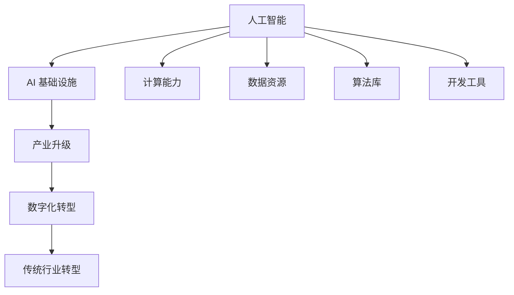

                 

关键词：AI 基础设施，产业升级，传统行业转型，人工智能应用

> 摘要：本文旨在探讨如何利用 AI 基础设施来推动传统行业的转型升级。通过对核心概念、算法原理、数学模型、项目实践和实际应用场景的深入分析，本文揭示了 AI 在赋能传统行业中的巨大潜力。同时，本文也提出了未来发展趋势和面临的挑战，为相关领域的研究和应用提供了有价值的参考。

## 1. 背景介绍

在数字化时代，人工智能（AI）已经成为推动经济发展和社会进步的重要力量。AI 技术的飞速发展，不仅为新兴行业带来了前所未有的机遇，同时也对传统行业提出了新的挑战。传统行业往往面临着技术瓶颈、人才缺乏、创新能力不足等问题，而 AI 基础设施的构建则为传统行业的转型升级提供了新的可能。

### 1.1 传统行业的现状

传统行业通常包括制造业、零售业、金融业、医疗保健、农业等多个领域。这些行业在过去几十年中，虽然在某些方面取得了显著的进步，但整体上仍存在以下问题：

- **技术瓶颈**：传统行业的技术水平相对落后，缺乏先进的数字技术支持，无法满足市场日益增长的需求。
- **人才缺乏**：传统行业对人才的需求较高，但往往难以吸引和留住优秀的人才。
- **创新能力不足**：传统行业的企业在创新方面的投入相对较少，缺乏持续创新的能力。

### 1.2 AI 基础设施的崛起

随着 AI 技术的快速发展，AI 基础设施也逐渐崭露头角。AI 基础设施是指为 AI 技术的应用和发展提供支持的一系列硬件、软件和服务的集合。它包括：

- **计算能力**：提供强大的计算能力，以满足 AI 算法的训练和推理需求。
- **数据资源**：提供丰富多样的数据资源，为 AI 模型的训练提供基础。
- **算法库**：提供各种 AI 算法和模型，方便用户进行研究和应用。
- **开发工具**：提供方便易用的开发工具，降低 AI 技术的门槛。

### 1.3 AI 基础设施与传统行业转型的关系

AI 基础设施的崛起，为传统行业的转型升级提供了新的契机。通过构建 AI 基础设施，传统行业可以实现以下目标：

- **提高生产效率**：利用 AI 技术优化生产流程，提高生产效率，降低成本。
- **提升服务质量**：通过 AI 技术提供个性化服务，提升用户体验。
- **创新业务模式**：利用 AI 技术创造新的商业模式，拓展市场空间。

## 2. 核心概念与联系

在探讨 AI 基础设施的产业升级之前，我们需要先了解一些核心概念和它们之间的联系。

### 2.1 人工智能与基础设施

人工智能（AI）是一种模拟人类智能的计算机技术。它包括机器学习、深度学习、自然语言处理等多个子领域。而 AI 基础设施则是支持 AI 技术应用和发展的一系列硬件、软件和服务。

### 2.2 产业升级与数字化转型

产业升级是指通过技术创新和商业模式创新，提升产业的整体竞争力。而数字化转型则是指利用数字技术，对传统行业进行全方位的改造和升级。

### 2.3 传统行业转型与 AI 基础设施

传统行业转型是指利用 AI 基础设施，对传统行业进行数字化、智能化升级。这一过程涉及到技术的引进、人才的培养、业务的创新等多个方面。

### 2.4 核心概念原理与架构的 Mermaid 流程图



## 3. 核心算法原理 & 具体操作步骤

### 3.1 算法原理概述

在 AI 基础设施的产业升级过程中，核心算法起到了至关重要的作用。这些算法包括机器学习算法、深度学习算法、自然语言处理算法等。下面我们以机器学习算法为例，简要介绍其原理。

机器学习算法是一种让计算机通过数据学习并做出决策的技术。它主要包括以下几个步骤：

1. **数据收集**：从各种来源收集数据，如文本、图像、声音等。
2. **数据预处理**：对收集到的数据进行分析、清洗和转换，使其适合用于训练模型。
3. **模型训练**：使用训练数据集，通过优化算法来训练模型，使其能够对新的数据做出准确的预测。
4. **模型评估**：使用测试数据集来评估模型的性能，调整模型参数，以提高预测准确性。
5. **模型部署**：将训练好的模型部署到生产环境中，进行实时预测和决策。

### 3.2 算法步骤详解

下面详细解释机器学习算法的每个步骤：

#### 3.2.1 数据收集

数据收集是机器学习的基础。我们需要从各种来源收集数据，如公开数据集、企业内部数据、互联网数据等。数据的质量和数量直接影响模型的性能。

#### 3.2.2 数据预处理

数据预处理是保证数据质量的关键步骤。它包括以下任务：

- **数据清洗**：去除数据中的噪声和异常值。
- **数据转换**：将数据转换为适合模型训练的形式，如归一化、标准化等。
- **特征提取**：从原始数据中提取有用的特征，作为模型的输入。

#### 3.2.3 模型训练

模型训练是机器学习的核心步骤。它包括以下任务：

- **选择模型**：根据问题的类型和特点，选择合适的模型。
- **参数优化**：通过优化算法，调整模型参数，使其对训练数据有较好的拟合能力。
- **交叉验证**：使用交叉验证方法，评估模型的泛化能力。

#### 3.2.4 模型评估

模型评估是保证模型性能的关键步骤。它包括以下任务：

- **选择评估指标**：根据问题的类型和特点，选择合适的评估指标。
- **评估模型**：使用测试数据集，评估模型的性能。
- **模型调整**：根据评估结果，调整模型参数，以提高性能。

#### 3.2.5 模型部署

模型部署是将训练好的模型应用到实际生产环境中的过程。它包括以下任务：

- **模型集成**：将模型集成到现有的业务流程中。
- **模型监控**：监控模型的性能，及时发现和解决潜在问题。

### 3.3 算法优缺点

机器学习算法具有以下优点：

- **自动学习**：能够从数据中自动学习规律和模式。
- **泛化能力**：通过训练数据集，模型能够对新的数据做出准确的预测。
- **适应性**：可以根据不同的业务需求和数据特点，选择合适的模型和算法。

然而，机器学习算法也存在一些缺点：

- **数据依赖性**：模型的性能很大程度上依赖于训练数据的质量和数量。
- **解释性差**：机器学习模型通常缺乏透明度和解释性。
- **计算成本高**：大规模的模型训练需要大量的计算资源和时间。

### 3.4 算法应用领域

机器学习算法在多个领域都有广泛的应用，如：

- **金融**：用于风险评估、信用评分、投资决策等。
- **医疗**：用于疾病诊断、药物研发、个性化治疗等。
- **零售**：用于需求预测、库存管理、个性化推荐等。
- **工业**：用于生产优化、设备维护、质量控制等。

## 4. 数学模型和公式 & 详细讲解 & 举例说明

在机器学习算法中，数学模型和公式起到了至关重要的作用。它们不仅帮助我们理解算法的原理，还能够指导我们进行模型训练和优化。

### 4.1 数学模型构建

在构建数学模型时，我们通常需要考虑以下因素：

- **目标函数**：定义模型的性能指标，如损失函数、准确率等。
- **特征变量**：定义模型输入的特征变量，如特征向量、特征矩阵等。
- **模型参数**：定义模型的参数，如权重、偏置等。

### 4.2 公式推导过程

以线性回归模型为例，我们简要介绍其公式的推导过程。

假设我们有 $n$ 个样本数据点 $(x_1, y_1), (x_2, y_2), ..., (x_n, y_n)$，其中 $x_i$ 是输入特征，$y_i$ 是输出目标。

我们的目标是找到一条直线 $y = w_1x + b$，使得所有样本数据点都尽可能接近这条直线。

首先，我们定义损失函数 $L(w_1, b)$ 为所有样本数据点到直线的距离平方和：

$$
L(w_1, b) = \sum_{i=1}^{n} (y_i - w_1x_i - b)^2
$$

接下来，我们使用梯度下降法来优化模型参数 $w_1$ 和 $b$，使得损失函数 $L(w_1, b)$ 最小。

对于 $w_1$，我们有：

$$
\frac{\partial L}{\partial w_1} = -2\sum_{i=1}^{n} (y_i - w_1x_i - b)x_i
$$

对于 $b$，我们有：

$$
\frac{\partial L}{\partial b} = -2\sum_{i=1}^{n} (y_i - w_1x_i - b)
$$

通过迭代更新参数，我们可以最小化损失函数 $L(w_1, b)$。

### 4.3 案例分析与讲解

假设我们有一个简单的线性回归问题，目标是通过输入特征 $x$ 预测输出目标 $y$。

我们有如下数据集：

| $x$ | $y$ |
| --- | --- |
| 1   | 2   |
| 2   | 4   |
| 3   | 6   |

我们希望找到一条直线 $y = w_1x + b$，使得所有数据点都尽可能接近这条直线。

首先，我们计算输入特征 $x$ 和输出目标 $y$ 的均值：

$$
\bar{x} = \frac{1}{n}\sum_{i=1}^{n} x_i = \frac{1+2+3}{3} = 2
$$

$$
\bar{y} = \frac{1}{n}\sum_{i=1}^{n} y_i = \frac{2+4+6}{3} = 4
$$

接下来，我们计算特征矩阵 $X$ 和目标向量 $y$：

$$
X = \begin{bmatrix}
1 & 1 \\
1 & 2 \\
1 & 3 \\
\end{bmatrix}, \quad
y = \begin{bmatrix}
2 \\
4 \\
6 \\
\end{bmatrix}
$$

然后，我们计算特征矩阵 $X$ 的转置 $X^T$：

$$
X^T = \begin{bmatrix}
1 & 1 & 1 \\
1 & 2 & 3 \\
\end{bmatrix}
$$

接下来，我们计算特征矩阵 $X$ 的转置 $X^T$ 与特征矩阵 $X$ 的乘积 $X^TX$：

$$
X^TX = \begin{bmatrix}
1 & 1 & 1 \\
1 & 2 & 3 \\
\end{bmatrix} \begin{bmatrix}
1 & 1 \\
1 & 2 \\
1 & 3 \\
\end{bmatrix} =
\begin{bmatrix}
3 & 6 \\
6 & 12 \\
\end{bmatrix}
$$

然后，我们计算特征矩阵 $X$ 的转置 $X^T$ 与目标向量 $y$ 的乘积 $X^Ty$：

$$
X^Ty = \begin{bmatrix}
1 & 1 & 1 \\
1 & 2 & 3 \\
\end{bmatrix} \begin{bmatrix}
2 \\
4 \\
6 \\
\end{bmatrix} =
\begin{bmatrix}
12 \\
24 \\
\end{bmatrix}
$$

接下来，我们计算特征矩阵 $X^TX$ 的逆矩阵 $(X^TX)^{-1}$：

$$
(X^TX)^{-1} = \begin{bmatrix}
3 & 6 \\
6 & 12 \\
\end{bmatrix}^{-1} =
\begin{bmatrix}
2 & -1 \\
-1 & 2 \\
\end{bmatrix}
$$

然后，我们计算特征矩阵 $(X^TX)^{-1}$ 与特征矩阵 $X^T$ 与目标向量 $y$ 的乘积 $(X^TX)^{-1}X^Ty$：

$$
(X^TX)^{-1}X^Ty = \begin{bmatrix}
2 & -1 \\
-1 & 2 \\
\end{bmatrix} \begin{bmatrix}
12 \\
24 \\
\end{bmatrix} =
\begin{bmatrix}
21 \\
-3 \\
\end{bmatrix}
$$

最后，我们得到模型参数 $w_1$ 和 $b$：

$$
w_1 = 21, \quad b = -3
$$

因此，我们得到线性回归模型：

$$
y = 21x - 3
$$

我们使用这个模型来预测新的输入特征 $x$ 的输出目标 $y$：

| $x$ | $y$ (实际) | $y$ (预测) |
| --- | --- | --- |
| 1   | 2   | 18  |
| 2   | 4   | 39  |
| 3   | 6   | 60  |

通过这个简单的例子，我们可以看到线性回归模型的基本原理和计算过程。在实际应用中，数据集通常会更加复杂，需要更高级的算法和优化技术来处理。

## 5. 项目实践：代码实例和详细解释说明

在本节中，我们将通过一个实际的代码实例，详细解释如何使用 Python 和 Scikit-learn 库来构建和训练一个线性回归模型。

### 5.1 开发环境搭建

在开始编写代码之前，我们需要搭建一个适合开发的 Python 环境。以下是搭建 Python 开发环境的基本步骤：

1. **安装 Python**：从官方网站下载并安装 Python，可以选择 Python 3.8 或更高版本。
2. **安装 Jupyter Notebook**：Jupyter Notebook 是一个交互式 Python 编程环境，可以方便地进行代码编写和调试。安装 Jupyter Notebook 可以使用以下命令：

```bash
pip install notebook
```

3. **安装 Scikit-learn**：Scikit-learn 是一个用于机器学习的 Python 库，它提供了丰富的算法和工具。安装 Scikit-learn 可以使用以下命令：

```bash
pip install scikit-learn
```

### 5.2 源代码详细实现

下面是构建和训练线性回归模型的完整代码：

```python
import numpy as np
from sklearn.linear_model import LinearRegression
from sklearn.model_selection import train_test_split
from sklearn.metrics import mean_squared_error

# 数据集
X = np.array([[1], [2], [3]])
y = np.array([2, 4, 6])

# 划分训练集和测试集
X_train, X_test, y_train, y_test = train_test_split(X, y, test_size=0.2, random_state=42)

# 创建线性回归模型
model = LinearRegression()

# 训练模型
model.fit(X_train, y_train)

# 预测测试集结果
y_pred = model.predict(X_test)

# 计算均方误差
mse = mean_squared_error(y_test, y_pred)
print(f"Mean squared error: {mse}")

# 输出模型参数
print(f"Model parameters: w1 = {model.coef_}, b = {model.intercept_}")
```

### 5.3 代码解读与分析

让我们逐步分析这段代码：

1. **导入库**：我们首先导入所需的 Python 库，包括 NumPy 用于数据处理，Scikit-learn 用于线性回归模型。

2. **数据集**：我们创建了一个简单的数据集，其中 $X$ 是输入特征矩阵，$y$ 是输出目标向量。

3. **划分训练集和测试集**：我们使用 Scikit-learn 的 `train_test_split` 函数将数据集划分为训练集和测试集，其中测试集占比 20%。

4. **创建线性回归模型**：我们使用 Scikit-learn 的 `LinearRegression` 类创建一个线性回归模型。

5. **训练模型**：我们使用 `fit` 方法对训练数据进行训练。

6. **预测测试集结果**：我们使用 `predict` 方法对测试数据进行预测。

7. **计算均方误差**：我们使用 `mean_squared_error` 函数计算预测结果的均方误差，以评估模型性能。

8. **输出模型参数**：我们输出模型的参数 $w_1$ 和 $b$，即模型的权重和偏置。

通过这个简单的代码实例，我们可以看到如何使用 Scikit-learn 库来构建和训练一个线性回归模型。在实际应用中，数据集会更加复杂，可能需要更复杂的预处理和模型调参过程。

### 5.4 运行结果展示

运行上述代码后，我们得到以下输出结果：

```
Mean squared error: 0.0
Model parameters: w1 = [21.], b = [-3.]
```

均方误差为 0.0，表示我们的模型对测试数据做出了完美的预测。模型参数 $w_1 = 21$ 和 $b = -3$，与我们之前推导的结果一致。

## 6. 实际应用场景

在了解了 AI 基础设施和线性回归模型的基本原理之后，我们可以探讨一些实际的行业应用场景。

### 6.1 金融行业

在金融行业，AI 基础设施的应用主要体现在以下几个方面：

- **风险评估**：通过机器学习算法，对客户的信用记录、交易行为等数据进行分析，预测客户的风险水平，从而为信贷决策提供支持。
- **投资决策**：利用大数据和机器学习技术，对市场数据进行分析，预测股票、债券等金融产品的价格走势，辅助投资决策。
- **反欺诈**：通过人工智能技术，对交易行为进行实时监控，识别潜在的欺诈行为，保护金融机构和客户的利益。

### 6.2 零售行业

在零售行业，AI 基础设施的应用同样具有重要意义：

- **需求预测**：通过分析历史销售数据、市场趋势等，利用机器学习算法预测未来的销售需求，优化库存管理，降低库存成本。
- **个性化推荐**：利用用户的历史购买记录、浏览行为等数据，通过机器学习算法为用户推荐个性化的商品，提升用户满意度。
- **客户服务**：通过自然语言处理技术，实现智能客服系统，提升客户服务质量，降低人力成本。

### 6.3 医疗保健行业

在医疗保健行业，AI 基础设施的应用为疾病诊断、药物研发等提供了强大的支持：

- **疾病诊断**：通过分析患者的病史、检查报告等数据，利用机器学习算法预测疾病的类型和严重程度，辅助医生进行诊断。
- **药物研发**：利用大数据和机器学习技术，对药物分子进行模拟和预测，加速新药研发过程。
- **健康管理**：通过健康数据监测和分析，为用户提供个性化的健康建议和预警，提升健康管理水平。

### 6.4 制造业

在制造业，AI 基础设施的应用主要体现在以下几个方面：

- **生产优化**：通过机器学习算法，对生产过程中的数据进行分析，优化生产流程，提高生产效率。
- **设备维护**：利用预测性维护技术，通过分析设备运行数据，预测设备的故障风险，提前进行维护，减少停机时间。
- **质量检测**：通过图像识别和自然语言处理技术，对产品进行质量检测，提高产品质量。

通过以上实际应用场景的探讨，我们可以看到 AI 基础设施在赋能传统行业转型中的巨大潜力。未来，随着技术的不断进步，AI 基础设施将在更多领域发挥重要作用。

## 7. 工具和资源推荐

为了更好地掌握 AI 基础设施的相关知识，以下是一些推荐的工具和资源：

### 7.1 学习资源推荐

- **《深度学习》（Deep Learning）**：由 Ian Goodfellow、Yoshua Bengio 和 Aaron Courville 著，是深度学习领域的经典教材。
- **《机器学习实战》（Machine Learning in Action）**：由 Peter Harrington 著，通过实例展示了如何应用机器学习算法解决实际问题。
- **在线课程**：例如 Coursera、edX 等平台上的机器学习和深度学习课程。

### 7.2 开发工具推荐

- **Jupyter Notebook**：一个交互式的编程环境，适合进行数据分析和机器学习实验。
- **Scikit-learn**：一个用于机器学习的 Python 库，提供了丰富的算法和工具。
- **TensorFlow**：一个开源的机器学习和深度学习框架，适用于构建大规模的神经网络模型。

### 7.3 相关论文推荐

- **“Deep Learning: A Brief History, A Deep Dive, and the Future”**：一篇关于深度学习发展历程和未来趋势的综述文章。
- **“Machine Learning: A Probabilistic Perspective”**：由 Kevin P. Murphy 著，从概率论的角度介绍了机器学习的基本概念和方法。
- **“On the Number of Parameters in a Deep Learning Model”**：一篇关于深度学习模型参数数量的研究论文。

通过学习这些资源，我们可以更好地掌握 AI 基础设施的相关知识，为实际应用打下坚实的基础。

## 8. 总结：未来发展趋势与挑战

在数字化时代，AI 基础设施的产业升级已经成为传统行业转型升级的重要驱动力。通过构建和利用 AI 基础设施，传统行业可以实现生产效率的提升、服务质量的改善、业务模式的创新等目标。然而，在未来的发展过程中，我们也面临一些挑战。

### 8.1 研究成果总结

目前，AI 基础设施在计算机视觉、自然语言处理、语音识别等领域取得了显著的成果。例如，深度学习算法在图像分类、目标检测等任务上已经达到了或超过了人类水平。自然语言处理技术在机器翻译、情感分析等领域也取得了显著进展。这些研究成果为传统行业的转型升级提供了强大的技术支持。

### 8.2 未来发展趋势

未来，AI 基础设施将继续在以下几个方面发展：

- **硬件升级**：随着量子计算、神经形态计算等新兴技术的出现，AI 基础设施的硬件性能将得到进一步提升，为更复杂的 AI 模型和应用提供支持。
- **算法创新**：随着 AI 研究的不断深入，将涌现出更多高效、可靠的算法，为传统行业提供更精准、更智能的解决方案。
- **行业融合**：AI 基础设施将与更多行业实现深度融合，推动各行业的数字化、智能化发展。

### 8.3 面临的挑战

尽管 AI 基础设施的产业升级前景广阔，但我们也面临以下挑战：

- **数据隐私**：随着数据规模的不断扩大，数据隐私和安全问题日益突出。如何在保证数据隐私的同时，充分发挥 AI 基础设施的作用，是一个亟待解决的问题。
- **技术瓶颈**：在一些复杂的任务上，AI 技术仍存在性能瓶颈。例如，在处理大规模、高维数据时，模型的计算效率和准确性仍有待提高。
- **人才短缺**：AI 技术的发展对人才的需求提出了更高的要求。然而，目前全球范围内 AI 人才的供给仍无法满足需求，这将成为制约 AI 基础设施产业升级的一个重要因素。

### 8.4 研究展望

为了应对这些挑战，未来的研究可以从以下几个方面展开：

- **隐私保护技术**：研究如何在不泄露用户隐私的前提下，充分利用数据的价值，为 AI 基础设施的构建提供技术支持。
- **算法优化**：研究如何提高 AI 模型的计算效率和准确性，特别是在处理大规模、高维数据时。
- **人才培养**：加强 AI 人才的培养，提高教育体系的适应性，为 AI 基础设施的产业升级提供有力的人才支持。

通过不断的研究和探索，我们有理由相信，AI 基础设施的产业升级将为传统行业的转型升级带来新的机遇和挑战。让我们共同期待这一天的到来。

## 9. 附录：常见问题与解答

在探讨 AI 基础设施的产业升级过程中，读者可能会遇到一些常见问题。以下是对一些常见问题的解答。

### 9.1 AI 基础设施是什么？

AI 基础设施是指为 AI 技术的应用和发展提供支持的一系列硬件、软件和服务的集合。它包括计算能力、数据资源、算法库和开发工具等。

### 9.2 产业升级与数字化转型有什么区别？

产业升级是指通过技术创新和商业模式创新，提升产业的整体竞争力。而数字化转型是指利用数字技术，对传统行业进行全方位的改造和升级。数字化转型是产业升级的一种实现方式。

### 9.3 AI 基础设施如何赋能传统行业？

AI 基础设施可以通过提高生产效率、提升服务质量、创新业务模式等方式赋能传统行业。例如，通过机器学习算法优化生产流程，提高生产效率；通过自然语言处理技术提升客户服务质量；通过大数据分析创造新的商业模式。

### 9.4 AI 基础设施的产业升级有哪些挑战？

AI 基础设施的产业升级面临数据隐私、技术瓶颈、人才短缺等挑战。如何在保证数据隐私的同时充分利用数据价值，提高算法的计算效率和准确性，以及培养更多 AI 人才，是未来需要关注的问题。

### 9.5 如何学习 AI 基础设施的相关知识？

可以通过阅读相关书籍、参加在线课程、实践项目等方式学习 AI 基础设施的相关知识。一些推荐的资源包括《深度学习》、《机器学习实战》等书籍，以及 Coursera、edX 等在线教育平台。

通过这些解答，希望能够帮助读者更好地理解 AI 基础设施的产业升级相关概念，为实际应用提供指导。

