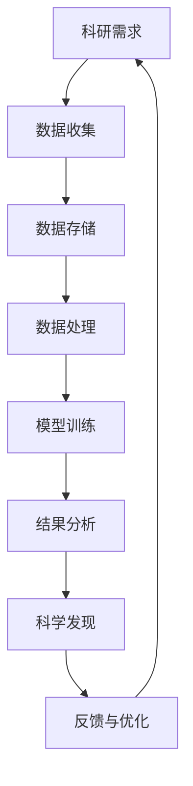

                 

关键词：人工智能、基础设施、科研支持、科学发现、计算加速

> 摘要：本文深入探讨了人工智能基础设施在科研支持中的关键作用，分析了其如何通过计算加速来推动科学发现进程，并提供了一系列实际应用案例和未来展望。

## 1. 背景介绍

在过去的几十年中，科学技术的迅猛发展极大地改变了我们的生活方式。科学研究的需求不断增长，使得计算能力成为推动科学发现的重要驱动力。然而，随着数据规模的爆炸性增长和计算复杂性的增加，传统的计算资源已经无法满足科研的迫切需求。这种背景下，人工智能基础设施的科研支持变得尤为重要。

人工智能基础设施是指在硬件、软件和网络等方面提供支持的一系列资源，旨在为科研工作提供高效、可靠、可扩展的计算环境。通过这些基础设施，科研人员可以更快速地进行数据分析和处理，从而加速科学发现的进程。

## 2. 核心概念与联系

### 2.1 人工智能基础设施的定义

人工智能基础设施是指支持人工智能算法运行和数据处理的硬件、软件和网络等资源。这些资源包括高性能计算集群、数据中心、云计算平台、数据存储和处理工具等。

### 2.2 人工智能基础设施与科研支持的关系

人工智能基础设施在科研支持中的作用主要体现在以下几个方面：

1. **计算加速**：通过提供强大的计算能力，人工智能基础设施可以帮助科研人员更快地进行数据处理和模型训练，从而缩短研究周期。
2. **数据管理**：人工智能基础设施提供了高效的数据存储和处理工具，使得科研人员可以更轻松地管理和分析大规模数据集。
3. **算法优化**：人工智能基础设施可以通过自动化和优化算法，提高科研人员的计算效率，减少人为错误。
4. **跨学科合作**：人工智能基础设施可以促进不同学科之间的合作，为交叉学科研究提供支持。

### 2.3 Mermaid 流程图



## 3. 核心算法原理 & 具体操作步骤

### 3.1 算法原理概述

人工智能基础设施中的核心算法主要包括深度学习、数据挖掘和优化算法等。这些算法通过学习数据中的模式和规律，帮助科研人员发现隐藏的科学知识。

### 3.2 算法步骤详解

1. **数据收集**：首先，科研人员需要收集相关的数据，这些数据可以是实验数据、文献数据或其他形式。
2. **数据预处理**：在收集到数据后，需要进行数据清洗、归一化等预处理操作，以确保数据的质量。
3. **模型训练**：使用预处理后的数据，训练深度学习模型或数据挖掘模型。
4. **模型评估**：对训练好的模型进行评估，确保其准确性和稳定性。
5. **结果分析**：使用模型对新的数据进行预测或分析，提取科学知识。
6. **反馈与优化**：根据结果分析的结果，对模型进行调整和优化，以提高其性能。

### 3.3 算法优缺点

**优点**：

- **计算加速**：通过高效的算法和计算资源，可以大幅缩短科研周期。
- **数据挖掘能力**：人工智能算法可以自动从大规模数据中挖掘出有价值的信息。
- **跨学科应用**：人工智能算法可以应用于不同领域的科研工作，促进跨学科合作。

**缺点**：

- **数据依赖**：算法的性能很大程度上取决于数据的质量和数量。
- **计算资源需求高**：高性能计算资源的需求较大，可能导致成本增加。
- **模型解释性**：一些复杂的人工智能模型难以解释，可能影响结果的可靠性。

### 3.4 算法应用领域

人工智能基础设施在以下领域具有广泛的应用：

- **生物信息学**：通过分析生物数据，发现新的生物规律和药物靶点。
- **物理学**：使用模拟和优化算法，研究复杂的物理现象和材料特性。
- **环境科学**：通过数据分析和模型预测，研究气候变化和环境问题。
- **社会科学**：使用大数据分析，研究社会现象和人类行为。

## 4. 数学模型和公式 & 详细讲解 & 举例说明

### 4.1 数学模型构建

在人工智能基础设施中，常用的数学模型包括神经网络、线性回归、决策树等。以下是一个简单的神经网络模型：

$$
y = \sigma(\sum_{i=1}^{n} w_i \cdot x_i + b)
$$

其中，$y$ 表示输出，$\sigma$ 表示激活函数，$w_i$ 和 $x_i$ 分别表示权重和输入，$b$ 表示偏置。

### 4.2 公式推导过程

神经网络的推导过程可以简化为以下几个步骤：

1. **初始化参数**：随机初始化权重 $w_i$ 和偏置 $b$。
2. **前向传播**：计算输出 $y$。
3. **反向传播**：计算损失函数关于参数的梯度，更新参数。
4. **优化参数**：使用梯度下降或其他优化算法，更新参数。

### 4.3 案例分析与讲解

以下是一个使用神经网络进行图像分类的案例：

1. **数据收集**：收集包含不同类别的图像数据。
2. **数据预处理**：对图像进行缩放、裁剪等操作，转换为神经网络可处理的格式。
3. **模型训练**：使用预处理后的数据训练神经网络模型。
4. **模型评估**：使用测试集评估模型性能，调整参数。
5. **结果分析**：使用模型对新的图像进行分类，提取有价值的信息。

## 5. 项目实践：代码实例和详细解释说明

### 5.1 开发环境搭建

在搭建开发环境时，需要安装以下软件和工具：

- Python 3.x
- TensorFlow
- Keras

### 5.2 源代码详细实现

以下是一个简单的图像分类模型实现：

```python
from tensorflow.keras.models import Sequential
from tensorflow.keras.layers import Conv2D, MaxPooling2D, Flatten, Dense

# 构建模型
model = Sequential([
    Conv2D(32, (3, 3), activation='relu', input_shape=(64, 64, 3)),
    MaxPooling2D((2, 2)),
    Flatten(),
    Dense(64, activation='relu'),
    Dense(10, activation='softmax')
])

# 编译模型
model.compile(optimizer='adam', loss='categorical_crossentropy', metrics=['accuracy'])

# 训练模型
model.fit(x_train, y_train, epochs=10, batch_size=32, validation_data=(x_val, y_val))

# 评估模型
model.evaluate(x_test, y_test)
```

### 5.3 代码解读与分析

上述代码实现了以下功能：

- **模型构建**：使用 `Sequential` 模型，添加卷积层、池化层、全连接层等。
- **模型编译**：设置优化器、损失函数和评估指标。
- **模型训练**：使用训练集训练模型，并设置验证集。
- **模型评估**：使用测试集评估模型性能。

### 5.4 运行结果展示

在训练完成后，可以使用以下代码查看模型性能：

```python
print("Test accuracy:", model.evaluate(x_test, y_test)[1])
```

## 6. 实际应用场景

### 6.1 生物信息学

在生物信息学领域，人工智能基础设施被广泛应用于基因序列分析、蛋白质结构预测和药物发现等方面。通过使用深度学习算法，科研人员可以更快速地识别疾病相关的基因变异，预测药物的作用机制，从而加速新药研发。

### 6.2 物理学

在物理学领域，人工智能基础设施可以帮助研究人员分析大量实验数据，发现新的物理现象和材料特性。例如，在材料科学中，通过使用深度学习模型，可以预测材料的电导率、硬度等特性，为新材料的研发提供支持。

### 6.3 环境科学

在环境科学领域，人工智能基础设施可以用于分析气候变化数据、预测自然灾害等。通过大数据分析，科研人员可以更准确地了解环境变化趋势，为环境保护和可持续发展提供科学依据。

### 6.4 未来应用展望

随着人工智能技术的不断发展，人工智能基础设施在科研支持中的应用前景十分广阔。未来，人工智能基础设施有望在以下领域发挥更大作用：

- **人工智能与生物医学的融合**：通过深度学习算法，加速新药研发和疾病治疗。
- **人工智能与物理学的融合**：通过模拟和优化算法，揭示复杂的物理现象和规律。
- **人工智能与社会科学的融合**：通过大数据分析，研究人类行为和社会现象。

## 7. 工具和资源推荐

### 7.1 学习资源推荐

- 《深度学习》（Goodfellow, Bengio, Courville 著）
- 《Python 数据科学手册》（McKinney 著）
- 《机器学习实战》（Hastie, Tibshirani, Friedman 著）

### 7.2 开发工具推荐

- TensorFlow
- Keras
- PyTorch

### 7.3 相关论文推荐

- "Deep Learning for Biomedical Data Science"（Karthik Narasimhan 等）
- "Generative Adversarial Networks for Computer Vision: A Survey"（Chen et al.）
- "Reinforcement Learning in Computational Neuroscience"（Naren Viswanathan 等）

## 8. 总结：未来发展趋势与挑战

### 8.1 研究成果总结

人工智能基础设施在科研支持中取得了显著成果，通过计算加速和算法优化，大幅提高了科研效率。未来，随着人工智能技术的不断发展，人工智能基础设施在科研支持中的应用将更加广泛和深入。

### 8.2 未来发展趋势

- **计算能力提升**：随着硬件技术的发展，人工智能基础设施的计算能力将不断提高。
- **算法创新**：新的算法和模型将不断涌现，为科研提供更多可能。
- **跨学科合作**：人工智能基础设施将促进不同学科之间的合作，推动科学研究的进步。

### 8.3 面临的挑战

- **数据质量**：高质量的数据是人工智能基础设施发挥作用的基础，未来需要解决数据质量问题。
- **计算资源分配**：如何合理分配计算资源，提高资源利用效率，是一个重要的挑战。
- **模型解释性**：复杂的人工智能模型难以解释，可能影响结果的可靠性，未来需要解决模型解释性问题。

### 8.4 研究展望

未来，人工智能基础设施在科研支持中的应用将不断拓展，有望在生物医学、物理学、环境科学等众多领域发挥更大作用。同时，随着人工智能技术的不断进步，人工智能基础设施也将面临新的挑战和机遇。

## 9. 附录：常见问题与解答

### 9.1 人工智能基础设施是什么？

人工智能基础设施是指支持人工智能算法运行和数据处理的硬件、软件和网络等资源，包括高性能计算集群、数据中心、云计算平台、数据存储和处理工具等。

### 9.2 人工智能基础设施有哪些优势？

人工智能基础设施的优势包括计算加速、数据管理、算法优化和跨学科合作等。

### 9.3 人工智能基础设施在科研中的应用有哪些？

人工智能基础设施在科研中的应用包括生物信息学、物理学、环境科学等领域，通过计算加速和算法优化，加速科学发现的进程。

### 9.4 如何搭建人工智能基础设施？

搭建人工智能基础设施需要选择合适的硬件、软件和网络资源，并进行合理的配置和管理。具体步骤包括：硬件选择、软件安装、网络搭建、资源分配等。

作者：禅与计算机程序设计艺术 / Zen and the Art of Computer Programming

----------------------------------------------------------------

### 总结与展望

人工智能基础设施在科研支持中的作用日益凸显，通过计算加速和算法优化，它极大地提高了科研效率，推动了科学发现的进程。本文从背景介绍、核心概念、算法原理、数学模型、项目实践、实际应用和未来展望等多个角度，全面探讨了人工智能基础设施在科研支持中的关键作用。

随着人工智能技术的不断进步，我们可以预见，人工智能基础设施在科研支持中的应用将更加广泛和深入。未来，我们将看到更多跨学科合作的出现，更多复杂的科研问题得到解决。同时，人工智能基础设施也将面临新的挑战，如数据质量、计算资源分配和模型解释性问题等。

为了更好地应对这些挑战，我们需要持续进行技术创新，优化人工智能基础设施的设计和配置。此外，加强人才培养和知识传播，提高科研人员的技能水平，也是推动人工智能基础设施在科研支持中发挥作用的重要途径。

总之，人工智能基础设施是科研支持的重要组成部分，它将为科学发现注入新的动力。让我们期待人工智能基础设施在未来发挥更大的作用，助力科学研究取得更多突破性成果。

