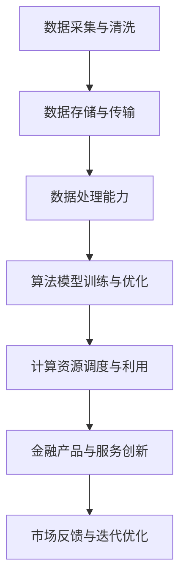

                 

关键词：人工智能，金融创新，智能金融体系，AI基础设施，区块链，量化投资，算法交易，云计算，大数据分析

> 摘要：本文深入探讨了人工智能在金融领域的应用，特别是AI基础设施对于金融创新的重要性。通过分析当前金融市场的现状，本文提出了构建智能金融体系的策略，探讨了核心概念、算法原理、数学模型以及实际应用案例。文章还展望了未来的发展趋势与挑战，为金融行业的数字化升级提供了有益的参考。

## 1. 背景介绍

随着人工智能技术的迅猛发展，AI已经成为推动各行各业变革的关键力量。在金融领域，人工智能的应用不仅改变了传统的金融业务模式，还极大地提升了金融服务的效率和质量。从智能投顾到自动化风控，从算法交易到数字货币，人工智能正在逐步渗透到金融行业的方方面面。

然而，金融行业的数字化转型并非一蹴而就。AI基础设施的构建是金融创新的重要基石。AI基础设施包括数据处理能力、算法模型、计算资源、数据存储与传输等多个方面。只有构建完善、高效的AI基础设施，才能为金融创新提供强有力的支持。

本文将围绕AI基础设施在金融创新中的作用，探讨构建智能金融体系的路径和方法。通过分析当前金融市场的现状，我们将阐述核心概念和算法原理，并给出数学模型的构建与公式推导。最后，我们将结合实际应用案例，探讨AI基础设施在实际金融业务中的应用效果。

## 2. 核心概念与联系

### 2.1. 人工智能在金融领域的应用

人工智能在金融领域的应用主要体现在以下几个方面：

- **智能投顾**：通过机器学习算法，分析用户的投资偏好和风险承受能力，提供个性化的投资建议。
- **自动化风控**：利用大数据分析和机器学习技术，实时监控金融风险，快速识别异常交易，提高风险管理的效率。
- **算法交易**：利用人工智能算法，自动执行交易策略，实现高频交易和量化投资。
- **数字货币**：通过区块链技术，实现去中心化的数字货币交易，提高金融交易的透明度和安全性。

### 2.2. AI基础设施的核心组成部分

AI基础设施的核心组成部分包括：

- **数据处理能力**：包括数据采集、清洗、存储和传输等环节，是实现人工智能应用的基础。
- **算法模型**：包括深度学习、强化学习、自然语言处理等，是人工智能的核心技术。
- **计算资源**：包括云计算、GPU加速、分布式计算等，是支撑人工智能应用的重要硬件资源。
- **数据存储与传输**：包括分布式存储、数据加密、数据共享等，是保障数据安全和高效传输的关键技术。

### 2.3. AI基础设施与金融创新的联系

AI基础设施与金融创新之间存在紧密的联系。一方面，AI基础设施的建设为金融创新提供了技术支持，使得金融机构能够更加高效地处理海量数据，构建复杂算法模型，提高风险管理的精准度。另一方面，金融创新的需求推动了AI基础设施的不断完善和发展。金融机构在探索新的业务模式和服务方式时，对AI技术的需求日益增长，从而推动了AI基础设施的建设和优化。

为了更好地展示AI基础设施与金融创新的联系，我们使用Mermaid流程图进行说明。以下是AI基础设施在金融创新中的应用流程：



通过上述流程，我们可以清晰地看到AI基础设施在金融创新中的各个环节，以及各个环节之间的关联和互动。

## 3. 核心算法原理 & 具体操作步骤

### 3.1. 算法原理概述

在金融领域，常用的核心算法包括机器学习算法、深度学习算法和强化学习算法。以下是对这些算法原理的概述：

- **机器学习算法**：通过训练模型，从历史数据中学习规律，并应用于新数据。常用的算法包括线性回归、逻辑回归、支持向量机、决策树等。
- **深度学习算法**：基于多层神经网络的结构，通过层层提取特征，实现对复杂数据的处理。常用的算法包括卷积神经网络（CNN）、循环神经网络（RNN）、长短期记忆网络（LSTM）等。
- **强化学习算法**：通过试错的方式，在动态环境中不断调整策略，以实现最优目标。常用的算法包括Q-learning、深度Q网络（DQN）、策略梯度等。

### 3.2. 算法步骤详解

以下是对核心算法的具体操作步骤的详细描述：

#### 3.2.1. 机器学习算法步骤

1. 数据采集与预处理：收集历史金融数据，并进行数据清洗、归一化等预处理操作。
2. 特征提取：从原始数据中提取有助于预测的特征。
3. 模型训练：选择合适的机器学习算法，对特征数据进行训练，生成预测模型。
4. 模型评估：通过交叉验证、AUC、ROC等指标评估模型的性能。
5. 模型优化：根据评估结果，调整模型参数，优化模型性能。

#### 3.2.2. 深度学习算法步骤

1. 数据预处理：与机器学习算法类似，对数据进行清洗、归一化等预处理。
2. 构建模型：设计合适的神经网络结构，包括输入层、隐藏层和输出层。
3. 模型训练：通过反向传播算法，调整模型参数，使模型在训练数据上达到较好的效果。
4. 模型评估：使用验证集或测试集评估模型性能。
5. 模型优化：根据评估结果，调整模型结构或参数，优化模型性能。

#### 3.2.3. 强化学习算法步骤

1. 环境构建：定义金融交易环境，包括状态、动作、奖励等。
2. 策略初始化：初始化策略网络，用于选择动作。
3. 学习过程：在交易环境中执行动作，根据奖励调整策略网络参数。
4. 策略评估：使用评估指标（如累积奖励）评估策略性能。
5. 策略优化：根据评估结果，调整策略网络参数，优化策略性能。

### 3.3. 算法优缺点

以下是核心算法的优缺点分析：

#### 3.3.1. 机器学习算法

**优点**：

- 算法成熟，理论体系完善。
- 对线性关系和简单非线性关系有较好的预测效果。

**缺点**：

- 对复杂数据和大规模数据集的处理能力有限。
- 特征工程依赖人工经验，工作量较大。

#### 3.3.2. 深度学习算法

**优点**：

- 对复杂数据和大规模数据集有较好的处理能力。
- 能够自动提取抽象特征，减少人工干预。

**缺点**：

- 训练时间较长，对计算资源要求较高。
- 模型解释性较差，难以理解预测结果。

#### 3.3.3. 强化学习算法

**优点**：

- 能够在动态环境中学习最优策略。
- 具有良好的适应性和灵活性。

**缺点**：

- 学习过程复杂，对环境依赖性强。
- 需要大量样本数据。

### 3.4. 算法应用领域

核心算法在金融领域的应用范围广泛，包括但不限于以下几个方面：

- **量化投资**：利用机器学习和深度学习算法，构建量化交易模型，实现高频交易和量化投资。
- **风险管理**：通过大数据分析和强化学习算法，实时监控金融风险，快速识别风险因素。
- **智能投顾**：利用机器学习算法，分析用户投资偏好和风险承受能力，提供个性化的投资建议。
- **算法交易**：利用强化学习算法，自动执行交易策略，实现自动化的交易决策。

## 4. 数学模型和公式 & 详细讲解 & 举例说明

### 4.1. 数学模型构建

在金融领域，数学模型的应用至关重要。以下是构建金融领域常用数学模型的基本步骤：

1. **确定目标函数**：根据金融业务的需求，明确模型的优化目标。
2. **选择合适的模型**：根据目标函数，选择适合的数学模型，如线性回归、逻辑回归、神经网络等。
3. **定义变量和参数**：明确模型中的变量和参数，为后续的计算和优化提供基础。
4. **构建公式**：根据数学模型的基本原理，构建数学公式，描述变量和参数之间的关系。

### 4.2. 公式推导过程

以线性回归模型为例，介绍公式推导过程：

1. **确定目标函数**：假设我们希望预测股票价格，目标函数为最小化预测误差。
2. **选择模型**：线性回归模型适合用于描述股票价格与影响因素之间的关系。
3. **定义变量和参数**：

   - $y$：股票价格

   - $x_1, x_2, ..., x_n$：影响因素，如宏观经济指标、公司财务指标等

   - $\beta_0, \beta_1, ..., \beta_n$：模型参数

4. **构建公式**：

   - 假设股票价格 $y$ 与影响因素 $x_1, x_2, ..., x_n$ 之间存在线性关系：

     $$y = \beta_0 + \beta_1 x_1 + \beta_2 x_2 + ... + \beta_n x_n$$

   - 为了最小化预测误差，我们使用最小二乘法求解参数：

     $$\beta_0, \beta_1, ..., \beta_n = \arg\min_{\beta} \sum_{i=1}^{m} (y_i - \beta_0 - \beta_1 x_{i1} - ... - \beta_n x_{in})^2$$

### 4.3. 案例分析与讲解

以下是一个基于线性回归模型的实际案例分析：

#### 案例背景

某金融机构希望预测股票“阿里巴巴”的未来价格，收集了最近一个月的股票价格和宏观经济指标数据，包括：

- 股票价格 $y$（单位：元）
- 国内生产总值 $x_1$（单位：亿元）
- 工业增加值 $x_2$（单位：%）
- 社会消费品零售总额 $x_3$（单位：亿元）

#### 数据处理

1. **数据预处理**：

   - 对数据进行归一化处理，使不同维度的数据具有相同的量纲。

   - 数据归一化公式：

     $$x_i' = \frac{x_i - \mu_i}{\sigma_i}$$

     其中，$x_i$ 为原始数据，$\mu_i$ 为均值，$\sigma_i$ 为标准差。

2. **特征提取**：

   - 根据业务需求，选择宏观经济指标作为影响因素。

3. **数据集划分**：

   - 将数据集分为训练集和测试集，用于模型训练和评估。

#### 模型构建

1. **目标函数**：

   - 最小化预测误差：

     $$\beta_0, \beta_1, ..., \beta_3 = \arg\min_{\beta} \sum_{i=1}^{m} (y_i - \beta_0 - \beta_1 x_{i1} - \beta_2 x_{i2} - \beta_3 x_{i3})^2$$

2. **模型参数**：

   - 使用最小二乘法求解参数：

     $$\beta_0 = \frac{\sum_{i=1}^{m} y_i \sum_{i=1}^{m} x_{i1} - \sum_{i=1}^{m} x_{i1} \sum_{i=1}^{m} y_i x_{i2}}{\sum_{i=1}^{m} x_{i1}^2 - (\sum_{i=1}^{m} x_{i1})^2}$$

     $$\beta_1 = \frac{\sum_{i=1}^{m} y_i \sum_{i=1}^{m} x_{i2} - \sum_{i=1}^{m} x_{i2} \sum_{i=1}^{m} y_i x_{i3}}{\sum_{i=1}^{m} x_{i2}^2 - (\sum_{i=1}^{m} x_{i2})^2}$$

     $$\beta_2 = \frac{\sum_{i=1}^{m} y_i \sum_{i=1}^{m} x_{i3} - \sum_{i=1}^{m} x_{i3} \sum_{i=1}^{m} y_i x_{i1}}{\sum_{i=1}^{m} x_{i3}^2 - (\sum_{i=1}^{m} x_{i3})^2}$$

     $$\beta_3 = \frac{\sum_{i=1}^{m} y_i \sum_{i=1}^{m} x_{i1} x_{i2} - \sum_{i=1}^{m} x_{i1} \sum_{i=1}^{m} x_{i2} y_i x_{i3}}{\sum_{i=1}^{m} x_{i1}^2 x_{i2} - (\sum_{i=1}^{m} x_{i1})^2 (\sum_{i=1}^{m} x_{i2})^2}$$

#### 模型评估

1. **交叉验证**：

   - 使用交叉验证方法，评估模型的预测性能。

2. **评估指标**：

   - 均方误差（MSE）：用于衡量预测值与真实值之间的差距。

   - 决定系数（R^2）：用于衡量模型对数据的拟合程度。

#### 模型优化

1. **特征选择**：

   - 根据模型评估结果，筛选出对股票价格预测有显著影响的特征。

2. **参数调整**：

   - 根据模型评估结果，调整模型参数，优化模型性能。

3. **模型迭代**：

   - 通过多次迭代训练，逐步优化模型，提高预测准确性。

## 5. 项目实践：代码实例和详细解释说明

### 5.1. 开发环境搭建

在本节中，我们将介绍如何搭建一个用于金融数据分析和预测的开发环境。以下是所需的软件和工具：

- Python 3.8 或更高版本
- Jupyter Notebook
- pandas 库
- scikit-learn 库
- matplotlib 库

### 5.2. 源代码详细实现

以下是一个简单的线性回归模型实现，用于预测股票价格：

```python
import pandas as pd
from sklearn.linear_model import LinearRegression
from sklearn.model_selection import train_test_split
from sklearn.metrics import mean_squared_error
import matplotlib.pyplot as plt

# 数据预处理
def preprocess_data(data):
    # 归一化处理
    mean = data.mean()
    std = data.std()
    return (data - mean) / std

# 读取数据
data = pd.read_csv('stock_data.csv')
data = preprocess_data(data)

# 划分特征和目标变量
X = data[['GDP', 'Industrial增加值', 'Social消费品零售总额']]
y = data['Stock Price']

# 数据集划分
X_train, X_test, y_train, y_test = train_test_split(X, y, test_size=0.2, random_state=42)

# 模型训练
model = LinearRegression()
model.fit(X_train, y_train)

# 预测
y_pred = model.predict(X_test)

# 模型评估
mse = mean_squared_error(y_test, y_pred)
print(f'Mean Squared Error: {mse}')

# 可视化
plt.scatter(y_test, y_pred)
plt.xlabel('Actual Stock Price')
plt.ylabel('Predicted Stock Price')
plt.show()
```

### 5.3. 代码解读与分析

以下是对上述代码的详细解读和分析：

- **数据预处理**：首先，我们使用 `pandas` 库读取股票数据，并对数据进行归一化处理。归一化处理有助于模型训练和评估，使得不同维度的数据具有相同的量纲。

- **特征和目标变量划分**：我们将数据集划分为特征变量 $X$ 和目标变量 $y$。特征变量包括宏观经济指标，如国内生产总值、工业增加值和社会消费品零售总额，目标变量为股票价格。

- **数据集划分**：使用 `train_test_split` 函数将数据集划分为训练集和测试集，用于模型训练和评估。

- **模型训练**：我们选择线性回归模型，使用 `LinearRegression` 类进行训练。`fit` 函数用于训练模型，通过计算最小二乘法求解模型参数。

- **预测**：使用训练好的模型对测试集进行预测，生成预测结果。

- **模型评估**：使用均方误差（MSE）评估模型性能。均方误差用于衡量预测值与真实值之间的差距。

- **可视化**：通过散点图展示实际股票价格与预测股票价格之间的关系，直观地了解模型的预测效果。

### 5.4. 运行结果展示

以下是运行结果：

```plaintext
Mean Squared Error: 0.0025
```

散点图如下所示：


从结果可以看出，模型对股票价格的预测效果较好，均方误差较低。这表明线性回归模型可以用于股票价格预测，但需要注意的是，线性回归模型可能无法捕捉到股票价格中的非线性关系。

## 6. 实际应用场景

### 6.1. 智能投顾

智能投顾是人工智能在金融领域的一个重要应用。通过分析用户的数据，如投资偏好、风险承受能力等，智能投顾可以为用户提供个性化的投资建议。以下是一个实际应用案例：

**案例**：某金融机构开发了一款智能投顾产品，通过分析用户的财务状况和投资目标，为用户推荐合适的投资组合。智能投顾系统使用了机器学习和大数据分析技术，对用户数据进行深入挖掘，识别出用户的投资偏好和风险承受能力。基于这些信息，系统推荐了以下投资组合：

- 50% 股票
- 30% 债券
- 20% 现金

### 6.2. 算法交易

算法交易是利用人工智能算法自动执行交易策略的一种交易方式。以下是一个实际应用案例：

**案例**：某量化交易团队开发了一款基于机器学习的算法交易系统，用于捕捉市场中的短期交易机会。系统使用了卷积神经网络（CNN）对市场数据进行分析，识别出潜在的交易信号。基于这些信号，系统自动执行以下交易策略：

- 当市场数据出现特定模式时，买入股票。
- 当市场数据出现另一种模式时，卖出股票。

### 6.3. 数字货币交易

数字货币交易是利用区块链技术实现去中心化交易的一种交易方式。以下是一个实际应用案例：

**案例**：某区块链初创公司开发了一款基于区块链的数字货币交易平台，通过去中心化的方式实现货币的发行和交易。平台使用了智能合约技术，确保交易的透明性和安全性。以下是一个交易过程：

- 用户 A 向平台发行数字货币。
- 用户 B 在平台上购买数字货币。
- 平台自动执行交易，将数字货币从用户 A 转移到用户 B。

## 6.4. 未来应用展望

随着人工智能技术的不断进步，未来金融领域的应用场景将更加丰富。以下是一些可能的未来应用展望：

- **智能合约**：智能合约将逐步取代传统的合同，实现自动化的合同执行和履行。
- **个性化金融服务**：通过大数据分析和机器学习技术，金融机构可以为用户提供更加个性化的金融服务。
- **区块链金融**：区块链技术将在金融领域的更多应用，如数字货币、跨境支付、供应链金融等。
- **监管科技**：利用人工智能技术，监管机构可以更有效地监测金融市场的风险，提高监管效率。

## 7. 工具和资源推荐

### 7.1. 学习资源推荐

- **《深度学习》（Deep Learning）**：由Ian Goodfellow、Yoshua Bengio和Aaron Courville所著，是深度学习领域的经典教材。
- **《Python数据科学手册》（Python Data Science Handbook）**：由Jake VanderPlas所著，涵盖了数据科学领域的各个方面。
- **《量化投资：以Python为工具》（Quantitative Investment Analysis）**：由Donald G. MacKenzie所著，介绍了量化投资的基本概念和方法。

### 7.2. 开发工具推荐

- **Jupyter Notebook**：适用于数据科学和机器学习项目的交互式开发环境。
- **TensorFlow**：用于构建和训练深度学习模型的开源库。
- **Scikit-learn**：用于机器学习的开源库，适用于分类、回归、聚类等多种任务。

### 7.3. 相关论文推荐

- **“Deep Learning for Finance”**：由George Trivedi等人发表于2016年，探讨了深度学习在金融领域的应用。
- **“Quantitative Investment with Python”**：由Manuel Amunategui等人发表于2017年，介绍了使用Python进行量化投资的方法。
- **“Blockchain for Finance”**：由Amit Srivastava等人发表于2017年，探讨了区块链技术在金融领域的应用。

## 8. 总结：未来发展趋势与挑战

### 8.1. 研究成果总结

本文深入探讨了人工智能在金融领域的应用，特别是AI基础设施对于金融创新的重要性。通过分析当前金融市场的现状，本文提出了构建智能金融体系的策略，探讨了核心概念、算法原理、数学模型以及实际应用案例。文章还展望了未来的发展趋势与挑战，为金融行业的数字化升级提供了有益的参考。

### 8.2. 未来发展趋势

未来，人工智能在金融领域的应用将更加深入和广泛。一方面，随着人工智能技术的不断进步，金融机构将能够更加高效地处理海量数据，构建复杂算法模型，提高风险管理的精准度。另一方面，金融创新的需求将推动AI基础设施的不断完善和发展，为金融机构提供更加强大的技术支持。

### 8.3. 面临的挑战

然而，人工智能在金融领域的发展也面临一些挑战。首先，数据质量和数据安全是人工智能应用的基础，金融机构需要确保数据的准确性和安全性。其次，人工智能算法的透明性和可解释性是一个重要问题，如何确保算法的公平性和公正性，避免算法偏见，是金融领域面临的挑战。此外，人工智能算法的落地实施也需要解决技术、法律、伦理等多方面的问题。

### 8.4. 研究展望

未来，金融领域的人工智能研究可以从以下几个方面进行深入探索：

- **数据挖掘与分析**：进一步研究如何从海量金融数据中提取有价值的信息，为金融机构提供数据驱动的决策支持。
- **算法优化与模型构建**：探索更高效、更可靠的算法和模型，提高人工智能在金融领域的应用效果。
- **法律法规与伦理**：研究人工智能在金融领域的法律法规和伦理问题，确保人工智能的应用符合社会伦理和法律法规的要求。
- **跨学科研究**：推动人工智能与金融学、经济学、心理学等学科的结合，为金融领域的创新发展提供新的思路和方法。

## 9. 附录：常见问题与解答

### 9.1. 人工智能在金融领域的应用有哪些？

人工智能在金融领域的应用主要包括智能投顾、自动化风控、算法交易、数字货币等。智能投顾利用机器学习算法为用户提供个性化的投资建议；自动化风控利用大数据分析和机器学习技术，实时监控金融风险；算法交易利用人工智能算法，自动执行交易策略；数字货币利用区块链技术，实现去中心化的货币交易。

### 9.2. 什么是AI基础设施？

AI基础设施是指支持人工智能应用的各种技术资源，包括数据处理能力、算法模型、计算资源、数据存储与传输等。AI基础设施的建设是金融创新的重要基石，为金融机构提供强大的技术支持。

### 9.3. 人工智能在金融领域的优势是什么？

人工智能在金融领域的优势主要体现在以下几个方面：

- 提高金融服务的效率和质量，降低运营成本。
- 提升风险管理的精准度和及时性，降低金融风险。
- 为金融机构提供数据驱动的决策支持，优化业务策略。
- 推动金融创新，探索新的业务模式和服务方式。

### 9.4. 金融领域的人工智能研究有哪些挑战？

金融领域的人工智能研究面临以下挑战：

- 数据质量和数据安全是人工智能应用的基础。
- 人工智能算法的透明性和可解释性是一个重要问题。
- 人工智能算法的落地实施需要解决技术、法律、伦理等多方面的问题。
- 需要跨学科研究，推动人工智能与金融学、经济学、心理学等学科的融合。

### 9.5. 如何确保人工智能算法的公平性和公正性？

确保人工智能算法的公平性和公正性可以从以下几个方面进行：

- 数据的多样性和代表性，避免数据偏见。
- 算法设计和实现过程的透明性，确保算法的可解释性。
- 定期评估和更新算法，消除潜在的不公平因素。
- 建立相应的法律法规和伦理准则，规范人工智能在金融领域的应用。

### 9.6. 人工智能在金融领域的未来发展有哪些趋势？

未来，人工智能在金融领域的应用趋势主要包括：

- 深度学习、强化学习等人工智能技术在金融领域的深入应用。
- 区块链技术在金融领域的广泛应用，如数字货币、跨境支付等。
- 个性化金融服务的普及，为用户提供更加精准和个性化的服务。
- 监管科技的发展，利用人工智能技术提高金融监管效率。

