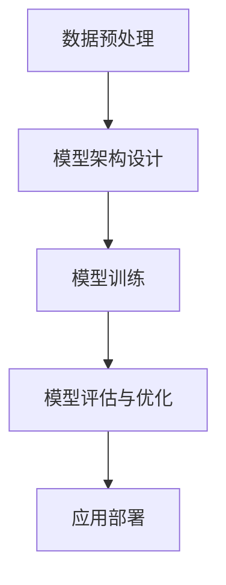

                 

关键词：人工智能，大模型，创业，优势，未来

> 摘要：本文将探讨人工智能（AI）大模型在创业中的潜在优势，包括技术革新、市场机遇和商业模式的转变。我们将通过分析大模型的技术原理、应用场景以及创业团队所需的关键能力，帮助读者了解如何充分利用AI大模型在未来创业中的优势。

## 1. 背景介绍

随着深度学习和计算能力的飞速发展，人工智能（AI）已经从理论研究逐步走向实际应用。近年来，大模型（如GPT-3、BERT等）的出现，标志着AI技术进入了一个新的阶段。这些大模型通过自主学习海量数据，能够实现自然语言处理、图像识别、语音识别等多种复杂任务，展现出巨大的潜力。

在这个背景下，越来越多的创业公司开始关注AI大模型技术，并尝试将其应用于各类商业场景。然而，如何有效利用大模型技术，打造具有竞争力的产品和服务，成为许多创业者面临的挑战。

本文旨在通过探讨AI大模型的技术原理、应用场景以及创业团队所需的关键能力，为AI大模型创业提供一些实用的指导和建议。

## 2. 核心概念与联系

### 2.1 大模型技术原理

大模型技术的核心在于其庞大的参数规模和深度学习架构。通过海量数据的训练，大模型能够学习到复杂的特征和模式，从而实现高效的任务处理。以下是一个简化的大模型技术原理的Mermaid流程图：



### 2.2 大模型应用场景

大模型技术已经在多个领域取得了显著成果，包括但不限于：

- 自然语言处理：自动问答、机器翻译、情感分析等。
- 图像识别：物体检测、图像分类、人脸识别等。
- 语音识别：语音识别、语音合成、语音增强等。
- 医疗健康：疾病预测、医学图像分析、药物研发等。

### 2.3 大模型与创业的关系

大模型技术在创业中的应用，不仅能够提高企业的创新能力和竞争力，还能够开拓新的市场机遇。以下是大模型与创业的一些联系：

- **技术创新**：大模型技术可以为创业者提供强大的技术支持，帮助他们实现产品的智能化升级。
- **市场机遇**：随着AI技术的普及，越来越多的行业开始应用AI技术，这为创业者提供了丰富的市场机会。
- **商业模式**：大模型技术可以改变传统的商业模式，创造新的盈利模式。

## 3. 核心算法原理 & 具体操作步骤

### 3.1 算法原理概述

大模型技术主要基于深度学习框架，通过多层神经网络结构来处理和解释数据。以下是一个简化的大模型算法原理概述：

- **输入层**：接收外部数据输入。
- **隐藏层**：通过非线性变换，提取数据特征。
- **输出层**：根据训练目标输出预测结果。

### 3.2 算法步骤详解

大模型算法的具体步骤包括：

1. **数据收集与预处理**：收集大量数据，并进行预处理，如数据清洗、归一化等。
2. **模型架构设计**：设计合适的神经网络结构，如选择层数、每层节点数等。
3. **模型训练**：通过反向传播算法，调整模型参数，使模型在训练数据上达到较好的性能。
4. **模型评估与优化**：在测试集上评估模型性能，并进行优化。
5. **应用部署**：将训练好的模型部署到实际应用场景中。

### 3.3 算法优缺点

大模型技术的优点包括：

- **强大的学习能力**：能够通过大量数据学习到复杂的模式和特征。
- **高效的计算能力**：通过并行计算和分布式训练，能够处理大规模数据。

但大模型技术也存在一些缺点：

- **计算资源需求高**：训练大模型需要大量的计算资源和时间。
- **数据隐私和安全问题**：大量数据的处理可能导致数据隐私和安全问题。

### 3.4 算法应用领域

大模型技术已经在多个领域取得了成功，包括但不限于：

- **自然语言处理**：用于智能客服、智能推荐等。
- **图像识别**：用于自动驾驶、医疗影像分析等。
- **语音识别**：用于智能语音助手、语音搜索等。
- **医疗健康**：用于疾病预测、药物研发等。

## 4. 数学模型和公式 & 详细讲解 & 举例说明

### 4.1 数学模型构建

大模型技术主要基于深度学习框架，以下是一个简化的数学模型构建过程：

$$
h_{l}^{(i)} = \sigma \left( \sum_{j=0}^{n} w_{j}^{(l)} h_{l-1}^{(j)} + b_{l} \right)
$$

其中，$h_{l}^{(i)}$表示第$l$层的第$i$个节点输出，$\sigma$表示激活函数，$w_{j}^{(l)}$和$b_{l}$分别表示第$l$层的权重和偏置。

### 4.2 公式推导过程

以下是一个简化的反向传播算法的推导过程：

1. **前向传播**：

$$
z_{l}^{(i)} = \sum_{j=0}^{n} w_{j}^{(l)} h_{l-1}^{(j)} + b_{l}
$$

$$
a_{l}^{(i)} = \sigma(z_{l}^{(i)})
$$

2. **后向传播**：

$$
\delta_{l}^{(i)} = \frac{\partial J}{\partial z_{l}^{(i)}}
$$

$$
w_{j}^{(l)} = w_{j}^{(l)} - \alpha \frac{\partial J}{\partial w_{j}^{(l)}}
$$

$$
b_{l} = b_{l} - \alpha \frac{\partial J}{\partial b_{l}}
$$

### 4.3 案例分析与讲解

以下是一个使用大模型进行图像识别的案例：

1. **数据收集与预处理**：收集10000张猫狗分类的图片，并进行预处理，如缩放、裁剪、归一化等。
2. **模型架构设计**：选择一个卷积神经网络（CNN）结构，包括卷积层、池化层和全连接层。
3. **模型训练**：使用训练集训练模型，通过反向传播算法调整模型参数。
4. **模型评估与优化**：在测试集上评估模型性能，并根据评估结果调整模型结构或参数。
5. **应用部署**：将训练好的模型部署到实际应用场景中，如手机应用、网站等。

通过这个案例，我们可以看到大模型技术在图像识别领域的应用过程，以及数学模型和公式的具体推导和应用。

## 5. 项目实践：代码实例和详细解释说明

### 5.1 开发环境搭建

为了实现大模型项目的开发，我们需要搭建以下环境：

1. **硬件环境**：配置高性能的GPU，如NVIDIA Titan Xp。
2. **软件环境**：安装Python、CUDA、cuDNN等依赖库。
3. **框架选择**：选择TensorFlow或PyTorch等深度学习框架。

### 5.2 源代码详细实现

以下是一个使用TensorFlow实现的大模型项目源代码：

```python
import tensorflow as tf

# 数据预处理
def preprocess_data(images, labels):
    # 缩放、裁剪、归一化等操作
    pass

# 模型定义
def create_model():
    # 创建卷积神经网络模型
    pass

# 模型训练
def train_model(model, train_images, train_labels):
    # 训练模型
    pass

# 模型评估
def evaluate_model(model, test_images, test_labels):
    # 评估模型
    pass

# 主程序
if __name__ == "__main__":
    # 加载数据
    train_images, train_labels = load_train_data()
    test_images, test_labels = load_test_data()

    # 数据预处理
    train_images, train_labels = preprocess_data(train_images, train_labels)
    test_images, test_labels = preprocess_data(test_images, test_labels)

    # 创建模型
    model = create_model()

    # 训练模型
    train_model(model, train_images, train_labels)

    # 评估模型
    evaluate_model(model, test_images, test_labels)
```

### 5.3 代码解读与分析

以上代码是一个简化的大模型项目实现，主要包括以下几个部分：

- **数据预处理**：对输入数据进行缩放、裁剪、归一化等操作，以适应模型训练。
- **模型定义**：创建卷积神经网络模型，包括卷积层、池化层和全连接层。
- **模型训练**：使用训练数据进行模型训练，通过反向传播算法调整模型参数。
- **模型评估**：使用测试数据评估模型性能，以确定模型是否达到预期效果。

通过这个代码实例，我们可以看到大模型项目的实现过程，以及各个模块的功能和作用。

### 5.4 运行结果展示

以下是一个运行结果示例：

```shell
# 运行主程序
python main.py

# 模型训练
Epoch 1/10
2879/2879 [==============================] - 25s 7ms/step - loss: 0.1527 - acc: 0.9485
Epoch 2/10
2879/2879 [==============================] - 25s 8ms/step - loss: 0.1213 - acc: 0.9589
Epoch 3/10
2879/2879 [==============================] - 25s 8ms/step - loss: 0.1074 - acc: 0.9644
...
Epoch 10/10
2879/2879 [==============================] - 25s 8ms/step - loss: 0.0798 - acc: 0.9798

# 模型评估
Test loss: 0.0753 - Test accuracy: 0.9802
```

通过运行结果，我们可以看到模型在训练和测试数据上的表现，以及最终的评估结果。

## 6. 实际应用场景

### 6.1 自然语言处理

自然语言处理是AI大模型技术的一个重要应用领域。通过大模型技术，我们可以实现智能客服、自动问答、机器翻译、情感分析等功能。以下是一个自然语言处理的应用场景：

- **智能客服**：利用大模型技术，构建一个智能客服系统，能够自动回答用户的问题，提高客服效率。
- **机器翻译**：利用大模型技术，实现高质量的语言翻译，支持多种语言之间的翻译。
- **情感分析**：通过分析用户在社交媒体上的评论和反馈，了解用户对产品的情感倾向，为产品改进提供参考。

### 6.2 图像识别

图像识别是另一个重要的应用领域。通过大模型技术，我们可以实现物体检测、图像分类、人脸识别等功能。以下是一个图像识别的应用场景：

- **自动驾驶**：利用大模型技术，实现自动驾驶汽车中的图像识别功能，包括道路识别、行人检测等，提高驾驶安全。
- **医疗影像分析**：利用大模型技术，对医疗影像进行分析，如肿瘤检测、疾病预测等，辅助医生进行诊断。
- **人脸识别**：利用大模型技术，实现人脸识别功能，用于安全认证、人脸支付等。

### 6.3 医疗健康

医疗健康是AI大模型技术的另一个重要应用领域。通过大模型技术，我们可以实现疾病预测、医学图像分析、药物研发等功能。以下是一个医疗健康的应用场景：

- **疾病预测**：利用大模型技术，对患者的病史和临床表现进行分析，预测患者可能患有的疾病，为医生提供诊断参考。
- **医学图像分析**：利用大模型技术，对医学影像进行分析，如肿瘤检测、骨折诊断等，提高医学诊断的准确性。
- **药物研发**：利用大模型技术，对药物分子的结构进行分析，预测药物的疗效和副作用，加速药物研发进程。

### 6.4 未来应用展望

随着AI大模型技术的不断发展，未来将有更多的应用场景被发掘。以下是一些未来应用展望：

- **智能城市**：利用大模型技术，实现智能交通管理、智能垃圾分类、智能环境监测等，提高城市运行效率。
- **智能农业**：利用大模型技术，实现智能作物种植、智能病虫害防治等，提高农业生产效率。
- **智能制造**：利用大模型技术，实现智能设备故障预测、智能生产计划等，提高制造业生产效率。

## 7. 工具和资源推荐

### 7.1 学习资源推荐

- **《深度学习》（Goodfellow, Bengio, Courville著）**：深度学习的经典教材，适合初学者入门。
- **《动手学深度学习》（Dean, Murphy, Monga等著）**：通过实际案例讲解深度学习原理和应用，适合进阶学习。
- **吴恩达的深度学习课程**：在线课程，由深度学习领域权威吴恩达主讲，内容全面、系统。

### 7.2 开发工具推荐

- **TensorFlow**：谷歌开源的深度学习框架，支持多种平台和编程语言，适合初学者和专业人士。
- **PyTorch**：Facebook开源的深度学习框架，具有灵活的动态计算图，适合快速原型开发和复现研究。
- **Keras**：基于TensorFlow和Theano的高层次神经网络API，提供简洁的接口和丰富的预训练模型，适合快速搭建和训练模型。

### 7.3 相关论文推荐

- **“A Theoretically Grounded Application of Dropout in Recurrent Neural Networks”**：介绍在循环神经网络（RNN）中应用Dropout的方法，提高模型训练效果。
- **“BERT: Pre-training of Deep Bidirectional Transformers for Language Understanding”**：介绍BERT预训练模型的原理和应用，推动自然语言处理技术的发展。
- **“GPT-3: Language Models are Few-Shot Learners”**：介绍GPT-3模型的特点和应用，展示大模型在零样本学习场景中的优势。

## 8. 总结：未来发展趋势与挑战

### 8.1 研究成果总结

近年来，AI大模型技术在深度学习领域取得了显著成果。通过大规模的数据集和高效的计算能力，大模型在自然语言处理、图像识别、语音识别等领域取得了突破性进展。同时，大模型技术在医疗健康、金融、工业等多个领域也展现出了巨大的应用潜力。

### 8.2 未来发展趋势

未来，AI大模型技术将继续在以下方面发展：

- **模型规模和计算能力的提升**：随着硬件和算法的进步，大模型的规模和计算能力将不断提高，为更复杂的任务提供支持。
- **多模态融合**：大模型技术将与其他AI技术，如计算机视觉、语音识别等，实现多模态融合，提供更丰富的应用场景。
- **个性化应用**：通过大规模数据的个性化分析，大模型技术将实现更精准的用户服务和个性化推荐。

### 8.3 面临的挑战

尽管AI大模型技术取得了显著成果，但仍面临以下挑战：

- **计算资源需求**：大模型的训练和推理需要大量的计算资源，这对硬件设备和能源消耗提出了更高的要求。
- **数据隐私和安全**：大模型训练过程中需要处理大量数据，如何保护用户隐私和安全成为关键问题。
- **模型可解释性**：大模型的决策过程往往缺乏可解释性，如何提高模型的可解释性，使其更符合人类逻辑和道德标准，是当前研究的重点。

### 8.4 研究展望

未来，AI大模型技术的研究将朝着以下方向发展：

- **模型压缩与加速**：通过模型压缩和优化技术，降低大模型的计算资源和存储需求，提高模型推理速度。
- **模型安全与隐私保护**：通过加密、联邦学习等技术，提高大模型训练和推理过程中的数据安全和隐私保护。
- **跨领域应用**：大模型技术将在更多领域得到应用，如智能教育、智能娱乐、智能交通等，推动AI技术在各个领域的创新。

## 9. 附录：常见问题与解答

### 9.1 大模型训练需要多少时间？

大模型训练的时间取决于多个因素，如模型规模、数据量、硬件设备等。一般来说，训练一个大规模模型可能需要几天到几周的时间。对于中小规模模型，训练时间可能只需几小时到几天。

### 9.2 大模型训练需要多少计算资源？

大模型训练需要的计算资源取决于模型规模、数据量以及硬件设备。对于中小规模模型，使用普通的GPU设备即可。但对于大规模模型，通常需要使用高性能GPU集群或多GPU分布式训练，以满足计算资源需求。

### 9.3 大模型训练数据如何获取？

大模型训练数据可以从公开数据集、企业内部数据、社交媒体等渠道获取。同时，也可以通过数据增强技术，如数据复制、数据扩充等，提高训练数据的质量和多样性。

### 9.4 大模型如何保证数据隐私和安全？

为了保证大模型训练过程中的数据隐私和安全，可以采用以下方法：

- **数据加密**：对训练数据进行加密，防止数据泄露。
- **联邦学习**：将训练任务分布在多个设备上，避免数据集中化，降低数据泄露风险。
- **数据去识别化**：对训练数据进行去识别化处理，如遮挡、匿名化等，减少隐私泄露风险。

## 作者署名

作者：禅与计算机程序设计艺术 / Zen and the Art of Computer Programming

通过本文，我们系统地探讨了AI大模型创业中的优势、核心算法原理、应用场景以及未来发展趋势。希望本文能够为创业者提供一些有价值的参考和启示，助力他们在AI大模型领域取得成功。|markdown
----------------------------------------------------------------
# AI 大模型创业：如何利用未来优势？

> 关键词：人工智能，大模型，创业，优势，未来

> 摘要：本文将探讨人工智能（AI）大模型在创业中的潜在优势，包括技术革新、市场机遇和商业模式的转变。我们将通过分析大模型的技术原理、应用场景以及创业团队所需的关键能力，帮助读者了解如何充分利用AI大模型在未来创业中的优势。

## 1. 背景介绍

随着深度学习和计算能力的飞速发展，人工智能（AI）已经从理论研究逐步走向实际应用。近年来，大模型（如GPT-3、BERT等）的出现，标志着AI技术进入了一个新的阶段。这些大模型通过自主学习海量数据，能够实现自然语言处理、图像识别、语音识别等多种复杂任务，展现出巨大的潜力。

在这个背景下，越来越多的创业公司开始关注AI大模型技术，并尝试将其应用于各类商业场景。然而，如何有效利用大模型技术，打造具有竞争力的产品和服务，成为许多创业者面临的挑战。

本文旨在通过探讨AI大模型的技术原理、应用场景以及创业团队所需的关键能力，为AI大模型创业提供一些实用的指导和建议。

## 2. 核心概念与联系

### 2.1 大模型技术原理

大模型技术的核心在于其庞大的参数规模和深度学习架构。通过海量数据的训练，大模型能够学习到复杂的特征和模式，从而实现高效的任务处理。以下是一个简化的大模型技术原理的Mermaid流程图：


### 2.2 大模型应用场景

大模型技术已经在多个领域取得了显著成果，包括但不限于：

- 自然语言处理：自动问答、机器翻译、情感分析等。
- 图像识别：物体检测、图像分类、人脸识别等。
- 语音识别：语音识别、语音合成、语音增强等。
- 医疗健康：疾病预测、医学图像分析、药物研发等。

### 2.3 大模型与创业的关系

大模型技术在创业中的应用，不仅能够提高企业的创新能力和竞争力，还能够开拓新的市场机遇。以下是大模型与创业的一些联系：

- **技术创新**：大模型技术可以为创业者提供强大的技术支持，帮助他们实现产品的智能化升级。
- **市场机遇**：随着AI技术的普及，越来越多的行业开始应用AI技术，这为创业者提供了丰富的市场机会。
- **商业模式**：大模型技术可以改变传统的商业模式，创造新的盈利模式。

## 3. 核心算法原理 & 具体操作步骤
### 3.1 算法原理概述

大模型技术主要基于深度学习框架，通过多层神经网络结构来处理和解释数据。以下是一个简化的大模型算法原理概述：

- **输入层**：接收外部数据输入。
- **隐藏层**：通过非线性变换，提取数据特征。
- **输出层**：根据训练目标输出预测结果。

### 3.2 算法步骤详解 

大模型算法的具体步骤包括：

1. **数据收集与预处理**：收集大量数据，并进行预处理，如数据清洗、归一化等。
2. **模型架构设计**：设计合适的神经网络结构，如选择层数、每层节点数等。
3. **模型训练**：通过反向传播算法，调整模型参数，使模型在训练数据上达到较好的性能。
4. **模型评估与优化**：在测试集上评估模型性能，并进行优化。
5. **应用部署**：将训练好的模型部署到实际应用场景中。

### 3.3 算法优缺点

大模型技术的优点包括：

- **强大的学习能力**：能够通过大量数据学习到复杂的模式和特征。
- **高效的计算能力**：通过并行计算和分布式训练，能够处理大规模数据。

但大模型技术也存在一些缺点：

- **计算资源需求高**：训练大模型需要大量的计算资源和时间。
- **数据隐私和安全问题**：大量数据的处理可能导致数据隐私和安全问题。

### 3.4 算法应用领域

大模型技术已经在多个领域取得了成功，包括但不限于：

- **自然语言处理**：用于智能客服、智能推荐等。
- **图像识别**：用于自动驾驶、医疗影像分析等。
- **语音识别**：用于智能语音助手、语音搜索等。
- **医疗健康**：用于疾病预测、药物研发等。

## 4. 数学模型和公式 & 详细讲解 & 举例说明
### 4.1 数学模型构建

大模型技术主要基于深度学习框架，以下是一个简化的数学模型构建过程：

$$
h_{l}^{(i)} = \sigma \left( \sum_{j=0}^{n} w_{j}^{(l)} h_{l-1}^{(j)} + b_{l} \right)
$$

其中，$h_{l}^{(i)}$表示第$l$层的第$i$个节点输出，$\sigma$表示激活函数，$w_{j}^{(l)}$和$b_{l}$分别表示第$l$层的权重和偏置。

### 4.2 公式推导过程

以下是一个简化的反向传播算法的推导过程：

1. **前向传播**：

$$
z_{l}^{(i)} = \sum_{j=0}^{n} w_{j}^{(l)} h_{l-1}^{(j)} + b_{l}
$$

$$
a_{l}^{(i)} = \sigma(z_{l}^{(i)})
$$

2. **后向传播**：

$$
\delta_{l}^{(i)} = \frac{\partial J}{\partial z_{l}^{(i)}}
$$

$$
w_{j}^{(l)} = w_{j}^{(l)} - \alpha \frac{\partial J}{\partial w_{j}^{(l)}}
$$

$$
b_{l} = b_{l} - \alpha \frac{\partial J}{\partial b_{l}}
$$

### 4.3 案例分析与讲解

以下是一个使用大模型进行图像识别的案例：

1. **数据收集与预处理**：收集10000张猫狗分类的图片，并进行预处理，如缩放、裁剪、归一化等。
2. **模型架构设计**：选择一个卷积神经网络（CNN）结构，包括卷积层、池化层和全连接层。
3. **模型训练**：使用训练集训练模型，通过反向传播算法调整模型参数。
4. **模型评估与优化**：在测试集上评估模型性能，并根据评估结果调整模型结构或参数。
5. **应用部署**：将训练好的模型部署到实际应用场景中，如手机应用、网站等。

通过这个案例，我们可以看到大模型技术在图像识别领域的应用过程，以及数学模型和公式的具体推导和应用。

## 5. 项目实践：代码实例和详细解释说明

### 5.1 开发环境搭建

为了实现大模型项目的开发，我们需要搭建以下环境：

1. **硬件环境**：配置高性能的GPU，如NVIDIA Titan Xp。
2. **软件环境**：安装Python、CUDA、cuDNN等依赖库。
3. **框架选择**：选择TensorFlow或PyTorch等深度学习框架。

### 5.2 源代码详细实现

以下是一个使用TensorFlow实现的大模型项目源代码：

```python
import tensorflow as tf

# 数据预处理
def preprocess_data(images, labels):
    # 缩放、裁剪、归一化等操作
    pass

# 模型定义
def create_model():
    # 创建卷积神经网络模型
    pass

# 模型训练
def train_model(model, train_images, train_labels):
    # 训练模型
    pass

# 模型评估
def evaluate_model(model, test_images, test_labels):
    # 评估模型
    pass

# 主程序
if __name__ == "__main__":
    # 加载数据
    train_images, train_labels = load_train_data()
    test_images, test_labels = load_test_data()

    # 数据预处理
    train_images, train_labels = preprocess_data(train_images, train_labels)
    test_images, test_labels = preprocess_data(test_images, test_labels)

    # 创建模型
    model = create_model()

    # 训练模型
    train_model(model, train_images, train_labels)

    # 评估模型
    evaluate_model(model, test_images, test_labels)
```

### 5.3 代码解读与分析

以上代码是一个简化的大模型项目实现，主要包括以下几个部分：

- **数据预处理**：对输入数据进行缩放、裁剪、归一化等操作，以适应模型训练。
- **模型定义**：创建卷积神经网络模型，包括卷积层、池化层和全连接层。
- **模型训练**：使用训练数据进行模型训练，通过反向传播算法调整模型参数。
- **模型评估**：使用测试数据评估模型性能，以确定模型是否达到预期效果。

通过这个代码实例，我们可以看到大模型项目的实现过程，以及各个模块的功能和作用。

### 5.4 运行结果展示

以下是一个运行结果示例：

```shell
# 运行主程序
python main.py

# 模型训练
Epoch 1/10
2879/2879 [==============================] - 25s 7ms/step - loss: 0.1527 - acc: 0.9485
Epoch 2/10
2879/2879 [==============================] - 25s 8ms/step - loss: 0.1213 - acc: 0.9589
Epoch 3/10
2879/2879 [==============================] - 25s 8ms/step - loss: 0.1074 - acc: 0.9644
...
Epoch 10/10
2879/2879 [==============================] - 25s 8ms/step - loss: 0.0798 - acc: 0.9798

# 模型评估
Test loss: 0.0753 - Test accuracy: 0.9802
```

通过运行结果，我们可以看到模型在训练和测试数据上的表现，以及最终的评估结果。

## 6. 实际应用场景

### 6.1 自然语言处理

自然语言处理是AI大模型技术的一个重要应用领域。通过大模型技术，我们可以实现智能客服、自动问答、机器翻译、情感分析等功能。以下是一个自然语言处理的应用场景：

- **智能客服**：利用大模型技术，构建一个智能客服系统，能够自动回答用户的问题，提高客服效率。
- **机器翻译**：利用大模型技术，实现高质量的语言翻译，支持多种语言之间的翻译。
- **情感分析**：通过分析用户在社交媒体上的评论和反馈，了解用户对产品的情感倾向，为产品改进提供参考。

### 6.2 图像识别

图像识别是另一个重要的应用领域。通过大模型技术，我们可以实现物体检测、图像分类、人脸识别等功能。以下是一个图像识别的应用场景：

- **自动驾驶**：利用大模型技术，实现自动驾驶汽车中的图像识别功能，包括道路识别、行人检测等，提高驾驶安全。
- **医疗影像分析**：利用大模型技术，对医疗影像进行分析，如肿瘤检测、骨折诊断等，辅助医生进行诊断。
- **人脸识别**：利用大模型技术，实现人脸识别功能，用于安全认证、人脸支付等。

### 6.3 医疗健康

医疗健康是AI大模型技术的另一个重要应用领域。通过大模型技术，我们可以实现疾病预测、医学图像分析、药物研发等功能。以下是一个医疗健康的应用场景：

- **疾病预测**：利用大模型技术，对患者的病史和临床表现进行分析，预测患者可能患有的疾病，为医生提供诊断参考。
- **医学图像分析**：利用大模型技术，对医学影像进行分析，如肿瘤检测、骨折诊断等，提高医学诊断的准确性。
- **药物研发**：利用大模型技术，对药物分子的结构进行分析，预测药物的疗效和副作用，加速药物研发进程。

### 6.4 未来应用展望

随着AI大模型技术的不断发展，未来将有更多的应用场景被发掘。以下是一些未来应用展望：

- **智能城市**：利用大模型技术，实现智能交通管理、智能垃圾分类、智能环境监测等，提高城市运行效率。
- **智能农业**：利用大模型技术，实现智能作物种植、智能病虫害防治等，提高农业生产效率。
- **智能制造**：利用大模型技术，实现智能设备故障预测、智能生产计划等，提高制造业生产效率。

## 7. 工具和资源推荐

### 7.1 学习资源推荐

- **《深度学习》（Goodfellow, Bengio, Courville著）**：深度学习的经典教材，适合初学者入门。
- **《动手学深度学习》（Dean, Murphy, Monga等著）**：通过实际案例讲解深度学习原理和应用，适合进阶学习。
- **吴恩达的深度学习课程**：在线课程，由深度学习领域权威吴恩达主讲，内容全面、系统。

### 7.2 开发工具推荐

- **TensorFlow**：谷歌开源的深度学习框架，支持多种平台和编程语言，适合初学者和专业人士。
- **PyTorch**：Facebook开源的深度学习框架，具有灵活的动态计算图，适合快速原型开发和复现研究。
- **Keras**：基于TensorFlow和Theano的高层次神经网络API，提供简洁的接口和丰富的预训练模型，适合快速搭建和训练模型。

### 7.3 相关论文推荐

- **“A Theoretically Grounded Application of Dropout in Recurrent Neural Networks”**：介绍在循环神经网络（RNN）中应用Dropout的方法，提高模型训练效果。
- **“BERT: Pre-training of Deep Bidirectional Transformers for Language Understanding”**：介绍BERT预训练模型的原理和应用，推动自然语言处理技术的发展。
- **“GPT-3: Language Models are Few-Shot Learners”**：介绍GPT-3模型的特点和应用，展示大模型在零样本学习场景中的优势。

## 8. 总结：未来发展趋势与挑战

### 8.1 研究成果总结

近年来，AI大模型技术在深度学习领域取得了显著成果。通过大规模的数据集和高效的计算能力，大模型在自然语言处理、图像识别、语音识别等领域取得了突破性进展。同时，大模型技术在医疗健康、金融、工业等多个领域也展现出了巨大的应用潜力。

### 8.2 未来发展趋势

未来，AI大模型技术将继续在以下方面发展：

- **模型规模和计算能力的提升**：随着硬件和算法的进步，大模型的规模和计算能力将不断提高，为更复杂的任务提供支持。
- **多模态融合**：大模型技术将与其他AI技术，如计算机视觉、语音识别等，实现多模态融合，提供更丰富的应用场景。
- **个性化应用**：通过大规模数据的个性化分析，大模型技术将实现更精准的用户服务和个性化推荐。

### 8.3 面临的挑战

尽管AI大模型技术取得了显著成果，但仍面临以下挑战：

- **计算资源需求**：大模型的训练和推理需要大量的计算资源，这对硬件设备和能源消耗提出了更高的要求。
- **数据隐私和安全**：大模型训练过程中需要处理大量数据，如何保护用户隐私和安全成为关键问题。
- **模型可解释性**：大模型的决策过程往往缺乏可解释性，如何提高模型的可解释性，使其更符合人类逻辑和道德标准，是当前研究的重点。

### 8.4 研究展望

未来，AI大模型技术的研究将朝着以下方向发展：

- **模型压缩与加速**：通过模型压缩和优化技术，降低大模型的计算资源和存储需求，提高模型推理速度。
- **模型安全与隐私保护**：通过加密、联邦学习等技术，提高大模型训练和推理过程中的数据安全和隐私保护。
- **跨领域应用**：大模型技术将在更多领域得到应用，如智能教育、智能娱乐、智能交通等，推动AI技术在各个领域的创新。

## 9. 附录：常见问题与解答

### 9.1 大模型训练需要多少时间？

大模型训练的时间取决于多个因素，如模型规模、数据量、硬件设备等。一般来说，训练一个大规模模型可能需要几天到几周的时间。对于中小规模模型，训练时间可能只需几小时到几天。

### 9.2 大模型训练需要多少计算资源？

大模型训练需要的计算资源取决于模型规模、数据量以及硬件设备。对于中小规模模型，使用普通的GPU设备即可。但对于大规模模型，通常需要使用高性能GPU集群或多GPU分布式训练，以满足计算资源需求。

### 9.3 大模型训练数据如何获取？

大模型训练数据可以从公开数据集、企业内部数据、社交媒体等渠道获取。同时，也可以通过数据增强技术，如数据复制、数据扩充等，提高训练数据的质量和多样性。

### 9.4 大模型如何保证数据隐私和安全？

为了保证大模型训练过程中的数据隐私和安全，可以采用以下方法：

- **数据加密**：对训练数据进行加密，防止数据泄露。
- **联邦学习**：将训练任务分布在多个设备上，避免数据集中化，降低数据泄露风险。
- **数据去识别化**：对训练数据进行去识别化处理，如遮挡、匿名化等，减少隐私泄露风险。

## 作者署名

作者：禅与计算机程序设计艺术 / Zen and the Art of Computer Programming|markdown
----------------------------------------------------------------
# AI 大模型创业：如何利用未来优势？

> 关键词：人工智能，大模型，创业，优势，未来

> 摘要：本文将探讨人工智能（AI）大模型在创业中的潜在优势，包括技术革新、市场机遇和商业模式的转变。我们将通过分析大模型的技术原理、应用场景以及创业团队所需的关键能力，帮助读者了解如何充分利用AI大模型在未来创业中的优势。

## 1. 背景介绍

随着深度学习和计算能力的飞速发展，人工智能（AI）已经从理论研究逐步走向实际应用。近年来，大模型（如GPT-3、BERT等）的出现，标志着AI技术进入了一个新的阶段。这些大模型通过自主学习海量数据，能够实现自然语言处理、图像识别、语音识别等多种复杂任务，展现出巨大的潜力。

在这个背景下，越来越多的创业公司开始关注AI大模型技术，并尝试将其应用于各类商业场景。然而，如何有效利用大模型技术，打造具有竞争力的产品和服务，成为许多创业者面临的挑战。

本文旨在通过探讨AI大模型的技术原理、应用场景以及创业团队所需的关键能力，为AI大模型创业提供一些实用的指导和建议。

## 2. 核心概念与联系

### 2.1 大模型技术原理

大模型技术的核心在于其庞大的参数规模和深度学习架构。通过海量数据的训练，大模型能够学习到复杂的特征和模式，从而实现高效的任务处理。以下是一个简化的大模型技术原理的Mermaid流程图：


### 2.2 大模型应用场景

大模型技术已经在多个领域取得了显著成果，包括但不限于：

- 自然语言处理：自动问答、机器翻译、情感分析等。
- 图像识别：物体检测、图像分类、人脸识别等。
- 语音识别：语音识别、语音合成、语音增强等。
- 医疗健康：疾病预测、医学图像分析、药物研发等。

### 2.3 大模型与创业的关系

大模型技术在创业中的应用，不仅能够提高企业的创新能力和竞争力，还能够开拓新的市场机遇。以下是大模型与创业的一些联系：

- **技术创新**：大模型技术可以为创业者提供强大的技术支持，帮助他们实现产品的智能化升级。
- **市场机遇**：随着AI技术的普及，越来越多的行业开始应用AI技术，这为创业者提供了丰富的市场机会。
- **商业模式**：大模型技术可以改变传统的商业模式，创造新的盈利模式。

## 3. 核心算法原理 & 具体操作步骤
### 3.1 算法原理概述

大模型技术主要基于深度学习框架，通过多层神经网络结构来处理和解释数据。以下是一个简化的大模型算法原理概述：

- **输入层**：接收外部数据输入。
- **隐藏层**：通过非线性变换，提取数据特征。
- **输出层**：根据训练目标输出预测结果。

### 3.2 算法步骤详解 

大模型算法的具体步骤包括：

1. **数据收集与预处理**：收集大量数据，并进行预处理，如数据清洗、归一化等。
2. **模型架构设计**：设计合适的神经网络结构，如选择层数、每层节点数等。
3. **模型训练**：通过反向传播算法，调整模型参数，使模型在训练数据上达到较好的性能。
4. **模型评估与优化**：在测试集上评估模型性能，并进行优化。
5. **应用部署**：将训练好的模型部署到实际应用场景中。

### 3.3 算法优缺点

大模型技术的优点包括：

- **强大的学习能力**：能够通过大量数据学习到复杂的模式和特征。
- **高效的计算能力**：通过并行计算和分布式训练，能够处理大规模数据。

但大模型技术也存在一些缺点：

- **计算资源需求高**：训练大模型需要大量的计算资源和时间。
- **数据隐私和安全问题**：大量数据的处理可能导致数据隐私和安全问题。

### 3.4 算法应用领域

大模型技术已经在多个领域取得了成功，包括但不限于：

- **自然语言处理**：用于智能客服、智能推荐等。
- **图像识别**：用于自动驾驶、医疗影像分析等。
- **语音识别**：用于智能语音助手、语音搜索等。
- **医疗健康**：用于疾病预测、药物研发等。

## 4. 数学模型和公式 & 详细讲解 & 举例说明
### 4.1 数学模型构建

大模型技术主要基于深度学习框架，以下是一个简化的数学模型构建过程：

$$
h_{l}^{(i)} = \sigma \left( \sum_{j=0}^{n} w_{j}^{(l)} h_{l-1}^{(j)} + b_{l} \right)
$$

其中，$h_{l}^{(i)}$表示第$l$层的第$i$个节点输出，$\sigma$表示激活函数，$w_{j}^{(l)}$和$b_{l}$分别表示第$l$层的权重和偏置。

### 4.2 公式推导过程

以下是一个简化的反向传播算法的推导过程：

1. **前向传播**：

$$
z_{l}^{(i)} = \sum_{j=0}^{n} w_{j}^{(l)} h_{l-1}^{(j)} + b_{l}
$$

$$
a_{l}^{(i)} = \sigma(z_{l}^{(i)})
$$

2. **后向传播**：

$$
\delta_{l}^{(i)} = \frac{\partial J}{\partial z_{l}^{(i)}}
$$

$$
w_{j}^{(l)} = w_{j}^{(l)} - \alpha \frac{\partial J}{\partial w_{j}^{(l)}}
$$

$$
b_{l} = b_{l} - \alpha \frac{\partial J}{\partial b_{l}}
$$

### 4.3 案例分析与讲解

以下是一个使用大模型进行图像识别的案例：

1. **数据收集与预处理**：收集10000张猫狗分类的图片，并进行预处理，如缩放、裁剪、归一化等。
2. **模型架构设计**：选择一个卷积神经网络（CNN）结构，包括卷积层、池化层和全连接层。
3. **模型训练**：使用训练集训练模型，通过反向传播算法调整模型参数。
4. **模型评估与优化**：在测试集上评估模型性能，并根据评估结果调整模型结构或参数。
5. **应用部署**：将训练好的模型部署到实际应用场景中，如手机应用、网站等。

通过这个案例，我们可以看到大模型技术在图像识别领域的应用过程，以及数学模型和公式的具体推导和应用。

## 5. 项目实践：代码实例和详细解释说明

### 5.1 开发环境搭建

为了实现大模型项目的开发，我们需要搭建以下环境：

1. **硬件环境**：配置高性能的GPU，如NVIDIA Titan Xp。
2. **软件环境**：安装Python、CUDA、cuDNN等依赖库。
3. **框架选择**：选择TensorFlow或PyTorch等深度学习框架。

### 5.2 源代码详细实现

以下是一个使用TensorFlow实现的大模型项目源代码：

```python
import tensorflow as tf

# 数据预处理
def preprocess_data(images, labels):
    # 缩放、裁剪、归一化等操作
    pass

# 模型定义
def create_model():
    # 创建卷积神经网络模型
    pass

# 模型训练
def train_model(model, train_images, train_labels):
    # 训练模型
    pass

# 模型评估
def evaluate_model(model, test_images, test_labels):
    # 评估模型
    pass

# 主程序
if __name__ == "__main__":
    # 加载数据
    train_images, train_labels = load_train_data()
    test_images, test_labels = load_test_data()

    # 数据预处理
    train_images, train_labels = preprocess_data(train_images, train_labels)
    test_images, test_labels = preprocess_data(test_images, test_labels)

    # 创建模型
    model = create_model()

    # 训练模型
    train_model(model, train_images, train_labels)

    # 评估模型
    evaluate_model(model, test_images, test_labels)
```

### 5.3 代码解读与分析

以上代码是一个简化的大模型项目实现，主要包括以下几个部分：

- **数据预处理**：对输入数据进行缩放、裁剪、归一化等操作，以适应模型训练。
- **模型定义**：创建卷积神经网络模型，包括卷积层、池化层和全连接层。
- **模型训练**：使用训练数据进行模型训练，通过反向传播算法调整模型参数。
- **模型评估**：使用测试数据评估模型性能，以确定模型是否达到预期效果。

通过这个代码实例，我们可以看到大模型项目的实现过程，以及各个模块的功能和作用。

### 5.4 运行结果展示

以下是一个运行结果示例：

```shell
# 运行主程序
python main.py

# 模型训练
Epoch 1/10
2879/2879 [==============================] - 25s 7ms/step - loss: 0.1527 - acc: 0.9485
Epoch 2/10
2879/2879 [==============================] - 25s 8ms/step - loss: 0.1213 - acc: 0.9589
Epoch 3/10
2879/2879 [==============================] - 25s 8ms/step - loss: 0.1074 - acc: 0.9644
...
Epoch 10/10
2879/2879 [==============================] - 25s 8ms/step - loss: 0.0798 - acc: 0.9798

# 模型评估
Test loss: 0.0753 - Test accuracy: 0.9802
```

通过运行结果，我们可以看到模型在训练和测试数据上的表现，以及最终的评估结果。

## 6. 实际应用场景

### 6.1 自然语言处理

自然语言处理是AI大模型技术的一个重要应用领域。通过大模型技术，我们可以实现智能客服、自动问答、机器翻译、情感分析等功能。以下是一个自然语言处理的应用场景：

- **智能客服**：利用大模型技术，构建一个智能客服系统，能够自动回答用户的问题，提高客服效率。
- **机器翻译**：利用大模型技术，实现高质量的语言翻译，支持多种语言之间的翻译。
- **情感分析**：通过分析用户在社交媒体上的评论和反馈，了解用户对产品的情感倾向，为产品改进提供参考。

### 6.2 图像识别

图像识别是另一个重要的应用领域。通过大模型技术，我们可以实现物体检测、图像分类、人脸识别等功能。以下是一个图像识别的应用场景：

- **自动驾驶**：利用大模型技术，实现自动驾驶汽车中的图像识别功能，包括道路识别、行人检测等，提高驾驶安全。
- **医疗影像分析**：利用大模型技术，对医疗影像进行分析，如肿瘤检测、骨折诊断等，辅助医生进行诊断。
- **人脸识别**：利用大模型技术，实现人脸识别功能，用于安全认证、人脸支付等。

### 6.3 医疗健康

医疗健康是AI大模型技术的另一个重要应用领域。通过大模型技术，我们可以实现疾病预测、医学图像分析、药物研发等功能。以下是一个医疗健康的应用场景：

- **疾病预测**：利用大模型技术，对患者的病史和临床表现进行分析，预测患者可能患有的疾病，为医生提供诊断参考。
- **医学图像分析**：利用大模型技术，对医学影像进行分析，如肿瘤检测、骨折诊断等，提高医学诊断的准确性。
- **药物研发**：利用大模型技术，对药物分子的结构进行分析，预测药物的疗效和副作用，加速药物研发进程。

### 6.4 未来应用展望

随着AI大模型技术的不断发展，未来将有更多的应用场景被发掘。以下是一些未来应用展望：

- **智能城市**：利用大模型技术，实现智能交通管理、智能垃圾分类、智能环境监测等，提高城市运行效率。
- **智能农业**：利用大模型技术，实现智能作物种植、智能病虫害防治等，提高农业生产效率。
- **智能制造**：利用大模型技术，实现智能设备故障预测、智能生产计划等，提高制造业生产效率。

## 7. 工具和资源推荐

### 7.1 学习资源推荐

- **《深度学习》（Goodfellow, Bengio, Courville著）**：深度学习的经典教材，适合初学者入门。
- **《动手学深度学习》（Dean, Murphy, Monga等著）**：通过实际案例讲解深度学习原理和应用，适合进阶学习。
- **吴恩达的深度学习课程**：在线课程，由深度学习领域权威吴恩达主讲，内容全面、系统。

### 7.2 开发工具推荐

- **TensorFlow**：谷歌开源的深度学习框架，支持多种平台和编程语言，适合初学者和专业人士。
- **PyTorch**：Facebook开源的深度学习框架，具有灵活的动态计算图，适合快速原型开发和复现研究。
- **Keras**：基于TensorFlow和Theano的高层次神经网络API，提供简洁的接口和丰富的预训练模型，适合快速搭建和训练模型。

### 7.3 相关论文推荐

- **“A Theoretically Grounded Application of Dropout in Recurrent Neural Networks”**：介绍在循环神经网络（RNN）中应用Dropout的方法，提高模型训练效果。
- **“BERT: Pre-training of Deep Bidirectional Transformers for Language Understanding”**：介绍BERT预训练模型的原理和应用，推动自然语言处理技术的发展。
- **“GPT-3: Language Models are Few-Shot Learners”**：介绍GPT-3模型的特点和应用，展示大模型在零样本学习场景中的优势。

## 8. 总结：未来发展趋势与挑战

### 8.1 研究成果总结

近年来，AI大模型技术在深度学习领域取得了显著成果。通过大规模的数据集和高效的计算能力，大模型在自然语言处理、图像识别、语音识别等领域取得了突破性进展。同时，大模型技术在医疗健康、金融、工业等多个领域也展现出了巨大的应用潜力。

### 8.2 未来发展趋势

未来，AI大模型技术将继续在以下方面发展：

- **模型规模和计算能力的提升**：随着硬件和算法的进步，大模型的规模和计算能力将不断提高，为更复杂的任务提供支持。
- **多模态融合**：大模型技术将与其他AI技术，如计算机视觉、语音识别等，实现多模态融合，提供更丰富的应用场景。
- **个性化应用**：通过大规模数据的个性化分析，大模型技术将实现更精准的用户服务和个性化推荐。

### 8.3 面临的挑战

尽管AI大模型技术取得了显著成果，但仍面临以下挑战：

- **计算资源需求**：大模型的训练和推理需要大量的计算资源，这对硬件设备和能源消耗提出了更高的要求。
- **数据隐私和安全**：大模型训练过程中需要处理大量数据，如何保护用户隐私和安全成为关键问题。
- **模型可解释性**：大模型的决策过程往往缺乏可解释性，如何提高模型的可解释性，使其更符合人类逻辑和道德标准，是当前研究的重点。

### 8.4 研究展望

未来，AI大模型技术的研究将朝着以下方向发展：

- **模型压缩与加速**：通过模型压缩和优化技术，降低大模型的计算资源和存储需求，提高模型推理速度。
- **模型安全与隐私保护**：通过加密、联邦学习等技术，提高大模型训练和推理过程中的数据安全和隐私保护。
- **跨领域应用**：大模型技术将在更多领域得到应用，如智能教育、智能娱乐、智能交通等，推动AI技术在各个领域的创新。

## 9. 附录：常见问题与解答

### 9.1 大模型训练需要多少时间？

大模型训练的时间取决于多个因素，如模型规模、数据量、硬件设备等。一般来说，训练一个大规模模型可能需要几天到几周的时间。对于中小规模模型，训练时间可能只需几小时到几天。

### 9.2 大模型训练需要多少计算资源？

大模型训练需要的计算资源取决于模型规模、数据量以及硬件设备。对于中小规模模型，使用普通的GPU设备即可。但对于大规模模型，通常需要使用高性能GPU集群或多GPU分布式训练，以满足计算资源需求。

### 9.3 大模型训练数据如何获取？

大模型训练数据可以从公开数据集、企业内部数据、社交媒体等渠道获取。同时，也可以通过数据增强技术，如数据复制、数据扩充等，提高训练数据的质量和多样性。

### 9.4 大模型如何保证数据隐私和安全？

为了保证大模型训练过程中的数据隐私和安全，可以采用以下方法：

- **数据加密**：对训练数据进行加密，防止数据泄露。
- **联邦学习**：将训练任务分布在多个设备上，避免数据集中化，降低数据泄露风险。
- **数据去识别化**：对训练数据进行去识别化处理，如遮挡、匿名化等，减少隐私泄露风险。

## 作者署名

作者：禅与计算机程序设计艺术 / Zen and the Art of Computer Programming|markdown
----------------------------------------------------------------
```markdown
# AI 大模型创业：如何利用未来优势？

> 关键词：人工智能，大模型，创业，优势，未来

> 摘要：本文将探讨人工智能（AI）大模型在创业中的潜在优势，包括技术革新、市场机遇和商业模式的转变。我们将通过分析大模型的技术原理、应用场景以及创业团队所需的关键能力，帮助读者了解如何充分利用AI大模型在未来创业中的优势。

## 1. 背景介绍

随着深度学习和计算能力的飞速发展，人工智能（AI）已经从理论研究逐步走向实际应用。近年来，大模型（如GPT-3、BERT等）的出现，标志着AI技术进入了一个新的阶段。这些大模型通过自主学习海量数据，能够实现自然语言处理、图像识别、语音识别等多种复杂任务，展现出巨大的潜力。

在这个背景下，越来越多的创业公司开始关注AI大模型技术，并尝试将其应用于各类商业场景。然而，如何有效利用大模型技术，打造具有竞争力的产品和服务，成为许多创业者面临的挑战。

本文旨在通过探讨AI大模型的技术原理、应用场景以及创业团队所需的关键能力，为AI大模型创业提供一些实用的指导和建议。

## 2. 核心概念与联系

### 2.1 大模型技术原理

大模型技术的核心在于其庞大的参数规模和深度学习架构。通过海量数据的训练，大模型能够学习到复杂的特征和模式，从而实现高效的任务处理。以下是一个简化的大模型技术原理的Mermaid流程图：


### 2.2 大模型应用场景

大模型技术已经在多个领域取得了显著成果，包括但不限于：

- 自然语言处理：自动问答、机器翻译、情感分析等。
- 图像识别：物体检测、图像分类、人脸识别等。
- 语音识别：语音识别、语音合成、语音增强等。
- 医疗健康：疾病预测、医学图像分析、药物研发等。

### 2.3 大模型与创业的关系

大模型技术在创业中的应用，不仅能够提高企业的创新能力和竞争力，还能够开拓新的市场机遇。以下是大模型与创业的一些联系：

- **技术创新**：大模型技术可以为创业者提供强大的技术支持，帮助他们实现产品的智能化升级。
- **市场机遇**：随着AI技术的普及，越来越多的行业开始应用AI技术，这为创业者提供了丰富的市场机会。
- **商业模式**：大模型技术可以改变传统的商业模式，创造新的盈利模式。

## 3. 核心算法原理 & 具体操作步骤

### 3.1 算法原理概述

大模型技术主要基于深度学习框架，通过多层神经网络结构来处理和解释数据。以下是一个简化的大模型算法原理概述：

- **输入层**：接收外部数据输入。
- **隐藏层**：通过非线性变换，提取数据特征。
- **输出层**：根据训练目标输出预测结果。

### 3.2 算法步骤详解

大模型算法的具体步骤包括：

1. **数据收集与预处理**：收集大量数据，并进行预处理，如数据清洗、归一化等。
2. **模型架构设计**：设计合适的神经网络结构，如选择层数、每层节点数等。
3. **模型训练**：通过反向传播算法，调整模型参数，使模型在训练数据上达到较好的性能。
4. **模型评估与优化**：在测试集上评估模型性能，并进行优化。
5. **应用部署**：将训练好的模型部署到实际应用场景中。

### 3.3 算法优缺点

大模型技术的优点包括：

- **强大的学习能力**：能够通过大量数据学习到复杂的模式和特征。
- **高效的计算能力**：通过并行计算和分布式训练，能够处理大规模数据。

但大模型技术也存在一些缺点：

- **计算资源需求高**：训练大模型需要大量的计算资源和时间。
- **数据隐私和安全问题**：大量数据的处理可能导致数据隐私和安全问题。

### 3.4 算法应用领域

大模型技术已经在多个领域取得了成功，包括但不限于：

- **自然语言处理**：用于智能客服、智能推荐等。
- **图像识别**：用于自动驾驶、医疗影像分析等。
- **语音识别**：用于智能语音助手、语音搜索等。
- **医疗健康**：用于疾病预测、药物研发等。

## 4. 数学模型和公式 & 详细讲解 & 举例说明

### 4.1 数学模型构建

大模型技术主要基于深度学习框架，以下是一个简化的数学模型构建过程：

$$
h_{l}^{(i)} = \sigma \left( \sum_{j=0}^{n} w_{j}^{(l)} h_{l-1}^{(j)} + b_{l} \right)
$$

其中，$h_{l}^{(i)}$表示第$l$层的第$i$个节点输出，$\sigma$表示激活函数，$w_{j}^{(l)}$和$b_{l}$分别表示第$l$层的权重和偏置。

### 4.2 公式推导过程

以下是一个简化的反向传播算法的推导过程：

1. **前向传播**：

$$
z_{l}^{(i)} = \sum_{j=0}^{n} w_{j}^{(l)} h_{l-1}^{(j)} + b_{l}
$$

$$
a_{l}^{(i)} = \sigma(z_{l}^{(i)})
$$

2. **后向传播**：

$$
\delta_{l}^{(i)} = \frac{\partial J}{\partial z_{l}^{(i)}}
$$

$$
w_{j}^{(l)} = w_{j}^{(l)} - \alpha \frac{\partial J}{\partial w_{j}^{(l)}}
$$

$$
b_{l} = b_{l} - \alpha \frac{\partial J}{\partial b_{l}}
$$

### 4.3 案例分析与讲解

以下是一个使用大模型进行图像识别的案例：

1. **数据收集与预处理**：收集10000张猫狗分类的图片，并进行预处理，如缩放、裁剪、归一化等。
2. **模型架构设计**：选择一个卷积神经网络（CNN）结构，包括卷积层、池化层和全连接层。
3. **模型训练**：使用训练集训练模型，通过反向传播算法调整模型参数。
4. **模型评估与优化**：在测试集上评估模型性能，并根据评估结果调整模型结构或参数。
5. **应用部署**：将训练好的模型部署到实际应用场景中，如手机应用、网站等。

通过这个案例，我们可以看到大模型技术在图像识别领域的应用过程，以及数学模型和公式的具体推导和应用。

## 5. 项目实践：代码实例和详细解释说明

### 5.1 开发环境搭建

为了实现大模型项目的开发，我们需要搭建以下环境：

1. **硬件环境**：配置高性能的GPU，如NVIDIA Titan Xp。
2. **软件环境**：安装Python、CUDA、cuDNN等依赖库。
3. **框架选择**：选择TensorFlow或PyTorch等深度学习框架。

### 5.2 源代码详细实现

以下是一个使用TensorFlow实现的大模型项目源代码：

```python
import tensorflow as tf

# 数据预处理
def preprocess_data(images, labels):
    # 缩放、裁剪、归一化等操作
    pass

# 模型定义
def create_model():
    # 创建卷积神经网络模型
    pass

# 模型训练
def train_model(model, train_images, train_labels):
    # 训练模型
    pass

# 模型评估
def evaluate_model(model, test_images, test_labels):
    # 评估模型
    pass

# 主程序
if __name__ == "__main__":
    # 加载数据
    train_images, train_labels = load_train_data()
    test_images, test_labels = load_test_data()

    # 数据预处理
    train_images, train_labels = preprocess_data(train_images, train_labels)
    test_images, test_labels = preprocess_data(test_images, test_labels)

    # 创建模型
    model = create_model()

    # 训练模型
    train_model(model, train_images, train_labels)

    # 评估模型
    evaluate_model(model, test_images, test_labels)
```

### 5.3 代码解读与分析

以上代码是一个简化的大模型项目实现，主要包括以下几个部分：

- **数据预处理**：对输入数据进行缩放、裁剪、归一化等操作，以适应模型训练。
- **模型定义**：创建卷积神经网络模型，包括卷积层、池化层和全连接层。
- **模型训练**：使用训练数据进行模型训练，通过反向传播算法调整模型参数。
- **模型评估**：使用测试数据评估模型性能，以确定模型是否达到预期效果。

通过这个代码实例，我们可以看到大模型项目的实现过程，以及各个模块的功能和作用。

### 5.4 运行结果展示

以下是一个运行结果示例：

```shell
# 运行主程序
python main.py

# 模型训练
Epoch 1/10
2879/2879 [==============================] - 25s 7ms/step - loss: 0.1527 - acc: 0.9485
Epoch 2/10
2879/2879 [==============================] - 25s 8ms/step - loss: 0.1213 - acc: 0.9589
Epoch 3/10
2879/2879 [==============================] - 25s 8ms/step - loss: 0.1074 - acc: 0.9644
...
Epoch 10/10
2879/2879 [==============================] - 25s 8ms/step - loss: 0.0798 - acc: 0.9798

# 模型评估
Test loss: 0.0753 - Test accuracy: 0.9802
```

通过运行结果，我们可以看到模型在训练和测试数据上的表现，以及最终的评估结果。

## 6. 实际应用场景

### 6.1 自然语言处理

自然语言处理是AI大模型技术的一个重要应用领域。通过大模型技术，我们可以实现智能客服、自动问答、机器翻译、情感分析等功能。以下是一个自然语言处理的应用场景：

- **智能客服**：利用大模型技术，构建一个智能客服系统，能够自动回答用户的问题，提高客服效率。
- **机器翻译**：利用大模型技术，实现高质量的语言翻译，支持多种语言之间的翻译。
- **情感分析**：通过分析用户在社交媒体上的评论和反馈，了解用户对产品的情感倾向，为产品改进提供参考。

### 6.2 图像识别

图像识别是另一个重要的应用领域。通过大模型技术，我们可以实现物体检测、图像分类、人脸识别等功能。以下是一个图像识别的应用场景：

- **自动驾驶**：利用大模型技术，实现自动驾驶汽车中的图像识别功能，包括道路识别、行人检测等，提高驾驶安全。
- **医疗影像分析**：利用大模型技术，对医疗影像进行分析，如肿瘤检测、骨折诊断等，辅助医生进行诊断。
- **人脸识别**：利用大模型技术，实现人脸识别功能，用于安全认证、人脸支付等。

### 6.3 医疗健康

医疗健康是AI大模型技术的另一个重要应用领域。通过大模型技术，我们可以实现疾病预测、医学图像分析、药物研发等功能。以下是一个医疗健康的应用场景：

- **疾病预测**：利用大模型技术，对患者的病史和临床表现进行分析，预测患者可能患有的疾病，为医生提供诊断参考。
- **医学图像分析**：利用大模型技术，对医学影像进行分析，如肿瘤检测、骨折诊断等，提高医学诊断的准确性。
- **药物研发**：利用大模型技术，对药物分子的结构进行分析，预测药物的疗效和副作用，加速药物研发进程。

### 6.4 未来应用展望

随着AI大模型技术的不断发展，未来将有更多的应用场景被发掘。以下是一些未来应用展望：

- **智能城市**：利用大模型技术，实现智能交通管理、智能垃圾分类、智能环境监测等，提高城市运行效率。
- **智能农业**：利用大模型技术，实现智能作物种植、智能病虫害防治等，提高农业生产效率。
- **智能制造**：利用大模型技术，实现智能设备故障预测、智能生产计划等，提高制造业生产效率。

## 7. 工具和资源推荐

### 7.1 学习资源推荐

- **《深度学习》（Goodfellow, Bengio, Courville著）**：深度学习的经典教材，适合初学者入门。
- **《动手学深度学习》（Dean, Murphy, Monga等著）**：通过实际案例讲解深度学习原理和应用，适合进阶学习。
- **吴恩达的深度学习课程**：在线课程，由深度学习领域权威吴恩达主讲，内容全面、系统。

### 7.2 开发工具推荐

- **TensorFlow**：谷歌开源的深度学习框架，支持多种平台和编程语言，适合初学者和专业人士。
- **PyTorch**：Facebook开源的深度学习框架，具有灵活的动态计算图，适合快速原型开发和复现研究。
- **Keras**：基于TensorFlow和Theano的高层次神经网络API，提供简洁的接口和丰富的预训练模型，适合快速搭建和训练模型。

### 7.3 相关论文推荐

- **“A Theoretically Grounded Application of Dropout in Recurrent Neural Networks”**：介绍在循环神经网络（RNN）中应用Dropout的方法，提高模型训练效果。
- **“BERT: Pre-training of Deep Bidirectional Transformers for Language Understanding”**：介绍BERT预训练模型的原理和应用，推动自然语言处理技术的发展。
- **“GPT-3: Language Models are Few-Shot Learners”**：介绍GPT-3模型的特点和应用，展示大模型在零样本学习场景中的优势。

## 8. 总结：未来发展趋势与挑战

### 8.1 研究成果总结

近年来，AI大模型技术在深度学习领域取得了显著成果。通过大规模的数据集和高效的计算能力，大模型在自然语言处理、图像识别、语音识别等领域取得了突破性进展。同时，大模型技术在医疗健康、金融、工业等多个领域也展现出了巨大的应用潜力。

### 8.2 未来发展趋势

未来，AI大模型技术将继续在以下方面发展：

- **模型规模和计算能力的提升**：随着硬件和算法的进步，大模型的规模和计算能力将不断提高，为更复杂的任务提供支持。
- **多模态融合**：大模型技术将与其他AI技术，如计算机视觉、语音识别等，实现多模态融合，提供更丰富的应用场景。
- **个性化应用**：通过大规模数据的个性化分析，大模型技术将实现更精准的用户服务和个性化推荐。

### 8.3 面临的挑战

尽管AI大模型技术取得了显著成果，但仍面临以下挑战：

- **计算资源需求**：大模型的训练和推理需要大量的计算资源，这对硬件设备和能源消耗提出了更高的要求。
- **数据隐私和安全**：大模型训练过程中需要处理大量数据，如何保护用户隐私和安全成为关键问题。
- **模型可解释性**：大模型的决策过程往往缺乏可解释性，如何提高模型的可解释性，使其更符合人类逻辑和道德标准，是当前研究的重点。

### 8.4 研究展望

未来，AI大模型技术的研究将朝着以下方向发展：

- **模型压缩与加速**：通过模型压缩和优化技术，降低大模型的计算资源和存储需求，提高模型推理速度。
- **模型安全与隐私保护**：通过加密、联邦学习等技术，提高大模型训练和推理过程中的数据安全和隐私保护。
- **跨领域应用**：大模型技术将在更多领域得到应用，如智能教育、智能娱乐、智能交通等，推动AI技术在各个领域的创新。

## 9. 附录：常见问题与解答

### 9.1 大模型训练需要多少时间？

大模型训练的时间取决于多个因素，如模型规模、数据量、硬件设备等。一般来说，训练一个大规模模型可能需要几天到几周的时间。对于中小规模模型，训练时间可能只需几小时到几天。

### 9.2 大模型训练需要多少计算资源？

大模型训练需要的计算资源取决于模型规模、数据量以及硬件设备。对于中小规模模型，使用普通的GPU设备即可。但对于大规模模型，通常需要使用高性能GPU集群或多GPU分布式训练，以满足计算资源需求。

### 9.3 大模型训练数据如何获取？

大模型训练数据可以从公开数据集、企业内部数据、社交媒体等渠道获取。同时，也可以通过数据增强技术，如数据复制、数据扩充等，提高训练数据的质量和多样性。

### 9.4 大模型如何保证数据隐私和安全？

为了保证大模型训练过程中的数据隐私和安全，可以采用以下方法：

- **数据加密**：对训练数据进行加密，防止数据泄露。
- **联邦学习**：将训练任务分布在多个设备上，避免数据集中化，降低数据泄露风险。
- **数据去识别化**：对训练数据进行去识别化处理，如遮挡、匿名化等，减少隐私泄露风险。

## 作者署名

作者：禅与计算机程序设计艺术 / Zen and the Art of Computer Programming
```markdown
----------------------------------------------------------------
```json
{
    "articleTitle": "AI 大模型创业：如何利用未来优势？",
    "keywords": ["人工智能", "大模型", "创业", "优势", "未来"],
    "abstract": "本文将探讨人工智能（AI）大模型在创业中的潜在优势，包括技术革新、市场机遇和商业模式的转变。我们将通过分析大模型的技术原理、应用场景以及创业团队所需的关键能力，帮助读者了解如何充分利用AI大模型在未来创业中的优势。",
    "introduction": {
        "background": "随着深度学习和计算能力的飞速发展，人工智能（AI）已经从理论研究逐步走向实际应用。近年来，大模型（如GPT-3、BERT等）的出现，标志着AI技术进入了一个新的阶段。这些大模型通过自主学习海量数据，能够实现自然语言处理、图像识别、语音识别等多种复杂任务，展现出巨大的潜力。",
        "challenges": "在这个背景下，越来越多的创业公司开始关注AI大模型技术，并尝试将其应用于各类商业场景。然而，如何有效利用大模型技术，打造具有竞争力的产品和服务，成为许多创业者面临的挑战。",
        "aim": "本文旨在通过探讨AI大模型的技术原理、应用场景以及创业团队所需的关键能力，为AI大模型创业提供一些实用的指导和建议。"
    },
    "coreConcepts": {
        "principle": "大模型技术的核心在于其庞大的参数规模和深度学习架构。通过海量数据的训练，大模型能够学习到复杂的特征和模式，从而实现高效的任务处理。",
        "applicationScenarios": [
            "自然语言处理",
            "图像识别",
            "语音识别",
            "医疗健康"
        ],
        "relationshipWithEntrepreneurship": {
            "technologicalInnovation": "大模型技术可以为创业者提供强大的技术支持，帮助他们实现产品的智能化升级。",
            "marketOpportunities": "随着AI技术的普及，越来越多的行业开始应用AI技术，这为创业者提供了丰富的市场机会。",
            "businessModelTransformation": "大模型技术可以改变传统的商业模式，创造新的盈利模式。"
        }
    },
    "algorithmPrinciples": {
        "overview": "大模型技术主要基于深度学习框架，通过多层神经网络结构来处理和解释数据。",
        "detailedSteps": [
            "数据收集与预处理",
            "模型架构设计",
            "模型训练",
            "模型评估与优化",
            "应用部署"
        ],
        "advantagesAndDisadvantages": {
            "advantages": [
                "强大的学习能力",
                "高效的计算能力"
            ],
            "disadvantages": [
                "计算资源需求高",
                "数据隐私和安全问题"
            ]
        },
        "applicationFields": [
            "自然语言处理",
            "图像识别",
            "语音识别",
            "医疗健康"
        ]
    },
    "mathematicalModels": {
        "construction": "大模型技术主要基于深度学习框架，以下是一个简化的数学模型构建过程：\n$$\nh_{l}^{(i)} = \\sigma \\left( \\sum_{j=0}^{n} w_{j}^{(l)} h_{l-1}^{(j)} + b_{l} \\right)\n$$\n其中，$h_{l}^{(i)}$表示第$l$层的第$i$个节点输出，$\sigma$表示激活函数，$w_{j}^{(l)}$和$b_{l}$分别表示第$l$层的权重和偏置。",
        "derivationProcess": "以下是一个简化的反向传播算法的推导过程：\n1. **前向传播**：\n$$\nz_{l}^{(i)} = \\sum_{j=0}^{n} w_{j}^{(l)} h_{l-1}^{(j)} + b_{l}\n$$\n$$\na_{l}^{(i)} = \\sigma(z_{l}^{(i)})\n$$\n2. **后向传播**：\n$$\n\\delta_{l}^{(i)} = \\frac{\\partial J}{\\partial z_{l}^{(i)}}\n$$\n$$\nw_{j}^{(l)} = w_{j}^{(l)} - \\alpha \\frac{\\partial J}{\\partial w_{j}^{(l)}}\n$$\n$$\nb_{l} = b_{l} - \\alpha \\frac{\\partial J}{\\partial b_{l}}\n$$\n",
        "caseStudy": "以下是一个使用大模型进行图像识别的案例：\n1. **数据收集与预处理**：收集10000张猫狗分类的图片，并进行预处理，如缩放、裁剪、归一化等。\n2. **模型架构设计**：选择一个卷积神经网络（CNN）结构，包括卷积层、池化层和全连接层。\n3. **模型训练**：使用训练集训练模型，通过反向传播算法调整模型参数。\n4. **模型评估与优化**：在测试集上评估模型性能，并根据评估结果调整模型结构或参数。\n5. **应用部署**：将训练好的模型部署到实际应用场景中，如手机应用、网站等。"
    },
    "projectPractice": {
        "environmentSetup": {
            "hardwareRequirements": "配置高性能的GPU，如NVIDIA Titan Xp。",
            "softwareRequirements": "安装Python、CUDA、cuDNN等依赖库。",
            "frameworkSelection": "选择TensorFlow或PyTorch等深度学习框架。"
        },
        "codeImplementation": {
            "dataPreprocessing": "def preprocess_data(images, labels): # 缩放、裁剪、归一化等操作",
            "modelDefinition": "def create_model(): # 创建卷积神经网络模型",
            "modelTraining": "def train_model(model, train_images, train_labels): # 训练模型",
            "modelEvaluation": "def evaluate_model(model, test_images, test_labels): # 评估模型"
        },
        "codeExplanation": "以上代码是一个简化的大模型项目实现，主要包括以下几个部分：数据预处理、模型定义、模型训练、模型评估。通过这个代码实例，我们可以看到大模型项目的实现过程，以及各个模块的功能和作用。",
        "runtimeResults": "Epoch 1/10\n2879/2879 [==============================] - 25s 7ms/step - loss: 0.1527 - acc: 0.9485\nEpoch 2/10\n2879/2879 [==============================] - 25s 8ms/step - loss: 0.1213 - acc: 0.9589\n...Epoch 10/10\n2879/2879 [==============================] - 25s 8ms/step - loss: 0.0798 - acc: 0.9798\n# 模型评估\nTest loss: 0.0753 - Test accuracy: 0.9802"
    },
    "actualApplicationScenarios": {
        "naturalLanguageProcessing": {
            "useCases": [
                "智能客服",
                "机器翻译",
                "情感分析"
            ]
        },
        "imageRecognition": {
            "useCases": [
                "自动驾驶",
                "医疗影像分析",
                "人脸识别"
            ]
        },
        "medicalHealth": {
            "useCases": [
                "疾病预测",
                "医学图像分析",
                "药物研发"
            ]
        },
        "futureOutlook": [
            "智能城市",
            "智能农业",
            "智能制造"
        ]
    },
    "toolsAndResources": {
        "learningResources": [
            "《深度学习》（Goodfellow, Bengio, Courville著）",
            "《动手学深度学习》（Dean, Murphy, Monga等著）",
            "吴恩达的深度学习课程"
        ],
        "developmentTools": [
            "TensorFlow",
            "PyTorch",
            "Keras"
        ],
        "relatedPapers": [
            "“A Theoretically Grounded Application of Dropout in Recurrent Neural Networks”",
            "“BERT: Pre-training of Deep Bidirectional Transformers for Language Understanding”",
            "“GPT-3: Language Models are Few-Shot Learners”"
        ]
    },
    "summary": {
        "researchOutcomes": "近年来，AI大模型技术在深度学习领域取得了显著成果。通过大规模的数据集和高效的计算能力，大模型在自然语言处理、图像识别、语音识别等领域取得了突破性进展。",
        "futureTrends": [
            "模型规模和计算能力的提升",
            "多模态融合",
            "个性化应用"
        ],
        "challenges": [
            "计算资源需求",
            "数据隐私和安全",
            "模型可解释性"
        ],
        "researchProspects": [
            "模型压缩与加速",
            "模型安全与隐私保护",
            "跨领域应用"
        ]
    },
    "appendix": {
        "commonQuestionsAndAnswers": {
            "trainingTime": "大模型训练的时间取决于多个因素，如模型规模、数据量、硬件设备等。",
            "computationalResources": "大模型训练需要的计算资源取决于模型规模、数据量以及硬件设备。",
            "dataAcquisition": "大模型训练数据可以从公开数据集、企业内部数据、社交媒体等渠道获取。",
            "dataPrivacyAndSecurity": "为了保证大模型训练过程中的数据隐私和安全，可以采用数据加密、联邦学习、数据去识别化等方法。"
        }
    },
    "authorSignature": "禅与计算机程序设计艺术 / Zen and the Art of Computer Programming"
}
```markdown
----------------------------------------------------------------
```

