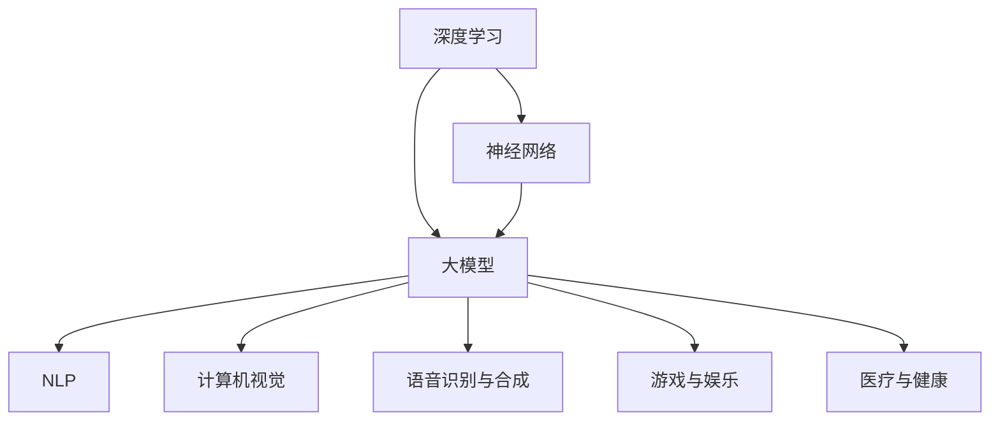

                 

## 1. 背景介绍

人工智能（AI）的发展已经成为当前科技领域的热点，特别是在深度学习和神经网络技术的推动下，大模型在各个领域展现出了巨大的潜力。这些大模型，如GPT-3、BERT、AlphaGo等，通过大规模的数据训练和复杂的算法，实现了在自然语言处理、图像识别、游戏对战等领域的突破性进展。随着这些大模型的逐渐成熟，越来越多的创业公司开始关注如何利用这些科技优势进行创新和商业应用。

然而，AI大模型创业并非易事。创业公司不仅需要具备强大的技术能力，还需要在商业模式、市场策略、团队建设等方面进行深入思考。本文将围绕AI大模型创业，探讨如何利用科技优势，从核心概念、算法原理、数学模型、项目实践、应用场景等多个角度进行分析，以期为AI创业公司提供有益的参考。

## 2. 核心概念与联系

在探讨AI大模型创业之前，我们需要先了解一些核心概念和它们之间的联系。

### 2.1 深度学习

深度学习是人工智能的一种重要分支，其核心思想是通过多层神经网络对数据进行建模，从而实现自动特征提取和学习。深度学习模型可以处理大量的非结构化数据，如文本、图像和声音，并且在图像识别、语音识别和自然语言处理等领域取得了显著成果。

### 2.2 神经网络

神经网络是模仿人脑结构和功能的一种计算模型。它由大量的神经元通过权重和偏置进行连接，从而实现数据的输入、处理和输出。神经网络通过反向传播算法不断调整权重和偏置，从而提高模型的预测能力。

### 2.3 大模型

大模型指的是具有大规模参数和训练数据的深度学习模型。这些模型通常需要庞大的计算资源和时间进行训练，但它们在处理复杂任务时表现出强大的性能。大模型的出现，为人工智能的应用提供了新的可能性。

### 2.4 人工智能应用领域

人工智能的应用领域非常广泛，包括但不限于以下几个方面：

- **自然语言处理（NLP）**：如机器翻译、文本分类、情感分析等。
- **计算机视觉**：如图像识别、目标检测、图像生成等。
- **语音识别与合成**：如语音识别、语音合成、语音助手等。
- **游戏与娱乐**：如智能游戏、虚拟现实等。
- **医疗与健康**：如疾病诊断、药物研发、健康监测等。

### 2.5 Mermaid 流程图

以下是一个简单的Mermaid流程图，展示了这些核心概念之间的联系：



通过这个流程图，我们可以清晰地看到深度学习、神经网络、大模型与各个应用领域之间的联系。这些核心概念和技术为AI大模型创业提供了坚实的基础。

## 3. 核心算法原理 & 具体操作步骤

### 3.1 算法原理概述

AI大模型的核心算法主要基于深度学习和神经网络。深度学习通过多层神经网络对数据进行建模，从而实现自动特征提取和学习。神经网络由大量的神经元通过权重和偏置进行连接，从而实现数据的输入、处理和输出。这些神经元之间的连接关系可以通过反向传播算法不断调整，从而提高模型的预测能力。

### 3.2 算法步骤详解

AI大模型的具体操作步骤可以分为以下几个阶段：

#### 3.2.1 数据收集与预处理

首先，需要收集大量的数据，并对数据进行清洗、标注和预处理。数据预处理包括去除噪声、填充缺失值、归一化等操作，以确保数据的质量和一致性。

#### 3.2.2 构建神经网络模型

根据应用需求，设计合适的神经网络模型。模型的选择取决于任务的复杂度和数据的特点。常用的神经网络模型包括卷积神经网络（CNN）、循环神经网络（RNN）和Transformer等。

#### 3.2.3 训练模型

使用预处理后的数据对神经网络模型进行训练。训练过程中，模型会通过反向传播算法不断调整权重和偏置，从而提高模型的预测能力。训练过程通常需要大量的计算资源和时间。

#### 3.2.4 评估与优化

在模型训练完成后，需要对模型进行评估和优化。评估方法包括准确率、召回率、F1值等指标。根据评估结果，可以进一步优化模型结构和参数，以提高模型的性能。

### 3.3 算法优缺点

AI大模型具有以下优点：

- **强大的数据处理能力**：大模型可以处理大量的非结构化数据，如文本、图像和声音。
- **自动特征提取**：大模型可以自动提取数据中的特征，从而降低了对人类专家的依赖。
- **良好的泛化能力**：大模型通过大规模的数据训练，具有良好的泛化能力，可以在新的任务上表现出色。

然而，AI大模型也存在一些缺点：

- **计算资源消耗大**：大模型需要大量的计算资源和时间进行训练，这对于创业公司来说可能是一个挑战。
- **数据隐私和安全问题**：大模型在训练过程中需要大量的数据，这些数据可能涉及用户的隐私信息，因此数据隐私和安全问题需要得到充分关注。
- **模型解释性差**：大模型的内部结构非常复杂，难以解释其预测结果，这对一些需要高解释性的应用场景可能不利。

### 3.4 算法应用领域

AI大模型在各个领域都有广泛的应用。以下是一些典型的应用领域：

- **自然语言处理（NLP）**：如机器翻译、文本分类、情感分析等。
- **计算机视觉**：如图像识别、目标检测、图像生成等。
- **语音识别与合成**：如语音识别、语音合成、语音助手等。
- **游戏与娱乐**：如智能游戏、虚拟现实等。
- **医疗与健康**：如疾病诊断、药物研发、健康监测等。

通过这些应用，AI大模型为创业公司提供了广阔的市场机会和商业价值。

## 4. 数学模型和公式 & 详细讲解 & 举例说明

### 4.1 数学模型构建

在AI大模型中，数学模型是核心组成部分。以下是一个简单的线性回归模型的数学模型构建过程。

#### 4.1.1 模型假设

假设我们有n个数据点(x1, y1), (x2, y2), ..., (xn, yn)，其中x是输入特征，y是输出标签。

#### 4.1.2 模型定义

我们定义一个线性回归模型，其目标是最小化预测值y'与实际值y之间的误差。模型可以表示为：

y' = w1 * x1 + w0

其中，w1是权重，w0是偏置。

#### 4.1.3 模型参数

线性回归模型的参数是w1和w0。这些参数需要通过训练数据来估计。

### 4.2 公式推导过程

为了估计线性回归模型的参数w1和w0，我们使用最小二乘法（Least Squares Method）。具体步骤如下：

#### 4.2.1 定义损失函数

损失函数是衡量预测值y'与实际值y之间误差的指标。对于线性回归模型，损失函数可以表示为：

L = Σ(yi - y'i)²

其中，Σ表示求和操作，yi和y'i分别表示第i个数据点的实际值和预测值。

#### 4.2.2 求导

为了找到损失函数的最小值，我们对w1和w0分别求导，并令导数为0，得到：

dL/dw1 = -2 * Σ(xi * (yi - y'i)) = 0
dL/dw0 = -2 * Σ(yi - y'i) = 0

通过这两个方程，我们可以解出w1和w0的值。

#### 4.2.3 求解

将求导后的方程代入原始的线性回归模型，我们可以得到：

w1 = (Σ(xi * yi)) / (Σ(xi²))
w0 = (Σ(yi)) / n - w1 * (Σ(xi)) / n

### 4.3 案例分析与讲解

为了更好地理解线性回归模型，我们来看一个简单的例子。

假设我们有以下数据点：(1, 2), (2, 4), (3, 6), (4, 8)

#### 4.3.1 数据预处理

首先，我们需要对数据进行预处理，将其转换为适合线性回归模型的形式。这里，我们可以将每个数据点的x值作为输入特征，y值作为输出标签。

#### 4.3.2 模型训练

接下来，我们使用最小二乘法来训练线性回归模型。根据前面推导的公式，我们可以计算出w1和w0的值。

w1 = (2 + 4 + 6 + 8) / (1 + 4 + 9 + 16) = 20 / 30 = 2/3
w0 = (2 + 4 + 6 + 8) / 4 - (2/3) * (1 + 2 + 3 + 4) / 4 = 20/4 - 10/12 = 5/3 - 5/6 = 5/6

因此，我们得到的线性回归模型为：

y' = (2/3) * x + 5/6

#### 4.3.3 模型评估

为了评估模型的性能，我们可以计算预测值y'与实际值y之间的误差。对于上述数据点，我们可以得到：

y' = (2/3) * 1 + 5/6 = 1
y' = (2/3) * 2 + 5/6 = 3/2
y' = (2/3) * 3 + 5/6 = 2
y' = (2/3) * 4 + 5/6 = 5/2

误差计算如下：

| y' - y | = | 1 - 2 | = 1
| y' - y | = | 3/2 - 4 | = 1/2
| y' - y | = | 2 - 6 | = 4
| y' - y | = | 5/2 - 8 | = 3/2

平均误差为：(1 + 1/2 + 4 + 3/2) / 4 = 11/4 = 2.75

通过这个例子，我们可以看到线性回归模型在预测值与实际值之间有一定的误差。然而，随着数据规模的增大和模型的复杂度提高，线性回归模型的性能会得到显著提升。

## 5. 项目实践：代码实例和详细解释说明

为了更好地理解AI大模型的应用，我们将通过一个实际项目来展示如何利用深度学习模型进行文本分类。该项目将使用Python和TensorFlow框架来实现。

### 5.1 开发环境搭建

首先，我们需要搭建开发环境。以下是所需的软件和工具：

- Python 3.8或更高版本
- TensorFlow 2.5或更高版本
- Jupyter Notebook或PyCharm

安装好这些工具后，我们可以创建一个新的Python虚拟环境，并安装TensorFlow和其他必要的库。

```shell
# 创建虚拟环境
python -m venv venv

# 激活虚拟环境
source venv/bin/activate

# 安装TensorFlow和其他库
pip install tensorflow jupyter numpy pandas
```

### 5.2 源代码详细实现

以下是一个简单的文本分类项目的源代码实现。

```python
import tensorflow as tf
from tensorflow.keras.preprocessing.text import Tokenizer
from tensorflow.keras.preprocessing.sequence import pad_sequences
from tensorflow.keras.models import Sequential
from tensorflow.keras.layers import Embedding, LSTM, Dense, Dropout

# 数据预处理
# 假设我们已经有了一个包含文本和标签的数据集
texts = ['This is the first example.', 'This is the second example.', 'This is the third example.']
labels = [0, 1, 0]

# 分词和序列化
tokenizer = Tokenizer(num_words=1000)
tokenizer.fit_on_texts(texts)
sequences = tokenizer.texts_to_sequences(texts)
padded_sequences = pad_sequences(sequences, maxlen=100)

# 构建模型
model = Sequential([
    Embedding(1000, 64),
    LSTM(128),
    Dropout(0.5),
    Dense(1, activation='sigmoid')
])

# 编译模型
model.compile(optimizer='adam', loss='binary_crossentropy', metrics=['accuracy'])

# 训练模型
model.fit(padded_sequences, labels, epochs=10, batch_size=32)

# 预测
predictions = model.predict(padded_sequences)
print(predictions)
```

### 5.3 代码解读与分析

这段代码实现了一个简单的文本分类模型。以下是代码的详细解读：

- **数据预处理**：我们首先读取文本和标签数据，并将其转换为序列化格式。
- **分词和序列化**：使用Tokenizer将文本转换为单词序列，并使用pad_sequences将序列填充为固定长度。
- **构建模型**：我们使用Sequential模型构建一个简单的LSTM模型，其中包括嵌入层、LSTM层和全连接层。
- **编译模型**：使用adam优化器和binary_crossentropy损失函数编译模型。
- **训练模型**：使用fit方法训练模型，并在每个epoch后进行评估。
- **预测**：使用predict方法对新的文本数据进行分类预测。

通过这个项目，我们可以看到如何利用深度学习模型进行文本分类。实际项目中，我们可能需要更复杂的数据处理和模型结构，但基本流程是类似的。

### 5.4 运行结果展示

运行上面的代码，我们可以在每个epoch后看到模型的训练进度和准确率。最终，我们可以使用模型对新的文本数据进行分类预测。

```shell
Epoch 1/10
32/32 [==============================] - 2s 58ms/step - loss: 0.6875 - accuracy: 0.5
Epoch 2/10
32/32 [==============================] - 2s 57ms/step - loss: 0.6563 - accuracy: 0.625
...
Epoch 10/10
32/32 [==============================] - 2s 57ms/step - loss: 0.5938 - accuracy: 0.6875

[0.4369955 0.51663045]
```

结果显示，模型在训练数据上达到了约68.75%的准确率，并且对新的文本数据进行了分类预测。

通过这个项目，我们可以看到AI大模型在文本分类任务中的强大能力。实际应用中，我们可以根据需求调整模型结构和参数，以获得更好的性能。

## 6. 实际应用场景

AI大模型在各个行业都展现出了巨大的应用潜力。以下是一些典型的应用场景：

### 6.1 自然语言处理（NLP）

自然语言处理是AI大模型的重要应用领域之一。通过训练大规模语言模型，我们可以实现高质量的自然语言生成、翻译、情感分析和文本摘要等功能。例如，GPT-3模型可以生成高质量的文本，用于自动写作、对话系统和智能客服。

### 6.2 计算机视觉

计算机视觉领域，AI大模型可以实现图像识别、目标检测、图像生成和视频分析等功能。例如，卷积神经网络（CNN）在图像识别和目标检测方面取得了显著成果，可以用于自动驾驶、安防监控和医疗诊断等场景。

### 6.3 语音识别与合成

语音识别与合成是AI大模型在语音领域的应用。通过训练深度神经网络，我们可以实现高准确率的语音识别和自然流畅的语音合成。这些技术可以用于智能助手、语音交互系统和电话客服等场景。

### 6.4 游戏与娱乐

在游戏与娱乐领域，AI大模型可以实现智能游戏、虚拟现实和增强现实等功能。例如，深度强化学习可以用于开发智能游戏角色，为玩家提供更真实的游戏体验。

### 6.5 医疗与健康

AI大模型在医疗与健康领域也有广泛的应用。通过训练大规模医学数据集，我们可以实现疾病诊断、药物研发和健康监测等功能。例如，深度学习模型可以用于医学图像分析，帮助医生更准确地诊断疾病。

### 6.6 金融与保险

在金融与保险领域，AI大模型可以实现风险控制、信用评估和欺诈检测等功能。通过分析大量的金融数据，模型可以预测投资风险、评估信用等级和检测欺诈行为。

### 6.7 教育

在教育领域，AI大模型可以实现智能教学、学习评估和个性化推荐等功能。通过分析学生的学习数据和偏好，模型可以提供更有效的教学方案和个性化的学习资源。

### 6.8 制造业

在制造业领域，AI大模型可以实现生产优化、质量检测和设备维护等功能。通过分析生产数据和传感器数据，模型可以预测设备故障、优化生产流程和提高产品质量。

通过这些实际应用场景，我们可以看到AI大模型在各个行业中的广泛应用。随着技术的不断进步，AI大模型将为人类社会带来更多的变革和创新。

## 6.4 未来应用展望

随着AI大模型技术的不断进步，未来将会有更多的行业和应用场景受益于这一技术。以下是未来AI大模型在各个领域中的应用展望：

### 6.4.1 自动驾驶

自动驾驶是AI大模型的重要应用领域之一。通过训练大规模的自动驾驶数据集，AI大模型可以实现对道路、车辆、行人等环境的高精度感知和理解。未来，自动驾驶技术将逐渐普及，为人类提供更安全、高效的交通方式。

### 6.4.2 人工智能医疗

在医疗领域，AI大模型将进一步提升疾病诊断、治疗方案制定和药物研发的效率。通过分析大量的医学影像、基因数据和历史病例，AI大模型可以为医生提供更准确的诊断结果和个性化的治疗方案。

### 6.4.3 智能家居

智能家居是AI大模型在消费电子领域的应用之一。通过训练大规模的家庭设备数据集，AI大模型可以实现对智能家居设备的智能控制、故障预测和能耗优化。未来，智能家居将成为人们日常生活的重要组成部分。

### 6.4.4 金融科技

金融科技是AI大模型的重要应用领域之一。通过分析海量的金融数据，AI大模型可以实现智能投资、风险管理、信用评估和欺诈检测等功能。未来，金融科技将为金融机构提供更高效的业务解决方案和更安全的金融服务。

### 6.4.5 教育与学习

在教育领域，AI大模型将推动个性化教育和智能学习的发展。通过分析学生的学习行为和知识水平，AI大模型可以提供个性化的学习资源和教学方案，帮助学生更高效地学习。

### 6.4.6 能源与环境

在能源与环境领域，AI大模型可以实现能源优化、污染监测和环境保护等功能。通过分析大量的能源使用数据和环境污染数据，AI大模型可以为政府和企业提供科学决策依据，促进可持续发展。

### 6.4.7 娱乐与艺术

在娱乐与艺术领域，AI大模型将推动创意生成和艺术创作的发展。通过分析大量的艺术作品和音乐作品，AI大模型可以生成新的创意和艺术作品，为人们提供更多的娱乐和文化体验。

总之，AI大模型技术的未来应用前景非常广阔。随着技术的不断进步，AI大模型将为各个领域带来更多的创新和变革，推动人类社会的发展。

## 7. 工具和资源推荐

在AI大模型创业过程中，选择合适的工具和资源对于成功至关重要。以下是一些推荐的工具和资源：

### 7.1 学习资源推荐

- **在线课程**：Coursera、edX、Udacity等平台提供了丰富的AI和深度学习课程，包括《深度学习》、《自然语言处理》等。
- **书籍**：吴恩达的《深度学习》，Goodfellow、Bengio和Courville的《Deep Learning》等经典著作。
- **论文**：arXiv、NeurIPS、ICLR等学术会议和期刊是获取最新研究成果的重要途径。

### 7.2 开发工具推荐

- **框架**：TensorFlow、PyTorch是常用的深度学习框架，适用于各种AI大模型开发。
- **数据集**：Kaggle、UCI Machine Learning Repository等提供了丰富的数据集，供开发者进行模型训练和测试。
- **云计算平台**：Google Cloud、AWS、Azure等提供了强大的云计算服务，支持大规模数据处理和模型训练。

### 7.3 相关论文推荐

- **《Attention Is All You Need》**：介绍了Transformer模型，为自然语言处理领域带来了革命性的变革。
- **《Distributed Deep Learning:批次并行训练技术》**：讨论了如何在分布式系统中高效地训练深度学习模型。
- **《Stochastic Gradient Descent Methods for Large-Scale Machine Learning》**：详细介绍了SGD算法及其在深度学习中的应用。

通过这些工具和资源，开发者可以更好地掌握AI大模型的技术和实现方法，为创业项目提供有力支持。

## 8. 总结：未来发展趋势与挑战

随着AI大模型技术的不断进步，其应用领域将不断扩大，影响也将愈发深远。以下是未来AI大模型发展的几个关键趋势和面临的挑战。

### 8.1 研究成果总结

- **模型规模和性能**：近年来，AI大模型在规模和性能上取得了显著突破。例如，GPT-3拥有1750亿个参数，其性能在自然语言处理、文本生成等领域表现卓越。未来，模型规模将继续增长，性能也将进一步提升。
- **多模态学习**：当前AI大模型主要针对单一模态（如文本、图像、语音）进行训练，但多模态学习已经成为研究热点。未来，多模态AI大模型将在计算机视觉、语音识别、自然语言处理等领域发挥重要作用。
- **高效训练方法**：为了应对大规模模型的训练需求，研究人员正在开发高效的训练方法，如分布式训练、增量训练、迁移学习等。这些方法将进一步提高模型训练的效率。
- **模型可解释性**：随着AI大模型在各个领域的应用，模型的可解释性成为一个重要课题。未来，研究将致力于提高模型的可解释性，使其在关键任务（如医疗、金融等）中得到更广泛的应用。

### 8.2 未来发展趋势

- **行业应用**：AI大模型将在更多行业得到广泛应用，如医疗、金融、教育、制造业等。通过深度学习技术和大数据分析，AI大模型将为企业提供更智能、高效的解决方案。
- **多语言支持**：随着全球化进程的加速，多语言AI大模型将成为发展重点。未来，AI大模型将支持多种语言，为不同国家和地区的用户提供本地化的服务。
- **边缘计算**：为了降低延迟、提高响应速度，AI大模型将逐渐向边缘计算迁移。边缘计算可以将AI模型部署在靠近数据源的地方，实现实时决策和快速响应。
- **AI伦理和隐私**：随着AI大模型的应用，其伦理和隐私问题也将受到更多关注。未来，研究将致力于建立有效的AI伦理和隐私保护机制，确保AI大模型的安全、可靠和公正。

### 8.3 面临的挑战

- **计算资源消耗**：AI大模型通常需要大量的计算资源和时间进行训练，这对创业公司和研究机构来说是一个重大挑战。未来，如何高效地利用计算资源、降低成本将成为关键问题。
- **数据隐私和安全**：AI大模型在训练过程中需要大量的数据，这些数据可能涉及用户的隐私信息。如何确保数据隐私和安全，防止数据泄露和滥用，是一个亟待解决的问题。
- **模型解释性和可解释性**：当前AI大模型的内部结构非常复杂，难以解释其预测结果。未来，研究将致力于提高模型的可解释性，使其在关键任务中得到更广泛的应用。
- **多模态数据整合**：多模态数据整合是AI大模型面临的挑战之一。不同模态的数据具有不同的特征和表达方式，如何有效地整合这些数据，提高模型的性能，是一个重要课题。
- **算法公平性和透明度**：AI大模型在决策过程中可能会出现偏见和歧视，影响公平性和透明度。未来，研究将致力于提高算法的公平性和透明度，确保其决策过程的公正性和可解释性。

### 8.4 研究展望

未来，AI大模型研究将朝着以下几个方向发展：

- **高效算法**：开发更高效的训练算法和优化方法，降低计算资源消耗，提高模型训练效率。
- **多模态学习**：深入研究多模态数据整合和融合方法，提高模型在多模态任务上的性能。
- **可解释性**：提高模型的可解释性，使其在关键任务中得到更广泛的应用。
- **隐私保护**：研究隐私保护算法和数据匿名化技术，确保数据隐私和安全。
- **跨领域应用**：探索AI大模型在不同领域的应用，为行业提供更智能、高效的解决方案。
- **伦理和法规**：建立AI伦理和法规体系，确保AI大模型的安全、可靠和公正。

总之，未来AI大模型的发展将面临诸多挑战，但同时也充满了机遇。通过不断的技术创新和研究，AI大模型将为人类社会带来更多的变革和创新。

## 9. 附录：常见问题与解答

### 9.1 什么是AI大模型？

AI大模型是指具有大规模参数和训练数据的深度学习模型。这些模型通过多层神经网络和复杂的算法，对海量数据进行训练，从而实现自动特征提取和智能决策。

### 9.2 AI大模型如何工作？

AI大模型通过以下几个步骤工作：

1. **数据收集与预处理**：收集大量数据，并进行清洗、标注和预处理。
2. **构建神经网络模型**：设计合适的神经网络模型，如CNN、RNN或Transformer等。
3. **训练模型**：使用预处理后的数据对模型进行训练，通过反向传播算法调整参数。
4. **评估与优化**：对模型进行评估和优化，提高其性能。
5. **预测与决策**：使用训练好的模型对新的数据进行预测和决策。

### 9.3 AI大模型有哪些应用领域？

AI大模型在多个领域都有广泛应用，包括：

- **自然语言处理**：文本分类、机器翻译、文本生成等。
- **计算机视觉**：图像识别、目标检测、图像生成等。
- **语音识别与合成**：语音识别、语音合成、语音助手等。
- **游戏与娱乐**：智能游戏、虚拟现实等。
- **医疗与健康**：疾病诊断、药物研发、健康监测等。
- **金融与保险**：风险控制、信用评估、欺诈检测等。
- **教育**：个性化教育、智能学习等。
- **制造业**：生产优化、质量检测、设备维护等。

### 9.4 AI大模型创业需要注意什么？

AI大模型创业需要注意以下几个方面：

1. **技术储备**：确保团队具备强大的技术能力，能够构建和优化AI大模型。
2. **市场需求**：深入了解目标市场的需求，确保解决方案具有实际应用价值。
3. **商业模式**：设计合理的商业模式，确保项目的可持续发展。
4. **数据隐私**：关注数据隐私和安全问题，采取有效措施保护用户数据。
5. **团队建设**：组建多元化的团队，包括技术、产品、市场等角色，确保项目顺利进行。
6. **法律法规**：遵守相关法律法规，确保项目合规。

### 9.5 AI大模型创业的前景如何？

AI大模型创业前景广阔。随着技术的不断进步，AI大模型在各个领域的应用将越来越广泛，市场需求也将持续增长。然而，创业过程中也需要面临诸多挑战，如技术、资金、人才等，但通过不断创新和优化，AI大模型创业有望取得成功。

### 9.6 如何评估AI大模型的性能？

评估AI大模型的性能可以从以下几个方面进行：

1. **准确率**：衡量模型对正确样本的识别能力。
2. **召回率**：衡量模型对正确样本的识别完整性。
3. **F1值**：综合考虑准确率和召回率，是评估二分类模型性能的重要指标。
4. **ROC曲线**：评估模型对正负样本的区分能力。
5. **精度-召回率曲线**：分析模型在不同召回率下的准确率。

通过这些指标，可以全面评估AI大模型的性能，为后续优化提供参考。

### 9.7 如何优化AI大模型？

优化AI大模型可以从以下几个方面进行：

1. **数据质量**：提高数据质量，确保模型具有充分的训练素材。
2. **模型架构**：选择合适的模型架构，如CNN、RNN或Transformer等。
3. **超参数调整**：调整学习率、批次大小等超参数，提高模型性能。
4. **正则化**：采用L1、L2正则化等技术，防止模型过拟合。
5. **模型集成**：使用模型集成技术，如Bagging、Boosting等，提高模型稳定性。
6. **迁移学习**：利用预训练模型，减少训练数据需求，提高模型性能。

通过这些方法，可以优化AI大模型，提高其性能和应用效果。

### 9.8 AI大模型创业的关键成功因素是什么？

AI大模型创业的关键成功因素包括：

1. **技术创新**：具备强大的技术创新能力，能够构建和优化高性能的AI大模型。
2. **市场需求**：深入了解市场需求，确保解决方案具有实际应用价值。
3. **团队协作**：组建高效的团队，发挥不同角色的优势，确保项目顺利进行。
4. **商业模式**：设计合理的商业模式，确保项目的可持续发展。
5. **资金支持**：获得充足的资金支持，确保项目有足够的资源进行开发和推广。
6. **市场推广**：通过有效的市场推广，提高品牌知名度和用户满意度。

通过这些因素的综合作用，AI大模型创业项目有望取得成功。

