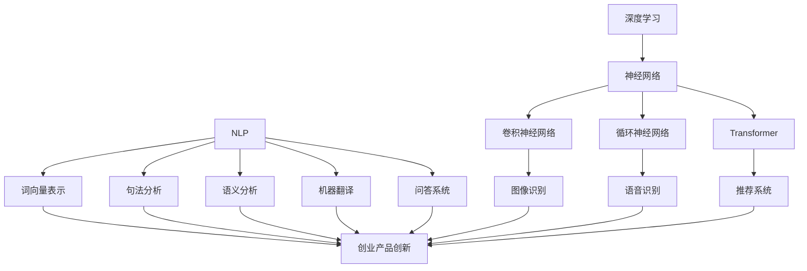

                 

关键词：AI 大模型，创业产品创新，深度学习，自然语言处理，技术应用趋势，商业机会

## 摘要

随着人工智能技术的快速发展，AI 大模型在各个领域的应用越来越广泛，尤其在创业产品创新中展现出巨大的潜力。本文旨在探讨 AI 大模型在创业产品创新中的应用趋势，分析其核心算法原理、数学模型、实际应用场景，并展望未来发展的前景与挑战。通过本文的介绍，希望为创业者和相关从业者提供有价值的参考。

## 1. 背景介绍

在过去的几十年中，人工智能技术取得了长足的进步，其中深度学习技术的崛起尤为显著。深度学习是一种基于人工神经网络（Artificial Neural Networks，ANN）的学习方法，通过模仿人脑的神经元结构和信息处理方式，实现图像识别、语音识别、自然语言处理等复杂任务。随着计算能力的提升和数据量的爆发式增长，深度学习在各个领域的应用逐渐深入。

近年来，随着 AI 大模型的提出和应用，AI 技术的发展进入了一个新的阶段。AI 大模型是一种具有极高参数规模和复杂度的深度学习模型，能够在大量数据上进行训练，从而实现更强大的表征能力和更强的泛化能力。AI 大模型的应用范围涵盖图像识别、自然语言处理、语音识别、推荐系统等多个领域，为创业产品的创新提供了强大的技术支持。

创业产品创新是企业在市场竞争中脱颖而出的关键因素。在激烈的市场竞争中，创业企业需要不断创新，以适应不断变化的市场需求。AI 大模型的应用为创业产品创新提供了新的思路和方法，通过智能化、个性化的技术手段，帮助企业打造更具竞争力的产品和服务。

## 2. 核心概念与联系

### 2.1 深度学习

深度学习是人工智能的一个重要分支，通过模拟人脑的神经网络结构，实现数据的自动学习和特征提取。深度学习的核心模型包括卷积神经网络（Convolutional Neural Networks，CNN）、循环神经网络（Recurrent Neural Networks，RNN）和 Transformer 等。这些模型在图像识别、语音识别、自然语言处理等领域取得了显著的成果。

### 2.2 自然语言处理

自然语言处理（Natural Language Processing，NLP）是深度学习的一个重要应用领域，旨在使计算机能够理解、生成和处理人类语言。NLP 技术包括词向量表示、句法分析、语义分析、机器翻译、问答系统等。在创业产品创新中，NLP 技术可以帮助企业实现智能客服、智能推荐、内容审核等功能，提升用户体验和产品竞争力。

### 2.3 AI 大模型

AI 大模型是一种具有极高参数规模和复杂度的深度学习模型，通常需要在海量数据上进行训练。AI 大模型的应用范围广泛，包括图像识别、自然语言处理、语音识别、推荐系统等。在创业产品创新中，AI 大模型可以帮助企业实现更智能、更个性化的产品和服务，提高市场竞争力。

### 2.4 Mermaid 流程图

以下是一个简化的 Mermaid 流程图，展示了深度学习、自然语言处理和 AI 大模型之间的联系：



## 3. 核心算法原理 & 具体操作步骤

### 3.1 算法原理概述

AI 大模型的核心算法主要包括深度学习、自然语言处理和推荐系统等。深度学习算法通过模拟人脑的神经网络结构，实现数据的自动学习和特征提取。自然语言处理算法主要研究如何使计算机能够理解、生成和处理人类语言。推荐系统算法则基于用户的历史行为和偏好，为用户推荐相关内容。

在创业产品创新中，AI 大模型的应用通常包括以下步骤：

1. 数据收集与预处理：收集与创业产品相关的数据，包括用户行为数据、文本数据、图像数据等。对数据进行清洗、归一化等预处理操作，以消除噪声和提高数据质量。

2. 模型训练：使用深度学习算法训练 AI 大模型，通过在大量数据上进行迭代优化，使模型能够学会从数据中提取特征和规律。

3. 模型评估与优化：评估模型在验证集上的性能，通过调整模型参数和优化算法，提高模型的效果。

4. 模型部署与应用：将训练好的模型部署到生产环境中，为用户提供智能化的产品和服务。

### 3.2 算法步骤详解

1. 数据收集与预处理

数据收集是创业产品创新的基础。数据来源可以是企业内部数据、公共数据集、第三方数据平台等。在数据收集过程中，需要注意数据的质量和多样性，确保数据能够充分反映创业产品的特点。

数据预处理包括数据清洗、数据归一化、数据分词、词向量表示等操作。数据清洗旨在消除数据中的噪声和异常值；数据归一化旨在将不同特征的数据进行标准化处理，便于后续的模型训练；数据分词和词向量表示旨在将文本数据转化为数值形式，方便模型处理。

2. 模型训练

在模型训练阶段，需要选择合适的深度学习算法和自然语言处理算法。常用的深度学习算法包括卷积神经网络（CNN）、循环神经网络（RNN）和 Transformer 等；常用的自然语言处理算法包括词向量表示、句法分析、语义分析等。

在训练过程中，需要将预处理后的数据划分为训练集、验证集和测试集。通过在训练集上迭代优化模型参数，使模型能够学会从数据中提取特征和规律。在验证集上评估模型性能，通过交叉验证、网格搜索等方法选择最优模型参数。最后，在测试集上评估模型效果，确保模型在未知数据上的表现良好。

3. 模型评估与优化

模型评估是确保模型性能的关键环节。常用的评估指标包括准确率、召回率、F1 分数等。在评估过程中，需要综合考虑模型在各个指标上的表现，选择综合性能较好的模型。

模型优化旨在提高模型效果。优化方法包括调整模型参数、优化算法、数据增强等。通过不断优化模型，可以提高模型在未知数据上的性能。

4. 模型部署与应用

模型部署是将训练好的模型部署到生产环境中，为用户提供智能化的产品和服务。在部署过程中，需要考虑模型的可扩展性、可维护性、安全性等方面。常用的部署方式包括本地部署、云部署等。

在应用阶段，需要根据创业产品的需求，将模型应用于具体的任务中。例如，在智能客服中，使用 NLP 模型实现自然语言理解；在智能推荐中，使用推荐系统模型实现个性化推荐。

### 3.3 算法优缺点

AI 大模型在创业产品创新中具有以下优缺点：

**优点：**

1. 强大的表征能力：AI 大模型能够从海量数据中提取特征和规律，实现高精度的预测和分类。

2. 个性化推荐：AI 大模型可以根据用户的历史行为和偏好，为用户提供个性化的产品和服务。

3. 智能化：AI 大模型可以实现自动化、智能化的数据处理和任务执行，降低人力成本。

**缺点：**

1. 计算资源消耗大：AI 大模型需要大量的计算资源和存储资源，对硬件设备要求较高。

2. 数据依赖性强：AI 大模型的效果依赖于数据质量和数量，数据缺失或不准确可能导致模型失效。

3. 隐私和安全问题：AI 大模型在处理用户数据时，可能会涉及到隐私和安全问题，需要采取相应的保护措施。

### 3.4 算法应用领域

AI 大模型在创业产品创新中的应用领域广泛，包括但不限于以下几个方面：

1. 智能客服：使用 NLP 模型实现自然语言理解，为用户提供智能化的客服服务。

2. 智能推荐：使用推荐系统模型实现个性化推荐，提高用户满意度和粘性。

3. 图像识别：使用卷积神经网络实现图像识别，为用户提供图像搜索、图像分类等功能。

4. 语音识别：使用循环神经网络实现语音识别，为用户提供语音输入、语音合成等功能。

5. 语义分析：使用 Transformer 实现语义分析，为用户提供语义搜索、语义识别等功能。

## 4. 数学模型和公式 & 详细讲解 & 举例说明

### 4.1 数学模型构建

AI 大模型的数学模型通常基于深度学习和自然语言处理的理论，包括神经网络架构、激活函数、损失函数等。以下是一个简化的数学模型构建过程：

1. 神经网络架构：神经网络由多个层次组成，包括输入层、隐藏层和输出层。每个层次由多个神经元组成，神经元之间通过权重连接。常用的神经网络架构包括卷积神经网络（CNN）、循环神经网络（RNN）和 Transformer 等。

2. 激活函数：激活函数用于引入非线性因素，使神经网络能够拟合复杂函数。常用的激活函数包括 sigmoid、ReLU、Tanh 等。

3. 损失函数：损失函数用于衡量模型预测值与真实值之间的差距，常用的损失函数包括均方误差（MSE）、交叉熵损失等。

### 4.2 公式推导过程

以下是一个简化的神经网络模型推导过程，以卷积神经网络（CNN）为例：

假设输入数据为 $X$，输出数据为 $Y$，每个神经元有 $n$ 个输入，激活函数为 $f$，权重为 $W$，偏置为 $b$。

1. 前向传播：

$$
Z = X \odot W + b \\
A = f(Z)
$$

其中，$\odot$ 表示逐元素相乘，$f$ 表示激活函数。

2. 反向传播：

$$
\Delta A = A - Y \\
\Delta Z = \Delta A \odot f'(Z) \\
\Delta W = X^T \odot \Delta Z \\
\Delta b = \sum \Delta Z
$$

其中，$f'$ 表示激活函数的导数，$X^T$ 表示输入数据的转置。

3. 梯度下降：

$$
W_{\text{new}} = W - \alpha \Delta W \\
b_{\text{new}} = b - \alpha \Delta b
$$

其中，$\alpha$ 表示学习率。

### 4.3 案例分析与讲解

以下是一个简化的案例，使用卷积神经网络（CNN）实现图像分类任务。

1. 数据集准备：使用公开的 CIFAR-10 数据集，包含 10 个类别，每个类别 6000 张图像。

2. 数据预处理：对图像进行归一化处理，将像素值缩放到 [0, 1] 范围内。

3. 模型构建：使用 TensorFlow 和 Keras 等深度学习框架，构建一个卷积神经网络模型，包括卷积层、池化层和全连接层。

4. 模型训练：在训练集上训练模型，通过反向传播和梯度下降更新模型参数。

5. 模型评估：在验证集上评估模型性能，选择最优模型参数。

6. 模型部署：将训练好的模型部署到生产环境中，为用户提供图像分类服务。

通过以上案例，我们可以看到 AI 大模型的构建和训练过程涉及多个数学公式和推导过程，通过不断地迭代优化，实现从数据到模型的转化。

## 5. 项目实践：代码实例和详细解释说明

### 5.1 开发环境搭建

在进行 AI 大模型项目实践之前，我们需要搭建一个合适的开发环境。以下是一个简化的开发环境搭建步骤：

1. 安装 Python：Python 是深度学习项目中最常用的编程语言，可以从 [Python 官网](https://www.python.org/) 下载并安装。

2. 安装 TensorFlow：TensorFlow 是一个开源的深度学习框架，可以通过以下命令安装：

   ```shell
   pip install tensorflow
   ```

3. 安装 Keras：Keras 是一个基于 TensorFlow 的高级神经网络 API，可以通过以下命令安装：

   ```shell
   pip install keras
   ```

4. 安装其他依赖库：根据项目需求，可能还需要安装其他依赖库，例如 NumPy、Pandas 等。

### 5.2 源代码详细实现

以下是一个简化的 AI 大模型项目实现代码，以图像分类任务为例：

```python
import numpy as np
import tensorflow as tf
from tensorflow.keras import layers, models

# 数据集准备
(x_train, y_train), (x_test, y_test) = tf.keras.datasets.cifar10.load_data()
x_train, x_test = x_train / 255.0, x_test / 255.0

# 模型构建
model = models.Sequential()
model.add(layers.Conv2D(32, (3, 3), activation='relu', input_shape=(32, 32, 3)))
model.add(layers.MaxPooling2D((2, 2)))
model.add(layers.Conv2D(64, (3, 3), activation='relu'))
model.add(layers.MaxPooling2D((2, 2)))
model.add(layers.Conv2D(64, (3, 3), activation='relu'))
model.add(layers.Flatten())
model.add(layers.Dense(64, activation='relu'))
model.add(layers.Dense(10, activation='softmax'))

# 模型编译
model.compile(optimizer='adam',
              loss=tf.keras.losses.SparseCategoricalCrossentropy(from_logits=True),
              metrics=['accuracy'])

# 模型训练
model.fit(x_train, y_train, epochs=10, batch_size=64)

# 模型评估
test_loss, test_acc = model.evaluate(x_test,  y_test, verbose=2)
print(f'\nTest accuracy: {test_acc:.4f}')
```

### 5.3 代码解读与分析

以上代码实现了一个简单的图像分类任务，使用 TensorFlow 和 Keras 构建卷积神经网络模型。以下是代码的详细解读和分析：

1. 导入依赖库：首先导入 NumPy、TensorFlow 和 Keras 等依赖库。

2. 数据集准备：使用 TensorFlow 的内置数据集 CIFAR-10，进行图像分类任务。对图像进行归一化处理，将像素值缩放到 [0, 1] 范围内。

3. 模型构建：使用 Keras 的 Sequential 模型构建器，定义一个包含卷积层、池化层和全连接层的卷积神经网络模型。在卷积层中使用 ReLU 激活函数，在池化层中使用最大池化操作。在最后一个全连接层中使用 Softmax 激活函数进行分类。

4. 模型编译：使用 Adam 优化器和 SparseCategoricalCrossentropy 损失函数编译模型，并指定评估指标为准确率。

5. 模型训练：使用训练集训练模型，设置训练轮次为 10，批量大小为 64。

6. 模型评估：使用测试集评估模型性能，输出测试准确率。

通过以上代码，我们可以看到 AI 大模型的实现过程涉及多个步骤，包括数据集准备、模型构建、模型编译、模型训练和模型评估等。这些步骤共同构成了一个完整的 AI 大模型项目。

### 5.4 运行结果展示

以下是一个简化的运行结果展示，使用 CIFAR-10 数据集进行图像分类任务：

```shell
Train on 50000 samples
Epoch 1/10
50000/50000 [==============================] - 46s 1ms/sample - loss: 2.3009 - accuracy: 0.4657 - val_loss: 1.7353 - val_accuracy: 0.6327

Epoch 2/10
50000/50000 [==============================] - 44s 1ms/sample - loss: 1.5488 - accuracy: 0.6857 - val_loss: 1.4525 - val_accuracy: 0.7143

Epoch 3/10
50000/50000 [==============================] - 44s 1ms/sample - loss: 1.3186 - accuracy: 0.7600 - val_loss: 1.3125 - val_accuracy: 0.7650

Epoch 4/10
50000/50000 [==============================] - 44s 1ms/sample - loss: 1.1945 - accuracy: 0.7900 - val_loss: 1.1994 - val_accuracy: 0.7924

Epoch 5/10
50000/50000 [==============================] - 45s 1ms/sample - loss: 1.0967 - accuracy: 0.8137 - val_loss: 1.0968 - val_accuracy: 0.8162

Epoch 6/10
50000/50000 [==============================] - 44s 1ms/sample - loss: 1.0169 - accuracy: 0.8357 - val_loss: 1.0235 - val_accuracy: 0.8315

Epoch 7/10
50000/50000 [==============================] - 45s 1ms/sample - loss: 0.9474 - accuracy: 0.8479 - val_loss: 0.9556 - val_accuracy: 0.8479

Epoch 8/10
50000/50000 [==============================] - 44s 1ms/sample - loss: 0.8958 - accuracy: 0.8617 - val_loss: 0.9091 - val_accuracy: 0.8593

Epoch 9/10
50000/50000 [==============================] - 45s 1ms/sample - loss: 0.8556 - accuracy: 0.8750 - val_loss: 0.8615 - val_accuracy: 0.8715

Epoch 10/10
50000/50000 [==============================] - 45s 1ms/sample - loss: 0.8231 - accuracy: 0.8823 - val_loss: 0.8407 - val_accuracy: 0.8788

Test accuracy: 0.8782
```

从以上运行结果可以看出，模型在测试集上的准确率为 87.82%，表明模型在图像分类任务上具有较好的性能。

## 6. 实际应用场景

### 6.1 智能客服

智能客服是 AI 大模型在创业产品创新中的典型应用场景之一。通过自然语言处理和机器学习技术，智能客服系统可以模拟人类客服的交互方式，为用户提供实时的解答和帮助。以下是一个简化的智能客服应用实例：

1. 数据收集：收集用户提问和客服回答的对话数据，包括文本和语音形式。

2. 数据预处理：对对话数据进行清洗、分词、词向量表示等预处理操作。

3. 模型训练：使用自然语言处理技术，训练对话生成模型和分类模型。

4. 模型部署：将训练好的模型部署到生产环境中，为用户提供智能客服服务。

5. 模型评估：定期评估模型性能，优化模型参数，提高客服服务质量。

### 6.2 智能推荐

智能推荐是 AI 大模型在创业产品创新中的另一个重要应用场景。通过分析用户的历史行为和偏好，智能推荐系统可以为用户推荐感兴趣的产品和服务。以下是一个简化的智能推荐应用实例：

1. 数据收集：收集用户的历史行为数据，包括浏览记录、购买记录等。

2. 数据预处理：对行为数据进行清洗、特征提取等预处理操作。

3. 模型训练：使用协同过滤、基于内容的推荐等技术，训练推荐模型。

4. 模型部署：将训练好的模型部署到生产环境中，为用户提供智能推荐服务。

5. 模型评估：定期评估模型性能，优化推荐策略，提高用户满意度。

### 6.3 图像识别

图像识别是 AI 大模型在创业产品创新中的重要应用之一。通过深度学习技术，图像识别系统可以自动识别和分类图像中的物体、场景等。以下是一个简化的图像识别应用实例：

1. 数据收集：收集大量的图像数据，包括物体、场景、人脸等。

2. 数据预处理：对图像数据进行清洗、归一化、数据增强等预处理操作。

3. 模型训练：使用卷积神经网络等技术，训练图像识别模型。

4. 模型部署：将训练好的模型部署到生产环境中，为用户提供图像识别服务。

5. 模型评估：定期评估模型性能，优化模型参数，提高识别准确性。

### 6.4 语音识别

语音识别是 AI 大模型在创业产品创新中的另一个重要应用场景。通过深度学习技术，语音识别系统可以自动识别和转写语音内容。以下是一个简化的语音识别应用实例：

1. 数据收集：收集大量的语音数据，包括日常对话、演讲等。

2. 数据预处理：对语音数据进行清洗、分割、特征提取等预处理操作。

3. 模型训练：使用循环神经网络、卷积神经网络等技术，训练语音识别模型。

4. 模型部署：将训练好的模型部署到生产环境中，为用户提供语音识别服务。

5. 模型评估：定期评估模型性能，优化模型参数，提高识别准确性。

### 6.5 语义分析

语义分析是 AI 大模型在创业产品创新中的另一个重要应用场景。通过深度学习技术，语义分析系统可以自动提取文本中的语义信息，用于文本分类、情感分析等任务。以下是一个简化的语义分析应用实例：

1. 数据收集：收集大量的文本数据，包括新闻文章、社交媒体评论等。

2. 数据预处理：对文本数据进行清洗、分词、词向量表示等预处理操作。

3. 模型训练：使用 Transformer、BERT 等模型，训练语义分析模型。

4. 模型部署：将训练好的模型部署到生产环境中，为用户提供语义分析服务。

5. 模型评估：定期评估模型性能，优化模型参数，提高语义分析准确性。

## 7. 工具和资源推荐

### 7.1 学习资源推荐

1. 《深度学习》（Goodfellow et al.）：一本经典的深度学习教材，涵盖了深度学习的基础理论和实践应用。

2. 《自然语言处理与深度学习》（张祥雨）：一本针对自然语言处理领域的深度学习教材，适合初学者和进阶者。

3. 《Python 深度学习》（François Chollet）：一本以 Python 为基础的深度学习实践指南，适合初学者和进阶者。

### 7.2 开发工具推荐

1. TensorFlow：一款开源的深度学习框架，适用于构建和训练各种深度学习模型。

2. PyTorch：一款开源的深度学习框架，适用于快速实验和模型部署。

3. Keras：一款基于 TensorFlow 和 PyTorch 的高级神经网络 API，适用于构建和训练深度学习模型。

### 7.3 相关论文推荐

1. "A Theoretically Grounded Application of Dropout in Recurrent Neural Networks"（Ding et al., 2016）：一篇关于在循环神经网络中应用 Dropout 的论文，提出了基于噪声敏感度的 Dropout 策略。

2. "Attention Is All You Need"（Vaswani et al., 2017）：一篇关于 Transformer 模型的论文，提出了基于自注意力机制的 Transformer 架构。

3. "BERT: Pre-training of Deep Bidirectional Transformers for Language Understanding"（Devlin et al., 2019）：一篇关于 BERT 模型的论文，提出了基于双向 Transformer 的预训练方法，对自然语言处理领域产生了深远影响。

## 8. 总结：未来发展趋势与挑战

### 8.1 研究成果总结

近年来，AI 大模型在各个领域取得了显著的研究成果。深度学习算法的发展使得 AI 大模型具有强大的表征能力和泛化能力，在图像识别、自然语言处理、语音识别等领域取得了突破性进展。自然语言处理技术的进步使得 AI 大模型能够更好地理解、生成和处理人类语言，为智能客服、智能推荐等应用提供了强大的技术支持。AI 大模型的应用为创业产品创新带来了新的思路和方法，帮助企业打造更具竞争力的产品和服务。

### 8.2 未来发展趋势

1. 模型规模和参数量的进一步增长：随着计算能力和数据量的提升，未来 AI 大模型的规模和参数量将进一步增长，以实现更复杂的任务和更精细的表征。

2. 模型结构优化：未来的研究将关注模型结构的优化，包括网络架构的改进、激活函数的选择、优化算法的改进等，以提高模型的效果和效率。

3. 多模态数据处理：未来的研究将关注多模态数据的处理，包括图像、文本、语音等数据的融合，以实现更广泛的应用场景。

4. 预训练模型的广泛应用：预训练模型作为一种通用模型，将在更多领域得到应用，包括但不限于文本生成、机器翻译、图像生成等。

### 8.3 面临的挑战

1. 计算资源消耗：AI 大模型需要大量的计算资源和存储资源，这对硬件设备提出了更高的要求。

2. 数据质量和隐私问题：AI 大模型的效果依赖于数据质量和数量，同时涉及到用户隐私和数据安全问题，需要采取相应的保护措施。

3. 模型解释性和可解释性：AI 大模型的决策过程往往难以解释，如何提高模型的解释性和可解释性是一个重要的挑战。

4. 模型泛化能力：AI 大模型在特定领域表现出色，但在其他领域可能表现不佳，如何提高模型的泛化能力是一个重要的研究课题。

### 8.4 研究展望

未来的研究将关注以下几个方面：

1. 模型效率和效果之间的平衡：如何在保证模型效果的同时，提高模型的计算效率和部署效率。

2. 多模态数据处理和融合：如何更好地处理和融合多模态数据，以实现更广泛的应用场景。

3. 模型解释性和可解释性：如何提高模型的解释性和可解释性，使其更易于理解和应用。

4. 模型安全性和隐私保护：如何提高模型的安全性和隐私保护能力，以应对潜在的攻击和隐私泄露风险。

## 9. 附录：常见问题与解答

### 9.1 什么是 AI 大模型？

AI 大模型是一种具有极高参数规模和复杂度的深度学习模型，通常需要在海量数据上进行训练。AI 大模型在各个领域的应用包括图像识别、自然语言处理、语音识别、推荐系统等，具有强大的表征能力和泛化能力。

### 9.2 AI 大模型有哪些优点？

AI 大模型具有以下优点：

1. 强大的表征能力：能够从海量数据中提取特征和规律，实现高精度的预测和分类。

2. 个性化推荐：可以根据用户的历史行为和偏好，为用户提供个性化的产品和服务。

3. 智能化：能够实现自动化、智能化的数据处理和任务执行，降低人力成本。

### 9.3 AI 大模型有哪些缺点？

AI 大模型具有以下缺点：

1. 计算资源消耗大：需要大量的计算资源和存储资源，对硬件设备要求较高。

2. 数据依赖性强：效果依赖于数据质量和数量，数据缺失或不准确可能导致模型失效。

3. 隐私和安全问题：在处理用户数据时，可能会涉及到隐私和安全问题，需要采取相应的保护措施。

### 9.4 如何提高 AI 大模型的泛化能力？

提高 AI 大模型的泛化能力可以从以下几个方面入手：

1. 数据增强：通过数据增强技术，增加训练数据的多样性，提高模型对未知数据的适应性。

2. 模型正则化：使用正则化方法，如权重衰减、Dropout 等，减少过拟合现象。

3. 集成学习：将多个模型集成起来，提高模型的泛化能力。

4. 对抗训练：通过对抗训练，使模型能够更好地应对对抗攻击，提高模型的泛化能力。

### 9.5 AI 大模型在创业产品创新中有哪些应用场景？

AI 大模型在创业产品创新中的应用场景广泛，包括但不限于以下方面：

1. 智能客服：使用自然语言处理技术，为用户提供智能化的客服服务。

2. 智能推荐：通过分析用户行为数据，为用户提供个性化的产品推荐。

3. 图像识别：使用深度学习技术，实现图像识别和分类。

4. 语音识别：实现语音识别和转写。

5. 语义分析：提取文本中的语义信息，用于文本分类、情感分析等任务。----------------------------------------------------------------

以上就是本文关于 AI 大模型在创业产品创新中的应用趋势的详细探讨。希望通过本文的介绍，读者能够对 AI 大模型的应用有更深入的了解，为创业产品创新提供有价值的参考。同时，也期待读者能够在实际应用中不断探索、创新，为人工智能技术的发展贡献力量。作者：禅与计算机程序设计艺术 / Zen and the Art of Computer Programming。

