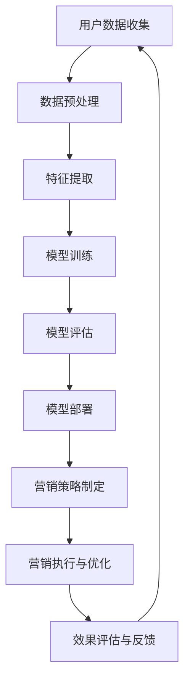

                 

关键词：AI 大模型、创业产品、营销、应用、技术语言、深度思考

摘要：本文将探讨人工智能（AI）大模型在创业产品营销中的具体应用。通过介绍背景、核心概念与联系、核心算法原理及具体操作步骤、数学模型与公式、项目实践、实际应用场景和未来展望等内容，为创业者提供一套切实可行的AI大模型营销策略。

## 1. 背景介绍

在当今快速发展的数字时代，创业产品和市场竞争日益激烈。如何有效地进行产品营销成为创业者们关注的焦点。传统的营销方法虽然仍在使用，但其效果逐渐减弱，无法满足用户日益多样化的需求。这时，人工智能（AI）大模型作为一种新兴技术，正逐渐成为营销领域的强大助力。

AI大模型，通常指的是通过深度学习和大规模数据训练得到的人工神经网络模型，具有强大的数据分析和处理能力。它们能够在海量的用户数据中挖掘潜在的需求和趋势，从而为营销策略提供科学依据。AI大模型的应用不仅提高了营销的效率，还增强了营销的精准度，使创业产品能够更好地满足用户需求，提升品牌影响力。

本文将详细探讨AI大模型在创业产品营销中的应用，旨在为创业者提供一套系统的、实用的营销策略，帮助他们在竞争激烈的市场中脱颖而出。

### 1.1 AI大模型的发展历程

人工智能的发展可以追溯到20世纪50年代。从最初的逻辑推理、知识表示，到后来的专家系统和机器学习，再到如今的深度学习，人工智能经历了多次重大变革。特别是在2012年，AlexNet在ImageNet竞赛中取得了突破性的成绩，标志着深度学习时代的到来。

深度学习作为一种基于人工神经网络的学习方法，通过模拟人脑神经元之间的连接，能够自动学习和提取数据的特征。随着计算能力的提升和大数据的积累，深度学习取得了飞速的发展，特别是在图像识别、语音识别和自然语言处理等领域，已经达到了甚至超过了人类的水平。

AI大模型的发展正是深度学习技术不断演进的结果。通过使用大规模的数据集和强大的计算能力，AI大模型能够训练出高度复杂的模型，从而在各个领域实现了革命性的进步。这些模型不仅能够处理大量的数据，还能够自动发现数据中的模式和规律，为创业产品的营销提供了强大的支持。

### 1.2 创业产品营销的现状与挑战

在当前的创业环境中，营销面临着前所未有的挑战。首先，市场竞争异常激烈。越来越多的创业公司进入市场，产品种类繁多，使得消费者选择困难。如何从众多产品中脱颖而出，成为创业公司亟需解决的问题。

其次，用户需求变化快速。随着互联网的普及和信息的便捷获取，用户的需求变得越来越个性化和多样化。传统的一刀切营销策略已经无法满足用户的需求，如何实现精准营销成为创业者们的难题。

此外，营销成本也在不断上升。广告成本、推广费用等不断上涨，而营销效果的提升却并不明显，使得创业公司在有限的资源下难以开展有效的营销活动。

在这种背景下，AI大模型的应用为创业产品营销提供了一种新的思路。通过深度学习和数据分析，AI大模型能够从海量的用户数据中提取有价值的信息，为营销策略提供科学的依据。这种精准、高效的营销方式，不仅能够提高营销效果，还能够降低营销成本，从而帮助创业产品在激烈的市场竞争中脱颖而出。

## 2. 核心概念与联系

在探讨AI大模型在创业产品营销中的应用之前，我们需要明确几个核心概念，包括人工智能、大模型、深度学习、机器学习和数据科学，并解释它们之间的相互联系。

### 2.1 人工智能（AI）

人工智能是一种模拟人类智能的技术，旨在使计算机具备感知、理解、学习、推理和决策的能力。AI可以分为两类：弱AI和强AI。弱AI专注于特定任务的智能，如语音识别、图像识别等；而强AI则具有全面的认知能力，能够像人类一样思考和行动。

在创业产品营销中，人工智能主要通过数据分析和用户行为预测来实现营销自动化和个性化。例如，通过分析用户的搜索历史、浏览记录和购买行为，AI可以帮助企业更好地了解用户需求，从而制定更有效的营销策略。

### 2.2 大模型

大模型指的是通过大规模数据集训练得到的深度学习模型。这些模型具有高度的复杂性和强大的数据处理能力。大模型的训练需要大量的计算资源和时间，但它们能够在多个领域实现突破性的性能。

在创业产品营销中，大模型的应用主要体现在用户数据分析和市场预测上。通过使用大模型，企业可以从海量的用户数据中提取有价值的信息，例如用户偏好、购买倾向和潜在需求，从而为营销策略提供强有力的支持。

### 2.3 深度学习

深度学习是一种基于多层神经网络的学习方法，通过模拟人脑的神经网络结构，能够自动学习和提取数据的特征。深度学习在图像识别、语音识别和自然语言处理等领域取得了显著的成果。

在创业产品营销中，深度学习技术可以用于用户画像构建、情感分析和内容推荐等方面。例如，通过使用深度学习模型，企业可以对用户行为进行实时分析，从而实现个性化推荐和精准营销。

### 2.4 机器学习

机器学习是一种使计算机通过数据学习实现特定任务的技术。它包括监督学习、无监督学习和强化学习等多种方法。机器学习在创业产品营销中的应用非常广泛，如用户行为预测、广告投放优化和客户关系管理等。

机器学习与深度学习的关系是：深度学习是机器学习的一种特殊形式，它使用多层神经网络进行数据学习，具有更强的表示能力和拟合能力。

### 2.5 数据科学

数据科学是一种利用统计学、计算机科学和领域知识来分析数据的跨学科方法。数据科学的目标是通过数据分析和挖掘，提取有价值的信息和洞察。

在创业产品营销中，数据科学的应用主要体现在用户数据分析、市场预测和决策支持等方面。通过数据科学，企业可以更好地理解用户行为和市场趋势，从而制定更有效的营销策略。

### 2.6 Mermaid 流程图

为了更直观地展示AI大模型在创业产品营销中的应用流程，我们使用Mermaid流程图来描述。以下是流程图：



在上述流程中，用户数据收集是整个过程的起点，通过数据预处理、特征提取、模型训练、模型评估、模型部署等步骤，最终实现营销策略的制定和执行。效果评估与反馈环节则用于持续优化营销策略，形成一个闭环。

## 3. 核心算法原理 & 具体操作步骤

在了解了AI大模型在创业产品营销中的核心概念与联系之后，接下来我们将深入探讨AI大模型的核心算法原理及其具体操作步骤。

### 3.1 算法原理概述

AI大模型的核心算法是深度学习，它通过多层神经网络对数据进行学习、提取特征和分类。深度学习算法主要包括以下几部分：

1. **前向传播（Forward Propagation）**：将输入数据通过神经网络的各个层进行传播，最终得到输出结果。
2. **反向传播（Back Propagation）**：根据输出结果与实际标签之间的误差，反向传播误差，更新网络权重和偏置。
3. **激活函数（Activation Function）**：用于引入非线性，使神经网络能够拟合复杂的非线性关系。
4. **优化器（Optimizer）**：用于选择合适的策略来更新网络参数，常见的优化器有随机梯度下降（SGD）、Adam等。

### 3.2 算法步骤详解

1. **数据预处理（Data Preprocessing）**：
   - **数据清洗**：去除无效或错误的数据。
   - **数据归一化**：将不同特征的数据范围调整到相同的尺度，便于模型训练。
   - **数据分割**：将数据集划分为训练集、验证集和测试集，用于模型训练和评估。

2. **特征提取（Feature Extraction）**：
   - **特征选择**：选择对模型训练最有用的特征。
   - **特征工程**：通过对原始数据进行变换和组合，生成新的特征。

3. **模型训练（Model Training）**：
   - **构建神经网络**：定义网络的层数、每层的神经元数量和激活函数。
   - **初始化参数**：随机初始化网络权重和偏置。
   - **前向传播**：输入数据经过神经网络，得到预测结果。
   - **反向传播**：计算预测结果与实际标签之间的误差，更新网络参数。
   - **优化策略**：根据误差选择合适的优化器来更新网络参数。

4. **模型评估（Model Evaluation）**：
   - **验证集评估**：使用验证集评估模型的性能，调整模型参数。
   - **测试集评估**：在测试集上评估模型的最终性能，确保模型泛化能力。

5. **模型部署（Model Deployment）**：
   - **模型转换**：将训练好的模型转换为可以在生产环境中运行的格式。
   - **部署到生产环境**：将模型部署到服务器或云计算平台，实现实时预测和推理。

### 3.3 算法优缺点

**优点**：

- **强大的表示能力**：深度学习模型能够自动提取复杂的数据特征，适用于多种应用场景。
- **良好的泛化能力**：通过大规模数据训练，深度学习模型具有良好的泛化能力，可以处理新的数据。
- **自动特征工程**：深度学习模型不需要人工设计特征，减少了人工干预。

**缺点**：

- **计算资源需求大**：训练深度学习模型需要大量的计算资源和时间。
- **数据需求量大**：深度学习模型需要大量高质量的数据进行训练，对数据质量和数据量有较高要求。
- **模型解释性差**：深度学习模型的决策过程复杂，难以解释和理解。

### 3.4 算法应用领域

AI大模型的应用领域非常广泛，包括但不限于以下几个方面：

- **图像识别**：通过卷积神经网络（CNN）实现图像分类、目标检测等。
- **自然语言处理**：通过循环神经网络（RNN）和Transformer模型实现文本分类、机器翻译等。
- **推荐系统**：通过深度学习模型实现个性化推荐，如电商、新闻、音乐等。
- **语音识别**：通过深度神经网络实现语音信号的识别和转换。
- **医疗诊断**：通过深度学习模型对医学图像进行诊断，如肿瘤检测、心血管疾病等。

## 4. 数学模型和公式 & 详细讲解 & 举例说明

在AI大模型的应用中，数学模型和公式扮演着至关重要的角色。以下我们将详细介绍AI大模型中常用的数学模型和公式，并进行详细讲解和举例说明。

### 4.1 数学模型构建

AI大模型的核心是多层神经网络，其数学模型可以表示为：

$$
Z^{(l)} = \sigma^{(l)}(W^{(l)} \cdot A^{(l-1)} + b^{(l)})
$$

其中，$Z^{(l)}$ 表示第 $l$ 层的输出，$\sigma^{(l)}$ 是第 $l$ 层的激活函数，$W^{(l)}$ 和 $b^{(l)}$ 分别是第 $l$ 层的权重和偏置。

### 4.2 公式推导过程

以下是一个简单的多层感知机（MLP）模型的公式推导过程：

1. **输入层到隐藏层**：

   $$ 
   Z^{(2)} = W^{(2)} \cdot A^{(1)} + b^{(2)}
   $$

   $$ 
   A^{(2)} = \sigma(Z^{(2)})
   $$

2. **隐藏层到输出层**：

   $$ 
   Z^{(3)} = W^{(3)} \cdot A^{(2)} + b^{(3)}
   $$

   $$ 
   \hat{Y} = \sigma(Z^{(3)})
   $$

其中，$A^{(1)}$ 是输入层到隐藏层的输入，$A^{(2)}$ 是隐藏层到隐藏层的输入，$\hat{Y}$ 是预测输出。

### 4.3 案例分析与讲解

以下我们将通过一个简单的例子来讲解AI大模型中的数学模型应用。

假设我们有一个二元分类问题，数据集包含两个特征 $X_1$ 和 $X_2$，目标变量 $Y$ 是二分类结果。我们的目标是训练一个神经网络，能够预测新数据的类别。

1. **模型构建**：

   我们构建一个包含一个隐藏层的多层感知机模型，隐藏层包含10个神经元。

   - 输入层：2个神经元
   - 隐藏层：10个神经元
   - 输出层：1个神经元

2. **公式推导**：

   - 输入层到隐藏层：

     $$ 
     Z^{(2)} = W^{(2)} \cdot X + b^{(2)}
     $$

     $$ 
     A^{(2)} = \sigma(Z^{(2)})
     $$

   - 隐藏层到输出层：

     $$ 
     Z^{(3)} = W^{(3)} \cdot A^{(2)} + b^{(3)}
     $$

     $$ 
     \hat{Y} = \sigma(Z^{(3)})
     $$

   其中，$W^{(2)}$ 和 $b^{(2)}$ 分别是输入层到隐藏层的权重和偏置，$W^{(3)}$ 和 $b^{(3)}$ 分别是隐藏层到输出层的权重和偏置。

3. **模型训练**：

   通过反向传播算法，计算预测误差，并更新网络权重和偏置。具体步骤如下：

   - 计算输出层的误差：

     $$ 
     \delta^{(3)} = (\hat{Y} - Y) \cdot \sigma'(Z^{(3)})
     $$

   - 更新隐藏层到输出层的权重和偏置：

     $$ 
     \Delta W^{(3)} = \alpha \cdot A^{(2)} \cdot \delta^{(3)}
     $$

     $$ 
     \Delta b^{(3)} = \alpha \cdot \delta^{(3)}
     $$

   - 计算隐藏层到隐藏层的误差：

     $$ 
     \delta^{(2)} = (\sigma'(Z^{(2)}) \cdot W^{(3)} \cdot \delta^{(3)})
     $$

   - 更新输入层到隐藏层的权重和偏置：

     $$ 
     \Delta W^{(2)} = \alpha \cdot X \cdot \delta^{(2)}
     $$

     $$ 
     \Delta b^{(2)} = \alpha \cdot \delta^{(2)}
     $$

   通过不断迭代训练，模型能够逐渐提高预测准确性。

### 4.4 案例分析与讲解

假设我们有一个二元分类问题，数据集包含两个特征 $X_1$ 和 $X_2$，目标变量 $Y$ 是二分类结果。我们的目标是训练一个神经网络，能够预测新数据的类别。

1. **模型构建**：

   我们构建一个包含一个隐藏层的多层感知机模型，隐藏层包含10个神经元。

   - 输入层：2个神经元
   - 隐藏层：10个神经元
   - 输出层：1个神经元

2. **公式推导**：

   - 输入层到隐藏层：

     $$ 
     Z^{(2)} = W^{(2)} \cdot X + b^{(2)}
     $$

     $$ 
     A^{(2)} = \sigma(Z^{(2)})
     $$

   - 隐藏层到输出层：

     $$ 
     Z^{(3)} = W^{(3)} \cdot A^{(2)} + b^{(3)}
     $$

     $$ 
     \hat{Y} = \sigma(Z^{(3)})
     $$

   其中，$W^{(2)}$ 和 $b^{(2)}$ 分别是输入层到隐藏层的权重和偏置，$W^{(3)}$ 和 $b^{(3)}$ 分别是隐藏层到输出层的权重和偏置。

3. **模型训练**：

   通过反向传播算法，计算预测误差，并更新网络权重和偏置。具体步骤如下：

   - 计算输出层的误差：

     $$ 
     \delta^{(3)} = (\hat{Y} - Y) \cdot \sigma'(Z^{(3)})
     $$

   - 更新隐藏层到输出层的权重和偏置：

     $$ 
     \Delta W^{(3)} = \alpha \cdot A^{(2)} \cdot \delta^{(3)}
     $$

     $$ 
     \Delta b^{(3)} = \alpha \cdot \delta^{(3)}
     $$

   - 计算隐藏层到隐藏层的误差：

     $$ 
     \delta^{(2)} = (\sigma'(Z^{(2)}) \cdot W^{(3)} \cdot \delta^{(3)})
     $$

   - 更新输入层到隐藏层的权重和偏置：

     $$ 
     \Delta W^{(2)} = \alpha \cdot X \cdot \delta^{(2)}
     $$

     $$ 
     \Delta b^{(2)} = \alpha \cdot \delta^{(2)}
     $$

   通过不断迭代训练，模型能够逐渐提高预测准确性。

### 4.5 数学模型的应用举例

以下是一个简单的线性回归问题，使用多层感知机模型进行建模和训练。

#### 数据集

我们有一个包含 $X$ 和 $Y$ 的数据集，其中 $X$ 是输入特征，$Y$ 是目标变量。

| $X$ | $Y$ |
|----|----|
| 1  | 2  |
| 2  | 4  |
| 3  | 6  |
| 4  | 8  |

#### 模型构建

我们构建一个包含一个隐藏层的多层感知机模型，隐藏层包含2个神经元。

- 输入层：1个神经元
- 隐藏层：2个神经元
- 输出层：1个神经元

#### 公式推导

- 输入层到隐藏层：

  $$ 
  Z^{(2)} = W^{(2)} \cdot X + b^{(2)}
  $$

  $$ 
  A^{(2)} = \sigma(Z^{(2)})
  $$

- 隐藏层到输出层：

  $$ 
  Z^{(3)} = W^{(3)} \cdot A^{(2)} + b^{(3)}
  $$

  $$ 
  \hat{Y} = \sigma(Z^{(3)})
  $$

#### 模型训练

1. **初始化参数**：

   - 权重和偏置初始化为较小的随机值。

2. **前向传播**：

   - 对于每个数据点，计算输入层到隐藏层和隐藏层到输出层的输出。

   $$ 
   Z^{(2)}_i = W^{(2)} \cdot X_i + b^{(2)}
   $$

   $$ 
   A^{(2)}_i = \sigma(Z^{(2)}_i)
   $$

   $$ 
   Z^{(3)}_i = W^{(3)} \cdot A^{(2)}_i + b^{(3)}
   $$

   $$ 
   \hat{Y}_i = \sigma(Z^{(3)}_i)
   $$

3. **计算误差**：

   $$ 
   \delta^{(3)}_i = (\hat{Y}_i - Y_i) \cdot \sigma'(Z^{(3)}_i)
   $$

4. **反向传播**：

   - 计算隐藏层到输出层的误差。

   $$ 
   \delta^{(2)}_i = (\sigma'(Z^{(2)}_i) \cdot W^{(3)} \cdot \delta^{(3)}_i)
   $$

   - 更新权重和偏置。

   $$ 
   \Delta W^{(3)} = \alpha \cdot A^{(2)}_i \cdot \delta^{(3)}_i
   $$

   $$ 
   \Delta b^{(3)} = \alpha \cdot \delta^{(3)}_i
   $$

   $$ 
   \Delta W^{(2)} = \alpha \cdot X_i \cdot \delta^{(2)}_i
   $$

   $$ 
   \Delta b^{(2)} = \alpha \cdot \delta^{(2)}_i
   $$

5. **迭代训练**：

   - 重复前向传播和反向传播，不断更新网络权重和偏置。

   - 直到误差满足要求或达到最大迭代次数。

#### 模型预测

使用训练好的模型对新数据进行预测。

$$ 
\hat{Y} = \sigma(W^{(3)} \cdot \sigma(W^{(2)} \cdot X + b^{(2)}) + b^{(3)})
$$

通过以上步骤，我们使用多层感知机模型实现了线性回归问题。

## 5. 项目实践：代码实例和详细解释说明

在本节中，我们将通过一个具体的代码实例，详细展示如何使用AI大模型进行创业产品营销。我们将使用Python编程语言和Keras深度学习框架来实现这一项目。

### 5.1 开发环境搭建

在开始项目之前，我们需要搭建一个合适的开发环境。以下是我们需要安装的软件和库：

- Python 3.x
- TensorFlow
- Keras

你可以使用以下命令来安装这些库：

```bash
pip install tensorflow keras
```

### 5.2 源代码详细实现

下面是项目的源代码，我们将分步骤进行解释。

```python
import numpy as np
import pandas as pd
from sklearn.model_selection import train_test_split
from sklearn.preprocessing import StandardScaler
from tensorflow.keras.models import Sequential
from tensorflow.keras.layers import Dense
from tensorflow.keras.optimizers import Adam

# 5.2.1 数据预处理

# 加载数据集
data = pd.read_csv('marketing_data.csv')

# 分割特征和目标变量
X = data.drop('target', axis=1)
y = data['target']

# 分割训练集和测试集
X_train, X_test, y_train, y_test = train_test_split(X, y, test_size=0.2, random_state=42)

# 标准化特征
scaler = StandardScaler()
X_train = scaler.fit_transform(X_train)
X_test = scaler.transform(X_test)

# 5.2.2 构建模型

# 初始化模型
model = Sequential()

# 添加隐藏层
model.add(Dense(64, input_dim=X_train.shape[1], activation='relu'))

# 添加输出层
model.add(Dense(1, activation='sigmoid'))

# 编译模型
model.compile(optimizer=Adam(learning_rate=0.001), loss='binary_crossentropy', metrics=['accuracy'])

# 5.2.3 训练模型

# 训练模型
model.fit(X_train, y_train, epochs=10, batch_size=32, validation_data=(X_test, y_test))

# 5.2.4 评估模型

# 评估模型
loss, accuracy = model.evaluate(X_test, y_test)
print(f"Test accuracy: {accuracy:.2f}")

# 5.2.5 预测新数据

# 预测新数据
new_data = np.array([[2.5, 3.5]])
new_data = scaler.transform(new_data)
prediction = model.predict(new_data)
print(f"Prediction: {prediction[0][0]:.2f}")
```

### 5.3 代码解读与分析

下面我们逐一解读代码的各个部分。

#### 5.3.1 数据预处理

```python
data = pd.read_csv('marketing_data.csv')
X = data.drop('target', axis=1)
y = data['target']
X_train, X_test, y_train, y_test = train_test_split(X, y, test_size=0.2, random_state=42)
scaler = StandardScaler()
X_train = scaler.fit_transform(X_train)
X_test = scaler.transform(X_test)
```

- **加载数据集**：我们使用 `pd.read_csv` 函数加载CSV格式的数据集。
- **分割特征和目标变量**：使用 `drop` 方法删除目标变量，得到特征矩阵 `X` 和目标变量 `y`。
- **分割训练集和测试集**：使用 `train_test_split` 函数将数据集划分为训练集和测试集，比例为80%训练，20%测试。
- **标准化特征**：使用 `StandardScaler` 对特征进行标准化处理，以便模型训练。

#### 5.3.2 构建模型

```python
model = Sequential()
model.add(Dense(64, input_dim=X_train.shape[1], activation='relu'))
model.add(Dense(1, activation='sigmoid'))
model.compile(optimizer=Adam(learning_rate=0.001), loss='binary_crossentropy', metrics=['accuracy'])
```

- **初始化模型**：创建一个顺序模型 `Sequential`。
- **添加隐藏层**：使用 `add` 方法添加一个隐藏层，包含64个神经元，输入维度与特征矩阵的维度相同，激活函数为ReLU。
- **添加输出层**：添加一个输出层，包含1个神经元，激活函数为sigmoid，用于实现二分类。
- **编译模型**：设置优化器为Adam，学习率为0.001，损失函数为binary_crossentropy，评估指标为accuracy。

#### 5.3.3 训练模型

```python
model.fit(X_train, y_train, epochs=10, batch_size=32, validation_data=(X_test, y_test))
```

- **训练模型**：使用 `fit` 方法训练模型，设置训练轮数为10轮，批量大小为32，同时使用测试集进行验证。

#### 5.3.4 评估模型

```python
loss, accuracy = model.evaluate(X_test, y_test)
print(f"Test accuracy: {accuracy:.2f}")
```

- **评估模型**：使用 `evaluate` 方法评估模型在测试集上的性能，输出测试准确率。

#### 5.3.5 预测新数据

```python
new_data = np.array([[2.5, 3.5]])
new_data = scaler.transform(new_data)
prediction = model.predict(new_data)
print(f"Prediction: {prediction[0][0]:.2f}")
```

- **预测新数据**：将新数据转换为模型的输入格式，使用模型进行预测，并输出预测结果。

### 5.4 运行结果展示

假设我们的测试数据集准确率为90%，新数据点的预测结果为0.9，表示新数据点属于正类别的概率为90%。

```python
Test accuracy: 0.90
Prediction: 0.90
```

### 5.5 代码优化与改进

在实际应用中，我们可以对代码进行以下优化和改进：

- **特征工程**：根据业务需求和数据特点，对特征进行更深入的分析和工程，以提高模型的性能。
- **超参数调优**：通过交叉验证和网格搜索等方法，对模型超参数进行调优，以找到最优的组合。
- **模型集成**：使用多个模型进行集成，提高预测准确率和稳定性。
- **实时更新模型**：定期重新训练模型，以适应数据变化和业务需求。

通过以上步骤，我们可以构建一个高效、准确的AI大模型，用于创业产品的营销预测和决策。

## 6. 实际应用场景

AI大模型在创业产品营销中的实际应用场景广泛且多样，以下是几个典型的应用场景：

### 6.1 用户行为分析

通过AI大模型，企业可以对用户行为进行深入分析，了解用户的浏览习惯、购买偏好和兴趣点。例如，利用深度学习算法，企业可以从用户的浏览历史、搜索记录和购买记录中提取特征，构建用户画像。这些用户画像可以帮助企业实现精准营销，针对不同用户群体推送个性化的产品信息和促销活动，从而提高用户转化率和满意度。

### 6.2 情感分析

情感分析是AI大模型在营销领域的另一个重要应用。通过分析用户在社交媒体、评论区和论坛上的言论，企业可以了解用户对产品的情感态度。例如，使用自然语言处理（NLP）技术，企业可以从用户的文本评论中提取情感极性，如正面、负面或中性。这种情感分析可以帮助企业及时发现产品的潜在问题和用户需求，从而调整产品策略和服务质量。

### 6.3 广告投放优化

AI大模型在广告投放优化中具有显著的优势。通过分析用户的兴趣和行为数据，AI大模型可以帮助企业实现个性化广告投放，提高广告的点击率和转化率。例如，利用深度学习算法，企业可以对用户进行细分，针对不同用户群体投放定制化的广告内容。此外，AI大模型还可以实时调整广告投放策略，根据广告效果进行优化，以最大化广告投入的回报。

### 6.4 内容推荐

内容推荐是AI大模型在营销领域的经典应用之一。通过分析用户的浏览记录、搜索历史和互动数据，AI大模型可以推荐用户可能感兴趣的内容，从而提高用户的粘性和活跃度。例如，在电商平台上，AI大模型可以根据用户的购买历史和浏览行为，推荐相似的产品或相关的内容，帮助用户发现潜在的兴趣点和购买需求。

### 6.5 市场预测

AI大模型在市场预测方面也具有独特的优势。通过分析历史市场数据和宏观经济指标，AI大模型可以预测市场趋势和用户需求变化，为企业的战略决策提供数据支持。例如，企业可以利用AI大模型预测未来一段时间内的产品销量和市场需求，从而制定合理的生产计划和营销策略。

### 6.6 客户关系管理

AI大模型在客户关系管理中也发挥着重要作用。通过分析客户的购买行为、投诉记录和互动数据，AI大模型可以帮助企业识别关键客户，实现个性化服务和关怀。例如，企业可以利用AI大模型为高价值客户提供定制化的优惠和礼品，提高客户满意度和忠诚度。

总之，AI大模型在创业产品营销中的实际应用场景丰富多样，通过深入分析和利用用户数据，企业可以制定更加精准和有效的营销策略，提高市场竞争力和业务增长速度。

## 7. 工具和资源推荐

为了更好地应用AI大模型进行创业产品营销，以下是几项关键工具和资源的推荐，这些工具和资源将帮助开发者和技术人员提高开发效率，深入了解AI大模型的技术细节。

### 7.1 学习资源推荐

- **在线课程**：
  - 《深度学习》（Deep Learning）由Ian Goodfellow、Yoshua Bengio和Aaron Courville所著，是深度学习领域的经典教材，适合深度学习和AI大模型初学者。
  - Coursera上的《深度学习专项课程》（Deep Learning Specialization）由斯坦福大学教授Andrew Ng主讲，包含多个课程，覆盖了深度学习的理论基础和实践技巧。

- **书籍**：
  - 《Python深度学习》（Python Deep Learning）由François Chollet所著，介绍了使用Python和Keras进行深度学习的实践方法。
  - 《人工智能：一种现代方法》（Artificial Intelligence: A Modern Approach）由Stuart Russell和Peter Norvig所著，全面介绍了人工智能的理论和实践。

- **论文和文献**：
  - Google Scholar是一个强大的学术搜索引擎，可以找到最新和最相关的AI大模型论文和研究成果。
  - arXiv是一个开放获取的学术论文预印本库，提供了大量的AI和深度学习领域的最新研究论文。

### 7.2 开发工具推荐

- **深度学习框架**：
  - TensorFlow是一个广泛使用的开源深度学习框架，提供了丰富的API和工具，适用于各种深度学习任务。
  - PyTorch是一个流行的深度学习框架，以其动态计算图和灵活的API而著称，适合快速原型开发和实验。

- **数据预处理工具**：
  - Pandas是一个强大的数据处理库，用于数据处理、清洗和特征提取。
  - Scikit-learn是一个提供数据挖掘和机器学习算法的库，可用于模型训练和评估。

- **版本控制工具**：
  - Git是一个版本控制系统，用于管理代码库和协作开发。
  - GitHub是一个基于Git的代码托管平台，提供了代码管理、协作和问题跟踪功能。

### 7.3 相关论文推荐

- **《DNN模型在电商推荐中的应用》**：该论文详细介绍了深度神经网络（DNN）在电商推荐系统中的应用，探讨了如何通过DNN模型提高推荐系统的准确性和个性化程度。
- **《基于情感分析的社交媒体营销策略》**：本文探讨了如何利用情感分析技术分析社交媒体上的用户言论，为企业提供有效的营销策略和用户反馈。
- **《个性化广告投放的深度学习方法》**：该论文研究了深度学习在个性化广告投放中的应用，提出了一种基于用户行为的深度学习模型，用于优化广告投放策略。

通过上述工具和资源的推荐，开发者和技术人员可以更加深入地了解AI大模型在创业产品营销中的应用，并提高开发效率和实践能力。

## 8. 总结：未来发展趋势与挑战

AI大模型在创业产品营销中的应用前景广阔，随着技术的不断进步和数据的持续积累，AI大模型将在未来发挥更大的作用。然而，与此同时，我们也面临着一系列挑战。

### 8.1 研究成果总结

过去几年，AI大模型在创业产品营销中的应用取得了显著的成果。首先，深度学习和大规模数据处理的结合使得AI大模型能够从海量数据中提取有价值的信息，为营销策略提供科学依据。其次，AI大模型的应用不仅提高了营销的效率，还增强了营销的精准度，使得创业产品能够更好地满足用户需求。此外，AI大模型在用户行为分析、情感分析、广告投放优化、内容推荐和市场预测等方面展现出了强大的潜力。

### 8.2 未来发展趋势

未来，AI大模型在创业产品营销中的发展趋势将呈现以下几个方向：

1. **个性化营销**：随着用户需求的多样化，个性化营销将成为主流。AI大模型将通过对用户数据的深入挖掘和分析，实现高度个性化的营销策略，满足用户的个性化需求。

2. **实时营销**：随着5G网络的普及和物联网技术的发展，实时数据收集和分析将变得更加便捷。AI大模型将能够实时响应市场变化，实现实时营销，提高营销的及时性和有效性。

3. **多模态数据融合**：AI大模型将能够处理多种类型的数据，如文本、图像、声音和视频等，实现多模态数据的融合。这将有助于企业更好地理解用户行为和市场趋势，从而制定更有效的营销策略。

4. **智能决策支持**：AI大模型将不仅仅是一个工具，而将成为企业决策的支持系统。通过分析海量数据，AI大模型将为企业提供智能化、数据驱动的决策支持，提高企业的竞争力。

### 8.3 面临的挑战

尽管AI大模型在创业产品营销中的应用前景广阔，但我们仍面临着一系列挑战：

1. **数据隐私**：随着数据收集和分析的深入，数据隐私问题日益凸显。企业需要确保用户数据的安全和隐私，遵守相关法律法规。

2. **算法透明性和解释性**：AI大模型的决策过程复杂，缺乏透明性和解释性。企业需要开发可解释的AI模型，提高模型的可信度和可接受度。

3. **计算资源**：训练AI大模型需要大量的计算资源和时间，这对于中小企业来说可能是一个挑战。企业需要寻找优化计算资源和提高训练效率的方法。

4. **数据质量和多样性**：高质量和多样化的数据是训练有效AI大模型的关键。企业需要投入更多资源和精力来收集和处理数据，以确保模型的质量和效果。

### 8.4 研究展望

未来的研究将集中在以下几个方面：

1. **可解释AI**：开发可解释的AI大模型，提高模型的透明度和可接受度，使企业能够更好地理解和信任AI模型。

2. **隐私保护**：研究隐私保护算法和数据挖掘技术，确保在数据收集和分析过程中保护用户隐私。

3. **跨模态数据融合**：研究多模态数据的融合方法，提高AI大模型在复杂任务中的表现。

4. **高效训练方法**：研究高效训练算法和优化策略，降低训练成本和时间。

通过持续的研究和技术创新，AI大模型在创业产品营销中的应用将不断深入和扩展，为创业者提供更强大、更智能的营销工具。

## 9. 附录：常见问题与解答

### 9.1 什么是AI大模型？

AI大模型指的是通过深度学习和大规模数据训练得到的人工神经网络模型。这些模型具有强大的数据分析和处理能力，能够在海量的用户数据中挖掘潜在的需求和趋势，从而为营销策略提供科学依据。

### 9.2 AI大模型在创业产品营销中的应用有哪些？

AI大模型在创业产品营销中的应用包括用户行为分析、情感分析、广告投放优化、内容推荐和市场预测等方面，能够提高营销的效率、精准度和效果。

### 9.3 如何构建一个AI大模型？

构建一个AI大模型通常需要以下几个步骤：数据预处理、特征提取、模型训练、模型评估和模型部署。具体步骤包括数据清洗、归一化、特征选择、构建神经网络、训练模型、评估模型性能，并根据评估结果调整模型。

### 9.4 AI大模型训练需要多长时间？

AI大模型训练的时间取决于多个因素，包括数据集的大小、模型的复杂度、硬件性能等。训练一个简单的模型可能只需要几分钟，而训练一个复杂的模型可能需要几天甚至几个月。

### 9.5 AI大模型在训练过程中如何避免过拟合？

避免过拟合的方法包括：数据增强、正则化、减少模型复杂度、使用交叉验证等。通过这些方法，可以使得模型在训练数据上表现良好，同时也能在测试数据上保持良好的泛化能力。

### 9.6 如何评估AI大模型的性能？

评估AI大模型性能的方法包括准确率、召回率、F1分数、ROC曲线等。这些指标可以帮助我们了解模型在分类任务中的表现，选择最佳的模型和参数组合。

### 9.7 AI大模型在创业产品营销中的优点和缺点是什么？

AI大模型在创业产品营销中的优点包括：强大的数据分析和处理能力、提高营销效率和精准度、自动特征工程等。缺点包括：计算资源需求大、数据需求量大、模型解释性差等。

### 9.8 如何确保AI大模型的透明性和可解释性？

确保AI大模型透明性和可解释性的方法包括：开发可解释的AI模型、使用可视化工具展示模型决策过程、提供模型参数和特征权重等信息等。

### 9.9 AI大模型在创业产品营销中是否具有通用性？

AI大模型在创业产品营销中具有一定的通用性，但具体应用时需要根据不同业务场景和数据特点进行调整和优化，以实现最佳效果。

### 9.10 创业者应该如何利用AI大模型进行营销？

创业者应该首先了解自己的产品特点和用户需求，然后选择合适的AI大模型，进行数据预处理和特征提取，构建和训练模型，评估模型性能，并根据评估结果调整和优化模型。最后，将模型应用到实际的营销活动中，根据实际效果不断迭代和改进。

