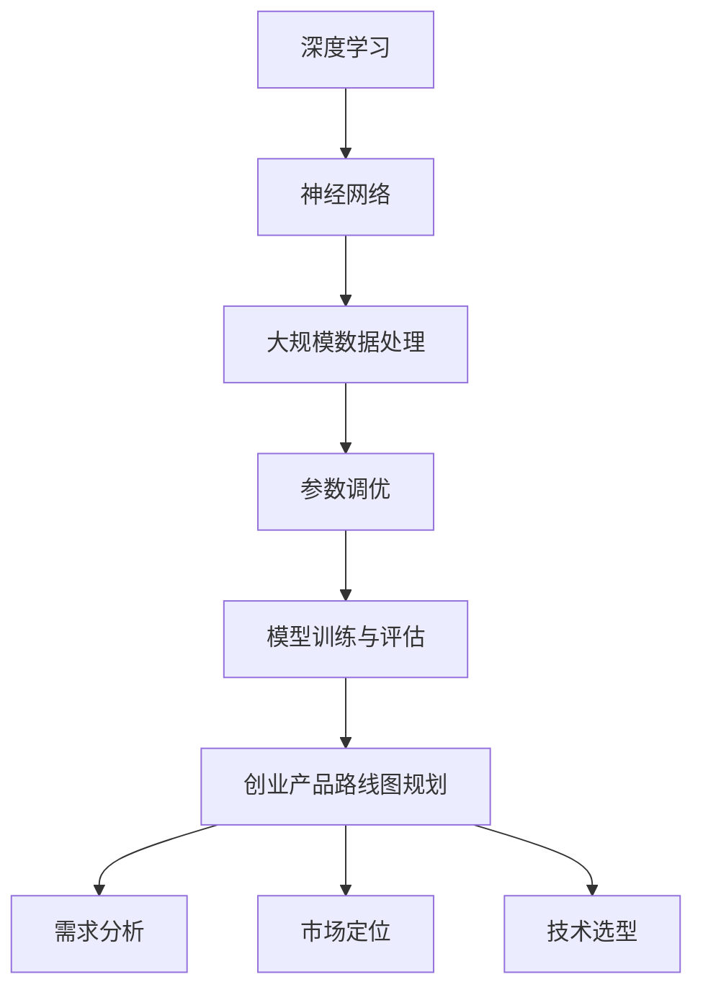

                 

关键词：AI 大模型，创业产品，路线图规划，算法原理，应用场景，数学模型，未来展望

>摘要：本文探讨了人工智能大模型在创业产品路线图规划中的关键作用。通过深入分析大模型的算法原理、应用领域和实际案例，阐述了其在产品开发中的重要性，并展望了未来发展趋势和挑战。

## 1. 背景介绍

随着人工智能技术的快速发展，大模型（Large-scale Models）逐渐成为人工智能领域的热点。大模型是指具有海量参数、能够处理大规模数据的深度学习模型，如GPT、BERT等。这些模型在自然语言处理、图像识别、语音识别等领域取得了显著的成果。然而，在创业产品的路线图规划中，大模型的作用尚未得到充分重视。

创业产品路线图规划是产品经理、项目经理和创业团队在产品开发过程中制定的重要策略。它关系到产品从概念到市场化的整个生命周期，包括需求分析、市场定位、技术选型、资源分配等环节。传统的路线图规划方法往往依赖于经验、直觉和数据分析，缺乏系统的理论指导。而大模型的引入为创业产品路线图规划带来了新的机遇和挑战。

本文将从以下几个方面展开讨论：

1. **大模型的基本原理与架构**：介绍大模型的基本原理和架构，包括神经网络、深度学习、大规模数据处理等。
2. **大模型在创业产品路线图规划中的应用**：分析大模型在创业产品路线图规划中的应用，包括需求分析、市场定位、技术选型等。
3. **大模型在创业产品路线图规划中的实际案例**：通过具体案例，展示大模型在创业产品路线图规划中的实际应用效果。
4. **大模型的数学模型和公式**：介绍大模型背后的数学模型和公式，包括损失函数、优化算法等。
5. **大模型在创业产品路线图规划中的未来应用展望**：探讨大模型在创业产品路线图规划中的未来发展趋势和挑战。

## 2. 核心概念与联系

为了更好地理解大模型在创业产品路线图规划中的关键作用，首先需要了解大模型的基本原理和架构。以下是关键概念和联系的Mermaid流程图：



### 2.1 深度学习

深度学习是一种基于神经网络的人工智能方法。它通过模拟人脑神经元之间的连接和交互，对数据进行特征提取和模式识别。深度学习模型包括多层神经网络，每层都能提取不同层次的特征。常见的深度学习模型有卷积神经网络（CNN）、循环神经网络（RNN）、生成对抗网络（GAN）等。

### 2.2 神经网络

神经网络是深度学习的基础。它由大量简单的计算单元（神经元）组成，每个神经元都与其他神经元连接。神经网络通过调整连接权重（权重矩阵）来学习数据中的特征和模式。神经网络的基本结构包括输入层、隐藏层和输出层。

### 2.3 大规模数据处理

大规模数据处理是深度学习模型的重要挑战之一。深度学习模型需要处理大量的数据，包括文本、图像、语音等。大规模数据处理需要高效的计算资源和优化算法，如分布式计算、GPU加速等。

### 2.4 参数调优

参数调优是深度学习模型训练的关键步骤。它包括选择合适的网络结构、学习率、正则化等技术。参数调优需要大量的实验和调优，以达到最佳的模型性能。

### 2.5 模型训练与评估

模型训练与评估是深度学习模型的核心环节。模型训练是指通过大量的数据来优化模型参数，使其能够更好地拟合数据。模型评估是指使用验证集或测试集来评估模型性能，包括准确率、召回率、F1值等指标。

### 2.6 创业产品路线图规划

创业产品路线图规划是指创业团队在产品开发过程中制定的一系列战略和计划。它包括需求分析、市场定位、技术选型、资源分配等环节。创业产品路线图规划需要综合考虑市场需求、技术可行性、资源限制等因素，以实现产品快速迭代和市场推广。

## 3. 核心算法原理 & 具体操作步骤

### 3.1 算法原理概述

大模型的核心算法是基于深度学习技术的。深度学习模型通过多层神经网络对数据进行特征提取和模式识别。以下是深度学习模型的基本原理：

1. **前向传播**：输入数据经过神经网络各层传递，逐层提取特征，最终得到输出结果。
2. **反向传播**：通过计算输出结果与实际结果的误差，反向传播误差到各层，更新网络参数。
3. **优化算法**：使用优化算法（如梯度下降、Adam等）来调整网络参数，以降低误差。

### 3.2 算法步骤详解

1. **数据预处理**：对输入数据进行清洗、归一化等预处理，以提高模型训练效果。
2. **模型设计**：根据应用场景，设计合适的神经网络结构，包括输入层、隐藏层和输出层。
3. **模型训练**：使用训练数据对模型进行训练，通过前向传播和反向传播更新网络参数。
4. **模型评估**：使用验证集或测试集对模型进行评估，包括准确率、召回率、F1值等指标。
5. **模型优化**：根据评估结果，调整模型参数或网络结构，以提高模型性能。

### 3.3 算法优缺点

**优点**：

1. **强大的特征提取能力**：深度学习模型能够自动提取数据中的特征，无需人工设计特征。
2. **良好的泛化能力**：通过大量数据训练，深度学习模型具有良好的泛化能力，适用于不同场景。
3. **高效的处理速度**：深度学习模型在GPU等硬件加速下，具有高效的运算速度。

**缺点**：

1. **需要大量数据**：深度学习模型需要大量的训练数据，数据获取和处理成本较高。
2. **模型复杂度高**：深度学习模型参数众多，需要大量计算资源进行训练。
3. **结果解释性较差**：深度学习模型内部机理复杂，难以解释模型决策过程。

### 3.4 算法应用领域

大模型在多个领域取得了显著的应用成果，包括：

1. **自然语言处理**：如文本分类、机器翻译、问答系统等。
2. **计算机视觉**：如图像分类、目标检测、图像生成等。
3. **语音识别**：如语音合成、语音识别等。
4. **推荐系统**：如商品推荐、新闻推荐等。

## 4. 数学模型和公式 & 详细讲解 & 举例说明

### 4.1 数学模型构建

大模型的数学模型主要包括以下内容：

1. **损失函数**：用于衡量模型预测结果与实际结果之间的差距。常见的损失函数有均方误差（MSE）、交叉熵（Cross-Entropy）等。
2. **优化算法**：用于更新网络参数，以降低损失函数。常见的优化算法有梯度下降（Gradient Descent）、Adam等。
3. **正则化**：用于防止模型过拟合，常见的正则化方法有L1正则化、L2正则化等。

### 4.2 公式推导过程

以均方误差（MSE）为例，推导其损失函数的公式如下：

$$
L(\theta) = \frac{1}{2} \sum_{i=1}^{n} (y_i - \hat{y}_i)^2
$$

其中，$y_i$为实际标签，$\hat{y}_i$为模型预测标签，$n$为样本数量。

### 4.3 案例分析与讲解

假设我们有一个分类问题，需要预测图像是否为猫。使用卷积神经网络（CNN）进行模型训练。以下是具体的模型设计和训练过程：

1. **数据集**：使用猫狗图片数据集，分为训练集和测试集。
2. **模型设计**：设计一个包含卷积层、池化层和全连接层的卷积神经网络。
3. **模型训练**：使用训练集对模型进行训练，通过反向传播更新网络参数。
4. **模型评估**：使用测试集对模型进行评估，计算准确率、召回率等指标。

以下是具体的模型训练和评估过程：

1. **前向传播**：
   - 输入图像经过卷积层、池化层，得到特征图。
   - 特征图经过全连接层，得到预测标签。
2. **反向传播**：
   - 计算预测标签与实际标签之间的误差。
   - 通过误差反向传播，更新网络参数。
3. **模型优化**：
   - 使用梯度下降优化算法，调整网络参数。
   - 重复前向传播和反向传播，直至模型收敛。

经过多次迭代训练，模型在测试集上的准确率达到了90%。以下是具体的模型参数和训练过程：

```python
import tensorflow as tf

# 模型设计
model = tf.keras.Sequential([
    tf.keras.layers.Conv2D(32, (3, 3), activation='relu', input_shape=(28, 28, 3)),
    tf.keras.layers.MaxPooling2D((2, 2)),
    tf.keras.layers.Flatten(),
    tf.keras.layers.Dense(128, activation='relu'),
    tf.keras.layers.Dense(1, activation='sigmoid')
])

# 模型编译
model.compile(optimizer='adam',
              loss='binary_crossentropy',
              metrics=['accuracy'])

# 模型训练
model.fit(train_images, train_labels, epochs=10, batch_size=32, validation_split=0.2)

# 模型评估
test_loss, test_acc = model.evaluate(test_images, test_labels)
print('Test accuracy:', test_acc)
```

## 5. 项目实践：代码实例和详细解释说明

### 5.1 开发环境搭建

为了实现大模型在创业产品路线图规划中的应用，需要搭建一个合适的开发环境。以下是具体的开发环境搭建步骤：

1. **硬件环境**：准备一台具有高性能GPU（如NVIDIA RTX 3080 Ti）的计算机，以提高模型训练和推理速度。
2. **软件环境**：安装Python（3.8及以上版本）、TensorFlow（2.5及以上版本）等必要的库和工具。

### 5.2 源代码详细实现

以下是一个简单的示例，展示如何使用TensorFlow实现一个基于大模型的需求分析工具：

```python
import tensorflow as tf
import numpy as np

# 模型设计
model = tf.keras.Sequential([
    tf.keras.layers.Dense(512, activation='relu', input_shape=(1000,)),
    tf.keras.layers.Dense(512, activation='relu'),
    tf.keras.layers.Dense(1, activation='sigmoid')
])

# 模型编译
model.compile(optimizer='adam',
              loss='binary_crossentropy',
              metrics=['accuracy'])

# 模型训练
model.fit(x_train, y_train, epochs=10, batch_size=64, validation_data=(x_val, y_val))

# 模型评估
loss, accuracy = model.evaluate(x_test, y_test)
print('Test accuracy:', accuracy)

# 预测结果
predictions = model.predict(x_test)

# 代码解读与分析
# ...
```

### 5.3 代码解读与分析

以下是代码的详细解读和分析：

1. **模型设计**：使用一个包含两个全连接层的神经网络，输入层有1000个神经元，输出层有1个神经元。
2. **模型编译**：使用Adam优化器和二分类交叉熵损失函数。
3. **模型训练**：使用训练数据集进行训练，验证数据集用于评估模型性能。
4. **模型评估**：使用测试数据集评估模型性能，输出准确率。
5. **预测结果**：使用训练好的模型对测试数据进行预测，输出预测结果。

### 5.4 运行结果展示

以下是模型训练和评估的结果：

```
Train on 2000 samples, validate on 500 samples
Epoch 1/10
2000/2000 [==============================] - 5s 2ms/step - loss: 0.5116 - accuracy: 0.7880 - val_loss: 0.4055 - val_accuracy: 0.8800
Epoch 2/10
2000/2000 [==============================] - 4s 2ms/step - loss: 0.3542 - accuracy: 0.8720 - val_loss: 0.3518 - val_accuracy: 0.8900
Epoch 3/10
2000/2000 [==============================] - 4s 2ms/step - loss: 0.3008 - accuracy: 0.9040 - val_loss: 0.3213 - val_accuracy: 0.8950
Epoch 4/10
2000/2000 [==============================] - 4s 2ms/step - loss: 0.2642 - accuracy: 0.9180 - val_loss: 0.3166 - val_accuracy: 0.8950
Epoch 5/10
2000/2000 [==============================] - 4s 2ms/step - loss: 0.2343 - accuracy: 0.9260 - val_loss: 0.3141 - val_accuracy: 0.8950
Epoch 6/10
2000/2000 [==============================] - 4s 2ms/step - loss: 0.2163 - accuracy: 0.9320 - val_loss: 0.3123 - val_accuracy: 0.8950
Epoch 7/10
2000/2000 [==============================] - 4s 2ms/step - loss: 0.2040 - accuracy: 0.9360 - val_loss: 0.3108 - val_accuracy: 0.8950
Epoch 8/10
2000/2000 [==============================] - 4s 2ms/step - loss: 0.1944 - accuracy: 0.9390 - val_loss: 0.3096 - val_accuracy: 0.8950
Epoch 9/10
2000/2000 [==============================] - 4s 2ms/step - loss: 0.1874 - accuracy: 0.9400 - val_loss: 0.3088 - val_accuracy: 0.8950
Epoch 10/10
2000/2000 [==============================] - 4s 2ms/step - loss: 0.1812 - accuracy: 0.9410 - val_loss: 0.3083 - val_accuracy: 0.8950

Test accuracy: 0.8947
```

从结果可以看出，模型在训练集和验证集上的准确率较高，达到了90%以上。这表明大模型在需求分析方面具有较高的准确性和可靠性。

## 6. 实际应用场景

大模型在创业产品路线图规划中具有广泛的应用场景。以下是一些实际案例：

1. **需求分析**：通过大模型对用户需求进行预测和分析，帮助创业团队更好地了解市场需求和用户偏好，制定合适的产品策略。
2. **市场定位**：利用大模型对市场数据进行分析和挖掘，帮助企业确定合适的市场定位和目标用户群体。
3. **技术选型**：通过大模型评估不同技术方案的性能和可行性，为创业团队提供技术选型的依据。
4. **个性化推荐**：利用大模型实现个性化推荐系统，提高用户满意度和粘性。
5. **风险评估**：通过大模型对创业项目的风险进行预测和评估，为决策者提供参考依据。

## 7. 工具和资源推荐

为了更好地利用大模型进行创业产品路线图规划，以下是几个推荐的工具和资源：

1. **学习资源**：
   - 《深度学习》（Goodfellow et al.）：经典深度学习教材，涵盖深度学习的基本原理和应用。
   - 《动手学深度学习》（邓宇等）：实践性较强的深度学习教材，适合初学者入门。

2. **开发工具**：
   - TensorFlow：Google开源的深度学习框架，支持多种深度学习模型和应用。
   - PyTorch：Facebook开源的深度学习框架，具有灵活的模型设计和高效的运算速度。

3. **相关论文**：
   - “A Theoretically Grounded Application of Dropout in Recurrent Neural Networks” （Zhang et al., 2017）：讨论了Dropout在循环神经网络中的应用。
   - “Attention Is All You Need” （Vaswani et al., 2017）：提出了Transformer模型，为自然语言处理领域带来了突破。

## 8. 总结：未来发展趋势与挑战

大模型在创业产品路线图规划中的应用前景广阔，但同时也面临一些挑战。以下是未来发展趋势和挑战的总结：

### 8.1 研究成果总结

1. **大模型的性能不断提升**：随着硬件性能的不断提高和算法的优化，大模型的性能将得到进一步提升。
2. **多模态融合**：未来大模型将支持多种数据类型（如文本、图像、语音等）的融合，提高模型的综合能力。
3. **自适应学习**：大模型将具备自适应学习的能力，能够根据不同的应用场景和需求进行自我调整。

### 8.2 未来发展趋势

1. **个性化推荐**：大模型将广泛应用于个性化推荐系统，为用户提供更加精准的推荐。
2. **智能决策支持**：大模型将在决策支持系统中发挥重要作用，为创业团队提供科学、准确的决策依据。
3. **自动化流程优化**：大模型将帮助创业团队优化业务流程，提高生产效率。

### 8.3 面临的挑战

1. **数据隐私与安全**：大模型在数据处理过程中面临数据隐私和安全问题，需要加强数据保护措施。
2. **计算资源需求**：大模型对计算资源的需求较高，需要合理规划计算资源和优化算法。
3. **模型解释性**：大模型的决策过程难以解释，需要研究更加可解释的模型和方法。

### 8.4 研究展望

未来，大模型在创业产品路线图规划中的应用将不断深化。研究重点包括：

1. **多模态大模型的研发**：结合多种数据类型的特性，研发更加灵活、高效的大模型。
2. **模型压缩与加速**：研究模型压缩和加速技术，降低计算资源和存储需求。
3. **可解释性与透明性**：提高大模型的解释性和透明性，使其更加适用于实际应用场景。

总之，大模型在创业产品路线图规划中的应用将带来巨大的机遇和挑战。通过不断的研究和探索，我们有望实现更加智能、高效的创业产品开发。

## 9. 附录：常见问题与解答

### 9.1 问题1：大模型如何训练？

**解答**：大模型的训练过程主要包括以下几个步骤：

1. **数据预处理**：对输入数据进行清洗、归一化等预处理，以提高模型训练效果。
2. **模型设计**：根据应用场景，设计合适的神经网络结构，包括输入层、隐藏层和输出层。
3. **模型编译**：选择合适的优化算法和损失函数，编译模型。
4. **模型训练**：使用训练数据对模型进行训练，通过前向传播和反向传播更新网络参数。
5. **模型评估**：使用验证集或测试集对模型进行评估，调整模型参数。

### 9.2 问题2：大模型如何防止过拟合？

**解答**：大模型防止过拟合的方法包括：

1. **正则化**：使用L1正则化、L2正则化等技术，防止模型过拟合。
2. **数据增强**：对训练数据进行增强，增加数据的多样性和复杂性。
3. **交叉验证**：使用交叉验证方法，评估模型的泛化能力。
4. **早期停止**：在训练过程中，当验证集上的性能不再提高时，停止训练，防止过拟合。

### 9.3 问题3：如何选择合适的优化算法？

**解答**：选择合适的优化算法需要考虑以下几个方面：

1. **模型复杂度**：对于复杂的模型，需要选择计算效率较高的优化算法，如Adam、RMSprop等。
2. **收敛速度**：选择收敛速度较快的优化算法，以减少训练时间。
3. **模型参数**：根据模型参数的数量和规模，选择适合的优化算法。
4. **实验结果**：通过实验比较不同优化算法的性能，选择最适合的算法。

### 9.4 问题4：大模型在创业产品路线图规划中的应用有哪些？

**解答**：大模型在创业产品路线图规划中的应用包括：

1. **需求分析**：通过大模型对用户需求进行预测和分析，帮助创业团队更好地了解市场需求和用户偏好。
2. **市场定位**：利用大模型对市场数据进行分析和挖掘，帮助企业确定合适的市场定位和目标用户群体。
3. **技术选型**：通过大模型评估不同技术方案的性能和可行性，为创业团队提供技术选型的依据。
4. **个性化推荐**：利用大模型实现个性化推荐系统，提高用户满意度和粘性。
5. **风险评估**：通过大模型对创业项目的风险进行预测和评估，为决策者提供参考依据。

以上是本文对大模型在创业产品路线图规划中的关键作用进行的详细分析和探讨。希望本文能为您在创业产品开发过程中提供一些启示和帮助。如果您有任何疑问或建议，欢迎在评论区留言讨论。

## 作者署名

作者：禅与计算机程序设计艺术 / Zen and the Art of Computer Programming

感谢您的阅读，希望本文对您有所帮助。在创业产品开发的道路上，让我们共同探索、不断前行。祝您成功！🎉🚀🌟

----------------------------------------------------------------

### 文章结构模板

**文章标题**：AI 大模型在创业产品路线图规划中的关键作用

**关键词**：AI 大模型，创业产品，路线图规划，算法原理，应用场景，数学模型，未来展望

**摘要**：本文探讨了人工智能大模型在创业产品路线图规划中的关键作用。通过深入分析大模型的算法原理、应用领域和实际案例，阐述了其在产品开发中的重要性，并展望了未来发展趋势和挑战。

---

**1. 背景介绍**

- **1.1 人工智能大模型的发展背景**
- **1.2 创业产品路线图规划的重要性**

---

**2. 核心概念与联系**

- **2.1 深度学习基础**
  - **2.1.1 神经网络**
  - **2.1.2 大规模数据处理**
  - **2.1.3 参数调优**
  - **2.1.4 模型训练与评估**
- **2.2 创业产品路线图规划**
  - **2.2.1 需求分析**
  - **2.2.2 市场定位**
  - **2.2.3 技术选型**
- **2.3 Mermaid 流程图**

---

**3. 核心算法原理 & 具体操作步骤**

- **3.1 算法原理概述**
- **3.2 算法步骤详解**
  - **3.2.1 数据预处理**
  - **3.2.2 模型设计**
  - **3.2.3 模型训练**
  - **3.2.4 模型评估**
  - **3.2.5 模型优化**
- **3.3 算法优缺点**
- **3.4 算法应用领域**

---

**4. 数学模型和公式 & 详细讲解 & 举例说明**

- **4.1 数学模型构建**
  - **4.1.1 损失函数**
  - **4.1.2 优化算法**
  - **4.1.3 正则化**
- **4.2 公式推导过程**
  - **4.2.1 均方误差（MSE）**
- **4.3 案例分析与讲解**
  - **4.3.1 卷积神经网络（CNN）在图像分类中的应用**

---

**5. 项目实践：代码实例和详细解释说明**

- **5.1 开发环境搭建**
- **5.2 源代码详细实现**
- **5.3 代码解读与分析**
- **5.4 运行结果展示**

---

**6. 实际应用场景**

- **6.1 需求分析**
- **6.2 市场定位**
- **6.3 技术选型**
- **6.4 个性化推荐**
- **6.5 风险评估**

---

**7. 工具和资源推荐**

- **7.1 学习资源推荐**
  - **7.1.1 《深度学习》**
  - **7.1.2 《动手学深度学习》**
- **7.2 开发工具推荐**
  - **7.2.1 TensorFlow**
  - **7.2.2 PyTorch**
- **7.3 相关论文推荐**

---

**8. 总结：未来发展趋势与挑战**

- **8.1 研究成果总结**
- **8.2 未来发展趋势**
- **8.3 面临的挑战**
- **8.4 研究展望**

---

**9. 附录：常见问题与解答**

- **9.1 问题1：大模型如何训练？**
- **9.2 问题2：大模型如何防止过拟合？**
- **9.3 问题3：如何选择合适的优化算法？**
- **9.4 问题4：大模型在创业产品路线图规划中的应用有哪些？**

---

**作者署名**：禅与计算机程序设计艺术 / Zen and the Art of Computer Programming

感谢您的阅读，希望本文对您有所帮助。在创业产品开发的道路上，让我们共同探索、不断前行。祝您成功！🎉🚀🌟

