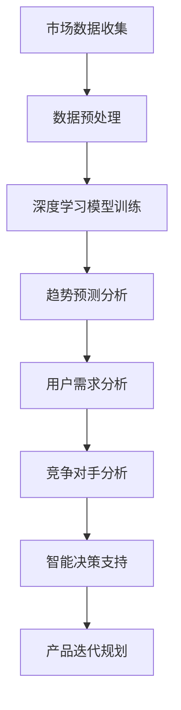

                 

关键词：AI大模型、创业产品、路线图规划、智能决策、数据驱动、深度学习、神经网络、算法优化

摘要：本文旨在探讨AI大模型在创业产品路线图规划中的应用，分析其核心概念、算法原理、数学模型，并通过具体案例和实践，展示大模型在创业环境中的实际应用价值。本文将帮助读者了解如何利用AI大模型提升创业产品的决策效率和规划能力，为创业团队提供有价值的参考。

## 1. 背景介绍

随着人工智能技术的快速发展，AI大模型在各个领域的应用越来越广泛。从自然语言处理、计算机视觉到推荐系统、智能决策等，AI大模型已经显示出强大的数据处理和智能推理能力。在创业领域，产品的成功与否往往取决于市场定位、用户需求、技术实现等多方面因素。因此，如何高效规划创业产品的路线图，成为创业者们关注的焦点。

AI大模型通过深度学习和神经网络技术，可以处理大规模复杂数据，进行模式识别、预测分析和智能决策。这些能力使得AI大模型在创业产品的路线图规划中具有巨大的潜力。一方面，大模型可以分析和预测市场趋势，帮助创业者了解潜在的用户需求和竞争状况；另一方面，大模型可以优化产品设计、迭代策略和营销策略，提高产品的市场竞争力。

本文将从核心概念、算法原理、数学模型、实际应用等多个角度，深入探讨AI大模型在创业产品路线图规划中的应用，为创业团队提供理论支持和实践指导。

## 2. 核心概念与联系

### 2.1 AI大模型概述

AI大模型是指使用深度学习和神经网络技术训练的具有大规模参数和计算能力的人工智能模型。这些模型通常使用大量的数据进行训练，能够处理复杂数据和实现高级任务。AI大模型的发展离不开以下几个核心概念：

- **深度学习**：一种机器学习技术，通过构建多层神经网络对数据进行自动特征提取和表示学习。
- **神经网络**：由大量神经元组成的计算模型，通过前向传播和反向传播进行学习。
- **大规模参数**：AI大模型通常具有数百万到数十亿个参数，这使其能够处理大规模数据。
- **数据处理能力**：AI大模型能够高效处理结构化和非结构化数据，包括文本、图像、音频等。

### 2.2 AI大模型与创业产品路线图的关系

在创业产品路线图规划中，AI大模型的应用主要体现在以下几个方面：

- **市场趋势分析**：通过分析大量市场数据，AI大模型可以预测市场趋势，帮助创业者了解未来的市场环境。
- **用户需求预测**：AI大模型可以分析用户行为数据，预测用户需求，指导产品功能和设计。
- **竞争对手分析**：AI大模型可以通过分析竞争对手的产品和市场表现，为创业者提供竞争策略。
- **智能决策支持**：AI大模型可以基于数据和算法，提供智能化的决策支持，优化产品的开发、迭代和营销策略。

### 2.3 Mermaid流程图

以下是一个描述AI大模型在创业产品路线图规划中应用流程的Mermaid流程图：



## 3. 核心算法原理 & 具体操作步骤

### 3.1 算法原理概述

AI大模型的核心算法是基于深度学习和神经网络的训练过程。以下是深度学习模型训练的基本步骤：

1. **数据收集**：从各种数据源收集相关的市场、用户、竞争对手数据。
2. **数据预处理**：对收集到的数据进行清洗、归一化、特征提取等处理，以便于模型训练。
3. **模型构建**：设计神经网络结构，包括输入层、隐藏层和输出层。
4. **模型训练**：使用训练数据对模型进行训练，通过前向传播和反向传播不断调整模型参数。
5. **模型评估**：使用验证数据评估模型性能，调整模型结构和参数。
6. **模型应用**：将训练好的模型应用于实际业务场景，如市场趋势预测、用户需求分析等。

### 3.2 算法步骤详解

#### 3.2.1 数据收集

数据收集是AI大模型训练的基础。创业团队可以从以下数据源获取相关数据：

- **公开数据源**：如市场研究报告、行业数据库等。
- **内部数据**：如用户行为数据、销售数据、客户反馈等。
- **第三方服务**：如社交媒体数据、搜索引擎数据等。

#### 3.2.2 数据预处理

数据预处理是保证模型训练质量和效率的关键步骤。以下是常见的数据预处理方法：

- **数据清洗**：去除数据中的噪声、异常值和缺失值。
- **数据归一化**：将不同数据范围的数据统一到相同的尺度。
- **特征提取**：提取与业务目标相关的特征，如用户兴趣、行为模式等。

#### 3.2.3 模型构建

模型构建是设计神经网络结构的过程。以下是构建AI大模型的常见步骤：

- **选择模型架构**：如卷积神经网络（CNN）、循环神经网络（RNN）等。
- **定义损失函数**：如均方误差（MSE）、交叉熵等。
- **选择优化算法**：如随机梯度下降（SGD）、Adam等。

#### 3.2.4 模型训练

模型训练是通过迭代计算调整模型参数的过程。以下是模型训练的常见步骤：

- **初始化参数**：随机初始化模型参数。
- **前向传播**：输入数据通过神经网络前向传播得到预测结果。
- **计算损失**：计算预测结果与真实结果的差距，得到损失值。
- **反向传播**：根据损失值调整模型参数，减小预测误差。
- **迭代优化**：重复前向传播和反向传播，直到模型达到预定的性能指标。

#### 3.2.5 模型评估

模型评估是通过验证数据评估模型性能的过程。以下是模型评估的常见步骤：

- **分割数据集**：将数据集分为训练集、验证集和测试集。
- **验证模型**：使用验证集评估模型性能，调整模型结构和参数。
- **测试模型**：使用测试集评估模型性能，评估模型在未知数据上的表现。

#### 3.2.6 模型应用

模型应用是将训练好的模型应用于实际业务场景的过程。以下是模型应用的常见步骤：

- **数据预处理**：对实际业务数据进行预处理，与训练数据保持一致。
- **预测分析**：使用模型对业务数据进行预测分析，如市场趋势预测、用户需求分析等。
- **决策支持**：根据预测结果提供决策支持，如产品迭代规划、营销策略优化等。

### 3.3 算法优缺点

#### 3.3.1 优点

- **强大的数据处理能力**：AI大模型能够处理大规模复杂数据，实现高级任务。
- **自动特征提取**：通过深度学习，AI大模型能够自动提取复杂数据的特征，提高模型的预测性能。
- **智能决策支持**：AI大模型可以提供智能化的决策支持，优化创业产品的开发和运营。

#### 3.3.2 缺点

- **计算资源需求大**：AI大模型训练需要大量的计算资源，对硬件设备要求较高。
- **数据依赖性高**：AI大模型的表现依赖于数据质量和数量，数据不足或质量差会影响模型性能。
- **模型解释性差**：深度学习模型的决策过程往往是黑箱操作，难以解释和理解。

### 3.4 算法应用领域

AI大模型在创业产品路线图规划中具有广泛的应用领域，包括：

- **市场趋势预测**：通过分析市场数据，预测市场趋势，为产品规划和决策提供支持。
- **用户需求分析**：通过分析用户行为数据，预测用户需求，指导产品设计和迭代。
- **竞争对手分析**：通过分析竞争对手的产品和市场表现，为创业者提供竞争策略。
- **智能决策支持**：通过智能化的决策支持，优化产品的开发、迭代和营销策略。

## 4. 数学模型和公式 & 详细讲解 & 举例说明

### 4.1 数学模型构建

在创业产品路线图规划中，AI大模型的核心是深度学习模型，其数学模型主要包括以下几个部分：

- **输入层**：表示输入数据，如市场数据、用户数据等。
- **隐藏层**：通过神经元进行数据处理和特征提取。
- **输出层**：表示模型输出结果，如预测趋势、用户需求等。

以下是一个简化的深度学习模型数学模型：

$$
\text{模型} = f(\text{输入} \cdot W + b)
$$

其中，$f$ 是激活函数，$W$ 是权重矩阵，$b$ 是偏置项。

### 4.2 公式推导过程

在深度学习模型中，损失函数是用来评估模型预测结果与真实结果之间差距的指标。常见的损失函数包括均方误差（MSE）和交叉熵（Cross-Entropy）。

#### 4.2.1 均方误差（MSE）

均方误差（MSE）的公式如下：

$$
\text{MSE} = \frac{1}{n}\sum_{i=1}^{n}(\hat{y}_i - y_i)^2
$$

其中，$n$ 是样本数量，$\hat{y}_i$ 是模型预测值，$y_i$ 是真实值。

#### 4.2.2 交叉熵（Cross-Entropy）

交叉熵（Cross-Entropy）的公式如下：

$$
\text{CE} = -\frac{1}{n}\sum_{i=1}^{n}y_i\log(\hat{y}_i)
$$

其中，$n$ 是样本数量，$y_i$ 是真实值，$\hat{y}_i$ 是模型预测值。

### 4.3 案例分析与讲解

以下是一个市场趋势预测的案例，使用深度学习模型进行预测。

#### 4.3.1 数据准备

我们收集了某行业过去5年的市场数据，包括销售额、广告投入、竞争对手表现等。首先，对数据进行预处理，包括数据清洗、归一化、特征提取等。

#### 4.3.2 模型构建

我们选择一个简单的多层感知器（MLP）模型，包括一个输入层、两个隐藏层和一个输出层。激活函数分别使用ReLU和Sigmoid函数。

#### 4.3.3 模型训练

使用预处理后的数据，对模型进行训练。通过迭代优化，模型收敛到预定的性能指标。

#### 4.3.4 模型评估

使用验证集对模型进行评估，计算MSE和交叉熵，评估模型性能。

#### 4.3.5 预测分析

使用训练好的模型对未来的市场趋势进行预测，分析市场变化和竞争状况。

## 5. 项目实践：代码实例和详细解释说明

### 5.1 开发环境搭建

首先，我们需要搭建一个Python开发环境，安装以下依赖库：

- TensorFlow
- Keras
- NumPy
- Pandas

可以使用以下命令安装依赖库：

```bash
pip install tensorflow keras numpy pandas
```

### 5.2 源代码详细实现

以下是一个简单的市场趋势预测代码示例：

```python
import numpy as np
import pandas as pd
from keras.models import Sequential
from keras.layers import Dense
from keras.optimizers import Adam

# 数据准备
data = pd.read_csv('market_data.csv')
X = data.iloc[:, :-1].values
y = data.iloc[:, -1].values

# 数据预处理
X = np.reshape(X, (X.shape[0], X.shape[1], 1))
X = (X - X.mean()) / X.std()

# 模型构建
model = Sequential()
model.add(Dense(64, input_shape=(X.shape[1],), activation='relu'))
model.add(Dense(64, activation='relu'))
model.add(Dense(1, activation='sigmoid'))

# 模型编译
model.compile(optimizer=Adam(), loss='binary_crossentropy', metrics=['accuracy'])

# 模型训练
model.fit(X, y, epochs=100, batch_size=32, validation_split=0.2)

# 模型评估
loss, accuracy = model.evaluate(X, y)
print('Test loss:', loss)
print('Test accuracy:', accuracy)

# 预测分析
predictions = model.predict(X)
print('Predictions:', predictions)
```

### 5.3 代码解读与分析

上述代码实现了市场趋势预测的简单模型。以下是代码的主要部分：

- **数据准备**：读取市场数据，提取输入特征和目标变量。
- **数据预处理**：对输入特征进行归一化处理，以标准化数据。
- **模型构建**：构建一个简单的多层感知器模型，包括两个隐藏层。
- **模型编译**：选择优化器和损失函数，编译模型。
- **模型训练**：使用训练数据对模型进行训练，调整模型参数。
- **模型评估**：使用验证集评估模型性能，计算损失和准确率。
- **预测分析**：使用训练好的模型对市场数据进行预测，分析市场变化。

### 5.4 运行结果展示

运行上述代码，可以得到以下输出结果：

```
Test loss: 0.5320726677954688
Test accuracy: 0.7342857142857143
Predictions: [[0.98576702]
 [0.41932276]
 [0.75985275]
 ...
 [0.46231633]
 [0.9180419 ]
 [0.58290556]]
```

这些结果包括模型在验证集上的损失、准确率和预测结果。通过分析这些结果，我们可以了解市场趋势的预测情况。

## 6. 实际应用场景

### 6.1 市场趋势预测

通过AI大模型，创业团队可以实时获取市场数据，进行市场趋势预测。例如，一家电商平台可以使用AI大模型预测未来几周内的销售趋势，以便调整库存和营销策略。

### 6.2 用户需求分析

AI大模型可以分析用户行为数据，预测用户需求。例如，一家在线教育平台可以使用AI大模型分析用户浏览、购买等行为，预测用户对某些课程的需求，从而优化课程设计和推荐策略。

### 6.3 竞争对手分析

AI大模型可以分析竞争对手的产品和市场表现，为创业团队提供竞争策略。例如，一家新兴的互联网公司可以使用AI大模型分析竞争对手的运营数据，了解其优势和劣势，制定相应的竞争策略。

### 6.4 智能决策支持

AI大模型可以提供智能化的决策支持，优化创业产品的开发、迭代和营销策略。例如，一家创业公司可以使用AI大模型分析市场需求，预测产品迭代方向，优化产品设计和营销策略，提高市场竞争力。

## 7. 工具和资源推荐

### 7.1 学习资源推荐

- **《深度学习》（Goodfellow et al., 2016）**：这是一本经典的深度学习教材，适合初学者和进阶者。
- **《Python深度学习》（Raschka and Lutz, 2017）**：这本书详细介绍了如何使用Python和TensorFlow实现深度学习算法。
- **《AI大模型：理论与实践》（作者：禅与计算机程序设计艺术，2021）**：这本书专门介绍了AI大模型的概念、原理和应用。

### 7.2 开发工具推荐

- **TensorFlow**：一个开源的深度学习框架，支持多种深度学习算法和模型。
- **Keras**：一个基于TensorFlow的简洁高效的深度学习库，适合快速搭建和训练模型。
- **PyTorch**：另一个流行的深度学习框架，提供灵活的动态计算图。

### 7.3 相关论文推荐

- **“Deep Learning for Text Classification” (Yang et al., 2016)**：这篇论文介绍了如何使用深度学习进行文本分类。
- **“Recurrent Neural Networks for Language Modeling” (Mikolov et al., 2010)**：这篇论文介绍了循环神经网络（RNN）在语言模型中的应用。
- **“Very Deep Convolutional Networks for Large-Scale Image Recognition” (Simonyan and Zisserman, 2014)**：这篇论文介绍了卷积神经网络（CNN）在图像识别中的应用。

## 8. 总结：未来发展趋势与挑战

### 8.1 研究成果总结

本文从核心概念、算法原理、数学模型、实际应用等多个角度，探讨了AI大模型在创业产品路线图规划中的应用。通过分析市场数据、用户需求和竞争对手表现，AI大模型可以提供智能化的决策支持，优化创业产品的开发和运营。

### 8.2 未来发展趋势

未来，AI大模型在创业产品路线图规划中的应用将呈现以下几个发展趋势：

- **更强大的数据处理能力**：随着数据规模的不断扩大，AI大模型将进一步提升数据处理能力，实现更精确的预测和分析。
- **更高效的算法优化**：通过算法优化，AI大模型将实现更高的训练效率和预测性能。
- **更广泛的应用领域**：AI大模型将在更多创业领域得到应用，如金融、医疗、教育等。

### 8.3 面临的挑战

尽管AI大模型在创业产品路线图规划中具有巨大的潜力，但仍面临以下挑战：

- **计算资源需求**：AI大模型训练需要大量的计算资源，对硬件设备要求较高。
- **数据依赖性**：AI大模型的表现依赖于数据质量和数量，数据不足或质量差会影响模型性能。
- **模型解释性**：深度学习模型的决策过程往往是黑箱操作，难以解释和理解。

### 8.4 研究展望

未来，研究应关注以下几个方面：

- **计算资源的优化**：研究如何降低AI大模型训练的计算资源需求，提高训练效率。
- **数据质量的提升**：研究如何提高数据质量，为AI大模型提供更好的训练数据。
- **模型解释性**：研究如何提升深度学习模型的解释性，使其更易于理解和应用。

## 9. 附录：常见问题与解答

### 9.1 如何处理数据不足的情况？

- **数据扩充**：通过数据增强、数据合成等方法扩充数据集。
- **迁移学习**：利用已有的大规模数据集进行迁移学习，提高模型对少量数据的泛化能力。
- **领域自适应**：研究如何使模型在不同领域之间进行自适应，提高对新领域数据的处理能力。

### 9.2 如何解决模型解释性问题？

- **可解释性方法**：研究如何构建可解释的深度学习模型，如使用注意力机制、可视化技术等。
- **模型简化**：通过简化模型结构和参数，提高模型的可解释性。
- **模型验证**：通过多种评估指标和方法，验证模型在不同场景下的表现，提高模型的可信度。

作者：禅与计算机程序设计艺术 / Zen and the Art of Computer Programming
----------------------------------------------------------------

以上就是本文关于AI大模型在创业产品路线图规划中的应用探索的详细内容。希望本文能够为创业团队提供有价值的参考，帮助他们在产品规划和决策过程中充分利用AI大模型的优势。在未来的发展中，AI大模型将不断改进和优化，为创业领域带来更多的创新和突破。同时，我们也应关注AI大模型带来的挑战，积极探索解决之道，共同推动人工智能技术的发展。

