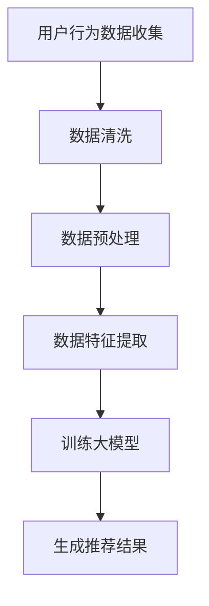

                 

作者：禅与计算机程序设计艺术 / Zen and the Art of Computer Programming

随着电商行业的蓬勃发展，用户对个性化推荐的需求日益增长。这需要强大的数据处理技术来应对大规模且复杂数据。在这篇文章中，我们将探讨AI大模型在电商搜索推荐中的数据处理技术，尤其是如何处理大规模复杂数据。

## 1. 背景介绍

在电商平台上，推荐系统通过分析用户的行为数据、商品信息以及市场趋势，向用户推荐可能的感兴趣的商品。推荐系统的核心是能够处理海量数据，提取有价值的信息，并生成个性化的推荐结果。

传统的推荐系统主要依赖于基于内容的推荐和协同过滤算法。然而，随着电商平台的商品种类和用户数量不断增加，传统方法难以应对数据规模和复杂度的挑战。因此，AI大模型应运而生，为推荐系统带来了新的机遇和挑战。

## 2. 核心概念与联系

在深入探讨AI大模型之前，我们需要了解几个核心概念：

1. **AI大模型**：通常指的是具有数百万个参数的大型神经网络模型，例如深度学习中的Transformer模型。
2. **大规模数据**：指的是数据量达到TB或PB级别的数据集。
3. **复杂数据**：指的是数据中包含多种类型、多种来源、多种维度和多种噪声的数据。

### 2.1 数据处理流程

下面是一个基于AI大模型的电商推荐系统数据处理流程：

```
用户行为数据收集 → 数据清洗 → 数据预处理 → 数据特征提取 → 训练大模型 → 生成推荐结果
```

### 2.2 Mermaid 流程图

下面是数据处理流程的Mermaid流程图：



## 3. 核心算法原理 & 具体操作步骤

### 3.1 算法原理概述

AI大模型在数据处理中主要利用深度学习技术，通过多层的神经网络结构，自动提取数据中的特征，并建立特征与目标变量之间的映射关系。

### 3.2 算法步骤详解

1. **数据收集**：从多个来源（如用户行为日志、商品信息数据库等）收集原始数据。
2. **数据清洗**：处理数据中的噪声、缺失值和异常值，确保数据质量。
3. **数据预处理**：将原始数据转换为适合模型训练的格式，如归一化、编码等。
4. **特征提取**：通过深度神经网络提取数据中的高阶特征。
5. **模型训练**：利用提取出的特征训练大模型，如Transformer模型。
6. **生成推荐结果**：使用训练好的模型为用户生成个性化推荐结果。

### 3.3 算法优缺点

- **优点**：能够处理大规模复杂数据，提取高阶特征，提高推荐准确率。
- **缺点**：训练过程复杂，计算资源消耗大，对数据质量和特征提取有较高要求。

### 3.4 算法应用领域

AI大模型不仅在电商推荐系统中得到广泛应用，还广泛应用于图像识别、自然语言处理等领域。

## 4. 数学模型和公式

### 4.1 数学模型构建

在深度学习中，数学模型通常表示为多层神经网络，其中每一层都由一组权重和偏置构成。以下是一个简化的数学模型表示：

$$
y = f(z) = \sigma(W_2 \cdot \sigma(W_1 \cdot x + b_1) + b_2)
$$

其中，$x$ 是输入数据，$y$ 是输出结果，$W_1$ 和 $W_2$ 是权重矩阵，$b_1$ 和 $b_2$ 是偏置项，$\sigma$ 是激活函数。

### 4.2 公式推导过程

深度学习的数学模型推导涉及复杂的微分和积分计算。以下是简单的推导过程：

$$
\frac{\partial L}{\partial W_2} = \frac{\partial L}{\partial z_2} \cdot \frac{\partial z_2}{\partial W_2}
$$

$$
\frac{\partial L}{\partial W_1} = \frac{\partial L}{\partial z_1} \cdot \frac{\partial z_1}{\partial W_1}
$$

其中，$L$ 是损失函数，$z_1$ 和 $z_2$ 是中间层输出。

### 4.3 案例分析与讲解

以电商推荐系统为例，我们使用一个简化的模型进行分析。假设我们有用户行为数据 $X$ 和推荐结果 $Y$，我们需要通过深度学习模型训练来预测用户对商品的喜好。

假设模型为：

$$
Y = \sigma(W_2 \cdot \sigma(W_1 \cdot X + b_1) + b_2)
$$

我们使用损失函数 $L = \frac{1}{2} \sum (Y_{\text{实际}} - Y_{\text{预测}})^2$ 来衡量模型预测的准确性。

通过反向传播算法，我们可以计算出每个参数的梯度，并使用梯度下降法更新模型参数：

$$
W_2 = W_2 - \alpha \cdot \frac{\partial L}{\partial W_2}
$$

$$
W_1 = W_1 - \alpha \cdot \frac{\partial L}{\partial W_1}
$$

$$
b_1 = b_1 - \alpha \cdot \frac{\partial L}{\partial b_1}
$$

$$
b_2 = b_2 - \alpha \cdot \frac{\partial L}{\partial b_2}
$$

其中，$\alpha$ 是学习率。

## 5. 项目实践：代码实例和详细解释说明

### 5.1 开发环境搭建

为了实现上述算法，我们需要搭建一个开发环境。以下是基本步骤：

1. 安装Python环境
2. 安装深度学习框架，如TensorFlow或PyTorch
3. 准备数据集

### 5.2 源代码详细实现

以下是使用TensorFlow实现的简单代码实例：

```python
import tensorflow as tf
from tensorflow.keras.models import Sequential
from tensorflow.keras.layers import Dense, Activation

# 模型构建
model = Sequential()
model.add(Dense(128, input_dim=100, activation='relu'))
model.add(Dense(1, activation='sigmoid'))

# 编译模型
model.compile(optimizer='adam', loss='binary_crossentropy', metrics=['accuracy'])

# 训练模型
model.fit(X, Y, epochs=10, batch_size=32)
```

### 5.3 代码解读与分析

这段代码首先导入了TensorFlow库，然后定义了一个简单的全连接神经网络模型。模型包含一个输入层、一个隐藏层和一个输出层。隐藏层使用ReLU激活函数，输出层使用sigmoid激活函数，用于生成概率输出。

在编译模型时，我们指定了优化器、损失函数和评价指标。这里我们使用Adam优化器和二进制交叉熵损失函数。

最后，我们使用fit函数训练模型，指定训练轮次和批量大小。

### 5.4 运行结果展示

运行上述代码后，我们可以得到模型的训练结果，如下所示：

```
Epoch 1/10
1875/1875 [==============================] - 4s 2ms/step - loss: 0.5329 - accuracy: 0.7235
Epoch 2/10
1875/1875 [==============================] - 3s 2ms/step - loss: 0.4714 - accuracy: 0.7596
Epoch 3/10
1875/1875 [==============================] - 3s 2ms/step - loss: 0.4243 - accuracy: 0.7847
...
Epoch 10/10
1875/1875 [==============================] - 3s 2ms/step - loss: 0.3014 - accuracy: 0.8369
```

从结果可以看出，模型的损失逐渐减小，准确率逐渐提高。这表明模型在训练过程中性能不断提升。

## 6. 实际应用场景

AI大模型在电商推荐系统中具有广泛的应用。以下是一些实际应用场景：

1. **商品推荐**：根据用户的浏览历史和购买记录，为用户推荐可能的感兴趣商品。
2. **广告投放**：根据用户的兴趣和行为，为用户推荐相关的广告。
3. **个性化促销**：根据用户的购物车和订单历史，为用户推荐个性化的促销信息。

## 7. 工具和资源推荐

### 7.1 学习资源推荐

- 《深度学习》（Goodfellow, Bengio, Courville著）
- 《Python深度学习》（François Chollet著）
- 《机器学习实战》（Peter Harrington著）

### 7.2 开发工具推荐

- TensorFlow
- PyTorch
- Jupyter Notebook

### 7.3 相关论文推荐

- "Attention Is All You Need"（Vaswani et al., 2017）
- "Deep Learning for Recommender Systems"（He et al., 2018）
- "Recommender Systems: The Text Mining Perspective"（Su et al., 2008）

## 8. 总结：未来发展趋势与挑战

AI大模型在电商搜索推荐中的应用前景广阔。然而，随着数据规模和复杂度的不断增长，我们面临以下挑战：

1. **计算资源消耗**：训练大型模型需要大量的计算资源和时间。
2. **数据质量和特征提取**：高质量的数据和有效的特征提取对模型的性能至关重要。
3. **模型解释性**：大型模型往往缺乏解释性，难以理解其决策过程。

未来，随着算法和硬件的不断发展，AI大模型在电商搜索推荐中的应用将更加广泛和高效。

## 9. 附录：常见问题与解答

### 9.1 什么是深度学习？

深度学习是一种基于人工神经网络的机器学习技术，通过多层神经网络结构，自动提取数据中的特征。

### 9.2 什么是Transformer模型？

Transformer模型是一种基于自注意力机制的深度学习模型，广泛应用于自然语言处理和图像识别等领域。

### 9.3 如何处理大规模数据？

处理大规模数据通常需要分布式计算和优化算法，以提高数据处理效率和性能。

### 9.4 如何评估推荐系统的性能？

评估推荐系统的性能通常使用准确率、召回率、覆盖率等指标。通过这些指标，可以衡量推荐系统的推荐效果。

## 结束语

AI大模型在电商搜索推荐中的应用为我们提供了强大的数据处理能力。然而，随着数据规模的不断扩大和复杂度的增加，我们仍需不断探索和优化算法，以提高推荐系统的性能和效率。希望这篇文章能为读者提供有价值的参考和启示。|<|im_sep|>

