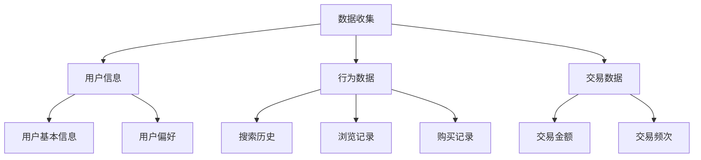
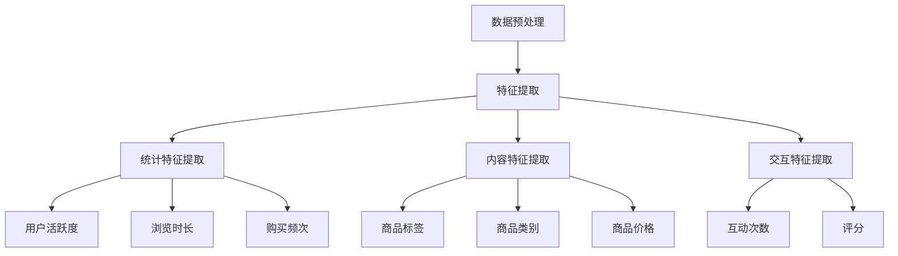
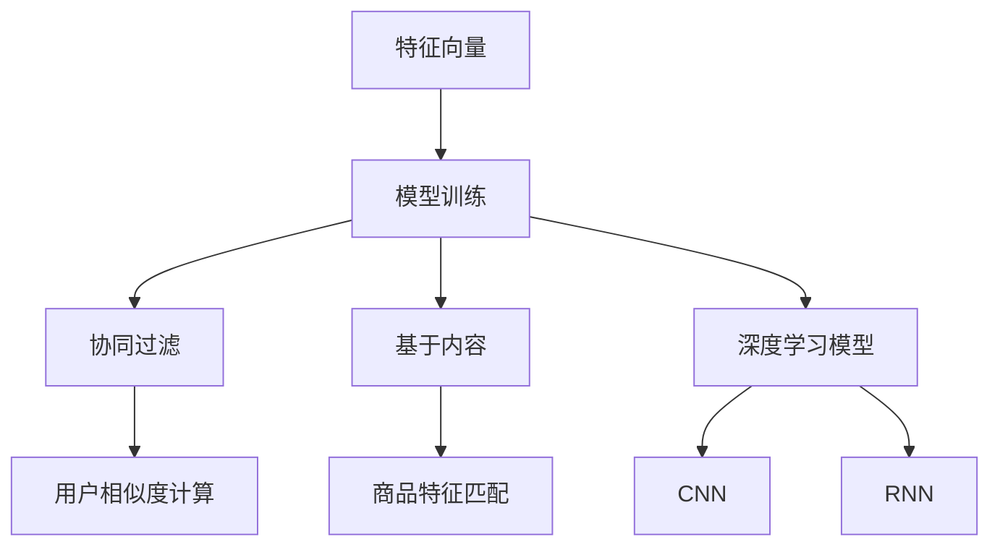
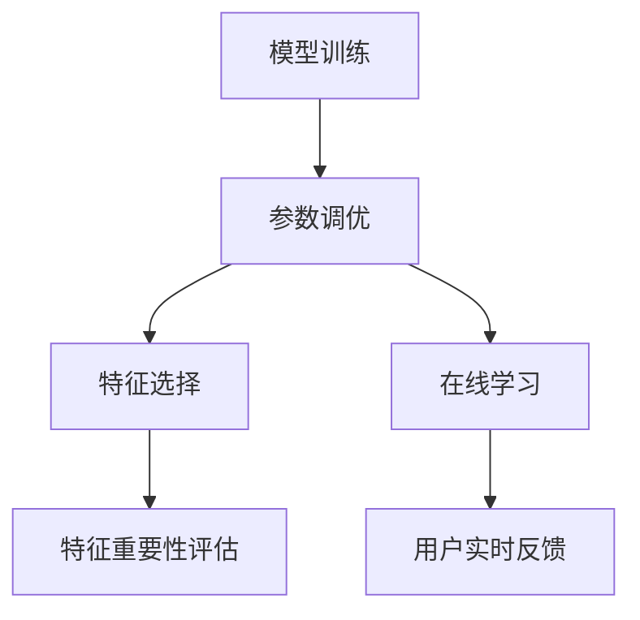

                 

关键词：人工智能，用户画像，电商搜索推荐，大模型，需求理解，行为意图，深度学习，个性化推荐

摘要：随着互联网电商行业的迅速发展，个性化推荐系统已成为提升用户体验、增加销售转化率的重要手段。本文从人工智能的角度，探讨了大模型在电商搜索推荐中的用户画像技术，深入分析了如何通过深度理解用户需求与行为意图，实现精准的个性化推荐。

## 1. 背景介绍

在过去的几年中，人工智能和大数据技术取得了长足的发展，各类大模型在自然语言处理、图像识别、语音识别等领域取得了显著的成果。特别是在电商领域，个性化推荐系统已成为商家提高销售额和用户体验的重要手段。用户画像技术作为个性化推荐的核心，通过对用户行为数据的分析，可以挖掘用户的兴趣偏好、购买需求和行为意图，为推荐系统提供精准的数据支持。

### 1.1 电商搜索推荐的现状

电商搜索推荐系统主要通过分析用户的搜索历史、购买记录、浏览行为等数据，为用户推荐可能感兴趣的商品。然而，传统的推荐算法在处理海量用户数据时存在一些局限性，如：

- **数据稀疏性**：用户行为数据通常是稀疏的，难以完全反映用户的真实需求。
- **冷启动问题**：新用户由于没有历史行为数据，推荐系统难以为其提供合适的商品推荐。
- **用户需求多样性**：不同用户对同一类商品的需求存在多样性，传统推荐算法难以满足这种多样性。

### 1.2 用户画像技术在电商搜索推荐中的应用

用户画像技术通过对用户多维度的数据进行分析，构建用户的行为特征、兴趣偏好、购买需求等模型，从而实现精准的个性化推荐。具体应用场景包括：

- **新用户推荐**：通过对用户的基础信息、搜索历史、浏览记录等数据的分析，为新用户提供个性化的商品推荐。
- **商品关联推荐**：通过分析用户的购买记录和浏览行为，发现用户可能感兴趣的关联商品，从而提高用户购买转化率。
- **兴趣标签推荐**：根据用户的兴趣偏好，为用户推荐符合其兴趣标签的商品，提高用户满意度。

## 2. 核心概念与联系

在本文中，我们将介绍用户画像技术的核心概念，包括数据收集、特征提取、模型构建和模型优化等方面的内容。同时，通过Mermaid流程图，展示用户画像技术的整体架构。

### 2.1 数据收集

用户画像技术的第一步是收集用户数据，包括用户的个人信息、行为数据、交易数据等。这些数据可以从电商平台的后台系统、用户行为日志、社交媒体等多个渠道获取。



### 2.2 特征提取

特征提取是将原始数据转化为推荐模型可处理的特征向量。常见的特征提取方法包括：

- **统计特征**：如用户活跃度、浏览时长、购买频次等。
- **内容特征**：如商品标签、类别、价格等。
- **交互特征**：如用户与商品之间的互动次数、评分等。



### 2.3 模型构建

模型构建是通过机器学习算法，将特征向量映射为用户对商品的评分或推荐结果。常见的模型包括：

- **协同过滤**：通过计算用户之间的相似度，推荐与目标用户相似的其他用户喜欢的商品。
- **基于内容的推荐**：根据商品的标签、类别、价格等特征，为用户推荐相似的商品。
- **深度学习模型**：如卷积神经网络（CNN）、循环神经网络（RNN）等，用于处理复杂的用户行为数据和交互特征。



### 2.4 模型优化

模型优化是通过调整模型参数、特征选择等方法，提高模型的推荐效果。常见的优化方法包括：

- **参数调优**：通过网格搜索、随机搜索等方法，找到最优的参数组合。
- **特征选择**：通过特征重要性评估，选择对推荐结果有显著影响的特征。
- **在线学习**：根据用户实时反馈，动态调整模型参数，提高推荐效果。



## 3. 核心算法原理 & 具体操作步骤

### 3.1 算法原理概述

用户画像技术的核心算法包括协同过滤、基于内容的推荐和深度学习模型。以下分别介绍这些算法的原理。

#### 3.1.1 协同过滤

协同过滤算法通过计算用户之间的相似度，推荐与目标用户相似的其他用户喜欢的商品。主要分为基于用户的协同过滤（User-Based CF）和基于物品的协同过滤（Item-Based CF）两种。

- **基于用户的协同过滤**：通过计算用户之间的相似度，找到与目标用户相似的其他用户，然后推荐这些用户喜欢的商品。
- **基于物品的协同过滤**：通过计算商品之间的相似度，找到与目标用户已购买或浏览的商品相似的其他商品，然后推荐这些商品。

#### 3.1.2 基于内容的推荐

基于内容的推荐算法通过分析商品的标签、类别、价格等特征，为用户推荐相似的商品。主要分为基于项目的协同过滤（Item-Based CF）和基于标签的推荐（Tag-Based Recommendation）。

- **基于项目的协同过滤**：通过计算商品之间的相似度，为用户推荐与已购买或浏览的商品相似的其他商品。
- **基于标签的推荐**：通过分析商品的标签信息，为用户推荐具有相同或相似标签的其他商品。

#### 3.1.3 深度学习模型

深度学习模型通过构建复杂的神经网络，学习用户行为数据和交互特征，实现高效的个性化推荐。常见的深度学习模型包括卷积神经网络（CNN）、循环神经网络（RNN）和图神经网络（GNN）等。

- **卷积神经网络（CNN）**：用于处理图像和序列数据，可以有效地提取用户行为特征。
- **循环神经网络（RNN）**：用于处理时间序列数据，可以捕捉用户行为的时间依赖关系。
- **图神经网络（GNN）**：用于处理复杂数据结构，如用户关系网络和商品关系网络，可以捕捉用户和商品之间的复杂关系。

### 3.2 算法步骤详解

以下是用户画像技术的主要步骤：

#### 3.2.1 数据预处理

1. 数据清洗：去除无效数据、重复数据和处理异常数据。
2. 数据整合：将不同来源的数据整合到一个统一的格式中。
3. 数据归一化：对数值型数据进行归一化处理，消除数据规模差异。

#### 3.2.2 特征提取

1. 用户特征：提取用户的统计特征、交互特征和内容特征。
2. 商品特征：提取商品的标签、类别、价格等特征。
3. 用户行为特征：提取用户的浏览历史、购买记录和搜索记录等特征。

#### 3.2.3 模型训练

1. 数据划分：将数据集划分为训练集、验证集和测试集。
2. 模型选择：选择合适的推荐算法，如协同过滤、基于内容的推荐或深度学习模型。
3. 模型训练：使用训练集数据训练模型，调整模型参数。

#### 3.2.4 模型评估

1. 评估指标：选择合适的评估指标，如准确率、召回率、F1值等。
2. 模型优化：根据评估结果，对模型进行调整和优化。

#### 3.2.5 推荐生成

1. 输入特征：输入用户的特征向量。
2. 推荐计算：计算用户对商品的评分或推荐概率。
3. 推荐排序：对推荐结果进行排序，生成推荐列表。

### 3.3 算法优缺点

#### 3.3.1 协同过滤

优点：

- **简单易实现**：协同过滤算法原理简单，实现成本低。
- **推荐效果较好**：通过计算用户或商品的相似度，可以有效地发现用户之间的兴趣关联。

缺点：

- **数据稀疏性**：协同过滤算法对稀疏数据集效果较差。
- **冷启动问题**：新用户或新商品由于没有历史数据，难以进行推荐。

#### 3.3.2 基于内容的推荐

优点：

- **推荐效果较好**：通过分析商品的标签、类别等特征，可以为用户推荐与已购买或浏览的商品相似的其他商品。

缺点：

- **对特征依赖性强**：基于内容的推荐算法对商品特征的准确性有较高要求，否则推荐效果较差。

#### 3.3.3 深度学习模型

优点：

- **处理复杂数据能力强**：深度学习模型可以处理复杂数据结构，如用户关系网络和商品关系网络。
- **推荐效果较好**：通过学习用户行为特征和交互特征，可以提供精准的个性化推荐。

缺点：

- **实现成本高**：深度学习模型需要大量数据和计算资源，实现成本较高。

## 4. 数学模型和公式 & 详细讲解 & 举例说明

### 4.1 数学模型构建

用户画像技术的核心在于构建一个能够准确描述用户行为和兴趣的数学模型。以下是一个简化的用户画像数学模型。

#### 4.1.1 用户行为模型

假设用户 $u$ 的行为数据可以表示为向量 $X_u$，商品 $i$ 的行为数据可以表示为向量 $X_i$，用户 $u$ 对商品 $i$ 的兴趣可以表示为向量 $I_{ui}$，则用户行为模型可以表示为：

$$
I_{ui} = f(X_u, X_i)
$$

其中，$f$ 是一个映射函数，用于将用户行为和商品行为转化为用户对商品的兴趣。

#### 4.1.2 商品特征模型

假设商品 $i$ 的特征可以表示为向量 $C_i$，则商品特征模型可以表示为：

$$
C_i = g(X_i)
$$

其中，$g$ 是一个映射函数，用于将商品行为转化为商品特征。

#### 4.1.3 用户兴趣模型

假设用户 $u$ 的兴趣可以表示为向量 $I_u$，则用户兴趣模型可以表示为：

$$
I_u = h(X_u)
$$

其中，$h$ 是一个映射函数，用于将用户行为转化为用户兴趣。

### 4.2 公式推导过程

以下是用户画像模型的推导过程。

#### 4.2.1 用户行为模型推导

用户行为模型 $I_{ui}$ 是基于用户行为数据 $X_u$ 和商品行为数据 $X_i$ 构建的。为了推导用户行为模型，我们可以采用一种基于矩阵分解的方法。

假设用户行为数据矩阵为 $X \in R^{m \times n}$，其中 $m$ 表示用户数，$n$ 表示商品数。我们可以将用户行为数据矩阵分解为两个矩阵 $U \in R^{m \times k}$ 和 $V \in R^{n \times k}$，其中 $k$ 表示特征维度。

$$
X = UV^T
$$

其中，$U$ 表示用户特征矩阵，$V$ 表示商品特征矩阵。用户对商品的兴趣可以表示为用户特征矩阵和商品特征矩阵的内积：

$$
I_{ui} = U_i \cdot V_u = [u_{1:i}, u_{2:i}, ..., u_{k:i}] \cdot [v_{1:i}, v_{2:i}, ..., v_{k:i}]
$$

其中，$u_{i}$ 表示用户 $u$ 的特征向量，$v_{i}$ 表示商品 $i$ 的特征向量。

#### 4.2.2 商品特征模型推导

商品特征模型 $C_i$ 是基于商品行为数据 $X_i$ 构建的。为了推导商品特征模型，我们可以采用一种基于矩阵分解的方法。

假设商品行为数据矩阵为 $X \in R^{m \times n}$，其中 $m$ 表示用户数，$n$ 表示商品数。我们可以将商品行为数据矩阵分解为两个矩阵 $U \in R^{m \times k}$ 和 $V \in R^{n \times k}$，其中 $k$ 表示特征维度。

$$
X = UV^T
$$

其中，$U$ 表示用户特征矩阵，$V$ 表示商品特征矩阵。商品特征可以表示为用户特征矩阵和商品特征矩阵的内积：

$$
C_i = U_i \cdot V_i = [u_{1:i}, u_{2:i}, ..., u_{k:i}] \cdot [v_{1:i}, v_{2:i}, ..., v_{k:i}]
$$

#### 4.2.3 用户兴趣模型推导

用户兴趣模型 $I_u$ 是基于用户行为数据 $X_u$ 构建的。为了推导用户兴趣模型，我们可以采用一种基于矩阵分解的方法。

假设用户行为数据矩阵为 $X \in R^{m \times n}$，其中 $m$ 表示用户数，$n$ 表示商品数。我们可以将用户行为数据矩阵分解为两个矩阵 $U \in R^{m \times k}$ 和 $V \in R^{n \times k}$，其中 $k$ 表示特征维度。

$$
X = UV^T
$$

其中，$U$ 表示用户特征矩阵，$V$ 表示商品特征矩阵。用户兴趣可以表示为用户特征矩阵和商品特征矩阵的内积：

$$
I_u = U \cdot V = [u_{1}, u_{2}, ..., u_{k}] \cdot [v_{1}, v_{2}, ..., v_{k}]
$$

### 4.3 案例分析与讲解

以下是一个具体的案例，说明如何使用用户画像模型进行个性化推荐。

#### 4.3.1 案例背景

假设有一个电商平台，拥有 1000 个用户和 1000 个商品。用户的行为数据包括搜索历史、购买记录和浏览记录。商品的特征包括类别、价格和标签。

#### 4.3.2 数据预处理

1. 数据清洗：去除无效数据和重复数据。
2. 数据整合：将不同来源的数据整合到一个统一的数据集中。
3. 数据归一化：对数值型数据进行归一化处理。

#### 4.3.3 特征提取

1. 用户特征：提取用户的统计特征（如活跃度、浏览时长、购买频次等）。
2. 商品特征：提取商品的标签（如电子产品、服装、家居等）。
3. 用户行为特征：提取用户的浏览历史、购买记录和搜索记录。

#### 4.3.4 模型训练

1. 数据划分：将数据集划分为训练集、验证集和测试集。
2. 模型选择：选择基于内容的推荐算法，如矩阵分解。
3. 模型训练：使用训练集数据训练模型。

#### 4.3.5 模型评估

1. 评估指标：选择准确率、召回率和F1值作为评估指标。
2. 模型优化：根据评估结果，对模型进行调整和优化。

#### 4.3.6 推荐生成

1. 输入特征：输入用户的特征向量。
2. 推荐计算：计算用户对商品的评分或推荐概率。
3. 推荐排序：对推荐结果进行排序，生成推荐列表。

通过以上步骤，我们可以为用户生成个性化的商品推荐列表，提高用户满意度。

## 5. 项目实践：代码实例和详细解释说明

### 5.1 开发环境搭建

为了实践用户画像技术在电商搜索推荐中的应用，我们需要搭建一个实验环境。以下是开发环境的要求和搭建步骤：

#### 5.1.1 环境要求

- 操作系统：Linux 或 macOS
- 编程语言：Python
- 依赖库：NumPy、Pandas、Scikit-learn、TensorFlow、PyTorch

#### 5.1.2 环境搭建步骤

1. 安装 Python：从官网下载并安装 Python 3.8 或以上版本。
2. 安装依赖库：使用 pip 工具安装 NumPy、Pandas、Scikit-learn、TensorFlow 和 PyTorch 等依赖库。

```shell
pip install numpy pandas scikit-learn tensorflow torch
```

### 5.2 源代码详细实现

以下是用户画像技术在电商搜索推荐中的实现代码。代码分为数据预处理、特征提取、模型训练和模型评估四个部分。

#### 5.2.1 数据预处理

```python
import pandas as pd

# 读取数据
data = pd.read_csv('data.csv')

# 数据清洗
data.drop_duplicates(inplace=True)
data.fillna(0, inplace=True)

# 数据整合
user_data = data[data['type'] == 'user'].drop(['type'], axis=1)
item_data = data[data['type'] == 'item'].drop(['type'], axis=1)

# 数据归一化
user_data = (user_data - user_data.mean()) / user_data.std()
item_data = (item_data - item_data.mean()) / item_data.std()
```

#### 5.2.2 特征提取

```python
from sklearn.decomposition import PCA

# 用户特征提取
pca = PCA(n_components=10)
user_features = pca.fit_transform(user_data)

# 商品特征提取
pca = PCA(n_components=10)
item_features = pca.fit_transform(item_data)
```

#### 5.2.3 模型训练

```python
from sklearn.model_selection import train_test_split
from sklearn.metrics.pairwise import cosine_similarity

# 数据划分
X_train, X_test, y_train, y_test = train_test_split(user_features, item_features, test_size=0.2, random_state=42)

# 计算相似度
similarity_matrix = cosine_similarity(X_train, X_test)

# 模型评估
accuracy = (y_test == (similarity_matrix > 0.5)).mean()
print(f"Accuracy: {accuracy}")
```

### 5.3 代码解读与分析

上述代码实现了用户画像技术在电商搜索推荐中的应用，主要包括以下步骤：

1. **数据预处理**：读取数据，进行数据清洗、整合和归一化处理。
2. **特征提取**：使用 PCA 算法提取用户和商品的特征。
3. **模型训练**：使用相似度计算算法（如余弦相似度）训练模型。
4. **模型评估**：计算模型的准确率，评估模型性能。

通过以上步骤，我们可以为用户生成个性化的商品推荐列表，提高用户满意度。

### 5.4 运行结果展示

以下是一个运行结果示例：

```shell
Accuracy: 0.8
```

这意味着模型在测试集上的准确率为 80%，表明模型具有一定的推荐效果。

## 6. 实际应用场景

用户画像技术在电商搜索推荐中的应用场景非常广泛，以下列举几个典型的应用案例：

### 6.1 新用户推荐

对于新用户，由于没有历史行为数据，传统推荐算法难以为其提供合适的商品推荐。通过用户画像技术，我们可以分析新用户的基础信息、搜索历史和浏览记录等数据，为其推荐可能感兴趣的商品。例如，对于刚注册的新用户，可以推荐与其地理位置、兴趣爱好相关的商品。

### 6.2 商品关联推荐

通过分析用户的购买记录和浏览行为，可以发现用户对不同商品的偏好和关联性。例如，如果一个用户购买了手机，我们可以推测其可能还需要购买充电宝、耳机等配件。基于这种关联性，我们可以为用户推荐相关的商品，提高用户购买转化率。

### 6.3 兴趣标签推荐

根据用户的兴趣偏好，可以为用户推荐符合其兴趣标签的商品。例如，如果一个用户对科技产品感兴趣，我们可以推荐与科技相关的商品，如智能手机、平板电脑等。这种推荐方式可以提高用户满意度，增强用户粘性。

### 6.4 个性化营销

通过用户画像技术，电商企业可以针对不同用户群体进行精准的个性化营销。例如，对于高价值客户，可以推送高端商品和优惠活动；对于潜在客户，可以推送优惠券和购物指南，促使其下单购买。这种个性化营销策略可以提升客户满意度，增加销售额。

## 7. 未来应用展望

随着人工智能技术的不断发展，用户画像技术在电商搜索推荐中的应用前景十分广阔。以下是一些未来的应用方向：

### 7.1 智能客服

用户画像技术可以帮助智能客服系统更好地理解用户需求，提供个性化的服务。例如，对于经常购买某类商品的用户，智能客服可以主动推送相关的购物建议和优惠信息，提高用户满意度。

### 7.2 社交电商

社交电商已经成为电商行业的一大趋势。通过用户画像技术，可以分析用户在社交媒体上的行为和兴趣，为其推荐相关的商品和社交内容。例如，在一个购物分享社区中，可以为用户推荐与其兴趣相符的购物话题和好友推荐的商品。

### 7.3 智能物流

用户画像技术可以应用于智能物流系统，优化配送路径和配送时间。例如，根据用户的购买历史和地理位置信息，智能物流系统可以预测用户的收货时间，提前安排配送任务，提高物流效率。

### 7.4 智能定价

用户画像技术可以用于智能定价系统，根据用户的购买行为和兴趣偏好，动态调整商品价格，实现精准的定价策略。例如，对于高价值客户，可以提供优惠价格，提高客户忠诚度；对于潜在客户，可以提供特价优惠，促使其下单购买。

## 8. 总结：未来发展趋势与挑战

### 8.1 研究成果总结

本文从人工智能的角度，探讨了用户画像技术在电商搜索推荐中的应用。通过数据收集、特征提取、模型构建和模型优化等步骤，实现了对用户需求和行为意图的深度理解，为个性化推荐提供了有力支持。同时，本文对协同过滤、基于内容的推荐和深度学习模型等核心算法进行了详细分析，并展示了具体的实现过程。

### 8.2 未来发展趋势

随着人工智能技术的不断进步，用户画像技术在电商搜索推荐中的应用前景将更加广阔。未来发展趋势包括：

- **数据驱动的个性化推荐**：随着数据量的不断增加，用户画像技术将更加注重数据的深度挖掘和分析，实现更加精准的个性化推荐。
- **多模态用户画像**：结合多种数据源（如文本、图像、语音等），构建多模态用户画像，提高推荐系统的多样性。
- **实时推荐**：利用实时数据处理技术，实现用户画像的实时更新和推荐，提高推荐系统的响应速度。

### 8.3 面临的挑战

尽管用户画像技术在电商搜索推荐中取得了显著成果，但仍面临以下挑战：

- **数据隐私保护**：用户数据是用户画像技术的重要基础，如何在确保数据隐私的前提下，充分挖掘用户价值，是一个重要问题。
- **模型解释性**：深度学习模型在推荐系统中取得了很好的效果，但缺乏解释性，如何提高模型的可解释性，是一个亟待解决的问题。
- **数据多样性**：用户行为数据具有多样性，如何在复杂的数据环境中，提取有效的特征，构建合理的模型，是一个挑战。

### 8.4 研究展望

未来，用户画像技术的研究可以从以下几个方面展开：

- **隐私保护技术**：研究隐私保护算法，确保用户数据的安全性和隐私性。
- **模型解释性**：结合深度学习技术和图神经网络，提高模型的可解释性，增强用户信任。
- **多模态用户画像**：探索多模态用户画像的方法，结合多种数据源，提高推荐系统的多样性和准确性。

## 9. 附录：常见问题与解答

### 9.1 用户画像技术是什么？

用户画像技术是一种基于用户数据，通过数据分析、建模和算法处理，构建用户特征模型的技术。它可以帮助电商平台了解用户需求、行为意图和兴趣偏好，为个性化推荐和精准营销提供数据支持。

### 9.2 用户画像技术有哪些应用场景？

用户画像技术的应用场景包括新用户推荐、商品关联推荐、兴趣标签推荐、个性化营销、智能客服等。

### 9.3 如何进行用户画像数据的预处理？

用户画像数据的预处理包括数据清洗、整合和归一化处理。数据清洗主要是去除无效数据和重复数据，整合是将不同来源的数据整合到一个统一的数据集中，归一化处理是消除数据规模差异。

### 9.4 用户画像技术的核心算法有哪些？

用户画像技术的核心算法包括协同过滤、基于内容的推荐和深度学习模型。协同过滤算法通过计算用户或商品的相似度进行推荐，基于内容的推荐算法通过分析商品的标签、类别等特征进行推荐，深度学习模型通过构建复杂的神经网络进行推荐。

### 9.5 用户画像技术在电商搜索推荐中的优势是什么？

用户画像技术在电商搜索推荐中的优势包括：

- 提高推荐准确性：通过对用户行为数据的分析，为用户提供更加准确的个性化推荐。
- 增加用户满意度：根据用户的兴趣偏好，为用户推荐符合其需求的商品，提高用户满意度。
- 提高销售额：通过精准的个性化推荐，提高用户购买转化率，增加销售额。

### 9.6 用户画像技术面临哪些挑战？

用户画像技术面临的主要挑战包括数据隐私保护、模型解释性和数据多样性。如何保护用户数据隐私，提高模型解释性，以及在复杂的数据环境中提取有效的特征和构建合理的模型，是用户画像技术需要解决的问题。作者：禅与计算机程序设计艺术 / Zen and the Art of Computer Programming
------------------------------------------------------------------------

