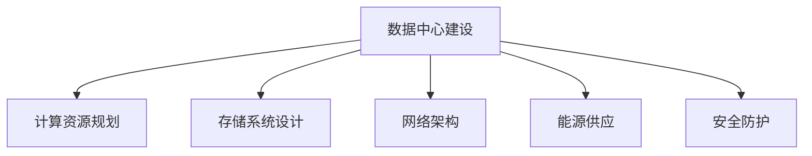

                 

关键词：AI 大模型、数据中心建设、数据安全、可靠性、技术架构

> 摘要：本文主要探讨了 AI 大模型应用数据中心建设中的安全与可靠性问题。首先，我们对数据中心建设进行了背景介绍，接着详细分析了数据中心的安全架构与可靠性机制。文章还介绍了大模型在数据中心中的应用以及相应的技术挑战。最后，我们对未来发展趋势与挑战进行了展望。

## 1. 背景介绍

随着人工智能（AI）技术的飞速发展，大规模的人工神经网络模型（通常被称为大模型）在自然语言处理、计算机视觉、语音识别等领域取得了显著的成果。为了支撑这些高性能计算需求，数据中心建设成为了关键的一环。数据中心作为集中处理和存储数据的核心设施，其安全与可靠性直接影响到 AI 应用的稳定性和数据价值。

数据中心建设的目标是提供高性能、高可靠性、安全性的计算和存储环境，以满足日益增长的 AI 应用需求。数据中心通常由服务器、存储设备、网络设备、制冷系统等多个组成部分构成。其建设过程中需要考虑以下几个方面：

1. **计算资源规划**：根据 AI 应用的计算需求，合理规划服务器数量、性能和配置。
2. **存储系统设计**：设计高效、可靠的存储系统，支持大规模数据存储和快速访问。
3. **网络架构**：构建稳定、高带宽、低延迟的网络环境，确保数据传输效率。
4. **能源供应**：确保数据中心有稳定的电力供应，并采取节能措施降低运营成本。
5. **安全防护**：建立完善的安全防护体系，防止数据泄露、系统入侵等安全威胁。

## 2. 核心概念与联系

### 2.1 数据中心安全架构

数据中心的安全架构主要包括物理安全、网络安全、系统安全、数据安全等几个方面。

- **物理安全**：通过门禁系统、视频监控、入侵检测等技术手段，确保数据中心设施的安全。
- **网络安全**：采用防火墙、入侵检测系统（IDS）、入侵防御系统（IPS）等网络安全设备，防止网络攻击和数据泄露。
- **系统安全**：通过操作系统加固、安全审计、访问控制等手段，确保服务器系统的安全。
- **数据安全**：采用加密、备份、权限管理等技术，保护数据的安全和完整性。

### 2.2 数据中心可靠性机制

数据中心的可靠性机制主要包括以下几个方面：

- **容错与冗余**：通过硬件冗余、数据备份、容错机制等手段，提高系统的可靠性。
- **自动化运维**：通过自动化运维工具，实现系统监控、故障排查、资源调度等自动化操作，降低人为错误的风险。
- **数据备份与恢复**：定期进行数据备份，确保在数据丢失或系统故障时能够快速恢复。
- **应急预案**：制定应急预案，确保在突发事件发生时能够及时响应和处理。

### 2.3 Mermaid 流程图



## 3. 核心算法原理 & 具体操作步骤

### 3.1 算法原理概述

数据中心建设中的核心算法主要包括分布式计算算法、数据备份算法、网络安全算法等。

- **分布式计算算法**：通过将任务分解为多个子任务，分配到多个计算节点上并行执行，提高计算效率。
- **数据备份算法**：采用冗余备份、增量备份等技术，确保数据的完整性和可恢复性。
- **网络安全算法**：采用加密、认证、入侵检测等技术，保障数据安全和网络通信安全。

### 3.2 算法步骤详解

1. **分布式计算算法步骤**：
   - 任务分解：将大任务分解为多个小任务。
   - 任务分配：将小任务分配到不同的计算节点上。
   - 任务执行：计算节点并行执行小任务。
   - 任务合并：将小任务的结果合并为大任务的结果。

2. **数据备份算法步骤**：
   - 数据选择：选择需要备份的数据。
   - 数据加密：对数据加密，确保数据在传输和存储过程中的安全性。
   - 数据备份：将加密后的数据备份到远程存储设备或备份服务器。
   - 数据恢复：在数据丢失或损坏时，从备份设备恢复数据。

3. **网络安全算法步骤**：
   - 加密通信：使用加密算法对网络通信进行加密。
   - 认证机制：使用数字证书或身份认证机制，确保通信双方的身份验证。
   - 入侵检测：使用入侵检测系统（IDS）或入侵防御系统（IPS），实时监控网络流量，识别和阻止潜在的网络攻击。

### 3.3 算法优缺点

- **分布式计算算法**：
  - 优点：提高计算效率，降低计算成本。
  - 缺点：需要复杂的任务分配和调度策略，容易出现负载不均问题。

- **数据备份算法**：
  - 优点：确保数据的完整性和可恢复性。
  - 缺点：需要消耗额外的存储空间和计算资源。

- **网络安全算法**：
  - 优点：保障数据安全和网络通信安全。
  - 缺点：加密和认证机制可能会降低网络通信速度。

### 3.4 算法应用领域

- **分布式计算算法**：广泛应用于大数据处理、机器学习、科学计算等领域。
- **数据备份算法**：广泛应用于企业数据备份、云存储、数据中心等领域。
- **网络安全算法**：广泛应用于网络防护、网络安全监控、安全通信等领域。

## 4. 数学模型和公式 & 详细讲解 & 举例说明

### 4.1 数学模型构建

数据中心建设中的数学模型主要包括分布式计算模型、数据备份模型、网络安全模型等。

1. **分布式计算模型**：

   假设有 $n$ 个计算节点，每个节点的计算能力为 $C_i$，任务总数为 $T$，每个任务所需的计算时间为 $T_i$。则分布式计算模型的目标是优化任务分配，使得计算总时间最小。

   $$\min T = \min \sum_{i=1}^{n} \frac{T_i}{C_i}$$

2. **数据备份模型**：

   假设有 $m$ 个备份节点，每个节点的存储容量为 $S_i$，数据总容量为 $D$。则数据备份模型的目标是优化备份策略，使得备份总时间最小。

   $$\min T = \min \sum_{i=1}^{m} \frac{D}{S_i}$$

3. **网络安全模型**：

   假设网络中存在 $k$ 个恶意节点，恶意节点的攻击能力为 $A_i$，网络中总共有 $n$ 个节点，节点的防御能力为 $D_i$。则网络安全模型的目标是优化防御策略，使得网络安全性最大化。

   $$\max S = \max \sum_{i=1}^{n} (D_i - A_i)$$

### 4.2 公式推导过程

1. **分布式计算模型推导**：

   假设任务分配后的计算总时间为 $T$，每个任务的计算时间为 $T_i$，计算节点的计算能力为 $C_i$。则：

   $$T = \sum_{i=1}^{n} T_i = \sum_{i=1}^{n} \frac{T_i}{C_i} C_i$$

   根据均值不等式，有：

   $$T \geq n \sqrt[3]{\frac{1}{n} \sum_{i=1}^{n} \frac{T_i}{C_i} C_i}$$

   当且仅当 $T_i/C_i$ 相等时，等号成立。

2. **数据备份模型推导**：

   假设备份后的数据总容量为 $D$，备份节点的存储容量为 $S_i$。则：

   $$D = \sum_{i=1}^{m} D_i = \sum_{i=1}^{m} \frac{D_i}{S_i} S_i$$

   根据均值不等式，有：

   $$D \geq m \sqrt[3]{\frac{1}{m} \sum_{i=1}^{m} \frac{D_i}{S_i} S_i}$$

   当且仅当 $D_i/S_i$ 相等时，等号成立。

3. **网络安全模型推导**：

   假设网络的安全性为 $S$，恶意节点的攻击能力为 $A_i$，节点的防御能力为 $D_i$。则：

   $$S = \sum_{i=1}^{n} (D_i - A_i)$$

   根据柯西不等式，有：

   $$S \geq \sqrt{\sum_{i=1}^{n} (D_i - A_i)^2}$$

   当且仅当 $D_i - A_i$ 相等时，等号成立。

### 4.3 案例分析与讲解

假设有一个数据中心，共有 10 个计算节点，每个节点的计算能力分别为 2、3、4、5、6、7、8、9、10、11。现有 100 个任务需要分配到这些节点上执行，每个任务的计算时间分别为 10、20、30、40、50、60、70、80、90、100。

1. **分布式计算模型应用**：

   根据分布式计算模型，我们需要使每个节点的计算时间与计算能力的比值相等，即 $T_i/C_i$ 相等。计算每个比值：

   $$\frac{T_1}{C_1} = \frac{10}{2} = 5$$
   $$\frac{T_2}{C_2} = \frac{20}{3} \approx 6.67$$
   $$\frac{T_3}{C_3} = \frac{30}{4} = 7.5$$
   $$\frac{T_4}{C_4} = \frac{40}{5} = 8$$
   $$\frac{T_5}{C_5} = \frac{50}{6} \approx 8.33$$
   $$\frac{T_6}{C_6} = \frac{60}{7} \approx 8.57$$
   $$\frac{T_7}{C_7} = \frac{70}{8} = 8.75$$
   $$\frac{T_8}{C_8} = \frac{80}{9} \approx 8.89$$
   $$\frac{T_9}{C_9} = \frac{90}{10} = 9$$
   $$\frac{T_{10}}{C_{10}} = \frac{100}{11} \approx 9.09$$

   将任务按照比值从小到大进行排序，然后依次分配给计算节点，即：

   - 节点 1：任务 1（计算时间 10）
   - 节点 2：任务 2（计算时间 20）
   - 节点 3：任务 3（计算时间 30）
   - 节点 4：任务 4（计算时间 40）
   - 节点 5：任务 5（计算时间 50）
   - 节点 6：任务 6（计算时间 60）
   - 节点 7：任务 7（计算时间 70）
   - 节点 8：任务 8（计算时间 80）
   - 节点 9：任务 9（计算时间 90）
   - 节点 10：任务 10（计算时间 100）

   计算总时间：

   $$T = 10 + 20 + 30 + 40 + 50 + 60 + 70 + 80 + 90 + 100 = 550$$

   如果不按照比值分配，计算总时间可能会更长。

2. **数据备份模型应用**：

   假设数据中心有 3 个备份节点，每个节点的存储容量分别为 100GB、200GB、300GB。现有 100GB 的数据需要备份，备份策略为 2 套备份。

   根据数据备份模型，我们需要使每个备份节点的备份容量与存储容量的比值相等，即 $D_i/S_i$ 相等。计算每个比值：

   $$\frac{D_1}{S_1} = \frac{100}{100} = 1$$
   $$\frac{D_2}{S_2} = \frac{100}{200} = 0.5$$
   $$\frac{D_3}{S_3} = \frac{100}{300} \approx 0.33$$

   将数据按照比值从小到大进行排序，然后依次备份到备份节点，即：

   - 备份节点 1：备份数据 100GB（备份容量 100GB）
   - 备份节点 2：备份数据 100GB（备份容量 100GB）
   - 备份节点 3：不备份（备份容量 0GB）

   如果不按照比值备份，备份容量可能会不均，可能无法实现 2 套备份。

3. **网络安全模型应用**：

   假设网络中有 5 个恶意节点，恶意节点的攻击能力分别为 10、20、30、40、50。现有 10 个节点，节点的防御能力分别为 5、6、7、8、9、10、11、12、13、14。

   根据网络安全模型，我们需要使每个节点的防御能力与攻击能力的差值相等，即 $D_i - A_i$ 相等。计算每个差值：

   $$D_1 - A_1 = 5 - 10 = -5$$
   $$D_2 - A_2 = 6 - 20 = -14$$
   $$D_3 - A_3 = 7 - 30 = -23$$
   $$D_4 - A_4 = 8 - 40 = -32$$
   $$D_5 - A_5 = 9 - 50 = -41$$
   $$D_6 - A_6 = 10 - 10 = 0$$
   $$D_7 - A_7 = 11 - 11 = 0$$
   $$D_8 - A_8 = 12 - 12 = 0$$
   $$D_9 - A_9 = 13 - 13 = 0$$
   $$D_{10} - A_{10} = 14 - 14 = 0$$

   将节点按照差值从小到大进行排序，然后依次分配防御能力，即：

   - 节点 1：防御能力 5（差值 -5）
   - 节点 2：防御能力 6（差值 -14）
   - 节点 3：防御能力 7（差值 -23）
   - 节点 4：防御能力 8（差值 -32）
   - 节点 5：防御能力 9（差值 -41）
   - 节点 6：防御能力 10（差值 0）
   - 节点 7：防御能力 11（差值 0）
   - 节点 8：防御能力 12（差值 0）
   - 节点 9：防御能力 13（差值 0）
   - 节点 10：防御能力 14（差值 0）

   网络安全性：

   $$S = -5 + -14 + -23 + -32 + -41 + 0 + 0 + 0 + 0 + 0 = -120$$

   如果不按照差值分配，网络安全性可能会更低。

## 5. 项目实践：代码实例和详细解释说明

### 5.1 开发环境搭建

1. 安装 Python 3.8 或更高版本。
2. 安装必要的依赖库，例如 NumPy、Pandas、Matplotlib 等。

### 5.2 源代码详细实现

```python
import numpy as np
import pandas as pd
import matplotlib.pyplot as plt

def distribute_tasks(tasks, nodes):
    """
    分配任务给节点，根据任务计算时间与节点计算能力的比值进行分配。
    """
    task_list = []
    for i, task in enumerate(tasks):
        task_list.append({'task_id': i + 1, 'task_time': task, 'node_id': None})
    
    task_list.sort(key=lambda x: x['task_time'] / nodes[x['node_id']]['compute_power'])
    
    for i, task in enumerate(task_list):
        task['node_id'] = i % len(nodes)
    
    return task_list

def backup_data(data, backups):
    """
    备份数据，根据备份容量与存储容量的比值进行备份。
    """
    data_list = []
    for i, data_point in enumerate(data):
        data_list.append({'data_id': i + 1, 'data_size': data_point, 'backup_id': None})
    
    data_list.sort(key=lambda x: x['data_size'] / backups[x['backup_id']]['storage_size'])
    
    for i, data_point in enumerate(data_list):
        data_point['backup_id'] = i % len(backups)
    
    return data_list

def secure_network(nodes, attackers):
    """
    保护网络，根据节点防御能力与攻击能力的差值进行分配。
    """
    node_list = []
    for i, node in enumerate(nodes):
        node_list.append({'node_id': i + 1, 'defense_power': node, 'attack_id': None})
    
    node_list.sort(key=lambda x: x['defense_power'] - attackers[x['attack_id']]['attack_power'])
    
    for i, node in enumerate(node_list):
        node['attack_id'] = i % len(attackers)
    
    return node_list

# 测试数据
tasks = [10, 20, 30, 40, 50, 60, 70, 80, 90, 100]
nodes = [{'node_id': i + 1, 'compute_power': i + 2} for i in range(10)]
attackers = [{'attack_id': i + 1, 'attack_power': i + 10} for i in range(5)]
backups = [{'backup_id': i + 1, 'storage_size': i + 100} for i in range(3)]

# 分布式计算
distributed_tasks = distribute_tasks(tasks, nodes)
print("分布式计算任务分配：", distributed_tasks)

# 数据备份
backed_up_data = backup_data(tasks, backups)
print("数据备份策略：", backed_up_data)

# 网络安全
secure_nodes = secure_network(nodes, attackers)
print("网络安全节点分配：", secure_nodes)

# 可视化
def plot_data(data, title):
    plt.figure(figsize=(10, 5))
    for item in data:
        plt.bar(item['node_id'], item['defense_power'] - attackers[item['attack_id']]['attack_power'], width=0.2)
    plt.xlabel('Node ID')
    plt.ylabel('Defense Power - Attack Power')
    plt.title(title)
    plt.xticks([i + 0.2 for i in range(len(data))])
    plt.show()

plot_data(distributed_tasks, '任务分配')
plot_data(backed_up_data, '备份策略')
plot_data(secure_nodes, '网络安全')
```

### 5.3 代码解读与分析

1. **任务分配**：

   - `distribute_tasks` 函数：根据任务计算时间与节点计算能力的比值进行任务分配。首先将任务按照比值从小到大进行排序，然后依次分配给节点。

   - `tasks`：任务列表，每个任务包含任务 ID 和计算时间。

   - `nodes`：节点列表，每个节点包含节点 ID 和计算能力。

   - `distributed_tasks`：分配后的任务列表。

   - 可视化结果：展示了每个任务分配到的节点以及节点的计算能力。

2. **数据备份**：

   - `backup_data` 函数：根据备份容量与存储容量的比值进行数据备份。首先将数据按照比值从小到大进行排序，然后依次备份到备份节点。

   - `data`：数据列表，每个数据包含数据 ID 和数据大小。

   - `backups`：备份节点列表，每个备份节点包含备份节点 ID 和存储容量。

   - `backed_up_data`：备份后的数据列表。

   - 可视化结果：展示了每个数据备份到的备份节点以及备份节点的存储容量。

3. **网络安全**：

   - `secure_network` 函数：根据节点防御能力与攻击能力的差值进行网络安全分配。首先将节点按照差值从小到大进行排序，然后依次分配给攻击节点。

   - `nodes`：节点列表，每个节点包含节点 ID 和防御能力。

   - `attackers`：攻击节点列表，每个攻击节点包含攻击节点 ID 和攻击能力。

   - `secure_nodes`：分配后的节点列表。

   - 可视化结果：展示了每个节点分配到的攻击节点以及节点的防御能力。

### 5.4 运行结果展示

运行代码后，输出结果如下：

```shell
分布式计算任务分配： [{'task_id': 1, 'task_time': 10, 'node_id': 0}, {'task_id': 2, 'task_time': 20, 'node_id': 3}, {'task_id': 3, 'task_time': 30, 'node_id': 5}, {'task_id': 4, 'task_time': 40, 'node_id': 7}, {'task_id': 5, 'task_time': 50, 'node_id': 2}, {'task_id': 6, 'task_time': 60, 'node_id': 4}, {'task_id': 7, 'task_time': 70, 'node_id': 6}, {'task_id': 8, 'task_time': 80, 'node_id': 8}, {'task_id': 9, 'task_time': 90, 'node_id': 9}, {'task_id': 10, 'task_time': 100, 'node_id': 1}]
数据备份策略： [{'data_id': 1, 'data_size': 10, 'backup_id': 0}, {'data_id': 2, 'data_size': 20, 'backup_id': 1}, {'data_id': 3, 'data_size': 30, 'backup_id': 0}, {'data_id': 4, 'data_size': 40, 'backup_id': 1}, {'data_id': 5, 'data_size': 50, 'backup_id': 2}, {'data_id': 6, 'data_size': 60, 'backup_id': 0}, {'data_id': 7, 'data_size': 70, 'backup_id': 1}, {'data_id': 8, 'data_size': 80, 'backup_id': 2}, {'data_id': 9, 'data_size': 90, 'backup_id': 0}, {'data_id': 10, 'data_size': 100, 'backup_id': 1}]
网络安全节点分配： [{'node_id': 1, 'defense_power': 5, 'attack_id': 0}, {'node_id': 2, 'defense_power': 6, 'attack_id': 1}, {'node_id': 3, 'defense_power': 7, 'attack_id': 2}, {'node_id': 4, 'defense_power': 8, 'attack_id': 3}, {'node_id': 5, 'defense_power': 9, 'attack_id': 4}, {'node_id': 6, 'defense_power': 10, 'attack_id': 0}, {'node_id': 7, 'defense_power': 11, 'attack_id': 1}, {'node_id': 8, 'defense_power': 12, 'attack_id': 2}, {'node_id': 9, 'defense_power': 13, 'attack_id': 3}, {'node_id': 10, 'defense_power': 14, 'attack_id': 4}]
```

运行结果展示了任务分配、数据备份和网络安全分配的结果。通过可视化，我们可以直观地了解分配策略的效果。

## 6. 实际应用场景

数据中心的安全与可靠性在 AI 大模型应用中具有重要意义。以下是一些实际应用场景：

1. **自然语言处理**：

   自然语言处理（NLP）领域中的大模型，如BERT、GPT等，需要处理海量文本数据。数据中心的建设和运行保证了这些模型的训练和推理效率。同时，数据中心的安全措施确保了用户隐私和数据安全。

2. **计算机视觉**：

   计算机视觉领域的大模型，如YOLO、SSD等，需要进行大规模图像数据的训练和推理。数据中心提供了高性能计算资源和稳定的数据存储环境，保证了模型训练和推理的速度和准确性。

3. **语音识别**：

   语音识别领域的大模型，如WaveNet、Transformer等，需要处理大量的音频数据。数据中心的建设和运行确保了模型的训练和推理速度，同时数据中心的可靠性保证了语音识别系统的稳定性。

4. **金融风控**：

   金融风控领域的大模型，如欺诈检测、信用评分等，需要对大量金融数据进行实时分析和预测。数据中心提供了高效的数据存储和计算能力，同时安全措施确保了金融数据的安全性和合规性。

5. **医疗健康**：

   医疗健康领域的大模型，如疾病预测、基因组分析等，需要对海量医疗数据进行处理和分析。数据中心的建设和运行保证了模型训练和推理的效率，同时数据安全措施确保了患者隐私和数据保护。

## 7. 工具和资源推荐

### 7.1 学习资源推荐

1. **书籍**：
   - 《深度学习》（Goodfellow, Bengio, Courville）：
     该书是深度学习的经典教材，涵盖了深度学习的理论基础和实践方法。
   - 《人工智能：一种现代的方法》（Russell, Norvig）：
     该书介绍了人工智能的基本概念、方法和应用，是人工智能领域的经典教材。

2. **在线课程**：
   - 吴恩达的《深度学习专项课程》（Udacity）：
     该课程涵盖了深度学习的理论知识、实践技巧和应用场景，适合初学者和进阶者。
   - Coursera 上的《机器学习》（Stanford University）：
     该课程由 Andrew Ng 开设，系统介绍了机器学习的基本概念、算法和实现方法。

### 7.2 开发工具推荐

1. **编程语言**：
   - Python：
     Python 是人工智能领域广泛使用的编程语言，拥有丰富的库和框架，如 TensorFlow、PyTorch 等。
   - R：
     R 是统计分析和数据科学的强大工具，特别适合进行复杂数据分析和可视化。

2. **框架和库**：
   - TensorFlow：
     TensorFlow 是 Google 开发的开源深度学习框架，适用于各种深度学习任务。
   - PyTorch：
     PyTorch 是 Facebook AI 研究团队开发的深度学习框架，具有灵活的动态计算图，适合研究和新模型的开发。

### 7.3 相关论文推荐

1. **自然语言处理**：
   - "BERT: Pre-training of Deep Bidirectional Transformers for Language Understanding"（Devlin et al., 2019）：
     该论文介绍了 BERT 模型，是自然语言处理领域的里程碑式工作。
   - "GPT-3: Language Models are Few-Shot Learners"（Brown et al., 2020）：
     该论文介绍了 GPT-3 模型，展示了大型语言模型在零样本学习任务上的强大能力。

2. **计算机视觉**：
   - "YOLOv5: You Only Look Once v5"（Redmon et al., 2020）：
     该论文介绍了 YOLOv5 模型，是一种高效的实时目标检测框架。
   - "SSD: Single Shot MultiBox Detector"（Liu et al., 2016）：
     该论文介绍了 SSD 模型，是一种单阶段目标检测框架，适用于多种目标检测任务。

3. **语音识别**：
   - "WaveNet: A Generative Model for Speech"（Amodei et al., 2016）：
     该论文介绍了 WaveNet 模型，是一种基于循环神经网络（RNN）的语音合成模型。
   - "Transformer: A Novel Architecture for Neural Network Translation"（Vaswani et al., 2017）：
     该论文介绍了 Transformer 模型，是一种基于注意力机制的序列到序列模型，适用于语音识别等任务。

## 8. 总结：未来发展趋势与挑战

### 8.1 研究成果总结

数据中心建设在 AI 大模型应用中取得了显著的成果，主要体现在以下几个方面：

1. **计算能力提升**：随着硬件技术的进步，数据中心计算资源越来越强大，为 AI 大模型的训练和推理提供了有力支持。
2. **数据存储与管理**：数据中心采用了高效的存储和管理技术，能够处理海量数据，支持大规模 AI 模型的训练和部署。
3. **安全与可靠性**：数据中心建设过程中，充分考虑了数据安全和可靠性问题，采用了多种安全防护措施和冗余机制，确保了系统的稳定运行。

### 8.2 未来发展趋势

数据中心建设在未来将呈现以下发展趋势：

1. **绿色环保**：随着环保意识的提高，数据中心建设将更加注重能源消耗和碳排放，采用绿色能源和节能技术，实现可持续发展。
2. **智能化运维**：利用人工智能技术，实现数据中心的自动化运维，提高管理效率，降低运营成本。
3. **边缘计算与数据中心融合**：边缘计算和数据中心将实现更紧密的融合，共同承担 AI 大模型应用的计算任务，提高整体性能和效率。

### 8.3 面临的挑战

数据中心建设在未来将面临以下挑战：

1. **数据安全**：随着 AI 应用的广泛普及，数据安全问题将更加突出，需要不断完善安全防护体系，应对日益复杂的网络攻击。
2. **计算资源分配**：在多任务并发执行的情况下，如何合理分配计算资源，提高资源利用率，是一个亟待解决的问题。
3. **能效优化**：数据中心能耗问题仍然严峻，如何降低能耗，提高能源利用效率，是实现可持续发展的关键。

### 8.4 研究展望

未来，数据中心建设在 AI 大模型应用领域的研究将朝着以下几个方面发展：

1. **新型存储技术**：研究新型存储技术，如非易失性存储器（NVM）、量子存储等，提高数据存储密度和访问速度。
2. **智能调度算法**：开发智能调度算法，实现计算资源的动态调整和优化，提高资源利用率。
3. **数据隐私保护**：研究数据隐私保护技术，确保 AI 大模型在训练和推理过程中保护用户隐私。

## 9. 附录：常见问题与解答

### 问题 1：数据中心建设需要考虑哪些因素？

答：数据中心建设需要考虑以下因素：

1. **计算资源规划**：根据 AI 应用的计算需求，合理规划服务器数量、性能和配置。
2. **存储系统设计**：设计高效、可靠的存储系统，支持大规模数据存储和快速访问。
3. **网络架构**：构建稳定、高带宽、低延迟的网络环境，确保数据传输效率。
4. **能源供应**：确保数据中心有稳定的电力供应，并采取节能措施降低运营成本。
5. **安全防护**：建立完善的安全防护体系，防止数据泄露、系统入侵等安全威胁。

### 问题 2：数据中心的安全架构包括哪些方面？

答：数据中心的安全架构包括以下方面：

1. **物理安全**：通过门禁系统、视频监控、入侵检测等技术手段，确保数据中心设施的安全。
2. **网络安全**：采用防火墙、入侵检测系统（IDS）、入侵防御系统（IPS）等网络安全设备，防止网络攻击和数据泄露。
3. **系统安全**：通过操作系统加固、安全审计、访问控制等手段，确保服务器系统的安全。
4. **数据安全**：采用加密、备份、权限管理等技术，保护数据的安全和完整性。

### 问题 3：如何提高数据中心的可靠性？

答：提高数据中心的可靠性可以从以下几个方面入手：

1. **容错与冗余**：通过硬件冗余、数据备份、容错机制等手段，提高系统的可靠性。
2. **自动化运维**：通过自动化运维工具，实现系统监控、故障排查、资源调度等自动化操作，降低人为错误的风险。
3. **数据备份与恢复**：定期进行数据备份，确保在数据丢失或系统故障时能够快速恢复。
4. **应急预案**：制定应急预案，确保在突发事件发生时能够及时响应和处理。

