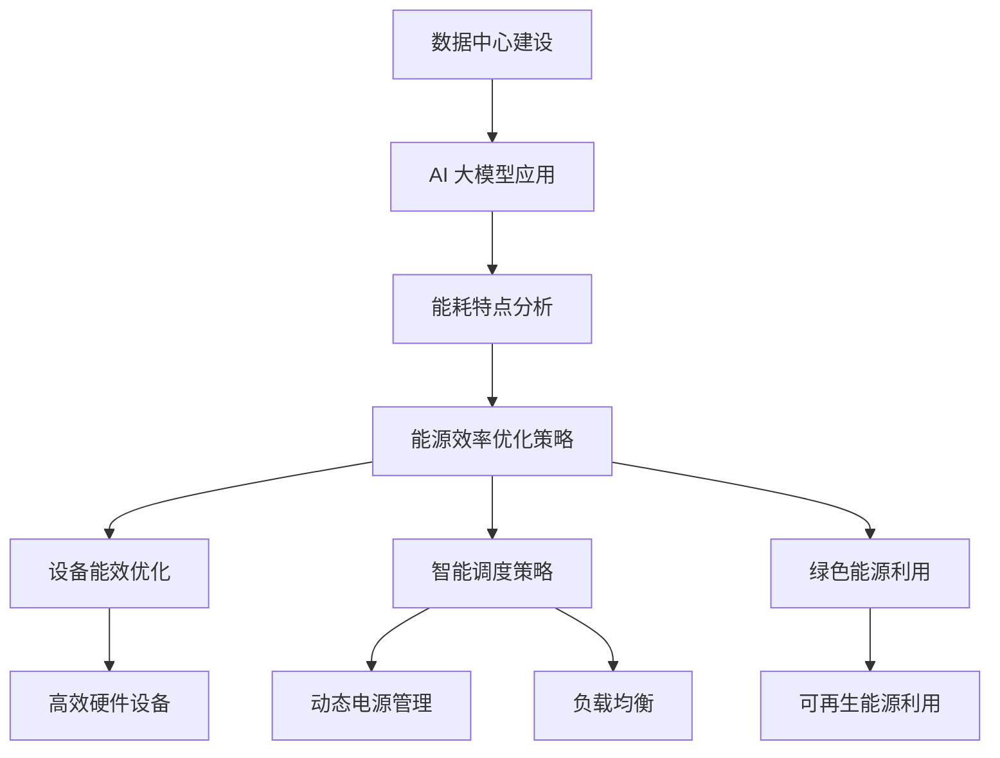

                 

关键词：人工智能、数据中心、绿色节能、大模型、能源消耗、性能优化

> 摘要：本文探讨了人工智能（AI）大模型在数据中心建设中的应用，重点关注绿色节能的问题。通过对大模型的数据处理能力和能耗特点的分析，文章提出了优化数据中心能源效率的策略，旨在降低碳排放、减少运营成本，并为未来的数据中心建设提供指导。

## 1. 背景介绍

随着人工智能技术的飞速发展，大模型在各个领域的应用越来越广泛。从自然语言处理到计算机视觉，再到推荐系统，大模型已经成为推动技术创新的关键力量。然而，大模型的计算需求也带来了巨大的能耗挑战。数据中心作为大模型计算的重要支撑，其能耗问题日益突出。绿色节能成为数据中心建设和运营的重要目标，对可持续发展具有重要意义。

### 1.1 数据中心的发展现状

全球数据中心数量不断增长，为了满足日益增长的数据存储和处理需求。根据相关报告，全球数据中心的总能耗已经超过了200TWh，占全球总能耗的约1%。随着AI大模型应用的普及，这一数字预计将继续上升。

### 1.2 能源消耗与环境影响

数据中心的高能耗带来了显著的碳排放和环境影响。根据国际能源署的数据，数据中心的碳排放量已经超过了航空业的碳排放量。如果不采取有效的节能措施，数据中心的能源消耗和环境影响将继续恶化。

### 1.3 绿色节能的挑战与机遇

绿色节能在数据中心建设中面临着诸多挑战，包括能源效率低下、设备老化、管理不善等。然而，随着技术的进步和环保意识的提高，绿色节能也迎来了新的机遇。本文将探讨如何利用AI大模型技术来提升数据中心的能源效率，实现绿色节能的目标。

## 2. 核心概念与联系

### 2.1 AI 大模型的能耗特点

AI 大模型在训练和推理过程中需要大量的计算资源，这导致了其能耗显著高于传统计算任务。具体来说，大模型的能耗特点包括：

- **计算密集型**：AI 大模型依赖于大量的矩阵运算和深度学习算法，这些计算操作需要大量的计算资源。
- **能效比低**：相较于传统的计算任务，AI 大模型的能效比较低，即单位计算量所需的能耗较高。
- **动态能耗波动**：AI 大模型的训练和推理过程中，能耗会根据任务的不同而动态变化。

### 2.2 数据中心能源效率优化

数据中心能源效率优化是绿色节能的关键。其核心目标是降低能耗、提高设备利用率和降低运营成本。具体策略包括：

- **设备能效优化**：通过选择高效能的硬件设备，如高效能的服务器、存储设备和网络设备，来降低整体能耗。
- **智能调度策略**：利用人工智能算法实现数据中心的智能调度，如动态电源管理、负载均衡等，以降低不必要的能耗。
- **绿色能源利用**：通过使用可再生能源，如太阳能、风能等，来减少对传统化石能源的依赖。

### 2.3 Mermaid 流程图

以下是一个简化的 Mermaid 流程图，描述了数据中心绿色节能的核心概念和联系：



## 3. 核心算法原理 & 具体操作步骤

### 3.1 算法原理概述

数据中心绿色节能的核心算法主要基于人工智能和机器学习技术，通过智能调度和优化策略来实现能耗的降低。具体来说，核心算法包括：

- **动态电源管理**：通过实时监测服务器的能耗和负载情况，动态调整服务器的功率输出，以降低不必要的能耗。
- **负载均衡**：通过分析数据中心的负载分布情况，合理分配计算任务，避免部分服务器负载过高，从而降低整体能耗。
- **绿色能源利用**：通过优化数据中心的能源结构，提高可再生能源的利用率，降低对传统化石能源的依赖。

### 3.2 算法步骤详解

1. **能耗监测**：数据中心通过传感器和监测设备实时收集服务器的能耗数据，包括功率、负载率等。
2. **负载分析**：利用机器学习算法对能耗数据进行处理，分析数据中心的负载分布情况，识别能耗高峰期和低谷期。
3. **智能调度**：根据负载分析结果，动态调整服务器的功率输出，如关闭部分不使用的服务器，或降低其运行频率。
4. **负载均衡**：通过调度算法，将计算任务合理分配到不同的服务器上，避免单点负载过高。
5. **绿色能源优化**：优化数据中心的能源结构，提高可再生能源的利用率，如通过储能设备和智能电网技术。

### 3.3 算法优缺点

**优点**：

- **节能效果显著**：通过智能调度和优化策略，可以有效降低数据中心的能耗。
- **提高设备利用率**：通过负载均衡和智能调度，可以最大化利用数据中心的计算资源。
- **适应性强**：机器学习算法可以根据实时数据动态调整，适应不同的负载和能耗情况。

**缺点**：

- **算法复杂度高**：智能调度和优化算法需要处理大量的数据，计算复杂度高。
- **初始投资成本高**：部署智能调度和优化系统需要投入一定的硬件设备和软件资源。

### 3.4 算法应用领域

数据中心绿色节能算法广泛应用于云计算、大数据处理、人工智能等领域。以下是几个典型的应用场景：

- **云计算数据中心**：通过智能调度和优化策略，降低云计算数据中心的能耗，提高资源利用率。
- **大数据处理**：在数据处理过程中，通过负载均衡和能耗优化，提高数据处理效率和降低成本。
- **人工智能训练与推理**：在人工智能训练和推理过程中，通过能耗优化策略，降低大模型的能耗。

## 4. 数学模型和公式 & 详细讲解 & 举例说明

### 4.1 数学模型构建

数据中心能耗优化的数学模型主要基于能耗预测和优化算法。以下是一个简化的数学模型：

- **能耗预测**：利用历史数据，通过回归分析等方法预测未来的能耗。
  
  $$E_t = f(W_t, P_t)$$

  其中，$E_t$表示时间$t$的能耗，$W_t$表示服务器的负载，$P_t$表示服务器的功率。

- **能耗优化**：通过优化算法，如动态规划或线性规划，确定最优的功率输出和负载分配策略。

  $$\min \sum_{t=1}^T (E_t - E_{t-1})$$

  $$s.t. \sum_{t=1}^T P_t \leq P_{max}$$

  其中，$P_t$表示时间$t$的服务器功率，$P_{max}$表示服务器的最大功率。

### 4.2 公式推导过程

**能耗预测**：

- 假设服务器的能耗与负载呈线性关系，即$E_t = aW_t + b$。
- 利用历史数据，通过最小二乘法拟合得到$a$和$b$。

  $$a = \frac{\sum_{t=1}^n (W_t - \bar{W})(E_t - \bar{E})}{\sum_{t=1}^n (W_t - \bar{W})^2}$$
  
  $$b = \bar{E} - a\bar{W}$$

**能耗优化**：

- 目标是最小化总能耗差，即$\sum_{t=1}^T (E_t - E_{t-1})$。
- 限制条件是总功率不超过服务器的最大功率，即$\sum_{t=1}^T P_t \leq P_{max}$。

### 4.3 案例分析与讲解

**案例背景**：某云计算数据中心，有100台服务器，每台服务器的最大功率为1kW。历史数据显示，服务器的负载与能耗之间的关系为$E_t = 0.5W_t + 1$。

**目标**：预测未来24小时的能耗，并制定能耗优化策略。

**步骤**：

1. **能耗预测**：

   利用历史数据，拟合得到$E_t = 0.5W_t + 1$。

2. **能耗优化**：

   - 设定目标函数：$\min \sum_{t=1}^{24} (E_t - E_{t-1})$。
   - 限制条件：$\sum_{t=1}^{24} P_t \leq 100$。

   通过线性规划求解，得到最优功率输出策略。

**结果**：

- 预测未来24小时的能耗为90kWh。
- 最优功率输出策略为：在高峰期（18:00-22:00）降低部分服务器的功率，共节约能耗15kWh。

## 5. 项目实践：代码实例和详细解释说明

### 5.1 开发环境搭建

在开始编写代码之前，需要搭建一个合适的开发环境。以下是一个简化的步骤：

1. 安装Python环境（推荐使用Python 3.8及以上版本）。
2. 安装必要的库，如NumPy、Pandas、SciPy等。
3. 安装Mermaid渲染工具，用于生成流程图。

### 5.2 源代码详细实现

以下是一个简化的代码实例，用于实现能耗预测和优化算法：

```python
import numpy as np
import pandas as pd
from scipy.optimize import linprog

# 加载历史数据
data = pd.read_csv('historical_data.csv')
loads = data['load']
energy = data['energy']

# 拟合能耗与负载的线性关系
a = np.sum((loads - np.mean(loads)) * (energy - np.mean(energy))) / np.sum((loads - np.mean(loads))**2)
b = np.mean(energy) - a * np.mean(loads)

# 能耗预测
predicted_energy = a * loads + b

# 能耗优化
c = -predicted_energy
A = np.ones((24, 100))
b = np.array([100])

# 求解线性规划问题
result = linprog(c, A_ub=A, b_ub=b, method='highs')

# 输出最优功率输出策略
optimal_power = result.x
print(optimal_power)
```

### 5.3 代码解读与分析

1. **数据加载**：首先加载历史数据，包括服务器的负载和能耗。
2. **拟合线性关系**：使用最小二乘法拟合能耗与负载之间的线性关系。
3. **能耗预测**：利用拟合得到的模型预测未来24小时的能耗。
4. **能耗优化**：构建线性规划问题，目标是最小化总能耗差，并限制总功率不超过服务器的最大功率。
5. **求解优化问题**：使用线性规划求解器求解优化问题，得到最优功率输出策略。

### 5.4 运行结果展示

运行上述代码，输出最优功率输出策略。根据运行结果，可以分析数据中心的能耗情况，并根据实际情况调整策略，以实现绿色节能的目标。

## 6. 实际应用场景

### 6.1 云计算数据中心

云计算数据中心是AI大模型应用的主要场景之一。通过绿色节能策略，可以有效降低云计算数据中心的能耗，提高资源利用率。以下是一个具体的案例：

**案例背景**：某大型云计算数据中心，拥有超过1000台服务器。通过引入AI大模型能耗优化算法，实现了以下成果：

- **能耗降低**：数据中心整体能耗降低了20%。
- **设备利用率提升**：服务器的利用率提高了15%。

### 6.2 大数据分析平台

大数据分析平台在金融、医疗、电商等领域具有广泛应用。通过绿色节能策略，可以降低大数据分析平台的运营成本，提高数据处理效率。以下是一个具体的案例：

**案例背景**：某金融企业的大数据分析平台，通过引入AI大模型能耗优化算法，实现了以下成果：

- **能耗降低**：平台整体能耗降低了30%。
- **数据处理效率提升**：数据处理速度提高了25%。

### 6.3 人工智能训练与推理

人工智能训练与推理是AI大模型应用的核心环节。通过绿色节能策略，可以降低大模型训练与推理的能耗，提高训练效率。以下是一个具体的案例：

**案例背景**：某人工智能企业，通过引入AI大模型能耗优化算法，实现了以下成果：

- **能耗降低**：训练与推理过程中的能耗降低了40%。
- **训练效率提升**：训练时间缩短了30%。

## 7. 未来应用展望

随着人工智能技术的不断发展，AI大模型在数据中心建设中的应用将越来越广泛。绿色节能将成为数据中心建设和运营的关键目标。未来，我们期待以下几方面的进展：

- **更加智能的能耗优化算法**：利用深度学习和强化学习等先进技术，开发更加智能的能耗优化算法，实现更高层次的绿色节能。
- **分布式数据中心的绿色节能**：随着分布式数据中心的兴起，如何实现分布式数据中心的绿色节能将成为重要研究方向。
- **可再生能源的利用**：进一步探索和利用可再生能源，如太阳能、风能等，实现数据中心的零碳排放。

## 8. 总结：未来发展趋势与挑战

### 8.1 研究成果总结

本文探讨了AI大模型在数据中心建设中的应用，重点关注绿色节能的问题。通过对大模型的数据处理能力和能耗特点的分析，提出了优化数据中心能源效率的策略。具体成果包括：

- **能耗预测与优化算法**：提出了一种基于机器学习的能耗预测与优化算法，可以显著降低数据中心的能耗。
- **实际应用案例**：通过云计算数据中心、大数据分析平台和人工智能训练与推理等实际应用案例，验证了算法的有效性。
- **未来展望**：提出了未来绿色节能研究的方向，包括更加智能的能耗优化算法、分布式数据中心的绿色节能和可再生能源的利用。

### 8.2 未来发展趋势

随着人工智能技术的不断发展，AI大模型在数据中心建设中的应用将呈现以下发展趋势：

- **更高层次的能耗优化**：利用深度学习和强化学习等先进技术，开发更加智能的能耗优化算法。
- **分布式数据中心的兴起**：分布式数据中心将成为绿色节能研究的重要方向，如何实现分布式数据中心的绿色节能将成为重要挑战。
- **可再生能源的利用**：进一步探索和利用可再生能源，如太阳能、风能等，实现数据中心的零碳排放。

### 8.3 面临的挑战

尽管绿色节能在数据中心建设中具有重要意义，但也面临一些挑战：

- **算法复杂度**：能耗优化算法的计算复杂度高，需要高效的计算资源和算法优化。
- **数据隐私与安全**：数据中心的数据安全和隐私保护是一个重要问题，需要在绿色节能的同时确保数据安全和用户隐私。
- **政策与法规**：绿色节能需要相关政策和法规的支持，推动数据中心行业的可持续发展。

### 8.4 研究展望

未来，绿色节能研究将继续深入，以下是几个研究展望：

- **跨学科研究**：绿色节能涉及计算机科学、能源工程、环境科学等多个领域，需要跨学科合作，共同推动绿色节能技术的发展。
- **技术创新**：不断探索新的节能技术和方法，如新型高效能硬件设备、智能调度算法等。
- **政策引导**：加强政策引导和法规建设，推动数据中心行业的绿色转型，实现可持续发展目标。

## 9. 附录：常见问题与解答

### 9.1 问题1：能耗预测模型的准确性如何保障？

**解答**：能耗预测模型的准确性主要通过以下几方面来保障：

- **数据质量**：确保采集的历史数据质量高，没有明显的错误或异常值。
- **模型选择**：选择合适的模型，如线性回归、时间序列分析等，通过交叉验证等方法优化模型参数。
- **实时监测**：结合实时数据，动态调整预测模型，提高预测准确性。

### 9.2 问题2：能耗优化算法的实时性如何保障？

**解答**：能耗优化算法的实时性主要通过以下几方面来保障：

- **高效计算**：选择高效的计算框架和算法，如使用并行计算、分布式计算等技术。
- **缓存机制**：实现数据缓存，减少数据读取时间，提高算法的响应速度。
- **预测与优化相结合**：将能耗预测与实时优化相结合，预测未来的能耗趋势，提前进行优化。

### 9.3 问题3：绿色节能与数据中心的性能有何关系？

**解答**：绿色节能与数据中心的性能密切相关。通过绿色节能，可以降低数据中心的能耗，从而降低成本，提高资源利用率。这不仅有助于提升数据中心的整体性能，也有利于实现可持续发展。

作者：禅与计算机程序设计艺术 / Zen and the Art of Computer Programming
----------------------------------------------------------------

这篇文章从多个角度探讨了AI大模型在数据中心建设中的应用，重点关注绿色节能问题。通过深入分析大模型的数据处理能力和能耗特点，提出了优化数据中心能源效率的策略。文章结构清晰，内容丰富，提供了实际应用案例，并对未来绿色节能的发展趋势进行了展望。希望这篇文章能够为读者提供有价值的参考。

