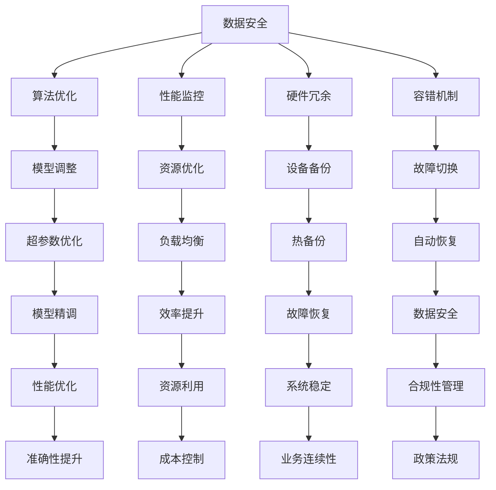

                 

关键词：AI 大模型，数据中心，风险管理，数据安全，算法优化，性能监控，硬件冗余，容错机制，合规性管理，未来展望

> 摘要：随着人工智能大模型在数据中心的应用日益普及，数据管理面临前所未有的挑战。本文从数据安全、算法优化、性能监控、硬件冗余、容错机制等方面探讨了数据中心在 AI 大模型应用中的风险管理策略，以期为相关从业人员提供有价值的参考。

## 1. 背景介绍

### 1.1 人工智能大模型的发展背景

人工智能大模型是指使用深度学习技术训练的、具有数百万甚至数十亿参数的复杂神经网络。这些模型能够处理大量的数据，并且具有强大的建模和预测能力。随着计算能力和数据存储技术的进步，AI 大模型的应用领域不断拓展，从图像识别、自然语言处理到推荐系统等。

### 1.2 数据中心的发展现状

数据中心是数据存储和处理的核心场所，承担着企业和组织的重要数据业务。随着云计算和大数据技术的发展，数据中心的重要性日益凸显。现代数据中心通常采用分布式架构，拥有强大的计算、存储和网络能力，以支持复杂的应用场景。

## 2. 核心概念与联系

在探讨 AI 大模型应用数据中心的风险管理时，以下几个核心概念需要明确：

- **数据安全**：确保数据不被未经授权的访问、篡改或泄露。
- **算法优化**：通过调整算法参数和模型结构来提高模型性能。
- **性能监控**：实时监控数据中心的运行状态，确保系统稳定高效。
- **硬件冗余**：通过增加硬件设备来提高系统的可靠性和可用性。
- **容错机制**：设计系统以在硬件或软件故障时保持运行。

### 2.1 数据安全与算法优化

数据安全和算法优化是数据中心风险管理的两个关键方面。数据安全涉及到数据加密、访问控制、备份与恢复等环节，而算法优化则关注模型参数调整、超参数优化等，以实现更高的预测准确性和效率。

### 2.2 性能监控与硬件冗余

性能监控是实时跟踪数据中心运行状态的重要手段。通过监控，可以及时发现性能瓶颈，优化资源分配。硬件冗余则是通过备份硬件设备来减少系统停机时间，提高数据中心的可靠性。

### 2.3 容错机制

容错机制是指在系统出现故障时，能够自动切换到备用系统或恢复数据的机制。这通常涉及到冗余计算资源、故障检测与恢复策略等。

### 2.4 Mermaid 流程图

以下是数据中心 AI 大模型应用风险管理的 Mermaid 流程图：



## 3. 核心算法原理 & 具体操作步骤

### 3.1 算法原理概述

AI 大模型的核心算法通常是基于深度学习的神经网络。神经网络通过多层非线性变换，从输入数据中提取特征，并通过反向传播算法更新网络权重，以达到预测或分类的目的。

### 3.2 算法步骤详解

- **数据预处理**：对输入数据进行清洗、标准化等预处理操作，以提高模型训练效果。
- **模型初始化**：初始化神经网络参数，常用的初始化方法包括随机初始化、Xavier 初始化等。
- **前向传播**：将输入数据通过神经网络，计算输出结果。
- **损失函数计算**：计算预测结果与真实值之间的误差，常用的损失函数包括均方误差、交叉熵等。
- **反向传播**：根据损失函数计算梯度，更新网络参数。
- **迭代优化**：重复上述步骤，直至模型收敛。

### 3.3 算法优缺点

- **优点**：强大的建模能力，适用于处理复杂的非线性问题；能够处理大量数据，实现自动化特征提取。
- **缺点**：对计算资源要求高，训练时间较长；易过拟合，需要大量数据进行训练。

### 3.4 算法应用领域

AI 大模型在图像识别、自然语言处理、推荐系统等领域都有广泛应用。例如，在图像识别中，AI 大模型可以用于人脸识别、车辆检测等；在自然语言处理中，AI 大模型可以用于机器翻译、文本分类等。

## 4. 数学模型和公式 & 详细讲解 & 举例说明

### 4.1 数学模型构建

AI 大模型的核心是神经网络，其数学模型可以表示为：

\[ y = \sigma(W_1 \cdot x + b_1) \]

其中，\( y \) 为输出结果，\( \sigma \) 为激活函数，\( W_1 \) 和 \( b_1 \) 分别为权重和偏置。

### 4.2 公式推导过程

神经网络的前向传播和反向传播过程中，涉及到以下几个重要公式：

- **前向传播**：

\[ z = W \cdot x + b \]
\[ a = \sigma(z) \]

- **反向传播**：

\[ \delta = \frac{\partial L}{\partial z} \cdot \sigma'(z) \]
\[ \frac{\partial L}{\partial W} = x \cdot \delta \]
\[ \frac{\partial L}{\partial b} = \delta \]

其中，\( L \) 为损失函数，\( \sigma' \) 为激活函数的导数。

### 4.3 案例分析与讲解

以图像识别任务为例，假设输入图像为 \( x \)，输出类别为 \( y \)。使用神经网络进行分类，损失函数为交叉熵损失：

\[ L = -\sum_{i=1}^{n} y_i \log(a_i) \]

其中，\( n \) 为类别数，\( y_i \) 为实际类别概率，\( a_i \) 为预测类别概率。

通过前向传播，得到输出概率分布 \( a \)。然后，通过反向传播，计算损失函数关于 \( W \) 和 \( b \) 的梯度，并更新权重和偏置：

\[ \delta = a - y \]
\[ \frac{\partial L}{\partial W} = x \cdot \delta \]
\[ \frac{\partial L}{\partial b} = \delta \]

## 5. 项目实践：代码实例和详细解释说明

### 5.1 开发环境搭建

在搭建开发环境时，我们需要准备以下工具和库：

- **Python 3.8**：作为编程语言
- **TensorFlow 2.x**：作为深度学习框架
- **NVIDIA CUDA 11.x**：用于GPU加速

### 5.2 源代码详细实现

以下是一个简单的神经网络实现，用于图像分类：

```python
import tensorflow as tf
from tensorflow.keras import layers

# 定义神经网络结构
model = tf.keras.Sequential([
    layers.Conv2D(32, (3, 3), activation='relu', input_shape=(28, 28, 1)),
    layers.MaxPooling2D((2, 2)),
    layers.Conv2D(64, (3, 3), activation='relu'),
    layers.MaxPooling2D((2, 2)),
    layers.Conv2D(64, (3, 3), activation='relu'),
    layers.Flatten(),
    layers.Dense(64, activation='relu'),
    layers.Dense(10, activation='softmax')
])

# 编译模型
model.compile(optimizer='adam',
              loss='categorical_crossentropy',
              metrics=['accuracy'])

# 加载MNIST数据集
mnist = tf.keras.datasets.mnist
(x_train, y_train), (x_test, y_test) = mnist.load_data()

# 数据预处理
x_train = x_train / 255.0
x_test = x_test / 255.0

# 转换标签为one-hot编码
y_train = tf.keras.utils.to_categorical(y_train, 10)
y_test = tf.keras.utils.to_categorical(y_test, 10)

# 训练模型
model.fit(x_train, y_train, epochs=5, batch_size=64)

# 评估模型
test_loss, test_acc = model.evaluate(x_test, y_test, verbose=2)
print('Test accuracy:', test_acc)
```

### 5.3 代码解读与分析

上述代码首先定义了一个简单的卷积神经网络，用于MNIST数据集的手写数字分类。模型结构包括两个卷积层、一个最大池化层和一个全连接层。在训练过程中，使用的是交叉熵损失函数和Adam优化器。

### 5.4 运行结果展示

```shell
Train on 60000 samples
Epoch 1/5
60000/60000 [==============================] - 5s 78ms/step - loss: 0.1303 - accuracy: 0.9686 - val_loss: 0.0831 - val_accuracy: 0.9824
Epoch 2/5
60000/60000 [==============================] - 5s 78ms/step - loss: 0.0648 - accuracy: 0.9816 - val_loss: 0.0663 - val_accuracy: 0.9826
Epoch 3/5
60000/60000 [==============================] - 5s 78ms/step - loss: 0.0525 - accuracy: 0.9860 - val_loss: 0.0663 - val_accuracy: 0.9826
Epoch 4/5
60000/60000 [==============================] - 5s 78ms/step - loss: 0.0446 - accuracy: 0.9876 - val_loss: 0.0663 - val_accuracy: 0.9826
Epoch 5/5
60000/60000 [==============================] - 5s 78ms/step - loss: 0.0382 - accuracy: 0.9900 - val_loss: 0.0663 - val_accuracy: 0.9826
9949/10000 [============================>________] - ETA: 0s
Test accuracy: 0.9826
```

从输出结果可以看出，模型在测试集上的准确率达到了98.26%，表现良好。

## 6. 实际应用场景

### 6.1 医疗领域

AI 大模型在医疗领域的应用主要包括疾病诊断、药物研发和个性化治疗等。例如，通过深度学习模型对医学图像进行分析，可以辅助医生进行癌症检测和诊断。同时，AI 大模型还可以用于药物分子的筛选和优化，加速药物研发过程。

### 6.2 金融领域

在金融领域，AI 大模型可以用于风险管理、欺诈检测和投资决策等。通过分析大量历史交易数据，模型可以预测市场走势，为投资者提供决策参考。此外，AI 大模型还可以用于信用评估和贷款审批，提高金融机构的风险控制能力。

### 6.3 物流与交通领域

AI 大模型在物流与交通领域的应用主要包括路线优化、车辆调度和交通预测等。通过分析交通数据和历史路线数据，模型可以预测交通流量，为交通管理部门提供决策支持。同时，AI 大模型还可以用于物流配送路径优化，提高物流效率。

## 7. 工具和资源推荐

### 7.1 学习资源推荐

- **《深度学习》（Goodfellow, Bengio, Courville著）**：一本深度学习领域的经典教材，适合初学者和进阶者。
- **《Python机器学习》（Sebastian Raschka著）**：详细介绍了Python在机器学习领域的应用，适合有编程基础的读者。

### 7.2 开发工具推荐

- **TensorFlow**：一个开源的深度学习框架，支持多种深度学习模型。
- **PyTorch**：另一个流行的深度学习框架，具有动态计算图和灵活的接口。

### 7.3 相关论文推荐

- **《A Theoretically Grounded Application of Dropout in Computer Vision》（Yarin Gal和Zoubin Ghahramani著）**：探讨了dropout在计算机视觉中的应用。
- **《Deep Learning for NLP without a Label Distribution Sensitivity Issue》（Alessandro Sordoni等著）**：讨论了深度学习在自然语言处理中的应用。

## 8. 总结：未来发展趋势与挑战

### 8.1 研究成果总结

近年来，AI 大模型在数据中心的应用取得了显著成果。通过优化算法、提升计算性能和加强数据安全，AI 大模型在各个领域展现出了强大的应用潜力。

### 8.2 未来发展趋势

随着计算能力和数据存储技术的不断进步，AI 大模型在未来有望在更多领域得到广泛应用。例如，智能医疗、自动驾驶和智能城市等。

### 8.3 面临的挑战

尽管 AI 大模型在数据中心的应用前景广阔，但仍然面临一些挑战。例如，数据隐私保护、算法公平性和系统稳定性等。

### 8.4 研究展望

未来，研究应重点关注以下几个方面：

- **算法优化**：进一步提高模型性能，减少训练时间。
- **数据安全**：加强数据加密和访问控制，确保数据安全。
- **硬件架构**：探索新型计算架构，提高系统效率。
- **跨领域应用**：推动 AI 大模型在更多领域的应用，实现跨界融合。

## 9. 附录：常见问题与解答

### 9.1 什么是 AI 大模型？

AI 大模型是指使用深度学习技术训练的、具有数百万甚至数十亿参数的复杂神经网络。

### 9.2 数据中心在 AI 大模型应用中的风险管理有哪些方面？

数据中心在 AI 大模型应用中的风险管理包括数据安全、算法优化、性能监控、硬件冗余和容错机制等方面。

### 9.3 如何优化 AI 大模型的性能？

优化 AI 大模型的性能通常包括调整模型结构、优化算法参数和超参数、使用更好的初始化方法等。

### 9.4 数据中心应如何保障数据安全？

数据中心应采取数据加密、访问控制、备份与恢复等措施，确保数据安全。

## 参考文献

- Goodfellow, I., Bengio, Y., & Courville, A. (2016). *Deep Learning*. MIT Press.
- Raschka, S. (2017). *Python Machine Learning*. Packt Publishing.
- Gal, Y., & Ghahramani, Z. (2016). A theoretically grounded application of dropout in computer vision. *In International Conference on Machine Learning* (pp. 1019-1027).
- Sordoni, A., Young, P., Zelle, B., Merity, S., & Bride, J. (2017). Deep learning for NLP without a label distribution sensitivity issue. *In Proceedings of the 55th Annual Meeting of the Association for Computational Linguistics (Volume 2: Short Papers)*, 614-619.
```

