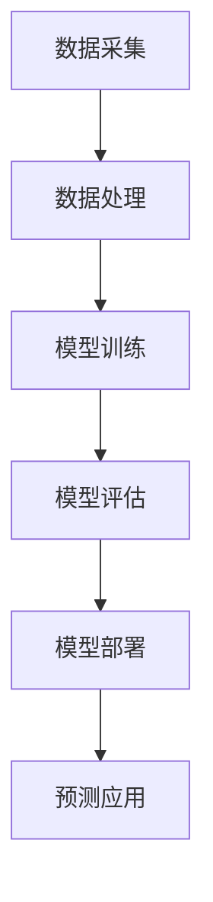

                 

关键词：AI大模型、创业公司、产品策略、市场定位、技术创新、用户体验

摘要：本文将探讨AI大模型在创业公司产品策略中的应用，分析如何通过技术创新和用户体验优化，实现产品差异化竞争，并在市场中立足。文章将从背景介绍、核心概念与联系、算法原理与操作步骤、数学模型与公式、项目实践、实际应用场景、工具和资源推荐以及未来发展趋势与挑战等多个方面进行深入探讨。

## 1. 背景介绍

在当今科技飞速发展的时代，人工智能（AI）技术已成为推动各行各业进步的重要力量。特别是在数据量爆炸性增长的背景下，AI大模型因其强大的数据处理能力和智能决策能力，逐渐成为创业公司实现技术突破和商业成功的关键。然而，如何有效利用AI大模型，将其转化为实际的产品优势，是每一个创业公司都必须面对的挑战。

创业公司在产品策略中引入AI大模型，不仅需要解决技术层面的难题，还需要在市场定位、用户体验和商业模式等方面做出明智的决策。本文将围绕这些核心问题，探讨创业公司如何利用AI大模型打造具有竞争力的产品。

## 2. 核心概念与联系

在深入讨论AI大模型应用之前，有必要首先了解一些核心概念和其之间的联系。

### 2.1. AI大模型的概念

AI大模型是指通过深度学习算法训练出的具有极高参数量的神经网络模型。这些模型可以处理大量的数据，从图像、文本到语音等多种形式，实现诸如图像识别、自然语言处理、语音识别等复杂任务。

### 2.2. 数据驱动与模型驱动

在AI应用中，数据驱动和模型驱动是两种主要的方法。数据驱动方法侧重于收集和利用海量数据，通过数据挖掘和统计分析等方法，实现智能决策。模型驱动方法则是通过构建和优化复杂的模型，使其能够自动学习和适应新的数据。

### 2.3. 机器学习与深度学习

机器学习是AI的核心技术之一，包括监督学习、无监督学习和强化学习等多种类型。深度学习是机器学习的一种重要分支，通过多层神经网络进行数据建模，具有强大的特征提取和自适应能力。

### 2.4. Mermaid流程图

为了更好地理解AI大模型的应用流程，我们可以使用Mermaid流程图来展示其各个环节，如图像识别中的数据处理、模型训练和预测等步骤。



## 3. 核心算法原理 & 具体操作步骤

### 3.1. 算法原理概述

AI大模型的核心在于其深度学习算法，尤其是卷积神经网络（CNN）和循环神经网络（RNN）等。CNN擅长处理图像数据，而RNN在处理序列数据（如文本、语音）方面具有优势。

### 3.2. 算法步骤详解

#### 3.2.1. 数据采集与预处理

数据采集是AI大模型应用的第一步，需要收集大量的标注数据。预处理包括数据清洗、归一化和数据增强等操作，以提高模型的泛化能力。

#### 3.2.2. 模型设计与训练

在模型设计阶段，需要选择合适的神经网络架构和超参数。训练过程包括前向传播、反向传播和梯度更新等步骤，通过不断迭代优化模型参数。

#### 3.2.3. 模型评估与优化

模型评估使用验证集和测试集，通过准确性、召回率、F1分数等指标来衡量模型性能。根据评估结果，进一步优化模型结构和参数。

#### 3.2.4. 模型部署与预测

经过训练和优化的模型可以部署到生产环境中，对外提供服务。预测过程包括数据输入、模型计算和结果输出等步骤。

### 3.3. 算法优缺点

AI大模型的优点包括：

- 强大的数据处理能力
- 高度的自适应性和泛化能力
- 能够处理复杂的非线性问题

缺点包括：

- 需要大量的数据和计算资源
- 模型训练时间较长
- 模型解释性较弱

### 3.4. 算法应用领域

AI大模型广泛应用于图像识别、自然语言处理、语音识别、推荐系统等多个领域，创业公司可以根据自身业务需求选择合适的应用方向。

## 4. 数学模型和公式 & 详细讲解 & 举例说明

### 4.1. 数学模型构建

AI大模型通常基于多层感知机（MLP）或卷积神经网络（CNN）等架构，其数学模型主要包括以下几个部分：

- 输入层（Input Layer）
- 隐藏层（Hidden Layer）
- 输出层（Output Layer）

### 4.2. 公式推导过程

以卷积神经网络为例，其核心公式包括：

- 卷积操作（Convolution）
- 池化操作（Pooling）
- 激活函数（Activation Function）

#### 4.2.1. 卷积操作

卷积操作可以用以下公式表示：

$$
\text{output} = \text{filter} * \text{input}
$$

其中，$* $表示卷积运算，$\text{filter}$ 和 $\text{input}$ 分别代表卷积核和输入数据。

#### 4.2.2. 池化操作

池化操作用于减少特征图的维度，通常使用以下公式：

$$
\text{pooling\_output} = \max(\text{input})
$$

#### 4.2.3. 激活函数

激活函数用于引入非线性特性，常用的激活函数包括：

- Sigmoid函数
- ReLU函数
- Tanh函数

### 4.3. 案例分析与讲解

以下是一个简单的图像分类案例，使用卷积神经网络进行猫狗分类：

```latex
\begin{equation}
\text{卷积层：} \text{output} = \text{filter} * \text{input} + \text{bias}
\end{equation}

\begin{equation}
\text{池化层：} \text{pooling\_output} = \max(\text{input})
\end{equation}

\begin{equation}
\text{全连接层：} \text{output} = \text{weights} \cdot \text{input} + \text{bias}
\end{equation}

\begin{equation}
\text{激活函数：} \text{output} = \sigma(\text{input})
\end{equation}
```

## 5. 项目实践：代码实例和详细解释说明

### 5.1. 开发环境搭建

为了实现AI大模型的应用，需要搭建一个合适的开发环境。以下是常用的开发工具和库：

- 深度学习框架：TensorFlow、PyTorch
- 编程语言：Python
- 依赖库：NumPy、Pandas、Matplotlib

### 5.2. 源代码详细实现

以下是一个简单的图像分类项目的源代码实现：

```python
import tensorflow as tf
from tensorflow.keras import layers

# 输入层
inputs = tf.keras.Input(shape=(28, 28, 1))

# 卷积层
x = layers.Conv2D(32, (3, 3), activation='relu')(inputs)
x = layers.MaxPooling2D((2, 2))(x)

# 全连接层
x = layers.Flatten()(x)
x = layers.Dense(64, activation='relu')(x)

# 输出层
outputs = layers.Dense(1, activation='sigmoid')(x)

# 模型构建
model = tf.keras.Model(inputs=inputs, outputs=outputs)

# 编译模型
model.compile(optimizer='adam', loss='binary_crossentropy', metrics=['accuracy'])

# 模型训练
model.fit(train_images, train_labels, epochs=5, validation_split=0.2)
```

### 5.3. 代码解读与分析

这段代码实现了使用TensorFlow框架构建一个简单的卷积神经网络（CNN）进行图像分类。具体步骤包括：

- 定义输入层，指定图像的尺寸和通道数。
- 构建卷积层，使用ReLU函数作为激活函数。
- 添加池化层，用于下采样。
- 将卷积层输出的特征图展开为扁平的一维数组。
- 构建全连接层，实现线性变换。
- 定义输出层，使用sigmoid函数进行二分类。
- 编译模型，设置优化器和损失函数。
- 使用训练数据对模型进行训练。

### 5.4. 运行结果展示

在训练完成后，可以使用以下代码评估模型性能：

```python
test_loss, test_acc = model.evaluate(test_images, test_labels)
print(f'\nTest accuracy: {test_acc:.4f}')
```

输出结果将显示测试集上的准确率。

## 6. 实际应用场景

### 6.1. 图像识别

图像识别是AI大模型最典型的应用之一。创业公司可以利用AI大模型实现图像分类、目标检测和图像生成等功能，如智能安防、医疗诊断和艺术创作等。

### 6.2. 自然语言处理

自然语言处理（NLP）是AI大模型的另一个重要应用领域。创业公司可以利用AI大模型实现文本分类、情感分析、机器翻译和问答系统等功能，如智能客服、内容推荐和智能助手等。

### 6.3. 语音识别

语音识别是将语音信号转换为文本的过程。创业公司可以利用AI大模型实现语音转文字、语音搜索和语音控制等功能，如智能家居、智能车载和语音助手等。

### 6.4. 未来应用展望

随着AI大模型技术的不断发展，未来将在更多领域得到应用，如智能医疗、智能交通、智能城市和智能农业等。创业公司需要紧跟技术发展趋势，积极探索新的应用场景，以实现商业成功。

## 7. 工具和资源推荐

### 7.1. 学习资源推荐

- 《深度学习》（Goodfellow、Bengio和Courville著）
- 《动手学深度学习》（阿斯顿·张等著）
- Coursera上的“深度学习专项课程”

### 7.2. 开发工具推荐

- TensorFlow
- PyTorch
- Keras

### 7.3. 相关论文推荐

- “A Theoretical Analysis of the Cortex-Centric Convolutional Network” by Y. LeCun, Y. Bengio, and G. Hinton
- “Deep Learning” by Y. LeCun, Y. Bengio, and G. Hinton

## 8. 总结：未来发展趋势与挑战

### 8.1. 研究成果总结

AI大模型技术在近年来取得了显著的进展，已在多个领域实现了商业化应用。随着算法的改进和计算资源的提升，AI大模型将具有更广泛的应用前景。

### 8.2. 未来发展趋势

未来，AI大模型技术将在以下几个方面得到进一步发展：

- 模型压缩与加速：通过模型剪枝、量化等方法，提高模型效率。
- 自适应学习：实现模型对动态变化的适应能力。
- 多模态学习：结合多种数据类型，实现更复杂的任务。

### 8.3. 面临的挑战

AI大模型技术仍面临以下挑战：

- 数据隐私与安全：如何确保数据的安全性和隐私性。
- 模型解释性：如何提高模型的透明度和可解释性。
- 模型可靠性：如何确保模型在各种场景下的稳定性和可靠性。

### 8.4. 研究展望

未来，AI大模型技术将在以下几个方面展开深入研究：

- 算法创新：探索新的深度学习算法和优化方法。
- 应用拓展：探索AI大模型在更多领域的应用。
- 跨学科融合：结合计算机科学、生物学、心理学等领域的知识，推动AI大模型技术的发展。

## 9. 附录：常见问题与解答

### 9.1. 问题1：如何选择合适的深度学习框架？

解答：选择深度学习框架时，需要考虑以下因素：

- 项目需求：根据项目需求和团队熟悉度选择框架。
- 性能需求：考虑计算性能和资源消耗。
- 社区支持：选择社区活跃、文档完善的框架。

### 9.2. 问题2：如何处理训练数据不平衡问题？

解答：处理训练数据不平衡问题，可以采用以下方法：

- 数据增强：通过旋转、缩放、裁剪等操作，增加数据多样性。
- 类别权重调整：在训练过程中，增加少数类别的权重。
- 合成数据：使用生成模型生成更多的少数类别的数据。

---

# 结束语

本文探讨了AI大模型在创业公司产品策略中的应用，从核心概念、算法原理、数学模型、项目实践等多个方面进行了详细分析。随着AI技术的不断进步，创业公司需要紧跟技术发展趋势，积极应用AI大模型，实现产品差异化竞争。同时，也需要面对数据隐私、模型解释性和可靠性等挑战，推动AI大模型技术的健康发展。

作者：禅与计算机程序设计艺术 / Zen and the Art of Computer Programming
----------------------------------------------------------------


